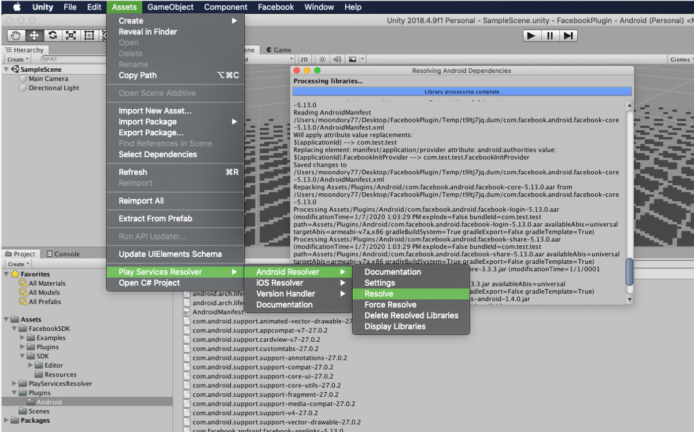
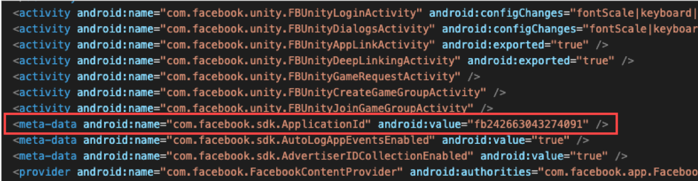

#### **为提供 NAVER CLOUD PLATFORM 产品的详细使用方法和 API 的多种使用方式，分别提供<a href="https://guide.ncloud-docs.com/docs/zh/home" target="_blank">[说明书]</a>和<a href="https://api.ncloud-docs.com/docs/zh/home" target="_blank">[API 参考指南]</a>以供参考。**

<a href="https://api.ncloud-docs.com/docs/zh/game-gamepot-index" target="_blank">进入 Gamepot API 参考指南 >></a><br />
<a href="https://guide.ncloud-docs.com/docs/zh/game-gamepotconsole" target="_blank">进入 Gamepot 说明书 >></a>

# 第三方 SDK

本指南意在确保在游戏项目中应用 GAMEPOT SDK 以外的第三方 SDK 时不发生构建错误。

> 以各 SDK 的指南为准进行描述，API 应用方法请参考各 SDK 的指南。

## Naver cafe SDK

### Android

> 准备中。

### iOS

> 准备中。

### Unity\([链接](https://github.com/naver/cafe-sdk-unity)\)

⒈ 导入 Unity 包时，请排除以下几个文件。


## Adjust

### Android\([链接](https://github.com/adjust/android_sdk/blob/master/doc/korean/README.md#qs-getting-started)\)

⒈ 在`build.gradle`中添加包时，下面的两个包已包含在内，请忽略。

```java
implementation 'com.android.installreferrer:installreferrer:1.0'
implementation 'com.google.android.gms:play-services-analytics:16.0.4'
```

⒉ `AndroidManifest.xml`中已添加权限，请忽略。

```java
<uses-permission android:name="android.permission.INTERNET" />
<uses-permission android:name="android.permission.ACCESS_NETWORK_STATE" />
```

### iOS\([链接](https://github.com/adjust/ios_sdk/blob/master/README.md)\)

- 不存在与 Gamepot 冲突的事项。

### Unity\([链接](https://github.com/adjust/unity_sdk#qs-get-sdk)\)

- 不存在与 Gamepot 冲突的事项。

## Adbrix

### Android

> 准备中。

### iOS

> 准备中。

### Unity \([链接](https://help.adbrix.io/hc/ko/articles/360007861793-%EC%95%A0%EB%93%9C%EB%B8%8C%EB%A6%AD%EC%8A%A4-Android-%EC%97%B0%EB%8F%99%ED%95%98%EA%B8%B0-Unity-#toc2)\)

⒈ 导入 Unity 包时，请排除以下几个文件。


⒉ 请下载下列补丁。\([下载](https://kr.object.ncloudstorage.com/itsb/gamepot-bridge.aar.zip)\)

⒊ 请用下载的“gamepot-bridge.aar”文件替换以下路径下的文件。

> /Assets/Android/libs/gamepot-bridge.aar

⒋ 须从 Adbrix 导入所需设置并插入/Assets/Plugins/Android/AndroidManifest.xml 中。
详细信息请参考 Adbrix SDK 指南。\([指南](https://help.adbrix.io/hc/ko/articles/360007861793-%EC%95%A0%EB%93%9C%EB%B8%8C%EB%A6%AD%EC%8A%A4-Android-%EC%97%B0%EB%8F%99%ED%95%98%EA%B8%B0-Unity-#toc6)\)

## Singular

### Android\([链接](https://developers.singular.net/docs/android-sdk)\)

_`[sdk v9.2.0]`_

⒈ 在应用级别的`build.gradle`中添加包时，下面的包已包含在内，请忽略。

```java
compile 'com.android.installreferrer:installreferrer:1.0'
```

⒉ `AndroidManifest.xml`中已添加权限，请忽略。

```java
<uses-permission android:name="android.permission.INTERNET" />
<uses-permission android:name="android.permission.ACCESS_NETWORK_STATE" />
```

### iOS\([链接](https://developers.singular.net/docs/ios-sdk)\)

_`[sdk v9.2.0]`_

- 不存在与 Gamepot 冲突的事项。

### Unity\([链接](https://developers.singular.net/docs/unity-sdk)\)

_`[sdk v9.2.0]`_

- 请删除以下路径下的库文件。

> `Assets/Plugins/Android/libs/installreferrer-1.0.aar`

## Appsflyer

### Android

> 准备中。

### iOS

> 准备中。

### Unity

> 准备中。

## AdMob

**_`受androidx包的迁移问题影响，包含Google Play Service 18.0.0以上版本的sdk无法使用。`_**

### Android\([链接](https://firebase.google.com/docs/admob/android/quick-start?hl=ko)\)

- Gamepot 服务支持 Firebase Messaging 服务。请通过 Admob with Firebase 进行设置。

### iOS\([链接](https://developers.google.com/admob/ios/quick-start?hl=ko)\)

- 不存在与 Gamepot 冲突的事项。

### Unity\([链接](https://github.com/googleads/googleads-mobile-unity/releases/tag/3.17.0)\)

_`[Google Mobile Ads v3.17.0]`_

⒈ 通过上面的链接在游戏项目中导入插件（v3.17.0）。

⒉ 在`mainTemplate.gradle`中添加 AdMob Android 项目，具体如下。


⒊ AdMob SDK（Unity）须在导入 Unity 包后使用 Unity Play Services Resolver 功能。（参考 AdMob 指南）

- 应用 Resolve 功能时，当前已在 GAMEPOT SDK 中使用的库和重复的库也将一并复制。
- 请在/Assets/Plugins/Android/libs/中删除与 AdMob SDK 重复的库列表。

- 须删除的库列表如下。

  |                                       |                                               |
  | :------------------------------------ | :-------------------------------------------- |
  | 1. core-common-1.1.0.jar              | 2. lifecycle-common-1.1.0.jar                 |
  | 3. lifecycle-runtime-1.1.0.aar        | 4. customtabs-27.1.1.aar                      |
  | 5. support-annotations-27.1.1.jar     | 6. support-compat-27.1.1.aar                  |
  | 7. support-core-ui-27.1.1.aar         | 8. support-core-utils-27.1.1.aar              |
  | 9. support-fragment-27.1.1.aar        | 10. support-media-compat-27.1.1.aar           |
  | 11. support-v4-27.1.1.aar             | 12. play-services-ads-identifier-16.0.0.aar   |
  | 13. play-services-basement-16.2.0.aar | 14. play-services-measurement-base-16.0.5.aar |
  |                                       |                                               |

## Admob Mediation

**_`受androidx包的迁移问题影响，包含Google Play Service 18.0.0以上版本的sdk无法使用。`_**

### Android\([链接](https://developers.google.com/admob/android/mediate)\)

_`[Google Play service Ads SDK 17.2.0]`_

#### - Vungle\([链接](https://developers.google.com/admob/android/mediation/vungle)\)

- 不存在与 Gamepot 冲突的事项。\(Vungle sdk 6.3.24\)

#### - Unity Ads\([链接](https://developers.google.com/admob/android/mediation/unity)\)

- 在应用级别的`build.gradle`中添加包时，请添加下面的包。

```java
compile 'com.google.ads.mediation:unity:3.1.0.0'
```

#### - Facebook\([链接](https://developers.google.com/admob/android/mediation/facebook)\)

- 在应用级别的`build.gradle`中添加包时，请添加下面的包。

```java
compile 'com.google.ads.mediation:facebook:5.4.0.0'
```

### iOS\([链接](https://developers.google.com/admob/ios/mediate)\)

_`[Google Mobile Ads SDK 7.49.0]`_

#### - Vungle\([链接](https://developers.google.com/admob/ios/mediation/vungle)\)

- 不存在与 Gamepot 冲突的事项。\(Vungle sdk 6.3.2\)

#### - Unity Ads\([链接](https://developers.google.com/admob/ios/mediation/unity)\)

- 不存在与 Gamepot 冲突的事项。\(UnityAds sdk 3.2.0\)

#### - Facebook\([链接](https://developers.google.com/admob/ios/mediation/facebook)\)

- 不存在与 Gamepot 冲突的事项。\(iOS Audience Network sdk 5.5.0\)

### Unity\([链接](https://github.com/googleads/googleads-mobile-unity/releases/tag/3.17.0)\)

_`[Google Mobile Ads Unity Plugin v3.17.0]`_

#### - Vungle\([链接](https://developers.google.com/admob/unity/mediation/vungle)\)

- 不存在与 Gamepot 冲突的事项。

#### - Unity Ads\([链接](https://developers.google.com/admob/unity/mediation/unity)\)

- 不存在与 Gamepot 冲突的事项。

#### - Facebook\([链接](https://developers.google.com/admob/unity/mediation/facebook)\)

- 不存在与 Gamepot 冲突的事项。

## Facebook SDK（Unity 插件）

### Unity\([链接](https://developers.facebook.com/docs/unity/downloads)\)

_`[FB UnityPackage ver 7.18.0]`_

⒈ 请导入 Unity 包后应用 Unity Play Services Resolver。



- 应用 Resolve 功能时，当前已在 GAMEPOT SDK 中使用的库和重复的库也将一并复制。

- 请在/Assets/Plugins/Android/libs/中删除与 Facebook SDK 重复的库列表。

- 须删除的库列表如下。

  |                                        |                                        |
  | :------------------------------------- | :------------------------------------- |
  | 1. animated-vector-drawable-27.1.1.aar | 2. appcompat-v7-27.1.1.aar             |
  | 3. bolts-android-1.4.0.jar             | 4. bolts-applinks-1.4.0.jar            |
  | 5. bolts-tasks-1.4.0.jar               | 6. cardview-v7-27.0.2.aar              |
  | 7. core-3.3.0.jar                      | 8. core-common-1.1.0.jar               |
  | 9. customtabs-27.1.1.aar               | 10. facebook-android-sdk-5.2.0.aar     |
  | 11. facebook-applinks-5.2.0.aar        | 12. facebook-common-5.2.0.aar          |
  | 13. facebook-core-5.2.0.aar            | 14. facebook-login-5.2.0.aar           |
  | 15. facebook-messenger-5.2.0.aar       | 16.facebook-places-5.2.0.aar           |
  | 17. facebook-share-5.2.0.aar           | 18. lifecycle-runtime-1.1.0.aar        |
  | 19. lifecycle-common-1.1.0.jar         | 20. support-compat-27.1.1.aar          |
  | 21. support-core-ui-27.1.1.aar         | 22. support-core-utils-27.1.1.aar      |
  | 23. support-fragment-27.1.1.aar        | 24. support-media-compat-27.1.1.aar    |
  | 25. support-v4-27.1.1.aar              | 26. support-vector-drawable-27.1.1.aar |
  | 27. support-annotations-27.1.1.jar     |
  |                                        |                                        |

- （iOS 中）请在/Assets/Plugins/IOS/Frameworks/中删除重复的框架列表。

  |                            |     |
  | :------------------------- | :-- |
  | 1. FBSDKCoreKit.framework  |
  | 2. FBSDKLoginKit.framework |
  |                            |     |

⒉ 请在 UnityEditer 上的 FacebookSettings 中输入 Facebook App Id，然后点击红色按钮，重新生成 AndroidManifest。


⒊ 请在编辑器中打开/Assets/Plugins/Android/AndroidManifest.xml，删除红色内容（Facebook App ID）。


