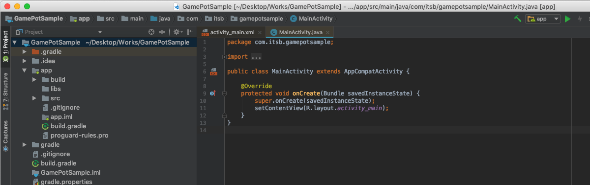
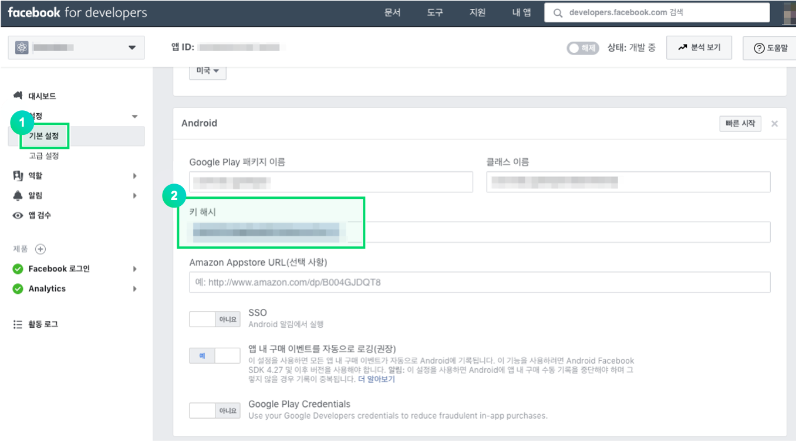

---
search:
  keyword: ['gamepot']
---

#### **为提供 NAVER CLOUD PLATFORM 产品的详细使用方法和 API 的多种使用方式，分别提供<a href="https://guide.ncloud-docs.com/docs/zh/home" target="_blank">[说明书]</a>和<a href="https://api.ncloud-docs.com/docs/zh/home" target="_blank">[API 参考指南]</a>以供参考。**

<a href="https://api.ncloud-docs.com/docs/zh/game-gamepot" target="_blank">进入 Gamepot API 参考指南 >></a><br />
<a href="https://guide.ncloud-docs.com/docs/zh/game-gamepotconsole" target="_blank">进入 Gamepot 说明书 >></a>

# Android SDK

> ### 这是机器翻译的文档，可能在词汇，语法或语法上有错误。 我们很快会为您提供由专业翻译人员翻译的文档。
>
> #### 如有任何疑问，请[联系我们](https://www.ncloud.com/support/question)。
>
> 我们将尽一切努力进一步改善我们的服务。

## 1. 入门

### 配置开发环境

为了开发安卓用应用程序，提前需要安装开发工具\(例如 Android Studio\)。根据所使用的开发工具也许可能需要安装其他 Java SDK 和 Android SDK。

在 Android 上使用 GAMEPOT 所需要的系统环境为如下。

\[ 系统环境 \]

- 最低配置: API 17 \(Jelly Bean, 4.2\)以上, gradle 3.3.3 或 gradle 3.4.3 或更高
- 开发环境: Android Studio

#### 创建项目



#### 添加库

请把下载的 AOS SDK 文档添加到 app/libs 文件夹里。


#### 设置 build.gradle

build.gradle 文件同时存在于项目 root 文件夹和 app 文件夹中

1. 修改项目 root 文件夹的 build.gradle 文件

   ```java
   buildscript {

       repositories {
           ...
           google()
           jcenter()
           maven { url "https://jitpack.io" }
           maven { url "https://jcenter.bintray.com" }
       }
       dependencies {
          ...
           classpath 'com.google.gms:google-services:4.2.0'
       }
   }

   allprojects {
       repositories {
           ...
           google()
           jcenter()
           maven { url "https://jitpack.io" }
           maven { url "https://jcenter.bintray.com" }
       }
   }
   ```

2. 修改 app 文件夹的 build.gradle

   > \[xxxxx\]里请输入实际所使用的值。

| 值                           | 说明                                                                                      |
| :--------------------------- | :---------------------------------------------------------------------------------------- |
| gamepot_project_id           | 请输入 GAMEPOT 发布的项目 ID。                                                            |
| gamepot_store                | 储值（`google`或`one`或`银河`)                                                            |
| gamepot_payment              | 付款方式值（仅在商店为 google 时适用，当前支持`mycard` ）                                 |
| gamepot_app_title            | 应用标题（FCM ）                                                                          |
| gamepot_push_default_channel | 注册的默认频道名称（默认）-请勿更改。                                                     |
| facebook_app_id              | Facebook 应用程序 ID                                                                      |
| fb_login_protocol_scheme     | Facebook 发布的协议方案 fb \[app_id \]                                                    |
| gamepot_elsa_projectid       | 使用 NCLOUD ELSA 时的项目 ID （[阅读更多](https://www.ncloud.com/product/analytics/elsa)) |

```java
android {
    defaultConfig {
        ...
        // GamePot [START]
        resValue "string", "gamepot_project_id", "[projectId]" // required
        resValue "string", "gamepot_store", "[storeId]" // required
        resValue "string", "gamepot_payment", "[storeId]" // optional
        resValue "string", "gamepot_app_title","@string/app_name" // required (fcm)
        resValue "string", "gamepot_push_default_channel","Default" // required (fcm)
        resValue "string", "facebook_app_id", "[Facebook ID]" // facebook
        resValue "string", "fb_login_protocol_scheme", "fb[Facebook ID]" // (facebook)
        // resValue "string", "gamepot_elsa_projectid", "" // (ncp elsa)
        // GamePot [END]
    }

    packagingOptions {
        exclude 'META-INF/proguard/androidx-annotations.pro'
    }
}

repositories {
    flatDir {
        dirs 'libs'
    }
}

dependencies {
    implementation 'androidx.appcompat:appcompat:1.2.0'
    implementation 'androidx.multidex:multidex:2.0.1'

    // GamePot common [START]
    implementation(name: 'gamepot-common', ext: 'aar')
    implementation('io.socket:socket.io-client:1.0.0') {
        exclude group: 'org.json', module: 'json'
    }
    implementation('com.github.ihsanbal:LoggingInterceptor:3.0.0') {
        exclude group: 'org.json', module: 'json'
    }
    implementation "com.github.nisrulz:easydeviceinfo:2.4.1"
    implementation 'pub.devrel:easypermissions:1.3.0'
    implementation 'com.android.installreferrer:installreferrer:1.0'
    implementation 'com.google.code.gson:gson:2.8.2'
    implementation 'com.jakewharton.timber:timber:4.7.0'
    implementation 'com.squareup.okhttp3:okhttp:4.9.1'
    implementation 'com.apollographql.apollo:apollo-runtime:1.0.0-alpha2'
    implementation 'com.apollographql.apollo:apollo-android-support:1.0.0-alpha2'
    implementation 'com.android.billingclient:billing:3.0.3'
    implementation 'com.github.bumptech.glide:glide:3.7.0'
    implementation 'com.romandanylyk:pageindicatorview:1.0.3'
    implementation 'androidx.sqlite:sqlite-framework:2.0.1'
    implementation 'com.cookpad.puree:puree:4.1.6'
    implementation 'com.google.firebase:firebase-core:18.0.1'
    implementation 'com.google.firebase:firebase-messaging:21.0.1'
    // GamePot common [END]

    implementation(name: 'gamepot-channel-base', ext: 'aar')
    // GamePot facebook [START]
    implementation(name: 'gamepot-channel-facebook', ext: 'aar')
    implementation 'com.facebook.android:facebook-android-sdk:8.1.0'
    // GamePot facebook [END]

    // GamePot google sigin [START]
    implementation(name: 'gamepot-channel-google-signin', ext: 'aar')
    implementation "com.google.android.gms:play-services-auth:19.0.0"
    // GamePot google sigin [END]
}

// ADD THIS AT THE BOTTOM
apply plugin: 'com.google.gms.google-services'
```

3. 复制 Google 在/ app /文件夹下发布的 google-service.json 文件。
4. Gradle Sync Now

   在 Android Studio 中，点击下面的按钮进行刷新。


- 单击刷新后可能发生的故障

  - Configuration 'compile' is obsolete and has been replaced with 'implementation' and 'api'. It will be removed at the end of 2018. For more information see: [http://d.android.com/r/tools/update-dependency-configurations.html](http://d.android.com/r/tools/update-dependency-configurations.html)

    > 使用 Gradle 版本 3 或更高版本时实施编译

  - No matching client found for package name 'packagename'

    > 更改应用程序的软件包名称，使其与 google-service.json 中声明的软件包名称匹配。

#### AndroidManifest.xml 设定值

添加游戏中常用的设置。 请参阅代码以获取每种设置的详细说明。

> 作为建议，请考虑是否适用于开发商。

```xml
<?xml version="1.0" encoding="utf-8"?>
<manifest xmlns:android="http://schemas.android.com/apk/res/android"
    xmlns:tools="http://schemas.android.com/tools">

    <!--设置为无电话功能的设备上也可以从渠道下载应用-->
    <uses-feature android:name="android.hardware.telephony" android:required="false" />
    <!--设置为具有语音聊天的游戏，让没有麦克风的设备也可以从渠道下载应用-->
    <uses-feature android:name="android.hardware.microphone" android:required="false" />

    <!--allowBackup务必要设置为false。(为了防止重新安装游戏的时候自动恢复shared preference值。)-->
    <application
        android:name="androidx.multidex.MultiDexApplication"
        android:allowBackup="false"
        tools:replace="android:allowBackup">

        <!--resizeableActivity : 禁止使用应用拆分画面屏幕-->
        <activity
            android:resizeableActivity="false">
            <intent-filter>
                <action android:name="android.intent.action.MAIN" />
                <category android:name="android.intent.category.LAUNCHER" />
            </intent-filter>
        </activity>

        <!--支持Galaxy S8的屏幕-->
        <meta-data android:name="android.max_aspect" android:value="2.1" />

    </application>
</manifest>
```

#### 设置 Push Notification 图标


收到推送后，通知栏中显示的图标基本上会作为 SDK 中的默认图像处理，并且可以直接插入以匹配游戏。

**直接插入图标**

> [Android Asset Studio](http://romannurik.github.io/AndroidAssetStudio/icons-notification.html#source.type=clipart&source.clipart=ac_unit&source.space.trim=1&source.space.pad=0&name=ic_stat_gamepot_small)使用图标创建图标时，会自动为每个文件夹创建一个图标，只需将其放在每个文件夹中即可。

1. 创建如下与 res/drawable 相关的文件夹
   - res/drawable-mdpi/
   - res/drawable-hdpi/
   - res/drawable-xhdpi/
   - res/drawable-xxhdpi/
   - res/drawable-xxxhdpi/
2. 以下尺寸的图像制作
   - 24x24
   - 36x36
   - 48x48
   - 72x72
   - 96x96
3. 添加图像以适合每个文件夹的大小，如下所示。

| 资料夹名称            | 尺寸  |
| :-------------------- | :---- |
| res/drawable-mdpi/    | 24x24 |
| res/drawable-hdpi/    | 36x36 |
| res/drawable-xhdpi/   | 48x48 |
| res/drawable-xxhdpi/  | 72x72 |
| res/drawable-xxxhdpi/ | 96x96 |

1. 将图片文件名更改为`ic_stat_gamepot_small`

## 2. 初始化

在 MainActivity.java 文件里添加下面内容。

```java
import io.gamepot.common.GamePot;
import io.gamepot.common.GamePotLocale;

@Override
protected void onCreate(Bundle savedInstanceState) {
    super.onCreate(savedInstanceState);
    // 初始化GAMEPOT。context必须要放入application context。
    // setup API需要比其他API首先调用才可以。
    GamePot.getInstance().setup(getApplicationContext());
}

@Override
protected void onActivityResult(int requestCode, int resultCode, Intent data) {
    super.onActivityResult(requestCode, resultCode, data);
    GamePot.getInstance().onActivityResult(requestCode, resultCode, data);
}

@Override
protected void onStart() {
    super.onStart();
    GamePotChat.getInstance().start();
    GamePot.getInstance().onStart(this);
}

@Override
protected void onStop() {
    super.onStop();
    GamePotChat.getInstance().stop();
}

@Override
protected void onDestroy() {
    super.onDestroy();
    GamePot.getInstance().onDestroy();
}
```

## 3. 登录，退出，注销

可以集成使用各种登录 SDK。如 Google，FaceBook，Naver 等。

### 设置 Google\(Firebase\) Console

编译 APK 时所使用的 Keystore 的 SHA-1 值添加到 Firebase console。

> 请求开发公司提供 SHA-1 值。


### 设置 FaceBook Console

编译 APK 时所使用的 Keystore 的 key hash 值添加到 FaceBook Console 上。

> 请求开发公司提供 Key hash 值。



### 设置

#### 修改 MainActivity.java 文件

声明登录相关代码，如下。

```java
import io.gamepot.channel.GamePotChannel;
import io.gamepot.channel.GamePotChannelType;
import io.gamepot.channel.facebook.GamePotFacebook;
import io.gamepot.channel.google.signin.GamePotGoogleSignin;

public class MainActivity extends AppCompatActivity {
    @Override
    protected void onCreate(Bundle savedInstanceState) {
        // setup API需要首先调用。
        GamePot.getInstance().setup(getApplicationContext());

        ...
        // 所要使用登录的每个频道请调用addChannel。(Guest方式默认包含)
        // 初始化Google Login
        GamePotChannel.getInstance().addChannel(this, GamePotChannelType.GOOGLE, new GamePotGoogleSignin());
        // 初始化Facebook Login
        GamePotChannel.getInstance().addChannel(this, GamePotChannelType.FACEBOOK, new GamePotFacebook());
        ...
    }

    @Override
    protected void onActivityResult(int requestCode, int resultCode, Intent data) {
        super.onActivityResult(requestCode, resultCode, data);
        GamePotChannel.getInstance().onActivityResult(this, requestCode, resultCode, data);
    }

    @Override
    protected void onDestroy() {
        super.onDestroy();
        GamePotChannel.getInstance().onDestroy();
    }
}
```

### 登录

登录 UI 需要由开发公司来支持实现，将点击登录按钮时调用登录相关代码。

```java
import io.gamepot.channel.GamePotChannel;
import io.gamepot.channel.GamePotChannelListener;
import io.gamepot.channel.GamePotChannelType;
import io.gamepot.channel.GamePotUserInfo;
import io.gamepot.common.GamePotError;

// 定义登录类型
// GamePotChannelType.GOOGLE: Google
// GamePotChannelType.FACEBOOK: FaceBook
// GamePotChannelType.NAVER: Naver
// GamePotChannelType.LINE: LINE
// GamePotChannelType.TWITTER: Twitter
// GamePotChannelType.APPLE: Apple
// GamePotChannelType.GUEST: 游客

// 点击Google登录按钮的时候调用
GamePotChannel.getInstance().login(this, GamePotChannelType.GOOGLE, new GamePotChannelListener<GamePotUserInfo>() {
    @Override
    public void onCancel() {
        // 用户取消登录
    }

    @Override
    public void onSuccess(GamePotUserInfo userinfo) {
        // 登录成功。依照游戏逻辑处理。
        // userinfo.getMemberid() : 会员唯一ID
    }

    @Override
    public void onFailure(GamePotError error) {
        // 登录失败。请使用error.getMessage()来显示错误信息。
    }
});
```

#### 会员唯一 ID

```java
GamePot.getInstance().getMemberId();
```

### 自动登录

可以使用传达用户最终登录信息的 API 实现自动登录。

```java
import io.gamepot.channel.GamePotChannel;
import io.gamepot.channel.GamePotChannelListener;
import io.gamepot.channel.GamePotChannelType;
import io.gamepot.channel.GamePotUserInfo;
import io.gamepot.common.GamePotError;

// 传达用户最终登录信息的API
final GamePotChannelType lastLoginType = GamePotChannel.getInstance().getLastLoginType();

if(lastLoginType != GamePotChannelType.NONE) {
    // 使用最终登录的登录类型来登录的方式。
    GamePotChannel.getInstance().login(this, lastLoginType, new GamePotChannelListener<GamePotUserInfo>() {
        @Override
        public void onCancel() {
            // 用户取消登录。
        }

        @Override
        public void onSuccess(GamePotUserInfo info) {
            // 自动登录成功。依照游戏逻辑处理。
        }

        @Override
        public void onFailure(GamePotError error) {
            // 自动登录失败。请使用error.getMessage()来显示错误信息。
        }
    });
}
else
{
    // 首次启动游戏或者退出状态。请移动至可以登录的登录界面。
}
```

### 退出

退出目前会员账号。

```java
import io.gamepot.channel.GamePotChannel;
import io.gamepot.common.GamePotCommonListener;
import io.gamepot.common.GamePotError;

GamePotChannel.getInstance().logout(this, new GamePotCommonListener() {
    @Override
    public void onSuccess() {
        // 退出成功。请移动至初始界面。
    }

    @Override
    public void onFailure(GamePotError error) {
        // 退出失败。请使用error.getMessage()来显示错误信息。
    }
});
```

### 账户注销

注销目前的会员账户。

```java
import io.gamepot.channel.GamePotChannel;
import io.gamepot.common.GamePotCommonListener;
import io.gamepot.common.GamePotError;

GamePotChannel.getInstance().deleteMember(this, new GamePotCommonListener() {
    @Override
    public void onSuccess() {
        // 注销成功。请移动至初始界面。
    }

    @Override
    public void onFailure(GamePotError error) {
        // 注销失败。请使用error.getMessage()来显示错误信息。
    }
});
```

### 验证

完成登录后，通过将登录信息从开发者服务器传递到 GAMEPOT 服务器来执行登录验证。

有关更多信息，请参阅“服务器到服务器 api”菜单中的“身份验证检查”项。

## 4.帐户关联

可以将多个社交账户\(Google，FaceBook 等\)连接/断开连接到一个游戏账户的功能。\(至少可以绑定一个社交账户。\)

> 绑定相关 UI 界面，请由开发公司来支持实现。

### 绑定账户

可以使用 Google, Facebook 等账号来绑定账户。

```java
import io.gamepot.channel.GamePotChannel;
import io.gamepot.channel.GamePotChannelListener;
import io.gamepot.channel.GamePotChannelType;
import io.gamepot.channel.GamePotUserInfo;
import io.gamepot.common.GamePotError;

// 绑定到Google账户
// GamePotChannelType.GOOGLE
// 绑定到FaceBook账户
// GamePotChannelType.FACEBOOK
// 绑定到Naver账户
// GamePotChannelType.NAVER
// 绑定到LINE账户
// GamePotChannelType.LINE
// 绑定到Twitter账户
// GamePotChannelType.TWITTER
// 链接到Apple帐户
// GamePotChannelType.APPLE

GamePotChannel.getInstance().createLinking(this, GamePotChannelType.GOOGLE, new GamePotChannelListener<GamePotUserInfo>() {
    @Override
    public void onSuccess(GamePotUserInfo userInfo) {
        // 联锁完成。 请公开链接结果的文本（例如，帐户链接成功）。
    }

    @Override
    public void onCancel() {
        // 用户取消
    }

    @Override
    public void onFailure(GamePotError error) {
        // 绑定失败。请使用error.getMessage()来显示错误信息。
    }
});
```

### 绑定列表

可以通过此 API 检查账户的绑定状态。

```java
import io.gamepot.channel.GamePotChannel;
import java.util.ArrayList;

// 定义类型
// GamePotChannelType.GOOGLE
// GamePotChannelType.FACEBOOK
// GamePotChannelType.NAVER
// GamePotChannelType.LINE
// GamePotChannelType.TWITTER
// GamePotChannelType.APPLE
// 依照类型返回绑定结果。
boolean isLinked = GamePotChannel.getInstance().isLinked(GamePotChannelType.GOOGLE);

// 对目前绑定的所有类型以JSON形式返回。
// 如果同时绑定在GOOGLE和FACEBOOK的情况下，返回为如下。
// [{“provider”:”google”},{“provider”:”facebook”}]
JSONArray linking = GamePotChannel.getInstance().getLinkedList();
```

### 解除绑定

解除已绑定的账户。

```java
import io.gamepot.channel.GamePotChannel;
import io.gamepot.channel.GamePotChannelType;
import io.gamepot.common.GamePotCommonListener;
import io.gamepot.common.GamePotError;

GamePotChannel.getInstance().deleteLinking(this, GamePotChannelType.GOOGLE, new GamePotCommonListener() {
    @Override
    public void onSuccess() {
        // 解除绑定成功。请把绑定结果的文本提示给用户。 (如：已经解除账户关联。 （解除绑定成功）)
    }

    @Override
    public void onFailure(GamePotError error) {
        // 解除绑定失败。请使用error.getMessage()来显示错误信息。
    }
});
```

## 5. 支付

> Gamepot支付仅支持消耗型应用内商品类型，One Store应用内SDK仅支持V17版本。

> 包含 OneStore 应用内 SDK：gamepot-billing-onestore.aar

> 包含 Galaxy Store 应用内 SDK：gamepot-billing-galaxystore.aar

> 包含 MyCard In-App SDK：gamepot-billing-mycard.aar（请不要将其包含在 Google Store 版本中。）

支付的结果值以 Listener 形式来实现。

声明 MainActivity.java 在执行运行应用程序时调用一次。

```java
import io.gamepot.common.GamePot;
import io.gamepot.common.GamePotPurchaseInfo;
import io.gamepot.common.GamePotPurchaseListener;
import io.gamepot.common.GamePotError;

public class MainActivity extends AppCompatActivity {
    @Override
    protected void onCreate(Bundle savedInstanceState) {
        // setup API需要首先被调用。
        GamePot.getInstance().setup(getApplicationContext());

        ...
        GamePot.getInstance().setPurchaseListener(new GamePotPurchaseListener<GamePotPurchaseInfo>() {
            @Override
            public void onSuccess(GamePotPurchaseInfo info) {
                // 支付成功。物品发放请求会对webhook所设置的地址上，以server to server请求。
                // 请在此地方只处理结果，并不要发放实际物品。
            }

            @Override
            public void onFailure(GamePotError error) {
                // 支付失败。请使用error.getMessage()来显示错误信息。
            }

            @Override
            public void onCancel() {
                // 用户取消支付。
            }
        });
        ...
    }
}
```

### 尝试支付

可以使用一个支付 API 来支付 GooglePlay, OneStore

> 请确保您在付款尝试〜付款完成/失败过程中浮动游戏中使用的加载屏幕，以确保您不会进行重复呼叫。

```java
CASE 1 : 一般付款

import io.gamepot.common.GamePot;

// productId请输入每个渠道所注册的产品ID。
GamePot.getInstance().purchase("product id");
```

```java
CASE 2 : 当您要单独管理付款时进行中的收据编号时 :

import io.gamepot.common.GamePot;

// productId : 输入在商店中注册的产品ID。
// uniqueId  : 您可以输入单独管理的收据编号。
GamePot.getInstance().purchase("product id", "uniqueId");
```

```java
CASE 3 : 当您想通过Webhook交付收据号/服务器ID /字符ID /其他正在处理的信息时 :

import io.gamepot.common.GamePot;

// productId : 输入在商店中注册的产品ID。
// uniqueId  : 您可以输入单独管理的收据编号。
// serverId  : 输入进行付款的角色的服务器ID。
// playerId  : 输入进行付款的角色的角色ID。
// etc       : 您可以输入其他信息，例如付款的字符。
GamePot.getInstance().purchase("product id","uniqueId","serverId","playerId","etc");
```

### 获取付款项目清单

您可以获取商店提供的应用内商品的列表。

```java
import io.gamepot.common.GamePot;

GamePotPurchaseDetailList details = GamePot.getInstance（）。GetPurchaseDetailList（）;
```

### 付款項目付款

GAMEPOT 無法非法支付，因為它通過服務器到服務器 api 完成對支付商店收據的驗證後向開發者服務器發出支付請求。

要執行此操作，請參閱“服務器”中的“購買”項目到服務器 api 菜單。

## 6. 外部付款

一個商店接受第三個支付模塊而不是基本商店支付模塊。

### 設置

請先參閱信息中心上的外部結算項目，先設置信息中心。

5.如果您先實施了“付款”項目，則沒有其他設置。

### 付款嘗試

```java
import io.gamepot.common.GamePot;

//活動：當前活動
//產品ID：您在信息中心上註冊的付款ID
GamePot.getInstance().PurchaseThirdPayments(活動,產品ID);
```

### 獲取付款項目清單

```java
import io.gamepot.common.GamePot;

GamePotPurchaseDetailList thirdPaymentsDetailList = GamePot.getInstance().getPurchaseThirdPaymentsDetailList();
```

## 7. 其他 API

### SDK 支持登录 UI

SDK 中自行提供（完成形式的）Login UI。

```java
import io.gamepot.channel.GamePotChannel;
import io.gamepot.channel.GamePotChannelListener;
import io.gamepot.channel.GamePotAppStatusChannelListener;
import io.gamepot.channel.GamePotChannelType;
import io.gamepot.channel.GamePotChannelLoginBuilder;
import io.gamepot.channel.GamePotUserInfo;
import io.gamepot.common.GamePotError;

ArrayList<GamePotChannelType> channelList = new ArrayList<>( Arrays.asList(GamePotChannelType.GOOGLE, GamePotChannelType.FACEBOOK,GamePotChannelType.NAVER, GamePotChannelType.TWITTER, GamePotChannelType.LINE, GamePotChannelType.APPLE, GamePotChannelType.GUEST) );

GamePotChannelLoginBuilder builder = new GamePotChannelLoginBuilder(channelList);

// 点击Google登录按钮时调用
GamePotChannel.getInstance().showLoginWithUI(MainActivity.this, builder, new GamePotAppStatusChannelLoginDialogListener<GamePotUserInfo>() {

    @Override
    public void onExit() {
        // 单击 X 按钮时的处理
    }

    @Override
    public void onNeedUpdate(GamePotAppStatus status) {
        // TODO: 需要强制更新时。 如果您调用下面的API，则SDK本身可以弹出。
        // TODO：如果要自定义，请不要调用下面的API，而是要自定义。
        GamePot.getInstance().showAppStatusPopup(MainActivity.this, status, new GamePotAppCloseListener() {
            @Override
            public void onClose() {
                // TODO: 调用showAppStatusPopup API时，需要关闭应用程序时调用该API。
                // TODO：请注意终止过程。
                MainActivity.this.finish();
            }

            @Override
            public void onNext(Object obj) {
                // TODO : 在仪表板更新设置中，建议时将显示“下一步”按钮。
                //当用户选择按钮时调用。
                // TODO：使用obj信息来进行与登录时相同的处理。
                // GamePotUserInfo userInfo = (GamePotUserInfo)obj;
            }
        });
    }

    @Override
    public void onMainternance(GamePotAppStatus status) {
        // TODO: 如果您正在检查。 如果您调用下面的API，则SDK本身可以弹出。
        // TODO：如果要自定义，请不要调用下面的API，而是要自定义。
        GamePot.getInstance().showAppStatusPopup(MainActivity.this, status, new GamePotAppCloseListener() {
            @Override
            public void onClose() {
                // TODO：调用showAppStatusPopup API时，需要关闭应用程序时调用。
                // TODO：请注意终止过程。
                MainActivity.this.finish();
            }
        });
    }

    @Override
    public void onCancel() {
        // 用户取消登录的情况。
    }

    @Override
    public void onSuccess(GamePotUserInfo userinfo) {
        // 登录完成。 请根据游戏逻辑处理。
    }

    @Override
    public void onFailure(GamePotError error) {
        // 登录失败。 使用error.getMessage（）显示错误消息。
    }
});
```

#### 设置登录 UI 镜像标志

登录 UI 上方显示的镜像标志在 SDK 内部中以默认镜像显示，也可以直接添加。

**亲自添加镜像标志**

> 使用[Android Asset Studio](http://romannurik.github.io/AndroidAssetStudio/icons-notification.html#source.type=clipart&source.clipart=ac_unit&source.space.trim=1&source.space.pad=0&name=ic_stat_gamepot_login_logo)制作图标时，会自动按照文件夹数量创建，只需直接放入各文件夹即可。

1. 如下创建 res/drawable 相关文件夹

   - res/drawable-mdpi/
   - res/drawable-hdpi/
   - res/drawable-xhdpi/
   - res/drawable-xxhdpi/
   - res/drawable-xxxhdpi/

2. 按如下大小制作镜像

   - 78x55
   - 116x82
   - 155x110
   - 232x165
   - 310x220

3. 如下所示，为每个文件夹添加大小合适的镜像。

| 文件夹名称            | 大小    |
| :-------------------- | :------ |
| res/drawable-mdpi/    | 78x55   |
| res/drawable-hdpi/    | 116x82  |
| res/drawable-xhdpi/   | 155x110 |
| res/drawable-xxhdpi/  | 232x165 |
| res/drawable-xxxhdpi/ | 310x220 |

- 镜像文件名变更为`ic_stat_gamepot_login_logo.png`

### Naver 登錄

#### build.gradle 設置

```java
android {
    defaultConfig {
        ...
        resValue "string", "gamepot_naver_clientid", "xxxxxxxx"//從Naver Developer Console獲得
        resValue "string", "gamepot_naver_secretid", "xxx" // 從Naver開發者控制台獲取
    }
}

dependencies {
  ...
  compile(name: 'gamepot-channel-naver', ext: 'aar')
  ...
}
```

#### MainActivity.java 設置

```java
import io.gamepot.channel.GamePotChannel;
import io.gamepot.channel.GamePotChannelType;
import io.gamepot.channel.naver.GamePotNaver;

@Override
protected void onCreate(Bundle savedInstanceState) {
    super.onCreate(savedInstanceState);
        ...
        GamePotChannel.getInstance().addChannel(this, GamePotChannelType.NAVER, new GamePotNaver());
}
```

#### 登錄

```java
GamePotChannel.getInstance().login(this, GamePotChannelType.NAVER, new GamePotAppStatusChannelListener<GamePotUserInfo>() {
  ...
});
```

### LINE 登錄

#### build.gradle 設置

```java
android {
    defaultConfig {
        ...
        resValue "string", "gamepot_line_channelid","00000000" // 從Line Developer Console獲取
    }
}

dependencies {
  ...
  compile(name: 'gamepot-channel-line', ext: 'aar')
  compile(name: 'line-sdk-4.0.10', ext: 'aar')
  ...
}
```

#### MainActivity.java 設置

```java
import io.gamepot.channel.GamePotChannel;
import io.gamepot.channel.GamePotChannelType;
import io.gamepot.channel.line.GamePotLine;

@Override
protected void onCreate(Bundle savedInstanceState) {
    super.onCreate(savedInstanceState);
        ...
        GamePotChannel.getInstance().addChannel(this, GamePotChannelType.LINE, new GamePotLine());
}
```

#### 登錄

```java
GamePotChannel.getInstance().login(this, GamePotChannelType.LINE, new GamePotAppStatusChannelListener<GamePotUserInfo>() {
  ...
});
```

### Twitter 登錄

#### build.gradle 設置

```java
android {
    compileOptions {
        sourceCompatibility JavaVersion.VERSION_1_8
        targetCompatibility JavaVersion.VERSION_1_8
    }

    defaultConfig {
        ...
        resValue "string", "gamepot_twitter_consumerkey","xxxxx" //從Twitter開發者控制台獲取
        resValue "string", "gamepot_twitter_consumersecret","xxx" //從Twitter開發者控制台獲取
    }
}

dependencies {
  ...
  compile(name: 'gamepot-channel-twitter', ext: 'aar')
  compile('com.twitter.sdk.android:twitter-core:3.3.0@aar') {
      transitive = true
  }
  ...
}
```

#### MainActivity.java 設置

```java
import io.gamepot.channel.GamePotChannel;
import io.gamepot.channel.GamePotChannelType;
import io.gamepot.channel.twitter.GamePotTwitter;

@Override
protected void onCreate(Bundle savedInstanceState) {
    super.onCreate(savedInstanceState);
        ...
        GamePotChannel.getInstance().addChannel(this, GamePotChannelType.TWITTER, new GamePotTwitter());
}
```

#### 登錄

```java
GamePotChannel.getInstance().login(this, GamePotChannelType.TWITTER, new GamePotAppStatusChannelListener<GamePotUserInfo>() {
  ...
});
```

### Apple 登錄(Web Login)

#### build.gradle 設置

```java
dependencies {
  ...
  compile(name: 'gamepot-channel-apple-signin', ext: 'aar')
  ...
}
```

#### MainActivity.java 設置

```java
import io.gamepot.channel.GamePotChannel;
import io.gamepot.channel.GamePotChannelType;
import io.gamepot.channel.apple.signin.GamePotAppleSignin;

@Override
protected void onCreate(Bundle savedInstanceState) {
    super.onCreate(savedInstanceState);
        ...
        GamePotChannel.getInstance().addChannel(this, GamePotChannelType.APPLE, new GamePotAppleSignin());
}
```

#### 登錄

```java
GamePotChannel.getInstance().login(this, GamePotChannelType.APPLE, new GamePotAppStatusChannelListener<GamePotUserInfo>() {
  ...
});
```

### 优惠卷

使用用户输入的优惠卷时调用下面代码。

> 输入优惠卷的 UI 界面，请由开发公司支持实现。

```java
import io.gamepot.common.GamePot;
import io.gamepot.common.GamePotError;
import io.gamepot.common.GamePotListener;

GamePot.getInstance().coupon(/*用户所输入的优惠卷*/, new GamePotListener<String>() {
    @Override
    public void onSuccess(String message) {
        // 优惠卷使用成功。message值请以弹窗来显示给用户。
    }

    @Override
    public void onFailure(GamePotError error) {
        // 优惠卷使用失败。请使用error.getMessage()来显示错误信息。
    }
});
```

#### 項目付款

如果成功使用優惠券，則要求開發者服務器通過服務器向服務器 api 支付該項目。

要執行此操作，請參閱`服務器到服務器api`菜單中的`項目`項。

### Push on/off

全体推送，夜间推送和广告推送的这 3 种类型的推送可以各个设置开关。

> 设置开关 on/off 的 UI 界面，请由开发公司来支持实现。

```java
import io.gamepot.common.GamePot;
import io.gamepot.common.GamePotError;
import io.gamepot.common.GamePotCommonListener;

// 接受推送 On/Off
GamePot.getInstance().setPushEnable(/*true or false*/, new GamePotCommonListener() {
    @Override
    public void onSuccess() {
    }

    @Override
    public void onFailure(GamePotError error) {
    }
});

// 接受夜间推送 On/Off
GamePot.getInstance().setNightPushEnable(/*true or false*/, new GamePotCommonListener() {
    @Override
    public void onSuccess() {
    }

    @Override
    public void onFailure(GamePotError error) {
    }
});

// 一并设置推送，夜间推送，广告推送
// 游戏如果在登录之前接受推送，夜间推送，广告推送时，必须要在登录之后调用以下代码。
GamePot.getInstance().setPushEnable(/*true or false*/, /*true or false*/, true, new GamePotCommonListener() {
    @Override
    public void onSuccess() {
    }

    @Override
    public void onFailure(GamePotError error) {
    }
});
```

如要获得目前推送状态时，请参阅以下代码。

```java
import io.gamepot.common.GamePot;
import org.json.JSONObject;

// enable: 全体推送
// night: 夜间推送
// {"enable":true, "night":true}
JSONObject status = GamePot.getInstance().getPushStatus();
```

### 公告

DashBoard - 在公告栏所上传图像显示的功能。

#### 调用

```java
/* showTodayButton : 是否显示“今天不看”按钮。 如果为假，则无条件暴露 */
boolean showTodayButton = true;

GamePot.getInstance().showNotice(/*当前活动*/, showTodayButton, new GamePotNoticeDialog.onSchemeListener() {
    @Override
    public void onReceive(String scheme) {
        // TODO : 方案處理
    }
});
```

### 公告(按类别致电)

仪表板-此功能仅显示公告中上载并设置为分类的图像。

#### 调用

```java
/* 仪表板公告 >> 在分类中设置的分类名称 */
string type = "";

GamePot.getInstance().showEvent(/*现在 Activity*/, type, new GamePotNoticeDialog.onSchemeListener() {
    @Override
    public void onReceive(String scheme) {
        // TODO : scheme 处理
    }
});
```

### 客户中心

DashBoard - 连接客户中心的功能。用户与运营商之间的沟通窗口。

与我们联系 UI 会根据设备语言进行更改。 它支持韩文，英文，日文和中文（简体和繁体），其他语言以英文显示。

#### 呼叫

```java
GamePot.getInstance().showCSWebView(/*当前活动*/);
```

未登录的客户可以通过支持外部链接来注册查询。

#### 呼叫

```java
String url = "GamePod发行的外部客户支持URL";

GamePot.getInstance().showWebView(/*当前活动*/, url, true);
```

### FAQ

仪表板-客户支持-常见问题列表与常见问题链接。

#### 呼叫

```java
GamePot.getInstance().showCSWebView(/*目前Activity*/);
```

### 本地推送\(Local Push notification\)

不通过推送服务器，直接在设备自行推送的功能。

#### 调用

**推送注册**

在指定时间显示本地推送的方法为如下。

> 返回所传达的 pushid 值由开发公司来管理。

```java
String date = "2018-09-27 20:00:00";
GamePotLocalPushBuilder builder = new GamePotLocalPushBuilder(getActivity())
                        .setTitle("本地推送测试（本地推送测试）")
                        .setMessage("这是本地推送消息。（本地推送信息） " + date)
                        .setDateString(date).build();
int pushid = GamePot.getInstance().sendLocalPush(builder);
```

**取消注册推送**

可以根据注册推送时所获得的 pushid 来取消现有的推送。

```java
GamePot.getInstance().cancelLocalPush(/*目前Activity*/, /*注册推送时获得的pushid*/);
```

### 维护，强制更行

需要维护或者强制更新功能的时候， DashBoard - 运营中操作激活功能就可以使用。

#### 调用

在现有的下面 API 里可以使用。

**1. login API**

在现有 login API 里，把 listener 更改为`GamePotAppStatusChannelListener`。

```java
GamePotChannel.getInstance().login(this, GamePotChannelType.GOOGLE, new GamePotAppStatusChannelListener<GamePotUserInfo>() {
    @Override
    public void onNeedUpdate(GamePotAppStatus status) {
        // TODO : 需要强制更新的时候。 调用下面API就可以弹出SDK本身的弹出窗口。
        // TODO : 如希望Customizing的时候，请不要调用下面API并对其进行Customizing就可以。
        GamePot.getInstance().showAppStatusPopup(MainActivity.this, status, new GamePotAppCloseListener() {
            @Override
            public void onClose() {
                // TODO : 如调用showAppStatusPopup API，会在结束应用程序的情况下被调用。
                // TODO : 处理关闭过程。
                MainActivity.this.finish();
            }

            @Override
            public void onNext（Object obj）{
                // TODO：“仪表板更新设置”中的“推荐”设置显示“下一步”按钮。
                //当用户选择它时，将调用此按钮。
                // TODO：请使用obj信息处理与登录完成相同的信息。
                // GamePotUserInfo userInfo =（GamePotUserInfo）obj;
            }
        });
    }

    @Override
    public void onMainternance(GamePotAppStatus status) {
        // TODO : 如在维护中。调用下面API就可以弹出SDK本身的弹出窗口。
        // TODO : 如希望Customizing的时候，请不要调用下面API并对其进行Customizing就可以。
        GamePot.getInstance().showAppStatusPopup(MainActivity.this, status, new GamePotAppCloseListener() {
            @Override
            public void onClose() {
                // TODO : 如调用showAppStatusPopup API，会在结束应用程序的情况下被调用。
                // TODO : 处理关闭过程。
                MainActivity.this.finish();
            }
        });
    }

    @Override
    public void onCancel() {
        // 用户取消登录。
    }

    @Override
    public void onSuccess(GamePotUserInfo userinfo) {
        // 登录成功。依照游戏逻辑处理。
    }

    @Override
    public void onFailure(GamePotError error) {
        // 登录失败。请使用error.getMessage()来显示错误信息。
    }
});
```

### 接受条款

我们提供用户界面，以便轻松获取“使用条款”和“收集和使用个人信息指南”。

除了`BLUE`主题与`GREEN`主题两种`默认主题`以外，还提供 11 种新添加的`改善主题`。

#### 协议协议调用

```java
// 基本主题
GamePotAgreeBuilder.THEME.BLUE
GamePotAgreeBuilder.THEME.GREEN

//改善主题
GamePotAgreeBuilder.THEME.MATERIAL_RED,
GamePotAgreeBuilder.THEME.MATERIAL_BLUE,
GamePotAgreeBuilder.THEME.MATERIAL_CYAN,
GamePotAgreeBuilder.THEME.MATERIAL_ORANGE,
GamePotAgreeBuilder.THEME.MATERIAL_PURPLE,
GamePotAgreeBuilder.THEME.MATERIAL_DARKBLUE,
GamePotAgreeBuilder.THEME.MATERIAL_YELLOW,
GamePotAgreeBuilder.THEME.MATERIAL_GRAPE,
GamePotAgreeBuilder.THEME.MATERIAL_GRAY,
GamePotAgreeBuilder.THEME.MATERIAL_GREEN,
GamePotAgreeBuilder.THEME.MATERIAL_PEACH,
```

> 开发者同意公开适合该游戏的弹出窗口。

> 单击“查看”按钮时显示的内容可以在仪表板中应用和修改。

Request:

```java
// 基本通话（适用于蓝色主题）
GamePot.getInstance().showAgreeDialog(/*activity*/, new GamePotAgreeBuilder(), new GamePotListener<GamePotAgreeInfo>() {
    @Override
    public void onSuccess(GamePotAgreeInfo data) {
        // data.agree : 如果同意所有必需条款，则为true
        // data.agreeNight : 如果选中了接受夜间广告的同意，则为true；否则为false
        // 完成登录后，通过setPushNightStatus api传递acceptNight的值。
    }

    @Override
    public void onFailure(GamePotError error) {
        // 请通过弹出窗口告知用户error.message。
    }
});

// 应用MATERIAL_ORANGE主题时
GamePotAgreeBuilder bulider = new GamePotAgreeBuilder(GamePotAgreeBuilder.THEME.MATERIAL_ORANGE);
GamePot.getInstance().showAgreeDialog(/*activity*/, bulider, new GamePotListener<GamePotAgreeInfo>() {
  ....
}
```

#### Customizing

更改颜色以匹配游戏而不使用主题。

您可以在调用条款协议之前在`GamePotAgreeBuilder`中为每个区域指定颜色。

```java
GamePotAgreeBuilder agreeBuilder= new GamePotAgreeBuilder();
agreeBuilder.setHeaderBackGradient(new int[] {0xFF00050B,0xFF0F1B21});
agreeBuilder.setHeaderTitleColor(0xFFFF0000);
agreeBuilder.setHeaderBottomColor(0xFF00FF00);
// 不用时设置为""
agreeBuilder.setHeaderTitle("接受条款");
// res/drawable 对象ID
agreeBuilder.setHeaderIconDrawable(R.drawable.ic_stat_gamepot_agree);

agreeBuilder.setContentBackGradient(new int[] { 0xFFFF2432, 0xFF11FF32 });
agreeBuilder.setContentTitleColor(0xFF0429FF);
agreeBuilder.setContentCheckColor(0xFFFFADB5);
agreeBuilder.setContentIconColor(0xFF98FFC6);
agreeBuilder.setContentShowColor(0xFF98B3FF);
// res/drawable 对象ID
agreeBuilder.setContentIconDrawable(R.drawable.ic_stat_gamepot_small);

agreeBuilder.setFooterBackGradient(new int[] { 0xFFFFFFFF, 0xFF112432 });
agreeBuilder.setFooterButtonGradient(new int[] { 0xFF1E3A57, 0xFFFFFFFF });
agreeBuilder.setFooterButtonOutlineColor(0xFFFF171A);
agreeBuilder.setFooterTitleColor(0xFFFF00D5);
agreeBuilder.setFooterTitle("开始游戏");

//일반 광고성 수신동의 버튼 노출 여부
agreeBuilder.setShowPush(true);

// 是否暴露用于接收夜间广告的按钮
agreeBuilder.setShowNightPush(true);

// 일반 광고성 수신동의 링크 버튼 설정(미사용 시, 입력 안함)
agreeBuilder.setPushDetailURL("https://...");

// 야간 광고성 수신동의 링크 버튼 설정 (미사용 시, 입력 안함)
agreeBuilder.setNightPushDetailURL("https://...");

// 更改词组
agreeBuilder.setAllMessage("同意全部");
agreeBuilder.setTermMessage("必填)使用条款");
agreeBuilder.setPrivacyMessage("必填)隐私政策");
agreeBuilder.setPushMessage("선택) 일반 푸시 수신 동의");
agreeBuilder.setNightPushMessage("optional)同意接收夜间推送");

GamePot.getInstance().showAgreeDialog(/*activity*/, agreeBuilder, new GamePotListener<GamePotAgreeInfo>() {
  ....
}
```

每个变量都适用于以下区域。

> contentIconDrawable 的默认图像设置为推送图标。


### 使用条款

调用使用条款 UI。

> 仪表板-客户支持-在“使用条款”设置中首先输入内容。

```java
import io.gamepot.common.GamePot;

// activity : 当前活动
GamePot.getInstance().showTerms(activity);
```

### 隐私声明

调用隐私策略用户界面。

> 仪表板-客户支持-首先在“隐私策略设置”部分中输入详细信息。

```java
import io.gamepot.common.GamePot;

// activity : 当前活动
GamePot.getInstance().showPrivacy(activity);
```

### 退款政策

调用退款规则用户界面。

> 控制台-客户支持-在退款政策设置项中输入详细信息。

```java
import io.gamepot.common.GamePot;

// activity : 当前活动
GamePot.getInstance().showRefund(activity);
```

### 远程配置

获取在客户端的仪表板上注册的参数值。

> 首先在 Dashboard-Settings-Remote Config 屏幕中添加参数。

添加的参数在登录时加载，以后可以调用。

```java
import io.gamepot.common.GamePot;

//key : 参数 string
String str_value = GamePot.getInstance().getConfig(key);

// 获取以json字符串形式添加到仪表板的所有参数。
String json_value = GamePot.getInstance().getConfigs();
```

### 游戏日志转移

如果使用游戏中使用的信息进行调用，则可以在`仪表板`-`游戏`中进行搜索。

以下是可用保留字定义的表。

| 保留字                            | 必填 | 类型   | 描述      | 最長長度 |
| :-------------------------------- | :--- | :----- | :-------- | -------- |
| GamePotSendLogCharacter.NAME      | 必要 | String | 角色名字  | 128      |
| GamePotSendLogCharacter.LEVEL     | 选拔 | String | 水平      | 128      |
| GamePotSendLogCharacter.SERVER_ID | 选拔 | String | 服务器 ID | 128      |
| GamePotSendLogCharacter.PLAYER_ID | 选拔 | String | 角色 ID   | 128      |
| GamePotSendLogCharacter.USERDATA  | 选拔 | String | ETC       | 128      |

```java
import android.text.TextUtils;

import io.gamepot.common.GamePotSendLogCharacter;
import io.gamepot.common.GamePotSendLog;

String name = "角色名字";
String level = "10";
String serverid = "svn_001";
String playerid = "283282191001";
String userdata = "";

GamePotSendLogCharacter obj = new GamePotSendLogCharacter();
if(!TextUtils.isEmpty(name))
    obj.put(GamePotSendLogCharacter.NAME, name);
if(!TextUtils.isEmpty(level))
    obj.put(GamePotSendLogCharacter.LEVEL, level);
if(!TextUtils.isEmpty(serverid))
    obj.put(GamePotSendLogCharacter.SERVER_ID, serverid);
if(!TextUtils.isEmpty(playerid))
    obj.put(GamePotSendLogCharacter.PLAYER_ID, playerid);
if(!TextUtils.isEmpty(playerid))
    obj.put(GamePotSendLogCharacter.USERDATA, userdata);

// result : 日志传输成功，为true，否则为false
boolean result = GamePotSendLog.characterInfo(obj);
```

### GDPR 条款选项列表

将在仪表盘中激活的 GDPR 条款项目以列表形式导出。

```java
import io.gamepot.common.GamePot;

(List<String>) GamePot.getInstance().getGDPRCheckedList();

//返回的各项参数，属于仪表盘的以下设置。
gdpr_privacy：个人信息处理方针
gdpr_term：使用条款
gdpr_gdpr：GDPR使用条款
gdpr_push_normal：同意接收事件推送
gdpr_push_night：同意夜间接收事件推送（仅限韩国）
gdpr_adapp_custom：同意接收个人精准广告投放（GDPR实施国家）
gdpr_adapp_nocustom：同意接收精准投放以外的一般广告（GDPR实施国家）
```

# 附录

### 第三方 SDK 集成支持

TODO : 说明

## 登录

TODO : 说明

> 不支持自动登录。 每次都需要打电话。

> Userid 值不得包含:(冒号)

| 参数名称 |      | 必填                                                     | 类型          | 描述 |
| :------- | :--- | :------------------------------------------------------- | :------------ | ---- |
| activity | 必要 | String                                                   | 现在 Activity |
| userid   | 必要 | String                                                   | 用户唯一 ID   |
| listener | 必要 | GamePotChannelListener / GamePotAppStatusChannelListener | 请求结果      |

```java
String memberId = "memberid of 3rd party sdk";

GamePotChannel.getInstance().loginByThirdPartySDK(getActivity(), memberId, new GamePotAppStatusChannelListener<GamePotUserInfo>() {
    @Override
    public void onNeedUpdate(GamePotAppStatus status) {
        // TODO: 需要强制更新时。 如果您调用下面的API，则SDK本身可以弹出。
        // TODO：如果要自定义，请不要调用下面的API，而是要自定义。
        GamePot.getInstance().showAppStatusPopup(MainActivity.this, status, new GamePotAppCloseListener() {
            @Override
            public void onClose() {
                // TODO: 调用showAppStatusPopup API时，需要关闭应用程序时调用该API。
                // TODO：请注意终止过程。
                MainActivity.this.finish();
            }

            @Override
            public void onNext(Object obj) {
                // TODO : 在仪表板更新设置中，建议时将显示“下一步”按钮。
                //当用户选择按钮时调用。
                // TODO：使用obj信息来进行与登录时相同的处理。
                // GamePotUserInfo userInfo = (GamePotUserInfo)obj;
            }
        });
    }

    @Override
    public void onMainternance(GamePotAppStatus status) {
        // TODO: 如果您正在检查。 如果您调用下面的API，则SDK本身可以弹出。
        // TODO：如果要自定义，请不要调用下面的API，而是要自定义。
        GamePot.getInstance().showAppStatusPopup(MainActivity.this, status, new GamePotAppCloseListener() {
            @Override
            public void onClose() {
                // TODO：调用showAppStatusPopup API时，需要关闭应用程序时调用。
                // TODO：请注意终止过程。
                MainActivity.this.finish();
            }
        });
    }

    @Override
    public void onCancel() {
        // 用户取消登录的情况。
    }

    @Override
    public void onSuccess(GamePotUserInfo userinfo) {
        // 登录完成。 请根据游戏逻辑处理。
    }

    @Override
    public void onFailure(GamePotError error) {
        // 登录失败。 使用error.getMessage（）显示错误消息。
    }
});
```

## 付款

TODO : 说明

> 付款项目必须在游戏机仪表板中注册。

| 参数名称      | 必填 | 类型            | 说明                                 |
| :------------ | :--- | :-------------- | :----------------------------------- |
| productid     | 必填 | String          | 在游戏机仪表板上注册的物品 ID        |
| transactionid | 必填 | String          | 付款收据编号(GPA-xxx-xxxx-xxxx)      |
| currency      | 选择 | String          | 货币(KRW, USD)                       |
| price         | 选择 | double          | 付款项目金额                         |
| paymentid     | 选择 | String          | 付款商店(google, apple, one, galaxy) |
| uniqueid      | 选择 | String          | 开发人员使用的唯一 ID                |
| listener      | 选择 | GamePotListener | 索取结果                             |

```java
String productId = "purchase_001";
String transactionId = "GPA-xxx-xxxx-xxxx";
String currency = "KRW";
double price = 1200;
String paymentId = "google";
String uniqueId = "developer unique id";

GamePot.getInstance().sendPurchaseByThirdPartySDK(productId, transactionId, currency, price, paymentId, uniqueId, null);
```