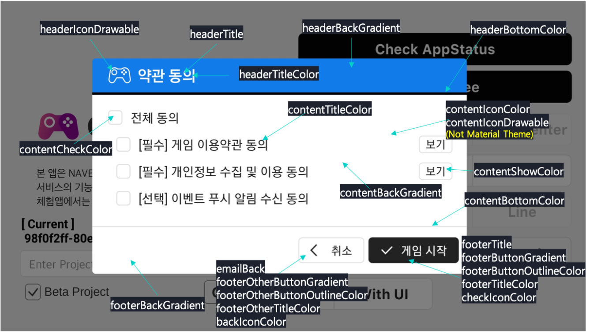

---
search:
  keyword: ['gamepot']
---

#### **为提供 NAVER CLOUD PLATFORM 产品的详细使用方法和 API 的多种使用方式，分别提供<a href="https://guide.ncloud-docs.com/docs/zh/home" target="_blank">[说明书]</a>和<a href="https://api.ncloud-docs.com/docs/zh/home" target="_blank">[API 参考指南]</a>以供参考。**

<a href="https://api.ncloud-docs.com/docs/zh/game-gamepot" target="_blank">进入 Gamepot API 参考指南 >></a><br />
<a href="https://guide.ncloud-docs.com/docs/zh/game-gamepot-overview" target="_blank">进入 Gamepot 说明书 >></a><br />
<a href="https://guide.ncloud-docs.com/docs/zh/game-gamepotandroid" target="_blank">进入 Gamepot Android SDK 说明书 >></a>

下面将介绍用于开发Android操作系统游戏的GAMEPOT Android SDK的使用方法。通过安装SDK及配置环境，可关联游戏和Dashboard。

## 配置要求<a name="요구사양"></a>

使用Android操作系统用GAMEPOT SDK时所需的配置要求如下。

* 最低配置：API 19 (Kitkat) 以上、gradle 3.3.3或3.4.3.以上
* 开发环境： Android Studio

## 安装SDK和配置环境<a name="SDK설치및환경구성"></a>

安装GAMEPOT Android SDK后配置环境并关联GAMEPOT Dashboard和游戏，即可使用游戏开发所需的功能。

### 安装SDK<a name="SDK설치"></a>

安装GAMEPOT Android SDK后，在Android Studio配置项目的方法如下。

1. 请使用管理员账户登录Dashboard。
2. 依次点击 **SDK下载 > Android** 菜单后，请点击 **下载**。
3. 运行Android Studio后，请打开游戏项目。
4. 解压已下载的AOS SDK文件后，请将libs文件夹内的所有文件复制到游戏项目的libs文件夹下。

### 修改build.gradle<a name="buildgradle수정"></a>

修改build.gradle文件的方法如下。

1. 请使用下列代码修改项目root文件夹内的build.gradle文件。
   
   ```java
   buildscript {
   
       repositories {
           ...
           google()
           jcenter()
           maven { url "https://jitpack.io" }
           maven { url "https://jcenter.bintray.com" }
       }
       dependencies {
          ...
           classpath 'com.google.gms:google-services:4.2.0'
       }
   }
   
   allprojects {
       repositories {
           ...
           google()
           jcenter()
           maven { url "https://jitpack.io" }
           maven { url "https://jcenter.bintray.com" }
       }
   }
   ```

2. 参考表格修改下列代码的值后，请使用代码修改app文件夹内的build.gradle文件。gamepot_payment值默认为空。
   
   | 值| 说明
   |----------|----------
   | `gamepot_project_id`| 由GAMEPOT发放的项目ID<br>（在Dashboard **项目设置 > 一般** 菜单中进行确认）
   | `gamepot_store`| 输入Store值 `google`、`one`或`galaxy`
   | `gamepot_app_title`| APP标题（FCM）
   | `gamepot_push_default_channel`| 禁止更改（已注册的默认渠道名称）
   | `facebook_app_id`| 由Facebook发放的APP ID
   | `fb_login_protocol_scheme`| fb[由Facebook发放的APP ID]  ex) fb101010
   | `facebook_client_token`| Facebook控制台 > APP > 设置 > 高级设置 > 客户端Token
   | `gamepot_elsa_projectid`| 使用NAVER Cloud ELSA服务时，输入ELSA项目ID<br>（参阅[Effective Log Search \& Analytics](https://www.ncloud.com/product/analytics/elsa){target="_blank"}）
   | `gamepot_region`| 仅在GAMEPOT Dashboard创建地区为新加坡时输入sg
   | `gamepot_license_url`| 仅在GAMEPOT Dashboard创建地区为日本时输入 https://gamepot.apigw.ntruss.com/fw/jp-v1

   ```java
   android {
       defaultConfig {
           ...
           // GamePot [START]
           resValue "string", "gamepot_project_id", "[projectId]" // required
           resValue "string", "gamepot_store", "[storeId]" // required
           resValue "string", "gamepot_payment", "[storeId]" // optional
           resValue "string", "gamepot_app_title","@string/app_name" // required (fcm)
           resValue "string", "gamepot_push_default_channel","Default" // required (fcm)
           resValue "string", "facebook_app_id", "[Facebook ID]" // facebook
           resValue "string", "fb_login_protocol_scheme", "fb[Facebook ID]" // (facebook)
           resValue "string", "facebook_client_token", "[Facebook客户端Token]" // Facebook控制台 > APP > 高级设置 > 客户端Token
           // resValue "string", "gamepot_elsa_projectid", "" // (ncp elsa)
           resValue "string", "gamepot_region", "" // Caution! Only if the gamepot region is Singapore , value as sg
           resValue "string", "gamepot_license_url", "" // Caution! Only if the gamepot region is Japan , value as https://gamepot.apigw.ntruss.com/fw/jp-v1
           // GamePot [END]
       }
   
       packagingOptions {
           exclude 'META-INF/proguard/androidx-annotations.pro'
       }
   }
   
   repositories {
       flatDir {
           dirs 'libs'
       }
   }
   
   dependencies {
    implementation 'androidx.appcompat:appcompat:1.2.0'
    implementation 'androidx.multidex:multidex:2.0.1'
   
    // GamePot common [START]
    implementation(name: 'gamepot-common', ext: 'aar')
    implementation('io.socket:socket.io-client:1.0.0') {
        exclude group: 'org.json', module: 'json'
    }
    implementation('com.github.ihsanbal:LoggingInterceptor:3.0.0') {
        exclude group: 'org.json', module: 'json'
    }
    implementation "com.github.nisrulz:easydeviceinfo:2.4.1"
    implementation 'pub.devrel:easypermissions:1.3.0'
    implementation 'com.android.installreferrer:installreferrer:1.0'
    implementation 'com.google.code.gson:gson:2.8.2'
    implementation 'com.jakewharton.timber:timber:4.7.0'
    implementation 'com.squareup.okhttp3:okhttp:4.9.1'
    implementation 'com.apollographql.apollo:apollo-runtime:1.0.0-alpha2'
    implementation 'com.apollographql.apollo:apollo-android-support:1.0.0-alpha2'
    implementation 'com.android.billingclient:billing:5.0.0'
    implementation 'com.google.firebase:firebase-crashlytics-buildtools:2.9.1'
    implementation 'com.github.bumptech.glide:glide:3.7.0'
    implementation 'com.romandanylyk:pageindicatorview:1.0.3'
    implementation 'androidx.sqlite:sqlite-framework:2.0.1'
    implementation 'com.cookpad.puree:puree:4.1.6'
    implementation 'com.google.firebase:firebase-core:18.0.1'
    implementation 'com.google.firebase:firebase-messaging:23.1.2'
    implementation 'com.google.firebase:firebase-iid:21.1.0'
    implementation "androidx.swiperefreshlayout:swiperefreshlayout:1.1.0"
    // GamePot common [END]
   
    implementation(name: 'gamepot-channel-base', ext: 'aar')
    // GamePot facebook [START]
    implementation(name: 'gamepot-channel-facebook', ext: 'aar')
    implementation 'com.facebook.android:facebook-android-sdk:13.2.0'
    // GamePot facebook [END]
   
    // GamePot google sigin [START]
    implementation(name: 'gamepot-channel-google-signin', ext: 'aar')
    implementation "com.google.android.gms:play-services-auth:19.0.0"
    // GamePot google sigin [END]
   }
   
   // ADD THIS AT THE BOTTOM
   apply plugin: 'com.google.gms.google-services'
   ```

3. 请将自Google Developer Center获取的google-service.json文件复制到app文件夹下。

4. 请刷新Android Studio。

#### 刷新失败时<a name="새로고침에실패했을경우"></a>

若尝试刷新时显示通知消息后失败，请按以下方式解决相应问题。

* **消息**： Configuration 'compile' is obsolete and has been replaced with 'implementation' and 'api'. It will be removed at the end of 2018. For more information see: http://d.android.com/r/tools/update-dependency-configurations.html **说明**：由于不再支持`compile`设置，因此请将已输入至项目代码的`compile`部分修改为`implementation`。 <br>

* **消息**：No matching client found for package name '[packagename]' **说明**：请将APP的包名称和在google-service.json文件声明的包名称改为一致。

### 设置AndroidManifest.xml<a name="AndroidManifest.xml"></a>

若要通过设置AndroidManifest.xml添加一般游戏使用的设置值，请使用下列代码。

```XML
<?xml version="1.0" encoding="utf-8"?>
<manifest xmlns:android="http://schemas.android.com/apk/res/android"
    xmlns:tools="http://schemas.android.com/tools">

    <!--设置为没有通话功能的设备（平板电脑等）也能从商店进行下载-->
    <uses-feature android:name="android.hardware.telephony" android:required="false" />
    <!--设置为没有麦克风的设备也能从商店下载支持语音聊天的游戏-->
    <uses-feature android:name="android.hardware.microphone" android:required="false" />

    <!--allowBackup必须设置为false。若设置为false，重新安装游戏时不会自动恢复shared preference值。-->
    <application
        android:name="androidx.multidex.MultiDexApplication"
        android:allowBackup="false"
        tools:replace="android:allowBackup">

        <!--resizeableActivity: 禁用应用分屏查看功能-->
        <activity
            android:resizeableActivity="false">
            <intent-filter>
                <action android:name="android.intent.action.MAIN" />
                <category android:name="android.intent.category.LAUNCHER" />
            </intent-filter>
        </activity>

        <!--与Galaxy S8屏幕对应-->
        <meta-data android:name="android.max_aspect" android:value="2.1" />

    </application>
</manifest>
```

### 设置推送通知图标<a name="푸시알림아이콘설정"></a>

可设置接收推送消息时要显示于通知栏的图标。若不额外设置，则使用包含在SDK的默认图片，也可自行设置匹配游戏的图标。若使用[Android Asset Studio](http://romannurik.github.io/AndroidAssetStudio/icons-notification.html#source.type=clipart&source.clipart=ac_unit&source.space.trim=1&source.space.pad=0&name=ic_stat_gamepot_small){target="_blank"}，将自动为各文件夹制作图像，非常便利。

设置推送通知图标的方法如下。

1. 按照以下方法在项目路径下分别创建res/drawable文件夹后，请根据各文件夹大小添加图像文件。
    | 文件夹名称| 大小 | 
    | --- | ---| 
    res/drawable-mdpi/ | 24x24 | 
    res/drawable-hdpi/ | 36x36 | 
    res/drawable-xhdpi/ | 48x48 | 
    res/drawable-xxhdpi/ | 72x72 | 
    res/drawable-xxxhdpi/ | 96x96 |
2. 请将图像文件名改为ic_stat_gamepot_small。

### 初始化<a name="초기화"></a>

若要进行初始化，请在MainActivity.java文件使用下列代码。

```java
import io.gamepot.common.GamePot;
import io.gamepot.common.GamePotLocale;

@Override
protected void onCreate(Bundle savedInstanceState) {
    super.onCreate(savedInstanceState);
    // 初始化GAMEPOT。请务必在context输入application context。
    // 请在调用其他API前，首先调用setup API。
    GamePot.getInstance().setup(getApplicationContext());
}

@Override
protected void onActivityResult(int requestCode, int resultCode, Intent data) {
    super.onActivityResult(requestCode, resultCode, data);
    GamePot.getInstance().onActivityResult(requestCode, resultCode, data);
}

@Override
protected void onStart() {
    super.onStart();
    GamePotChat.getInstance().start();
    GamePot.getInstance().onStart(this);
}

@Override
protected void onStop() {
    super.onStop();
    GamePotChat.getInstance().stop();
}

@Override
protected void onDestroy() {
    super.onDestroy();
    GamePot.getInstance().onDestroy();
}
```

## 登录相关功能<a name="로그인관련기능"></a>

可集成Google、Facebook、NAVER等多种登录SDK，用于GAMEPOT Android SDK。

### 使用前设置<a name="사용전설정"></a>

若要使用登录相关SDK功能，需完成控制台设置并声明登录相关代码。

#### 设置谷歌Firebase控制台<a name="구글Firebase콘솔설정"></a>

若为使用登录功能而需设置Google Firebase控制台，请将配置APK时使用的Keystore文件的SHA-1值添加到Firebase控制台。

#### 设置Facebook控制台<a name="페이스북콘솔설정"></a>

为使用登录功能，设置Facebook控制台的方法如下。

1. 在Facebook for Developers控制台将APP类型选为 **None** 、**Consumer** 或 **Gaming** 后，请创建APP。
2. 请将配置APK时使用的Keystore的密钥哈希值添加到Facebook for Developers控制台。

#### 设置MainActivity.java<a name="MainActivityjava설정"></a>

若要通过声明登录相关代码设置MainActivity.java文件，请使用下列代码。

```java
import io.gamepot.channel.GamePotChannel;
import io.gamepot.channel.GamePotChannelType;
import io.gamepot.channel.facebook.GamePotFacebook;
import io.gamepot.channel.google.signin.GamePotGoogleSignin;

public class MainActivity extends AppCompatActivity {
    @Override
    protected void onCreate(Bundle savedInstanceState) {
        // 请先调用setup API。
        GamePot.getInstance().setup(getApplicationContext());

        ...
        // 请按照要使用登录的渠道调用addChannel。默认包括Guest方式。
        // Google Login初始化
        GamePotChannel.getInstance().addChannel(this, GamePotChannelType.GOOGLE, new GamePotGoogleSignin());
        // Facebook Login初始化
        GamePotChannel.getInstance().addChannel(this, GamePotChannelType.FACEBOOK, new GamePotFacebook());
        ...
    }

    @Override
    protected void onActivityResult(int requestCode, int resultCode, Intent data) {
        super.onActivityResult(requestCode, resultCode, data);
        GamePotChannel.getInstance().onActivityResult(this, requestCode, resultCode, data);
    }

    @Override
    protected void onDestroy() {
        super.onDestroy();
        GamePotChannel.getInstance().onDestroy();
    }
}
```

### 登录功能

若要根据开发公司实现的登录UI使用点击登录按钮时操作的SDK登录功能，请使用下列代码。

```java
import io.gamepot.channel.GamePotChannel;
import io.gamepot.channel.GamePotChannelListener;
import io.gamepot.channel.GamePotChannelType;
import io.gamepot.channel.GamePotUserInfo;
import io.gamepot.common.GamePotError;

// 定义登录类型
// GamePotChannelType.GOOGLE: Google
// GamePotChannelType.FACEBOOK: Facebook
// GamePotChannelType.NAVER: NAVER
// GamePotChannelType.LINE: LINE
// GamePotChannelType.TWITTER: Twitter
// GamePotChannelType.APPLE: Apple 
// GamePotChannelType.GUEST: Guest

// 点击Google登录按钮时呼叫
GamePotChannel.getInstance().login(this, GamePotChannelType.GOOGLE, new GamePotChannelListener<GamePotUserInfo>() {
    @Override
    public void onCancel() {
        // 用户取消登录的情况
    }

    @Override
    public void onSuccess(GamePotUserInfo userinfo) {
        // 登录成功。请根据游戏逻辑处理。
        // userinfo.getMemberid()：会员固有ID
    }

    @Override
    public void onFailure(GamePotError error) {
        // 登录失败。请使用error.getMessage显示错误消息。
    }
});
```

#### 获取会员固有ID<a name="회원고유아이디획득"></a>

若要获取游戏会员的固有ID值，请使用下列代码。

```java
GamePot.getInstance().getMemberId();
```

#### 使用各账户登录功能<a name="계정별로그인기능사용"></a>

若要使用各账户登录功能，请使用下列代码应用设置。

* **登录NAVER**
  * 设置build.gradle
  
  ```java
  android {
      defaultConfig {
          ...
          resValue "string", "gamepot_naver_clientid", "xxxxxxxx" // 从Naver开发者控制台获取
          resValue "string", "gamepot_naver_secretid", "xxx" // 从Line开发者控制台获取
      }
  }
  
  dependencies {
    ...
    compile(name: 'gamepot-channel-naver', ext: 'aar')
    ...
  }
  ```
  
  * 设置MainActivity.java
  
  ```java
  import io.gamepot.channel.GamePotChannel;
  import io.gamepot.channel.GamePotChannelType;
  import io.gamepot.channel.naver.GamePotNaver;
  
  @Override
  protected void onCreate(Bundle savedInstanceState) {
      super.onCreate(savedInstanceState);
          ...
          GamePotChannel.getInstance().addChannel(this, GamePotChannelType.NAVER, new GamePotNaver());
  }
  ```
  
  * 登录
  
  ```java
  GamePotChannel.getInstance().login(this, GamePotChannelType.NAVER, new GamePotAppStatusChannelListener<GamePotUserInfo>() {
    ...
  });
  ```

<br>

* **登录LINE**
  * 设置build.gradle
  
  ```java
  android {
      defaultConfig {
          ...
          resValue "string", "gamepot_line_channelid","00000000" // 从Line开发者控制台获取
      }
  }
  
  dependencies {
    ...
    compile(name: 'gamepot-channel-line', ext: 'aar')
    compile(name: 'line-sdk-4.0.10', ext: 'aar')
    ...
  }
  ```
  
  * 设置MainActivity.java
  
  ```java
  import io.gamepot.channel.GamePotChannel;
  import io.gamepot.channel.GamePotChannelType;
  import io.gamepot.channel.line.GamePotLine;
  
  @Override
  protected void onCreate(Bundle savedInstanceState) {
      super.onCreate(savedInstanceState);
          ...
          GamePotChannel.getInstance().addChannel(this, GamePotChannelType.LINE, new GamePotLine());
  }
  ```
  
  * 登录
  
  ```java
  GamePotChannel.getInstance().login(this, GamePotChannelType.LINE, new GamePotAppStatusChannelListener<GamePotUserInfo>() {
    ...
  });
  ```

<br>

<!--
* **Twitter登录**
    * 设置build.gradle
    ```java
    android {
        compileOptions {
            sourceCompatibility JavaVersion.VERSION_1_8
            targetCompatibility JavaVersion.VERSION_1_8
        }

        defaultConfig {
            ...
            resValue "string", "gamepot_twitter_consumerkey","xxxxx" // 从Twitter开发者控制台获取
            resValue "string", "gamepot_twitter_consumersecret","xxx" // 从Twitter开发者控制台获取
        }
    }

    dependencies {
      ...
      compile(name: 'gamepot-channel-twitter', ext: 'aar')
      compile('com.twitter.sdk.android:twitter-core:3.3.0@aar') {
          transitive = true
      }
      ...
    }
    ```
    * 设置MainActivity.java
    ```java
    import io.gamepot.channel.GamePotChannel;
    import io.gamepot.channel.GamePotChannelType;
    import io.gamepot.channel.twitter.GamePotTwitter;

    @Override
    protected void onCreate(Bundle savedInstanceState) {
        super.onCreate(savedInstanceState);
            ...
            GamePotChannel.getInstance().addChannel(this, GamePotChannelType.TWITTER, new GamePotTwitter());
    }
    ```
    * 登录
    ```java
    GamePotChannel.getInstance().login(this, GamePotChannelType.TWITTER, new GamePotAppStatusChannelListener<GamePotUserInfo>() {
      ...
    });
    ```
 -->
<br>

* **登录Apple网页**
  * 设置build.gradle
  
  ```java
  dependencies {
    ...
    compile(name: 'gamepot-channel-apple-signin', ext: 'aar')
    ...
  }
  ```
  
  * 设置MainActivity.java
  
  ```java
  import io.gamepot.channel.GamePotChannel;
  import io.gamepot.channel.GamePotChannelType;
  import io.gamepot.channel.apple.signin.GamePotAppleSignin;
  
  @Override
  protected void onCreate(Bundle savedInstanceState) {
      super.onCreate(savedInstanceState);
          ...
          GamePotChannel.getInstance().addChannel(this, GamePotChannelType.APPLE, new GamePotAppleSignin());
  }
  ```
  
  * 登录
  
  ```java
  GamePotChannel.getInstance().login(this, GamePotChannelType.APPLE, new GamePotAppStatusChannelListener<GamePotUserInfo>() {
    ...
  });
  ```

### 自动登录功能<a name="자동로그인기능"></a>

若要通过传输会员最后一次登录信息的API使用自动登录功能，请使用下列代码。

```java
import io.gamepot.channel.GamePotChannel;
import io.gamepot.channel.GamePotChannelListener;
import io.gamepot.channel.GamePotChannelType;
import io.gamepot.channel.GamePotUserInfo;
import io.gamepot.common.GamePotError;

// 传递用户最后登录信息的API
final GamePotChannelType lastLoginType = GamePotChannel.getInstance().getLastLoginType();

if(lastLoginType != GamePotChannelType.NONE) {
    // 以最后一次登录的类型登录的方式。
    GamePotChannel.getInstance().login(this, lastLoginType, new GamePotChannelListener<GamePotUserInfo>() {
        @Override
        public void onCancel() {
            // 用户取消登录的情况
        }

        @Override
        public void onSuccess(GamePotUserInfo info) {
            // 自动登录成功。请根据游戏逻辑进行处理。
        }

        @Override
        public void onFailure(GamePotError error) {
            // 自动登录失败。请使用error.getMessage()显示错误消息。
        }
    });
}
else
{
    // 首次运行游戏或已退出登录的状态。请跳转到可进行登录的登录界面。
}
```

### 退出功能<a name="로그아웃기능"></a>

若要使用退出功能，请使用下列代码。

```java
import io.gamepot.channel.GamePotChannel;
import io.gamepot.common.GamePotCommonListener;
import io.gamepot.common.GamePotError;

GamePotChannel.getInstance().logout(this, new GamePotCommonListener() {
    @Override
    public void onSuccess() {
        // 成功退出登录。请跳转至初始界面。
    }

    @Override
    public void onFailure(GamePotError error) {
        // 退出登录失败。请使用error.getMessage()显示错误消息。
    }
});
```

### 会员注销功能<a name="회원탈퇴기능"></a>

若要使用会员注销功能，请使用下列代码。

```java
import io.gamepot.channel.GamePotChannel;
import io.gamepot.common.GamePotCommonListener;
import io.gamepot.common.GamePotError;

GamePotChannel.getInstance().deleteMember(this, new GamePotCommonListener() {
    @Override
    public void onSuccess() {
        // 会员注销成功。请跳转至初始界面。
    }

    @Override
    public void onFailure(GamePotError error) {
        // 会员注销失败。请使用error.getMessage()显示错误消息。
    }
});
```

### 登录验证功能<a name="로그인검증기능"></a>

完成登录后，登录信息从开发公司服务器传递至GAMEPOT服务器，可进行登录验证。

详细内容请参阅[登录验证请求](/docs/zh/game-gamepotserver#로그인검증요청)。

## 关联外部账户 <a name="외부계정연동"></a>

一个游戏账户可以关联多个外部账户或取消关联。

### 账户关联功能<a name="계정연동기능"></a>

若要使用与Google、Facebook、NAVER等多个外部账户的关联功能，请使用下列代码。

```java
import io.gamepot.channel.GamePotChannel;
import io.gamepot.channel.GamePotChannelListener;
import io.gamepot.channel.GamePotChannelType;
import io.gamepot.channel.GamePotUserInfo;
import io.gamepot.common.GamePotError;

// 关联Google账户
// GamePotChannelType.GOOGLE
// 关联Facebook账户
// GamePotChannelType.FACEBOOK
// 关联NAVER账户
// GamePotChannelType.NAVER
// 关联LINE账户
// GamePotChannelType.LINE
// 关联Twitter账户
// GamePotChannelType.TWITTER
// 关联Apple账户
// GamePotChannelType.APPLE

GamePotChannel.getInstance().createLinking(this, GamePotChannelType.GOOGLE, new GamePotChannelListener<GamePotUserInfo>() {
    @Override
    public void onSuccess(GamePotUserInfo userInfo) {
        // 关联成功。请显示关联结果的相关消息。（示例："账户关联成功。")
    }

    @Override
    public void onCancel() {
        // 用户取消账户关联
    }

    @Override
    public void onFailure(GamePotError error) {
        // 关联失败。请使用error.getMessage()显示错误消息。
    }
});
```

### 确认关联列表功能<a name="연동리스트확인기능"></a>

若要确认已关联账户的外部账户列表，请使用下列代码。

```java
import io.gamepot.channel.GamePotChannel;
import java.util.ArrayList;

// 定义类型
// GamePotChannelType.GOOGLE
// GamePotChannelType.FACEBOOK
// GamePotChannelType.NAVER
// GamePotChannelType.LINE
// GamePotChannelType.TWITTER
// GamePotChannelType.APPLE
// 返回各类型的关联结果。
boolean isLinked = GamePotChannel.getInstance().isLinked(GamePotChannelType.GOOGLE);

// 对已关联的所有类型，以JSON格式返回。
// 若关联Google和Facebook，将按照以下方式返回。
// [{"provider":"google"},{"provider":"facebook"}]
JSONArray linking = GamePotChannel.getInstance().getLinkedList();
```

### 解除关联功能<a name="연동해제기능"></a>

若要使用解除与外部账户关联的功能，请使用下列代码。

```java
import io.gamepot.channel.GamePotChannel;
import io.gamepot.channel.GamePotChannelType;
import io.gamepot.common.GamePotCommonListener;
import io.gamepot.common.GamePotError;

GamePotChannel.getInstance().deleteLinking(this, GamePotChannelType.GOOGLE, new GamePotCommonListener() {
    @Override
    public void onSuccess() {
        // 成功解除关联。请显示关联结果的相关语句。（示例：已解除账户关联。）
    }

    @Override
    public void onFailure(GamePotError error) {
        // 账户关联解除失败。请使用error.getMessage()显示错误消息。
    }
});
```

## 支付功能<a name="결제기능"></a>

```
GAMEPOT结算仅支持游戏内消耗性商品类型的结算。只有V17版本支持One Store应用内SDK。
包含ONE Store应用内SDK : gamepot-billing-onestore.aar
包含GALAXY Store应用内SDK: gamepot-billing-galaxystore.aar
包含My Card应用内SDK : gamepot-billing-mycard.aar ( 请避免用于Google Store环境的构建程序。)
```

可使用用于在APP内购买商品的支付功能。支付结果值以Listener形式实现。

### 设置MainActivity.java<a name="MainActivityjava설정2"></a>

若要设置MainActivity.java文件以使用支付功能，请使用下列代码。

```
import io.gamepot.common.GamePot;
import io.gamepot.common.GamePotPurchaseInfo;
import io.gamepot.common.GamePotPurchaseListener;
import io.gamepot.common.GamePotError;

public class MainActivity extends AppCompatActivity {
    @Override
    protected void onCreate(Bundle savedInstanceState) {
        // 请先调用setup API。
        GamePot.getInstance().setup(getApplicationContext());

        ...
        GamePot.getInstance().setPurchaseListener(new GamePotPurchaseListener<GamePotPurchaseInfo>() {
            @Override
            public void onSuccess(GamePotPurchaseInfo info) {
                // 支付成功。道具发放请求以Server to Server传递至Webhook中设置的地址。
                // 仅在此处处理结果，请不要实际发放道具。
            }

            @Override
            public void onFailure(GamePotError error) {
                // 支付失败。请使用error.getMessage()显示错误消息。
            }

            @Override
            public void onCancel() {
                // 付款过程中用户取消时
            }
        });
        ...
    }
}
```

### 支付尝试功能<a name="결제시도기능"></a>

通过一个支付API，可在Google PlayStore、Apple APPStore使用支付尝试功能。

若要使用支付尝试功能，请使用下列代码。

* 尝试一般支付

```java
import io.gamepot.common.GamePot;

// productId：商店中注册的商品ID
GamePot.getInstance().purchase("product id");
```

<br>

* 单独管理支付尝试及发票号

```java
import io.gamepot.common.GamePot;

// productId：商店中注册的商品ID
// uniqueId：单独管理的发票号
GamePot.getInstance().purchase("product id", "uniqueId");
```

<br>

* 另行管理支付尝试及发票编号，向Webhook传达角色信息 OneStore版本时，uniqueId+serverId+playerId+etc的长度之和小于85byte方可进行支付。

```java
import io.gamepot.common.GamePot;

// productId：在Store注册的商品ID
// uniqueId：单独管理的发票号
// serverId：付费角色的服务器ID
// playerId：付费角色的角色ID
// etc：付费角色的其他信息
GamePot.getInstance().purchase("product id","uniqueId","serverId","playerId","etc");
```

### 获取付款道具列表功能<a name="결제아이템리스트획득기능"></a>

若要使用获取由Store传递的应用内付费道具列表功能，请使用下列代码。

作为登录成功后应当调用的API，由于getPurchaseDetailList API是提供从Store应用内SDK非同步获取的内容的API，因此可根据调用的时间以空值形式发送。（以可支付的环境为准）

```java
import io.gamepot.common.GamePot;

//[case1]
GamePotPurchaseDetailList details = GamePot.getInstance().getPurchaseDetailList();

//[case2]
GamePot.getInstance().getPurchaseDetailListAsync(new GamePotListener<GamePotPurchaseDetailList>() {
    @Override
    public void onSuccess(GamePotPurchaseDetailList data) {
        //data : In-app information
    }

    @Override
    public void onFailure(GamePotError error) {
        // api error
    }
});

```

### 发放付费道具功能<a name="결제아이템지급기능"></a>

对照付款Store的发票明细，全部完成验证后，方可设置向开发公司服务器发送发放请求。

详细内容请参阅[道具发放请求](/docs/zh/game-gamepotserver#아이템지급요청)。

### Mycard支付<a name="Mycard결제"></a>

Mycard库：[gamepot-billing-mycard.aar](https://xyuditqzezxs1008973.cdn.ntruss.com/patch/gamepot-billing-mycard.aar){target="_blank"}

:::(Info) (参考)
关联Mycard所需的FacServiceID /  KEY值请联系Mycard进行确认，然后在Dashboard中设置。
:::

1. 请填写Dashboard >> 支付 >> IAP的Store类型：Google项目 > 添加价格 > 货币（ex.TWD）/价格信息后保存相关信息。

2. 在Dashboard >> 项目设置 >> 外部支付项目中添加MyCard，并确认是否正常输入相应FacService ID / Sign Key。

3. 支付时调用SDK的下列代码。
   
   GamePot.getInstance().purchase("product id");
   
   * MyCard使用过程中以付费道具的调用形式调用GamePot.getInstance().getPurchaseDetailList();时将出现错误。为应对这一问题，请调用GamePot.getInstance().getPurchaseThirdPaymentsDetailList();。

4. 删除./AndroidManifest.xml文件中<application>标签的name。

```java
   <application
       android:allowBackup="false"
       android:icon="@mipmap/ic_launcher"
       android:label="@string/app_name"
       android:roundIcon="@mipmap/ic_launcher_round"
       tools:replace="android:allowBackup" >
```

5. build.gradle文件设置如下。

```java
resValue "string", "gamepot_store", "google"
resValue "string", "gamepot_payment", "mycard" // 只有当商店为Google时才适用。
```

6. 确认../libs文件夹内是否包含gamepot-billing-mycard.aar。

7. 确认是否已设置为开发时build.gradle文件内包含库。

ex) implementation(name: 'gamepot-billing-mycard', ext: 确认文件夹内是否包含'aar'）。

### 外部支付功能<a name="외부 결제 기능"></a>

以OnrStore为例：若要关联不使用OnrStore支持的应用内SDK的外部支付模块，请参阅[关联外部支付服务](/docs/zh/game-gamepot-projectmgmt#외부결제서비스연동)完成相应设置后使用下列代码。

* **尝试付款**

```java
import io.gamepot.common.GamePot;

// activity：当前Activity
// product id：在Dashboard登记的支付ID
GamePot.getInstance().purchaseThirdPayments(activity, product id);
```

* **获取付款道具列表**

```java
import io.gamepot.common.GamePot;

GamePotPurchaseDetailList thirdPaymentsDetailList = GamePot.getInstance().getPurchaseThirdPaymentsDetailList();
```

## SDK自行提供的登录UI<a name="SDK자체제공로그인UI"></a>

可使用GAMEPOT Android SDK提供的完整的登录UI。

### 使用SDK自行提供的登录UI<a name="SDK자체제공로그인UI사용"></a>

若要设置MainActivity.java后使用自行提供的登录UI，请使用下列代码。

```java
import io.gamepot.channel.GamePotChannel;
import io.gamepot.channel.GamePotChannelListener;
import io.gamepot.channel.GamePotAppStatusChannelListener;
import io.gamepot.channel.GamePotChannelType;
import io.gamepot.channel.GamePotChannelLoginBuilder;
import io.gamepot.channel.GamePotUserInfo;
import io.gamepot.common.GamePotError;

String[] channelList = {"google", "facebook", "naver", "line", "twitter", "apple", "guest"};
GamePotChannelLoginBuilder builder = new GamePotChannelLoginBuilder(channelList);

// 点击登录按钮时调用
GamePotChannel.getInstance().showLoginWithUI( this, builder, new GamePotAppStatusChannelLoginDialogListener<GamePotUserInfo>() {
    @Override
    public void onExit() {
        // 点击X按钮时处理 
    }

    @Override
    public void onNeedUpdate(GamePotAppStatus status) {
        // TODO: 需要强制更新时。调用下列API，可在SDK中直接弹出窗口。
        // TODO: 需要Customizing时，无需调用下列API，直接进行定制即可。
        GamePot.getInstance().showAppStatusPopup(this, status, new GamePotAppCloseListener() {
            @Override
            public void onClose() {
                // TODO: 调用showAppStatusPopup API时，在需要结束APP时调用。
                // TODO: 请处理结束进程。
                MainActivity.this.finish();
            }

            @Override
            public void onNext(Object obj) {
                // TODO：在Dashboard更新设置中建议设置时，显示"下次进行"按钮。
                // 用户选择该按钮时调用。
                // TODO：请与使用obj信息成功登录时做相同的处理。
                // GamePotUserInfo userInfo = (GamePotUserInfo)obj;
            }
        });
    }

    @Override
    public void onMainternance(GamePotAppStatus status) {
        // TODO: 检查中时：调用下列API，可在SDK中直接弹出窗口。
        // TODO: 需要Customizing时，无需调用下列API，直接进行定制即可。
        GamePot.getInstance().showAppStatusPopup(this, status, new GamePotAppCloseListener() {
            @Override
            public void onClose() {
                // TODO: 调用showAppStatusPopup API时，在需要结束APP时调用。
                // TODO: 请处理结束进程。
                MainActivity.this.finish();
            }
        });
    }

    @Override
    public void onCancel() {
        // 用户取消登录时的情况。
    }

    @Override
    public void onSuccess(GamePotUserInfo userinfo) {
        // 登录成功。请根据游戏逻辑进行处理。
        // userinfo.getMemberid()：会员固有ID
    }

    @Override
    public void onFailure(GamePotError error) {
        // 登录失败。请使用error.getMessage()显示错误消息。
    }
});
```

### 设置自行提供的登录UI图像标志<a name="자체제공로그인UI이미지로고설정"></a>

可设置显示在自行提供的登录UI上方的图像。若未另行设置，将使用SDK中的默认图像，直接设置匹配游戏的图像。

自主提供的登录UI图片设置方法如下。

1. 如下分别创建rew/drawable文件夹后，根据各大小添加图片文件。
    | 文件夹名称| 大小 | 
    | --- | ---| 
    res/drawable-mdpi/ | 24x24 | 
    res/drawable-hdpi/ | 36x36 | 
    res/drawable-xhdpi/ | 48x48 | 
    res/drawable-xxhdpi/ | 72x72 | 
    res/drawable-xxxhdpi/ | 96x96 |
2. 请将图像文件名改为ic_stat_gamepot_small。

## 优惠券功能<a name="쿠폰기능"></a>

如果要使用用户输入优惠券即处理为已使用的功能，请使用下列代码。

```java
import io.gamepot.common.GamePot;
import io.gamepot.common.GamePotError;
import io.gamepot.common.GamePotListener;

GamePot.getInstance().coupon(/*用户输入的优惠券*/, new GamePotListener<String>() {
    @Override
    public void onSuccess(String message) {
        // 优惠券使用成功。请通过弹窗显示message值。
    }

    @Override
    public void onFailure(GamePotError error) {
        // 优惠券使用失败。请使用error.getMessage()显示错误消息。
    }
});
```

### 发放道具<a name="아이템지급"></a>

优惠券使用成功时，将向开发公司服务器发送道具发放请求。

详细内容请参阅[道具发放请求](/docs/zh/game-gamepotserver#아이템지급요청)。

## 推送功能<a name="푸시기능"></a>

可允许或禁止一般推送、夜间推送、广告推送功能，可使用本地推送功能。若使用推送功能，请将广告推送设置为true（广告推送值为false时，无论是否设置一般/夜间推送，皆不会收到推送。）

### 允许及禁止推送<a name="푸시활성화및비활성화"></a>

若要使用推送功能，请使用下列代码。

```java
import io.gamepot.common.GamePot;
import io.gamepot.common.GamePotError;
import io.gamepot.common.GamePotCommonListener;

// 允许/禁止接收推送
GamePot.getInstance().setPushEnable(/*true or false*/, new GamePotCommonListener() {
    @Override
    public void onSuccess() {
    }

    @Override
    public void onFailure(GamePotError error) {
    }
});

// 允许/禁止接收夜间推送
GamePot.getInstance().setNightPushEnable(/*true or false*/, new GamePotCommonListener() {
    @Override
    public void onSuccess() {
    }

    @Override
    public void onFailure(GamePotError error) {
    }
});

// 同时设置推送、夜间推送
// 若登录前需要确认是否允许推送、夜间推送的游戏，登录后请务必调用下列代码。
GamePot.getInstance().setPushEnable(/*true or false*/, /*true or false*/, true, new GamePotCommonListener() {
    @Override
    public void onSuccess() {
    }

    @Override
    public void onFailure(GamePotError error) {
    }
});
```

### 查看推送状态<a name="푸시상태확인"></a>

若要查看当前推送状态，请使用下列代码。

```java
import io.gamepot.common.GamePot;
import org.json.JSONObject;

// enable: 全部推送
// night: 夜间推送
// {"enable":true, "night":true}
JSONObject status = GamePot.getInstance().getPushStatus();
```

### 本地推送功能<a name="로컬푸시기능"></a>

无需通过推送消息服务器，设备即可自行显示推送。

若要通过注册推送在规定时间显示本地推送，请使用下列代码。

```java
String date = "2018-09-27 20:00:00";
GamePotLocalPushBuilder builder = new GamePotLocalPushBuilder(getActivity())
                        .setTitle("本地推送测试")
                        .setMessage("本地推送消息。" + date)
                        .setDateString(date).build();
int pushid = GamePot.getInstance().sendLocalPush(builder);
/* pushid的return值由开发者管理 */
```

#### 取消已注册的本地推送<a name="등록한로컬푸시취소"></a>

若要使用注册本地推送时获取的`pushid`值取消当前已注册的推送，请使用下列代码。

```java
GamePot.getInstance().cancelLocalPush(/*当前Activity*/, /*注册推送时获得的pushid*/);
```

## 公告事项图像显示功能<a name="공지사항이미지표시기능"></a>

可设置要在Dashboard **公告事项** 菜单中显示的已上传图像。建议图像大小如下。

* 大小： 720x1200(Portrait), 1280x640(Landscape)
* 容量：250 kB以下

若要在Dashboard的 **公告事项** 菜单中显示已上传的图像，请使用下列代码。

```java
/* showTodayButton : 是否显示“今日不再显示”按钮。设置为false时，无条件显示 */
boolean showTodayButton = true;

GamePot.getInstance().showNotice(/*当前Activity*/, showTodayButton, new GamePotNoticeDialog.onSchemeListener() {
    @Override
    public void onReceive(String scheme) {
        // scheme处理
    }
});
```

### 仅显示特定分类的公告事项图片<a name="특정한분류의공지사항이미지만표시"></a>

若要仅显示特定分类的公告事项图片，请使用下列代码。

```java
/* Dashboard公告事项 >> 分类中设置的分类名称 */
string type = "";

GamePot.getInstance().showEvent(/*当前Activity*/, type, new GamePotNoticeDialog.onSchemeListener() {
    @Override
    public void onReceive(String scheme) {
        // scheme处理
    }
});
```

## 客户支持功能<a name="고객지원기능"></a>

通过与Dashboard关联，可使用客户咨询、政策及条款UI调用、同意收集等功能。

### 客户咨询功能<a name="고객문의기능"></a>

可使用会员发送咨询、由负责人回复的客户咨询功能。与Dashboard的 **客户支持 > 客户咨询** 菜单关联。

客户咨询UI根据设备语言将变更为韩语、英语、日语、中文（简体、繁体）中的一个语言，除此之外的设备语言，则变更为英语。

若要与Dashboard关联使用客户咨询功能，请使用下列代码。

```java
GamePot.getInstance().showCSWebView(/*当前Activity*/);
```

#### 外部链接客户咨询<a name="외부링크고객문의"></a>

如果要允许通过外部链接访问并未登录的客户也能注册咨询，请使用下列代码。

```java
String url = "从GAMEPOT获取的外部客户支持URL";

GamePot.getInstance().showWebView(/*当前Activity*/, url, true);
```

### FAQ功能<a name="FAQ기능"></a>

若要使用与Dashboard的 **FAQ** 菜单关联的FAQ功能，请使用下列代码。

```java
GamePot.getInstance().showFaq(/*当前Activity*/);
```

### 条款及政策UI调用功能<a name="약관및정책UI호출기능"></a>

可使用UI调用Dashboard的 **客户支持** 菜单制定的各项条款、政策。

若要调用条款及政策UI，请使用下列代码。

* **使用条款**
  
  ```java
  import io.gamepot.common.GamePot;
  
  // activity：当前Activity
  GamePot.getInstance().showTerms(activity);
  ```

* **隐私政策**
  
  ```java
  import io.gamepot.common.GamePot;
  
  // activity：当前Activity
  GamePot.getInstance().showPrivacy(activity);
  ```

* **退款政策**
  
  ```java
  import io.gamepot.common.GamePot;
  
  // activity：当前Activity
  GamePot.getInstance().showRefund(activity);
  ```

### 条款同意功能（含GDPR）<a name="약관동의기능GDPR포함"></a>

可使用提供的弹窗UI功能收集在Dashboard制定的各种政策及条款的同意。也可收集对于GDPR政策的同意。

#### 自动调用条款同意<a name="약관동의자동호출"></a>

若使用的GAMEPOT Android SDK版本为v3.3.0以上，当会员登录时，将自动显示条款同意弹窗。

若要更改登录时是否自动调用条款同意，请使用下列代码。

```java
// 自动显示的弹窗将应用MATERIAL_BLUE主题。
// 默认值为true。
// 若设置为false，不会自动显示条款同意弹窗。
GamePot.getInstance().setAutoAgree(true);

// 自定义应用MATERIAL_ORANGE主题时
GamePotAgreeBuilder bulider = new GamePotAgreeBuilder(GamePotAgreeBuilder.THEME.MATERIAL_ORANGE);
GamePot.getInstance().setAutoAgreeBuilder(bulider);

...

GamePotChannel.getInstance().login(GamePotChannelType);

...
```

#### 手动调用条款同意<a name="수동약관동의호출"></a>

若要手动调用条款同意，请使用下列代码。

* 选择主题
  
  ```java
  // 默认主题
  GamePotAgreeBuilder.THEME.BLUE
  GamePotAgreeBuilder.THEME.GREEN
  
  //改善主题
  GamePotAgreeBuilder.THEME.MATERIAL_RED,
  GamePotAgreeBuilder.THEME.MATERIAL_BLUE,
  GamePotAgreeBuilder.THEME.MATERIAL_CYAN,
  GamePotAgreeBuilder.THEME.MATERIAL_ORANGE,
  GamePotAgreeBuilder.THEME.MATERIAL_PURPLE,
  GamePotAgreeBuilder.THEME.MATERIAL_DARKBLUE,
  GamePotAgreeBuilder.THEME.MATERIAL_YELLOW,
  GamePotAgreeBuilder.THEME.MATERIAL_GRAPE,
  GamePotAgreeBuilder.THEME.MATERIAL_GRAY,
  GamePotAgreeBuilder.THEME.MATERIAL_GREEN,
  GamePotAgreeBuilder.THEME.MATERIAL_PEACH,
  ```

* 调用
  
  ```java
  // 默认调用（应用MATERIAL_BLUE主题）
  GamePot.getInstance().showAgreeDialog(/*activity*/, new GamePotAgreeBuilder(), new GamePotListener<GamePotAgreeInfo>() {
      @Override
      public void onSuccess(GamePotAgreeInfo data) {
          // data.agree: 同意全部强制条款时为true
          // data.agreePush: 勾选同意接收一般广告类消息时为true，否则为false
          // data.agreeNight: 勾选同意接收夜间广告类消息时为true，否则为false
          // 成功登录后，请通过setPushEnable api统一设置agreePush / agreeNight值。
      }
  
      @Override
      public void onFailure(GamePotError error) {
          // 请使用弹窗等显示error.message。
      }
  });
  
  // 应用MATERIAL_ORANGE主题时
  GamePotAgreeBuilder bulider = new GamePotAgreeBuilder(GamePotAgreeBuilder.THEME.MATERIAL_ORANGE);
  GamePot.getInstance().showAgreeDialog(/*activity*/, bulider, new GamePotListener<GamePotAgreeInfo>() {
    ....
  }
  ```

#### 自行配置条款同意UI主题<a name="약관동의UI테마직접구성"></a>

可使用自行配置的条款同意UI主题替代SDK提供的主题。

若要使用自行配置的条款同意UI主题，则调用条款同意前请使用下列代码配置主题。

```java
GamePotAgreeBuilder agreeBuilder= new GamePotAgreeBuilder();
agreeBuilder.setHeaderBackGradient(new int[] {0xFF00050B,0xFF0F1B21});
agreeBuilder.setHeaderTitleColor(0xFFFF0000);
agreeBuilder.setHeaderBottomColor(0xFF00FF00);
// 未使用时设置为""
agreeBuilder.setHeaderTitle("同意条款");
// res/drawable对象ID
agreeBuilder.setHeaderIconDrawable(R.drawable.ic_stat_gamepot_agree);

agreeBuilder.setContentBackGradient(new int[] { 0xFFFF2432, 0xFF11FF32 });
agreeBuilder.setContentTitleColor(0xFF0429FF);
agreeBuilder.setContentCheckColor(0xFFFFADB5);
agreeBuilder.setContentIconColor(0xFF98FFC6);
agreeBuilder.setContentShowColor(0xFF98B3FF);
// res/drawable对象ID
agreeBuilder.setContentIconDrawable(R.drawable.ic_stat_gamepot_small);

agreeBuilder.setFooterBackGradient(new int[] { 0xFFFFFFFF, 0xFF112432 });
agreeBuilder.setFooterButtonGradient(new int[] { 0xFF1E3A57, 0xFFFFFFFF });
agreeBuilder.setFooterButtonOutlineColor(0xFFFF171A);
agreeBuilder.setFooterTitleColor(0xFFFF00D5);
agreeBuilder.setFooterTitle("开始游戏");

//勾选同意接收广告类消息（一般/夜间）后，开始游戏时是否显示Toast消息（同意时间）
agreeBuilder.setShowToastPushStatus(true);

// 修改同意接收广告类消息（一般/夜间）内容
agreeBuilder.setPushToastMsg("Push on");
agreeBuilder.setNightPushToastMsg("Night Push on");

// 是否显示"同意接收一般广告类消息"按钮
agreeBuilder.setShowPush(true);

// 是否显示"同意接收夜间广告类消息"按钮
agreeBuilder.setShowNightPush(true);

// 设置同意接收一般广告类链接按钮（不使用时无需输入）
agreeBuilder.setPushDetailURL("https://...");

// 设置同意接收夜间广告类链接按钮（不使用时无需输入）
agreeBuilder.setNightPushDetailURL("https://...");

// 更改语句
agreeBuilder.setAllMessage("全部同意");
agreeBuilder.setTermMessage("必选）使用条款");
agreeBuilder.setPrivacyMessage("必选）个人信息处理方针");
agreeBuilder.setPushMessage("可选）同意接收一般推送");
agreeBuilder.setNightPushMessage("可选）同意接收夜间推送");


GamePot.getInstance().showAgreeDialog(/*activity*/, agreeBuilder, new GamePotListener<GamePotAgreeInfo>() {
  ....
}
```

* 各变量应用至下列图像显示的区域中。
  * **AgeView**
  
  * **EmailView**
  
  * **AgreeView**
  

#### GDPR条款检查列表功能<a name="GDPR약관체크리스트기능"></a>

若要以列表形式导入在Dashboard激活的GDPR条款项目，请使用下列代码。

```java
import io.gamepot.common.GamePot;

(List<String>) GamePot.getInstance().getGDPRCheckedList();

//返回的各项参数对应Dashboard的下列设置。
gdpr_privacy : 隐私政策
gdpr_term : 使用条款
gdpr_gdpr : GDPR使用条款
gdpr_push_normal : 同意接收事件推送
gdpr_push_night : 同意接收夜间事件推送（仅限韩国）
gdpr_adapp_custom : 同意接收个人精准广告投放（GDPR实施国家）
gdpr_adapp_nocustom : 同意接收查看广告，非个人精准广告投放（GDPR实施国家）
```

## 维护及强制更新功能<a name="점검및강제업데이트기능"></a>

可使用游戏维护及强制更新功能。在Dashboard的 **维护和更新** 菜单开启各功能，即可进行相应操作。

若要使用维护及强制更新功能，请使用下列代码。

```java
GamePotChannel.getInstance().login(this, GamePotChannelType.GOOGLE, new GamePotAppStatusChannelListener<GamePotUserInfo>() {
    @Override
    public void onNeedUpdate(GamePotAppStatus status) {
        // 需强制更新。调用下列API，即可在SDK中直接弹出窗口。
        // 需要Customizing时，请在不调用以下API的状态下进行Customizing。
        GamePot.getInstance().showAppStatusPopup(MainActivity.this, status, new GamePotAppCloseListener() {
            @Override
            public void onClose() {
                // 若要调用showAppStatusPopup API，请在需要关闭APP时调用。
                // 请处理结束进程。
                MainActivity.this.finish();
            }

            @Override
            public void onNext(Object obj) {
                // 在Dashboard更新设置中设置为推荐时，将显示"下次进行"按钮。
                // 用户选择该按钮时将显示。
                // 请与使用obj信息成功登录时进行同样的处理。
                // GamePotUserInfo userInfo = (GamePotUserInfo)obj;
            }
        });
    }

    @Override
    public void onMainternance(GamePotAppStatus status) {
        // 正在维护。调用下列API，即可在SDK中直接弹出窗口。
        // 若要进行个性化Customizing，请在不调用下列API的状态下直接进行定制。
        GamePot.getInstance().showAppStatusPopup(MainActivity.this, status, new GamePotAppCloseListener() {
            @Override
            public void onClose() {
                // 若要调用showAppStatusPopup API，请在需要关闭APP时调用。
                // 请处理结束进程。
                MainActivity.this.finish();
            }
        });
    }

    @Override
    public void onCancel() {
        // 用户取消登录的情况
    }

    @Override
    public void onSuccess(GamePotUserInfo userinfo) {
        // 登录成功。请根据游戏逻辑进行处理。
    }

    @Override
    public void onFailure(GamePotError error) {
        // 登录失败。请使用error.getMessage()显示错误消息。
    }
});
```

## 远程配置功能<a name="원격구성기능"></a>

可导入在Dashboard的 **游戏 > 远程配置** 菜单中注册的服务器参数值。若在SDK使用导入的参数值，无需更新游戏即可对各个要素进行修改及控制。

导入的参数会在登录时加载，之后可以调用相应参数。

若要使用远程配置功能，请使用下列代码。

```java
import io.gamepot.common.GamePot;

//key：参数string
String str_value = GamePot.getInstance().getConfig(key);

//以json string格式导入添加至Dashboard的所有参数。
String json_value = GamePot.getInstance().getConfigs();
```

## 游戏日志传输功能<a name="게임로그전송기능"></a>

调用游戏日志后，可在Dashboard的 **游戏 > 玩家** 菜单查看相关日志。

若要使用游戏日志传输功能，请参考表格并在下列代码输入保留字后调用代码。

* **保留字及代码** 
    保留字	| 是否必填 |	类型 |	说明 |	最大长度| 
    --- | --- | --- | --- | ---| 
    `GamePotSendLogCharacter.NAME`	| 必填	| `String` | 角色名称	| 128| 
    `GamePotSendLogCharacter.LEVEL`	| 选填	| `String`	| 级别	| 128| 
    `GamePotSendLogCharacter.SERVER_ID`	| 选填	| `String` |	服务器 ID |	128| 
    `GamePotSendLogCharacter.PLAYER_ID`	| 选填	| `String` | 角色 ID |128| 
    `GamePotSendLogCharacter.USERDATA`	| 选填	| `String` |	ETC |	128 |
  ```java
  import android.text.TextUtils;
  
  import io.gamepot.common.GamePotSendLogCharacter;
  import io.gamepot.common.GamePotSendLog;
  
  String name = "角色名称";
  String level = "10";
  String serverid = "svn_001";
  String playerid = "283282191001";
  String userdata = "";
  
  GamePotSendLogCharacter obj = new GamePotSendLogCharacter();
  if(!TextUtils.isEmpty(name))
      obj.put(GamePotSendLogCharacter.NAME, name);
  if(!TextUtils.isEmpty(level))
      obj.put(GamePotSendLogCharacter.LEVEL, level);
  if(!TextUtils.isEmpty(serverid))
      obj.put(GamePotSendLogCharacter.SERVER_ID, serverid);
  if(!TextUtils.isEmpty(playerid))
      obj.put(GamePotSendLogCharacter.PLAYER_ID, playerid);
  if(!TextUtils.isEmpty(playerid))
      obj.put(GamePotSendLogCharacter.USERDATA, userdata);
  
  // result：日志传输成功时为true，否则为false
  boolean result = GamePotSendLog.characterInfo(obj);
  ```

## 确认AppStatus<a name="AppStatus확인"></a>

若要确认当前客户端的AppStatus，请使用下列代码。

```java
import io.gamepot.common.GamePot;

GamePot.getInstance().checkAppStatus(new GamePotAppStatusResultListener() {
    @Override
    public void onSuccess(){
   
    }
    @Override
    public void onFailure(GamePotError error){

    }
    @Override
    public void onNeedUpdate(GamePotAppStatus status){

    }
    @Override
    public void onMainternance(GamePotAppStatus status){

    }
});
```

### 设置setUserData<a name="setUserData설정"></a>

登录后给相应会员添加附加信息时，请使用该功能。key数量上限为50个，value长度上限为1024个字符，只能在会员详情项目中查看相应信息。

```java
import io.gamepot.common.GamePot;

JSONObject jobj = new JSONObject();
try {
    jobj.put("appversion", "1.0.23");
    jobj.put("server", "s1");
} catch (JSONException e1) {
    e1.printStackTrace();
}

GamePot.getInstance().setUserData(jobj, new GamePotCommonListener() {
    @Override
    public void onSuccess() {
        //setUserData成功
    }

    @Override
    public void onFailure(GamePotError error) {
        //setUserData失败
    }
});
```

## 关联第三方SDK<a name="3rdPartySDK연동"></a>

GAMEPOT Android SDK支持与第三方SDK进行关联。

### 关联第三方SDK登录<a name="3rdPartySDK로그인연동"></a>

若要通过与第三方SDK相关联使用登录功能，请参考表格并在下列参数输入相应数值后使用代码。

* **参数及代码** 
    参数名称 |	是否必填 |	类型 |	说明 
    --- | --- | --- | --- 
    `activity` |	必填 |	`String` |	当前 Activity 
    `userid`	| 必填	| `String`	| 用户默认 ID 
    `listener`	| 必填	| `GamePotChannelListener / GamePotAppStatusChannelListener`	| 请求结果
  ```java
  String memberId = "memberid of 3rd party sdk";
  
  GamePotChannel.getInstance().loginByThirdPartySDK(getActivity(), memberId, new GamePotAppStatusChannelListener<GamePotUserInfo>() {
      @Override
      public void onNeedUpdate(GamePotAppStatus status) {
          // 需强制更新。调用下列API，即可在SDK中直接弹出窗口。
          // 需要Customizing时，请在不调用以下API的状态下进行Customizing。
          GamePot.getInstance().showAppStatusPopup(MainActivity.this, status, new GamePotAppCloseListener() {
              @Override
              public void onClose() {
                  // 若要调用showAppStatusPopup API，请在需要关闭APP时调用。
                  // 请处理结束进程。
                  MainActivity.this.finish();
              }
  
              @Override
              public void onNext(Object obj) {
                  // 在Dashboard更新设置中指定为推荐时，将显示"下次进行"按钮。
                  // 用户选择该按钮时会调用。
                  // 请与使用obj信息成功登录时进行同样的处理。
                  // GamePotUserInfo userInfo = (GamePotUserInfo)obj;
              }
          });
      }
  
      @Override
      public void onMainternance(GamePotAppStatus status) {
          // 正在维护。调用下列API，即可在SDK中直接弹出窗口。
          // 需要Customizing时，请在不调用以下API的状态下进行Customizing。
          GamePot.getInstance().showAppStatusPopup(MainActivity.this, status, new GamePotAppCloseListener() {
              @Override
              public void onClose() {
                  // 若要调用showAppStatusPopup API，请在需要关闭APP时调用。
                  // 请处理结束进程。
                  MainActivity.this.finish();
              }
          });
      }
  
      @Override
      public void onCancel() {
          // 用户取消登录的情况
      }
  
      @Override
      public void onSuccess(GamePotUserInfo userinfo) {
          // 登录成功。请根据游戏逻辑进行处理。
      }
  
      @Override
      public void onFailure(GamePotError error) {
          // 登录失败。请使用error.getMessage()显示错误消息。
      }
  });
  ```

### 关联第三方SDK支付<a name="3rdPartySDK결제연동"></a>

若要通过与第三方SDK相关联使用支付功能，请参考表格并在下列参数输入相应数值后使用代码。

* **参数及代码** 
    参数名称 |	是否必填 |	类型 |	说明 
    --- | --- | --- | --- 
    `productid` |	必填 |	`String` | 在Dashboard登记的道具ID 
    `transactionid`	| 必填	| `String`	| 支付发票编号（GPA-xxx-xxxx-xxxx） 
    `currency`	| 选填	| `String`	| 货币（KRW、USD） 
    `price` |	选填 |	`double` | 付费道具金额 
    `paymentid` |	选填 |	`String` | 支付Store(`google`、 `apple`、 `one`、 `galaxy`) 
    `uniqueid` |	选填 |	`String` | 开发公司使用的默认ID 
    `listener` |	选填 |	`GamePotListener` | 请求结果
  ```java
  String productId = "purchase_001";
  String transactionId = "GPA-xxx-xxxx-xxxx";
  String currency = "KRW";
  double price = 1200;
  String paymentId = "google";
  String uniqueId = "developer unique id";
  
  GamePot.getInstance().sendPurchaseByThirdPartySDK(productId, transactionId, currency, price, paymentId, uniqueId, null);
  ```