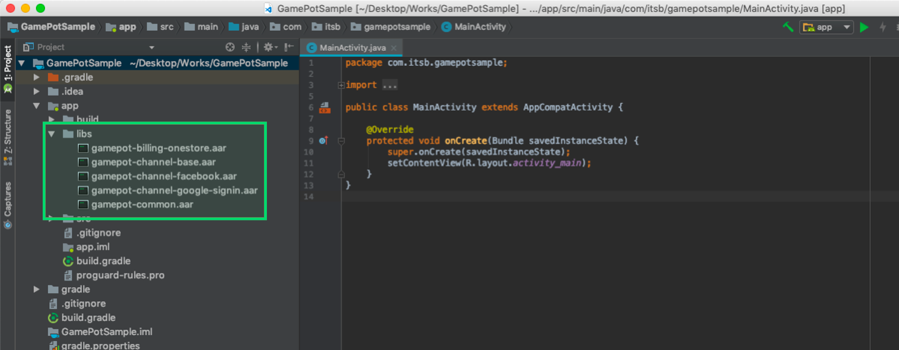

---
search:
  keyword: ['gamepot']
---

# Android SDK

## 1. 开始

### 开发环境配置

为开发用于安卓系统的应用程序，需要安装开发工具\(如Android Studio等\)。根据所使用的开发工具，可另补充安装Java SDK和Android SDK等。

在Android中使用GAMEPOT时所需系统环境如下。

\[系统环境\]

- 最低要求：API 17 \(Jelly Bean, 4.2\)以上，gradle 2.3.0以上
- 开发环境：Android Studio

#### 创建项目


#### 添加库

将下载的AOS SDK文件添加到app/libs文件夹中。



#### build.gradle设置

build.gradle文件分别位于项目root文件夹和app文件夹中。

1. 修改项目root文件夹的build.gradle文件

   ```java
   buildscript {

       repositories {
           ...
           google()
           jcenter()
           maven { url "https://jitpack.io" }
           maven { url "https://jcenter.bintray.com" }
       }
       dependencies {
          ...
           classpath 'com.google.gms:google-services:4.2.0'
       }
   }

   allprojects {
       repositories {
           ...
           google()
           jcenter()
           maven { url "https://jitpack.io" }
           maven { url "https://jcenter.bintray.com" }
       }
   }
   ```

2. 修改app文件夹的build.gradle

   > 在\[xxxxx\]中放入实际应用值。

| 值| 描述|
| :----------------- | :---------------------------------------------------- |
| gamepot_project_id| 请输入从GAMEPOT获取的项目ID。|
| gamepot_store| 商店值\(`google`、`one`或`galaxy`\)|
| gamepot_payment| 支付方式值\(仅限Google商店时，当前支持`mycard`\)|
| gamepot_app_title| 应用主题\(FCM\)|
| gamepot_push_default_channel| 添加的默认渠道名称\(Default\) - 请勿修改。|
| facebook_app_id| 从Facebook获取的应用ID|
| fb_login_protocol_scheme| 从Facebook获取的protocol scheme fb\[app_id\]|
| gamepot_elsa_projectid| 使用NCLOUD ELSA时项目ID\([查看详情](https://www.ncloud.com/product/analytics/elsa)\)|

   ```java
   android {
       defaultConfig {
           ...
           // GamePot [START]
           resValue "string", "gamepot_project_id", "[projectId]" // required
           resValue "string", "gamepot_store", "[storeId]" // required
           resValue "string", "gamepot_payment", "[storeId]" // optional
           resValue "string", "gamepot_app_title","@string/app_name" // required (fcm)
           resValue "string", "gamepot_push_default_channel","Default" // required (fcm)
           resValue "string", "facebook_app_id", "[Facebook ID]" // facebook
           resValue "string", "fb_login_protocol_scheme", "fb[Facebook ID]" // (facebook)
           // resValue "string", "gamepot_elsa_projectid", "" // (ncp elsa)
           // GamePot [END]
       }

       packagingOptions {
           exclude 'META-INF/proguard/androidx-annotations.pro'
       }
   }

   repositories {
       flatDir {
           dirs 'libs'
       }
   }

   dependencies {
       compile 'com.android.support:multidex:1.0.1'

       // GamePot common [START]
       compile(name: 'gamepot-common', ext: 'aar')
       compile('io.socket:socket.io-client:1.0.0') {
           exclude group: 'org.json', module: 'json'
       }
       compile('com.github.ihsanbal:LoggingInterceptor:3.0.0') {
           exclude group: 'org.json', module: 'json'
       }
       compile "com.github.nisrulz:easydeviceinfo:2.4.1"
       compile 'com.android.installreferrer:installreferrer:1.0'
       compile 'com.google.code.gson:gson:2.8.2'
       compile 'com.jakewharton.timber:timber:4.7.0'
       compile 'com.squareup.okhttp3:okhttp:3.10.0'
       compile 'com.apollographql.apollo:apollo-runtime:1.0.0-alpha2'
       compile 'com.apollographql.apollo:apollo-android-support:1.0.0-alpha2'
       compile 'com.android.billingclient:billing:1.1'
       compile 'com.github.bumptech.glide:glide:3.7.0'
       compile 'com.romandanylyk:pageindicatorview:1.0.0'
       compile 'com.google.firebase:firebase-core:16.0.6'
       compile 'com.google.firebase:firebase-messaging:17.3.4'
       compile 'androidx.sqlite:sqlite-framework:2.0.1'
       compile 'com.cookpad.puree:puree:4.1.6'
       // GamePot common [END]

       compile(name: 'gamepot-channel-base', ext: 'aar')
       // GamePot facebook [START]
       compile(name: 'gamepot-channel-facebook', ext: 'aar')
       compile 'com.facebook.android:facebook-android-sdk:5.2.0'
       // GamePot facebook [END]

       // GamePot google sigin [START]
       compile(name: 'gamepot-channel-google-signin', ext: 'aar')
       compile "com.google.android.gms:play-services-base:16.0.1"
       compile "com.google.android.gms:play-services-auth:16.0.1"
       // GamePot google sigin [END]
   }

   // ADD THIS AT THE BOTTOM
   apply plugin: 'com.google.gms.google-services'
   ```

3. 将从GOOGLE获取的google-service.json文件复制到/app/文件夹下。
4. Gradle Sync Now

   在Android Studio中点击以下按钮刷新。


- 点击刷新后可能会出现的问题

  - Configuration 'compile' is obsolete and has been replaced with 'implementation' and 'api'.It will be removed at the end of 2018. For more information see: [http://d.android.com/r/tools/update-dependency-configurations.html](http://d.android.com/r/tools/update-dependency-configurations.html)

    > 使用Gradle版本3或以上版本时，请执行编译

  - No matching client found for package name 'packagename'

    > 请更改包名，使应用的包名和google-service.json中声明的包名一致。

#### AndroidManifest.xml设置

一般添加游戏中使用的设置值。各设置的详细说明请参考代码。

> 建议根据开发公司的判断审核是否应用。

```xml
<?xml version="1.0" encoding="utf-8"?>
<manifest xmlns:android="http://schemas.android.com/apk/res/android"
    xmlns:tools="http://schemas.android.com/tools">

    <!--设置为没有通话功能的设备（平板电脑）也能从商店成功下载-->
    <uses-feature android:name="android.hardware.telephony" android:required="false" />
    <!--设置为没有麦克风的设备也能从商店成功下载支持语音聊天的游戏-->
    <uses-feature android:name="android.hardware.microphone" android:required="false" />

    <!--请务必将allowBackup设置为false。（用于阻止游戏重新安装时自动恢复shared preference值。）-->
    <application
        android:name="android.support.multidex.MultiDexApplication"
        android:allowBackup="false"
        tools:replace="android:allowBackup">

        <!--resizeableActivity : 禁用应用分屏查看功能-->
        <activity
            android:resizeableActivity="false">
            <intent-filter>
                <action android:name="android.intent.action.MAIN" />
                <category android:name="android.intent.category.LAUNCHER" />
            </intent-filter>
        </activity>

        <!--与Galaxy S8屏幕对应-->
        <meta-data android:name="android.max_aspect" android:value="2.1" />

    </application>
</manifest>
```

#### 设置推送通知图标


接收推送时，通知栏中显示的图标一般为SDK内部的默认图像，可根据游戏需求自定义。

**图标自定义**

> 使用[Android Asset Studio](http://romannurik.github.io/AndroidAssetStudio/icons-notification.html#source.type=clipart&source.clipart=ac_unit&source.space.trim=1&source.space.pad=0&name=ic_stat_gamepot_small)制作图标时，会自动按照文件夹数量创建，只需直接放入各文件夹中即可。

1. 按以下形式创建res/drawable相关文件夹
   - res/drawable-mdpi/
   - res/drawable-hdpi/
   - res/drawable-xhdpi/
   - res/drawable-xxhdpi/
   - res/drawable-xxxhdpi/
2. 按以下大小制作图像
   - 24x24
   - 36x36
   - 48x48
   - 72x72
   - 96x96
3. 参考下图，为各文件夹添加合适大小的图像

| 文件夹名| 大小|
| :-------------------- | :----- |
| res/drawable-mdpi/| 24x24|
| res/drawable-hdpi/| 36x36|
| res/drawable-xhdpi/| 48x48|
| res/drawable-xxhdpi/| 72x72|
| res/drawable-xxxhdpi/| 96x96|

1. 将图像文件名更改为`ic_stat_gamepot_small`

## 2. 初始化

在MainActivity.java文件中添加以下部分。

```java
import io.gamepot.common.GamePot;
import io.gamepot.common.GamePotLocale;

@Override
protected void onCreate(Bundle savedInstanceState) {
    super.onCreate(savedInstanceState);
    // GAMEPOT初始化。上下文请务必放入应用上下文。
    // 所有API里须优先调用setup API。
    GamePot.getInstance().setup(getApplicationContext());
}

@Override
protected void onActivityResult(int requestCode, int resultCode, Intent data) {
    super.onActivityResult(requestCode, resultCode, data);
    GamePot.getInstance().onActivityResult(requestCode, resultCode, data);
}

@Override
protected void onStart() {
    super.onStart();
    GamePotChat.getInstance().start();
    GamePot.getInstance().onStart(this);
}

@Override
protected void onStop() {
    super.onStop();
    GamePotChat.getInstance().stop();
}

@Override
protected void onDestroy() {
    super.onDestroy();
    GamePot.getInstance().onDestroy();
}
```

## 3. 登录、退出登录、注销会员

可统一使用Google、Facebook、Naver等各种登录SDK。

### Google\(Firebase\)控制台设置

在Firebase控制台里添加构建APK时使用的密钥库里的SHA-1值。

> SHA-1值请向开发公司申请。


### Facebook控制台设置

在Facebook控制台里添加构建APK时使用的密钥库的密钥哈希值。

> 密钥哈希值请向开发公司申请。


### 设置

#### MainActivity.java文件修改

登录有关代码如下图所示。

```java
import io.gamepot.channel.GamePotChannel;
import io.gamepot.channel.GamePotChannelType;
import io.gamepot.channel.facebook.GamePotFacebook;
import io.gamepot.channel.google.signin.GamePotGoogleSignin;

public class MainActivity extends AppCompatActivity {
    @Override
    protected void onCreate(Bundle savedInstanceState) {
        // 须优先调用setup API。
        GamePot.getInstance().setup(getApplicationContext());

        ...
        // 请按照各登录渠道调用addChannel。（默认方式包括Guest方式）
        // Google登录初始化
        GamePotChannel.getInstance().addChannel(this, GamePotChannelType.GOOGLE, new GamePotGoogleSignin());
        // Facebook登录初始化
        GamePotChannel.getInstance().addChannel(this, GamePotChannelType.FACEBOOK, new GamePotFacebook());
        ...
    }

    @Override
    protected void onActivityResult(int requestCode, int resultCode, Intent data) {
        super.onActivityResult(requestCode, resultCode, data);
        GamePotChannel.getInstance().onActivityResult(this, requestCode, resultCode, data);
    }

    @Override
    protected void onDestroy() {
        super.onDestroy();
        GamePotChannel.getInstance().onDestroy();
    }
}
```

### 登录

登录UI由开发公司实现，点击登录按钮时进行关联。

```java
import io.gamepot.channel.GamePotChannel;
import io.gamepot.channel.GamePotChannelListener;
import io.gamepot.channel.GamePotChannelType;
import io.gamepot.channel.GamePotUserInfo;
import io.gamepot.common.GamePotError;

// 定义登录类型
// GamePotChannelType.GOOGLE: Google
// GamePotChannelType.FACEBOOK: Facebook
// GamePotChannelType.NAVER: NAVER
// GamePotChannelType.LINE: LINE
// GamePotChannelType.TWITTER: Twitter
// GamePotChannelType.GUEST: Guest

// 点击Google登录按钮时呼叫
GamePotChannel.getInstance().login(this, GamePotChannelType.GOOGLE, new GamePotChannelListener<GamePotUserInfo>() {
    @Override
    public void onCancel() {
        // 用户取消登录时的情况。
    }

    @Override
    public void onSuccess(GamePotUserInfo userinfo) {
        // 登录成功，请按游戏逻辑处理。
        // userinfo.getMemberid() : 会员固有ID
    }

    @Override
    public void onFailure(GamePotError error) {
        // 登录失败，请通过error.getMessage()显示错误消息。
    }
});
```

#### 会员固有ID

```java
GamePot.getInstance().getMemberId();
```

### 自动登录

通过传递用户最后登录信息的API，可以实现自动登录。

```java
import io.gamepot.channel.GamePotChannel;
import io.gamepot.channel.GamePotChannelListener;
import io.gamepot.channel.GamePotChannelType;
import io.gamepot.channel.GamePotUserInfo;
import io.gamepot.common.GamePotError;

// 传递用户最后登录信息的API
final GamePotChannelType lastLoginType = GamePotChannel.getInstance().getLastLoginType();

if(lastLoginType != GamePotChannelType.NONE) {
    // 以用户最后一次的登陆方式进行登录。
    GamePotChannel.getInstance().login(this, lastLoginType, new GamePotChannelListener<GamePotUserInfo>() {
        @Override
        public void onCancel() {
            // 用户取消登录时的情况。
        }

        @Override
        public void onSuccess(GamePotUserInfo info) {
            // 自动登录成功，请按游戏逻辑处理。
        }

        @Override
        public void onFailure(GamePotError error) {
            // 自动登录失败，请通过error.getMessage()显示错误消息。
        }
    });
}
else
{
    // 第一次运行游戏或退出登录的状态。请转到可登录的登录页面。
}
```

### 退出登录

退出当前登录的会员账户。

```java
import io.gamepot.channel.GamePotChannel;
import io.gamepot.common.GamePotCommonListener;
import io.gamepot.common.GamePotError;

GamePotChannel.getInstance().logout(this, new GamePotCommonListener() {
    @Override
    public void onSuccess() {
        // 成功退出登录。请转到初始页面。
    }

    @Override
    public void onFailure(GamePotError error) {
        // 退出登录失败，请通过error.getMessage()显示错误消息。
    }
});
```

### 注销会员

注销当前登录的会员账户。

```java
import io.gamepot.channel.GamePotChannel;
import io.gamepot.common.GamePotCommonListener;
import io.gamepot.common.GamePotError;

GamePotChannel.getInstance().deleteMember(this, new GamePotCommonListener() {
    @Override
    public void onSuccess() {
        // 注销会员成功，请转到初始页面。 
    }

    @Override
    public void onFailure(GamePotError error) {
        // 会员注销失败，请通过error.getMessage()显示错误信息。
    }
});
```

### 验证

登录成功后，登录信息从开发公司服务器传递至GAMEPOT服务器后，开始进行登录验证。

详细说明请参考`Server to server api`菜单中的`Authentication check`项目。

## 4. 账户关联

可以将多个社交账户\(Google、Facebook等\)与同一个游戏账户关联或解除关联的功能。\(至少关联一个社交账户。\)

> 关联页面UI由开发公司实现。

### 账户关联

可用Google、Facebook等ID关联账户。

```java
import io.gamepot.channel.GamePotChannel;
import io.gamepot.channel.GamePotChannelListener;
import io.gamepot.channel.GamePotChannelType;
import io.gamepot.channel.GamePotUserInfo;
import io.gamepot.common.GamePotError;

// 关联Google账户
// GamePotChannelType.GOOGLE
// 关联Facebook账户
// GamePotChannelType.FACEBOOK
// 关联Naver账户
// GamePotChannelType.NAVER
// 关联LINE账户
// GamePotChannelType.LINE
// 关联Twitter账户
// GamePotChannelType.TWITTER

GamePotChannel.getInstance().createLinking(this, GamePotChannelType.GOOGLE, new GamePotChannelListener<GamePotUserInfo>() {
    @Override
    public void onSuccess(GamePotUserInfo userInfo) {
        // 关联成功，请显示关联结果相关语句。（例如：账户关联成功。）
    }

    @Override
    public void onCancel() {
        // 用户取消时
    }

    @Override
    public void onFailure(GamePotError error) {
        // 关联失败，请通过error.getMessage()显示错误消息。
    }
});
```

### 已关联列表

可以通过该API确认账户是否已关联。

```java
import io.gamepot.channel.GamePotChannel;
import java.util.ArrayList;

// 定义类型
// GamePotChannelType.GOOGLE
// GamePotChannelType.FACEBOOK
// GamePotChannelType.NAVER
// GamePotChannelType.LINE
// GamePotChannelType.TWITTER
// 返回各类型的关联结果。
boolean isLinked = GamePotChannel.getInstance().isLinked(GamePotChannelType.GOOGLE);

// 对已关联的所有类型，以JSON格式返回。
// 与GOOGLE和FACEBOOK关联时，将按照以下方式返回。
// [{“provider”:”google”},{“provider”:”facebook”}]
JSONArray linking = GamePotChannel.getInstance().getLinkedList();
```

### 解除关联

解除当前关联账户。

```java
import io.gamepot.channel.GamePotChannel;
import io.gamepot.channel.GamePotChannelType;
import io.gamepot.common.GamePotCommonListener;
import io.gamepot.common.GamePotError;

GamePotChannel.getInstance().deleteLinking(this, GamePotChannelType.GOOGLE, new GamePotCommonListener() {
    @Override
    public void onSuccess() {
        // 成功解除关联，请显示关联结果相关语句。（例如：已解除账户关联。）
    }

    @Override
    public void onFailure(GamePotError error) {
        // 解除关联失败，请通过error.getMessage()显示错误消息。
    }
});
```

## 5. 支付

支付结果值以Listener形式实现。

在MainActivity.java中声明运行应用时调用一次。

```java
import io.gamepot.common.GamePot;
import io.gamepot.common.GamePotPurchaseInfo;
import io.gamepot.common.GamePotPurchaseListener;
import io.gamepot.common.GamePotError;

public class MainActivity extends AppCompatActivity {
    @Override
    protected void onCreate(Bundle savedInstanceState) {
        // 须优先调用setup API。
        GamePot.getInstance().setup(getApplicationContext());

        ...
        GamePot.getInstance().setPurchaseListener(new GamePotPurchaseListener<GamePotPurchaseInfo>() {
            @Override
            public void onSuccess(GamePotPurchaseInfo info) {
                // 付款成功。道具发放请求以server to server方式传递至webhook中设置的地址。
                // 在这里请只处理结果，不要实际进行道具发放。
            }

            @Override
            public void onFailure(GamePotError error) {
                // 付款失败，请通过error.getMessage()显示错误消息。
            }

            @Override
            public void onCancel() {
                // 付款过程中用户取消时
            }
        });
        ...
    }
}
```

### 尝试付款

可以通过一个付款API实现GooglePlay、OneStore的所有支付。

> 尝试付款 ~ 付款成功/失败过程中，请显示游戏内使用的加载画面，以避免重复调用。

```java
事例一：一般性支付时

import io.gamepot.common.GamePot;

// productId : 输入在商店中添加的商品ID即可。
GamePot.getInstance().purchase("product id");
```

```java
事例二：想单独管理支付时发行的发票号时：

import io.gamepot.common.GamePot;

// productId : 输入在商店中添加的商品ID即可。
// uniqueId  : 加入单独管理的发票号即可。
GamePot.getInstance().purchase("product id", "uniqueId");
```

```java
事例三：想要向webhook传递支付时进行的发票号/服务器ID/角色ID/其他信息时：

import io.gamepot.common.GamePot;

// productId : 输入在商店中添加的商品ID即可。
// uniqueId  : 加入单独管理的发票号即可。
// serverId  : 输入进行支付的角色的服务器ID即可。
// playerId  : 输入进行支付的角色的角色ID即可。
// etc       : 输入进行支付的角色的其他信息即可。
GamePot.getInstance().purchase("product id","uniqueId","serverId","playerId","etc");
```


### 获取付款道具列表

可以获取商店提供的应用内道具列表。

```java
import io.gamepot.common.GamePot;

GamePotPurchaseDetailList details = GamePot.getInstance().getPurchaseDetailList();
```

### 发放付款道具

因为GAMEPOT在通过Server to server api完成对支付商店发票的验证后才向开发公司服务器发出发放请求，所以不可能存在非法支付。

为此，需要参考`Server to server api`菜单的`Purchase`项目进行处理。

## 6. 外部付款

One Store允许使用默认商店支付模块以外的第三方支付模块。

### 设置

请参考仪表盘外部支付项目后先进行仪表盘设置。

`5.如果先实现了付款`项目，则没有要补充设置的部分。

### 尝试付款

```java
import io.gamepot.common.GamePot;

// activity : 当前Activity 
// product id : 添加到仪表盘的付款ID
GamePot.getInstance().purchaseThirdPayments(activity, product id);
```

### 获取付款道具列表

```java
import io.gamepot.common.GamePot;

GamePotPurchaseDetailList thirdPaymentsDetailList = GamePot.getInstance().getPurchaseThirdPaymentsDetailList();
```

## 7. 其他API

### Naver登录

#### build.gradle设置

```java
android {
    defaultConfig {
        ...
        resValue "string", "gamepot_naver_clientid", "xxxxxxxx" // 从Naver开发者控制台获取
        resValue "string", "gamepot_naver_secretid", "xxx" // 从Naver开发者控制台获取
    }
}

dependencies {
  ...
  compile(name: 'gamepot-channel-naver', ext: 'aar')
  ...
}
```

#### MainActivity.java设置

```java
import io.gamepot.channel.GamePotChannel;
import io.gamepot.channel.GamePotChannelType;
import io.gamepot.channel.naver.GamePotNaver;

@Override
protected void onCreate(Bundle savedInstanceState) {
    super.onCreate(savedInstanceState);
        ...
        GamePotChannel.getInstance().addChannel(this, GamePotChannelType.NAVER, new GamePotNaver());
}
```

#### 登录

```java
GamePotChannel.getInstance().login(this, GamePotChannelType.NAVER, new GamePotAppStatusChannelListener<GamePotUserInfo>() {
  ...
});
```

### LINE登录

#### build.gradle设置

```java
android {
    defaultConfig {
        ...
        resValue "string", "gamepot_line_channelid","00000000" // 从Line开发者控制台获取
    }
}

dependencies {
  ...
  compile(name: 'gamepot-channel-line', ext: 'aar')
  compile(name: 'line-sdk-4.0.10', ext: 'aar')
  ...
}
```

#### MainActivity.java设置

```java
import io.gamepot.channel.GamePotChannel;
import io.gamepot.channel.GamePotChannelType;
import io.gamepot.channel.line.GamePotLine;

@Override
protected void onCreate(Bundle savedInstanceState) {
    super.onCreate(savedInstanceState);
        ...
        GamePotChannel.getInstance().addChannel(this, GamePotChannelType.LINE, new GamePotLine());
}
```

#### 登录

```java
GamePotChannel.getInstance().login(this, GamePotChannelType.LINE, new GamePotAppStatusChannelListener<GamePotUserInfo>() {
  ...
});
```

### Twitter登录

#### build.gradle设置

```java
android {
    compileOptions {
        sourceCompatibility JavaVersion.VERSION_1_8
        targetCompatibility JavaVersion.VERSION_1_8
    }

    defaultConfig {
        ...
        resValue "string", "gamepot_twitter_consumerkey","xxxxx" // 从Twitter开发者控制台获取
        resValue "string", "gamepot_twitter_consumersecret","xxx" // 从Twitter开发者控制台获取
    }
}

dependencies {
  ...
  compile(name: 'gamepot-channel-twitter', ext: 'aar')
  compile('com.twitter.sdk.android:twitter-core:3.3.0@aar') {
      transitive = true
  }
  ...
}
```

#### MainActivity.java设置

```java
import io.gamepot.channel.GamePotChannel;
import io.gamepot.channel.GamePotChannelType;
import io.gamepot.channel.twitter.GamePotTwitter;

@Override
protected void onCreate(Bundle savedInstanceState) {
    super.onCreate(savedInstanceState);
        ...
        GamePotChannel.getInstance().addChannel(this, GamePotChannelType.TWITTER, new GamePotTwitter());
}
```

#### 登录

```java
GamePotChannel.getInstance().login(this, GamePotChannelType.TWITTER, new GamePotAppStatusChannelListener<GamePotUserInfo>() {
  ...
});
```

### 优惠券

使用用户输入的优惠券时请调用以下代码。

> 请开发公司实现优惠券输入页面UI。

```java
import io.gamepot.common.GamePot;
import io.gamepot.common.GamePotError;
import io.gamepot.common.GamePotListener;

GamePot.getInstance().coupon(/*用户输入的优惠券*/, new GamePotListener<String>() {
    @Override
    public void onSuccess(String message) {
        // 优惠券使用成功，请利用弹窗显示message值。
    }

    @Override
    public void onFailure(GamePotError error) {
        // 优惠券使用失败，请通过error.getMessage()显示错误消息。
    }
});
```

#### 发放道具

如果优惠券使用成功，会通过Server to server api向开发公司的服务器请求发放道具。

为此，需要参考`Server to server api`菜单的`Item`项目进行处理。

### 开启/关闭推送

可以分别开启或关闭全部推送、夜间推送、广告性推送这3种类型的推送。

> 请开发公司实现设置开启/关闭的UI。

```java
import io.gamepot.common.GamePot;
import io.gamepot.common.GamePotError;
import io.gamepot.common.GamePotCommonListener;

// 开启/关闭接收推送
GamePot.getInstance().setPushEnable(/*true or false*/, new GamePotCommonListener() {
    @Override
    public void onSuccess() {
    }

    @Override
    public void onFailure(GamePotError error) {
    }
});

// 开启/关闭夜间推送接收
GamePot.getInstance().setNightPushEnable(/*true or false*/, new GamePotCommonListener() {
    @Override
    public void onSuccess() {
    }

    @Override
    public void onFailure(GamePotError error) {
    }
});

// 一次性设置推送、夜间推送
// 如果是登录前获得推送、夜间推送权限的游戏，登录后必须用以下代码调用。
GamePot.getInstance().setPushEnable(/*true or false*/, /*true or false*/, true, new GamePotCommonListener() {
    @Override
    public void onSuccess() {
    }

    @Override
    public void onFailure(GamePotError error) {
    }
});
```

如想调出当前推送状态，请参考以下代码。

```java
import io.gamepot.common.GamePot;
import org.json.JSONObject;

// enable: 全部推送
// night: 夜间推送
// {"enable":true, "night":true}
JSONObject status = GamePot.getInstance().getPushStatus();
```

### 公告事项

显示仪表盘-公告事项中所上传图像的功能。

#### 调用

```java
/* showTodayButton : '是否显示“今日不再显示”按钮，设置为false时无条件显示*/
boolean showTodayButton = true;

GamePot.getInstance().showNotice(/*当前Activity */, showTodayButton, new GamePotNoticeDialog.onSchemeListener() {
    @Override
    public void onReceive(String scheme) {
        // TODO : scheme处理
    }
});
```

### 客户支持

这是与仪表盘 - 客户支持 - 客户咨询关联的用户与运营者之间的沟通渠道。

客户咨询UI会根据设备语言更改。支持韩语、英语、日语、中文（简体、繁体），其他语言显示英语。

#### 调用

```java
GamePot.getInstance().showCSWebView(/*当前Activity */);
```

支持外部链接，未登录的客户也可以提交咨询事项。

#### 调用

```java
String url = "从GAMEPOT获取的外部客户支持URL";

GamePot.getInstance().showWebView(/*当前Activity */, url, true);
```

### FAQ

与仪表盘 - 客户支持 - FAQ关联的FAQ列表。

#### 调用

```java
GamePot.getInstance().showFaq(/*当前Activity */);
```

### 本地推送\(Local Push notification\)

不通过推送服务器，在终端自主显示推送的功能。

#### 调用

**添加推送**

在规定时间显示本地推送的方法如下。

> 作为返回值传递的pushid由开发公司管理。

```java
String date = "2018-09-27 20:00:00";
GamePotLocalPushBuilder builder = new GamePotLocalPushBuilder(getActivity())
                        .setTitle("本地推送测试")
                        .setMessage("本地推送消息。" + date)
                        .setDateString(date).build();
int pushid = GamePot.getInstance().sendLocalPush(builder);
```

**取消已添加的推送**

可以根据添加推送时获取的pushid取消已添加的推送。

```java
GamePot.getInstance().cancelLocalPush(/*当前Activity */, /*添加推送时获取的pushid*/);
```

### 检查、强制更新

需要检查或强制更新功能时，在仪表盘-操作中激活时可启动。

#### 调用

可在之前已应用的以下API中使用。

**1. 登录API**

在之前的登录API中将listener更改为`GamePotAppStatusChannelListener`。

```java
GamePotChannel.getInstance().login(this, GamePotChannelType.GOOGLE, new GamePotAppStatusChannelListener<GamePotUserInfo>() {
    @Override
    public void onNeedUpdate(GamePotAppStatus status) {
        // TODO: 需要强制更新时。调用以下API，可在SDK中直接弹出窗口。
        // TODO: 需要定制时，不调用以下API、直接进行定制即可。
        GamePot.getInstance().showAppStatusPopup(MainActivity.this, status, new GamePotAppCloseListener() {
            @Override
            public void onClose() {
                // TODO: 调用showAppStatusPopup API时，在需要结束应用时调用。
                // TODO: 请处理结束进程。
                MainActivity.this.finish();
            }

            @Override
            public void onNext(Object obj) {
                // TODO : 在仪表盘更新设置中建议设置时，显示"下次进行"按钮。
                // 用户选择该按钮时调用。
                // TODO : 请与使用obj信息成功登录时做出同样的处理。
                // GamePotUserInfo userInfo = (GamePotUserInfo)obj;
            }
        });
    }

    @Override
    public void onMainternance(GamePotAppStatus status) {
        // TODO: 检查中时：调用以下API，可在SDK中直接弹出窗口。
        // TODO: 需要定制时，不调用以下API、直接进行定制即可。
        GamePot.getInstance().showAppStatusPopup(MainActivity.this, status, new GamePotAppCloseListener() {
            @Override
            public void onClose() {
                // TODO: 调用showAppStatusPopup API时，在需要结束应用时调用。
                // TODO: 请处理结束进程。
                MainActivity.this.finish();
            }
        });
    }

    @Override
    public void onCancel() {
        // 用户取消登录时的情况。
    }

    @Override
    public void onSuccess(GamePotUserInfo userinfo) {
        // 登录成功，请按游戏逻辑处理。
    }

    @Override
    public void onFailure(GamePotError error) {
        // 登录失败，请通过error.getMessage()显示错误消息。
    }
});
```

### 同意条款

提供UI以便能迅速收到“使用条款”和“个人信息收集与使用指南”同意。

提供`BLUE`和`GREEN`两种主题，还可以按各区域定制。

- `BLUE`主题示例

  

- `GREEN`主题示例

  

#### 调用条款同意

> 请开发公司根据游戏决定是否显示条款同意弹窗。
>
> 点击“查看”按钮时显示的内容可以在仪表盘中应用和修改。

请求：

```java
// 默认调用（应用蓝色主题）
GamePot.getInstance().showAgreeDialog(/*activity*/, new GamePotAgreeBuilder(), new GamePotListener<GamePotAgreeInfo>() {
    @Override
    public void onSuccess(GamePotAgreeInfo data) {
        // data.agree : 同意全部强制条款时为true
        // data.agreeNight : 勾选同意夜间接收广告类消息时为true，否则为false
        // agreeNight值请于成功登录后通过setPushNightStatus api传递。
    }

    @Override
    public void onFailure(GamePotError error) {
        // 请通过弹窗等告知玩家error.message。
    }
});

// 应用绿色主题时
GamePotAgreeBuilder bulider = new GamePotAgreeBuilder(GamePotAgreeBuilder.THEME.GREEN);
GamePot.getInstance().showAgreeDialog(/*activity*/, bulider, new GamePotListener<GamePotAgreeInfo>() {
  ....
}
```

#### 定制

不使用主题，根据游戏更改颜色。

调用条款同意之前，可在`GamePotAgreeBuilder`里指定各区域的颜色。

```java
GamePotAgreeBuilder agreeBuilder= new GamePotAgreeBuilder();
agreeBuilder.setHeaderBackGradient(new int[] {0xFF00050B,0xFF0F1B21});
agreeBuilder.setHeaderTitleColor(0xFFFF0000);
agreeBuilder.setHeaderBottomColor(0xFF00FF00);
// 未使用时设置为""
agreeBuilder.setHeaderTitle("同意条款");
// res/drawable对象ID
agreeBuilder.setHeaderIconDrawable(R.drawable.ic_stat_gamepot_agree);

agreeBuilder.setContentBackGradient(new int[] { 0xFFFF2432, 0xFF11FF32 });
agreeBuilder.setContentTitleColor(0xFF0429FF);
agreeBuilder.setContentCheckColor(0xFFFFADB5);
agreeBuilder.setContentIconColor(0xFF98FFC6);
agreeBuilder.setContentShowColor(0xFF98B3FF);
// res/drawable对象ID
agreeBuilder.setContentIconDrawable(R.drawable.ic_stat_gamepot_small);

agreeBuilder.setFooterBackGradient(new int[] { 0xFFFFFFFF, 0xFF112432 });
agreeBuilder.setFooterButtonGradient(new int[] { 0xFF1E3A57, 0xFFFFFFFF });
agreeBuilder.setFooterButtonOutlineColor(0xFFFF171A);
agreeBuilder.setFooterTitleColor(0xFFFF00D5);
agreeBuilder.setFooterTitle("开始游戏");
// 是否显示“同意夜间接收广告类消息”按钮
agreeBuilder.setShowNightPush(true);

// 更改语句
agreeBuilder.setAllMessage("全部同意");
agreeBuilder.setTermMessage("必选）使用条款");
agreeBuilder.setPrivacyMessage("必选）个人信息处理方针");
agreeBuilder.setNightPushMessage("可选）同意接收夜间推送");

GamePot.getInstance().showAgreeDialog(/*activity*/, agreeBuilder, new GamePotListener<GamePotAgreeInfo>() {
  ....
}
```

各个变量将应用到以下区域。

> contentIconDrawable的默认图像会设置为推送图标。


### 使用条款

调用使用条款UI。

> 请先在仪表盘 - 客户支持 - 使用条款设置项目中输入内容。

```java
import io.gamepot.common.GamePot;

// activity : 当前Activity 
GamePot.getInstance().showTerms(activity);
```

### 个人信息处理方针

调用个人信息处理方针UI。

> 请先在仪表盘 - 客户支持 - 个人信息处理方针设置项目中输入内容。

```java
import io.gamepot.common.GamePot;

// activity : 当前Activity 
GamePot.getInstance().showPrivacy(activity);
```

### 退款规定

调用退款规定UI。

> 请先在仪表盘 - 客户支持 - 退款规定设置项目中输入内容。

```java
import io.gamepot.common.GamePot;

// activity : 当前Activity 
GamePot.getInstance().showRefund(activity);
```

### 远程配置

从客户端获取已添加到仪表盘的参数值。

> 请先在仪表盘 - 设置 - 远程配置界面添加参数。

添加的参数会在登录时加载，之后可以调用。

```java
import io.gamepot.common.GamePot;

//key : 参数字符串
String str_value = GamePot.getInstance().getConfig(key);

//以json字符串形式获取仪表盘中添加的所有参数。
String json_value = GamePot.getInstance().getConfigs();
```

### 发送游戏日志

添加游戏中使用的信息并调用时，可在`仪表盘` - `游戏`中查询。

下面是可使用的保留字定义表。

| 保留字| 必选| 类型| 描述|
| :-------------------------------- | :--- | :----- | :----------- |
| GamePotSendLogCharacter.NAME| 必选| 字符串| 角色名|
| GamePotSendLogCharacter.LEVEL| 可选| 字符串| 等级|
| GamePotSendLogCharacter.SERVER_ID| 可选| 字符串| 服务器ID|
| GamePotSendLogCharacter.PLAYER_ID| 可选| 字符串| 角色ID|
| GamePotSendLogCharacter.USERDATA| 可选| 字符串| 其他|

```java
import android.text.TextUtils;

import io.gamepot.common.GamePotSendLogCharacter;
import io.gamepot.common.GamePotSendLog;

String name = "角色名";
String level = "10";
String serverid = "svn_001";
String playerid = "283282191001";
String userdata = "";

GamePotSendLogCharacter obj = new GamePotSendLogCharacter();
if(!TextUtils.isEmpty(name))
    obj.put(GamePotSendLogCharacter.NAME, name);
if(!TextUtils.isEmpty(level))
    obj.put(GamePotSendLogCharacter.LEVEL, level);
if(!TextUtils.isEmpty(serverid))
    obj.put(GamePotSendLogCharacter.SERVER_ID, serverid);
if(!TextUtils.isEmpty(playerid))
    obj.put(GamePotSendLogCharacter.PLAYER_ID, playerid);
if(!TextUtils.isEmpty(playerid))
    obj.put(GamePotSendLogCharacter.USERDATA, userdata);

// 结果：日志传送成功时为true，否则为false
boolean result = GamePotSendLog.characterInfo(obj);
```

# 附录

### 支持第三方SDK关联

TODO : 描述

## 登录

TODO : 描述

> 不支持自动登录。需要每次调用。

| 参数名称| 必选| 类型| 描述|
| :--------- | :--- | :------------------------------------------------------- | :----------------- |
| activity| 必选| 字符串| 当前Activity|
| userid| 必选| 字符串| 玩家唯一ID|
| listener| 必选| GamePotChannelListener / GamePotAppStatusChannelListener| 请求结果|

```java
String memberId = "memberid of 3rd party sdk";

GamePotChannel.getInstance().loginByThirdPartySDK(getActivity(), memberId, new GamePotAppStatusChannelListener<GamePotUserInfo>() {
    @Override
    public void onNeedUpdate(GamePotAppStatus status) {
        // TODO: 需要强制更新时。调用以下API，可在SDK中直接弹出窗口。
        // TODO: 需要定制时，不调用以下API、直接进行定制即可。
        GamePot.getInstance().showAppStatusPopup(MainActivity.this, status, new GamePotAppCloseListener() {
            @Override
            public void onClose() {
                // TODO: 调用showAppStatusPopup API时，在需要结束应用时调用。
                // TODO: 请处理结束进程。
                MainActivity.this.finish();
            }

            @Override
            public void onNext(Object obj) {
                // TODO : 在仪表盘更新设置中建议设置时，显示"下次进行"按钮。
                // 用户选择该按钮时调用。
                // TODO : 请与使用obj信息成功登录时做出同样的处理。
                // GamePotUserInfo userInfo = (GamePotUserInfo)obj;
            }
        });
    }

    @Override
    public void onMainternance(GamePotAppStatus status) {
        // TODO: 检查中时：调用以下API，可在SDK中直接弹出窗口。
        // TODO: 需要定制时，不调用以下API、直接进行定制即可。
        GamePot.getInstance().showAppStatusPopup(MainActivity.this, status, new GamePotAppCloseListener() {
            @Override
            public void onClose() {
                // TODO: 调用showAppStatusPopup API时，在需要结束应用时调用。
                // TODO: 请处理结束进程。
                MainActivity.this.finish();
            }
        });
    }

    @Override
    public void onCancel() {
        // 用户取消登录时的情况。
    }

    @Override
    public void onSuccess(GamePotUserInfo userinfo) {
        // 登录成功，请按游戏逻辑处理。
    }

    @Override
    public void onFailure(GamePotError error) {
        // 登录失败，请通过error.getMessage()显示错误消息。
    }
});
```

## 支付

TODO : 描述

> 付款道具须已在GamePot仪表盘中添加。

| 参数名称| 必选| 类型| 描述|
| :------------ | :--- | :-------------- | :-------------------------------------- |
| productid| 必选| 字符串| 添加到GamePot仪表盘的道具ID|
| transactionid| 必选| 字符串| 付款发票号(GPA-xxx-xxxx-xxxx)|
| currency| 可选| 字符串| 货币（KRW、USD）|
| price| 可选| double| 付款道具金额|
| paymentid| 可选| 字符串| 支付商店(google, apple, one, galaxy)|
| uniqueid| 可选| 字符串| 开发公司使用的固有ID|
| listener| 可选| GamePotListener| 请求结果|

```java
String productId = "purchase_001";
String transactionId = "GPA-xxx-xxxx-xxxx";
String currency = "KRW";
double price = 1200;
String paymentId = "google";
String uniqueId = "developer unique id";

GamePot.getInstance().sendPurchaseByThirdPartySDK(productId, transactionId, currency, price, paymentId, uniqueId, null);
```
