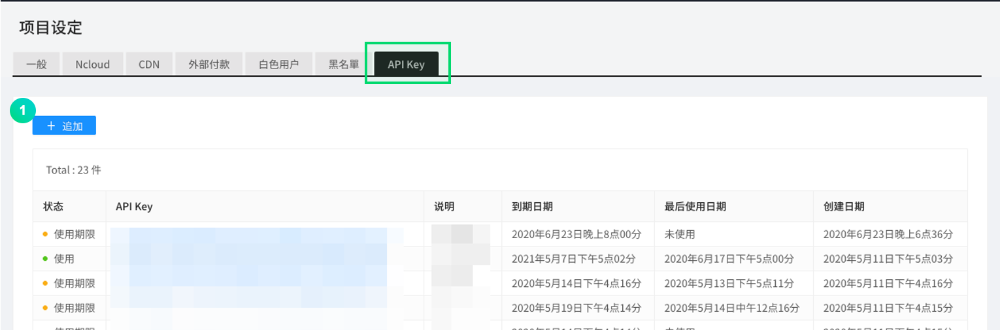
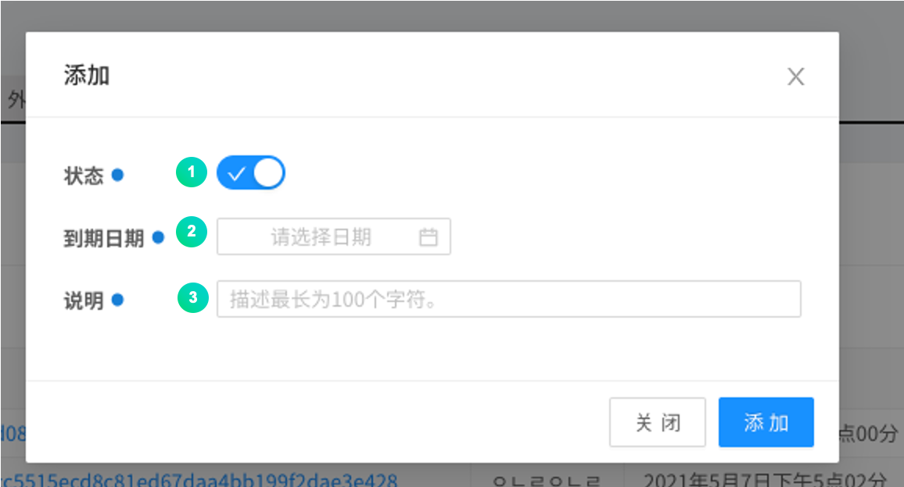
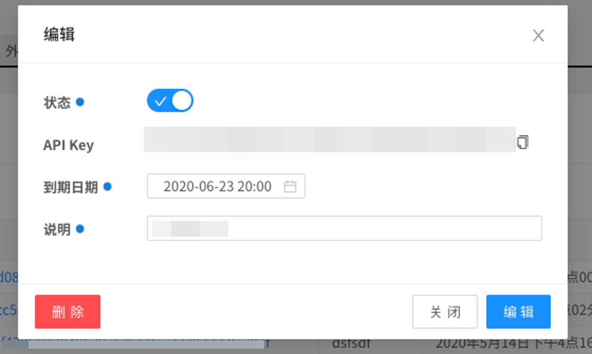

---
search:
  keyword:
    - gamepot
---

#### **为提供 NAVER CLOUD PLATFORM 产品的详细使用方法和 API 的多种使用方式，分别提供<a href="https://guide.ncloud-docs.com/docs/zh/home" target="_blank">[说明书]</a>和<a href="https://api.ncloud-docs.com/docs/zh/home" target="_blank">[API 参考指南]</a>以供参考。**

<a href="https://api.ncloud-docs.com/docs/zh/game-gamepot" target="_blank">进入 Gamepot API 参考指南 >></a><br />
<a href="https://guide.ncloud-docs.com/docs/zh/game-gamepot-overview" target="_blank">进入 Gamepot 说明书 >></a>

# Open API

该功能可以利用规定的 API 调用 GAMEPOT 提供的几种功能。

> 须使用仪表盘发放的被允许的 API 密钥才能调用，可以指定是否使用及到期日。

## API 密钥发放

如想调用 Open API，必须先在仪表盘中创建 API 密钥。

API 密钥可在<b>仪表盘 > 项目设置 > API 密钥 </b>中创建。



① 请点击添加按钮，创建 API 密钥。



① 选择是否激活相应 API 密钥。

② 设置 API 密钥到期日。

③ 输入用户可以看懂的描述。

④ 利用添加按钮添加 API 密钥。



点击已创建的 API 密钥，即可修改或删除状态。

> 使用 Open API 时，已创建的密钥值将进入头部的 x-api-key 值中。

## 使用 Open API

### 错误代码

发送 Open API 请求时发生的通用错误代码。

| 代码 | 描述                               |
| :--- | :--------------------------------- |
| -1   | 使用了仪表盘中没有的密钥时         |
| -2   | 仪表盘密钥和头部的密钥不同时       |
| -3   | 使用了仪表盘中已删除的密钥时       |
| -4   | 使用了仪表盘中作未使用处理的密钥时 |
| -5   | 密钥到期时                         |
| -6   | 没有项目 ID 时                     |

### 用户查询 API

使用用户 UID 查询用户。

#### 请求

- Method : GET
- URI : /user/{userID}

```text
GET
url : https://dashboard-api.gamepot.ntruss.com/v1/api/project/{projectId}/user/{userId}
Header : 'accept-language: ko'
Header : 'x-api-key: {从GamePot仪表盘中获取的API密钥}'
```

| 头部      | 类型   | 必填 | 描述                   |
| :-------- | :----- | :--- | :--------------------- |
| x-api-key | 字符串 | O    | GamePot 发放的认证密钥 |

| 属性      | 类型   | 描述                     |
| :-------- | :----- | :----------------------- |
| projectId | 字符串 | GamePot SDK 的 projectId |
| userId    | 字符串 | GamePot SDK 的 userId    |

#### 响应

成功

```javascript
{
  "status": 1,
  "result": {
    "id": "xxxxxxxxxxxxxx",
    "deleted": false,
    "store_id": "google",
    "country": "KR",
    "remoteip": "xxx.xxx.xxx.xxx",
    "adid": "test_s6SksBK",
    "device": "android",
    "network": "WI-FI",
    "version": "testVersion",
    "model": "test-111",
    "token": "test:Qz9Fd81H6O",
    "push": true,
    "night": true,
    "ad": true,
    "memo": null,
    "device_id": null,
    "createdAt": "Tue Apr 07 2020 16:32:17 GMT+0900 (GMT+09:00)",
    "updatedAt": "Tue Apr 07 2020 16:32:19 GMT+0900 (GMT+09:00)",
    "loginedAt": "Tue Apr 07 2020 16:32:19 GMT+0900 (GMT+09:00)",
    "deletedAt": null
  }
}
```

| 属性      | 类型   | 描述                                            |
| :-------- | :----- | :---------------------------------------------- |
| status    | Int    | 结果值\(1：成功，失败请参考错误代码\)           |
| id        | 字符串 | 用户 ID                                         |
| deleted   | 布尔型 | 是否删除会员\(true：删除，false：正常\)         |
| store_id  | 字符串 | 创建账户时访问的商店（google…）                 |
| country   | 字符串 | 用户国家代码（ISO 3166-1 标准）                 |
| remoteip  | 字符串 | 用户 IP                                         |
| adid      | 字符串 | 广告 ID                                         |
| device    | 字符串 | 设备种类（Android、ios）                        |
| network   | 字符串 | 用户访问网络（WI-FI…）                          |
| version   | 字符串 | 客户端的版本信息                                |
| model     | 字符串 | 用户设备型号名称                                |
| token     | 字符串 | 推送令牌                                        |
| push      | 布尔型 | 是否同意推送\(true：同意，false：不同意\)       |
| night     | 布尔型 | 是否同意夜间推送\(true：同意，false：不同意\)   |
| ad        | 布尔型 | 是否同意广告性推送\(true：同意，false：不同意\) |
| memo      | 字符串 | 会员备忘录                                      |
| device_id | 字符串 | 会员设备 ID                                     |
| createdAt | 字符串 | 会员创建日期                                    |
| updatedAt | 字符串 | 会员信息修改日期                                |
| loginedAt | 字符串 | 最后访问日期                                    |
| deletedAt | 字符串 | 会员删除日期                                    |

失败

```javascript
{
  "status": -6,
  "message": "projectId was wrong."
}
```

| 属性    | 类型   | 描述                                  |
| :------ | :----- | :------------------------------------ |
| status  | Int    | 结果值\(1：成功，失败请参考错误代码\) |
| message | 字符串 | 错误内容                              |

### 用户停用查询 API

使用用户 UID 查询用户是否已停用。

#### 请求

- Method : GET
- URI : /user/{userID}/block

```text
GET
url : https://dashboard-api.gamepot.ntruss.com/v1/api/project/{projectId}/user/{userId}/block
Header : 'accept-language: ko'
Header : 'x-api-key: {从GamePot仪表盘中获取的API密钥}'
```

| 头部      | 类型   | 必填 | 描述                   |
| :-------- | :----- | :--- | :--------------------- |
| x-api-key | 字符串 | O    | GamePot 发放的认证密钥 |

| 属性      | 类型   | 描述                     |
| :-------- | :----- | :----------------------- |
| projectId | 字符串 | GamePot SDK 的 projectId |
| userId    | 字符串 | GamePot SDK 的 userId    |

#### 响应

成功

```javascript
{
  "status": 1,
  "result": {
    "id": "xxxxxxxxxxxxxx",
    "member_id": "xxxxxxxxxxxxxx",
    "deleted": false,
    "type": "manual",
    "status": 1,
    "message": null,
    "messageMulti": [
      {
        "lang": "ko",
        "value": "测试-ko",
        "default": true
      }
    ],
    "startedAt": "Mon May 11 2020 12:02:00 GMT+0900 (GMT+09:00)",
    "endedAt": "Mon May 25 2020 22:00:00 GMT+0900 (GMT+09:00)",
    "createdAt": "Tue May 12 2020 14:06:40 GMT+0900 (GMT+09:00)",
    "updatedAt": "Tue May 12 2020 14:06:40 GMT+0900 (GMT+09:00)",
    "deletedAt": null,
    "category_id": ""
  }
}
```

| 属性        | 类型   | 描述                                                                            |
| :---------- | :----- | :------------------------------------------------------------------------------ |
| status      | Int    | 结果值\(1：成功，失败请参考错误代码\)                                           |
| id          | 字符串 | 用户停用信息相关 ID                                                             |
| member_id   | 字符串 | 用户 ID                                                                         |
| deleted     | 布尔型 | 是否删除用户停用信息\(true：删除，false：正常\)                                 |
| type        | 字符串 | 停用分类\(manual：手动，autopurchase：自动\)                                    |
| status      | Int    | 状态 \(1：激活，2：禁用\)                                                       |
| message     | 字符串 | 用户停用原因（目前未使用）                                                      |
| lang        | 字符串 | 停用消息语言                                                                    |
| value       | 字符串 | 停用原因消息                                                                    |
| default     | 布尔型 | 默认语言设置<br>messageMulti 中没有设备的语言值时，默认显示设置为 true 的消息。 |
| startedAt   | 字符串 | 停用开始日期                                                                    |
| endedAt     | 字符串 | 停用结束日期                                                                    |
| createdAt   | 布尔型 | 停用添加日期                                                                    |
| updatedAt   | 布尔型 | 停用修改日期                                                                    |
| deletedAt   | 布尔型 | 停用删除日期                                                                    |
| category_id | 字符串 | 停用分类 ID                                                                     |

失败

```javascript
{
  "status": -6,
  "message": "projectId was wrong."
}
```

| 属性    | 类型   | 描述                                     |
| :------ | :----- | :--------------------------------------- |
| status  | Int    | 结果值 \(1：成功，失败时请参考错误代码\) |
| message | 字符串 | 错误内容                                 |

### 用户停用设置 API

使用用户 UID 进行用户停用处理。

#### 请求

- Method : POST
- URI : /user/{userID}/block

```text
POST
url : https://dashboard-api.gamepot.ntruss.com/v1/api/project/{projectId}/user/{userId}/block
Header : 'accept-language: ko'
Header : 'content-type: application/json'
Header : 'x-api-key: {从GamePot仪表盘中获取的API密钥}'
data: '{
        "messageMulti": [
                {
                    "lang": "ko",
                    "value": "测试",
                    "default": true
                }
            ],
            "startedAt": "2020-05-11 12:02",
            "endedAt": "2020-05-25 22:00"
       }'
```

| 头部      | 类型   | 必填 | 描述                   |
| :-------- | :----- | :--- | :--------------------- |
| x-api-key | 字符串 | O    | GamePot 发放的认证密钥 |

| 属性      | 类型   | 描述                                                                            |
| :-------- | :----- | :------------------------------------------------------------------------------ |
| projectId | 字符串 | GamePot SDK 的 projectId                                                        |
| userId    | 字符串 | GamePot SDK 的 userId                                                           |
| lang      | 字符串 | 停用消息语言                                                                    |
| value     | 字符串 | 停用原因消息                                                                    |
| default   | 布尔型 | 默认语言设置<br>messageMulti 中没有设备的语言值时，默认显示设置为 true 的消息。 |
| startedAt | 字符串 | 停用开始日期`YYYY-MM-DD HH:mm`                                                  |
| endedAt   | 字符串 | 停用结束日期 `YYYY-MM-DD HH:mm`                                                 |

#### 响应

成功

```javascript
{
  "status": 1,
  "result": {
    "memberBlock": {
      "id": "xxxxxxxxxxxxx"
    }
  }
}
```

| 属性   | 类型   | 描述                                  |
| :----- | :----- | :------------------------------------ |
| status | Int    | 结果值\(1：成功，失败请参考错误代码\) |
| id     | 字符串 | 已停用的 ID                           |

失败

```javascript
{
  "status": -5,
  "message": "ApiKey was expired."
}
```

| 属性    | 类型   | 描述                                  |
| :------ | :----- | :------------------------------------ |
| status  | Int    | 结果值\(1：成功，失败请参考错误代码\) |
| message | 字符串 | 错误内容                              |

#### 错误代码

| 代码 | 描述                                                     |
| :--- | :------------------------------------------------------- |
| -11  | 正文中缺少数据                                           |
| -12  | messageMulti 值不是 JSON Array 时                        |
| -13  | startedAt 值的格式有误时。仅可使用`YYYY-MM-DD HH:mm`形式 |
| -14  | endedAt 值的格式有误时。仅可使用`YYYY-MM-DD HH:mm`形式   |
| -15  | messageMulti 值的数据格式有误时                          |
| -16  | messageMulti 值的数据中没有 default true 或存在多个时    |

### 每日访问者（DAU）查询 API

可以查询每日访问者。

#### 请求

- Method : GET
- URI : /user/statistics/dau

```text
GET
url : https://dashboard-api.gamepot.ntruss.com/v1/api/project/{projectId}/user/statistics/dau
Header : 'accept-language: ko'
Header : 'x-api-key: {从GamePot仪表盘中获取的API密钥}'
```

| 头部      | 类型   | 必填 | 描述                   |
| :-------- | :----- | :--- | :--------------------- |
| x-api-key | 字符串 | O    | GamePot 发放的认证密钥 |

| 属性      | 类型   | 描述                     |
| :-------- | :----- | :----------------------- |
| projectId | 字符串 | GamePot SDK 的 projectId |
| startDate | 字符串 | 开始查询日期`YYYY-MM-DD` |
| endDate   | 字符串 | 最终查询日期`YYYY-MM-DD` |

> 未输入 startDate、endDate 等查询条件时，将查询最近 30 天的数据。

#### 响应

成功

```javascript
{
  "status": 1,
  "result": {
    "totalCount": 3,
    "edges": [
      {
        "node": {
          "date": "Fri Apr 10 2020 09:00:00 GMT+0900 (Korean Standard Time)",
          "count": 2
        }
      },

      ...

      {
        "node": {
          "date": "Tue Apr 14 2020 09:00:00 GMT+0900 (Korean Standard Time)",
          "count": 4
        }
      }
    ]
  }
}
```

| 属性       | 类型   | 描述                                  |
| :--------- | :----- | :------------------------------------ |
| status     | Int    | 结果值\(1：成功，失败请参考错误代码\) |
| totalCount | Int    | dau 查询结果（个）数                  |
| date       | 字符串 | 统计时间                              |
| count      | Int    | （相应日期）DAU                       |

失败

```javascript
{
  "status": -11,
  "message": "startDate format was wrong.(YYYY-MM-DD)"
}
```

| 属性    | 类型   | 描述                                  |
| :------ | :----- | :------------------------------------ |
| status  | Int    | 结果值\(1：成功，失败请参考错误代码\) |
| message | 字符串 | 错误内容                              |

#### 错误代码

| 代码 | 描述                                               |
| :--- | :------------------------------------------------- |
| -11  | startDate 值的格式有误时。仅可使用`YYYY-MM-DD`形式 |
| -12  | endDate 值的格式有误时。仅可使用`YYYY-MM-DD`形式   |

### 新用户（NRU）查询 API

可以查询新用户。

#### 请求

- Method : GET
- URI : /user/statistics/nru

```text
GET
url : https://dashboard-api.gamepot.ntruss.com/v1/api/project/{projectId}/user/statistics/nru
Header : 'accept-language: ko'
Header : 'x-api-key: {从GamePot仪表盘中获取的API密钥}'
```

| 头部      | 类型   | 必填 | 描述                   |
| :-------- | :----- | :--- | :--------------------- |
| x-api-key | 字符串 | O    | GamePot 发放的认证密钥 |

| 属性      | 类型   | 描述                     |
| :-------- | :----- | :----------------------- |
| projectId | 字符串 | GamePot SDK 的 projectId |
| startDate | 字符串 | 开始查询日期`YYYY-MM-DD` |
| endDate   | 字符串 | 最终查询日期`YYYY-MM-DD` |

> 未输入 startDate、endDate 等查询条件时，将查询最近 30 天的数据。

#### 响应

成功

```javascript
{
  "status": 1,
  "result": {
    "totalCount": 3,
    "edges": [
      {
        "node": {
          "date": "2020-04-10",
          "count": 2
        }
      },

    ...

      {
        "node": {
          "date": "2020-04-14",
          "count": 1
        }
      }
    ]
  }
}
```

| 属性       | 类型   | 描述                                  |
| :--------- | :----- | :------------------------------------ |
| status     | Int    | 结果值\(1：成功，失败请参考错误代码\) |
| totalCount | int    | 查询（个）数                          |
| date       | 字符串 | 统计日期                              |
| count      | int    | （相应日期）NRU                       |

失败

```javascript
{
  "status": -11,
  "message": "startDate format was wrong.(YYYY-MM-DD)"
}
```

| 属性    | 类型   | 描述                                  |
| :------ | :----- | :------------------------------------ |
| status  | Int    | 结果值\(1：成功，失败请参考错误代码\) |
| message | 字符串 | 错误内容                              |

#### 错误代码

| 代码 | 描述                                               |
| :--- | :------------------------------------------------- |
| -11  | startDate 值的格式有误时。仅可使用`YYYY-MM-DD`形式 |
| -12  | endDate 值的格式有误时。仅可使用`YYYY-MM-DD`形式   |

### 同时访问者（CCU）查询 API

在所选的三个日期里，可按时间段查询同时访问者。

#### 请求

- Method : GET
- URI : /user/statistics/ccu

```text
GET
url : https://dashboard-api.gamepot.ntruss.com/v1/api/project/{projectId}/user/statistics/ccu
Header : 'accept-language: ko'
Header : 'x-api-key: {从GamePot仪表盘中获取的API密钥}'
```

| 头部      | 类型   | 必填 | 描述                   |
| :-------- | :----- | :--- | :--------------------- |
| x-api-key | 字符串 | O    | GamePot 发放的认证密钥 |

| 属性      | 类型   | 描述                       |
| :-------- | :----- | :------------------------- |
| projectId | 字符串 | GamePot SDK 的 projectId   |
| oneDate   | 字符串 | 第一个查询日期`YYYY-MM-DD` |
| twoDate   | 字符串 | 第二个查询日期`YYYY-MM-DD` |
| threeDate | 字符串 | 第三个查询日期`YYYY-MM-DD` |

> 提供 oneDate、twoDate、threeDate 的查询条件，未提供时可查询当天及前 2 日的访问者。

#### 响应

成功

```javascript
{
  "status": 1,
  "result": {
    "totalCount": 1440,
    "edges": [
      {
        "node": {
          "createdAt": "00:00",
          "one": 0,
          "two": 0,
          "three": 0
        }
      },

        ...

      {
        "node": {
          "createdAt": "23:59",
          "one": 0,
          "two": 0,
          "three": null
        }
      }
    ]
  }
}

```

| 属性       | 类型   | 描述                                  |
| :--------- | :----- | :------------------------------------ |
| status     | Int    | 结果值\(1：成功，失败请参考错误代码\) |
| totalCount | Int    | ccu 查询结果（个）数                  |
| createdAt  | 字符串 | 统计时间                              |
| one        | Int    | （第一个日期的）相应时间同时访问者数  |
| two        | Int    | （第二个日期的）相应时间同时访问者数  |
| three      | Int    | （第三个日期的）相应时间同时访问者数  |

失败

```javascript
{
  "status": -11,
  "message": "threeDate format was wrong.(YYYY-MM-DD)"
}
```

| 属性    | 类型   | 描述                                  |
| :------ | :----- | :------------------------------------ |
| status  | Int    | 结果值\(1：成功，失败请参考错误代码\) |
| message | 字符串 | 错误内容                              |

#### 错误代码

| 代码 | 描述                                               |
| :--- | :------------------------------------------------- |
| -11  | threeDate 值的格式有误时。仅可使用`YYYY-MM-DD`形式 |
| -12  | twoDate 值的格式有误时。仅可使用`YYYY-MM-DD`形式   |
| -13  | oneDate 值的格式有误时。仅可使用`YYYY-MM-DD`形式   |

### 支付查询 API

以支付 ID 查询支付明细。

#### 请求

- Method : GET
- URI : /purchase/{transactionID}

```text
GET
url : https://dashboard-api.gamepot.ntruss.com/v1/api/project/{projectId}/purchase/{transactionID}
Header : 'accept-language: ko'
Header : 'x-api-key: {从GamePot仪表盘中获取的API密钥}'
```

| 头部      | 类型   | 必填 | 描述                   |
| :-------- | :----- | :--- | :--------------------- |
| x-api-key | 字符串 | O    | GamePot 发放的认证密钥 |

| 属性          | 类型   | 描述                     |
| :------------ | :----- | :----------------------- |
| projectId     | 字符串 | GamePot SDK 的 projectId |
| transactionID | 字符串 | GamePot SDK 的支付 ID    |

#### 响应

成功

```javascript
{
  "status": 1,
  "result": {
    "status": 1,
    "exchange_price": 5000,
    "project_id": "xxxxxxxxxxxxxx",
    "store_id": "google",
    "payment_id": "google",
    "signature": "xxxxxxxxxxxxxxxxxxxxxxxxxxxx",
    "order_id": "u8934",
    "currency": "KRW",
    "userdata": "{\"unique_id\":\"u8934\",\"server_id\":\"\",\"player_id\":\"\",\"etc\":\"\"}",
    "price": 5000,
    "id": "xxxxxxxxxxxxxx",
    "unique_id": "u8934",
    "transaction_id": "xxxxxxxxxxxxxx",
    "createdAt": "Wed Mar 18 2020 17:55:29 GMT+0900 (GMT+09:00)",
    "updatedAt": "Wed Mar 18 2020 17:55:29 GMT+0900 (GMT+09:00)",
    "request": "https://xxxxxxxxxxxxxx",
    "response": "{\"status\":1}",
    "item_id": {
      "status": null,
      "type": "inapp",
      "name": "name_001",
      "prices": []
    },
    "user_id": {
      "id": "xxxxxxxxxxxxxx",
      "deleted": false,
      "store_id": "google",
      "country": "KR",
      "remoteip": "xxx.xxx.xxx.xxx",
      "adid": "xxxxxxxxxxxxxx",
      "device": "android",
      "network": "WIFI",
      "version": "10",
      "model": "Pixel_3",
      "token": "xxxxxxxxxxxxxx",
      "push": true,
      "night": false,
      "ad": true,
      "memo": null,
      "device_id": "xxxxxxxxxxxxxx",
      "createdAt": "Wed Mar 18 2020 17:54:41 GMT+0900 (GMT+09:00)",
      "updatedAt": "Wed Mar 18 2020 17:54:42 GMT+0900 (GMT+09:00)",
      "loginedAt": "Wed Mar 18 2020 17:54:41 GMT+0900 (GMT+09:00)",
      "deletedAt": null
    }
  }
}
```

| 属性                 | 类型   | 描述                                                        |
| :------------------- | :----- | :---------------------------------------------------------- |
| status               | Int    | 结果值\(1：成功，失败请参考错误代码\)                       |
| （result 的）status  | Int    | 支付结果值\(1：成功）                                       |
| exchange_price       | Int    | 支付金额（适用汇率）                                        |
| project_id           | 字符串 | GamePot SDK 的 projectId                                    |
| store_id             | 字符串 | 商店 ID（google、one、apple、galaxy）                       |
| payment_id           | 字符串 | 支付商店 ID（google、tpay…）ㅣ一般与 store_id 相同          |
| signature            | 字符串 | 签名                                                        |
| order_id             | 字符串 | Order ID                                                    |
| currency             | 字符串 | 货币                                                        |
| userdata             | 字符串 | 用户信息                                                    |
| price                | Int    | 支付金额                                                    |
| id                   | 字符串 | 支付数据的 unique ID                                        |
| unique_id            | 字符串 | Unique ID                                                   |
| transaction_id       | 字符串 | 商店支付 ID                                                 |
| createdAt            | 字符串 | 创建日期                                                    |
| updatedAt            | 字符串 | 更新日期                                                    |
| request              | 字符串 | 支付请求值                                                  |
| response             | 字符串 | 支付响应值                                                  |
| （item_id 的）status | 字符串 | （item_id 的）结果值                                        |
| type                 | 字符串 | 道具类型（应用内）                                          |
| name                 | 字符串 | 道具名称                                                    |
| prices               | 字符串 | 道具价格                                                    |
| user_id              |        | 响应成功值中 user_id 部分请参考<b><I>用户查询 API</I></b>。 |

失败

```javascript
{
  "status": -6,
  "message": "projectId was wrong."
}
```

| 属性    | 类型   | 描述                                     |
| :------ | :----- | :--------------------------------------- |
| status  | Int    | 结果值 \(1：成功，失败时请参考错误代码\) |
| message | 字符串 | 错误内容                                 |

### 支付取消查询 API

以支付 ID 查询取消支付明细。

> 仅限查询 Google 支付。

#### 请求

- Method : GET
- URI : /purchase/voided/{transactionID}

```text
GET
url : https://dashboard-api.gamepot.ntruss.com/v1/api/project/{projectId}/purchase/voided/{transactionID}
Header : 'accept-language: ko'
Header : 'x-api-key: {从GamePot仪表盘中获取的API密钥}'
```

| 头部      | 类型   | 必填 | 描述                   |
| :-------- | :----- | :--- | :--------------------- |
| x-api-key | 字符串 | O    | GamePot 发放的认证密钥 |

| 属性          | 类型   | 描述                     |
| :------------ | :----- | :----------------------- |
| projectId     | 字符串 | GamePot SDK 的 projectId |
| transactionID | 字符串 | GamePot SDK 的支付 ID    |

#### 响应

成功

```javascript
{
  "status": 1,
  "result": {
    "id": "xxxxxxxxxxxxxx",
    "member_id": "xxxxxxxxxxxxxx",
    "package_id": "xxx.xxx.xxxxxxx",
    "price": 3000,
    "deleted": false,
    "purchasedAt": "Fri Feb 21 2020 16:32:35 GMT+0900 (GMT+09:00)",
    "voidedAt": "Fri Feb 21 2020 16:33:58 GMT+0900 (GMT+09:00)",
    "createdAt": "Fri Feb 21 2020 17:25:10 GMT+0900 (GMT+09:00)",
    "updatedAt": "Fri Feb 21 2020 17:25:10 GMT+0900 (GMT+09:00)",
    "deletedAt": null,
    "currency": "KRW",
    "status": 0,
    "purchase_id": {
      "status": 1,
      "exchange_price": 3000,
      "project_id": "xxxxxxxxxxxxxxxxxx",
      "store_id": "google",
      "payment_id": "google",
      "signature": "xxxxxxxxxxxxxxxxxxxxxxxxxxxxxxxxxxxxxxxxxx",
      "order_id": "xxxxxxxxxxxxxx",
      "currency": "KRW",
      "userdata": "{\"unique_id\":\"\",\"server_id\":\"\",\"player_id\":\"\",\"etc\":\"\"}",
      "price": 3000,
      "id": "xxxxxxxxxxxxxx",
      "unique_id": "",
      "transaction_id": "GPA.3307-2597-6064-86473",
      "createdAt": "Fri Feb 21 2020 16:32:39 GMT+0900 (GMT+09:00)",
      "updatedAt": "Fri Feb 21 2020 17:25:10 GMT+0900 (GMT+09:00)",
      "request": "https://xxxxxxxxxxxxxxxxxxxxxxxxxxxx",
      "response": "{\"status\":1}"
    }
  }
}
```

| 属性        | 类型   | 描述                                                            |
| :---------- | :----- | :-------------------------------------------------------------- |
| status      | Int    | 结果值\(1：成功，失败请参考错误代码\)                           |
| id          | 字符串 | 取消支付 ID                                                     |
| member_id   | 字符串 | 用户 UID                                                        |
| package_id  | 字符串 | 包名                                                            |
| price       | int    | 支付金额                                                        |
| deleted     | 布尔型 | 是否删除\(true：删除，false：正常\)                             |
| purchasedAt | 字符串 | 支付日期                                                        |
| voidedAt    | 字符串 | 取消支付日期                                                    |
| createdAt   | 字符串 | 创建日期                                                        |
| updatedAt   | 字符串 | 更新日期                                                        |
| deletedAt   | 字符串 | 删除日期                                                        |
| currency    | 字符串 | 货币                                                            |
| status      | Int    | 状态                                                            |
| purchase_id |        | 响应成功值中 purchase_id 部分请参考<b><I>支付查询 API</I></b>。 |

失败

```javascript
{
  "status": -6,
  "message": "projectId was wrong."
}
```

| 属性    | 类型   | 描述                                     |
| :------ | :----- | :--------------------------------------- |
| status  | Int    | 结果值 \(1：成功，失败时请参考错误代码\) |
| message | 字符串 | 错误内容                                 |

### 支付销售统计查询 API

查询支付销售统计。

#### 请求

- Method : GET
- URI : /purchase/statistics

```text
GET
url : https://dashboard-api.gamepot.ntruss.com/v1/api/project/{projectId}/purchase/statistics?startDate={startDate}&endDate={endDate}&currency={currency}
Header : 'accept-language: ko'
Header : 'x-api-key: {从GamePot仪表盘中获取的API密钥}'
```

| 头部      | 类型   | 必填 | 描述                   |
| :-------- | :----- | :--- | :--------------------- |
| x-api-key | 字符串 | O    | GamePot 发放的认证密钥 |

| 属性      | 类型   | 描述                                                  |
| :-------- | :----- | :---------------------------------------------------- |
| projectId | 字符串 | GamePot SDK 的 projectId                              |
| startDate | 字符串 | 支付销售统计搜索开始日期`YYYY-MM-DD`                  |
| endDate   | 字符串 | 支付销售统计搜索结束日期`YYYY-MM-DD`                  |
| currency  | 字符串 | 支付销售统计货币搜索（全部…）<br>遵循 ISO 4217 标准。 |

> 未输入 startDate、endDate 等查询条件时，将查询最近 30 天的数据。

#### 响应

成功

```javascript
"status": 1,
  "result": {
    "totalCount": 13,
    "currencyList": [
      "KRW",
      "USD"
    ],
    "edges": [
      {
        "node": {
          "date": "2020-05-01",
          "count": 0
        }
      },
      {
        "node": {
          "date": "2020-05-02",
          "count": 0
        }
      },

...

      {
        "node": {
          "date": "2020-05-13",
          "count": 4008857.31
        }
      }
    ]
  }
}
```

| 属性         | 类型   | 描述                                  |
| :----------- | :----- | :------------------------------------ |
| status       | Int    | 结果值\(1：成功，失败请参考错误代码\) |
| totalCount   | Int    | 搜索结果值数                          |
| currencyList | 字符串 | 货币列表<br>遵循 ISO 4217 标准。      |
| date         | 字符串 | 统计日期                              |
| count        | 字符串 | 销量统计金额                          |

失败

```javascript
{
  "status": -6,
  "message": "projectId was wrong."
}
```

| 属性    | 类型   | 描述                                  |
| :------ | :----- | :------------------------------------ |
| status  | Int    | 结果值\(1：成功，失败请参考错误代码\) |
| message | 字符串 | 错误内容                              |

#### 错误代码

| 代码 | 描述                                               |
| :--- | :------------------------------------------------- |
| -11  | startDate 值的格式有误时。仅可使用`YYYY-MM-DD`形式 |
| -12  | endDate 值的格式有误时。仅可使用`YYYY-MM-DD`形式   |

### 角色查询 API

查询游戏内玩家 ID。

#### 请求

- Method : GET
- URI : /player/{playerID}

```text
GET
url : https://dashboard-api.gamepot.ntruss.com/v1/api/project/{projectId}/player/{playerID}
Header : 'accept-language: ko'
Header : 'x-api-key: {从GamePot仪表盘中获取的API密钥}'
```

| 头部      | 类型   | 必填 | 描述                   |
| :-------- | :----- | :--- | :--------------------- |
| x-api-key | 字符串 | O    | GamePot 发放的认证密钥 |

| 属性      | 类型   | 描述                     |
| :-------- | :----- | :----------------------- |
| projectId | 字符串 | GamePot SDK 的 projectId |
| playerID  | 字符串 | GamePot SDK 的玩家 ID    |

#### 响应

成功

```javascript
{
  "status": 1,
  "result": {
    "id": "xxxxxxxxxxxxxxx",
    "player_id": "测试ID",
    "server_id": "测试服务器",
    "name": "测试名称",
    "level": "12",
    "userdata": "dododo",
    "ip": "xxx.xxx.xxx.xxx",
    "createdAt": "Fri Feb 21 2020 14:15:33 GMT+0900 (GMT+09:00)",
    "updatedAt": "Fri Feb 21 2020 14:15:33 GMT+0900 (GMT+09:00)",
    "user_id": "xxxxxxxxxxxxxxx"
  }
}
```

| 属性      | 类型   | 描述                                  |
| :-------- | :----- | :------------------------------------ |
| status    | Int    | 结果值\(1：成功，失败请参考错误代码\) |
| id        | 字符串 | 用户 ID  / 请忽略它。                             |
| player_id | 字符串 | 玩家 ID                               |
| server_id | 字符串 | 服务器 ID                             |
| name      | 字符串 | 玩家名                                |
| level     | 字符串 | 玩家等级                              |
| userdata  | 字符串 | 添加的 Userdata                       |
| ip        | 字符串 | 玩家 IP                               |
| createdAt | 字符串 | 玩家创建日期                          |
| updatedAt | 字符串 | 玩家更新日期                          |
| user_id   | 字符串 | GAMEPOT UID                           |

失败

```javascript
{
  "status": -1,
  "message": "ApiKey was wrong."
}
```

| 属性    | 类型   | 描述                                     |
| :------ | :----- | :--------------------------------------- |
| status  | Int    | 结果值 \(1：成功，失败时请参考错误代码\) |
| message | 字符串 | 错误内容                                 |

### 优惠券使用查询 API

查询优惠券使用明细。

> 关键词优惠券仅可查询已使用的优惠券。

#### 请求

- Method : GET
- URI : /coupon/{couponNumber}

```text
GET
url : https://dashboard-api.gamepot.ntruss.com/v1/api/project/{projectId}/coupon/{couponNumber}?userData={userData}
Header : 'accept-language: ko'
Header : 'x-api-key: {从GamePot仪表盘中获取的API密钥}'
```

| 头部      | 类型   | 必填 | 描述                   |
| :-------- | :----- | :--- | :--------------------- |
| x-api-key | 字符串 | O    | GamePot 发放的认证密钥 |

| 属性         | 类型   | 描述                     |
| :----------- | :----- | :----------------------- |
| projectId    | 字符串 | GamePot SDK 的 projectId |
| couponNumber | 字符串 | 仪表盘发放的优惠券编号   |
| userData     | 字符串 | 用户数据                 |

#### 响应

成功

```javascript
{
  "status": 1,
  "result": {
    "id": "xxxxxxxxxxxxxxxx",
    "status": false,
    "enable": 1,
    "number": "xxxxxxxxxxxxxxxx",
    "userdata": "",
    "usedAt": null,
    "createdAt": "Wed May 13 2020 12:12:04 GMT+0900 (Korean Standard Time)",
    "request": null,
    "response": null,
    "coupon_id": {
      "id": "xxxxxxxxxxxxxxxx",
      "enable": 1,
      "type": "normal",
      "keyword": null,
      "desc": "第2季更新提前预约奖励",
      "used": 1,
      "count": 2010,
      "length": 7,
      "limit": null,
      "prefix": "",
      "suffix": "",
      "store_id": "",
      "startedAt": "Sun May 10 2020 16:35:00 GMT+0900 (Korean Standard Time)",
      "endedAt": "Sat May 23 2020 16:35:00 GMT+0900 (Korean Standard Time)",
      "items": [
        {
          "item_id": "xxxxxxxxxxxxxxxx",
          "store_item_id": "xxxxxxxxxxxxxxxx",
          "count": 10
        },
        {
          "item_id": "xxxxxxxxxxxxxxxx",
          "store_item_id": "xxxxxxxxxxxxxxxx",
          "count": 1
        }
      ]
    }
  }
}
```

| 属性                   | 类型   | 描述                                        |
| :--------------------- | :----- | :------------------------------------------ |
| status                 | Int    | 结果值\(1：成功，失败请参考错误代码\)       |
| id                     | 字符串 | 优惠券使用明细 ID                           |
| status                 | 布尔型 | 优惠券是否使用\(true：使用，false：未使用\) |
| enable                 | Int    | 是否可用                                    |
| number                 | 字符串 | 优惠券编号                                  |
| userdata               | 字符串 | 优惠券使用用户查询                          |
| usedAt                 | 字符串 | 优惠券使用日期                              |
| request                | 字符串 | 优惠券使用请求                              |
| response               | 字符串 | 优惠券使用响应                              |
| （coupon_id 的）id     | 字符串 | 优惠券 ID                                   |
| （coupon_id 的）enable | int    | 是否可用                                    |
| type                   | 字符串 | 优惠券类型                                  |
| keyword                | 字符串 | 关键词优惠券关键词                          |
| desc                   | 字符串 | 优惠券名称                                  |
| used                   | int    | 优惠券状态                                  |
| count                  | int    | 优惠券数量                                  |
| length                 | int    | 优惠券长度                                  |
| limit                  | 字符串 | 道具数量                                    |
| prefix                 | 字符串 | 优惠券后缀                                  |
| suffix                 | 字符串 | 优惠券前缀                                  |
| store_id               | 字符串 | 商店 ID（google、one、apple、galaxy）       |
| startedAt              | 字符串 | 优惠券使用开始日期                          |
| endedAt                | 字符串 | 优惠券使用结束日期                          |
| item_id                | 字符串 | 道具 ID                                     |
| store_item_id          | 字符串 | 道具商店 ID                                 |
| count                  | int    | 道具数量                                    |

失败

```javascript
{
  "status": -1,
  "message": "ApiKey was wrong."
}
```

| 属性    | 类型   | 描述                                     |
| :------ | :----- | :--------------------------------------- |
| status  | Int    | 结果值 \(1：成功，失败时请参考错误代码\) |
| message | 字符串 | 错误内容                                 |

### 优惠券使用 API

可以使用优惠券。

#### 请求

- Method : PUT
- URI : /store/{storeID}/user/{userID}/coupon/{couponNumber}

```text
PUT
url : https://dashboard-api.gamepot.ntruss.com/v1/api/project/{projectId}/store/{storeID}/user/{userID}/coupon/{couponNumber}
Header : 'accept-language: ko'
Header : 'x-api-key: {从GamePot仪表盘中获取的API密钥}'
```

| 头部      | 类型   | 必填 | 描述                   |
| :-------- | :----- | :--- | :--------------------- |
| x-api-key | 字符串 | O    | GamePot 发放的认证密钥 |

| 属性         | 类型   | 描述                                  |
| :----------- | :----- | :------------------------------------ |
| projectId    | 字符串 | GamePot SDK 的 projectId              |
| storeID      | 字符串 | 商店 ID（google、one、apple、galaxy） |
| userID       | 字符串 | GamePot SDK 的用户 UID                |
| couponNumber | 字符串 | 优惠券编号                            |

#### 响应

成功

```javascript
{
  "status": 1,
  "message": "success"
}
```

| 属性    | 类型   | 描述                                  |
| :------ | :----- | :------------------------------------ |
| status  | Int    | 结果值\(1：成功，失败请参考错误代码\) |
| message | 字符串 | 结果内容                              |

失败

```javascript
{
  "status": -5,
  "message": "ApiKey was expired."
}
```

| 属性      | 类型   | 描述                                     |
| :-------- | :----- | :--------------------------------------- |
| status    | Int    | 结果值 \(1：成功，失败时请参考错误代码\) |
| message   | 字符串 | 错误内容                                 |
| errorcode | 字符串 | 错误代码                                 |

### 发布中的公告事项 API

可以查看发布中的公告事项。

#### 请求

- Method : GET
- URI : /store/{storeID}/notice/posting

```text
GET
url : https://dashboard-api.gamepot.ntruss.com/v1/api/project/{projectId}/store/{storeID}/notice/posting
Header : 'accept-language: ko'
Header : 'x-api-key: {从GamePot仪表盘中获取的API密钥}'
```

| 头部      | 类型   | 必填 | 描述                   |
| :-------- | :----- | :--- | :--------------------- |
| x-api-key | 字符串 | O    | GamePot 发放的认证密钥 |

| 属性      | 类型   | 描述                                  |
| :-------- | :----- | :------------------------------------ |
| projectId | 字符串 | GamePot SDK 的 projectId              |
| storeID   | 字符串 | 商店 ID（google、one、apple、galaxy） |

#### 响应

成功

```javascript
{
  "status": 1,
  "result": {
    "totalCount": 1,
    "baseUrl": "https://kr.object.ncloudstorage.com/gamepot-rms76mi9",
    "edges": [
      {
        "node": {
          "id": "Tm90aWNlOjU5ZDY3MTE3LTYyZWUtNGY0ZC04YTc0LTIyZmIzZWNjYmJiMQ==",
          "store_id": "",
          "enable": true,
          "url": null,
          "scheme": null,
          "startDate": "Fri May 01 2020 15:21:00 GMT+0900 (Korean Standard Time)",
          "endDate": "Sun May 31 2020 18:24:00 GMT+0900 (Korean Standard Time)",
          "image": [
            {
              "lang": "ko",
              "value": "/notices/06cd531c-ff20-4139-bfa3-317def49dcc8.png",
              "default": true
            }
          ]
        }
      }
    ]
  }
}
```

| 属性       | 类型   | 描述                                   |
| :--------- | :----- | :------------------------------------- |
| status     | Int    | 结果值\(1：成功，失败请参考错误代码\)  |
| totalCount | 字符串 | 公告事项（图像）查询（个）数           |
| baseUrl    | 字符串 | Object Storage Bucket URL              |
| id         | 字符串 | （相应图像的）唯一 ID                  |
| store_id   | 字符串 | 支付商店（google、one、apple、galaxy） |
| enable     | 布尔型 | 是否激活公告事项                       |
| url        | 字符串 | （单击操作）url                        |
| scheme     | 字符串 | （单击操作）scheme                     |
| startDate  | 字符串 | 公告开始日期                           |
| endDate    | 字符串 | 公告结束日期                           |
| lang       | 字符串 | 语言                                   |
| value      | 字符串 | （baseUrl 以下）资源地址               |
| default    | 布尔型 | 是否为默认语言                         |

失败

```javascript
{
  "status": -1,
  "message": "ApiKey was wrong."
}
```

| 属性    | 类型   | 描述                                     |
| :------ | :----- | :--------------------------------------- |
| status  | Int    | 结果值 \(1：成功，失败时请参考错误代码\) |
| message | 字符串 | 错误内容                                 |
