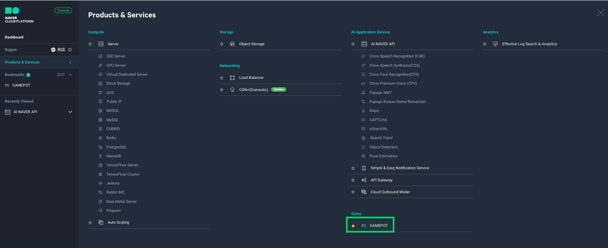
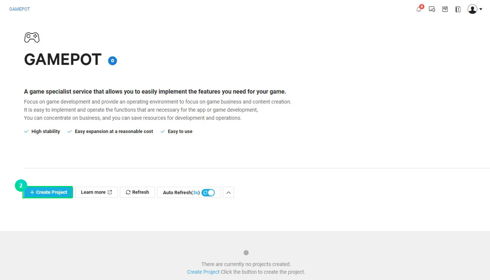
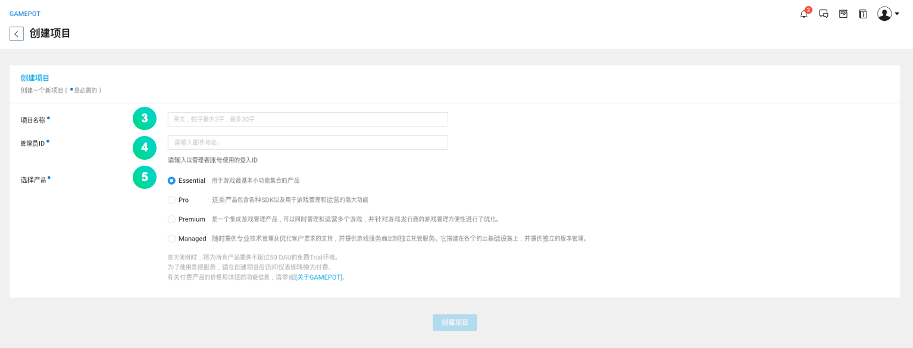
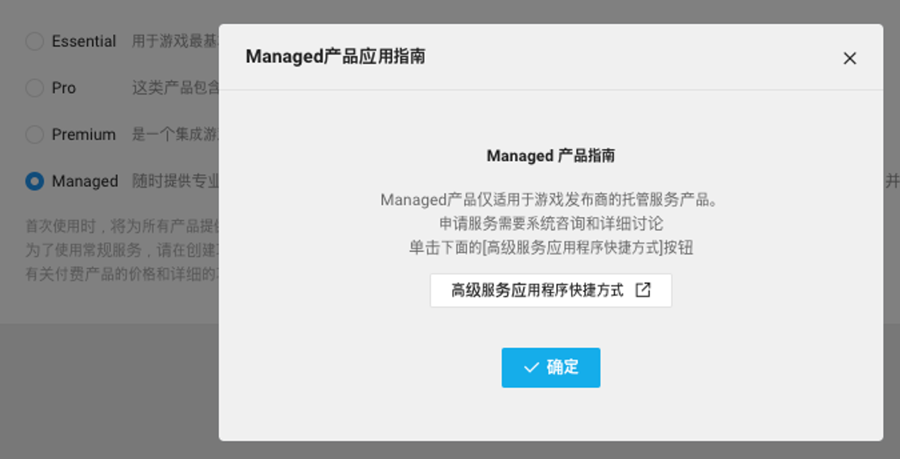
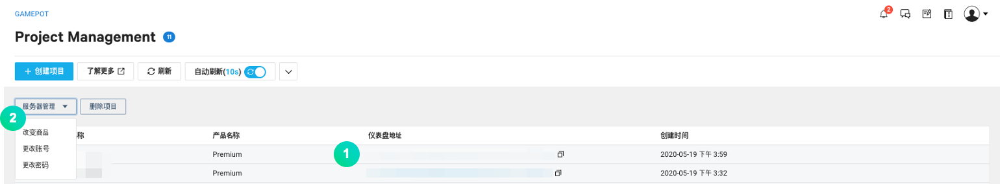
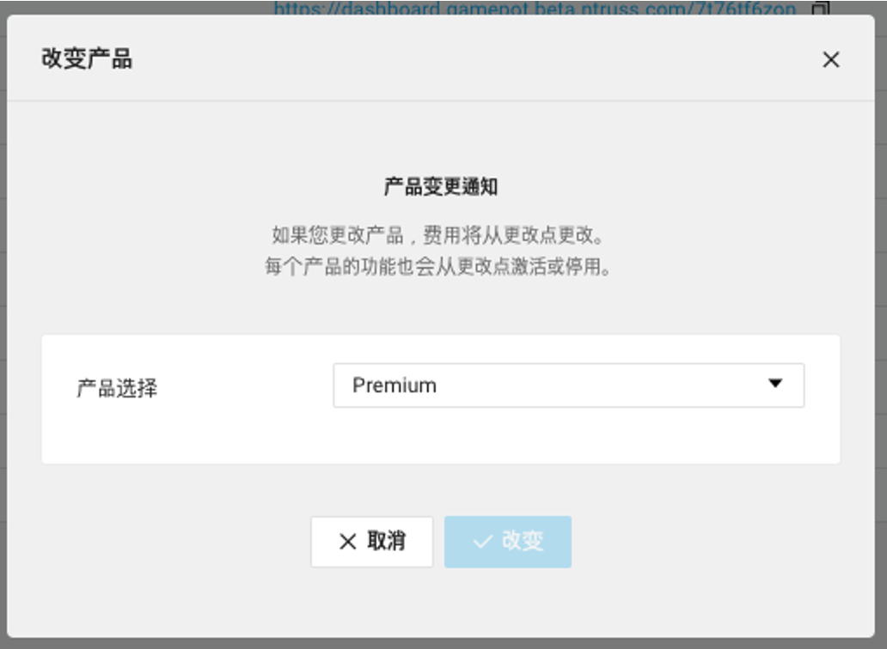
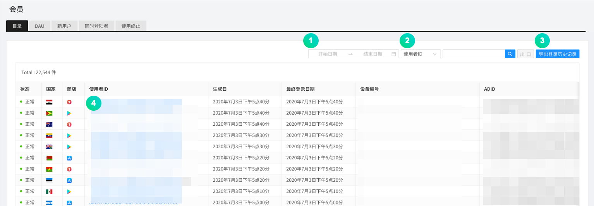
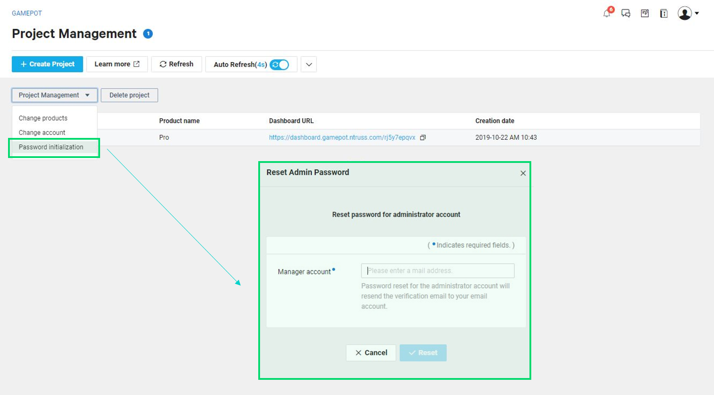
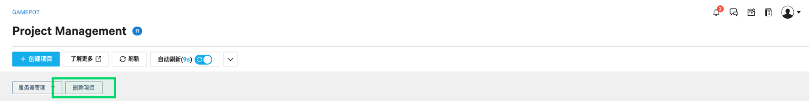
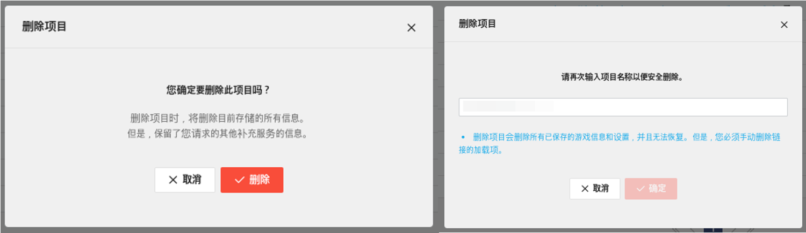

## 使用前

GAME Platform On the real Time（下称 GAMEPOT）产品是无需额外投入开发费用，即可简单实现开发游戏并提供服务时所需功能的云服务。特别值得一提的是，该服务不仅提供通用 SDK，还提供运营游戏时需要的必备功能和各种附加功能，是一款可以让用户专注于游戏开发的完全管理型服务。不需要开发运营工具或 SDK 服务器及运营基础设施，即可有效使用资源。

**NAVER Cloud Platform GAMEPOT 的专属特点**

- 提供游戏运营所需的各种功能。
- 提供便于管理和统计的独立“仪表盘”。由于仪表盘并不是简单地按账户划分所有客户公司，因此数据安全性很高。
- 客户可以直接管理有关游戏运营的仪表盘访问账户，因此更加安全。
- 可以轻松关联 NAVER Cloud Platform 的各种产品。同时，关联产品的价格也十分合理。

**Q. 其他公司的服务费用会随着游戏的规模扩大而提高。GAMEPOT 是怎样的？**

GAMEPOT 采用的不是费用与游戏升级成比例增加的结构。当前国内外类似服务都具有游戏越火费用越高的低效率结构特点，因此发生了超出预期的额外费用。但是 GAMEPOT 具有包括基本 DAU 的定额收费制和超过基本 DAU 时只追加支付超出部分费用的计量收费制混合的混合型收费制。基本 DAU 为 50,000 DAU/天，这个量绝对不少。

**Q. 请描述一下仪表盘的安全性。**

通过客户账户访问通用仪表盘时，一旦发生客户公司账户信息泄露，保存的所有数据都可能会外泄。虽然 NAVER Cloud Platform 的安全系统从源头上切断了信息外泄，但为了进一步加强安全，GAMEPOT 给所有客户都提供了不同的访问域和仪表盘系统，因此可以更安全地保护客户的数据。

## 使用 GAMEPOT

## 第一步. 创建项目

要使用服务，必须先创建项目。

① 在控制台中选择**Game > GAMEPOT**。

② 点击 **[+创建项目]** 按钮。

③ 输入游戏项目名称。

- 名称可输入最少 3 个字符、最多 30 个字符。
- 只能输入英文字母、数字和“-”符号。

④ 输入要在仪表盘中使用的管理员 ID。

- 管理员 ID 以邮箱格式输入。
- ID 认证所需的邮件会发送至输入的邮箱。

⑤ 选择产品。

- 选择 Managed 产品时，会弹出一个服务申请向导窗口。

⑥ 点击 **[创建项目]** 按钮，完成项目创建。

- 创建项目后，会收取包括基本 DAU 的每小时费用。创建项目后，即使未使用也会收取费用，因此请慎重选择。

项目创建后，会显示可访问仪表盘的 URL。须进入管理员 ID 邮箱确认邮件，完成管理员认证。

邮件认证成功后，转到可输入初始密码的仪表盘窗口。设置初始密码后登录即可。

### 第二步. 管理项目

项目创建成功后，可看到标注了游戏项目名和产品名的列表画面。

① 可以通过仪表盘 URL 进入可管理游戏功能的仪表盘。

② 勾选项目并点击 **[项目管理]** 按钮时，会显示简单的管理菜单。

- 更改产品：更改正在使用的服务产品。可能会出现暂时无法访问仪表盘的情况。点击 **[更改产品]** 按钮时，会弹出如下弹窗。选择要更改的产品后点击 **[修改]** 按钮。

- 更改账户：可以更改创建项目时输入的管理员 ID。完成更改申请后，向更改的账户邮箱地址发送认证邮件。

- 密码初始化：仪表盘访问密码丢失或者需要初始化时使用。密码初始化之后访问仪表盘，可以重新设置密码。

### 第三步. 删除项目

GAMEPOT 从项目创建完成时开始按小时产生费用。因此，不需要时应删除项目，以免产生不必要的费用。

① 删除项目时，点击 **[删除项目]** 按钮。点击 **[删除项目]** 按钮时，会弹出如下弹窗。

② 为了完成删除，需要输入项目名称。

③ 出现如上弹窗，点击 **[确定]** 按钮时，将进行最终删除。
