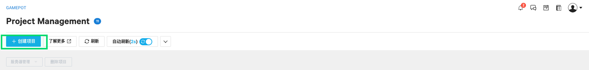
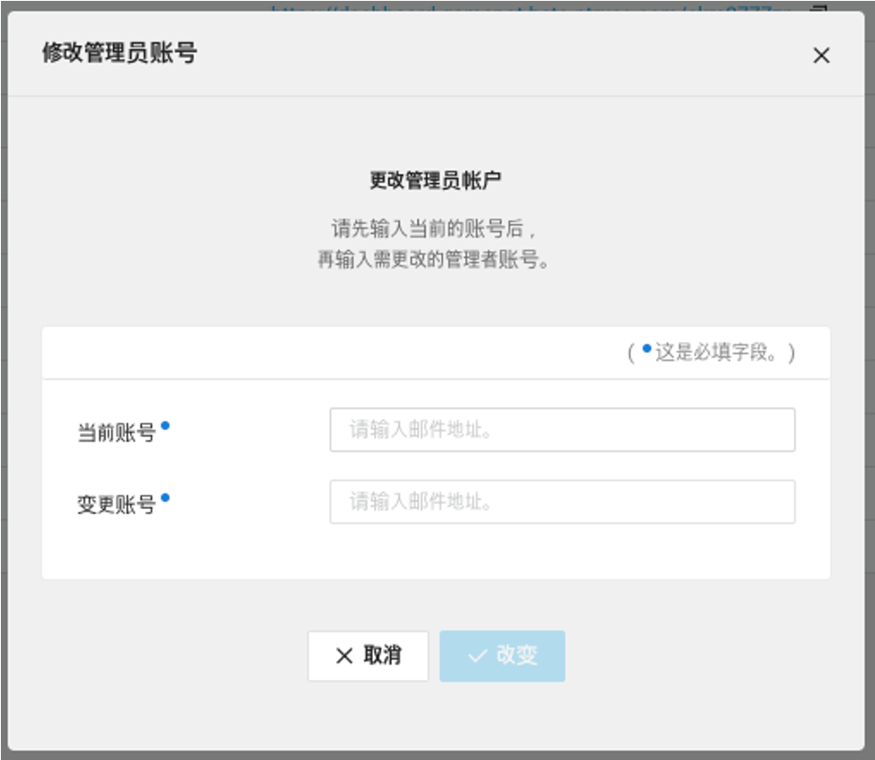
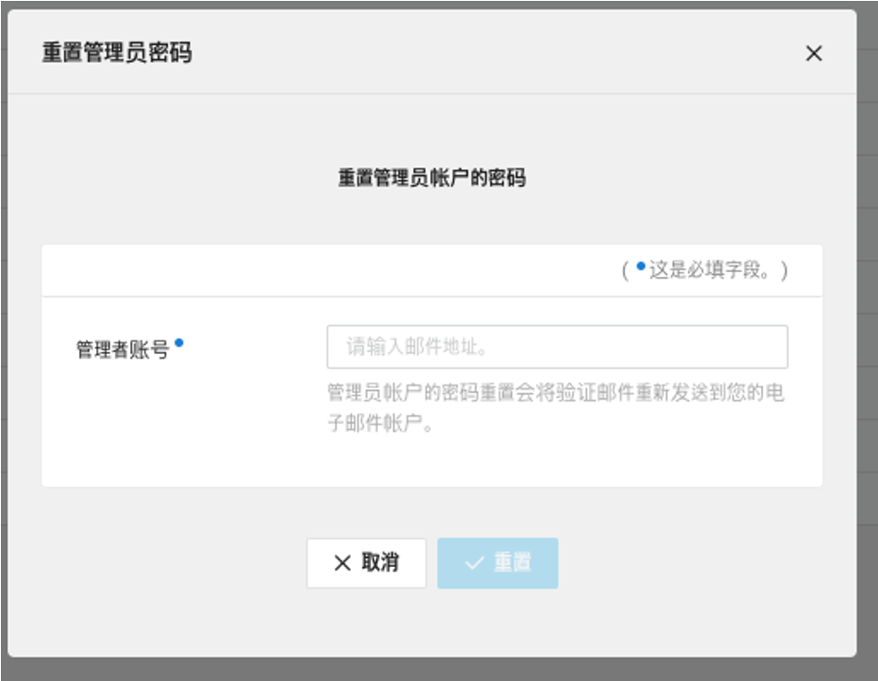

---
search:
  keyword: ["gamepot"]
---

# Console

> ### 这是机器翻译的文档，可能在词汇，语法或语法上有错误。 我们很快会为您提供由专业翻译人员翻译的文档。
>
> #### 如有任何疑问，请[联系我们]（https://www.ncloud.com/support/question）。
>
> 我们将尽一切努力进一步改善我们的服务。

# 使用前

实时 GAME 平台（GAMEPOT）产品是一种云服务，可以轻松实现开发和服务游戏所需的功能，而不会产生额外的开发成本。特别是，它是一项完全托管的服务，可通过提供游戏操作所需的基本功能和各种附加功能以及通用 SDK，使用户专注于游戏开发。无需开发操作工具或 SDK 服务器并操作基础结构，因此可以提高资源效率。

**NAVER 云平台游戏独有的功能**

- 提供游戏操作所需的各种功能。
- 提供了单独的“仪表盘”以方便管理和统计。仪表板不仅将所有客户分类到一个帐户中，而且非常安全。
- 更安全，因为客户可以管理游戏操作的仪表板访问帐户。
- 可以轻松地与各种 Naver Cloud 平台产品链接。另外，联锁产品的价格合理。

**问随着游戏的发展，第三方服务的成本也随之增加。 GAMEPOT 怎么样？**

GAMEPOT 不是一种会随着游戏的增长而增加成本的结构。现有的国内外同类服务的结构效率低下，随着游戏变得更加成功，成本会增加，这会导致意外的额外费用。但是，GAMEPOT 的混合计划包括统一费率计划，其中包括基本 DAU 和按需付费计划，如果您超出基本 DAU，则仅按那些超额费用付费。默认的 DAU 为 50,000 DAU /天，这绝非一笔小数目。

**问描述您的仪表板安全性。**

通过客户帐户访问公用仪表板时，如果客户帐户信息泄漏，则所有存储的数据可能会泄漏。 NAVER CLOUD PLATFORM 的安全性可以防止从源头泄漏外部信息，但是为了获得更强大的安全性，GAMEPOT 的所有客户都具有不同的访问域和仪表板系统，因此可以保持数据的安全性。

# 使用 GAMEPOT

## Step 1. 创建一个项目

要使用该服务，您必须首先创建一个项目。

① 从控制台中选择 **Game > GAMEPOT**。

② 单击 **+创建项目**按钮。

③ 输入游戏项目的名称。

- 您可以输入 3 至 30 个字符的名称。
- 仅允许使用字母，数字和'-'符号。

④ 输入用于仪表板的管理员 ID。

- 以电子邮件形式输入管理员 ID。
- 身份验证所需的邮件将传递到输入的邮件中。

⑤ 选择一个产品。

- 如果选择被管理产品，则会显示一个用于请求单独服务的弹出窗口。

⑥ 单击“创建项目”按钮以完成项目创建。

- 创建项目时，您需要按小时收费，其中包括基本 DAU。创建项目后，即使不使用它也要收费，因此必须仔细选择。

创建项目后，将显示访问仪表板的 URL。您必须通过检查输入的带有管理员 ID 的电子邮件来完成管理员身份验证。

电子邮件验证完成后，您将被定向到仪表板窗口，您可以在其中输入初始密码。 设置初始密码后，请登录。

## Step 2. 管理项目

创建项目后，您会看到带有游戏项目名称和产品名称的列表屏幕。

① 您可以通过仪表板 URL 进入仪表板来管理游戏功能。

② 检查项目，然后单击**项目管理**按钮以显示简单的管理菜单。

- 更改产品：更改正在使用的服务产品。 您可能无法暂时访问仪表板。 如果单击**更改产品**按钮，则会显示以下弹出窗口。 选择要更改的产品，然后单击**编辑**按钮。

- 更改帐户：您可以更改在创建项目时输入的管理员 ID。 更改请求完成后，身份验证电子邮件将发送到更改帐户的电子邮件地址。

- 密码重置：当访问仪表板的密码丢失或需要重置时使用。 初始化密码后，访问仪表板以重置密码。

## Step 3. 删除专案

从创建项目开始，GAMEPOT 将按小时收费。 因此，如果您不需要它，则应删除该项目，以避免产生不必要的费用。

① 要删除项目，请单击**删除项目**按钮。 如果单击**删除项目**按钮，则会显示以下弹出窗口。

② 要删除，必须输入项目名称。

③ 显示与上面相同的弹出窗口，如果单击**OK**按钮，则删除操作最终完成。
