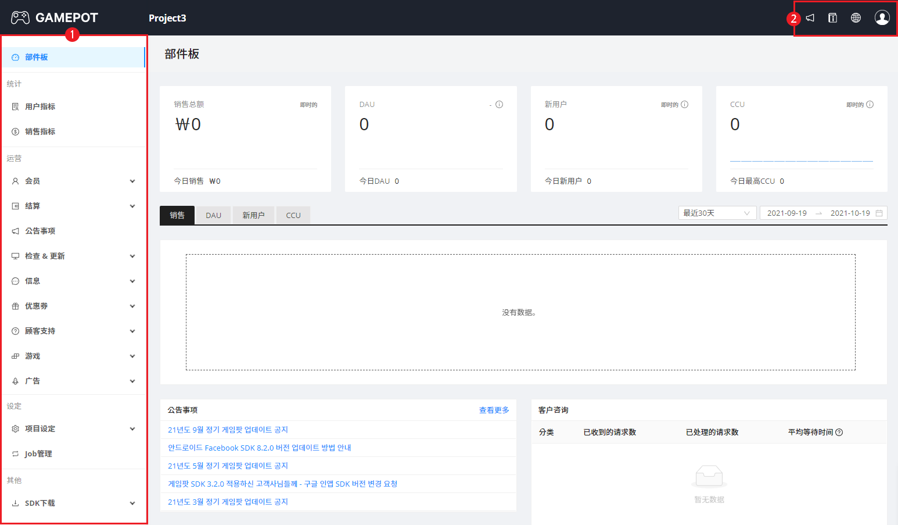

创建GAMEPOT项目和仪表盘即可使用服务。

可在GAMEPOT仪表盘中使用运营和管理所需的各种功能。根据申请产品的种类一并提供关于游戏的用户（玩家）和销售额的各类统计指标。可通过关联NAVER Cloud Platform的其他服务，一并使用短信、日志分析等各种附加功能。

GAMEPOT的各仪表盘是一种通过使用互不相同的管理员账户和域进行访问的唯一仪表盘。因此，不会共享客户信息、支付内容等游戏公司的敏感数据，从而安全保护数据。

## 创建项目和仪表盘
在NAVER Cloud Platform控制台中创建GAMEPOT项目，即可创建相应项目的仪表盘。通过创建项目和仪表盘启用GAMEPOT服务，可以使用各种游戏的开发、运营和管理功能。

首次使用GAMEPOT时，将提供免费试用产品，而不是创建项目时选择的产品。免费服务仅限使用50 DAU，转换为付费服务后才能正常使用创建项目时选择的产品。

创建GAMEPOT项目和仪表盘的方法如下。

1. 访问NAVER Cloud Platform控制台。
2. 依次点击**Services > Gaming > GAMEPOT**菜单。
3. 点击 **[创建项目]** 按钮。
4. 输入项目名称。
5. 在**管理员ID**栏输入要用作项目管理员账户的邮件地址。
    * 账户验证邮件将发送到该邮件地址。
6. 请参考以下定价，在**选择产品**中选择产品。
    * 所有产品的每月基本DAU（Daily Active Users）为50,000。关于定价的详细说明请参考[门户网站 > 服务 > GAMEPOT](https://www.ncloud.com/product/game/gamepot){target="_blank"}页面。

| 产品| 描述| 每小时费用| 超过基本DAU时，每DAU的费用|
| --- | --- | --- | --- |
| Essential| 将游戏开发和运营中必须使用的功能集合在一起的产品| 1,250韩元| 6韩元|
| Pro| 包含可供游戏开发、管理、运营的多种功能的产品| 3,000韩元| 6韩元|
   
7. 点击 **[创建项目]** 按钮后，在确认弹窗中点击 **[确定]** 按钮。
8. 在发送至**管理员ID**中输入的邮箱的验证邮件中，点击 **[邮件验证]** 按钮。
9. 在**初始设置**页面的**账户设置**区域输入要使用的账户密码。
10. 在**统计设置**区域选择要统计并显示统计资料的**标准货币**。
11. 选择要在仪表盘中使用的**时区**后，点击 **[确定]** 按钮。

### 查看项目列表
可以查看项目列表。可以在列表中变更产品种类、管理员账户并重置密码。

在NAVER Cloud Platform控制台依次点击**Services > Gaming > GAMEPOT**菜单，便可查看项目列表。

* 选择项目后点击 **[项目管理]** 按钮，便可变更项目设置。
    * **变更产品**：变更项目的产品种类。使用费将在变更产品时一并变更。变更产品种类后，可能会出现暂时无法访问仪表盘的情况。
    * **更改账户**：可以变更创建项目时输入的管理员ID。输入**变更ID**后请求变更，则会向已输入的**变更ID**发送验证邮件。
    * **重置密码**：重置项目管理员账户的密码。输入**管理员账户**后请求重置，则会向相应管理员账户发送验证邮件。
    
### 删除项目
项目的删除方法如下。

:::(Warning) (注意)
删除项目时，除了附加关联服务信息之外，所有信息将被一并删除，请谨慎删除。
:::

1. 在NAVER Cloud Platform控制台依次点击**Services > Gaming > GAMEPOT**菜单。
2. 选择要删除的项目后，点击 **[删除项目]** 按钮。
3. 在确认弹窗中点击 **[删除]** 按钮。

## 访问仪表盘
访问已创建仪表盘的方法如下：

1. 在NAVER Cloud Platform控制台依次点击**Services > Gaming > GAMEPOT**菜单。
2. 在列表中点击要访问的**仪表盘URL**。
3. 请使用管理员账户登录仪表盘。
    

| 区域| 描述|
| --- | --- |
| ① 仪表盘菜单| 仪表盘功能列表|
| ② 用户菜单| 确认公告事项和指南，变更显示语言，设置用户信息|

### 修改我的信息
如需修改我的会员信息，请使用管理员账户登录仪表盘，然后依次点击界面右上方的 **> 修改会员信息**按钮。

使用NAVER Cloud Platform的Papago NMT服务时，如果变更**默认翻译语言**、**自动语言检测**、**自动翻译**设置，仪表盘页面出现时会更新该变更内容。关于关联Papago NMT服务和仪表盘的详细说明，请参考[输入NAVER Cloud API密钥](/docs/zh/game-gamepot-projectmgmt#네이버클라우드API키입력)。

### 设置二次验证
出于安全目的，在我的登录步骤中设置二次验证的方法如下。

1. 请使用管理员账户登录仪表盘。
2. 在界面右上方依次点击 **> 修改会员信息**菜单后，点击 **[设置二次验证]** 按钮。
3. 在 **[用验证码设置]** 或 **[用OTP设置]** 中选择所需方式，点击相应按钮后按照弹窗指南设置验证。

## 转换为付费
将正在使用的免费试用产品转换为付费产品的方法如下。

1. 在NAVER Cloud Platform控制台依次点击**Services > Gaming > GAMEPOT**菜单。
2. 点击要转换为付费产品的项目的**仪表盘URL**。
3. 请使用管理员账户登录仪表盘。
4. 在界面下方出现的消息条中点击转换为付费按钮，然后在确认弹窗中点击 **[确定]** 按钮。
    * 点击 **[确定]** 按钮后将立即开始计费。转换为付费产品后无法再变更为免费产品。

通过仪表盘的统计菜单可以查看有关游戏用户（玩家）和游戏销售额的各种指标。支持以.csv格式的文件下载指标的RAW数据。

游戏统计功能只能在Pro产品中使用。

## 用户指标

可以查看有关游戏用户（玩家）的各种指标。

查看用户指标的方法如下。

1. 请使用管理员账户登录仪表盘。
2. 点击 **用户指标** 菜单。
   * 默认显示过去30天的指标。点击**过去30天**，可按**过去1天**、**7天**、**30天**、**60天**为单位变更显示的时间范围。
   * 点击各图表右上方显示的，可扩大图表并查看详细信息。
   * 在图表详细信息页面点击 **[导出]** 按钮，可以.csv文件格式下载相应图表的RAW数据。
   * **Retention D+0**标签表示在Days显示的日期注册会员并登录游戏的人数， **Retention D+1**表示在Days显示的日期注册会员并于次日登录游戏的人数。
   * 关于各指标术语的详细说明，请参考[指标术语整理](#지표용어정리)。

## 销售指标

可以查看有关游戏销售额的各种指标。

查看销售指标的方法如下。

1. 请使用管理员账户登录仪表盘。
2. 点击**销售指标**菜单。
   * 默认显示过去30天的指标。点击**过去30天**，可按**过去1天**、**7天**、**30天**、**60天**为单位变更显示的时间范围。
   * 点击各图表右上方显示的，可扩大图表并查看详细信息。
   * 在图表详细信息页面点击 **[导出]** 按钮，可以.csv文件格式下载相应图表的RAW数据。
   * 关于各指标术语的详细说明，请参考[指标术语整理](#지표용어정리)。

## 指标术语整理

指标中使用的各种术语的定义如下。

**用户指标术语**

| 术语           | 概述                                                         |
| -------------- | ------------------------------------------------------------ |
| DAU            | Daily Active Users的首字母缩写。表示每天登录游戏的用户数量。 |
| DAU by store   | 表示以注册游戏的商店为准的DAU。                              |
| DAU by Country | 表示游戏正式上线的各国DAU。                                  |
| MAU            | Monthly Active Users的首字母缩写。表示每月登录游戏的用户数量。 |
| Session        | 게임팟 SDK 초기화 성공한 수를 의미합니다. (앱 실행된 수로 판단하면 됩니다.) |
| New User       | 表示每天首次登录游戏的新用户数量。                           |
| Return User    | 表示在DAU中扣除New User的数量。                              |

**销售指标术语**

| 术语               | 概述                                                         |
| ------------------ | ------------------------------------------------------------ |
| Revenue            | 表示每天通过支付产生的收入。                                 |
| Paying Users       | 表示每天在游戏内进行付费的用户数量。                         |
| ARPU               | Average Revenue Per User的首字母缩写。表示以全部用户数量为准，每名用户的平均付费金额。 |
| ARPPU              | Average Revenue Per Paying User的首字母缩写。表示以进行付费的用户数量为准，每名用户的平均付费金额。 |
| Revenue by item    | 表示每个道具产生的支付收入。                                 |
| Revenue by store   | 表示以注册游戏的商店为准产生的支付收入。                     |
| Revenue by country | 表示游戏正式上线的各国的付费收入。                           |

通过Dashboard的运营菜单，可以查看注册游戏的会员（用户）、支付方式及道具、公告事项、维护、更新、其他各种消息和优惠券等游戏现状信息，并进行运营和管理。

## 会员管理

可以查看注册游戏的会员（用户）列表，以及个别会员的详细信息和活动记录。可向会员发送推送消息，必要时可以做出停用或取消会员资格的处理。还将一并提供有关日活跃用户、新用户、实时在线人数的统计数据。

### 查看会员列表

查看会员列表的方法如下。

1. 请使用管理员账户登录Dashboard。
2. 请依次点击 **会员 > 列表** 菜单。
   * 支持以时间段、国家、商店、ID为准搜索特定用户。
   
   * 可以.csv格式导出会员的各种历史记录。
     
     * 选择 **[会员信息]** 项目，并点击 **[导出文件]** 按钮，即可以.csv格式下载当前显示的列表。
     * 选择 **[导出登录历史记录]** 项目，并点击 **[导出文件]** 按钮，即可以.csv格式下载会员登录历史记录。可下载过去90天的记录。
     * 选择 **[账户关联信息]** 项目，并点击 **[导出文件]** 按钮，即可以.csv格式下载会员的账户关联信息。可下载过去90天的记录。
   
   * 点击 **用户ID**，即可以查看详细信息、发送推送消息、停用或注销会员
   
   * 账户关联邮箱查询限制事项
     
     * GAMEPOT SDK 3.4.2及更新的版本支持（仅限移动平台）该功能，且仅在Social SDK中传递信息时才会更新相应信息。  
默认不支持Twitter、Line、Game Center，并限特定条件下保存的社交软件类型如下。
       * Google / Google Play Service Game登录：默认接收并保存电子邮箱信息。/ 在Google SDK中未提供时，不保存相关信息。
       * Facebook：Facebook Permission中有Email时，则接收相关信息并保存（默认GAMEPOT中Facebook Permission有Email）。
       * Apple：首次登录相应App时（关联账户），根据用户的选择接收并保存电子邮箱信息或非公开邮箱信息。  
由于在相应SDK中不传递信息，因此相应时间点之后的ID将无法保存。
       * NAVER：NAVER控制台中，在提供信息选择的项目中必须选中电子邮箱，并且用户首次登录（关联账户）App时，仅在NAVER登录条款中选择电子邮箱项目时，才会接收并保存电子邮箱信息。相应邮箱信息会传递已关联至账户的可联系的邮箱信息，因此可能会与登录的登录账户信息不同。其他事项中，由于相应SDK不传递信息，因此无法保存。

#### 查看会员详细信息

如需查看各会员的详细信息，请在会员列表中点击拟查看的会员 **用户ID**。

点击详细信息窗口下方显示的标签 ，可查看相应会员的各种记录。

* **访问信息**：显示会员登录游戏的明细。
* **玩家信息**：显示ID、等级等游戏内的玩家信息。
* **支付明细**：显示会员在游戏内的支付明细。
* **咨询明细**：显示会员发送的咨询和相应的回复明细。
* **账户关联**：显示会员关联的社交媒体账户。可以添加社交账户或取消关联。
* **停用**：显示会员的停用记录。
* **赠送礼物**：显示向会员发放的道具明细。
* **优惠券使用明细**：显示会员使用的优惠券明细。

### 发送推送消息

如果已关联NAVER Cloud SENS Push服务，可向各会员发送推送消息。关联SENS Push服务的方法说明请参考[推送消息使用前准备事项](#푸시메시지사용전준비)。

向会员发送推送消息的方法如下。

1. 在会员列表中点击要发送推送消息的会员 **用户ID**。
2. 请在详细信息窗口中点击 **单独发送推送**。
3. 请选择要发送消息的 **默认语言** 后输入消息内容。
4. 请选择要发送的 **语言** 后点击 **[添加]** 按钮。

### 会员停用处理

必要时，可以对会员做出停用处理。

对会员做出停用处理的方法如下。

1. 请在会员列表中点击要进行停用处理的会员 **用户ID**。
2. 请在详细信息窗口中点击 **停用**。
   * 或者依次点击 **会员 > 停用** 菜单后，点击 **[添加]** 按钮。
3. 请点击 **状态** 的切换按钮进行激活。
4. 在 **分类** 中选择停用分类。
   * 点击 **会员 > 停用** 菜单访问时，在 **用户ID** 中输入需要停用的会员ID。
5. 在 **默认语言** 中选择用于显示停用原因的语言后，请输入 **原因**。
6. 请在 **原因** 输入栏右侧选择要发送的语言。
7. 输入停用期间段后，请点击 **[添加]** 按钮。

#### 查看停用会员列表

可以查看停用会员列表，还可以解除停用。

如要查看已停用的会员列表，请在Dashboard中依次点击 **会员 > 停用** 菜单。

点击各 **用户ID** 后，点击 **状态** 的切换按钮，将停用状态变更为激活（停用）或禁用（解除停用）。

### 注销会员

必要时，可以取消会员资格。

对会员做出停用处理的方法如下。

:::(warning)  (注意)

取消会员资格后，相应会员将无法继续登录游戏，并且账户的社交关联信息也将全部删除，取消资格前请谨慎审阅。

:::

1. 请在会员列表中点击要注销的会员 **用户ID**。
2. 请在详细信息窗口中点击 **注销会员**。
3. 确认注意消息后，请点击 **[确认]** 按钮。

### 统计会员访问信息

可通过图表查看日活跃用户、新用户、实时在线人数的统计数据。

若要查看会员访问统计信息，请在Dashboard的 **会员** 菜单下方选择所需的统计菜单。

* **日访问人数**：显示指定期间内的每日访问人数。
* **新用户**：显示指定期间内新注册游戏会员的用户数量。
* **同时访问人数**：显示特定时间点游戏在线状态的会员数。以1分钟为单位显示，且最多可以同时选择3个显示日期。

所有图标均可以变更显示期间。点击 **[导出]** 按钮，即可以.csv格式下载相应图表的RAW数据。

## 支付管理

可查看游戏会员的付款明细和统计数据，管理应用内购买(In-app purchase, IAP)产品的信息。通过确认商店的付款明细，查看是否存在恶意使用支付取消的会员，并且可以对相应会员做出停用设置，直至重新支付取消的道具。

### 查看支付明细

可以列表形式查看游戏会员的付款明细。以列表形式显示是否付款成功、商店、会员、付费道具、金额信息。

以列表形式查看游戏会员付款明细的方法如下。

1. 请使用管理员账户登录Dashboard。
2. 请依次点击 **支付 > 支付列表** 菜单。
   * 选择支付失败的订单后点击 **[重新支付]** 按钮，即可重新支付购买道具。
   * 点击付款成功的订单，即可取消付款。取消付款时将从销售统计中除外。
   * 支持以时间段、商店、支付货币、支付ID为准搜索特定用户。
   * 点击 **查询取消历史记录** 或 **查询失败历史记录**，即可在列表中只显示相应记录。
   * 点击 **[导出]** 按钮，即可以.csv格式下载当前显示的列表。

#### 查看支付详细内容

若要查看各项支付的详细内容，请在支付明细列表中点击要查看的支付 **状态**。

支付失败时，可点击 **[重新支付按钮]** 重新支付购买道具。

### IAP产品管理

可在Dashboard添加并管理包含在游戏里的应用内购买(In-app purchase, IAP)产品的信息。

查看IAP产品列表的方法如下。

1. 请使用管理员账户登录Dashboard。
2. 请依次点击 **支付 > IAP** 菜单。
   * 支持以产品名称、产品ID、赋予ID为准搜索产品。
   * 点击 **[导出]** 按钮，即可以.csv格式下载显示的列表。

#### 添加IAP产品

可以将IAP产品添加到Dashboard。需在Dashboard添加正在销售游戏的所有商店的IAP产品。

将IAP产品添加到Dashboard的方法如下。

1. 请点击IAP产品列表上方的 **[添加In-App道具]** 按钮。
2. 点击 **状态** 的切换按钮，请将产品状态设置为激活（使用）或禁用（未使用）。
3. 请选择 **商店**。
4. 输入产品名称和ID后，请点击 **[保存]** 按钮。

#### 批量添加IAP产品

下载.csv格式文件并输入内容后上传至Dashboard，即可批量添加IAP产品。

使用.csv格式批量添加多个IAP产品的方法如下。

1. 请点击IAP产品列表上方的 **[批量输入]** 按钮。
2. 请点击 **[下载CSV样本]** 按钮下载模板。
3. 打开下载.csv的格式文件后，请如下输入并保存产品信息。
   * Store列：在商店值google、one、apple、galaxy中输入一项
   * Item Name列：输入产品名称
   * Item Id列：输入产品ID
4. 请点击 **[添加CSV文件]** 按钮，上传已保存的.csv格式文件。
   * 如带有相应按钮的弹窗被关闭，请点击IAP产品列表上方的 **[批量输入]** 按钮，以重新显示弹窗。
5. 请点击 **[应用]** 按钮。

#### 修改IAP产品

修改IAP产品的状态、商店、名称和ID的方法如下。

1. 请在IAP产品列表中点击要修改的产品的 **产品名称**。
2. 修改所需内容后，请点击 **[保存]** 按钮。

#### 删除IAP产品

删除IAP产品的方法如下。

1. 请在IAP产品列表中点击要删除的产品的 **产品名称**。
2. 点击 **[删除]** 按钮后，请在通知消息中点击 **[是]** 按钮。

### 统计支付金额

以图表形式查看通过支付实现的销售额统计数据。

若要查看销售统计内容，请在Dashboard中依次点击 **支付 > 统计** 菜单。或者，请在 **支付列表** 或 **IAP** 等与支付相关的其他菜单界面中点击 **统计** 标签。

* 支持以商店、货币、时间段为准变更拟查看数据。
* 点击 **[导出]** 按钮，即可以.csv格式下载当前已显示的数据。

### 查看支付取消明细（Pro以上）

支持以列表形式查看支付取消明细。以列表形式显示付款状态、商店、会员、付费道具、金额、日期信息。

以列表形式查看支付取消明细的方法如下。

1. 请使用管理员账户登录Dashboard。
2. 请依次点击 **支付 > 取消支付** 菜单。

* 支持以状态、商店、ID为准搜索特定用户。
* 点击 **[导出]** 按钮，即可以.csv格式下载当前显示的列表。

#### 检测恶意取消支付的用户

针对Google支付日期，通过恶意使用支付取消的用户设置功能，可以检测恶意使用支付取消功能以非正常方式使用游戏的会员，并对其做出停用处理。

设置为输入Google API密钥，以读取Google Store的取消明细，并在Dashboard中设置判断恶意取消支付用户的判断条件，则Server就会每30分钟搜索符合条件的会员，并对其做出停用处理。在Dashboard的 **会员 > 停用** 菜单中可以查看已被停用的会员。

如果被停用的会员通过SDK重新支付相应道具，可以设置为自动解除停用。

通过恶意使用支付取消的用户设置功能，自动停用恶意使用用户的方法如下。

1. 请在取消支付列表中点击 **[设置恶意取消支付的用户]** 按钮。
2. 请点击 **激活** 的切换按钮以设置为激活。
3. 请在 **取消支付次数** 里输入判断恶意取消支付用户的支付取消次数。
   * 如果会员的支付取消次数超出（或等于）输入的次数，则视为恶意使用用户。
4. 请在 **取消支付金额** 里输入判断恶意取消支付用户的支付取消合计金额。
   * 如果会员的支付取消金额的合计金额超出（或等于）输入的金额，则视为恶意使用用户。
5. 选择 **默认语言** 后，请输入要显示给停用用户的 **消息**。
6. 在 **消息** 输入栏右侧选择要发送的语言。
7. 点击 **Google API Key** 项目的 **[前往输入]** 按钮后，请在 **Google API Key** 字段中输入JSON值。
   * 可在[Google Play Console](https://play.google.com/intl/ko/console/about/){target="_blank"}中获取JSON值。
   * 导入Google Store的支付取消列表。
8. 点击 **AppStore** 项目的复制地址按钮后，点击 **[应用方法]** 按钮，请根据所显示弹窗的说明复制地址。  
必须设置为 **版本1通知** 类型。
   * 导入Apple App Store的支付取消列表。
9. 点击 **[确定]** 按钮。

## 公告事项管理（Pro以上）

可输入和管理显示给登录游戏的会员的公告事项。

为使用公告事项功能，需要NAVER Cloud Platform的API认证密钥和Object Storage服务。将另行收取Object Storage的服务费用。

### 公告事项功能使用前准备事项

未使用公告事项功能，需要API认证密钥和Object Storage。为保障安全，建议创建子账户并赋予Object Storage使用权限后，通过相应账户领取API认证密钥。关于子账户的详细说明，请参考[Sub Account使用指南](/docs/subaccount-overview)。

为了使用公告事项功能，准备API认证密钥和Object Storage并关联Dashboard的方法如下。

1. 登录NAVER Cloud Platform门户网站，请在 **我的页面 > 账户管理 > 认证密钥管理** 菜单下点击 **[创建新的API认证密钥**] 按钮以创建认证密钥。
2. 请参考[Object Storage](/docs/zh/storage-storage-6-1)进行服务申请。
3. 请使用管理员账户登录Dashboard。
4. 请依次点击 **项目设置 > Ncloud** 菜单。
5. 请在 **API认证密钥** 区域依次输入创建的 Access Key和Secret Key，然后点击界面最下方的 **[修改]** 按钮。
   * 将自动创建Object Storage存储桶。公告事项中使用的所有图像都会保存在该存储桶中。

### 添加公告事项

使用前准备就绪后，方可开始使用公告事项功能。

显示给登录游戏的会员的公告事项添加方法如下。

1. 请使用管理员账户登录Dashboard。
2. 点击 **公告事项** 菜单后，请点击 **[添加公告事项]** 按钮。
3. 点击 **状态** 的切换按钮以设置为激活状态。
4. 输入要添加公告事项的 **日期** 和 **商店** 后，请在 **分类** 里输入用于分类公告事项的信息。
   * **分类** 可以作为搜索公告事项时的条件使用。
5. 请选择要显示公告事项的 **国家**，然后选择公告事项的 **点击操作类型** 和 **默认语言**。
6. 上传图片文件后，选择符合图片文件的语言。
7. 在 **点击操作值** 中输入要跳转的URL或要传达至游戏的值，然后点击 **[保存]** 按钮。

### 查看公告事项列表

若要查看公告事项列表，请使用管理员账户登录Dashboard后点击 **公告事项** 菜单。

支持以日期、分类为准搜索特定的公告事项。

#### 修改公告事项

修改公告事项的方法如下。

1. 在公告事项列表中点击拟修改的公告事项行。
2. 修改所需内容后，请点击 **[保存]** 按钮。

#### 删除公告事项

删除公告事项的方法如下。

1. 在公告事项列表中点击要删除的公告事项行。
2. 请点击 **[删除]** 按钮后，在通知消息中点击 **[确认]** 按钮。

## 维护和更新公告（Pro以上）

可向游戏会员发布游戏的维护和更新公告，并暂时阻止会员登录游戏或引导会员跳转到商店的更新页面。

### 维护公告

可在指定时间在游戏内显示维护消息，并设置阻止会员登录游戏。

在指定时间阻止登录游戏并显示维护消息的设置方法如下。

1. 请使用管理员账户登录Dashboard。
2. 请依次点击 **维护 & 更新 > 维护** 菜单。
3. 请在 **选择商店** 中选择商店后输入 **维护时间**。
4. 在 **默认语言** 中选择将要显示公告的默认语言。
5. 输入 **维护消息** 后，请选择将要在相应消息里应用的语言。
   * 若要提供用于详细说明维护事项的链接，请在 **详细URL** 中输入链接地址。
6. 点击 **[保存]** 按钮。
   * 将添加在维护列表中输入的维护设置。可在维护终止之前在维护设置画面修改设置。
   * 可在维护终止日期或手动终止维护之时起注册新的维护设置。

#### 手动终止维护

维护终止日期过后将自动终止维护，但必要时可在终止日期之前手动终止维护。

若要手动终止维护，请在维护设置界面点击 **[终止维护]** 按钮。如果当前不存在已设置的维护，则不会显示相应按钮。

### 更新说明

如果安装在会员设备里的游戏不属于最新版本，则可以向会员显示更新公告消息，并引导会员跳转至商店更新页面。输入作为不同商店更新标准的版本名称并保存，则会在相应会员登录游戏时显示更新公告消息。

请将版本代码设置为整数值（即使是在创建的二进制文件中，版本代码值也必须为整数）。

检查会员的游戏版本并显示更新公告消息的设置方法如下。

1. 请使用管理员账户登录Dashboard。
2. 请依次点击 **维护 & 更新 > 更新** 菜单。
3. 点击要显示更新公告消息的商店名称一旁的获取按钮进行激活。
4. 请点击各切换按钮旁的 **强制** 或 **建议** 按钮，选择是否强制更新。
   * 若选择 **强制**，则对象会员在商店中进行更新之前将无法访问游戏。
5. 请在 **建议** 按钮右侧的输入栏中输入版本信息。
6. 在版本信息右侧的输入栏里输入Custom URL，或将其留空并点击相应行的 **[保存]** 按钮。
   * 输入URL后，如果会员点击更新公告消息里的链接，则将跳转到相应URL。留空时，则跳转到相应应用的默认商店页面。
   * 可在该页面继续添加更新公告设置或修改已添加设置。

## 发送消息

可向指定平台的所属游戏会员发送推送消息和短信。由于可直接通过NAVER Cloud Platform发送和管理消息，因此无需另行构建消息Server。

为使用消息发送功能，需要NAVER Cloud Platform的Simple & Easy Notification Service(SENS)服务。该服务将单独收取费用。为保障安全，建议创建子账户并赋予SENS使用权限后，通过相应账户领取API认证密钥。关于子账户的详细说明，请参考[Sub Account使用指南](/docs/subaccount-overview)。

Essential、Pro产品均可使用消息发送功能。

### 推送消息

可申请NAVER Cloud Platform的SENS Push服务，关联Dashboard后使用消息推送功能。

#### 使用推送消息前的准备事项

为使用消息推送功能，准备SENS Push服务并关联Dashboard的方法如下。

1. 请使用管理员账户登录Dashboard。
2. 请依次点击 **消息 > 推送消息** 菜单。
3. 请点击 **[发放服务密钥]** 按钮，根据相关指南申请服务并发放服务密钥。
4. 请点击 **[证书注册指南]** 按钮，根据相关指南注册证书。
5. 请点击 **[项目设置]** 按钮，在相关 **Ncloud** 页面的 **SENS - PUSH** 区域中输入获取的SENS Push服务ID。
6. 请点击界面最下方的 **[修改]** 按钮。

#### 发送推送消息

使用前准备就绪后，方可开始发送推送消息。

向会员发送推送消息的方法如下。

1. 请使用管理员账户登录Dashboard。
2. 请在依次点击 **消息 > 推送消息** 菜单后，点击 **[添加消息]** 按钮。
3. 请在 **日程** 中点击 **立即发送** 或 **定时发送** 后输入发送时间。
4. 请在 **平台** 中选择要发送消息的对象平台后选择 **默认语言**。
5. 请输入 **标题** 后上传图片文件。
   * 空白时，游戏应用名称将作为标题显示。
6. 在上传图片栏下方的输入栏里输入消息，并选择应用到相应消息的语言。
7. 点击 **[添加]** 按钮。

#### 批量发送推送消息

使用.csv格式文件，可最多同时添加并发送100条推送消息。批量发送推送消息仅支持定时发送。

使用.csv格式文件批量添加并发送推送消息的方法如下。

1. 请点击消息列表上方的 **[批量输入]** 按钮。
2. 请点击 **[下载CSV样本]** 按钮下载模板。
3. 请打开已下载的.csv格式文件，根据格式文件里的第一行指南编辑表格，并保存为UTF-8格式的.csv文件。
4. 请点击 **[添加CSV文件]** 按钮，上传已保存的.csv格式文件。
   * 如带有相应按钮的弹窗被关闭，请点击消息列表上方的 **[批量输入]** 按钮，以重新显示弹窗。
5. 请点击 **[上传]** 按钮。

#### 查看推送消息列表

若要查看已推送的消息列表，请使用管理员账户登录Dashboard后，依次点击 **消息 > 推送消息** 菜单。

* 查看消息 **状态**，可确认相应消息是否成功发送。发送 **成功** 时，将一并显示消息。
* 支持以时间段、发送对象平台、消息为准搜索特定消息。

#### 修改及重新发送推送消息

若推送消息尚未被发送且显示为 **待发送** 状态，或因发送失败而显示为 **失败** 状态时，可修改消息。如果在 **待发送** 状态下完成修改，则发送消息时将显示修改后的内容；如果在 **失败** 状态下完成修改，则根据已修改的设置重新发送消息。

修改推送消息的方法如下。

1. 请在消息列表中点击要修改的消息的 **消息** 按钮。
2. 修改所需内容后，请点击 **[修改]** 按钮。

#### 删除推送消息

若推送消息尚未被发送且显示为 **待发送** 状态，或因发送失败而显示为 **失败** 状态时，可修改消息。

删除推送消息的方法如下。

1. 请在消息列表中点击要删除的消息的 **消息** 按钮。
2. 请点击 **[删除]** 按钮后，在通知消息中点击 **[确认]** 按钮。

### 短信

申请NAVER Cloud Platform的SENS SMS短信服务，关联Dashboard后，可使用短信功能。

#### 使用短信功能前的准备事项

为了使用短信发送功能，准备SENS SMS服务并关联Dashboard的方法如下。

1. 请使用管理员账户登录Dashboard。
2. 请依次点击 **消息 > 短信** 菜单。
3. 请点击 **[发放服务密钥]** 按钮，根据相关指南申请服务并发放服务密钥。
4. 请点击 **[证书注册指南]** 按钮，根据相关指南注册证书。
5. 请参考[SMS控制台使用指南](/docs/zh/sens-callingno)添加发信号码。
6. 请点击 **[项目设置]** 按钮，在相关 **Ncloud** 页面的 **SENS - SMS** 区域中输入获取的SENS SMS服务ID和Secret Key。
7. 请点击 **[修改]** 按钮。

#### 发送短信

使用前准备就绪后，方可开始发送短信。

向会员发送短信的方法如下。

1. 请使用管理员账户登录Dashboard。
2. 依次点击 **消息 > 短信** 菜单后，请点击 **[添加短信]** 按钮。
3. 请在 **类型** 和 **短信类型** 中分别选择短信长度和短信类型。
4. 请在 **发信号码** 中输入已在SENS SMS服务里添加的发信号码。
5. 请在 **收信号码** 中输入要接收短信的号码后，在短息输入栏内输入短信内容。
   * 如需发送广告短信，短信内容必须包含“（广告）”语句和免费拒接号码。
6. 在 **日程** 里输入发送时间。
7. 点击 **[添加]** 按钮。

#### 批量发送短信

使用.csv格式文件同时批量添加并发送短信的方法如下。

1. 依次点击 **消息 > 短信** 菜单后，请点击 **[添加短信]** 按钮。
2. 请点击 **[下载CSV样本]** 按钮下载模板。
3. 打开已下载的.csv格式文件后，请输入如下内容，并保存为UTF-8格式的.csv文件。
   * target列：输入接收号码
   * temp列：输入短信内容
4. 请点击 **[上传CSV]** 按钮上传已保存的.csv文件。
   * 若带有相应按钮的弹窗被关闭，请点击消息列表上方的 **[添加短信]** 按钮，以重新显示弹窗。
5. 点击 **[添加]** 按钮。

#### 查看短信列表

若要查看已发送短信列表，请使用管理员账户登录Dashboard后依次点击 **消息 > 短信** 菜单。

* 查看消息 **状态**，可确认相应消息是否成功发送。发送 **成功** 时，将一并显示消息。
* 支持以时间段、消息为准搜索特定消息。

#### 修改及重新发送短信

若短信尚未被发送并显示为 **待发送** 状态，或因发送失败而显示为 **失败** 状态，可修改消息。如果在 **待发送** 状态下完成修改，则发送消息时将显示修改后的内容；如果在 **失败** 状态下完成修改，则根据已修改的设置重新发送消息。

修改短信的方法如下。

1. 请在消息列表中点击要修改的消息的 **消息** 按钮。
2. 修改所需内容后，请点击 **[修改]** 按钮。

#### 删除短信

若短信尚未被发送并显示为 **待发送** 状态，或因发送失败而显示为 **失败** 状态，可修改消息。

删除短信的方法如下。

1. 请在消息列表中点击要删除的消息的 **消息** 按钮。
2. 请点击 **[删除]** 按钮后，在通知消息中点击 **[确认]** 按钮。

## 优惠券管理（Pro以上）

可创建、发放、管理游戏会员在游戏里使用的各种优惠券。支持回收率数据查看获得优惠券的会员实际使用优惠券的比率。

只有存在通过优惠券发放的道具时方可创建优惠券，因此需先在Dashboard的 **游戏 > 道具** 菜单中创建要使用优惠券发放的道具。关于道具的详细说明，请参考[道具管理](#道具管理)。

### 创建普通优惠券

通过输入代码使用的一般优惠券的创建方法如下。

1. 请使用管理员账户登录Dashboard。
2. 点击 **优惠券 > 普通优惠券** 菜单后，请点击 **[创建优惠券]** 按钮。
3. 点击 **状态** 的切换按钮以设置为激活状态。
4. 请输入 **说明**、**使用期限**、**优惠券长度**、**优惠券数量**。
   * **优惠券长度** 指优惠券代码的长度。
5. 在 **道具** 项目里输入要使用优惠券发放的道具和发放数量后，请点击 **[添加]** 按钮。
   * 若要更加详细地指定优惠券的设置值，可在优惠券代码的 **Prefix**、**Suffix**、游戏内的优惠券 **标题** 和 **内容** 中输入需要的内容，然后点击 **[添加]** 按钮。
   * 创建道具的相关说明请参考[道具管理](#아이템관리)。

### 创建关键词优惠券

通过输入关键词使用的关键词优惠券的创建方法如下。

1. 请使用管理员账户登录Dashboard。
2. 点击 **优惠券 > 关键词优惠券** 菜单后，请点击 **[创建优惠券]** 按钮。
3. 点击 **状态** 的切换按钮以设置为激活状态。
4. 请输入 **说明**、**使用期限**、**优惠券长度**、**优惠券数量**。
   * **优惠券长度** 指优惠券代码的长度。
5. 在 **道具** 项目里输入要使用优惠券发放的道具和发放数量后，请点击 **[添加]** 按钮。
   * 若要更加详细地指定优惠券的设置值，可在优惠券代码的 **Prefix**、**Suffix**、游戏内的优惠券 **标题** 和 **内容** 中输入需要的内容，然后点击 **[添加]** 按钮。
   * 创建道具的相关说明请参考[道具管理](#아이템관리)。

### 查看优惠券列表

可查看添加的优惠券列表和个别优惠券的回收率，必要时可以增加各优惠券的数量。

若要查看已添加的优惠券列表，请使用管理员账户登录Dashboard后依次点击 **优惠券 > 普通优惠券** 菜单或 **优惠券 > 关键词优惠券** 菜单。

* 支持以日期、优惠券说明为准搜索特定优惠券。
* 可通过点击个别优惠券行的来增加优惠券数量。
* 可通过点击个别优惠券行的来查看使用详情。

#### 修改优惠券

修改优惠券的方法如下。

1. 请在优惠券列表中点击要修改的优惠券的 **说明** 按钮。
2. 修改所需内容后，请点击 **[保存]** 按钮。

#### 删除优惠券

删除优惠券的方法如下：

1. 请在优惠券列表中点击要删除的优惠券的 **说明** 按钮。
2. 点击 **[删除]** 按钮后，请在通知消息中点击 **[是]** 按钮。

### 查看优惠券使用明细

可以查看所有已创建优惠券的使用明细。明细中将显示使用状态、优惠券名称、编号、用户、日期信息。针对关键词优惠券，使用明细中仅显示已使用的优惠券。

若要查看优惠券使用明细，请在Dashboard中依次点击 **优惠券 > 使用明细** 菜单。

* 支持以日期、优惠券编号、用户ID为准搜索特定优惠券。
* 点击 **查询失败历史记录**，可在列表中仅显示相应的历史记录。
* 点击 **状态**，可查看使用的详细信息。
* 点击 **用户ID**，可查看会员详细信息。

## 客户支持（Pro以上）

可在Dashboard里运营并管理游戏的客户支持服务。可以受理和回复游戏会员提出的咨询，发布个人条款及隐私政策，查看客户支持服务相关统计。

### 应对客户咨询

可在Dashboard里查看和回复游戏会员提出的各类咨询和请求。可以对受理的客户咨询进行分类，并在对咨询问题予以回复时向客户发送通知。

若要查看已受理的客户咨询列表，请使用管理员账户登录Dashboard后依次点击 **客户支持 > 客户咨询** 菜单。

点击，可以时间段、状态、分类、用户ID、咨询信息为准搜索特定的咨询。

点击或，可变更咨询列表的查看方式。

点击 **[Select actions]**，即可修改咨询的各种状态。

* 点击 **[统一回复]** 按钮，即可统一回复多个咨询事项。关于咨询回复的详细说明，请参考[查看及回复咨询](#문의확인및답변)。
* 点击 **[变更状态]** 按钮，即可将咨询状态选择并变更为在正在处理、完成、等待中。
* 点击 **[指定负责人]** 按钮，即可选择并变更负责人。

#### 查看及回复咨询

查看并回复会员咨询的方法如下。

1. 请在咨询列表中点击要查看的咨询的 **咨询标题**。
   * 若要对多个咨询做出统一回复，请在列表中选中所有要回复的咨询后，点击 **[Select actions]** 的 **[统一回复]** 按钮。
2. 查看咨询内容后，请在 **回复** 区域中输入回复内容。
   * 点击![gamepot-gamepotuse-gamemgmt_template_zh.png]./images/image%28362%29.png)，可导入预先撰写的回复模板。
   * 点击 **分类** 项目，即可变更相应咨询的分类。
   * 点击，即可以.csv格式文件下载相应的咨询。
   * 提出咨询的会员详细信息会显示在界面右侧。
3. 点击 **[添加]** 按钮添加回复。
   * 点击，可发送回复通知。
   * 注册回复后，可以继续追加回复。
4. （可选）如需变更相应咨询的状态，请点击咨询标题上方的状态。
   * 咨询列表中的相应咨询状态将变更为指定状态。
   * 回复满意度会在相应会员对完成回复的咨询进行回应时显示。

#### 指定咨询负责人

可以为受理的咨询指定负责人。如果指定咨询回复负责人，只能由该负责人进行回复。

若要指定咨询回复负责人，请在咨询列表中点击要指定负责人的咨询的 **用户ID**，然后点击 **[负责人]** 按钮选择负责人。

### 查看客户支持统计信息

可查看咨询的受理和处理统计、各负责人的咨询处理统计、每日报告、Google评论。

若要查看客户支持统计信息，请依次点击Dashboard的 **客户支持 > 客户咨询** 菜单。

* **每日统计**：显示客户咨询的每日统计信息。最多可查看过去90天的统计。
* **各负责人统计**：显示全部负责人和指定负责人的咨询处理统计信息。点击，可指定拟查看的负责人。
* **各分类统计**：显示全部分类和指定分类的咨询处理统计信息。点，可指定拟查看的分类。

所有图标均可以变更显示期间。带有 **[导出]** 按钮的图表，点击相应按钮即可以.csv格式文件下载RAW数据。

点击图表右上方的，可以全屏方式显示相应图表，并打印或下载图表。

若要查看Google评论，请在Dashboard中依次点击 **客户支持 > Google评论** 菜单。

* **Google评论**：读取并显示Google Store的评论。若要从商店读取评论，请点击 **[设置]** 按钮并选择要翻译的语言，再依次点击 **项目设置 > 普通 > Ncloud** 菜单后，在 **Google API Key** 区域输入API密钥。

### 创建页面（Web文档）

可在Dashboard上创建所需的Web文档，作为各种客户支持用途使用。例如，在Dashboard里撰写各种帮助页面后，使会员点击通过游戏内的“查看帮助”按钮查看内容。

创建Web文档的方法如下。

1. 请使用管理员账户登录Dashboard。
2. 点击 **客户支持 > 页面** 菜单后，请点击 **[添加]** 按钮。
3. 输入要创建的Web文档名称后，请点击 **[保存]** 按钮。
4. 点击 **[添加]** >按钮左侧的列表后，请选择已保存的Web文档。
5. 在 **默认语言** 中选择Web文档的默认语言后，请选择将要用于填写文档内容的语言。
6. 编辑内容后请点击 **[保存]** 按钮。

#### 修改页面

修改已撰写页面的方法如下。

1. 使用管理员账户登录Dashboard后，请依次点击 **客户支持 > 页面** 菜单。
2. 点击 **[添加]** 按钮左侧的列表后，请选择要修改的Web文档。
3. 修改所需内容后，请点击 **[保存]** 按钮。

### 客户支持的设置

可变更FAQ、回复模板等与客户支持有关的设置。

若要变更客户支持的默认设置，请登录后点击 **客户支持 > 设置 > 普通** 菜单。

* 点击 **[Web 访问地址]** 按钮，则可将未登录游戏的会员能够提出咨询的Web咨询页面URL复制到剪贴板。  
默认语言为英语，若在地址后面以&language=ko(ISO 639-1代码)的形式使用时，则将相应语言作为默认语言进行操作。
* 如若点击 **[是否使用星级评分]** 切换按钮将其激活，则客户可以对完成的咨询进行星级评分。

#### 咨询人信息收集设置

可设置当会员撰写客户咨询内容时设置的输入项目或非输入项目，并指定拟显示在咨询撰写页面的游戏使用条款。

设置是否显示使用条款的方法如下。

1. 请依次点击 **客户支持 > 设置 > 普通** 菜单。
2. 请在 **使用条款页面** 区域变更设置。
3. 点击 **[保存]** 按钮。

设置是否收集咨询用户信息的方法如下。

1. 请依次点击 **客户支持 > 设置 > 普通** 菜单。
2. 请在 **附加信息设置** 区域变更设置。
3. 若非会员用户进行咨询，为了使其能够接收到相关咨询的回复消息，请添加应用了 **模板 - 应用电子邮箱正规形式** 的附加信息项目。
   * 通过应用电子邮件正则表达式的附加信息对非会员咨询做出回复时，向其发送邮件。
   * 对于应用电子邮件正则表达式的附加信息，应在提出咨询时确认电子邮件正则表达式。
4. 点击 **[保存]** 按钮。

#### 咨询回复通知设置

设置对客户咨询做出回复时，向会员发送通知或以邮件发送回复内容。

**推送通知设置**

对客户咨询做出回复时，向会员发送推送通知的设置方法如下。

1. 请依次点击 **客户支持 > 设置 > 通知** 菜单。
2. 请在 **推送设置** 区域输入如下设置。
   * **是否使用**：请点击切换按钮将其激活。
   * **默认语言**：请选择将要显示消息的默认语言。
   * **消息**：请输入根据对象设备的语言设置来显示的消息。
3. 请点击最下方的 **[保存]** 按钮。

**邮件通知设置**

对客户咨询做出回复时，向会员发送邮件通知的设置方法如下。

1. 请依次点击 **客户支持 > 设置 > 通知** 菜单。
2. 请在 **邮件设置** 区域设置是否使用和语言，内容如下。
   * **是否使用**：请点击切换按钮将其激活。
   * **默认语言**：请选择要显示邮件的默认语言。
   * **语言**：请选择要应用邮件设置的语言。根据接收邮件的设备语言，反映输入的邮件设置。
3. 输入邮件设置和内容。
   * 点击 **[预览发送邮件]** 按钮，请确认各设置内容实际显示在回复邮件的哪一区域。
   * **发件邮箱地址、姓名、标题**：请输入要显示为发件人的邮箱地址、邮件名称、邮件标题。
   * **上方语句**：请输入固定显示在邮件正文上方的语句。
   * **回复，咨询标题**：请输入回复标题、咨询标题。
   * **下方语句**：请输入固定显示在邮件正文下方的语句。
4. 请点击最下方的 **[保存]** 按钮。

#### 查看及添加咨询分类

查看咨询分类设置并添加新分类的方法如下。

1. 请点击 **客户支持 > 设置 > 分类** 菜单。
2. 请点击 **[添加分类]** 按钮。
3. 点击 **状态** 的切换按钮将其激活后，请选择 **默认语言**。
4. 选择分类模板语言。
5. 输入 **分类名称** 后，请在 **模板** 项目中编辑分类模板内容。
6. 点击 **[添加]** 按钮。

#### 查看及添加咨询回复模板

查看并添加用于撰写回复咨询的模板的方法如下。

1. 请点击 **客户支持 > 设置 > 回复模版** 菜单。
2. 请点击 **[添加回复模板]** 按钮。
3. 点击 **状态** 的切换按钮将其激活后，请选择模板语言。
4. 输入 **模板名称** 后，请在 **内容** 项目中编辑模板内容。
5. 点击 **[添加]** 按钮。

#### 咨询规则管理

根据设置规则自动指定客户咨询的负责人、期限、重要程度等。

规则自最上方开始向下依次应用，点击或，可设置规则的顺序。

添加规则的方法如下。

1. 请点击 **客户支持 > 设置 > 规则** 菜单。
2. 请点击 **[添加规则]** 按钮。
3. 点击 **状态** 的切换按钮将其激活后，请填写 **规则名称** 项目。
4. （可选）请输入将要应用规则的 **期限** 项目。
5. 请输入将要应用规则的 **条件** 项目。如果存在2个以上的规则条件，则需要满足所有条件才可以应用规则操作。
6. 若满足条件，请勾选将要应用的 **操作** 项目的复选框并输入内容。
7. 点击 **[添加]** 按钮。

### 客户咨询编辑界面设置 

可指定会员撰写客户咨询的页面颜色、公告事项。

变更客户咨询撰写界面主题的方法如下。

1. 请点击 **客户支持 > 设置 > 装扮** 菜单。
2. 请在 **[主题（默认颜色）]** 项目中指定所需的主题颜色。
3. 请在 **[主题（曲线）]** 项目中指定所需的按钮曲率。
4. 请点击最下方的 **[保存]** 按钮。

添加客户咨询界面公告事项的方法如下。

1. 请点击 **客户支持 > 设置 > 公告事项** 菜单。
2. 点击 **[添加]** 按钮。
3. 点击 **状态** 的切换按钮将其激活后，请选择 **默认语言**。
4. 选择公告事项语言。
5. 输入 **标题** 后，请在 **内容** 项目中编辑公告事项内容。
6. 点击 **[添加]** 按钮。

### 管理FAQ

可撰写并管理常见问题(FAQ)。

若要查看FAQ列表，请使用管理员账户登录Dashboard后依次点击 **客户支持 > FAQ** 菜单。

* 支持以状态、提问内容、回复内容为准搜索特定FAQ。
* 点击 **[Web访问地址]** 按钮，可将可查看已编辑完成的政策的Web URL复制到剪贴板。
* 点击 **[导出]** 按钮，即可以.csv格式下载当前显示的列表。

#### 添加FAQ

添加FAQ的方法如下。

1. 请在FAQ列表点击 **[添加]** 按钮。
2. 点击 **状态** 的切换按钮将其激活后，请选择 **分类** 和 **默认语言**。
3. 在 **语言** 中选择FAQ语言后，请填写 **提问** 和 **回复**。
4. 点击 **[保存]** 按钮。

#### 查看及添加FAQ分类

查看FAQ分类设置并添加新分类的方法如下。

1. 请在FAQ列表点击 **[分类设置]** 按钮。
2. 请点击 **[添加分类]** 按钮。
3. 点击 **状态** 的切换按钮将其激活后，请选择 **默认语言**。
4. 选择分类语言。
5. 输入 **分类名称** 并选择 **图标** 后，请点击 **[添加]** 按钮。

#### FAQ修改

修改FAQ的方法如下。

1. 请在FAQ列表中点击要修改的FAQ的 **提问** 按钮。
2. 修改所需内容后，请点击 **[保存]** 按钮。

#### 删除FAQ

删除FAQ的方法如下。

1. 在FAQ列表中点击要删除的FAQ的 **提问** 按钮。
2. 请点击 **[删除]** 按钮后，在通知消息中点击 **[确认]** 按钮。

### 运营政策管理

可在Dashboard里撰写游戏使用条款、隐私政策、退款策略。编辑完成的政策可通过GAMEPOT SDK通报给会员。

关于通过SDK通报政策的方法说明，请参考不同操作系统下的SDK指南。

撰写并修改运营政策的方法如下。

1. 请在Dashboard的 **客户支持 > 设置** 菜单下方，在 **使用条款**、**个人隐私政策**、**退款政策** 中点击所需的政策菜单。
2. 选择 **默认语言** 后，请选择将要编辑政策的语言。
   * 点击 **[Web访问地址]** 按钮，可将可查看已编辑完成的政策的Web URL复制到剪贴板。
3. 编辑完成政策内容后请点击 **[保存]** 按钮。

#### 设置GDPR

若激活GDPR，则能以访问游戏的客户端IP为基准判断GDPR对象国家，显示GDPR条款画面来替代原条款画面。

:::(info)  (参考)

关于GDPR的详细说明，请参考[机构官网](https://gdpr-info.eu/){target="_blank"}。

:::

激活GDPR的方法如下。

1. 请在Dashboard的 **客户支持 > 设置** 菜单下方点击 **GDPR**。
2. 点击 **[设置]** 按钮后，请在如下完成设置后点击 **[确认]** 按钮。
   * 为能够发送GDPR验证邮件，请参考[Cloud Outbound Mailer](/docs/zh/email-email-1-1){target="_blank"}申请相应服务。
   * **激活GDPR**：请点击切换按钮将其激活。
   * **发件邮箱地址、名称**：请输入将显示在GDPR验证邮件中的发件人邮箱地址、邮件名称。
   * **同意激活广告App**：若要在验证邮件中显示提供定制型广告的相关条款，请点击切换按钮将其激活。
3. 分别点击 **激活**、**必须同意** 切换按钮，设置是否使用当前编辑的页面和是否必须同意。
4. 选择 **默认语言** 后，请选择将要编辑政策的语言。
5. 编辑完政策标题和内容后，请点击 **[保存]** 按钮。

## 游戏

可管理游戏相关的各种设置，包括查看角色信息、管理和赠送道具、统计预订、设置远程配置、收集日志等。

### 查看玩家信息（Pro以上）

可以通过SDK（游戏日志传输API）查看传输至Dashboard的游戏内角色（玩家）信息。

关于通过传输游戏日志在Dashboard显示角色信息的方法说明，请参考不同操作系统下的SDK 指南。

* 支持以时间段、玩家信息为准搜索特定玩家。
* 点击 **[导出]** 按钮，即可以.csv格式下载当前显示的列表。

### 赠送礼物（Pro以上）

可通过Webhook在Dashboard里向游戏会员赠送道具。

#### Webhook防火墙设置

建议在使用送礼物功能之前，在Webhook地址设置防火墙，以保障安全。如果没有已设置的防火墙和正常的验证请求，恶意使用系统的会员就会以非正常手段获取道具。关于Webhook设置的详细说明，请参考[Server to Server设置](game-gamepotserver)。

若要在Webhook地址设置防火墙，请先设置基于Whitelist的防火墙，再允许以下GAMEPOT IP的访问。

* `49.236.143.202`
* `49.236.143.198`
* `106.10.53.19`
* `106.10.52.84`

如要同时拦截欺骗攻击，须使用`etc` Attribute进行设置以执行正常的验证请求。

#### 发送礼物

在Dashboard向游戏会员发放道具的方法如下。

1. 请使用管理员账户登录Dashboard。
2. 依次点击 **游戏 > 赠送礼物** 菜单后，请点击 **[发送礼物]** 按钮。
3. 在 **对象** 中选择将要发放道具的对象后，请输入 **到期日**。
4. 请在 **用户ID** 中输入将要发放道具的对象会员的用户ID。
   * 可用；（分号）分隔以输入多个ID。
5. 向 **UserData** 发送Webhook时，请以`userdata`值输入将要传输的数据。
   * 可用；（分号）分隔以输入多个数据。
   * 若只需输入一个值，就可以发送至输入该值的所有 **用户ID**。
6. 请在 **标题** 和 **说明** 中分别输入将显示在游戏内角色信箱的语句。
7. 选择 **道具** 后请输入数量。
   * 创建道具的相关说明请参考[道具管理](#아이템관리)。
8. 点击 **[确定]** 按钮。
   * 若要进行无需实际发放道具的发送测试，请点击 **测试** 的切换按钮将其激活。

#### 查看礼物发送列表

可查看礼物发送列表，以及各发送请求的失败或成功情况。

若要查看礼物发送列表，请使用管理员账户登录Dashboard后依次点击 **游戏 > 赠送礼物** 菜单。

* 选择发送失败的项目后，点击 **[重新发放]** 按钮，即可重新发放道具。
* 支持以时间段、玩家信息为准搜索特定发送记录。
* 点击 **查询失败历史记录**，可在列表中仅显示相应的历史记录。
* 点击 **[导出]** 按钮，即可以.csv格式下载当前显示的列表。

#### 批量赠送道具

下载.csv格式文件并输入内容后，上传至Dashboard，可批量赠送道具。

使用.csv格式文件批量赠送礼物的方法如下。

1. 点击发送礼物列表上方的 **[批量输入]** 按钮。
2. 请点击 **[下载CSV样本]** 按钮下载模板。
3. 请在打开下载的.csv格式文件后，如下输入产品信息，并保存为UTF-8格式的.csv文件。
   * target列：输入拟发放道具的对象会员的用户ID
   * ItemId列：输入拟发放道具的ID
   * count列：输入拟发放道具的数量
   * expireAt列：输入到期日
   * title列：输入显示在游戏内角色信箱的标题
   * description列：输入显示在游戏内角色信箱的描述
   * tag_1列：输入要插入到在title列中已输入的标题中的玩家名称
   * tag_2列：输入要插入到在description列中已输入的说明中的道具名称
4. 请点击 **[添加CSV文件]** 按钮，上传已保存的.csv格式文件。
   * 若带有相应按钮的弹窗被关闭，请点击发送礼物列表上方的 **[批量输入]** 按钮，以重新显示弹窗。
5. 请点击 **[应用]** 按钮。
   * 若要进行无需实际发放道具的发送测试，请点击 **测试** 的切换按钮将其激活。

### 道具管理（Pro以上）

可以创建并管理以礼物或优惠券形式发放的游戏内道具。可在使用送礼物功能或优惠券功能时，在创建弹窗里选择创建的道具。

#### 创建道具

创建道具的方法如下。

1. 请使用管理员账户登录Dashboard。
2. 依次点击 **游戏 > 道具** 菜单后，请点击 **[添加道具]** 按钮。
3. 输入道具的名称和ID。
4. 在 **最大道具数量** 项目中输入发放道具时可输入的最大数量后，请点击 **[保存]** 按钮。
   * 输入0，设置为无限制。

#### 批量创建道具

下载.csv格式文件并输入内容后上传至Dashboard，可批量创建道具。

使用.csv格式文件批量创建道具的方法如下。

1. 请点击道具列表上方的 **[批量输入]** 按钮。
2. 请点击 **[下载CSV样本]** 按钮下载模板。
3. 打开下载.csv的格式文件后，请如下输入并保存产品信息。
   * Item Name列：输入道具名称
   * Item Id：输入道具的ID
   * Max Count：输入使用道具时可输入的最大数量（输入0，设置为无限制）
4. 请点击 **[添加CSV文件]** 按钮，上传已保存的.csv格式文件。
   * 若带有相应按钮的弹窗被关闭，请点击道具列表上方的 **[批量输入]** 按钮，以重现显示弹窗。
5. 请点击 **[应用]** 按钮。

#### 查看道具列表

若要查看道具列表，请在Dashboard中依次点击 **游戏 > 道具** 菜单。

* 支持以道具名称或道具ID为准搜索特定道具。
* 点击 **[导出]** 按钮，则可以.csv格式文件下载当前显示的列表。

#### 修改道具

修改道具的方法如下。

1. 请在道具列表中点击要修改的道具的 **道具名称**。
2. 修改所需内容后，请点击 **[保存]** 按钮。

#### 删除道具

删除道具的方法如下。

1. 请在道具列表中点击要删除的道具的 **道具名称**。
2. 点击 **[删除]** 按钮后，请在通知消息中点击 **[是]** 按钮。

### 预约（Pro以上）

以图表形式在Dashboard查看通过游戏的预订网页注册的预订数量。创建预订ID后插入到预订JavaScript，即可导入数据并显示在Dashboard上。

#### 创建预订ID

创建可插入到JavaScript的预订ID的方法如下。

1. 请使用管理员账户登录Dashboard。
2. 依次点击 **游戏 > 预约** 菜单后，请点击 **[添加]** 按钮。
3. 在 **名称** 项目中输入要使用的预订ID后，请点击 **[保存]** 按钮。
   * 将自动复制预订名称。将复制的预订名称插入到预订JavaScript里，即可导入数据。

#### 查看预约统计信息

查看已注册预订数量的方法如下。

1. 请使用管理员账户登录Dashboard。
2. 依次点击 **游戏 > 预约** 菜单后，请点击 **[添加]** 按钮左侧的预约名称并选择要查看的预约信息。
   * 支持以商店、日期为准变更要显示的数据。
   * 点击 **[导出]** 按钮，则可以.csv格式文件下载当前显示的图表的RAW数据。

#### 修改预约

变更预订名称或重置数据的方法如下。

1. 请在预约图表界面中点击 **[添加]** 按钮左侧的预约名称，然后选择要修改的预订。
2. 请点击 **[修改]** 按钮。
3. 在以下操作中执行所需操作后，请点击 **[保存]** 按钮。
   * 若要变更预约ID，请修改输入至 **名称** 项目中的预约名称。
   * 若要初始化预约统计数据，请点击 **[初始化数据]** 按钮后，在通知消息中点击 **[确认]** 按钮。

#### 删除预约

删除预订名称的方法如下。

1. 请在预约图表界面中点击 **[添加]** 按钮左侧的预约名称，然后选择要删除的预约信息。
2. 请点击 **[修改]** 按钮。
3. 请点击 **[删除]** 按钮后，在通知消息中点击 **[确认]** 按钮。

### App远程配置（Pro以上）

可在GAMEPOTServer添加参数，以便于无需更新App即可在Dashboard中变更App的操作和样式。可以从SDK读取并使用添加的参数值。

#### 添加参数

为远程配置App，在GAMEPOTServer中添加参数的方法如下。

1. 请使用管理员账户登录Dashboard。
2. 请依次点击 **游戏 > 远程配置** 菜单后，点击 **[添加]** 按钮。
3. 请分别在 **参数** 和 **值** 中输入参数名称和变量值，然后点击 **[确认]** 按钮。

#### 查看参数列表

若要查看参数列表，请使用管理员账户登录Dashboard后依次点击 **游戏 > 远程配置** 菜单。

* 点击各参数行的 **参数**，可修改相应参数的名称和值。
* 点击各参数行的 **删除**，可删除相应参数。

### 收集日志

与NAVER Cloud Platform的ELSA服务关联，可收集游戏内的各种日志。

关于日志收集的详细说明，请参考[ELSA服务指南](/docs/zh/elsa-elsa-1-1)。

## **排行榜**

可收集分数数据来推测玩家在游戏中的排名。收集如经验值、场景得分等数据计算和记录各玩家的排名。  
包括按每日/周/月/季度/整体进行分类的排行榜，可在单个游戏中创建多个排行榜。

关于各个周期的相关说明请参考以下内容。

* 每日(Daily)排行是指以排名表的形式显示从事先设置好的 **开始日** 开始至 **初始化时间** 之间收集的玩家数据。
* 每周(Weekly)排行与每日排行相似，但可以设置 **初始化日期** 来指定初始化排名的星期信息。
* 通过每月(Monthly)排行的 **初始化日期**，可以设置在各月份1日至30日中初始化排名的日期。
* 季度(Season)排行可设置特定时间段，并收集和计算出该时间段内的数据。
* 整体(All-time)排行是从 **开始日** 开始直至管理员进行结束操作为止不间断收集的数据。

### **排行榜列表**

确认历史创建的排行榜详细信息和状态的方法如下。

1. 请使用管理员账户登录Dashboard。
2. 请点击 **游戏 > 排行榜**。

### **添加排行榜**

1. 请在排行榜列表中点击 **[添加]** 按钮。

2. 点击 **状态** 的切换按钮以设置为激活状态。

3. 请输入排行榜的固有 **ID**。
   
   * 不可修改已创建的ID。

4. 请输入排行榜的 **名称** 和 **说明**。

5. 若输入 **图标URL**，则可插入所需的图标。

6. 请在 **开始日** 中选择开始收集玩家数据和推测排名的 **日期和时间**。
   
   * 可设置 **时段**。

7. 请在 **周期** 中选择计算排名数据的周期。
   
   * 根据您所选的 **周期**，可以选择排名数据的 **初始化时间** 及 **初始化日期**。

8. 请选择玩家数据的 **排列标准**。

9. 请设置在 **排名更新标准** 中用于排名数据计算的标准。
   
   * **最新分数** 是记录玩家最近取得分数的一种方式。
   * **累计分数** 是累积并记录玩家取得的所有分数的一种方式。
   * **最佳分数** 是记录玩家取得的分数中最高分数的一种方式。

10. 请在 **同分玩家处理** 中设置出现玩家同分情况时的处理方式。
    
    * **最初排名** 将采用高于最早达到已设置的 **排名更新标准** 的玩家分数。
    * **最初排名** 将采用高于最近达到已设置的 **排名更新标准** 的玩家分数。

11. 关于切换 **用户确认** 切换的说明如下。
    
    * **激活**：是在GAMEPOT中确认用于推测排名的用户数据(UUID)是否存在的功能。仅当用户的数据值存在时才会用于推测排名。
    * **禁用**：创建或使用排行榜无需单独经过用户数据是否存在的确认流程。

12. 完成所有设置后，请点击 **[保存]** 按钮。

### **修改及删除排行榜**

1. 请点击要在排行榜列表中修改的排行榜的 **ID**。
   * 在详细项目窗口中完成修改后，请点击 **[保存]** 按钮。
   * 点击 **[删除]** 按钮，可以删除相应的排行榜。

## **好友列表**

可以在游戏中向其他用户（会员）发送好友申请，并在好友列表中进行管理。

### **确认好友列表**

查看好友列表的方法如下。

1. 请使用管理员账户登录Dashboard。
2. 请依次点击 **游戏 > 好友列表** 菜单。

好友列表及各管理功能如下。

* **请求加为好友**
  * 向其他用户发送好友申请。收件人将收到该请求的通知。
* **同意好友申请**
  * 同意对方发来的好友申请。同意后两用户成为好友关系。
* **拒绝好友**
  * 拒绝对方发来的好友申请。
* **取消好友申请**
  * 可以取消已发送但处于未处理状态的好友申请。若想要取消好友关系或误发送好友申请时，可以使用此功能。
* **好友状态**
  * 显示本人与其他用户间的好友状态。显示的状态信息如下。
    * 非好友：显示用户间不是好友关系。
    * 好友申请发送中：本用户向其他用户发送了好友申请，但正处于未处理的保留状态。
    * 好友申请收件中：本用户收到了好友申请，但正处于未处理的保留状态。
    * 好友：显示两用户为好友关系。
* **好友列表**
  * 显示当前好友列表。
* **好友申请收件列表**
  * 显示向本用户发送了好友申请的用户列表。可以在该列表中同意或拒绝申请。
* **好友申请发送列表**
  * 显示本用户在此前向其发送了好友申请但未被通过的用户列表。
* **解除好友**
  * 此功能可以取消与其他用户的好友关系。解除好友功能是将相应用户在当事人的好友列表中移除。若当事人想再次与取消的好友成为好友关系，需要重新发送好友申请。

可变更设置，以便畅通使用仪表盘功能，并与外部服务关联。可执行输入各种认证密钥、管理仪表盘用户、关联外部产品等操作。

## 项目设置

可变更项目名称、基本信息、使用语言、标准货币等基本设置。

如需变更项目的基本设置，请使用管理员账户登录后点击**项目设置 > 一般**菜单。

- 输入并修改信息后，点击界面最下方的 **[修改]** 按钮即可保存设置。
- 可输入游戏名称、应用程序类型、类别、描述等项目基本信息，并添加哈希密钥。
- 选择**使用语言**，可在添加和修改公告事项、使用条款、推送消息时，显示为可供选择的语言。
- 运行游戏的过程中可以变更**标准货币**，但完成支付的金额货币将不予变更。

### 输入外部认证密钥

可输入各种认证密钥，以便关联仪表盘的各种功能和商店、Google、Apple服务。

如需为了关联功能输入商店和服务认证密钥，请使用管理员账户登录仪表盘后依次点击**项目设置 > 一般** 菜单。

点击各认证密钥输入区域的 **[查看帮助]** 按钮，可查看帮助弹窗。

#### Public Key

为了使用Google Store和ONE Store支付功能，需要输入所需的密钥值。

- **Google Store**：输入从[Google Play Console](https://play.google.com/intl/ko/console/about/){target="_blank"}获取的密钥值。
- **ONE Store**：输入从[ONE Store Developer Center](https://dev.onestore.co.kr/devpoc/index.omp){target="_blank"}获取的密钥值。
- 如果想在各商店中针对同一款游戏发布两个版本，在 **Google Store（2）** 和**ONE Store(2)** 输入栏输入程序包名称和密钥值。
- 点击界面最下方的 **[修改]** 按钮，以保存设置。

#### Google API密钥

为了访问Google Store的支付和发票信息，需要输入API密钥值。

- **JSON**：输入从[Google Play Console](https://play.google.com/intl/ko/console/about/){target="_blank"}获取的密钥值后，选择**Google发票验证版本**。
- 验证版本为**Version 3**时，点击 **[Google发票验证测试]**按钮，即可测试**JSON**输入栏中的输入值是否正确。
  在**Package Name**、**Product ID**、**Purchase Token**中分别输入发票程序包名称、发票商品名称、发票购买Token，然后点击 **[TEST]** 按钮执行验证。
- 点击界面最下方的 **[修改]** 按钮，以保存设置。

#### Apple ID Login

为了支持在Android操作系统设备使用Apple ID进行登录，需要输入ID和密钥值。

- 输入从[Apple Developer](https://developer.apple.com/kr/){target="_blank"}获取的ID和密钥值。
- 点击界面最下方的 **[修改]** 按钮，以保存设置。

#### App ID

为了使用仪表盘的恶意使用支付取消用户设置功能和更新功能，需要输入必要的ID值。

- 为了区分应用，在各商店的第一个输入栏输入程序包名称或ID。
- 为了前往商店并区分恶意使用Google支付取消用户，在各商店的第二个输入栏输入程序包名称或ID。
- 如果想在各商店中针对同一款游戏发布两个版本，在标有 **(可选)** 字样的输入栏输入程序包名称或ID。
- 点击界面最下方的 **[修改]** 按钮，以保存设置。

#### Server Key

为了在ONE Store中进行应用内支付并请求发放道具，需要输入必要的密钥值。

- **ONE Store**：输入从[ONE Store Developer Center](https://dev.onestore.co.kr/devpoc/index.omp){target="_blank"}获取的许可证密钥值。
- 如果计划对同一款游戏发布两个版本，在 **ONE Store(2)** 输入栏输入其他版本的许可证密钥值。
- 点击界面最下方的 **[修改]** 按钮，以保存设置。

#### Auth Key

当登录Google和Facebook时，为了执行Token验证，需要输入ID和密钥值。

- **Google**：在`google-service.json`文件中输入`client_type`为`3`的`client_id`值。
- **Facebook**：输入从[Facebook for Developers](https://developers.facebook.com/?locale=ko_KR){target="_blank"}获取的ID和Secret Key值。
- **Apple ID**：输入从[Apple Developer](https://developer.apple.com/kr/){target="_blank"}获取的ID和密钥值。
- 点击界面最下方的 **[修改]** 按钮，以保存设置。

#### WEB

可以允许浏览器在调用时只处理来自指定域的请求。

- 点击 **[添加]** 按钮后，输入域地址并点击界面空白区域的任意位置。

#### Apple Store付款发票验证

通过Apple Store在应用内支付时，比较发票数据和绑定ID后仅处理被允许的绑定ID。

- 点击**[添加]**按钮后，输入绑定ID并点击界面空白区域的任意位置。

#### Webhook

可设置并管理道具发放请求、登录验证请求等服务器之间的请求。

详细说明请参考[Server to Server设置](/docs/zh/game-gamepotserver)。

### 输入NAVER Cloud API密钥

为了关联仪表盘和NAVER Cloud Platform的其他服务，需要输入API密钥。

如需为了关联功能输入商店和服务认证密钥，请使用管理员账户登录仪表盘后依次点击**项目设置 > Ncloud**菜单。

#### API认证密钥

为了关联NAVER Cloud Platform的Object Storage服务，需要输入NAVER Cloud API认证密钥。

- 登录NAVER Cloud Platform门户网站，在**我的页面 > 账户管理 > 认证密钥管理 **菜单下点击**[创建新的API认证密钥]** 按钮，输入获取的API密钥值。
- 点击界面最下方的 **[修改]** 按钮，以保存设置。

#### SENS - PUSH

为了通过关联NAVER Cloud Platform的Simple & Easy Notification Service使用仪表盘的消息推送功能，需要输入ID和密钥值。

- 请参考[Simple & Easy Notification Service](/docs/zh/sens-sens-1-4)输入发放的服务ID和密钥。
- 点击界面最下方的 **[修改]** 按钮，以保存设置。

#### SENS - SMS

为了通过关联NAVER Cloud Platform的Simple & Easy Notification Service使用仪表盘的短信功能，需要输入ID和密钥值。

- 请参考[Simple & Easy Notification Service](/docs/zh/sens-sens-1-3)输入发放的服务ID和密钥。
- 点击界面最下方的 **[修改]** 按钮，以保存设置。

#### Papago（Pro以上）

为了通过关联NAVER Cloud Platform的Papago NMT服务自动翻译仪表盘的语言，需要输入ID和密钥值。

- 请参考[AI·NAVER API](https://guide.ncloud-docs.com/docs/ko/naveropenapiv3-application){target="_blank"}输入发放的Client ID和Secret Key。
- 点击界面最下方的 **[修改]** 按钮，以保存设置。

### 关联NAVER Cloud CDN

可以关联项目和NAVER Cloud Platform的CDN服务。

为了关联CDN服务，按以下方法输入Host URL。

1. 请使用管理员账户登录仪表盘。
2. 依次点击 **项目设置 > CDN** 菜单。
3. 请参考[CDN+使用指南](https://guide.ncloud-docs.com/docs/ko/networking-networking-8-1){target="_blank"}申请CDN服务后，获取Host URL值。
4. 在**CDN Host URL**输入获取的URL值后，点击 **[修改]** 按钮。

### 关联第三方支付服务（Pro以上）

可以在项目的支付方式中关联Danal和My Card公司提供的支付服务。

#### 输入第三方支付服务ID和密钥

为了关联Danal和My Card公司的支付服务，按以下方法输入各种ID和密钥值。

1. 请使用管理员账户登录仪表盘。
2. 依次点击**项目设置 > 第三方支付**菜单后，点击 **[添加]** 按钮。
3. 选择**PG公司**和**支付方式**后点击 **[确定]** 按钮。
4. 输入拟显示在第三方支付弹窗的企业信息。
5. 咨询Danal或My Card公司并获取关联所需的ID和密钥值后输入内容。
6. 点击 **[修改]** 按钮。

#### 删除第三方支付服务ID和密钥

删除注册在仪表盘的Danal和My Card服务ID和密钥的方法如下。

1. 请使用管理员账户登录仪表盘。
2. 依次点击**项目设置 > 第三方支付**菜单后，点击拟删除服务的 **[删除]** 按钮。

### 游戏会员访问管理

将特定IP注册为白色玩家，对其应用特殊设置或根据指定标准阻止特定会员登录游戏。

#### 白色玩家设置

将特定IP注册为白色玩家，并对使用相应IP登录的会员应用以下设置。

- **开发**：激活SDK日志并显示日志。
- **支付/优惠券**：支付及使用优惠券时调用通过Webhook测试设置的地址。
- **维护**：即使维护功能激活也会忽略后登录游戏。
- **更新**：即使更新功能激活也会忽略后登录游戏。
- **会员**：即使属于注册为访问阻止对象的国家或IP，也会忽略后登录游戏。

将特定IP注册为白色玩家的方法如下。

1. 请使用管理员账户登录仪表盘。
2. 依次点击**项目设置 > 白色玩家**菜单后，点击 **[添加]** 按钮。
3. 点击**状态**获取按钮将其激活。
4. 在**种类**中选择拟应用到对象的设置后，在**IP**中输入应用对象IP。
5. 输入**描述**后，点击 **[添加]** 按钮。

#### 修改白色玩家

修改白色玩家设置的方法如下。

1. 在白色玩家列表点击拟修改的白色玩家**IP/用户ID**。
2. 修改所需内容后，点击 **[修改]** 按钮。

#### 删除白色玩家

删除白色玩家的方法如下。

1. 在白色玩家列表点击拟删除的白色玩家**IP/用户ID**。
2. 点击 **[删除]** 按钮后，在通知消息中点击 **[确定]* *按钮。

#### 阻止访问设置

以指定IP、国家、设备ID为准阻止登录游戏。

以指定标准阻止登录游戏的设置方法如下。

1. 请使用管理员账户登录仪表盘。
2. 依次点击**项目设置 > 阻止访问**菜单后，点击**[添加]**按钮。
3. 点击**状态**获取按钮将其激活。
4. 在**种类**中选择拟阻止的标准后，根据种类在**值**中输入拟阻止访问的值。
5. 在**默认语言**中选择拟显示阻止消息的默认语言。
6. 输入拟显示在**用户消息**的阻止消息后，选择应用相应消息的语言。
7. 请点击 **[添加]** 按钮。

#### 修改阻止访问

变更阻止访问设置的方法如下。

1. 在阻止访问设置列表中点击拟修改的设置的**值**。
2. 修改所需内容后，点击 **[修改]** 按钮。

#### 解除阻止访问

删除阻止访问设置以解除阻止的方法如下。

1. 在阻止访问设置列表中点击拟删除的设置的**值**。
2. 点击 **[删除]** 按钮后，在通知消息中点击 **[确定]** 按钮。

### 创建仪表盘API密钥

可以创建用于Open API验证的密钥。创建的密钥可以在调用Open API时，以`x-api-key`值输入到`header`。

创建仪表盘API密钥的方法如下。

1. 请使用管理员账户登录仪表盘。
2. 依次点击**项目设置 > API Key** 菜单后，点击 **[添加]** 按钮。
3. 点击**状态**获取按钮将其激活。
4. 输入**到期日**和**描述**后，点击 **[添加]** 按钮。

#### 修改仪表盘API密钥

修改API密钥的方法如下。

1. 在API密钥列表中点击拟修改的密钥**API Key**。
2. 修改所需内容后，点击 **[修改]** 按钮。

#### 删除仪表盘API密钥

删除API密钥的方法如下。

1. 在API密钥列表中点击拟删除的密钥**API Key**。
2. 点击 **[删除]** 按钮后，在通知消息中点击 **[确定]** 按钮。

## 管理仪表盘用户

除首次创建的管理员账户以外，可追加创建可以使用仪表盘的账户。创建仪表盘用户账户后，在访问仪表盘时，通过输入相应账户的ID和密码登录账户。为创建的用户账户赋予管理员权限，可限制性地使用仪表盘的管理员功能。

### 添加仪表盘用户

创建新的仪表盘用户账户的方法如下。

1. 请使用管理员账户登录仪表盘。
2. 在界面右上方依次点击 **> 环境设置**菜单后，点击 **[用户]** 标签。
3. 点击 **[注册]** 按钮。
4. 输入拟创建账户的**ID**、**姓名**、**密码**。
  - **ID**和**密码**将在通过相应账户登录仪表盘时使用。
5. 设置相应账户的**时区**后，设置**默认翻译语言**、**自动检测语言**、**自动翻译**。
  - 翻译相关设置仅针对Pro产品且使用NAVER Cloud Platform的Papago NMT服务时适用。关联Papago服务和仪表盘的方法，请参考[Papago（Pro以上）](#PapagoPro이상)。
6. 设置是否**必须设置二次验证**后，点击 **[应用]** 按钮。
  - 如需设置只能在特定IP使用相应账户进行登录，在**IP访问限制**输入允许IP后点击 **[添加]** 按钮添加IP，再点击 **[应用]** 按钮。

#### 共享仪表盘地址

可以使用邮件发送URL，以便仪表盘用户轻松访问仪表盘。

如需使用邮件共享仪表盘地址，点击仪表盘用户列表上方的 **[共享仪表盘地址]** 按钮后，输入拟发送URL的对象邮件地址，再点击 **[共享]** 按钮。

### 修改仪表盘用户，并赋予管理员权限

可以修改仪表盘用户账户信息，赋予管理员权限。

获取管理员权限的用户账户，可以使用仪表盘管理员功能和仪表盘用户管理功能。但，首次创建的管理员账户无法修改或删除，且无法删除获取管理员权限的其他账户，直至取消相应权限。

修改仪表盘用户账户信息并赋予管理员权限的方法如下。

1. 在仪表盘用户列表中将拟修改的用户**状态**变更为**激活**或**禁用**后，点击**ID**。
2. 点击**Admin**的获取按钮，将管理员权限设置为激活或禁用。
3. 修改所需内容后，点击 **[应用]** 按钮。

### 删除仪表盘用户

删除仪表盘用户账户信息的方法如下。

1. 在仪表盘用户列表中点击拟删除用户的**ID**。
2. 点击**Admin**的获取按钮，将管理员权限设置为禁用。
3. 点击 **[删除]** 按钮后，在通知消息中点击 **[确定]** 按钮。

### 角色管理（Pro以上）

使用角色功能，可以按群组为单位，向管理员以外的仪表盘用户赋予并管理功能使用权限。

#### 添加角色

可以指定拟赋予的权限添加角色，并添加包含在相应角色的用户。

添加角色的方法如下。

1. 请使用管理员账户登录仪表盘。
2. 在界面右上方依次点击 **> 环境设置**菜单后，点击 **[角色]** 标签。
3. 点击 **[添加]**按钮，输入**角色名称**后，点击 **[确定]** 按钮。
4. 在创建的角色面板中点击。
5. 在 **权限设置区域** 选择所有允许属于相应角色的用户使用的功能。
6. 在 **添加用户** 区域的右侧列表选择拟包含在相应角色的用户后，点击 **[<]** 按钮添加至左侧列表。
  - 获取管理员权限的用户，不会显示在列表中。
7. 点击 **[修改]** 按钮。

#### 修改角色

可以修改角色名称、角色赋予的权限、拟包含在角色中的用户。

- **修改角色名称**
  如需修改角色名称，在角色标签中点击拟修改角色的后，输入拟修改名称。
  
- **修改角色设置**
  如需修改角色赋予的权限和拟包含在角色中的用户，在角色标签中点击拟修改角色的后，修改所需内容并点击 **[修改]** 按钮。
  

#### 删除角色

如需删除角色，在角色标签中点击拟删除角色的后，在通知消息中点击 **[确定]** 按钮。

## 仪表盘管理员功能

查看用户在仪表盘中执行的操作记录，点击 **[导出]** 按钮，可以查看导出的.csv文件的列表。

### 审核（Pro以上）

如需查看在仪表盘中执行的操作记录，请使用管理员账户登录后依次点击**管理员 > 审核**菜单。

- 支持以日期、操作人员信息为准搜索特定记录。
- 点击各行的**查看**，可查看详细信息。

### 下载导出文件

点击**[导出]**按钮，可以列表形式查看所有导出的.csv文件，并在列表中下载.csv文件。

如需查看所有导出的.csv文件列表， 请使用管理员账户登录后依次点击**管理员 > 操作管理**菜单。

- 支持以日期、操作人员信息为准搜索特定文件。
- 点击各行的**下载**，可以下载.csv文件。

### 查看更新

如需查看NAVER Cloud Platform GAMEPOT服务的更新内容，请使用管理员账户登录仪表盘，然后依次点击界面右上方的 **> 环境设置** 菜单，并点击 **[更新]** 标签。