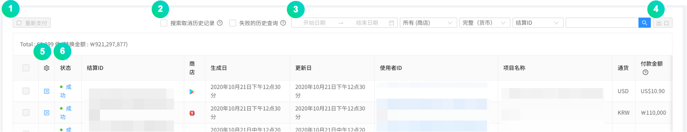
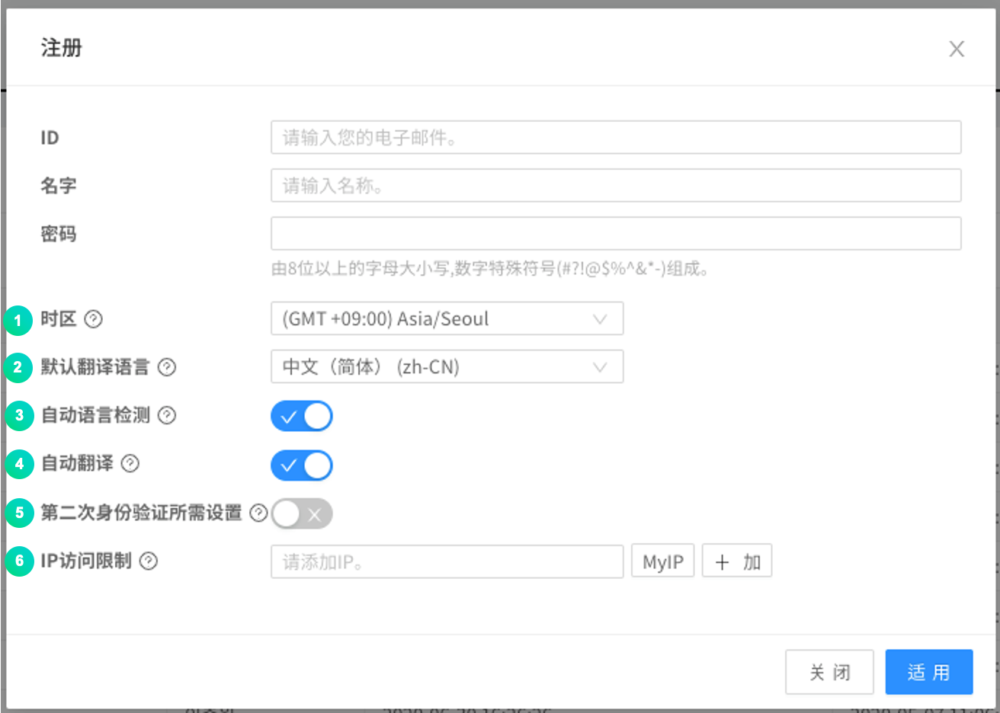

---
search:
  keyword: ['gamepot']
---

#### **为提供 NAVER CLOUD PLATFORM 产品的详细使用方法和 API 的多种使用方式，分别提供<a href="https://guide.ncloud-docs.com/docs/zh/home" target="_blank">[说明书]</a>和<a href="https://api.ncloud-docs.com/docs/zh/home" target="_blank">[API 参考指南]</a>以供参考。**

<a href="https://api.ncloud-docs.com/docs/zh/game-gamepot-index" target="_blank">进入 Gamepot API 参考指南 >></a> 
<a href="https://guide.ncloud-docs.com/docs/zh/game-gamepotconsole" target="_blank">进入 Gamepot 说明书 >></a>

# Dashboard

这是 NAVER CLOUD PLATFORM 的 GAMEPOT 提供的仪表板指南。

## GAMEPOT 仪表板介绍

**问 什么是仪表板**

您可以通过仪表板来操作和管理游戏。

**问 仪表板中包含哪些操作功能？**

在仪表板上，可以使用统计信息和会员访问统计信息以及付款确认信息，并且可以通过与 NAVER CLOUD PLATFORM 的服务链接来控制各种功能，例如 PUSH，SMS 和日志分析。 另外，由于它具有游戏所需的自己的操作功能，例如优惠券和更新，因此可以进行更有效的游戏管理。

## GAMEPOT 仪表板入门

### 登录

#### Step 1. 访问仪表板

通过单击 NAVER CLOUD PLATFORM 控制台中的仪表板 URL，访问仪表板。

#### STEP 2. 注册

创建项目时，密码重置电子邮件将发送到注册的管理员帐户。

#### STEP 3. 登录

管理员帐户将成为完全控制仪表板管理的主帐户。

① 设置管理员帐户中使用的密码。

② 选择将成为仪表盘基础的货币。 所选货币用于销售指标，付款统计信息等。 <i>如果您在操作过程中更改基础货币，以前的数据将不会更改。请谨慎选择。</i>

③ 选择要在仪表板上显示的时区。

## 使用仪表板菜单

### 仪表板

在仪表板上，您可以快速查看游戏的整体操作，例如订阅状态，销售，访问和统计信息。

① 您可以通过选择日期来检查图表。

## 统计

### 用户指示器

绘制指定时期内的各种用户指标图。

① 基本上，同一天会打印 30 天的用户指示符，并且可以通过指定时段来自由选择一个时段搜索用户指示符。

② 您可以放大每个图形来查看详细信息。

③ 您可以检查上次更新的时间。

① 您可以以 CSV 文件的形式下载当前显示图形的 RAW 数据。

#### Retention

您可以检查保留数据。 注册后，指示符上将显示[Retention D + 0]，第二天，访问的成员将显示[Retention D + 1]。

### 销售指标

绘制指定时间段内的各种销售指标图。

① 基本上是在同一天打印出 30 天的销售指数，并且可以通过指定期间查询自由选择的时期的销售指数。

② 您可以放大每个图形来查看详细信息。

③ 您可以检查上次更新的时间。

① 您可以以 CSV 文件的形式下载当前显示图形的 RAW 数据。

运作

### 成员

#### - 清单

显示注册会员列表。

① 可以指定用户注册日期、国家、商店、用户 ID、设备 ID、ADID 或者 IP 等，查询特定会员。

② 可以以 CSV 文件形式下载会员列表。

③ 可以以 CSV 文件形式下载最长 90 天的会员登录记录。

④ 单击用户 ID，以在下面显示详细页面。

① 显示有关该会员的基本信息。

② 显示访问游戏的（登录）历史。

③ 显示游戏中的信息，例如玩家 ID 和等级。

④ 显示游戏中会员的付款明细。

⑤ 显示会员收到的询问及其回复。

⑥ 显示链接到成员的所有社交帐户。

- 您可以添加社交帐户或取消连接。

⑦ 显示会员的停权。

⑧ 显示项目历史记录。

**您可以通过单击发送个人推送**按钮将推送消息发送给特定成员。

① 指定要发送的推送消息的默认语言。

② 输入要发送的信息。

③ 选择要发送的语言。

您可以通过单击**停止**按钮来停止使用特定成员。

① 选择停止状态。

② 选择注册的暂停类别。

③ 输入指定的用户 ID。

④ 选择默认语言作为暂停原因。

⑤ 输入中止原因并指定语言。

⑥ 指定暂停时间。

您可以通过单击**提款**按钮来提款特定成员。

#### - 每日访客

绘制指定时间段内每日访问者的数量。

基本上，它输出同一天 30 天的每日访问者数量，您可以通过指定时间段来自由选择期间搜索每日访问者数量。

① 您可以以 CSV 文件的形式下载当前显示图形的 RAW 数据。

② 您可以检查上次更新的时间。

#### - 新的用户

绘制指定时间段内每天注册游戏的新订户数量。

基本上，它会在同一天打印出 30 天中每天的新订阅者数量，您可以通过指定时间段来查询自由选择的时段中每天的新订阅者数量。

① 您可以以 CSV 文件的形式下载当前显示图形的 RAW 数据。

② 您可以检查上次更新的时间。

#### - 并发用户

您可以同时最多 3 天以 1 分钟为单位查看访问游戏的成员数量。

① 默认指定日期，前一天和前一天，您最多可以选择（更改）3 天进行搜索。 您可以使用重置按钮返回到默认日期。

② 您可以以 CSV 文件的形式下载当前显示图形的 RAW 数据。

③ 您可以检查上次更新的时间。

#### - 停止使用

对于某些成员，我们不允许您在指定时期内访问游戏。

暂停是根据会员的用户 ID 进行的。

① 要应用悬架，请使用添加按钮。

② 您可以通过设置使用暂停类别来注册回复消息模板。

③ 对于特定时间段，您可以查询停止使用记录。 可以以开始日期为基准搜索。

④ 对于特定的用户 ID，您可以搜索使用暂停。

⑤ 显示暂停的会员详细信息。

- 有效：当应用当前的暂停状态时
- 无效：当当前的暂停状态被取消时

### 付款

#### 付款清单

您可以在 Google Play 商店，APPSTORE，ONE 商店或 Galaxy 商店中查看会员尝试付款的历史记录。

① 对于失败的付款，请在复选框内多重选择后，点击重新支付按钮后重新支付。

② 仅可查询取消与失败的历史记录。

③ 选择时间段、商店、货币类型、付款 ID、用户 ID，即可查看付款列表。

④ 可以以 CSV 文件形式下载付款列表。

⑤ 对于已成功付款的款项，可以取消付款。 取消付款时将从销售统计中除外。

⑥ 可查询会员尝试的付款方式是否成功支付。 对于失败的付款尝试，可以重新支付道具。

您可以单击付款状态以查看尝试付款的详细信息，对于失败的付款，可以使用“还款”按钮来还款。

#### - IAP

在应用内购买时，此功能可管理产品信息。 Google Play，App Store，One Store 和 Galaxy Store 等产品必须全部注册。

① 如果单击**添加应用内商品**按钮，则可以通过输入商店，商品名称和商品 ID 来创建付费商品。

② 如果单击**大输入**按钮，则可以立即将应用内商品注册为 CSV 文件。

③ 您可以通过选择多个复选框并单击**删除**按钮来删除每个产品项。

#### - 统计

该功能可以每天绘制支付金额数据的图形。

① 您可以通过指定商店来查看图形。

② 您可以以 CSV 文件的形式下载当前显示图形的 RAW 数据。

③ 您可以检查上次更新的时间。

#### - 取消付款

与商店中收款收据的状态相比，您可以暂停使用随意取消付款的会员的游戏权限。 如果被暂停的会员重新付款，则该暂停将被停用。 Google Play 商店和 Apple App Store 支持收据验证。

① 设置取消付款用户的停止使用处理条件。

② 选择状态、商店、用户 ID、包 ID 等，即可查看付款取消列表。

③ 可以以 CSV 文件形式下载付款取消历史记录。

④ 可以查看最后更新时间。

① 用户可以决定是否停止使用取消付款的部分。激活后，它将自动停止按小时间隔设置的选项取消付款的用户。

② 如果会员任意取消付款的总次数大于设定的次数，则暂停使用游戏。

③ 如果会员任意取消付款的产品总价高于设定价格，则游戏将被暂停使用。

④ 当停止使用游戏的会员尝试访问游戏时，请选择显示的指导信息的默认语言。

⑤ 当停止使用游戏的会员尝试访问游戏时，显示此消息。

⑥ 您必须输入 Google API 密钥才能获得 Google 的付款取消列表。您可以使用测试按钮检查功能是否正常运行。

⑦ 要接收 App Store 的付款取消列表，您必须单击“复制地址”按钮以复制 URL 并将其输入 App Store。

### 注意

在仪表板上注册的通知图像会暴露给访问游戏的成员。如果您指定要公开的日程表和商店，则公告将根据条件公开，并且在日程表结束后不会公开。

要使用公告功能，需要 NAVER CLOUD PLATFORM 的 API 身份验证密钥和对象存储服务。使用通告功能时，对象存储成本是单独产生的。

#### Step 0. 创建子帐户并授予使用对象存储服务的权限

① 在接收到 API 认证密钥之前，建议创建一个子帐户来授予对象存储权限，然后通过该帐户发布 API 认证密钥。

② [Sub Account 使用指南](https://docs.ncloud.com/ko/management/management-4-1.html)创建一个带有参考的子帐户。 （创建子帐户时，请检查**API 网关访问权限**。）

③ 将对象存储服务权限授予创建的子帐户。[System Managed 政策手册](https://docs.ncloud.com/ko/management/management-4-2.html)作为参考，将**NCP_OBJECT_STORAGE_MANAGER**权限授予相应的子帐户。 （或者，包括对象存储权限）

④ 访问 Sunghan 子帐户后，将发出 API 身份验证密钥。

#### 步骤 1.准备 API 身份验证密钥

注意菜单与通过 API 的对象存储结合使用。 因此，必须预先准备 NAVER CLOUD PLATFORM 的 API 身份验证密钥。

可以在**门户>我的页面>帐户管理>身份验证密钥管理**菜单中创建 API 身份验证密钥。

① 要创建 API 身份验证密钥，请点击**创建新的 API 身份验证密钥**。

-每个帐户最多可以创建两个 API 身份验证密钥。

#### Step 2. 仪表板和 API 身份验证密钥的集成

您需要将发布的身份验证密钥与仪表板互锁，以创建对象存储桶并使用公告功能。 转到信息中心上的**项目设置> Ncloud**菜单，然后连接 API 身份验证密钥。

连接 API 身份验证密钥后，将自动创建对象存储桶。 公告中使用的所有图像均存储在存储桶中。

#### 步骤 3.添加公告

공지사항을 추가하기 위해서 **공지사항** 메뉴로 이동합니다.

화살표 버튼을 이용하여 사용자에게 노출할 이미지 순서를 지정할 수 있습니다.

**공지사항 추가** 버튼을 통해 이미지를 추가할 수 있습니다.

이후 팝업 메뉴가 나타나면 원하는 값을 입력하고 **저장** 버튼을 클릭하면 공지가 추가됩니다.

선택한 스토어의 분류에 따라 모든 스토어의 해당 앱에 공지사항이 노출되거나, 특정 스토어를 통하여 게임을 접속한 사용자에게만 공지사항이 노출될 수 있도록 지정할 수 있습니다.

분류가 지정된 이미지는, 해당 분류 값으로 호출할 때에만 이미지가 노출됩니다.

국가를 지정하면 해당 국가에 해당하는 디바이스에 대해서만 이미지가 노출됩니다.

노출된 공지사항 이미지를 사용자가 터치할 경우 클릭액션 타입에 의해 URL은 외부 브라우저로 이동하며, SCHEME은 callback 함수로 값을 리턴합니다.

언어 설정 별로, 노출 될 이미지를 추가 등록 할 수 있습니다.

### 检查更新

通过使用检查和更新功能，您可以更轻松，方便地管理游戏。

#### - 检查

在游戏检查期间，游戏会自动显示一条检查消息，以阻止游戏。

输入检查时间和消息并保存后，将显示游戏中的检查通知。

① 您可以指定一家商店。 如果是完整支票，请指定为完整商店。

② 指定检查的开始时间和结束时间。

③ 在要根据设备语言设置而不同显示的检查消息中，指定默认语言。

④ 您可以另外注册消息，以针对每种语言设置以不同的方式显示。

⑤ 对于 URL，请输入在检查过程中单击“查看详细信息”时要移动的地址。

**例如：咖啡厅公告或自制检查指南页面**

#### - 更新

如果不是最新版本，它将显示更新说明，并转到商店（例如 Google Play 或 Apple Store）的更新屏幕。

① 为每个商店设置。

② 选择是否激活该功能。

③ 如果选择**强制**，则必须先从商店进行更新，然后才能使用游戏；如果选择**推荐**，则无需从商店进行更新就可以使用游戏。

④ 输入版本信息。如果它不同于或低于输入的版本，则功能运行。

⑤ 输入选择更新按钮时要访问的 URL。

- 自定义 URL 输入：当在客户端更新弹出窗口中选择了更新按钮时，移至自定义 URL 设置
- 未输入自定义 URL：如果在客户端更新弹出窗口中选择了更新按钮，它将进入默认存储。

### 消息

它是一项服务，可以通过 SMS，PUSH 等实现消息通知功能，而无需构建单独的消息服务器。 要使用此功能，您必须申请 NAVER Cloud Plaform 的简易通知服务（SENS）。

① 建议创建子账户并申请 SENS 服务。 通过参考文本中的**注意->Step 0**创建子帐户。 （与**Step 0**一样，请从子帐户获取 API 身份验证密钥。）

② 将 SENS 服务权限授予创建的子帐户。 请参阅[系统托管策略指南](https://docs.ncloud.com/ko/management/management-4-2.html)并向子帐户授予**NCP_SENS_MANAGER**（包括）权限 。

① 为了与 SENS 互通，必须发出服务密钥。 **单击发行服务密钥**按钮，访问创建的子帐户，然后参考[SENS 通用指南](https://docs.ncloud.com/ko/sens/sens-1-2.html) 获取服务密钥。

② 单击**证书注册指南**按钮，根据**SENS Web 控制台用户指南**注册证书。

③ 单击**设置**按钮，移至下面的屏幕，然后输入 PUSH 服务 ID 值。

#### - 推送消息

**消息>推送消息**单击菜单以显示列表屏幕，您可以在其中检查装运状态，预订时间和交货时间。

如果单击**推送消息**菜单中的**添加消息**按钮，将显示以下弹出窗口。 您可以通过相应的弹出菜单发送消息。

① 您可以指定推送消息的传输时间表。 （立即交付/预约交付/预约交付（全球当地时间））

② 通过指定平台，只有指定的平台用户才能接收推送。

③ 根据设备的语言设置，在要发送的推送消息中指定默认语言。

④ 您可以根据需要输入标题。 如果未输入，则将应用名称显示为标题。

⑤ 根据设备的语言设置，可以注册不同的推送消息。

您可以通过上传 CSV 文件来发送大量推送消息。

- 通过批量输入最多可以注册 100 次推送（CSV 文件的最大容量为 20 MB）
- 下载并设置 CSV 样本，然后单击“注册 CSV 文件”进行注册。
- 请以 UTF-8 格式保存并注册 CSV 文件。
- 大量输入不支持立即推送。

#### - 文字按摩

您可以使用诸如发送 SMS / LMS，查询历史记录和结果之类的功能。 要发送 SMS / LMS，首先，在 NAVER CLOUD PLATFORM 的 SENS 中需要发布服务密钥和呼叫号码。

① 为了与 SENS 互通，必须首先发出服务密钥并注册一个呼叫号码。 **单击发布服务密钥**按钮，[SENS 通用指南](https://docs.ncloud.com/ko/sens/sens-1-1.html)和[SENS SMS 用户指南](https://docs.ncloud.com/ko/sens/sens-1-3.html)以注册服务密钥发布和呼叫号码。

② 单击**设置**按钮，然后输入服务 ID 和密钥。

点击**添加消息**按钮。显示以下弹出窗口。

① 短信，LMS 短信。价格根据消息而有所不同。

② 在 Naver Cloud 控制台上输入注册的呼叫号码（不会发送未注册的号码。）

③ 您可以输入要通过 SMS 或 LMS 发送的号码。

④ 如果 SMS，LMS 接收号码/优惠券随机数等较大，则可以将其配置为 CSV 文件，并可以下载示例文件。

⑤ 如果 SMS，LMS 接收号码/优惠券随机号码等数量较大，则可以使用 CSV 文件上传。上载的 SMS，LMS 接收号码和优惠券随机数与 ⑥ 消息内容中的指定项目匹配，并自动输入并发送到 SMS 和 LMS。

⑥ 输入要通过 SMS 或 LMS 发送的消息的内容。

⑦ 如果您指定了预约时间，则会在指定时间发送信息。

### 优惠券

游戏中必不可少的优惠券功能支持常规优惠券和关键字优惠券。

#### - 普通优惠券

일반 쿠폰은 일반적인 코드 형태로 되어 있는 쿠폰입니다.

게임 내에서 사용될 쿠폰을 쉽게 생성 및 관리 하실 수 있는 기능입니다.

리스트 앞 쪽의 아이콘을 클릭하면 쿠폰 수량을 추가하거나 사용 통계를 확인할 수 있습니다.

**+쿠폰생성**을 클릭하면 쿠폰을 생성할 수 있습니다.

Prefix\(접두사\), Suffix\(접미사\)를 지정한 경우 쿠폰번호 생성 시 지정된 문구가 붙습니다.

쿠폰 수량은 최대 10만개 생성 가능하며, 생성 후에 증가시킬 수 있습니다. 최대 쿠폰 수는 50만개 입니다.

제목과 내용을 입력하면 인게임에서 쿠폰 제목과 쿠폰 내용을 보여줄 수 있습니다.

쿠폰 사용 시 지급되는 아이템과 아이템의 수량을 지정할 수 있습니다. + 버튼을 통해 복수의 아이템을 지급할 수 있습니다.计。

#### - 关键字优惠券

此功能可以创建指定的关键字，例如“圣诞节”，“公开活动”和“新年”，并在优惠券窗口中输入关键字时付款。 由于最近复杂的优惠券代码输入，经常使用关键字优惠券来方便游戏用户。

点击 **+创建优惠券**。

기간과 쿠폰을 지급할 키워드를 입력해야 합니다.

제한 수량을 초과하지 않고 지급이 가능합니다.

제목과 내용을 입력하면 인게임에서 쿠폰 제목과 쿠폰 내용을 보여줄 수 있습니다.

쿠폰 사용 시 지급되는 아이템과 아이템의 수량을 지정할 수 있습니다. + 버튼을 통해 복수의 아이템을 지급할 수 있습니다.

#### - 使用记录

전체 발급된 쿠폰 번호를 기간, 쿠폰 번호, 사용자 ID 등으로 조회하실 수 있습니다.

[실패 이력 조회] 버튼을 체크하면 실패한 이력만 조회할 수 있습니다.

### 客户支持

当客户在游戏中进行查询时，可以查看并回答此功能。 如果您可以在游戏内客户支持窗口中输入基本信息，则还可以在 GAMEPOT 中检查该信息。

#### 客户查询

고객이 문의한 내역을 확인하실 수 있습니다.

고객문의 페이지에서 해당 회원에 대한 모든 정보를 확인할 수 있습니다.

번역 기능으로 문의 내용, 답변 내용의 언어를 감자히거나 원하는 언어로 번역할 수 있습니다.

> 고객문의 번역 기능은 프로젝트 설정>NCloud>Papago 값을 설정해야 노출됩니다. 기본 번역 언어, 자동 언어 감지, 자동 번역 기능은 회원 정보 수정에서 설정할 수 있습니다.

각 문의에 담당자를 지정할 수 있습니다. 담당자를 지정하면 해당 담당자 외 다른 사용자는 문의에 답변할 수 없습니다.

답변 템플릿을 선택하여 자주 쓰는 답변 내용을 불러올 수 있습니다.

답변에 필요한 이미지 및 동영상 파일을 업로드할 수 있습니다.

답변 만족도는 문의 종료 후 고객이 만족도를 선택해야 노출됩니다.

**\[알림 및 문의 설정\]**

문의 답변 시 고객에게 푸시, 메일을 발송을 설정하거나 문의 설정을 하는 기능입니다.

##### 푸시 설정

디바이스 언어 설정에 따른 푸시 알림 기능을 설정합니다.

##### 메일 설정

발신 메일 설정을 언어별로 입력합니다.

메일 발송 기능을 사용하려면 발신 메일 주소, 발신 메일 이름을 필수로 입력해야 합니다.

메일 내용을 입력하지 않으면 기본 메시지가 발송됩니다.

**발신 메일 미리보기** 버튼을 클릭하여 발송될 메일 템플릿을 확인할 수 있습니다.

##### 고객문의 설정

문의 시 수집 항목 노출 여부를 선택합니다.

활성화한 항목은 고객 문의 UI에 입력 항목이 표시됩니다.

**[分类设置]**

该功能是预先设置客户查询模板。

点击**分类设置**。

**분류 추가**를 통해, 고객문의에 대한 분류명을 추가하고 관리할 수 있습니다.

디바이스 언어설정에 따라 다른 분류명과 템플릿을 지정해 놓을 수 있습니다.

이벤트 약관을 설정하면 SDK에서 해당 분류를 선택했을때 약관창이 노출됩니다.

**\[Web 咨询地址\]**

没有登录的用户也可以通过 Web 进行咨询。 回复用邮件发送。

点击**Web 咨询地址**时，外部咨询 URL 将保存到剪贴板。

**\[回复模板设置\]**

可设置咨询回复模板。

点击**添加回复模板**。

① 选择是否使用回复模板。

② 选择模板语言。 仅可设置项目的使用语言。

③ 输入要适用于所选语言的模板名称。

④ 输入要适用于所选语言的回复模板内容。

#### - FAQ

常见问题可以进行注册和检查。

点击**添加**。

① 如果检查状态，则可以激活并检查相应的问题。

② 您可以选择常见问题的类别名称。

③ 在 FAQ 项（根据设备语言设置的不同而有所不同）中，指定默认语言。

④ 根据设备语言设置，可以注册不同的问题和答案。

⑤ 输入您的问题和答案。

**[分类设置]**

这是设置常见问题解答分类的功能。

点击**分类设置**。

使用**添加分类**，您可以添加和管理用于客户查询的分类名称。

① 检查状态以激活类别名称。

② 在 FAQ 分类名称中指定默认语言，该默认语言根据设备语言设置而有所不同。

③ 根据设备语言设置，可以指定不同的 FAQ 分类名称。

④ 输入指定语言的分类名称。

**\[Web 访问地址\]**

通过外部访问而没有登录的用户也可以在 Web 中查看 FAQ。

#### - 使用条款

您可以输入内部条款和条件。 可以通过 SDK 向用户公开这些内容。

① 根据使用条款指定默认语言，根据使用的设备语言设置，默认语言会有所不同。

② 您可以在网页上查看条款和条件。 单击后，URL 被复制。 要使用其他语言进行连接，请在 URL 后面添加<b> <i>＆language=zh_CN </i>（请参见 ISO 639-1 代码）</b>。

③ 您可以为每种设备语言设置输入不同的条款和条件。

④ 输入指定语言的使用条款。

#### - 隐私权政策设定

您可以输入公司的个人信息处理政策的内容。 可以通过 SDK 向用户公开这些内容。

① 在隐私策略的内容中指定默认语言，这些默认语言根据设备语言设置而有所不同。

② 您可以在网页上查看隐私政策。 单击后，URL 被复制。 要使用其他语言进行连接，请在 URL 后面添加<b> <i>＆language=zh_CN </i>（请参见 ISO 639-1 代码）</b>。

③ 您可以为每种设备语言设置输入不同的隐私策略。

④ 输入指定语言的隐私政策的详细信息。

#### - 退款政策设定

您可以输入内部退款政策。 可以通过 SDK 向用户公开这些内容。

① 在退款政策内容中指定默认语言，该默认语言根据设备语言设置而有所不同。

② 您可以在网页上查看退款政策。 单击后，URL 被复制。 要使用其他语言进行连接，请在 URL 后面添加<b> <i>＆language=zh_CN </i>（请参见 ISO 639-1 代码）</b>。

③ 您可以为每种设备语言设置输入不同的退款政策。

④ 输入指定语言的退款政策的详细信息。

#### - 统计

您可以查看一段时间内的客户查询统计信息。

답변 만족도는 문의 종료 후 고객이 만족도를 선택해야 노출됩니다.

#### - 담당자별 통계

담당자를 선택하여 담당자별 통계를 확인할 수 있습니다.

#### - 일별 리포트

고객 문의 통계를 일별로 확인할 수 있습니다.

최대 90일까지 조회가능합니다.

#### - 页

此功能创建一个 Web 文档并提供一个连接地址。

① 您可以创建和编辑网页。

② 输入指定语言的页面内容。

#### -GDPR

以客户端访问 IP 为基准，当被判断为 GDPR 对象国家时，显示 GDPR 条款画面替代原先条款画面。

① 可以进行 GDPR 相关设置。

② 可以选择 GDPR 页。

③ 可以选择是否使用当前页。

④ 可以选择当前页是否为必须确定事项。

> 使用 GDPR 时，须在 NAVER CLOUD 控制台中激活 OutBoundMailer 功能。

① 可以选择是否激活 GDPR。 激活 GDPR 后，原先使用条款、个人信息处理方针将由 GDPR 设置的内容替代。

② 输入发件人邮件地址。

③ 输入发件人邮件名。

④ 可以选择是否激活广告、应用等。 [同意接收个人精准广告投放]、[同意接收精准投放以外的一般广告]等条款将在选择后显示。

## 游戏

### 播放器

游戏中角色信息可以通过 SDK 传输并在仪表板上检查。

### 礼品

物品可以通过 webhooks 发送到游戏服务器。

① 可以添加礼物发送。

② 通过上传 CSV，可以大量登录待发送礼物。

③ 对于发送失败的礼物记录，请在复选框内多重选择后，点击重新支付按钮后重新支付。

④ 仅可查询发送失败历史记录。

⑤ 可以指定时间段、用户 ID、题目、内容等进行搜索。

⑥ 可以以 CSV 文件形式下载礼物发送历史记录。

⑦ 可以查看礼物发送详细历史记录。

点击**发送礼物**按钮。

① 如果选中，则测试不会发送到实际的游戏服务器。

② 选择目标。

③ 可以输入目标 ID。

④ 发送项目时，输入作为 UserData 值发送的数据。

⑤ 您可以输入要显示的标题。

⑥ 您可以输入要显示的描述。

⑦ 指定要运送的物品和数量。

#### - 项目

在项目菜单中，您可以创建可以通过优惠券获得的优惠券项目。 您可以通过单击**添加项目**按钮添加项目。

① 您可以添加项目。

② 单击**大输入**按钮立即将项目注册为 CSV 文件。

① 输入项目名称。

② 输入项目 ID。 每个商品的商品 ID 必须唯一。

### 提前预订

预先预约功能是通过预先预约网页显示注册用户的统计的功能。

① 可以添加预定。 保留名称用作统计信息计算的 ID。

② 您可以编辑预约名称。

③ 可以下载提前预约的申请者。

将来，我们将添加一些功能，使批量短信发送功能可以提前预订。

### 远程配置

远程配置功能允许您更改应用程序的行为和外观，而无需更新应用程序。 您可以将参数添加到服务器并从 GAMEPOT SDK 加载值以供使用。 因此，如果要控制服务器上游戏中的功能，则可以使用此功能轻松地应用和控制它们。

点击**添加**按钮。 显示以下弹出窗口时，输入参数和值。

反映相应参数和值的时间由运行新应用程序的用户反映。

### 记录

日志功能可以通过链接 NAVER CLOUD PLATFORM 的 ELSA 来收集游戏日志或崩溃日志。 有关如何使用 ELSA 的信息，请参阅[ELSA 用户指南](https://docs.ncloud.com/ko/elsa/elsa-1-1.html)。

## 广告

与 Nasmedia Inc.合作，该功能使您可以轻松地申请广告并在 GAMEPOT 仪表板上查看各种统计信息。

## 设置

### 项目设置

#### - 正常

您可以设置应用程序的整体环境并输入各种键值来操作应用程序。

##### 基本信息

① 请写下游戏名称。

② 您可以选择应用程序类型。

③ 您可以选择一个类别。

④ 可以输入项目说明。

⑤ 您可以输入大麻。

⑥ 可以选择语言。

⑦ 您可以更改基础货币。

- 即使在操作过程中更改了基础货币，过去的付款金额也不会更改。 请仔细选择。

##### Public Key

此项设置为链接到 Google Store 和 One Store。

① 输入 Google Store 公钥值。

② 如果您从 Google Store 发行了两个版本的同一游戏（例如 12 和 18），则将程序包名称放在前面，并将公钥值放在后面。

③ 输入“一个商店的公共密钥”值。

④ 在同一家商店中发行两个版本的同一游戏时（例如 12 和 18），将程序包名称放在前面，并将公钥值放在后面。

##### Google API Key

Google API 集成（Google Store 付款取消者列表检查和最新版本的付款收据验证）需要此设置。

① 输入 Google 提供的 JSON 数据。 请参考“查看帮助”。

② 这是付款收据验证版本。 如果您在项目 1 中输入数据，请选择“版本 3”。

③ 您可以检查 Google 收据验证测试输入的 Google JSON 值是否正确。

① 输入 Google 收据的包裹名称。

② 输入 Google 收据的产品名称。

③ 输入 Google 收据的购买令牌。

④ 您可以检查 Google 收据查询的结果。

##### Apple ID Login

需要预先设置此信息，以便使用您的 Apple ID 在 Android 设备上登录。 您可以通过单击查看帮助来检查输入法的详细信息并返回 URL。

##### App ID

这是通过强制更新移动商店时所需的设置项。您可以通过单击查看帮助来检查如何获取 ID。在第一个输入字段中，输入一个值以标识版本，在第二个输入字段中，输入一个值以发送到商店。

① 输入 Google Store 包装名称。

② 如果您发布两个版本的同一个游戏，请输入 Google Store 软件包的名称（例如 12 岁，18 岁的版本）。

③ 输入 One Store 的包裹名称和 PID。

④ 如果您发布两个版本的同一游戏，请输入一个商店包装名称和 PID。

⑤ 输入 Galaxy Store 的包裹名称。

⑥ 如果您发布两个版本的同一游戏，请另外输入 Galaxy Store 软件包的名称。

⑦ 输入 Apple Store 捆绑包 ID 和 Apple ID。

⑧ 如果您发布两个版本的同一游戏，请另外输入 Apple Store 的捆绑软件 ID 和 Apple ID。

##### Server Key

这是必须预先设置的信息，以便进行应用内付款并向 One Store 请求商品付款。

① 输入原始商店的许可证密钥。

② 如果要启动两个版本，请输入不同版本的许可证密钥（如果不是，则无需输入。）

##### Auth Key

验证密钥项在登录 Google 或 Facebook 时用于令牌验证，如果令牌验证失败，则将限制游戏用户的登录。 登录受限的游戏用户会自动在暂停菜单中注册。

① 输入 Google 的客户 ID 值。

② 输入 Facebook App ID 值。

③ 输入 Facebook App 密钥值。

④ 输入 Apple 私钥。

⑤ 输入您的 Apple KEY ID。

⑥ 输入您的 Apple TEAM ID。

##### WebHook

결제 아이템은 결제 성공 시 아이템 지급을 요청하는 주소를 입력합니다.

쿠폰 아이템은 SDK를 이용하여 쿠폰 사용 성공 시 SDK 서버에서 개발사 서버로 성공에 대한 처리\(아이템 지급\)를 요청하는 주소를 입력합니다.

실 서비스에 이용되는 주소\(서비스\)와 서비스 중 테스트 환경이 필요한 경우의 주소\(테스트사용자\)가 제공됩니다. 테스트 사용자 주소로 동작하게 하려면 '프로젝트 설정 &gt; 테스트 사용자'에 추가해 주셔야 합니다.

**WebHook Test** 버튼을 클릭하여 WebHook 적용을 간단하게 테스트할 수 있습니다.

**White IP** 버튼을 클릭하여 Webhook을 통해 게임 서버 호출 시 허용해야 하는 IP 리스트를 확인할 수 있습니다.

**테스트 결제 발송 차단** 스위치를 활성화하면 테스트 결제 시 Webhook을 발송을 차단할 수 있습니다.

> 활성화한 경우 : 테스트 결제 시 결제 실패로 처리
>
> 비활성화한 경우 : 테스트 결제 시 결제 성공으로 처리

#### - Ncloud

您还可以更改与 Naver Cloud 平台互通的键值。 有关详细用法，请参阅各项的用户指南。

#### - CDN

如果您想使用 CDN，请在下面输入 CDN 地址。

**输入 CDN 地址时的注意事项**

- 原始 CDN 必须具有用于\[通知\]功能的对象存储。
- 如果没有输入 CDN，或者 URL 不正确或原始设置不正确，则上传的图像将无法在游戏中正常显示。

#### - -外部付款

对于“一个商店”，允许使用第三方付款模块，而不是默认商店付款模块。

支持 PG 的公司会持续数天，并将不断增加。

**\[设置\]**

通过 Danal 获取每种付款方式所需的值，然后在 One Store 控制台中为**Store Secret key**输入**Client Secret**值。

#### - 白色用户

使用注册的 IP 连接时，将根据指定的类型激活以下功能。

- 开发：SDK 日志已激活，并且日志已公开。
- 付款/优惠券：使用付款和优惠券时，将调用设置为 Webhook 测试的地址。
- 检查：即使检查功能被激活，也会被忽略并继续。
- Update：即使激活了更新功能，也将忽略。
- 成员资格：忽略访问块中包含的国家或 IP，然后继续。

**추가** 버튼을 클릭해서 매개변수와 값을 입력합니다.

#### - 块连接

防止用户访问已注册的 IP 和设备 ID 国家/地区代码。

点击**添加**按钮。 显示以下弹出窗口时，输入参数和值。

① 检查状态将激活连接阻止。

② 指定要断开的输入值的类型。

③ 输入要断开的对象。

④ 对于根据阻止目标的设备语言设置而不同显示的消息，请指定默认语言。

⑤ 根据设备语言设置，可以注册不同的消息。

#### - API Key

此菜单用于管理用于身份验证的密钥以使用 Open API。
单击[+ Add]按钮生成密钥，并且在调用 Open API 时，应将生成的密钥值作为 x-api-key 值放在标题中。
如果单击钓鱼键，则可以进入编辑菜单，编辑键状态，键到期日期，说明等，或删除键。

### 관리자

#### 감사

최고 관리자 계정으로 대시보드 사용자의 활동 기록을 확인할 수 있습니다.

### Job 管理

您可以从每个菜单下载为一个月导出到 csv 的结果。

## 其他

### SDK다운로드

Android, IOS, Unity SDK를 다운로드할 수 있습니다.

> 대시보드 우측 상단에서 GAMEPOT 정보를 확인할 수 있습니다.

### GAMEPOT 공지사항

GAMEPOT의 공지사항을 확인할 수 있습니다.

### 사용자 가이드

GAMEPOT 대시보드 사용 가이드 페이지로 이동합니다.

### 언어 변경

대시보드의 각 메뉴 등이 선택한 언어로 변경됩니다.

### 회원정보수정

대시보드 이용 계정의 이름, 비밀번호를 변경하실 수 있습니다.

대시보드 우측 상단의 아이콘을 클릭하면 나타나는 드롭다운 메뉴 중 회원정보수정을 선택할 수 있습니다.

① 您可以更改用户名。

② 设置仪表板的时区。

③ 使用客户查询翻译时，选择要翻译并到达的语言。

④ 设置在使用客户查询的翻译时是否自动检测查询历史的语言。

⑤ 设置在使用客户查询翻译时是否自动翻译查询历史的语言。

⑥ 您可以更改密码。

⑦ 可设置登录二次验证。

可以在验证码、OTP 中选择一种方式进行二次验证。

① 设置手机 SMS 验证码进行二次验证。

② 设置 Google OTP 进行二次验证。

### 优先

用户管理，角色管理和用于 Gamepot 仪表板管理的更新功能。

#### - 用户

您可以通过菜单添加/删除用户，以管理可以使用仪表板的用户。

① 检查状态将激活用户。

点击**注册**按钮。如果显示以下弹出窗口，请输入相应的值。

① 设置成为用户仪表盘标准的时间段。

② 使用客户支持翻译功能时，选择翻译语言。

③ 使用客户支持翻译功能时，选择是否自动识别咨询内容的语言。

④ 使用客户支持翻译功能时，选择是否自动翻译咨询内容的语言。

⑤ 用户登录时，选择二次验证是否为必选设置。

⑥ 设置 IP 访问限制时，将限制未被允许的 IP 访问。

#### - 角色

此功能用于管理可以按组使用仪表板的用户，并且可以为每个角色赋予不同的特权。

点击**齿轮**按钮。 在下面的屏幕中，您可以设置角色。

① 放置要包含在角色中的用户。

② 将用户包括在基本角色中。 对于默认角色，您拥有完全控制权。

③ 选择该角色允许的功能。

#### - 更新

您可以检查游戏吊舱系统的更新历史记录。

