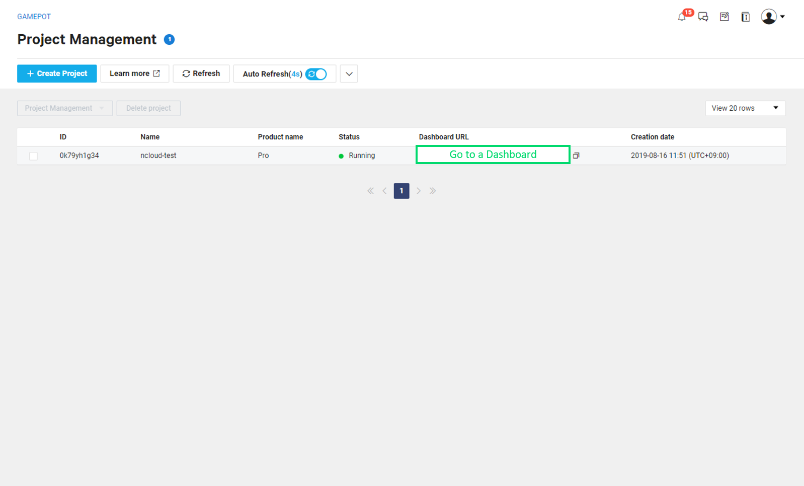
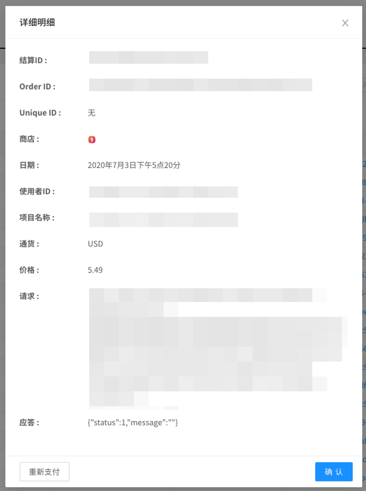
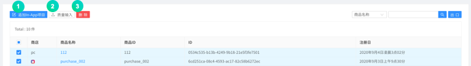
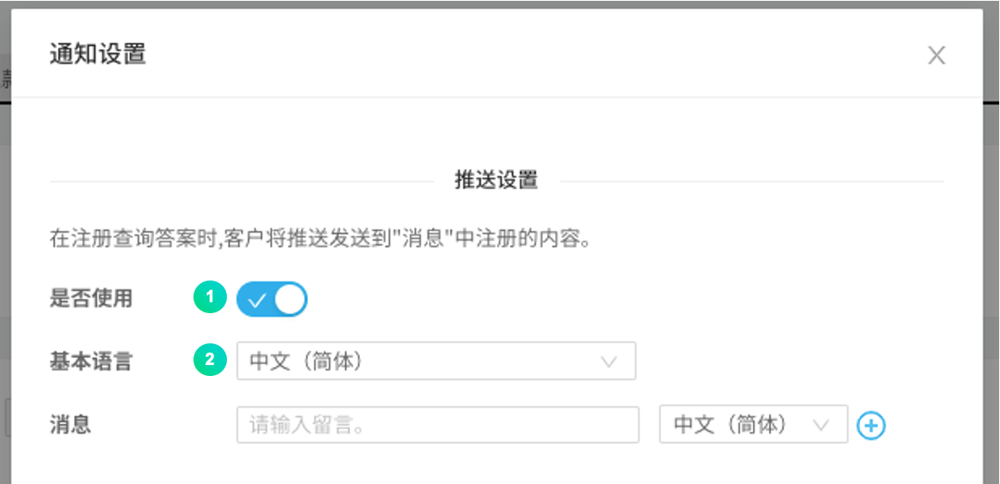
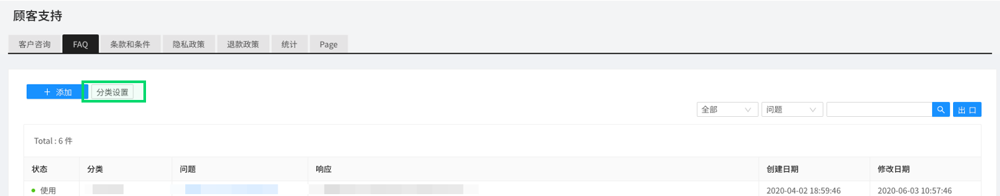

---
search:
  keyword: ["gamepot"]
---

# 仪表盘

关于NAVER CLOUD PLATFORM的GAMEPOT提供的仪表盘的指南。

## GAMEPOT仪表盘介绍

**Q. 仪表盘是指？**

可以通过仪表盘运行和管理游戏。

**Q. 仪表盘中包含哪些运行功能?**

仪表盘里可以统计和查看会员访问汇总和付款，还能关联NAVER CLOUD PLATFORM的服务，控制推送、SMS、日志分析等各种功能。此外还自带优惠券或更新等游戏所需的运行功能，因而可以实现更高效的游戏管理。

## 开始GAMEPOT仪表盘

### 登录

#### 第一步. 访问仪表盘

在NAVER CLOUD PLATFORM的控制台中点击仪表盘URL访问仪表盘。

#### 第二步. 注册会员

向创建项目时添加的管理员账户发送密码初始化邮件。

#### 第三步. 登录

管理员账户成为拥有仪表盘管理的所有权限的主账户。

① 设置要在管理员账户中使用的密码。

② 选择仪表盘的标准货币。所选货币将在销售指标、付款统计等中使用。<i>运营过程中即使更改标准货币，之前的数据也不会改变，请谨慎选择。</i>

③ 选择要在仪表盘中显示的时区。

## 利用仪表盘菜单

### 仪表盘

仪表盘中可以一目了然地掌握用户注册现况、销售、访问、统计等游戏的全面运行状况。

① 可以选择日期查看图表。

## 统计

### 用户指标

以图表形式显示指定时间段内的各种用户指标。

① 默认显示以当日为准30天的用户指标，还可以通过指定期间自由查询所选时间段内的用户指标。

② 可以放大各图表查看详细信息。

③ 可以查看最后更新时间。

① 可以以CSV文件格式下载当前显示的图表的RAW数据。

#### 保留

可以查看保留数据。[Retention D+0]从注册日开始在指标中显示，[Retention D+1]从注册日第二天也登录的会员开始显示。

### 销售指标

以图表形式显示指定时间段内的各种销售指标。

① 默认显示以当日为准30天的销售指标，还可以通过指定期间自由查询所选时间段内的销售指标。

② 可以放大各图表查看详细信息。

③ 可以查看最后更新时间。

① 可以以CSV文件格式下载当前显示的图表的RAW数据。

## 运行

### 会员

#### - 列表

显示注册的会员列表。

① 可以指定会员注册日的范围，查询特定期间内注册的会员。

② 可以指定用户ID或者IP，查询特定会员。

③ 可以以CSV文件格式下载会员列表。

④ 点击用户ID时，会出现以下详细页面。

① 显示会员的基本信息。

② 显示登录游戏的\(登录\)明细。

③ 显示玩家ID、等级等游戏内信息。

④ 显示会员在游戏中付款的明细。

⑤ 显示会员提交的咨询和相应的回复明细。

⑥ 显示会员关联的所有社交账户。

- 可以添加社交账户或取消关联。

⑦ 显示会员停用明细。

⑧ 显示已发放道具明细。

点击**个别推送**按钮，可以给特定会员发送推送消息。

① 指定要发送的推送消息的默认语言。

② 输入要发送的消息。

③ 选择要发送的语言。

点击**停用**按钮，可让特定会员停用。

① 选择停用状态。

② 选择添加的停用分类。

③ 已输入指定的用户ID。

④ 选择要显示的停用理由的默认语言。

⑤ 输入停用理由后指定语言。

⑥ 指定停用期间。

点击**注销会员**按钮，可注销特定会员。

#### - 每日访问者

以图表形式表示指定期间内的每日访问者数。

默认显示以当日为准30天的每日访问者数，还可以通过指定期间自由查询所选时间段的每日访问者数。

① 可以以CSV文件格式下载当前显示的图表的RAW数据。

② 可以查看最后更新时间。

#### - 新用户

以图表形式显示指定期间内新注册游戏的每日新用户数。

默认显示以当日为准30天的每日新用户数，还可以通过指定期间自由查询所选时间段的每日新用户数。

① 可以以CSV文件格式下载当前显示的图表的RAW数据。

② 可以查看最后更新时间。

#### - 同时访问者

可以以一分钟为单位，最多可同时查询3天内访问游戏的用户数。

① 默认指定当天、昨天和前天，可以选择\(更改\)想要查询的最多三个日期。使用初始化按钮可以重新恢复成默认的指定日期。

② 可以以CSV文件格式下载当前显示的图表的RAW数据。

③ 可以查看最后更新时间。

#### - 停用

设置让特定的会员在指定的时间段内无法登录游戏。

停用以会员的用户ID为准应用。

① 为了应用停用，利用添加按钮。

② 可以设置停用分类，添加响应消息模板。

③ 可以查询特定时间段内的停用历史记录。

④ 可以查询特定用户ID的停用明细。

⑤ 输出停用会员明细。

- 可用：当前应用了停用状态时
- 禁用：当前解除了停用状态时

### 支付

#### - 付款列表

可以查看会员在Google Play Store、APPSTORE、ONE Store、Galaxy Store里尝试付款的明细。

① 仅可查询失败记录。

② 选择货币类型，可以查看每种货币类型的付款列表。

③ 对于付款成功款项，可进行取消付款处理。取消付款时从销售统计中除外。

④ 可查询会员尝试的付款是否成功。对于失败的付款尝试，可以重新发放道具。

点击付款状态可以查看尝试付款的相关具体明细，对于失败的付款可以使用重新发放按钮重新发放道具。

#### - IAP

在应用内购买时管理产品信息的功能。Google Play Store、APP STORE、ONE Store、Galaxy Store等的产品都需要添加。

① 点击**添加In-App道具**按钮，可通过输入Store、产品名、产品ID，创建收费道具。

② 点击**批量输入**按钮，可以用CSV文件一次添加应用内产品。

#### - 统计

以图表形式显示每日付款金额数据的功能。

① 可以指定商店查看图表。

② 可以以CSV文件格式下载当前显示的图表的RAW数据。

③ 可以查看最后更新时间。

#### - 取消付款

可以与商店的付款发票状态对比，对任意取消付款的会员采取游戏登录停用措施。已停用的会员重新付款相应道具时，停用状态将禁用。支持Google Play商店、Apple App Store的发票验证。

① 设置取消付款用户的停用处理条件。

② 可以以CSV文件格式下载当前显示的图表的RAW数据。

③ 可以查看最后更新时间。

① 针对会员恶意反复取消付款的情况，可以决定是否采取停用措施。针对激活时每隔1小时根据设置的选项自动取消付款的恶意用户，启用“停用”功能。

② 会员任意取消付款的总次数达到设置的次数上限时会被停止使用游戏。

③ 会员任意取消付款的产品价格总额达到设置的价格上限时会被停止使用游戏。

④ 选择被停止使用游戏的会员尝试登录游戏时显示的提醒消息的默认语言。

⑤ 被停止使用游戏的会员尝试登录游戏时跳出的消息提醒。

⑥ 为获取Google的付款取消列表，须输入Google API密钥。可以使用测试按钮确认功能是否正常运行。

⑦ 为获取App Store的付款取消列表，须点击复制地址按钮，复制URL并在App Store中输入。

### 公告事项

在仪表盘上添加的公告事项图像会显示给登录游戏的会员。如果指定了要显示的日期和商店，将根据相应条件显示公告事项，显示时间结束后将不再显示。

要使用公告事项功能，首先需要NAVER CLOUD PLATFORM的API认证密钥和Object Storage服务。使用公告事项功能时，另外产生Object Storage费用。

#### 第零步. 创建子账户，赋予Object Storage服务使用权限

① 建议在获取API认证密钥之前创建子账户，赋予Object Storage使用权限后，通过该账户获取API认证密钥。

② 参考[Sub Account使用指南](https://docs.ncloud.com/ko/management/management-4-1.html)并创建子账户。（创建子账户时，请勾选**API Gateway Access**。）

③ 请赋予创建的子账户Object Storage服务权限。参考[System Managed策略说明书](https://docs.ncloud.com/ko/management/management-4-2.html)，赋予相应子账户**NCP_OBJECT_STORAGE_MANAGER**权限。（或包括Object Storage权限的权限）

③ 用创建的子账户访问后，获取API认证密钥。

#### 第一步. 准备API认证密钥

公告事项菜单通过API关联并使用Object Storage。因此要提前准备NAVER CLOUD PLATFORM的API认证密钥。

API认证密钥可以在**门户 > 我的页面 > 账户管理 > 认证密钥管理**菜单中创建。

① 请点击**创建新API认证密钥**，创建API认证密钥。

- 一个账户最多可创建两个API认证密钥。

#### 第二步. 关联仪表盘和API认证密钥

必须将获取的认证密钥与仪表盘关联，才能创建Object Storage存储桶并使用公告事项功能。转到仪表盘的**项目设置 > Ncloud**菜单，连接API认证密钥。

连接API认证密钥后，自动创建Object Storage存储桶。公告事项中使用的所有图像都会保存在该存储桶中。

#### 第三步. 添加公告事项

为了添加公告事项，转到**公告事项**菜单。

① 可以通过**添加公告事项**按钮添加图像。

② 可以指定显示给用户的图像顺序。

之后如果出现以下弹出菜单，输入想要输入的值，点击**保存**按钮即可添加公告。

① 选择是否激活相应公告事项。

② 指定要显示的公告事项的开始日期和结束日期。

③ 可以根据所选的商店类别，指定在所有商店的相应应用中显示公告事项，或只向通过特定商店登录游戏的用户显示公告事项。

④ 用户点击显示的公告事项图像时，URL会跳转到外部浏览器，SCHEME会通过回调函数返回数值。

⑤ 在要根据各语言设置显示的公告事项图像中，指定默认语言。

⑥ 要显示的公告事项图像可以通过鼠标拖放或者直接选择文件。

可以根据语言设置补充添加要区分显示的图像。

### 维护&更新

使用维护和更新功能，可以更简单更方便地管理游戏。

#### - 维护

游戏维护期间内会自动显示维护消息并阻止游戏登录。

输入并保存游戏维护时间和消息后，会在游戏里显示游戏维护公告。

① 可以指定商店。全面维护时请指定全部商店。

② 请指定游戏维护的开始时间和结束时间。

③ 在要根据设备语言设置区分显示的维护消息中，指定默认语言。

④ 可以根据语言设置补充添加要区分显示的消息。

⑤ 请在URL里输入游戏维护时点击“查看详情”后要跳转的地址。

**例如：论坛公告事项或自制的维护通知页面**

#### - 更新

如果不是最新版本，会显示更新通知，并跳转到Google Play或Apple Store等商店的更新页面。

① 按各个商店进行设置。

② 选择是否激活功能。

③ 选择**强制**时商店更新之前无法登录游戏，选择**建议**时即使未在商店中更新也可以登录游戏。

④ 输入版本信息。与输入的版本不一致或者低于输入的版本时会启用功能。

⑤ 输入选择更新按钮时要跳转的URL。

- 输入Custom URL：在客户端更新弹窗中选择更新按钮时跳转到所设置的Custom URL
- 未输入Custom URL：在客户端更新弹窗中选择更新按钮时跳转到默认设置的商店

### 消息

无需另外构建消息服务器，通过SMS和推送等就能实现消息提醒功能的服务。为使用该功能，须申请NAVER Cloud Plaform的Simple & Easy Notification Service\(SENS\)。

① 建议创建子账户，申请SENS服务。参考本文的**公告事项 -> 第零步**，创建子账户。（与**第零步**一样，API认证密钥也请从子账户获取。）

② 请给创建的子账户赋予SENS服务权限。参考[System Managed策略说明书](https://docs.ncloud.com/ko/management/management-4-2.html)，赋予相应子账户**NCP_SENS_MANAGER** （包括的）权限。

① 要与SENS关联，首先需要获取服务密钥。点击**获取服务密钥**按钮，用创建的子账户访问后，参考[SENS通用指南](https://docs.ncloud.com/ko/sens/sens-1-2.html)获取服务密钥。

② 点击**证书注册指南**按钮，按照**SENS WEB控制台使用指南**注册证书。

③ 点击**设置**按钮，跳转至以下画面，输入推送服务ID值。

#### - 推送消息

点击**消息 > 推送消息**菜单时，会出现可以查看发送状态、预约时间、发送时间等信息的列表页面。

在**推送消息**菜单中点击 **+添加消息** 按钮，会弹出如下弹窗。可以通过该弹窗菜单发送消息。

① 可以指定推送消息的发送日程。\(立即发送/定时发送/定时发送\(全球当地时间\)\)

② 可以指定平台，只让指定平台的用户收到推送。

③ 在根据设备语言设置发布的不同推送消息中，指定默认语言。

④ 标题可以根据需要输入。未输入时应用名显示为标题。

⑤ 可以根据设备语言设置添加不同的推送消息。

可以通过上传CSV文件批量发送推送消息。

- 最多可以通过批量输入添加100条推送。（CSV文件最大容量为20 MB）
- 下载CSV样本并设置后，点击添加CSV文件进行添加。
- CSV文件请以UTF-8格式保存后添加。
- 批量输入不支持立即发送推送。

#### - 文字消息

可以使用SMS/LMS发送、历史记录和结果查询等功能。要发送SMS/LMS，必须先在NAVER CLOUD PLATFORM的SENS中获取服务密钥并添加发送号码。

① 要与SENS关联，首先要获取服务密钥并添加发送号码。点击**获取服务密钥**按钮，参考[SENS通用指南](https://docs.ncloud.com/ko/sens/sens-1-1.html)与[SENS SMS使用指南](https://docs.ncloud.com/ko/sens/sens-1-3.html)，获取服务密钥并添加发送号码。

② 请点击**设置**按钮，输入服务ID和Secret Key。

点击**添加消息**按钮。出现如下弹窗。

① SMS是短信，LMS是长信。价格因消息而异。

② 请输入在NAVER CLOUD控制台中添加的发送号码。\(未添加的号码无法发送。\)

③ 可以输入要发送SMS和LMS的收信号码。

④ 如果有大量SMS、LMS收信号码和优惠券随机码，可以做成CSV格式的文件，可以下载相关样本文件。

⑤ 如果有大量SMS、LMS收信号码和优惠券随机码，可以做成CSV格式的文件后上传。上传的SMS、LMS收信号码及优惠券随机码会匹配到⑥的消息内容中指定的项目后自动输入及发送SMS、LMS。

⑥ 请输入要发送的SMS和LMS消息内容。

⑦ 如果指定预约时间，会在指定的时间发送消息。

### 优惠券

游戏中必备的优惠券功能包含常规优惠券和关键词优惠券。

#### - 常规优惠券

常规优惠券一般是代码形式的优惠券。是一种可以轻松创建和管理要在游戏中使用的优惠券的功能。点击**+创建优惠券**时出现如下弹窗，可以通过这个窗口创建优惠券。

① 指定使用时间段，设置成指定时间段以外不能使用优惠券。

② 根据优惠券长度，可创建的优惠券有限制。在8~10字符之间创建即可。

③ 指定Prefix\(前缀\)、Suffix\(后缀\)时，创建优惠券码时将附加指定的语句。

④ 一次最多可以创建10万个优惠券，创建后还可以再增加。\(最多可创建50万个优惠券。）\)

⑤ 使用优惠券时可以指定发放的道具和道具的数量。点击“+”按钮可以发放多个道具。

优惠券创建完成后会出现以下已创建的优惠券列表。

可以查看优惠券的当前状态、使用量、使用量限制等。

列表中可以修改之前创建的优惠券数量，可轻松增加优惠券数量。

① 点击列表最上端的蓝色图标会出现添加优惠券的弹窗。

② 可查看优惠券使用统计。

#### - 关键词优惠券

这是一种创建“圣诞节”、“开放活动”、“春节”等指定关键词，在优惠券窗口中输入该关键词时发放道具的功能。由于输入优惠券码比较复杂，为了方便游戏用户，最近关键词优惠券被广泛使用。

点击 **+创建优惠券**。

① 指定可使用优惠券的时间段。

② 输入要发放优惠券的关键词。

③ 可以不超出限制数量进行发放。

④ 使用优惠券时可以指定发放的道具和道具的数量。点击“+”按钮可以发放多个道具。

#### - 使用明细

可以查看已发放的全部优惠券码。

① 仅可查询失败记录。

② 可以通过指定时间段、优惠券码、用户ID等搜索是否使用优惠券。

③ 可以查看已发放的优惠券是否已使用。

- 成功：优惠券已使用的状态
- 未使用：优惠券未使用的状态

### 客户支持

该功能可以查看并回复客户在游戏中提出的疑问。如果可以在游戏中的客户支持窗口中输入基本信息，那么在GAMEPOT里也能查看相应信息。

#### - 客户咨询

可以查看客户咨询的明细。
回复满意度要等咨询结束后客户选择满意度之后才会显示。

点击**会员ID**。

> 客户咨询翻译功能须设置项目设置>NCloud>Papago值后才会显示。默认翻译语言、自动语言检测、自动翻译功能可在修改会员信息中设置。

① 可以指定负责人。指定负责人时，除了该负责人之外，其它用户不可回复。

② 可以翻译咨询标题。从检测到的语言翻译成默认翻译语言。

③ 可以翻译编辑的回复内容。列表中仅显示Papago中支持的语言。

④ 可以上传回复时所需的图像文件。

⑤ 可以翻译咨询内容。从检测到的语言翻译成默认翻译语言。

⑥ 默认显示该会员的所有相关信息。

**\[通知设置\]**

回答客户提出的问题时给客户发送推送、邮件的功能。

① 勾选是否使用时启动推送通知功能。

② 在根据设备语言设置区分显示的推送消息中，指定默认语言。

③ 根据设备语言设置区分显示的推送消息。

④ 勾选是否使用时启动邮件通知功能。

⑤ 输入发件人邮箱地址。

⑥ 输入发件人邮箱名。

⑦ 输入邮件的标头。未输入时发送默认语句。

⑧ 输入邮件的页尾。未输入时发送默认语句。

⑨ 可以预览要发送的邮件模板。

**\[分类设置\]**

提前设置客户咨询相关模板的功能。

点击**分类设置**。

可通过**分类设置**添加并管理客户咨询的分类名。

① 选中状态时该分类名会激活。

② 在根据设备语言设置区分显示的客户咨询分类名中，指定默认语言。

③ 可以根据设备语言设置，指定不同的分类名和模板。

④ 输入指定语言的分类名和该分类的客户咨询模板。

**\[外部访问设置\]**

因外部访问而没有登录的用户也可以咨询。答复用邮件发送。

点击**外部访问设置**时，外部咨询URL保存到剪贴板。

#### - FAQ

可以添加并查看常见问题。

点击**添加。**

① 选中状态时，该问题会激活，可以查看。

② 可以选择FAQ的分类名。

③ 在根据设备语言设置区分显示的FAQ项目中，指定默认语言。

④ 可以根据设备语言设置，添加不同的问题和答复。

⑤ 输入问题及相关答复。

**\[分类设置\]**

该功能可对FAQ的分类进行设置。

点击**分类设置**。

可通过**分类设置**添加并管理客户咨询的分类名。

① 选中状态时该分类名会激活。

② 在根据设备语言设置区分显示的FAQ分类名中，指定默认语言。

③ 可以根据设备语言设置，指定不同的FAQ分类名。

④ 输入指定语言的分类名。

#### - 使用条款设置

可以输入公司内部的使用条款内容。该内容可以通过SDK向用户显示。

① 在根据设备语言设置区分显示的使用条款内容中，指定默认语言。

② 可在网页上查看使用条款。点击可复制URL。如想以其他语言登录，请在URL后面添加<b><i>&language=ko</i>（参考ISO 639-1代码）</b>。

③ 可以根据设备语言设置，输入不同的使用条款内容。

④ 输入针对指定语言的使用条款内容。

#### - 个人信息处理方针设置

可以输入公司内部的个人信息处理方针内容。该内容可以通过SDK向用户显示。

① 在根据设备语言设置区分显示的个人信息处理方针内容中，指定默认语言。

② 可在网页上查看个人信息处理方针。点击可复制URL。如想以其他语言登录，请在URL后面添加<b><i>&language=ko</i>（参考ISO 639-1代码）</b>。

③ 可以根据设备语言设置，输入不同的个人信息处理方针内容。

④ 输入针对指定语言的个人信息处理方针内容。

#### - 退款策略设置

可以输入公司内部的退款策略内容。该内容可以通过SDK向用户显示。

① 在根据设备语言设置区分显示的退款策略内容中，指定默认语言。

② 可在网页上查看退款策略。点击可复制URL。如想以其他语言登录，请在URL后面添加<b><i>&language=ko</i>（参考ISO 639-1代码）</b>。

③ 可以根据设备语言设置，输入不同的退款策略内容。

④ 输入针对指定语言的退款策略内容。

#### - 统计

可查看一定期间的客户咨询统计。

#### - 页

创建WEB文件、提供访问地址的功能。

① 可以创建、修改网页。

② 输入针对指定语言的页面内容。

## 游戏

### 玩家

可以通过SDK传送游戏内角色信息，并在仪表盘上查看。

### 送礼物

可以通过Webhook向游戏服务器发送道具。

点击**发送礼物**按钮。

① 选中时只进行测试，不会实际发送到游戏服务器。

② 选择对象。

③ 可以输入对象ID。

④ 输入发送道具时传递到UserData值的数据。

⑤ 可以输入要显示的标题。

⑥ 可以输入要显示的描述。

⑦ 指定要发送的道具和数量。

#### - 道具

可以在道具菜单中创建可通过优惠券获得的优惠券道具的菜单。点击**添加道具**按钮，可以添加道具。

① 可以添加道具。

② 点击**批量输入**按钮，可以用CSV文件一次性添加道具。

① 输入道具的名称。

② 输入道具ID。每个道具都需要有固有的道具ID。

### 提前预约

提前预约功能是指通过提前预约网页显示注册用户统计数据的功能。

① 可以添加提前预约。提前预约名称会用作统计计算的ID。

② 可以修改提前预约名称。

③ 可以下载提前预约申请人。

为了实现给提前预约人员批量发送文字，后期预计会增加相应功能。

## 设置

### 远程配置

远程配置功能是一项无需更新应用即可修改应用的操作和外观的功能。可以向服务器添加参数，从GAMEPOT SDK中调用相应的值并使用。因此如果想通过服务器控制游戏中的功能，利用此功能就可以轻松实现应用和控制。

点击**添加**按钮。出现以下弹窗时，输入参数和值。

该参数和值从新运行应用的用户开始应用。

### 项目设置

#### - 一般

可以设置应用的整体环境，并输入运行应用所需的各项密钥值。

##### 基本信息

① 请填写游戏名称。

② 可以选择应用程序的类型。

③ 可以选择类别。

④ 可以输入项目描述。

⑤ 可以输入哈希密钥。

⑥ 可以选择使用语言。

⑦ 可以更改标准货币。

- 运营过程中更改标准货币时，之前的付款金额也不会改变。请慎重选择。

##### 公钥

关联Google Store和Onestore所要设置的项目。

① 输入Google Store公钥值。

② Google Store中针对同一款游戏发布两个版本\(例如12岁以上、18岁以上\)时，需在前面放入包名，在后面放入公钥值。

③ 输入One store公钥值。

④ One store中针对同一款游戏发布两个版本\(例如12岁以上、18岁以上\)时，需在前面放入包名，在后面放入公钥值。

##### Google API密钥

关联Google API\(查看Google Store付款取消用户列表及验证最新版本的付款发票\)时需要的设置项目。

① 输入Google提供的JSON数据。请参考“查看帮助”。

② 这是付款发票验证版本。如果在第1项中输入了数据，请选择“版本3”。

③ 可以通过Google发票验证测试确认输入的Google JSON值是否正确。

① 输入Google发票的包名。

② 输入Google发票的产品名。

③ 输入Google发票的购买令牌。

④ 可以查看Google发票查询结果。

##### App ID

因强制更新跳转Store时所需的设置项目。ID获取方法可以点击查看帮助确认。第一个输入栏输入区分版本的值，第二个输入栏输入要发送到Store的值。

① 输入Google Store包名。

② 同一款游戏发布两个版本\(例如12岁以上、18岁以上版本\)时，需补充输入Google Store包名。

③ 输入One Store的包名和PID。

④ 同一款游戏发布两个版本时，需补充输入One Store包名和PID。

⑤ 输入Galaxy Store的包名。

⑥ 同一款游戏发布两个版本时，需补充输入Galaxy Store包名。

⑦ 输入Apple Store的Bundle ID和Apple ID。

⑧ 同一款游戏发布两个版本时，需补充输入Apple Store的Bundle ID和Apple ID。

##### Server Key

在One store中进行应用内付款并请求发放道具时，需提前设置以下信息。

① 输入One store的许可证密钥。

② 发布两个版本时，输入另一个版本的许可证密钥。\(不是两个版本时可以不输入。\)

##### Auth Key

Auth Key条目用于验证Google和Facebook登录时的令牌，令牌验证失败时会限制游戏用户的登录。被限制登录的游戏用户被自动添加到停用菜单中。

① 输入Google的Client ID值。

② 输入Facebook的App ID值。

③ 输入Facebook的App密钥值。

④ 输入Apple私钥。

⑤ 输入Apple KEY ID。

⑥ 输入Apple TEAM ID。

##### WebHook

WebHook条目中，付款道具需要输入付款成功时请求发放道具的地址。

优惠券道具需要输入利用SDK成功使用优惠券时，SDK服务器向开发公司服务器请求作出成功处理\(发放道具\)的地址，提供用于实际服务的地址\(服务\)和服务过程中需要测试环境时的地址\(测试用户\)。要使用测试用户地址，需要将其添加到'项目设置 > 测试用户中。

① 可以查看帮助。

② 可以简单测试WebHook应用。

③ 显示通过Webhook调用游戏服务器时要允许的IP列表。

④ 输入付款道具的服务URL。

⑤ 输入付款道具的测试用户URL。

⑥ 输入优惠券道具的服务URL。

⑦ 输入优惠券道具的测试用户URL。

#### - Ncloud

可以追加更改关联NAVER CLOUD PLATFORM所需的密钥值。详细的使用方法请参考各项目的用户指南。

#### - CDN

要使用CDN时，请输入以下CDN地址。

**输入CDN地址时的注意事项**

- CDN的原件须设置用于\[公告事项\]功能的Object Storage。
- 没有输入的CDN或URL拼写错误、原件设置不正确时，上传的图像将无法在游戏中正常显示。

#### - 外部付款

One Store允许使用默认商店支付模块以外的第三方支付模块。

目前支持的PG公司是Danal，预计会持续增加。

**\[设置\]**

各支付方式需要的值请通过Danal获取，**Store Secret key**请在One Store控制台中输入**Client secret**值。

**\[输入价格\]**

请在付款 - IAP菜单中输入应用内各道具用户要支付的价格。

#### - 白色玩家

使用已添加的IP访问时，根据指定的种类，能激活以下功能。

- 开发：SDK日志激活并显示日志。
- 付款/优惠券：付款及使用优惠券时调用通过Webhook测试设置的地址。
- 维护：即使维护功能激活也会忽略后进行。
- 更新：即使更新功能激活也会忽略后进行。
- 会员：忽略屏蔽访问中包含的国家或IP后进行。

点击**添加**按钮。出现以下弹窗时，输入参数和值。

#### - 屏蔽访问

屏蔽使用已添加的IP或国家代码访问的用户。

点击**添加**按钮。出现以下弹窗时，输入相应的值。

① 选中状态时屏蔽访问会激活。

② 指定要屏蔽访问的对象的输入值种类。

③ 输入要屏蔽访问的对象。

④ 对根据屏蔽对象的设备语言设置区分显示的消息，指定默认语言。

⑤ 可以根据设备语言设置，添加不同的消息。

#### - API密钥

管理使用Open API时用于认证的密钥的菜单。
点击[+添加]按钮创建密钥，调用Open API时须将已创建的密钥作为x-api-key值放入头部中。
点击创建的Key即可进入修改菜单，可以修改Key状态、Key到期日、描述等，还可以删除Key。

## 其他

### 操作管理

一个月内可以下载各菜单中以csv格式导出的结果。

### 日志

日志是关联NAVER CLOUD PLATFORM的ELSA，收集游戏内日志或崩溃日志等的功能。ELSA的使用方法请参考[ELSA使用指南](https://docs.ncloud.com/ko/elsa/elsa-1-1.html)。

### 用户指南

跳转到GAMEPOT仪表盘使用指南页面。

### 更改语言

仪表盘上的每个菜单都会变成所选择的语言。

### 修改会员信息

可以更改仪表盘使用账户的名称和密码。

点击仪表盘右上方的图标，可以在出现的下拉菜单中选择修改会员信息。

① 可以更改用户的名称。

② 设置仪表盘的标准时区。

③ 选择使用客户咨询翻译功能时要翻译成的目标语言。

④ 设置使用客户咨询翻译功能时咨询内容的语言是否自动检测。

⑤ 设置使用客户咨询翻译功能时咨询内容的语言是否自动翻译。

⑥ 可以更改密码。

### 环境设置

包括管理GAMEPOT仪表盘时需要的用户管理、角色管理、更新功能等。

#### - 用户

管理有权使用仪表盘的用户的菜单，可以添加或删除用户。

① 勾选状态时该用户会激活。

点击**注册**按钮。出现以下弹窗时，输入相应的值。

① 要注册的用户ID。只能使用邮箱格式。

② 要注册的用户名称。

③ 要注册的用户密码。

④ 设置用户仪表盘的标准时区。

⑤ 选择使用客户支持翻译功能时要翻译成的目标语言。

⑥ 选择使用客户支持翻译功能时咨询内容的语言是否自动检测。

⑦ 选择使用客户支持翻译功能时咨询内容的语言是否自动翻译。

#### - 角色

按组单位管理有权使用仪表盘的用户的功能，可以给每个角色赋予不同权限。

点击**齿轮形状**按钮。可以在如下画面，设置该角色。

① 定位要包含在该角色中的用户。

② 定位要包含在基础角色中的用户。基础角色具有所有权限。

③ 选择该角色可使用的功能。

#### - 更新

可以查看GAMEPOT系统的更新内容。

