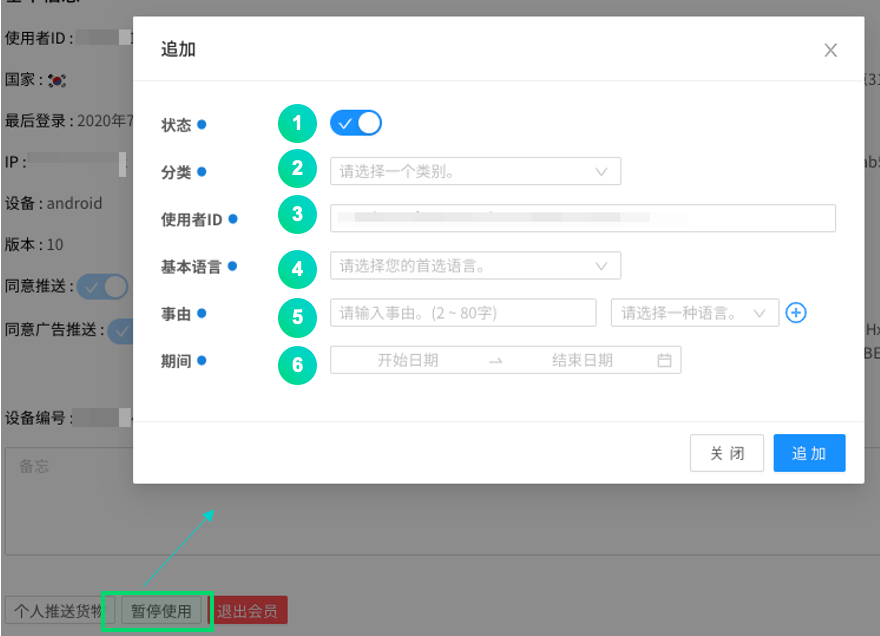
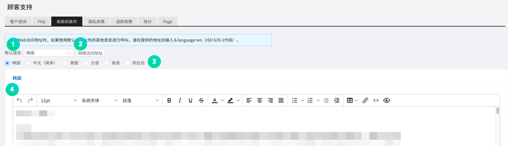
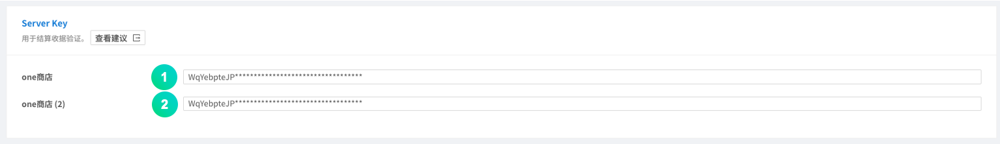

---
search:
  keyword: ["gamepot"]
---

# Dashboard

> ### 这是机器翻译的文档，可能在词汇，语法或语法上有错误。 我们很快会为您提供由专业翻译人员翻译的文档。
>
> #### 如有任何疑问，请[联系我们]（https://www.ncloud.com/support/question）。
>
> 我们将尽一切努力进一步改善我们的服务。

这是 NAVER CLOUD PLATFORM 的 GAMEPOT 提供的仪表板指南。

## GAMEPOT 仪表板介绍

**问 什么是仪表板**

您可以通过仪表板来操作和管理游戏。

**问 仪表板中包含哪些操作功能？**

在仪表板上，可以使用统计信息和会员访问统计信息以及付款确认信息，并且可以通过与 NAVER CLOUD PLATFORM 的服务链接来控制各种功能，例如 PUSH，SMS 和日志分析。 另外，由于它具有游戏所需的自己的操作功能，例如优惠券和更新，因此可以进行更有效的游戏管理。

## GAMEPOT 仪表板入门

### 登录

#### Step 1. 访问仪表板

通过单击 NAVER CLOUD PLATFORM 控制台中的仪表板 URL，访问仪表板。

#### STEP 2. 注册

创建项目时，密码重置电子邮件将发送到注册的管理员帐户。

#### STEP 3. 登录

管理员帐户将成为完全控制仪表板管理的主帐户。

① 设置管理员帐户中使用的密码。

② 选择将成为仪表盘基础的货币。 所选货币用于销售指标，付款统计信息等。 <i>如果您在操作过程中更改基础货币，以前的数据将不会更改。请谨慎选择。</i>

③ 选择要在仪表板上显示的时区。

## 使用仪表板菜单

### 仪表板

在仪表板上，您可以快速查看游戏的整体操作，例如订阅状态，销售，访问和统计信息。

① 您可以通过选择日期来检查图表。

## 统计

### 用户指示器

绘制指定时期内的各种用户指标图。

① 基本上，同一天会打印 30 天的用户指示符，并且可以通过指定时段来自由选择一个时段搜索用户指示符。

② 您可以放大每个图形来查看详细信息。

③ 您可以检查上次更新的时间。

① 您可以以 CSV 文件的形式下载当前显示图形的 RAW 数据。

#### Retention

您可以检查保留数据。 注册后，指示符上将显示[Retention D + 0]，第二天，访问的成员将显示[Retention D + 1]。

### 销售指标

绘制指定时间段内的各种销售指标图。

① 基本上是在同一天打印出 30 天的销售指数，并且可以通过指定期间查询自由选择的时期的销售指数。

② 您可以放大每个图形来查看详细信息。

③ 您可以检查上次更新的时间。

① 您可以以 CSV 文件的形式下载当前显示图形的 RAW 数据。

运作

### 成员

#### - 清单

显示注册会员列表。

① 通过指定会员范围，可以搜索已注册一定时间的会员。

② 您可以通过指定用户 ID 或 IP 搜索特定成员。

③ 您可以以 CSV 文件的形式下载成员列表。

④ 单击用户 ID，以在下面显示详细页面。

① 显示有关该会员的基本信息。

② 显示访问游戏的（登录）历史。

③ 显示游戏中的信息，例如玩家 ID 和等级。

④ 显示游戏中会员的付款明细。

⑤ 显示会员收到的询问及其回复。

⑥ 显示链接到成员的所有社交帐户。

- 您可以添加社交帐户或取消连接。

⑦ 显示会员的停权。

⑧ 显示项目历史记录。

**您可以通过单击发送个人推送**按钮将推送消息发送给特定成员。

① 指定要发送的推送消息的默认语言。

② 输入要发送的信息。

③ 选择要发送的语言。

您可以通过单击**停止**按钮来停止使用特定成员。

① 选择停止状态。

② 选择注册的暂停类别。

③ 输入指定的用户 ID。

④ 选择默认语言作为暂停原因。

⑤ 输入中止原因并指定语言。

⑥ 指定暂停时间。

您可以通过单击**提款**按钮来提款特定成员。

#### - 每日访客

绘制指定时间段内每日访问者的数量。

基本上，它输出同一天 30 天的每日访问者数量，您可以通过指定时间段来自由选择期间搜索每日访问者数量。

① 您可以以 CSV 文件的形式下载当前显示图形的 RAW 数据。

② 您可以检查上次更新的时间。

#### - 新的用户

绘制指定时间段内每天注册游戏的新订户数量。

基本上，它会在同一天打印出 30 天中每天的新订阅者数量，您可以通过指定时间段来查询自由选择的时段中每天的新订阅者数量。

① 您可以以 CSV 文件的形式下载当前显示图形的 RAW 数据。

② 您可以检查上次更新的时间。

#### - 并发用户

您可以同时最多 3 天以 1 分钟为单位查看访问游戏的成员数量。

① 默认指定日期，前一天和前一天，您最多可以选择（更改）3 天进行搜索。 您可以使用重置按钮返回到默认日期。

② 您可以以 CSV 文件的形式下载当前显示图形的 RAW 数据。

③ 您可以检查上次更新的时间。

#### - 停止使用

对于某些成员，我们不允许您在指定时期内访问游戏。

暂停是根据会员的用户 ID 进行的。

① 要应用悬架，请使用添加按钮。

② 您可以通过设置使用暂停类别来注册回复消息模板。

③ 在一段时间内，您可以查询暂停记录。

④ 对于特定的用户 ID，您可以搜索使用暂停。

⑤ 显示暂停的会员详细信息。

- 有效：当应用当前的暂停状态时
- 无效：当当前的暂停状态被取消时

### 付款

#### 付款清单

您可以在 Google Play 商店，APPSTORE，ONE 商店或 Galaxy 商店中查看会员尝试付款的历史记录。

① 仅可以查看失败的历史记录。

② 通过选择一种货币，可以检查每种货币的付款清单。

③ 您可以处理取消付款以成功付款。 取消付款将从销售统计信息中排除。

④ 您可以查询会员尝试付款是否成功。 可以为失败的付款尝试偿还商品。

您可以单击付款状态以查看尝试付款的详细信息，对于失败的付款，可以使用“还款”按钮来还款。

#### - IAP

在应用内购买时，此功能可管理产品信息。 Google Play，App Store，One Store 和 Galaxy Store 等产品必须全部注册。

① 如果单击**添加应用内商品**按钮，则可以通过输入商店，商品名称和商品 ID 来创建付费商品。

② 如果单击**大输入**按钮，则可以立即将应用内商品注册为 CSV 文件。

#### - 统计

该功能可以每天绘制支付金额数据的图形。

① 您可以通过指定商店来查看图形。

② 您可以以 CSV 文件的形式下载当前显示图形的 RAW 数据。

③ 您可以检查上次更新的时间。

#### - 取消付款

与商店中收款收据的状态相比，您可以暂停使用随意取消付款的会员的游戏权限。 如果被暂停的会员重新付款，则该暂停将被停用。 Google Play 商店和 Apple App Store 支持收据验证。

① 设定暂停付款取消的处理条件。

② 您可以以 CSV 文件的形式下载当前显示图形的 RAW 数据。

③ 您可以检查上次更新的时间。

① 用户可以决定是否停止使用取消付款的部分。激活后，它将自动停止按小时间隔设置的选项取消付款的用户。

② 如果会员任意取消付款的总次数大于设定的次数，则暂停使用游戏。

③ 如果会员任意取消付款的产品总价高于设定价格，则游戏将被暂停使用。

④ 当停止使用游戏的会员尝试访问游戏时，请选择显示的指导信息的默认语言。

⑤ 当停止使用游戏的会员尝试访问游戏时，显示此消息。

⑥ 您必须输入 Google API 密钥才能获得 Google 的付款取消列表。您可以使用测试按钮检查功能是否正常运行。

⑦ 要接收 App Store 的付款取消列表，您必须单击“复制地址”按钮以复制 URL 并将其输入 App Store。

### 注意

在仪表板上注册的通知图像会暴露给访问游戏的成员。如果您指定要公开的日程表和商店，则公告将根据条件公开，并且在日程表结束后不会公开。

要使用公告功能，需要 NAVER CLOUD PLATFORM 的 API 身份验证密钥和对象存储服务。使用通告功能时，对象存储成本是单独产生的。

#### Step 0. 创建子帐户并授予使用对象存储服务的权限

① 在接收到 API 认证密钥之前，建议创建一个子帐户来授予对象存储权限，然后通过该帐户发布 API 认证密钥。

② [Sub Account 使用指南](https://docs.ncloud.com/ko/management/management-4-1.html)创建一个带有参考的子帐户。 （创建子帐户时，请检查**API 网关访问权限**。）

③ 将对象存储服务权限授予创建的子帐户。[System Managed 政策手册](https://docs.ncloud.com/ko/management/management-4-2.html)作为参考，将**NCP_OBJECT_STORAGE_MANAGER**权限授予相应的子帐户。 （或者，包括对象存储权限）

③ 访问 Sunghan 子帐户后，将发出 API 身份验证密钥。

#### 步骤 1.准备 API 身份验证密钥

注意菜单与通过 API 的对象存储结合使用。 因此，必须预先准备 NAVER CLOUD PLATFORM 的 API 身份验证密钥。

可以在**门户>我的页面>帐户管理>身份验证密钥管理**菜单中创建 API 身份验证密钥。

① 要创建 API 身份验证密钥，请点击**创建新的 API 身份验证密钥**。

-每个帐户最多可以创建两个 API 身份验证密钥。

#### Step 2. 仪表板和 API 身份验证密钥的集成

您需要将发布的身份验证密钥与仪表板互锁，以创建对象存储桶并使用公告功能。 转到信息中心上的**项目设置> Ncloud**菜单，然后连接 API 身份验证密钥。

连接 API 身份验证密钥后，将自动创建对象存储桶。 公告中使用的所有图像均存储在存储桶中。

#### 步骤 3.添加公告

要添加公告，请转到**公告**菜单。

① 您可以通过“添加通知”按钮添加图像。

② 您可以指定要向用户显示的图像顺序。

然后，当出现以下弹出菜单时，输入所需的值，然后单击**保存**按钮以添加通知。

① 选择是否激活通知。

② 指定要公开的通知的开始日期和结束日期。

③ 根据所选商店的类别，可以将通知发布给所有商店中的相应应用程序，或者仅将通知暴露给通过特定商店访问游戏的用户。

④ 当用户触摸暴露的通知图像时，URL 移至外部浏览器，并且 SCHEME 使用回调函数返回该值。

⑤ 在根据每种语言设置要显示的通知图像中，指定默认语言。

⑥ 您可以拖放要显示的通知图像或直接选择文件。

根据语言设置，可以注册要曝光的其他图像。

### 检查更新

通过使用检查和更新功能，您可以更轻松，方便地管理游戏。

#### - 检查

在游戏检查期间，游戏会自动显示一条检查消息，以阻止游戏。

输入检查时间和消息并保存后，将显示游戏中的检查通知。

① 您可以指定一家商店。 如果是完整支票，请指定为完整商店。

② 指定检查的开始时间和结束时间。

③ 在要根据设备语言设置而不同显示的检查消息中，指定默认语言。

④ 您可以另外注册消息，以针对每种语言设置以不同的方式显示。

⑤ 对于 URL，请输入在检查过程中单击“查看详细信息”时要移动的地址。

**例如：咖啡厅公告或自制检查指南页面**

#### - 更新

如果不是最新版本，它将显示更新说明，并转到商店（例如 Google Play 或 Apple Store）的更新屏幕。

① 为每个商店设置。

② 选择是否激活该功能。

③ 如果选择**强制**，则必须先从商店进行更新，然后才能使用游戏；如果选择**推荐**，则无需从商店进行更新就可以使用游戏。

④ 输入版本信息。如果它不同于或低于输入的版本，则功能运行。

⑤ 输入选择更新按钮时要访问的 URL。

- 自定义 URL 输入：当在客户端更新弹出窗口中选择了更新按钮时，移至自定义 URL 设置
- 未输入自定义 URL：如果在客户端更新弹出窗口中选择了更新按钮，它将进入默认存储。

### 메시지

它是一项服务，可以通过 SMS，PUSH 等实现消息通知功能，而无需构建单独的消息服务器。 要使用此功能，您必须申请 NAVER Cloud Plaform 的简易通知服务（SENS）。

① 建议创建子账户并申请 SENS 服务。 通过参考文本中的**注意->Step 0**创建子帐户。 （与**Step 0**一样，请从子帐户获取 API 身份验证密钥。）

② 将 SENS 服务权限授予创建的子帐户。 请参阅[系统托管策略指南](https://docs.ncloud.com/ko/management/management-4-2.html)并向子帐户授予**NCP_SENS_MANAGER**（包括）权限 。

① 为了与 SENS 互通，必须发出服务密钥。 **单击发行服务密钥**按钮，访问创建的子帐户，然后参考[SENS 通用指南](https://docs.ncloud.com/ko/sens/sens-1-2.html) 获取服务密钥。

② 单击**证书注册指南**按钮，根据**SENS Web 控制台用户指南**注册证书。

③ 单击**设置**按钮，移至下面的屏幕，然后输入 PUSH 服务 ID 值。

#### - 推送消息

**消息>推送消息**单击菜单以显示列表屏幕，您可以在其中检查装运状态，预订时间和交货时间。

如果单击**推送消息**菜单中的**添加消息**按钮，将显示以下弹出窗口。 您可以通过相应的弹出菜单发送消息。

① 您可以指定推送消息的传输时间表。 （立即交付/预约交付/预约交付（全球当地时间））

② 通过指定平台，只有指定的平台用户才能接收推送。

③ 根据设备的语言设置，在要发送的推送消息中指定默认语言。

④ 您可以根据需要输入标题。 如果未输入，则将应用名称显示为标题。

⑤ 根据设备的语言设置，可以注册不同的推送消息。

您可以通过上传 CSV 文件来发送大量推送消息。

- 通过批量输入最多可以注册 100 次推送（CSV 文件的最大容量为 20 MB）
- 下载并设置 CSV 样本，然后单击“注册 CSV 文件”进行注册。
- 请以 UTF-8 格式保存并注册 CSV 文件。
- 大量输入不支持立即推送。

#### - 文字按摩

您可以使用诸如发送 SMS / LMS，查询历史记录和结果之类的功能。 要发送 SMS / LMS，首先，在 NAVER CLOUD PLATFORM 的 SENS 中需要发布服务密钥和呼叫号码。

① 为了与 SENS 互通，必须首先发出服务密钥并注册一个呼叫号码。 **单击发布服务密钥**按钮，[SENS 通用指南](https://docs.ncloud.com/ko/sens/sens-1-1.html)和[SENS SMS 用户指南](https://docs.ncloud.com/ko/sens/sens-1-3.html)以注册服务密钥发布和呼叫号码。

② 单击**设置**按钮，然后输入服务 ID 和密钥。

点击**添加消息**按钮。显示以下弹出窗口。

① 短信，LMS 短信。价格根据消息而有所不同。

② 在 Naver Cloud 控制台上输入注册的呼叫号码（不会发送未注册的号码。）

③ 您可以输入要通过 SMS 或 LMS 发送的号码。

④ 如果 SMS，LMS 接收号码/优惠券随机数等较大，则可以将其配置为 CSV 文件，并可以下载示例文件。

⑤ 如果 SMS，LMS 接收号码/优惠券随机号码等数量较大，则可以使用 CSV 文件上传。上载的 SMS，LMS 接收号码和优惠券随机数与 ⑥ 消息内容中的指定项目匹配，并自动输入并发送到 SMS 和 LMS。

⑥ 输入要通过 SMS 或 LMS 发送的消息的内容。

⑦ 如果您指定了预约时间，则会在指定时间发送信息。

### 优惠券

游戏中必不可少的优惠券功能支持常规优惠券和关键字优惠券。

#### - 普通优惠券

普通优惠券是通常以代码形式的优惠券。 此功能使您可以轻松创建和管理要在游戏中使用的优惠券。 如果单击 **+创建优惠券**，则会显示以下弹出窗口，您可以通过它创建优惠券。

① 指定使用期限，以使优惠券不能在该期限之外使用。

② 可以制作的优惠券数量有限，具体取决于优惠券的长度。 您可以在 8 到 10 之间创建。

③ 如果指定前缀（前缀）或后缀（前缀），则在创建优惠券编号时会添加指定的短语。

④ 可以创建优惠券的最大数量，创建后可以增加。 （优惠券的最大数量为 500,000。）

⑤ 使用优惠券时，您可以指定要支付的项目和项目数。 可以通过+按钮支付多项费用。

优惠券创建完成后，将显示创建的优惠券的列表，如下所示。

您可以检查优惠券的当前状态和使用限制数量。

您可以更改在列表中创建的优惠券数量，因此可以轻松地增加优惠券数量。

① 如果单击列表前面的蓝色图标，则会弹出用于添加优惠券的弹出窗口。

② 您可以查看优惠券使用统计。

#### - 关键字优惠券

此功能可以创建指定的关键字，例如“圣诞节”，“公开活动”和“新年”，并在优惠券窗口中输入关键字时付款。 由于最近复杂的优惠券代码输入，经常使用关键字优惠券来方便游戏用户。

点击 **+创建优惠券**。

① 指定可使用优惠券的期限。

② 输入关键字以支付优惠券。

③ 可以在不超过限定数量的范围内付款。

④ 使用优惠券时，您可以指定要支付的项目和项目数。 可以通过+按钮支付多项费用。

#### - 使用记录

您可以查看所有已发行的优惠券编号。

① 仅可以查看失败的历史记录。

② 通过指定期间，优惠券编号和用户 ID，可以搜索优惠券的使用。

③ 您可以检查优惠券是否已发行。

- 成功：优惠券使用完成
- 未使用：未使用的优惠券

### 客户支持

当客户在游戏中进行查询时，可以查看并回答此功能。 如果您可以在游戏内客户支持窗口中输入基本信息，则还可以在 GAMEPOT 中检查该信息。

#### 客户查询

您可以检查客户查询的历史记录。
仅当客户在查询结束后选择满意时，才会显示答案满意。

点击**会员 ID**。

> 仅当您设置项目设置> NCloud> Papago 值时，才会显示客户查询的翻译功能。 可以在“编辑会员信息”中设置默认翻译语言，自动语言检测和自动翻译功能。

① 您可以指定一名负责人。 如果您指定联系人，则该联系人以外的用户将无法回答您的询问。

② 查询标题可以翻译。 它将从检测到的语言翻译为默认翻译语言。

③ 您可以翻译书面答案。 仅列出 Papago 支持的语言。

④ 您可以上传答案所需的图像文件。

⑤ 查询历史可以翻译。 它将从检测到的语言翻译为默认翻译语言。

⑥ 基本上，将显示有关该成员的所有信息。

**\[通知设置\]**

此功能是在响应客户时向客户发送推送和邮件的功能。

① 如果检查是否已使用，则推送通知功能被激活。

② 在根据设备语言设置不同显示的推送消息中指定默认语言。

③ 这是一则推送消息，根据设备语言设置而有所不同。

④ 如果检查是否已使用，则电子邮件通知功能被激活。

⑤ 输入外发电子邮件地址。

⑥ 输入外发电子邮件名称。

⑦ 输入电子邮件标题。 如果未输入，它将作为默认短语发送。

⑧ 输入电子邮件的页脚。 如果未输入，它将作为默认短语发送。

⑨ 您可以预览要发送的邮件模板。

**[分类设置]**

该功能是预先设置客户查询模板。

点击**分类设置**。

使用**添加分类**，您可以添加和管理用于客户查询的分类名称。

① 检查状态以激活类别名称。

② 在客户查询的类别名称中指定了默认语言，该默认语言根据设备语言设置而有所不同。

③ 根据设备语言设置，可以指定不同的分类名称和模板。

④ 输入指定语言的类别名称和该类别中客户查询的模板。

**[外部连接设置]**

未使用外部访问权限登录的用户也可以进行查询。 答案将通过电子邮件发送。

如果单击**外部连接设置**，则外部查询的 URL 将保存在剪贴板上。

#### - FAQ

常见问题可以进行注册和检查。

点击**添加**。

① 如果检查状态，则可以激活并检查相应的问题。

② 您可以选择常见问题的类别名称。

③ 在 FAQ 项（根据设备语言设置的不同而有所不同）中，指定默认语言。

④ 根据设备语言设置，可以注册不同的问题和答案。

⑤ 输入您的问题和答案。

**[分类设置]**

这是设置常见问题解答分类的功能。

点击**分类设置**。

使用**添加分类**，您可以添加和管理用于客户查询的分类名称。

① 检查状态以激活类别名称。

② 在 FAQ 分类名称中指定默认语言，该默认语言根据设备语言设置而有所不同。

③ 根据设备语言设置，可以指定不同的 FAQ 分类名称。

④ 输入指定语言的分类名称。

#### - 使用条款

您可以输入内部条款和条件。 可以通过 SDK 向用户公开这些内容。

① 根据使用条款指定默认语言，根据使用的设备语言设置，默认语言会有所不同。

② 您可以在网页上查看条款和条件。 单击后，URL 被复制。 要使用其他语言进行连接，请在 URL 后面添加<b> <i>＆language=zh_CN </i>（请参见 ISO 639-1 代码）</b>。

③ 您可以为每种设备语言设置输入不同的条款和条件。

④ 输入指定语言的使用条款。

#### - 隐私权政策设定

您可以输入公司的个人信息处理政策的内容。 可以通过 SDK 向用户公开这些内容。

① 在隐私策略的内容中指定默认语言，这些默认语言根据设备语言设置而有所不同。

② 您可以在网页上查看隐私政策。 单击后，URL 被复制。 要使用其他语言进行连接，请在 URL 后面添加<b> <i>＆language=zh_CN </i>（请参见 ISO 639-1 代码）</b>。

③ 您可以为每种设备语言设置输入不同的隐私策略。

④ 输入指定语言的隐私政策的详细信息。

#### - 退款政策设定

您可以输入内部退款政策。 可以通过 SDK 向用户公开这些内容。

① 在退款政策内容中指定默认语言，该默认语言根据设备语言设置而有所不同。

② 您可以在网页上查看退款政策。 单击后，URL 被复制。 要使用其他语言进行连接，请在 URL 后面添加<b> <i>＆language=zh_CN </i>（请参见 ISO 639-1 代码）</b>。

③ 您可以为每种设备语言设置输入不同的退款政策。

④ 输入指定语言的退款政策的详细信息。

#### - 统计

您可以查看一段时间内的客户查询统计信息。

#### - 页

此功能创建一个 Web 文档并提供一个连接地址。

① 您可以创建和编辑网页。

② 输入指定语言的页面内容。

## 游戏

### 播放器

游戏中角色信息可以通过 SDK 传输并在仪表板上检查。

### 礼品

物品可以通过 webhooks 发送到游戏服务器。

点击**发送礼物**按钮。

① 如果选中，则测试不会发送到实际的游戏服务器。

② 选择目标。

③ 可以输入目标 ID。

④ 发送项目时，输入作为 UserData 值发送的数据。

⑤ 您可以输入要显示的标题。

⑥ 您可以输入要显示的描述。

⑦ 指定要运送的物品和数量。

#### - 项目

在项目菜单中，您可以创建可以通过优惠券获得的优惠券项目。 您可以通过单击**添加项目**按钮添加项目。

① 您可以添加项目。

② 单击**大输入**按钮立即将项目注册为 CSV 文件。

① 输入项目名称。

② 输入项目 ID。 每个商品的商品 ID 必须唯一。

### 提前预订

预先预约功能是通过预先预约网页显示注册用户的统计的功能。

① 可以添加预定。 保留名称用作统计信息计算的 ID。

② 您可以编辑预约名称。

③ 可以下载提前预约的申请者。

将来，我们将添加一些功能，使批量短信发送功能可以提前预订。

## 设置

### 远程配置

远程配置功能允许您更改应用程序的行为和外观，而无需更新应用程序。 您可以将参数添加到服务器并从 GAMEPOT SDK 加载值以供使用。 因此，如果要控制服务器上游戏中的功能，则可以使用此功能轻松地应用和控制它们。

点击**添加**按钮。 显示以下弹出窗口时，输入参数和值。

反映相应参数和值的时间由运行新应用程序的用户反映。

### 项目设置

#### - 正常

您可以设置应用程序的整体环境并输入各种键值来操作应用程序。

##### 基本信息

① 请写下游戏名称。

② 您可以选择应用程序类型。

③ 您可以选择一个类别。

④ 可以输入项目说明。

⑤ 您可以输入大麻。

⑥ 可以选择语言。

⑦ 您可以更改基础货币。

- 即使在操作过程中更改了基础货币，过去的付款金额也不会更改。 请仔细选择。

##### Public Key

此项设置为链接到 Google Store 和 One Store。

① 输入 Google Store 公钥值。

② 如果您从 Google Store 发行了两个版本的同一游戏（例如 12 和 18），则将程序包名称放在前面，并将公钥值放在后面。

③ 输入“一个商店的公共密钥”值。

④ 在同一家商店中发行两个版本的同一游戏时（例如 12 和 18），将程序包名称放在前面，并将公钥值放在后面。

##### Google API Key

Google API 集成（Google Store 付款取消者列表检查和最新版本的付款收据验证）需要此设置。

① 输入 Google 提供的 JSON 数据。 请参考“查看帮助”。

② 这是付款收据验证版本。 如果您在项目 1 中输入数据，请选择“版本 3”。

③ 您可以检查 Google 收据验证测试输入的 Google JSON 值是否正确。

① 输入 Google 收据的包裹名称。

② 输入 Google 收据的产品名称。

③ 输入 Google 收据的购买令牌。

④ 您可以检查 Google 收据查询的结果。

##### App ID

这是通过强制更新移动商店时所需的设置项。您可以通过单击查看帮助来检查如何获取 ID。在第一个输入字段中，输入一个值以标识版本，在第二个输入字段中，输入一个值以发送到商店。

① 输入 Google Store 包装名称。

② 如果您发布两个版本的同一个游戏，请输入 Google Store 软件包的名称（例如 12 岁，18 岁的版本）。

③ 输入 One Store 的包裹名称和 PID。

④ 如果您发布两个版本的同一游戏，请输入一个商店包装名称和 PID。

⑤ 输入 Galaxy Store 的包裹名称。

⑥ 如果您发布两个版本的同一游戏，请另外输入 Galaxy Store 软件包的名称。

⑦ 输入 Apple Store 捆绑包 ID 和 Apple ID。

⑧ 如果您发布两个版本的同一游戏，请另外输入 Apple Store 的捆绑软件 ID 和 Apple ID。

##### Server Key

这是必须预先设置的信息，以便进行应用内付款并向 One Store 请求商品付款。

① 输入原始商店的许可证密钥。

② 如果要启动两个版本，请输入不同版本的许可证密钥（如果不是，则无需输入。）

##### Auth Key

验证密钥项在登录 Google 或 Facebook 时用于令牌验证，如果令牌验证失败，则将限制游戏用户的登录。 登录受限的游戏用户会自动在暂停菜单中注册。

① 输入 Google 的客户 ID 值。

② 输入 Facebook App ID 值。

③ 输入 Facebook App 密钥值。

④ 输入 Apple 私钥。

⑤ 输入您的 Apple KEY ID。

⑥ 输入您的 Apple TEAM ID。

##### WebHook

在 WebHook 项中，付款项输入地址，以在成功付款后请求付款。

优惠券项目是指使用 SDK 成功使用优惠券后，从 SDK 服务器向开发者服务器请求成功处理（商品支付）的地址，即用于实际服务（服务）的地址和服务中需要测试环境的地址。提供（测试用户）。要使其用作测试用户地址，必须将其添加到“项目设置>测试用户”。

① 您可以检查帮助。

②WebHook 应用程序可以简单地进行测试。

③ 显示通过网络挂钩调用游戏服务器时应允许的 IP 列表。

④ 输入付款项目服务的 URL。

⑤ 输入付款项目的测试用户的 URL。

⑥ 输入优惠券项目服务的 URL。

⑦ 输入优惠券项目的测试用户的 URL。

#### - Ncloud

您还可以更改与 Naver Cloud 平台互通的键值。 有关详细用法，请参阅各项的用户指南。

#### - CDN

如果您想使用 CDN，请在下面输入 CDN 地址。

**输入 CDN 地址时的注意事项**

- 原始 CDN 必须具有用于\[通知\]功能的对象存储。
- 如果没有输入 CDN，或者 URL 不正确或原始设置不正确，则上传的图像将无法在游戏中正常显示。

#### - -外部付款

对于“一个商店”，允许使用第三方付款模块，而不是默认商店付款模块。

支持 PG 的公司会持续数天，并将不断增加。

**\[设置\]**

通过 Danal 获取每种付款方式所需的值，然后在 One Store 控制台中为**Store Secret key**输入**Client Secret**值。

#### - 白色用户

使用注册的 IP 连接时，将根据指定的类型激活以下功能。

- 开发：SDK 日志已激活，并且日志已公开。
- 付款/优惠券：使用付款和优惠券时，将调用设置为 Webhook 测试的地址。
- 检查：即使检查功能被激活，也会被忽略并继续。
- Update：即使激活了更新功能，也将忽略。
- 成员资格：忽略访问块中包含的国家或 IP，然后继续。

点击**添加**按钮。 显示以下弹出窗口时，输入参数和值。

#### - 块连接

阻止用户访问注册的 IP 和国家/地区代码。

点击**添加**按钮。 显示以下弹出窗口时，输入参数和值。

① 检查状态将激活连接阻止。

② 指定要断开的输入值的类型。

③ 输入要断开的对象。

④ 对于根据阻止目标的设备语言设置而不同显示的消息，请指定默认语言。

⑤ 根据设备语言设置，可以注册不同的消息。

#### - API Key

此菜单用于管理用于身份验证的密钥以使用 Open API。
单击[+ Add]按钮生成密钥，并且在调用 Open API 时，应将生成的密钥值作为 x-api-key 值放在标题中。
如果单击钓鱼键，则可以进入编辑菜单，编辑键状态，键到期日期，说明等，或删除键。

## 其他

### Job 管理

您可以从每个菜单下载为一个月导出到 csv 的结果。

### 记录

日志功能可以通过链接 NAVER CLOUD PLATFORM 的 ELSA 来收集游戏日志或崩溃日志。 有关如何使用 ELSA 的信息，请参阅[ELSA 用户指南](https://docs.ncloud.com/ko/elsa/elsa-1-1.html)。

### 用户指南

转到“ GAMEPOT 仪表板用户指南”页面。

### 改变语言

仪表板上的每个菜单等都将更改为所选语言。

### 会员信息修改

您可以使用仪表板更改帐户的名称和密码。

单击仪表板右上方的图标，从出现的下拉菜单中选择编辑成员信息。

① 您可以更改用户名。

② 设置仪表板的时区。

③ 使用客户查询翻译时，选择要翻译并到达的语言。

④ 设置在使用客户查询的翻译时是否自动检测查询历史的语言。

⑤ 设置在使用客户查询翻译时是否自动翻译查询历史的语言。

⑥ 您可以更改密码。

### 优先

用户管理，角色管理和用于 Gamepot 仪表板管理的更新功能。

#### - 用户

您可以通过菜单添加/删除用户，以管理可以使用仪表板的用户。

① 检查状态将激活用户。

点击**注册**按钮。如果显示以下弹出窗口，请输入相应的值。

① 要注册的用户 ID。只能使用电子邮件格式。

② 要注册的用户名。

③ 用户密码进行注册。

④ 将时区设置为用户仪表板的基础。

⑤ 使用客户支持翻译功能时，选择要翻译和到达的语言。

⑥ 使用客户支持翻译功能时，选择是否将自动检测查询历史的语言。

⑦ 如果使用客户支持翻译功能，请选择是否自动翻译查询内容。

#### - 角色

此功能用于管理可以按组使用仪表板的用户，并且可以为每个角色赋予不同的特权。

点击**齿轮**按钮。 在下面的屏幕中，您可以设置角色。

① 放置要包含在角色中的用户。

② 将用户包括在基本角色中。 对于默认角色，您拥有完全控制权。

③ 选择该角色允许的功能。

#### - 更新

您可以检查游戏吊舱系统的更新历史记录。

