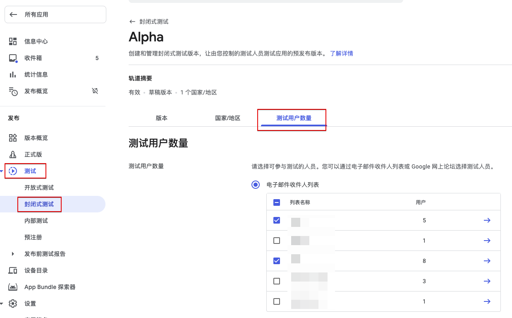
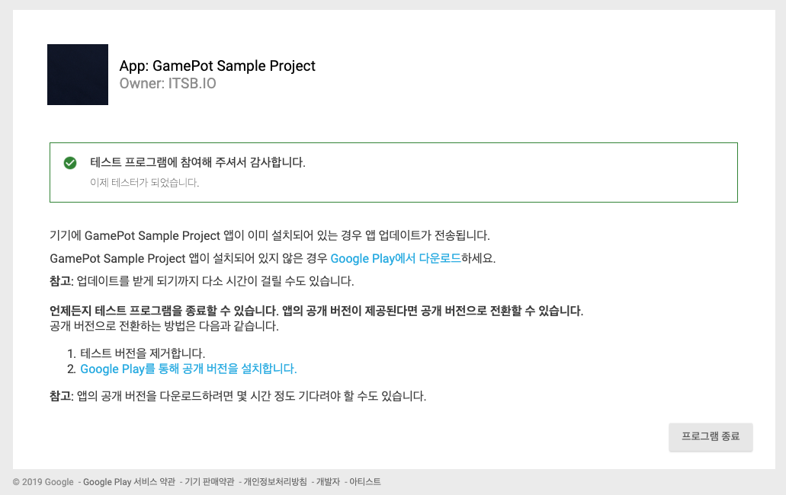
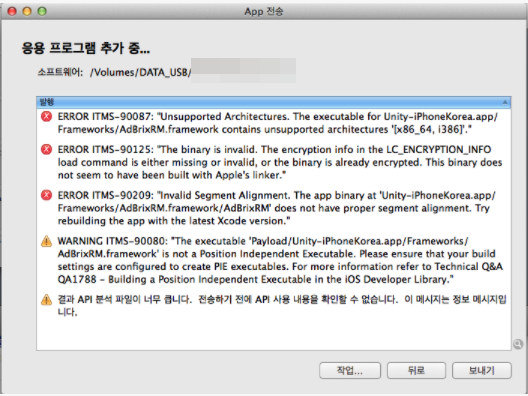

# FAQ

> ### 这是机器翻译的文档，可能在词汇，语法或语法上有错误。 我们很快会为您提供由专业翻译人员翻译的文档。
>
> #### 如有任何疑问，请[联系我们](https://www.ncloud.com/support/question)。
>
> 我们将尽一切努力进一步改善我们的服务。

## 我无法登录！

> 对于社交登录功能，它基本上是基于平台的开发指南。 如有问题，请先查看平台的登录开发指南。

### 1. Google 登录

#### 1-1)

    ＃ Q. 如果您尝试登录，将立即返回登录取消。 （AOS，iOS）
    ＃ A. 这是由于未正确设置所需的环境而发生的现象。

1. 检查项目通常是否包含 google-service.json 文件（Firebase 配置文件）。

2. （AOS）检查在构建 APK 时使用的密钥库的 SHA-1 值是否已添加到 Firebase 控制台。

   > 向开发者请求 SHA-1 值。

3. 检查在 Firebase 控制台中是否正确设置了项目。

   - 检查内容所适用的内部版本是否正确

     1. 是否使用控制台上设置的程序包名称（AOS）/捆绑包 ID（iOS）构建的。

     2. AOS）是否使用提取的密钥库构建了 SHA-1

   - 确保已在 Firbase Conosole 中设置了支持电子邮件

    - （AOS）在 Google 控制台中使用“应用签名”时，您还必须添加在控制台中创建的 SHA-1 值。

4. 如果仍然检查上述所有检查，请尝试将支持电子邮件更改为另一封电子邮件。

   > 间歇性地设置第一封支持电子邮件时，它有时可以正常工作。 在这种情况下，更改为其他电子邮件可以解决所有上述问题。

#### 1-2)

    # Q. 直接安装APK时，您已经登录，但是下载并登录上传到商店的应用程序时，您没有登录。 （AOS）
    # A. 这是通过使用Google Developer Console中的“应用签名”功能来完成的。

从控制台上传 APK 时，如果激活了“应用签名”，则密钥库将替换为控制台管理的密钥，这要求将控制台管理的密钥库的 sha-1 值添加到 Firebase 控制台。

> 如果此时使用 Facebook 登录名，则还必须将新密钥库的 keyhash 值添加到 Facebook 开发人员控制台。

#### 1-3)

    # Q. 在iOS上登录Google时出现错误\（401错误：Disabled \ _client \）。 （iOS）
    # A. 这可能会导致问题，因为在Firebase控制台设置中未设置支持电子邮件。

请设置支持电子邮件并进行检查。

#### 1-4)

    # Q. 在iOS上登录Google时会出现弹出窗口，但弹出窗口会显示游戏名称以外的其他值。 （iOS）
    # A. 更改Xcode >> Targets >> build Settings >> Product Name的值。

### 2. Facebook 로그인

    # Q. 在智能手机上安装Facebook应用程序后，您将无法正常登录。 （AOS，iOS）
    # A. Facebook Developer Console的首选项可能不正确，从而导致问题。

将构建 APK 时使用的密钥库的密钥哈希值添加到 Facebook 控制台。

- 在 Google 控制台中使用“应用程序签名”功能时，您还必须添加由 Google 控制台管理的密钥库的密钥哈希值。

  

### 3. APPLE 登录

    # Q. 当我尝试登录APPLE时，发生错误。 （iOS）
    # A. 这是由于未正确设置所需的环境而发生的现象。

1.  确保您已添加 Xcode >>目标>>签名和功能>> +功能>>使用 Apple 登录

2.  检查是否已将 LocalAuthentication.framework，AuthenticationService.framework 添加到 Xcode >>目标>>构建阶段>>将二进制文件与库链接
    （如果目标版本是 iOS 13 或更低版本，则 AuthenticationService.framework 设置为可选）

### 4. Naver 登录

#### 4-1)

    # Q. 登录Naver时发生错误。 （AOS，iOS）
    # A.  NAVER开发人员控制台的环境设置与构建设置不同。

确保 NAVER 开发人员应用程序设置和生成设置匹配。

#### 4-2)

**_`仅在将Naver Cafe SDK链接在一起时适用。`_**

    # Q. 与NaverCaféSDK链接时，您无法通过Web视图登录Nearo（使用Naver ID登录）。 （iOS）
    # A. 当Nearo SDK和Cafe SDK的登录模块共存时，会出现此问题。

1. 请下载该修补程序的链接。 \([Download](https://kr.object.ncloudstorage.com/itsb/patch/Patch_GamePotNaverLogin_20200508.zip)\)

2. 删除项目中的两个现有框架。

   - GamePotNaver.framework
   - NaverThirdPartyLogin.framework (존재할 경우)

3. 请将下载的补丁（GamePotNaver.framework）放在相同的路径中。

由于 IOS UIWebview 问题，请使用 Naver Cafe SDK 4.4.7 或更高版本。

4. (UNITY ONLY) 在 Naver Cafe 初始化阶段，将显式插入 url 方案。

   ../Assets/NCSDK/Plugins/iOS/NCSDKUnityManager.mm

5. 请首先在 info.plist 中修改 URL Scheme 值的优先级。 \([Link](https://docs.gamepot.io/undefined/gamepot_troubleshooting#unity-sdk-ios)\)

### 5. Line 登录

    # Q. 登录到该行时，将发生错误\（400错误：Bad \ _Request \）。 （AOS，iOS）
    # A. LINE Developers Console的配置错误可能会导致问题。

检查 Line Developer Console 的设置是否正确。

### 6. Twitter 登录

    # Q. 登录Twitter时发生错误（错误代码1011）。 （AOS，iOS）
    # A. 由于Twitter开发人员控制台中的设置不正确，可能会出现问题。

由于 Twitter 开发人员控制台中的设置不正确，可能会出现问题。

1. 请确保启用“使用 Twitter 登录”。

2. 检查回调 URL 设置是否正确。
   - 第一行（使用 AOS） : twittersdk://
   - 第 2 行（使用 iOS） : twitterkit-{twitter_consumerkey}://

## 我不能付款！

### 1. 共同

#### 1-1)

    # Q. “productid was wrong！” 这句话是暴露的。
    # A. GAMEPOT仪表板->付款->将商店的产品ID添加到IAP。

#### 1-2)

    # Q. 没有响应第一次付款尝试，并且第二次付款尝试成功。 （Play商店，ONEStore）
    # A. 仪表板-项目设置-常规-公共密钥不正确。

请输入参考`查看帮助`中内容的密钥。

### 2. Google Play Store

#### 2-1)

    # Q. Google付款弹出窗口已公开，但付款无法进行。
    # A. 如果Google付款环境设置不正确，就会发生这种情况。 请一一检查以下项目。

1. 控制台>应用程序信息>检查应用程序内产品是否设置为`活动APK`

2. 确保应用程序在控制台上处于`已发布`状态

   > 将其放在`私人`和`内部测试`轨道上，而不是在`生产`轨道上。

3. 控制台>版本管理>应用程序版本>曲目>管理>确保已在“测试目标管理”中注册了测试帐户

4. 通过访问测试参加 URL 来检查您是否申请了测试参加

5. 确保已在控制台>设置中将测试帐户添加到`许可证测试`中

6. 确保删除除终端>设置>帐户菜单中经过测试的帐户以外的所有帐户。

### 3. ONEStore

#### 3-1)

    # Q. 出现“从异常应用程序请求付款”这一短语。
    # A. 在打开应用程序之前，只能访问测试帐户。 请在下面检查。

1. 请确保您的测试帐户已注册。

2. 确保安装在设备上的 One Store 应用程序使用在步骤 1 中注册的测试帐户登录。

#### 3-2)

    # Q. 付款时 \[package\] doesn't exist or wrong secret. 这句话是暴露的。
    # A. 请仔细检查一个商店的键值是否已应用于GAMEPOT仪表板。

1. APK 的软件包名称是否与在 One Store 中注册的软件包名称相同

2. 是否应用一个商店控制台的`许可证密钥`

> 该值是否已应用于 GAMEPOT 仪表盘下方的项目

3. 是否应用一个商店控制台的`客户机密`

> 该值是否已应用于 GAMEPOT 仪表板中的以下项目

#### 3-3)

    # Q. 付款完成后，付款失败并显示短语“查询结果不存在。（9001）”。
    # A. 在真实情况/测试环境中出现差异时，可能会出现问题，要求从One Store验证收据。

**A-1. 沙盒环境中一个商店付款屏幕**

- Gamepot 仪表板-项目设置-在测试用户菜单中检查 IP 是否已`注册`为`付款/优惠券`。

- Gamepot 仪表板-项目设置-检查 Webhook 项中的`付款项（测试用户）`地址是否已`注册`。

**A-2. 当单店付款屏幕处于生产环境中时**

- Gamepot 仪表板-项目设置-在测试用户菜单中，通过`付款/优惠券`检查 IP 是`未使用`还是`未注册`。

- Gamepot 仪表板-项目设置-检查地址是否在 Webhook 项的`付款项（服务）`中已`注册`。

## Adbrix Remaster

    # Q. 应用Adbrix Remaster后构建IOS时发生崩溃。
    # A. Adbrix Remaster是在Swift中实现的库，应用Swift库时需要其他设置。

请在 XCode 中进行如下设置后构建。

如果版本相同，请在干净的版本后检查。

#### Q. 应用 Adbrix Remaster 后，上传 AppStore 时会发生错误。

#### A. 这是 Adbrix Remaster 库包含 x86_64 和 i386 体系结构的问题。 采取以下措施后，重建后请再次检查。

转到控制台（终端）中的 AdBrixRM.framework 文件位置，然后输入以下两个命令 lipo -remove x86_64 ./AdBrixRM.framework/AdBrixRM -o ./AdBrixRM.framework/AdBrixRM lipo -remove i386 ./AdBrixRM.framework/AdBrixRM -o ./AdBrixRM.framework/AdBrixRM

## Naver Cafe

    # Q. iOS Naver Cafe用英语显示。
    # A. 请将XCode >>目标>>信息>>本地化本地开发区域更改为韩国。

## 服务启动

    # Q. 该服务将在iOS平台上启动。
    # A. 对于iOS App Store，检查该应用程序大约需要1到2周，因此您需要留出大约2周的时间，然后申请将其转移到Real Zone仪表板以顺利进行。

## 推

    # Q. 我无法在iOS上收到推送。
    # A. 请一一检查以下说明中的零件。

**1. 请检查 iOS 证书是否已在 NCloud SENS 设置的“认证”中注册。**

iOS 需要根据构建时使用的配置文件的类型来注册不同的证书。

- Developement Provisioning >> Push Development 证书注册类型设置为“沙箱”
- Adhoc / Distribution Provisioning >> Push Distribution 证书注册类型设置为生产

**2. 注册证书后，请检查客户端是否已登录。**

登录完成后，Gamepot 将推送令牌传递到服务器。

因此，如果您已注册证书，请从客户端登录后继续。

**3. 请确保您的应用程序位于 Forground 中。**

对于 iOS，当应用程序处于前台时，不会收到推送。

按下主屏幕按钮，然后检查是否在主屏幕上收到了推送。

**4. 在 Xcode 中进行构建时，请检查功能中是否包含推送通知。**

在 Xcode 中构建时，功能必须包括推送通知。 如果您收不到它，请检查此部分是否未包含在内部版本中。

## 应用签名

    # Q. 我直接安装了APK，但是社交登录是正常的，但是如果我从商店下载并进行社交登录，则无法登录。
    # A. 这是因为在Google Developer Console中启用了应用签名而更改了密钥库的情况。

以下屏幕显示在 Google Developer Console 的`开发人员管理`->`应用签名`菜单中。

如果您使用的是 Google 登录名，请在 Firebase 控制台中添加`SHA-1`值，

如果您使用的是 Facebook 登录名，请将上面的`SHA-1`的`keyhash`值添加到 Facebook 控制台。

## Casebook

### - Dashboard

#### 1. 未收到推送消息时

    1. 仪表盘>>项目设置>>检查ncloud API身份验证密钥的AccessKey，秘密密钥，SENS-PUSH和SENS-SMS值。
    2. 检查是否已为相应的身份验证密钥设置了SENS项目的证书。

#### 2. 用户指标保留计算方法

在第一天创建帐户后，第二天访问的用户将被视为新用户。 （这是为了消除通过广告和其他路线产生的假想流量。）

     例）
      根据下表图片中的2020-01-07标准，
      在2020-01-07的新用户中，有5个人在01/08/20访问。
      在这一天（2020-01-07），将评判5位新用户。 （与第1天的值相同。）
      根据人数，它显示第2天（第二天2020-01-09）/第3天/第4天的访问权限的状态。
      在5个用户中，有一个部分的中间部分下降为0％，因为该部分在n天计算。

#### 3. 停用会员的暂停服务时

     当用户ID添加到暂停列表中且状态为非活动状态时，即使Google退款，该列表也不会自动重新激活。
     此外，不会禁用禁用的用户ID的帐户访问权限。

### - ETC.

#### 1. 从 Firebase 控制台提取 google-service.json 时

在 Firebase 控制台上，提取已注册 SHA 指纹的 google-service.json。
否则，可能会丢失并提取 json 文件中的某些值，因此可能无法正常登录。

#### 2. 验证 Gamepot 登录时令牌认证失败错误

    在使用Beta区域的公司中可能会出现此问题。
     如果登录验证请求URL设置为“ https://gamepot.apigw.ntruss.com/gpapps/v1/loginauth”，请更改为https://cloud-api.gamepot.io/loginauth进行确认。

    RealZone : https://gamepot.apigw.ntruss.com/gpapps/v1/loginauth
    BetaZone : https://cloud-api.gamepot.io/loginauth ( 预定结束服务 )

#### 3. 当我运行构建时，“应用程序运行异常。 从商店下载消息弹出

     在仪表板>>项目设置>>常规选项卡中，这可能是由不正确的哈希设置引起的。
     删除哈希，或输入正确的哈希并检查。

#### 4. 当我尝试在 Gamepot SDK 中付款时，我收到了来自 Gamepot SDK 的成功响应，但是未注册仪表板上的付款历史记录，并且未将要求发送到游戏服务器。

     在控制台>>项目设置>>常规选项卡中，检查是否已注册Google API密钥的Json值。
     如果Google API密钥设置为版本2，即使没有相应的密钥值，也可以付款，但是您必须输入版本3的密钥值。
     如果已经输入，请单击帮助按钮以重新生成JSON值并注册。
     ref。）发行新帐户并提取密钥值时，新密钥的应用大约需要一天的时间。

#### 5. 付款完成后，发生 Google Play 开发者 API 未链接错误

     当Google API密钥设置不正确时，可能会发生此问题。
     单击查看帮助以重新生成JSON值并注册。
     ref。）发行新帐户并提取密钥值时，新密钥的应用大约需要一天的时间。

#### 6. 如果在开立新服务帐户后应用键值后支付 API 仍失败

     （转移Google服务帐户时）即使发布并应用了新密钥，也引入了付款API失败的Google控制台端的错误报告。 （2020.02.13）
     在这种情况下，请在Google控制台中随机创建一个应用内商品，然后检查问题是否解决。

#### 7. 收到 IOS 推送消息[[IOS APNS 证书注册指南]](https://kr.object.ncloudstorage.com/itsb/patch/IOS%20APNS%20%E1%84%8B%E1%85%B5%E1%86%AB%E1%84%8C%E1%85%B3%E1%86%BC%E1%84%89%E1%85%A5%20%E1%84%80%E1%85%A1%E1%84%8B%E1%85%B5%E1%84%83%E1%85%B3%20%E1%84%86%E1%85%AE%E1%86%AB%E1%84%89%E1%85%A5.docx)时遇到问题

    1.请检查认证密钥和证书是否在SENS设置的证书中注册。

    2.根据构建时使用的配置概要文件类型，IOS要求注册不同的证书。

    [发展]
    上载Provisioning >> Push Development证书，然后将Type设置为Sandbox。

    [临时/分发]
    请上传配置>>推送分配证书，并将类型设置为生产。

    3.登录完成后，Gamepot将“推送令牌”传递到服务器。因此，注册证书后，请从客户端进行检查以登录。

    4.对于IOS，当应用程序处于前台时，不会收到推送。按下主屏幕按钮，然后检查是否在主屏幕上收到了推送。

    5.对于IOS，在Xcode中构建时，推送通知应包含在功能中。如果无法收到，请检查在构建过程中是否未添加相关部分。

#### 8. iOS 付款测试方法

    iOS付款测试方法

     1.您要测试的设备的设置>> iTunse和存储>> Apple ID：触摸XXXX >>注销

     2.启动应用

     3.选择应用程序的付款项目

     4.出现弹出窗口时，使用现有的appleID进行选择

     5.输入测试帐户ID / PW并登录（根据状态的不同，有时会出现几次弹出窗口，但您无需特别注意。）

     6.以弹出窗口的形式显示已付款项的价格和名称，并显示短语[环境：沙箱]。

     7.购买选择

     *如果在付款弹出窗口中显示[环境：沙箱]文本，则不会收取实际费用。

#### 9. 在构建客户端时，将确定“推送”消息中的应用程序名称。

如果要根据语言更改应用程序名称，可以按以下步骤进行。

     [Android]

    app/src/main/res/values-国家代码/strings.xml

    ex) 当设备语言为英语时要更改应用程序名称
    app/src/main/res/values-en/strings.xml

    [Unity Android]

    Assets/Plugins/Android/GamePotResources/res/values-国家代码/strings.xml

    ex) 当设备语言为韩语时要更改应用程序名称时
    Assets/Plugins/Android/GamePotResources/res/values-ko/strings.xml

    [strings.xml]
    <?xml version="1.0" encoding="utf-8"?>
        <resources>
            <string name="app_name">根据语言设置应用名称</string>
        </resources>

IOS 设置如下。

1. XCode >> Targets >> Info >> Localization >> 添加您要添加 ​​ 的语言
   

2. 单击 Xco​​de >> File >> file >> Strings File 图标>> next>将文件名定义为 InfoPlist 并创建文件
3. 选择创建的文件并进行本地化设置

4. 选择一种语言后，将创建相关文件，并且可以为每个文件指定相应的应用程序名称。

   [InfoPlist.string]
   CFBundleDisplayName="根据语言设置应用名称";

#### 10.获取应用程序内列表信息时，每个商店的 GamePot.getPurchaseItems（）API 的价格都不同。

    获取应用内列表信息时，我们将共享每个商店应用内SDK所提供的价值。

    Google Store：价格的价值是货币单位+应用内价格
    例）₩1,000

    苹果商店：价格的价值是应用内价格
    例如）1000

    要在IOS中指示货币单位，请参考price_currency_code值。
    例）price_currency_code：KRW

#### 11.我无法登录，因为我的仪表板管理员帐户使用 5 个密码失败。 （对于 V2 仪表板用户）

1. 使用管理员帐户连接到https://console.ncloud.com/gamepot网站。

2. 选择要重置密码的仪表板后，单击项目管理项以显示密码重置菜单。

3. 如果选择密码重置菜单，则会弹出一个用于输入管理员帐户的弹出窗口，并且在输入内容时会发送一封可初始化为相关电子邮件的电子邮件。

