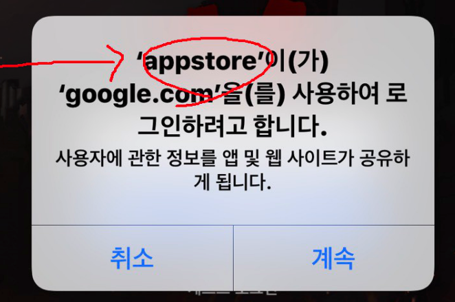
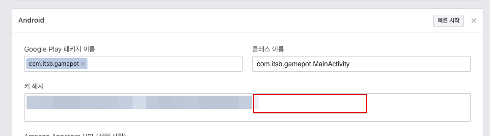
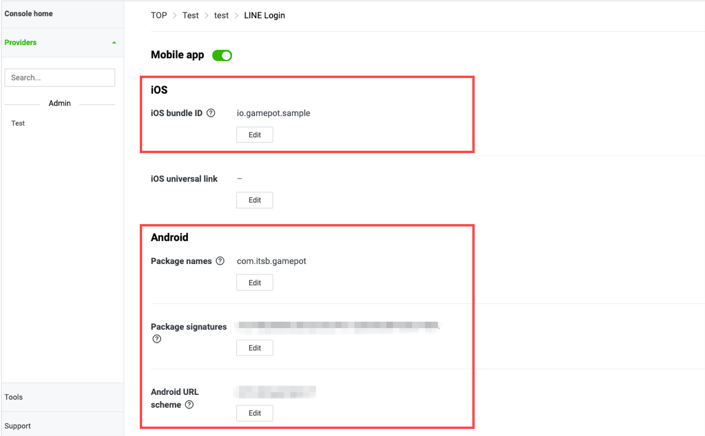
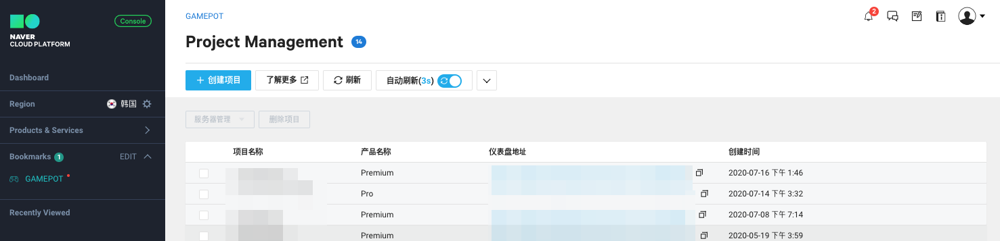

# FAQ

## 无法登录!

> 社交登录功能默认以相应平台的开发指南为准。发生问题时，请先查阅相应平台的登录开发指南。

### 1. Google登录

#### 1-1)

    # Q. 尝试登录时，马上返回登录取消。（AOS、iOS）
    # A. 这种情况是所需环境设置不正确导致。

1. 确认Firebase的配置文件`google-service.json`是否已正常包含在项目中

2. （AOS）确认构建APK时使用的Keystore的SHA-1值是否已添加到Firebase控制台中

   > SHA-1值向开发公司申请。


3. 确认Firebase控制台中项目设置是否正常

   - 确认应用于该内容的构建是否正确

     1. 是否使用控制台中设置的包名（AOS）/Bundle ID（iOS）进行构建

     2. （AOS）是否使用导出SHA-1的Keystore进行构建

   - 确认Firebase控制台是否设置了支持邮箱


    * （AOS）在Google控制台中使用`应用签名`时，还需要额外加入在控制台中创建的SHA-1值。

4. 确认以上全部检查项目后问题仍然存在时，请将支持邮箱更改为其他邮箱。

   > 偶尔也会发生首次设置支持邮箱时无法正常运行的情况。此时，更改为其他邮箱后，上述问题即可全部解决。

#### 1-2)

    # Q. 直接安装APK时可以登录，但下载商店中上传的应用后再登录时却无法登录。（AOS）
    # A. 因为在Google Developer Console中使用了“应用签名”功能才会这样。

这种问题是在控制台中上传APK时，“应用签名”激活后keystore被替换为控制台中管理的密钥导致，需要在Firebase控制台中添加控制台中管理的keystore的sha-1值。


> 此时使用Facebook登录时，Facebook Developer Console中也需要添加新keystore的keyhash值。


#### 1-3)

    # Q. 在IOS中使用Google登录时会发生错误 \(401错误：disabled\_client\)。（iOS）
    # A. Firebase控制台设置中未设置支持邮箱时可能会出现这种问题。

请设置支持邮箱后再确认。


#### 1-4)

    # Q. 在iOS中使用Google登录时会弹出弹窗，但显示的是游戏名称以外的其他值。（iOS）
    # A. 请更改Xcode >> Targets >> build Settings >> Product Name项目的值。



### 2. Facebook登录

    # Q. 已经在智能手机中安装了Facebook应用，但无法正常登录。（AOS、iOS）
    # A. Facebook Developer Console的环境设置不正确时可能会出现这种问题。

在Facebook控制台里添加构建APK时使用的密钥库的密钥哈希值。


- 在Google控制台中使用“应用签名”功能时，还需要添加Google控制台中管理的keystore的keyhash值。
  

### 3. APPLE登录

    # Q. 尝试APPLE登录时发生错误。（iOS）
    # A. 这种情况是所需环境设置不正确导致。

1. 确认是否添加了Xcode >> TARGETS >> Signing & Capabilities >> + Capability >> Sign In with Apple

2. 确认Xcode >> TARGETS >> Build phases >> Link Binary With Libraries中是否已添加LocalAuthentication.framework、AuthenticationService.framework
    （Target版本在iOS 13以下时，将AuthenticationService.framework设置为可选）


### 4. Naver登录（NAVER ID登录）

#### 4-1)

    # Q. 进行NAVER登录时发生错误。（AOS、iOS）
    # A. NAVER Developers Console的环境设置与构建设置不一致时可能会出现这种问题。

请确认NAVER Developers Application设置与构建设置是否一致。


#### 4-2)

**_`该事项仅在关联NAVER Cafe SDK时应用。`_**

    # Q. 关联NAVER Cafe SDK时，不能通过WebView进行NAVER ID登录（使用NAVER ID登录）。（iOS）
    # A. 这种情况是NAVER ID登录SDK与Cafe SDK的登录模块同时存在造成的。


1. 请下载相应链接中的补丁。\([下载](https://kr.object.ncloudstorage.com/itsb/patch/Patch_GamePotNaverLogin_20200508.zip)\)

2. 请删除已存在于项目中的两个框架。

   - GamePotNaver.framework
   - NaverThirdPartyLogin.framework（存在时）

3. 请将下载的补丁（GamePotNaver.framework）放入同一路径下。

   由于IOS UIWebview问题，请使用4.4.7以后版本的NAVER Cafe SDK 。

4. （仅限UNITY）在NAVER Cafe初始化阶段明确插入url scheme

    ../Assets/NCSDK/Plugins/iOS/NCSDKUnityManager.mm


5. 请将info.plist的URL Scheme值优先顺序修改为第一位。\([链接](https://docs.gamepot.io/undefined/gamepot_troubleshooting#unity-sdk-ios)\)


### 5. Line登录

    # Q. 进行LINE登录时发生错误\(400错误：Bad\_Request\)。（AOS、iOS）
    # A. LINE Developers Console的环境设置不正确时可能会出现这种问题。

请确认Line Developer Console的设置是否正确。



### 6. Twitter登录

    # Q. 进行Twitter登录时发生错误\(错误代码 - 1011\)。（AOS、iOS）
    # A. Twitter Developers Console的环境设置不正确时可能会出现这种问题。

请确认Twitter Developer Console的设置是否正确。

1. 请确认使用Twitter登录是否已激活。

2. 请确认Callback URL设置是否正确。
   - 第一行（AOS使用）: twittersdk://
   - 第二行（iOS使用）: twitterkit-{twitter_consumerkey}://


## 无法付款!

### 1. 常见情况

#### 1-1)

    # Q. 尝试付款时显示“productid was wrong!”语句。
    # A. 请在GAMEPOT仪表盘 -> 付款 -> IAP中添加商店的商品ID。


#### 1-2)

    # Q. 第一次尝试付款时无响应，第二次尝试付款时响应回复付款成功。（Play Store、ONEStore）
    # A. 这种情况是仪表盘 - 项目设置 - 一般 - 公钥中的密钥不正确导致。

请参考`查看帮助`中的内容并放入密钥。


### 2. Google Play Store

#### 2-1)

    # Q. 显示Google支付弹窗，但无法付款。
    # A. 这种情况是进行Google支付的环境设置不正确导致。请逐一检查以下项目。

1. 在控制台 > 应用信息 > 应用内商品中确认应用内是否呈`激活APK`状态


2. 在控制台中确认应用是否呈`已发布`状态

   > 在`生产`跟踪以外的`非公开`/`内部测试`跟踪中上传即可。


3. 确认控制台 -> 测试 -> 管理轨道 -> 测试用户数量 -> 测试参与对象管理中是否已添加测试账户


4. 确认是否访问测试参与URL并申请了参与测试


5. 在控制台 -> 设置中确认`许可证测试`中是否已添加测试账户


6. 确认终端 -> 设置 -> 账户菜单中是否已删除其他全部账户、只保留了参与测试的账户

### 3. ONEStore

#### 3-1)

    # Q. 显示“在异常应用中付款请求已发送”语句。
    # A. 开放之前，只有测试账户可以访问应用。请确认以下事项。

1. 请确认是否已添加测试账户。

2. 请确认终端中安装的One Store应用是否使用了第1项中添加的测试账户登录。

#### 3-2)

    # Q. 付款时显示\[package\] doesn't exist or wrong secret.语句。
    # A. 请重新确认GAMEPOT仪表盘中One Store相关密钥值是否已正常应用。

1. APK的包名是否与One Store中添加的包名一致


2. One Store控制台的`许可证密钥`应用与否


> 该值是否已在GAMEPOT仪表盘以下项目中应用


3. One Store控制台的`客户端密钥`应用与否


> 该值是否已在GAMEPOT仪表盘的以下项目中应用


#### 3-3)

    # Q. 完成付款后显示“未找到查询结果值。\(9001\)”语句，同时付款失败。
    # A. 这种情况是请求One Store验证发票时Real/Beta环境之间的差异造成的。

**A-1. One Store支付界面为沙盒环境时**

- 请在GAMEPOT仪表盘 - 项目设置 - 测试用户菜单中利用`支付/优惠券`确认IP是否已`添加`。


- 请在GAMEPOT仪表盘 - 项目设置 - Webhook项目中确认`付款道具（测试用户）`地址是否已`添加`。


**A-2. One Store支付界面为生产环境时**

- 请在GAMEPOT仪表盘 - 项目设置 - 测试用户菜单中利用`支付/优惠券`确认IP是`未使用`状态还是`未添加`状态。


- 请在GAMEPOT仪表盘 - 项目设置 - Webhook项目中确认`付款道具（服务）`中是否已`添加`地址。


#### 3-4)
- OneStore SDK應用內版本SDK v17，僅API v5。

- 如果在構建Android時使用targetSdkVersion 30（Android 11）構建，則Android 11 OS設備無法識別OneStore APK。

    [AndroidManifest.xml 需要在文件中添加以下短語]

        <!-- 使用targetSdkVersion 30構建時的OneStore版本的附加代碼 [Start] -->
        <queries>
            <intent>
                <action android:name="com.onestore.ipc.iap.IapService.ACTION" />
            </intent>
            <intent>
                <action android:name="android.intent.action.VIEW" />
                <data android:scheme="onestore" />
            </intent>
        </queries>
        <!-- 使用targetSdkVersion 30構建時的OneStore版本的附加代碼 [End] -->

        <application


### 3. Galaxy Store

#### 3-1)

    # Q. 登录时显示“不存在选择三星应用内支付的商品”语句。
    # A. 应用未发布时会出现这种问题。
         应用发布前，为完成测试应用内付款，需要进行以下操作。
         进行仪表盘 > 项目设置 > 添加白色玩家（种类：开发/测试设备IP）设置。


## Adbrix Remaster

    # Q. 应用Adbrix Remaster后构建IOS时发生崩溃。
    # A. Adbrix Remaster是通过Swift实现的库，应用Swift库时需要追加设置。

请在XCode中进行以下设置后构建。

如果构建后仍未改变，请删除构建后再确认。


#### Q. 应用Adbrix Remaster后向AppStore中上传时发生错误。

#### A. 这种问题是Adbrix Remaster库中包含x86_64、i386架构导致。请采取以下措施后重新构建并确认。

在控制台\(终端\)中移动到AdBrixRM.framework文件位置后输入以下两个命令lipo -remove x86_64 ./AdBrixRM.framework/AdBrixRM -o ./AdBrixRM.framework/AdBrixRM lipo -remove i386 ./AdBrixRM.framework/AdBrixRM -o ./AdBrixRM.framework/AdBrixRM


## Naver Cafe

    # Q. 显示iOS Naver Cafe时显示为英文。
    # A. 请将XCode >> Targets >> Info >> Localization native development region更改为韩语后确认。

## 服务推出

    # Q. 计划以iOS平台为对象推出服务。
    # A. 对于iOS App Store，应用验收需要1~2周左右的时间，所以需要留出2周左右的空余时间，申请迁移到Real Zone仪表盘后才能顺利进行。

## 推送

    # Q. iOS中无法接收推送。
    # A. 请逐一确认以下说明中的内容。

**1. 请在NCloud SENS设置中确认iOS证书是否已在Certification中添加。**

iOS中，因构建时使用的配置文件类型不同，需要添加的证书也不同。

- 将Developement Provisioning >> Push Development证书注册类型设置为沙盒
- 将Adhoc/Distribution Provisioning >> Push Distribution证书注册类型设置为生产

**2. 注册证书后，请在客户端确认登录是否已完成。**

Gamepot会于成功登录时向服务器发送推送令牌。

因此，如已注册证书，请在客户端进行登录后再确认。

**3. 请确认应用是否为Forground状态。**

iOS中，应用为Forground状态时无法接收推送。

请点击home按钮，确认是否能在主页中接收推送。

**4. 请确认在Xcode中构建时Capability中是否已包含推送通知。**

在Xcode中构建时Capability中必须包含推送通知。无法接收时，请确认构建时这部分是否已包含其中。

## 应用签名

    # Q. 直接安装的APK可以正常进行社交登录，但在商店中下载后再进行社交登录时却无法登录。
    # A. 这种情况是在Google Developer Console中应用签名被激活、Keystore更改造导致。

Google Developer Console中`设置` -> `应用完整性`菜单中将显示以下画面。


如正在使用Google登录，则请在Firebase控制台中添加`SHA-1`值；

如正在使用Facebook登录，则请在Facebook控制台中添加上述`SHA-1`值的`keyhash`。


## 用户ID迁移方法

> 用户ID迁移仅可从关联社交账户的用户ID迁移为其他用户ID。

    1. 确保要迁移的用户ID与要被迁移的用户ID。
    2. 在GAMEPOT仪表盘 > 会员 > 列表界面中查询用户ID后，点击要迁移的用户ID，
       前往详情页面。
    3. 点击下方的账户关联标签 > 点击要移动的社交ID旁的设置图标。
    4. 在关联信息更改弹窗中输入用户ID要被迁移的用户ID后，点击更改按钮。
    （勾选进行迁移操作的社交账户ID并后续确认。
      更改后相应用户ID中社交账户信息将消失。）
    5. 在GAMEPOT仪表盘 > 会员 > 列表界面查询用户ID后，点击已迁移的用户ID，
       前往详情页面。
    6. 点击下方的账户关联标签 > 确认已迁移的社交ID是否存在
    7. 在使用要迁移的用户ID登录的客户端退出登录后重新登录

例）第4项的示例


例）第6项的示例


## 用户ID恢复

    1.在GAMEPOT仪表盘 > 会员 > 列表界面查询用户ID后，点击用户ID，
       前往详情页面。
    2.点击恢复会员按钮 > 点击确定按钮。
    
    但是，用户注销后使用同一社交账户进行登录并获取了新的用户ID时，
    需要进行第1项、第2项中的步骤后再通过用户ID迁移方法进行用户ID迁移流程。


## 仪表盘提前预约页面关联方法

### 1. 申请发送号码[[SMS发送号码申请指南](https://docs.ncloud.com/ko/sens/sens-1-3.html#%EB%B0%9C%EC%8B%A0%EB%B2%88%ED%98%B8-%EB%93%B1%EB%A1%9D%EC%A1%B0%ED%9A%8C%ED%95%98%EA%B8%B0)]

> 申请发送号码并完成相应号码的审批后可以发送短信。


### 2. 提前预约页面关联API说明

> API需要按照发送SMS验证短信 > 完成SMS验证 > 完成SMS提前预约申请的顺序进行。

#### 共同事项：游戏 > 提前预约 > 添加 > 输入名称后保存的状态
GamePot提前预约页面的Category Id：选择保存的名称后点击旁边的复制图标


#### 3-1 发送SMS验证短信

##### 请求

```text
POST
url : https://alpha-api.gamepot.io/v1/phone/request
Header : 'content-type: application/json'
data:
{
	"projectId":"ab2775b4-cf09-4794-9480-XXXXXXXXXXXX",
	"categoryId":"b062a3f3-0a37-44d1-9e8f-XXXXXXXXXXXX",
	"from":"XXXXXXX",
	"to":"010XXXXXXX",
	"store":"google"
}
```


| 属性| 类型| 必填| 描述|
| :------------ | :----- | :------- | :---------------------- |
| projectId| 字符串| -| GamePot SDK的projectId|
| categoryId| 字符串| -| GamePot提前预约页面的categoryId|
| from| 字符串| -| 获得审批的发送号码|
| to| 字符串| -| 接收SMS验证码的联系方式|
| store| 字符串| -| 商店（google、one、apple）|

#### 响应

```javascript
{
    "code": 200,
    "message" : ""
}
```

| 属性| 类型| 描述|
| :-------- | :----- | :---------------------------------------------- |
| code| Int| 结果值\(200：成功，404：失败\)|
| error| 字符串| 提供各情形的错误内容|

#### 3-2 完成SMS验证

##### 请求

```text
POST
url : https://gamepot.apigw.ntruss.com/gpapps/v1/v1/phone/verify
Header : 'content-type: application/json'
data:
{
	"projectId":"ab2775b4-cf09-4794-9480-XXXXXXXXXXXX",
	"categoryId":"b062a3f3-0a37-44d1-9e8f-XXXXXXXXXXXX",
	"code":"6137",
	"to":"010XXXXXXX",
	"store":"google"
}
```


| 属性| 类型| 必填| 描述|
| :------------ | :----- | :------- | :---------------------- |
| projectId| 字符串| -| GamePot SDK的projectId|
| categoryId| 字符串| -| GamePot提前预约页面的categoryId|
| code| 字符串| -| 收到的验证码|
| to| 字符串| -| 接收SMS验证码的联系方式|
| store| 字符串| -| 商店（google、one、apple）|

#### 响应

```javascript
{
    "code": 200,
    "message" : ""
}
```

| 属性| 类型| 描述|
| :-------- | :----- | :---------------------------------------------- |
| code| Int| 结果值\(200：成功，404：失败\)|
| error| 字符串| 提供各情形的错误内容|


#### 3-3 完成SMS提前预约申请

##### 请求

```text
POST
url : https://gamepot.apigw.ntruss.com/gpapps/v1/v1/phone/join
Header : 'content-type: application/json'
data:
{
	"projectId":"ab2775b4-cf09-4794-9480-XXXXXXXXXXXX",
	"categoryId":"b062a3f3-0a37-44d1-9e8f-XXXXXXXXXXXX",
	"code":"6137",
   	"from":"02XXXXXXXX",
	"to":"010XXXXXXX",
	"store":"google",
    	"tag":""
}
```

| 属性| 类型| 必填| 描述|
| :------------ | :----- | :------- | :---------------------- |
| projectId| 字符串| -| GamePot SDK的projectId|
| categoryId| 字符串| -| GamePot提前预约页面的categoryId|
| code| 字符串| -| 收到的验证码|
| from| 字符串| -| 获得审批的发送号码|
| to| 字符串| -| 接收SMS验证码的联系方式|
| store| 字符串| -| 商店（google、one、apple）|
| tag| 字符串| -| 其他信息（进入路径等信息）)|

#### 响应

```javascript
{
    "code": 200,
    "message" : ""
}
```

| 属性| 类型| 描述|
| :-------- | :----- | :---------------------------------------------- |
| code| Int| 结果值\(200：成功，404：失败\)|
| error| 字符串| 提供各情形的错误内容|


## 案例集

### - 仪表盘

#### 1. 无法接收推送消息时

    1. 请确认仪表盘 >> 项目设置 >> ncloud API认证密钥的AccessKey、Secret Key、SENS-PUSH、SENS-SMS值。
    2. 请就该认证密钥确认SENS项目的Certificate设置。


#### 2. 关于用户指标保留算法

第一天创建账户后，将第二天登录的用户视为新用户进行计数。（此举意在扣除通过广告等途径进入的虚数。）

    例如）
     以2020年1月7日为准，从下面的图片票证来看，
     2020年1月7日，新用户中有5名人员于2020年1月8日访问，
     判定该日期（2020年1月7日）有5名新用户。（与第一天的值相同。）
     显示的状态是以该人数为基准，第二天（次日2020年1月9日）有1人登录/第三天有0人登录/第四天有1人登录。
     5名用户中，采用的是第n天计数的方式，所以中间会形成降至0%的区间。


#### 3. 禁用会员的停用时

    停用列表中用户ID已添加且处于禁用状态时，即使进行Google退款，该列表也不会自动重新激活。
    另外，对于已禁用的用户ID，不会阻止其访问账户。

### - 其他

#### 1. 从Firebase控制台中导出google-service.json时

    请在已登记SHA指纹的状态下从Firebase控制台中导出google-service.json。
    否则导出时可能会遗漏json文件的部分值，进而导致无法正常登录。


#### 2. GAMEPOT登录验证时，发生Token authentication failed错误

    正在使用Beta Zone的企业可能会遇到这种问题。
    登录验证请求URL已设置为“https://gamepot.apigw.ntruss.com/gpapps/v1/loginauth”时，请更改为https://cloud-api.gamepot.io/loginauth后再确认。

    Real Zone：https://gamepot.apigw.ntruss.com/gpapps/v1/loginauth
    Beta Zone：https://cloud-api.gamepot.io/loginauth（计划结束服务）

#### 3. 运行构建时，弹出了“应用运行异常，请在商店中下载。”的消息弹窗

    这种问题是仪表盘 >> 项目设置 >> 一般标签中哈希密钥设置错误导致。
    请删除相应哈希密钥或输入正确的哈希密钥后再确认。


#### 4. 在Gamepot SDK中尝试付款时，Gamepot SDK中收到了成功响应，但仪表盘的付款 >> 付款列表中未添加付款记录，无法向游戏服务器传递请求

    请在仪表盘 >> 项目设置 >> 一般标签中确认Goolgle API密钥的Json值是否已添加。
    Google API密钥设置为版本2时，即使没有该密钥值也能付款，但从版本3开始必须输入密钥值。
    已经输入时，请点击查看帮助，重新创建JSON值后添加。
    参考）获取新账户后导出密钥值并加入时，新密钥更新应用需要一天左右的时间。


#### 5. 完成付款后，发生Google Play Developer API not linked错误

    Google API密钥设置不正确时可能会出现这种问题。
    请点击查看帮助，重新创建JSON值后添加。
    参考）获取新账户后导出密钥值并加入时，新密钥更新应用需要一天左右的时间。


#### 6. 获取新服务账户后，应用密钥值后付款API仍然失败时

    （Google服务账户迁移时）获取新密钥并应用后，仍然收到了付款API失败的Google控制台方缺陷报告。(2020.02.13)
    此时，请在Google控制台中任意创建一个应用内商品后再确认问题是否解决。

#### 7.IOS推送消息接收问题 \[[IOS APNS证书注册指南](https://kr.object.ncloudstorage.com/itsb/patch/IOS%20APNS%20%E1%84%8B%E1%85%B5%E1%86%AB%E1%84%8C%E1%85%B3%E1%86%BC%E1%84%89%E1%85%A5%20%E1%84%80%E1%85%A1%E1%84%8B%E1%85%B5%E1%84%83%E1%85%B3%20%E1%84%86%E1%85%AE%E1%86%AB%E1%84%89%E1%85%A5.docx)\]

    1. 请在SENS设置中确认认证密钥与证书是否已在Certification中添加。

    2. iOS中，因构建时使用的配置文件类型不同，需要添加的证书也不同。

    [Development]
    请上传Provisioning >> Push Development证书，并将类型设置为沙盒。

    [Adhoc/Distribution]
    请上传Provisioning >> Push Distribution证书，并将类型设置为生产。

    3. Gamepot会于成功登录时向服务器发送推送令牌。因此，注册证书后请在客户端进行登录后再确认。

    4. iOS中，应用为Forground状态时无法接收推送。请点击home按钮，确认主页中是否已接收推送。

    5. IOS中，在Xcode中构建时Capability中必须包含推送通知。无法接收时，请确认构建时相应部分是否已添加。

#### 8. IOS付款测试方法

    1. 进入测试设备的设置 >> iTunse与Store >> 点击Apple ID : XXXX >> 退出登录

    2. 运行应用

    3. 选择应用的收费付款项目

    4. 弹出弹窗时选择使用现有appleID

    5. 放入测试账户ID/PW并登录（偶尔也会因情况不同多次弹出弹窗，但不需要特别在意。）

    6. 收费付款项目的价格与名称以弹窗形式显示，显示[Environment : Sandbox]语句

    7. 选择购买

    * 付款弹窗中显示 [Environment : Sandbox]语句时，不会实际收费。


#### 9. 推送消息的应用名称在构建客户端时决定。


如想根据语言更改应用名称，按以下方法进行即可。


    [Android]

    app/src/main/res/values-国家代码/strings.xml
    
    例如）设备语言为英语时想更改应用名称
    app/src/main/res/values-en/strings.xml

    [Unity Android]

    Assets/Plugins/Android/GamePotResources/res/values-国家代码/strings.xml

    例如）设备语言为韩语时想更改应用名称
    Assets/Plugins/Android/GamePotResources/res/values-ko/strings.xml


    [strings.xml]
    <?xml version="1.0" encoding="utf-8"?>
        <resources>
            <string name="app_name">根据语言设置应用名称</string>
        </resources>


IOS设置方法如下。

1. XCode >> Targets >> Info >> Localization >> 添加想添加的语言


2. Xcode >> File >> file >> 点击Strings File图标 >> next > 将文件名定义为InfoPlist后创建文件
3. 选择已创建的文件后赋予Localization设置


4. 选择语言后将创建相关文件，赋予该文件适合各语言的应用名称即可。

    [InfoPlist.string]
    CFBundleDisplayName="根据语言设置应用名称";


#### 10. 导入应用内列表信息时，每个商店GamePot.getPurchaseItems() API的Price值都不同。

	导入应用内列表信息时，共享各商店应用内SDK传递的值。

	Google Store：price值为货币单位 + 应用内价格
	ex)  ₩1,000

	Apple Store：price值为应用内价格
	ex) 1000

	想在IOS中标记货币单位时，参考price_currency_code值即可。
	ex) price_currency_code : KRW


#### 11. 仪表盘管理员账户密码登录5次失败，无法正常登录。（V2仪表盘用户对象）

1. 使用admin账户访问https://console.ncloud.com/gamepot网站。

2. 选择想初始化密码的仪表盘后，点击项目管理项目时会显示密码初始化菜单。

3. 选择密码初始化菜单时，会弹出输入管理员账户的弹窗，输入内容时将向相关邮箱发送可以初始化密码的邮件。




