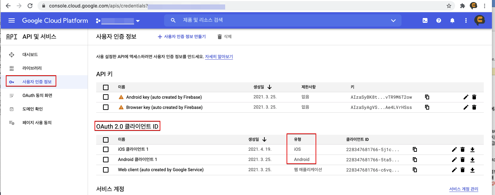
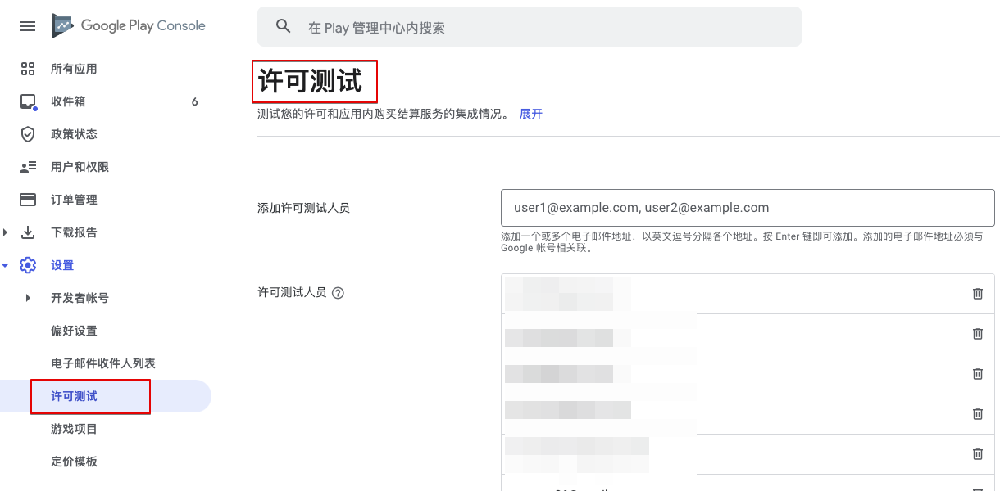
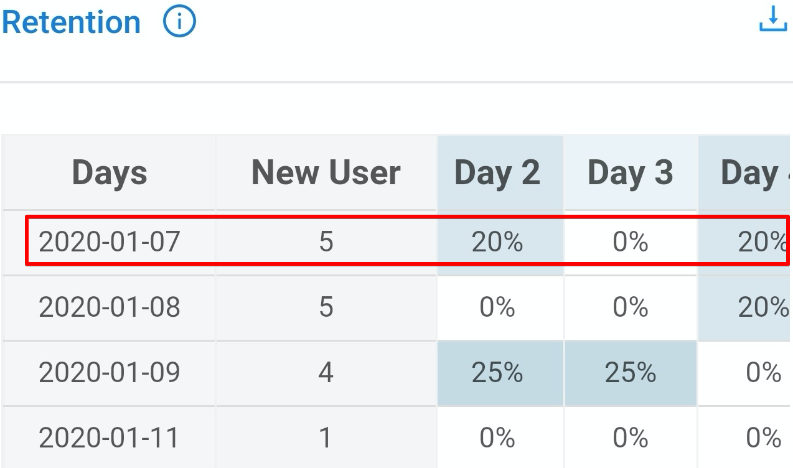

# FAQ

## 无法登录!

> 社交登录功能默认以相应平台的开发指南为准。发生问题时，请先查阅相应平台的登录开发指南。

### 1. Google登录

#### 1-1)

    # Q. 尝试登录时，马上返回登录取消。（AOS、iOS）
    # A. 这种情况是所需环境设置不正确导致。

1. 确认Firebase的配置文件`google-service.json`是否已正常包含在项目中

2. （AOS）确认构建APK时使用的Keystore的SHA-1值是否已添加到Firebase控制台中

   > SHA-1值向开发公司申请。


3. 确认Firebase控制台中项目设置是否正常

   - 确认应用于该内容的构建是否正确

     1. 是否使用控制台中设置的包名（AOS）/Bundle ID（iOS）进行构建

     2. （AOS）是否使用导出SHA-1的Keystore进行构建

   - 确认Firebase控制台是否设置了支持邮箱


    * （AOS）在Google控制台中使用`应用签名`时，还需要额外加入在控制台中创建的SHA-1值。

4. 确认以上全部检查项目后问题仍然存在时，请将支持邮箱更改为其他邮箱。

   > 偶尔也会发生首次设置支持邮箱时无法正常运行的情况。此时，更改为其他邮箱后，上述问题即可全部解决。

If items 1 to 4 are performed, but onCancel is processed when trying to log in

- Access to site https://console.cloud.google.com
  
- After selecting a project > Top left menu > APIs and Services > User authentication information > Check if Android/IOS/App application information is in OAuth 2.0 client ID type

 

- After selecting a project > Top left menu > APIs and Services > OAuth consent screen > Check that Publish Status is Production and User Type is External

 

#### 1-2)

    # Q. 直接安装APK时可以登录，但下载商店中上传的应用后再登录时却无法登录。（AOS）
    # A. 因为在Google Developer Console中使用了“应用签名”功能才会这样。

这种问题是在控制台中上传APK时，“应用签名”激活后keystore被替换为控制台中管理的密钥导致，需要在Firebase控制台中添加控制台中管理的keystore的sha-1值。


> 此时使用Facebook登录时，Facebook Developer Console中也需要添加新keystore的keyhash值。


#### 1-3)

    # Q. 在IOS中使用Google登录时会发生错误 \(401错误：disabled\_client\)。（iOS）
    # A. Firebase控制台设置中未设置支持邮箱时可能会出现这种问题。

请设置支持邮箱后再确认。


#### 1-4)

    # Q. 在iOS中使用Google登录时会弹出弹窗，但显示的是游戏名称以外的其他值。（iOS）
    # A. 请更改Xcode >> Targets >> build Settings >> Product Name项目的值。


### 2. Facebook登录

    # Q. 已经在智能手机中安装了Facebook应用，但无法正常登录。（AOS、iOS）
    # A. Facebook Developer Console的环境设置不正确时可能会出现这种问题。

在Facebook控制台里添加构建APK时使用的密钥库的密钥哈希值。


- 在Google控制台中使用“应用签名”功能时，还需要添加Google控制台中管理的keystore的keyhash值。
  

### 3. APPLE登录

    # Q. 尝试APPLE登录时发生错误。（iOS）
    # A. 这种情况是所需环境设置不正确导致。

1. 确认是否添加了Xcode >> TARGETS >> Signing & Capabilities >> + Capability >> Sign In with Apple

2. 确认Xcode >> TARGETS >> Build phases >> Link Binary With Libraries中是否已添加LocalAuthentication.framework、AuthenticationService.framework
    （Target版本在iOS 13以下时，将AuthenticationService.framework设置为可选）


### 4. Naver登录（NAVER ID登录）

#### 4-1)

    # Q. 进行NAVER登录时发生错误。（AOS、iOS）
    # A. NAVER Developers Console的环境设置与构建设置不一致时可能会出现这种问题。

请确认NAVER Developers Application设置与构建设置是否一致。


#### 4-2)

**_`该事项仅在关联NAVER Cafe SDK时应用。`_**

    # Q. 关联NAVER Cafe SDK时，不能通过WebView进行NAVER ID登录（使用NAVER ID登录）。（iOS）
    # A. 这种情况是NAVER ID登录SDK与Cafe SDK的登录模块同时存在造成的。


1. 请下载相应链接中的补丁。\([下载](https://kr.object.ncloudstorage.com/itsb/patch/Patch_GamePotNaverLogin_20200508.zip)\)

2. 请删除已存在于项目中的两个框架。

   - GamePotNaver.framework
   - NaverThirdPartyLogin.framework（存在时）

3. 请将下载的补丁（GamePotNaver.framework）放入同一路径下。

   由于IOS UIWebview问题，请使用4.4.7以后版本的NAVER Cafe SDK 。

4. （仅限UNITY）在NAVER Cafe初始化阶段明确插入url scheme

    ../Assets/NCSDK/Plugins/iOS/NCSDKUnityManager.mm


5. 请将info.plist的URL Scheme值优先顺序修改为第一位。\([链接](https://docs.gamepot.io/undefined/gamepot_troubleshooting#unity-sdk-ios)\)


### 5. Line登录

    # Q. 进行LINE登录时发生错误\(400错误：Bad\_Request\)。（AOS、iOS）
    # A. LINE Developers Console的环境设置不正确时可能会出现这种问题。

请确认Line Developer Console的设置是否正确。


### 6. Twitter登录

    # Q. 进行Twitter登录时发生错误\(错误代码 - 1011\)。（AOS、iOS）
    # A. Twitter Developers Console的环境设置不正确时可能会出现这种问题。

请确认Twitter Developer Console的设置是否正确。

1. 请确认使用Twitter登录是否已激活。

2. 请确认Callback URL设置是否正确。
   - 第一行（AOS使用）: twittersdk://
   - 第二行（iOS使用）: twitterkit-{twitter_consumerkey}://


## 无法付款!

### 1. 常见情况

#### 1-1)

    # Q. 尝试付款时显示“productid was wrong!”语句。
    # A. 请在GAMEPOT仪表盘 -> 付款 -> IAP中添加商店的商品ID。


#### 1-2)

    # Q. 第一次尝试付款时无响应，第二次尝试付款时响应回复付款成功。（Play Store、ONEStore）
    # A. 这种情况是仪表盘 - 项目设置 - 一般 - 公钥中的密钥不正确导致。

请参考`查看帮助`中的内容并放入密钥。


### 2. Google Play Store

#### 2-1)

    # Q. 显示Google支付弹窗，但无法付款。
    # A. 这种情况是进行Google支付的环境设置不正确导致。请逐一检查以下项目。

1. 在控制台 > 应用信息 > 应用内商品中确认应用内是否呈`激活APK`状态


2. 在控制台中确认应用是否呈`已发布`状态

   > 在`生产`跟踪以外的`非公开`/`内部测试`跟踪中上传即可。


3. 确认控制台 -> 测试 -> 管理轨道 -> 测试用户数量 -> 测试参与对象管理中是否已添加测试账户


4. 确认是否访问测试参与URL并申请了参与测试


5. 在控制台 -> 设置中确认`许可证测试`中是否已添加测试账户



6. 确认终端 -> 设置 -> 账户菜单中是否已删除其他全部账户、只保留了参与测试的账户

### 3. ONEStore

#### 3-1)

    # Q. 显示“在异常应用中付款请求已发送”语句。
    # A. 开放之前，只有测试账户可以访问应用。请确认以下事项。

1. 请确认是否已添加测试账户。

2. 请确认终端中安装的One Store应用是否使用了第1项中添加的测试账户登录。

#### 3-2)

    # Q. 付款时显示\[package\] doesn't exist or wrong secret.语句。
    # A. 请重新确认GAMEPOT仪表盘中One Store相关密钥值是否已正常应用。

1. APK的包名是否与One Store中添加的包名一致


2. One Store控制台的`许可证密钥`应用与否


> 该值是否已在GAMEPOT仪表盘以下项目中应用


3. One Store控制台的`客户端密钥`应用与否


> 该值是否已在GAMEPOT仪表盘的以下项目中应用


#### 3-3)

    # Q. 完成付款后显示“未找到查询结果值。\(9001\)”语句，同时付款失败。
    # A. 这种情况是请求One Store验证发票时Real/Beta环境之间的差异造成的。

**A-1. One Store支付界面为沙盒环境时**

- 请在GAMEPOT仪表盘 - 项目设置 - 测试用户菜单中利用`支付/优惠券`确认IP是否已`添加`。


- 请在GAMEPOT仪表盘 - 项目设置 - Webhook项目中确认`付款道具（测试用户）`地址是否已`添加`。


**A-2. One Store支付界面为生产环境时**

- 请在GAMEPOT仪表盘 - 项目设置 - 测试用户菜单中利用`支付/优惠券`确认IP是`未使用`状态还是`未添加`状态。


- 请在GAMEPOT仪表盘 - 项目设置 - Webhook项目中确认`付款道具（服务）`中是否已`添加`地址。


#### 3-4)
- One Store SDK 的應用內版本具有不同的支持套件，具體取決於 GAMEPOT SDK 的版本。
  
GAMEPOT SDK V 3.5.0：支持 api21、V7

GAMEPOT SDK V 3.4.2：支持 api 17、V5

- 如果在 Android 構建過程中使用了 targetSdkVersion 30(Android 11)，則無法在運行 Android 11 操作系統的設備上搜索 One Store APK。

    [AndroidManifest.xml 需要在文件中添加以下短語]

        <!-- 使用 targetSdkVersion 30 或更高版本构建时 OneStore 版本的附加代码 [Start] -->
        <queries>
            <intent>
                <action android:name="com.onestore.ipc.iap.IapService.ACTION" />
            </intent>
            <intent>
                <action android:name="android.intent.action.VIEW" />
                <data android:scheme="onestore" />
            </intent>
        </queries>
        <!-- 使用 targetSdkVersion 30 或更高版本构建时 OneStore 版本的附加代码 [End] -->

        <application


### 4. Galaxy Store

#### 4-1)

    # Q. 登录时显示“不存在选择三星应用内支付的商品”语句。
    # A. 应用未发布时会出现这种问题。
         应用发布前，为完成测试应用内付款，需要进行以下操作。
         进行仪表盘 > 项目设置 > 添加白色玩家（种类：开发/测试设备IP）设置。


### 5.蘋果商店

- 處理付款的沙盒帳戶的設置國家/地區需要來自 Apple 控制台可分發應用程序的可用國家/地區列表。

- 需要在Xcode Capability中添加應用內購買功能。

- 在 Apple 控制台上，合同、稅務和財務交易的任何部分都不得出現任何問題。
（當有任何未解決的問題時，Apple應用內SDK將停止提供應用內信息，從而禁止應用內支付。）

## 未收到應用內項目列表

1. 通過GAMEPOT只能購買和處理應用內消耗品。

2. 支付庫必須在構建時實現。

- Google in-app SDK:

```text

    (Unity)
    ../Assets/Plugins/Android/libs/billing-5.0.0.aar
    ../Assets/Plugins/Android/libs/firebase-crashlytics-buildtools-2.9.1.jar
    
    (Native) 
    implementation 'com.google.firebase:firebase-crashlytics-buildtools:2.9.1'
    implementation 'com.android.billingclient:billing:5.0.0'

```

- One Store in-app SDK:

```text

    (Unity)
    ../Assets/Plugins/Android/nativeLibs/gamepot-billing-onestore.aar
    ../Assets/Plugins/Android/nativeLibs/sdk-auth-1.0.2.aar
    ../Assets/Plugins/Android/nativeLibs/sdk-base-1.0.3.aar
    ../Assets/Plugins/Android/nativeLibs/sdk-iap-21.00.00.aar

    (Native) 
    implementation(name: 'gamepot-billing-onestore', ext: 'aar')
    implementation(name: 'sdk-auth-1.0.2', ext: 'aar')
    implementation(name: 'sdk-base-1.0.3', ext: 'aar')
    implementation(name: 'sdk-iap-21.00.00', ext: 'aar')
```

- Galaxy Store in-app SDK:
  
```text

    (Unity)
    ../Assets/Plugins/Android/nativeLibs/gamepot-billing-galaxystore.aar

    (Native) 
    implementation(name: 'gamepot-billing-galaxystore', ext: 'aar')

```  


3. 必須正確完成支付功能的設置。 請參考：【#无法付款!】(https://docs.gamepot.io/zhong-wen/gamepot_faq#wu-fa-fu-kuan)


4. 使用getPurchaseItems API時，登錄後初始化支付模塊，API異步接收應用內支付列表並顯示為響應。 因此，根據 API 調用的時間，有時可能不會返回任何信息。

如果信息缺失，我們建議使用 getPurchaseDetailListAsync API，同步獲取應用內支付列表。 （對於Google，未註冊Google帳戶的設備可能沒有響應。）

5. 設備上必須登錄專用支付賬戶才能啟用各商店的應用內支付功能，且處理支付的國家/地區必須來自商店應用程序的可用國家/地區列表。


## Adbrix Remaster

    # Q. 应用Adbrix Remaster后构建IOS时发生崩溃。
    # A. Adbrix Remaster是通过Swiftimplementation的库，应用Swift库时需要追加设置。

请在XCode中进行以下设置后构建。

如果构建后仍未改变，请删除构建后再确认。


#### Q. 应用Adbrix Remaster后向AppStore中上传时发生错误。

#### A. 这种问题是Adbrix Remaster库中包含x86_64、i386架构导致。请采取以下措施后重新构建并确认。

在控制台\(终端\)中移动到AdBrixRM.framework文件位置后输入以下两个命令lipo -remove x86_64 ./AdBrixRM.framework/AdBrixRM -o ./AdBrixRM.framework/AdBrixRM lipo -remove i386 ./AdBrixRM.framework/AdBrixRM -o ./AdBrixRM.framework/AdBrixRM


## Naver Cafe

    # Q. 显示iOS Naver Cafe时显示为英文。
    # A. 请将XCode >> Targets >> Info >> Localization native development region更改为韩语后确认。

## 服务推出

    # Q. 计划以iOS平台为对象推出服务。
    # A. 对于iOS App Store，应用验收需要1~2周左右的时间，所以需要留出2周左右的空余时间，申请迁移到Real Zone仪表盘后才能顺利进行。

## 推送

    # Q. iOS中无法接收推送。
    # A. 请逐一确认以下说明中的内容。

**1. 请在NCloud SENS设置中确认iOS证书是否已在Certification中添加。**

iOS中，因构建时使用的配置文件类型不同，需要添加的证书也不同。

- 将Developement Provisioning >> Push Development证书注册类型设置为沙盒
- 将Adhoc/Distribution Provisioning >> Push Distribution证书注册类型设置为生产

**2. 注册证书后，请在客户端确认登录是否已完成。**

Gamepot会于成功登录时向服务器发送推送令牌。

因此，如已注册证书，请在客户端进行登录后再确认。

**3. 请确认应用是否为Forground状态。**

iOS中，应用为Forground状态时无法接收推送。

请点击home按钮，确认是否能在主页中接收推送。

**4. 请确认在Xcode中构建时Capability中是否已包含推送通知。**

在Xcode中构建时Capability中必须包含推送通知。无法接收时，请确认构建时这部分是否已包含其中。

## 应用签名

    # Q. 直接安装的APK可以正常进行社交登录，但在商店中下载后再进行社交登录时却无法登录。
    # A. 这种情况是在Google Developer Console中应用签名被激活、Keystore更改造导致。

Google Developer Console中`设置` -> `应用完整性`菜单中将显示以下画面。


如正在使用Google登录，则请在Firebase控制台中添加`SHA-1`值；

如正在使用Facebook登录，则请在Facebook控制台中添加上述`SHA-1`值的`keyhash`。


## 用户ID迁移方法

> 用户ID迁移仅可从关联社交账户的用户ID迁移为其他用户ID。

    1. 确保要迁移的用户ID与要被迁移的用户ID。
    2. 在GAMEPOT仪表盘 > 会员 > 列表界面中查询用户ID后，点击要迁移的用户ID，
       前往详情页面。
    3. 点击下方的账户关联标签 > 点击要移动的社交ID旁的设置图标。
    4. 在关联信息更改弹窗中输入用户ID要被迁移的用户ID后，点击更改按钮。
    （勾选进行迁移操作的社交账户ID并后续确认。
      更改后相应用户ID中社交账户信息将消失。）
    5. 在GAMEPOT仪表盘 > 会员 > 列表界面查询用户ID后，点击已迁移的用户ID，
       前往详情页面。
    6. 点击下方的账户关联标签 > 确认已迁移的社交ID是否存在
    7. 在使用要迁移的用户ID登录的客户端退出登录后重新登录

例）第4项的示例


例）第6项的示例


## 用户ID恢复

    1.在GAMEPOT仪表盘 > 会员 > 列表界面查询用户ID后，点击用户ID，
       前往详情页面。
    2.点击恢复会员按钮 > 点击确定按钮。
    
    但是，用户注销后使用同一社交账户进行登录并获取了新的用户ID时，
    需要进行第1项、第2项中的步骤后再通过用户ID迁移方法进行用户ID迁移流程。


## 仪表盘提前预约页面关联方法

### 1. 申请发送号码[[SMS发送号码申请指南](https://guide.ncloud-docs.com/docs/zh/sens-callingno)]

> 申请发送号码并完成相应号码的审批后可以发送短信。


### 2. 提前预约页面关联API说明

> API需要按照发送SMS验证短信 > 完成SMS验证 > 完成SMS提前预约申请的顺序进行。

#### 共同事项：游戏 > 提前预约 > 添加 > 输入名称后保存的状态
GamePot提前预约页面的Category Id：选择保存的名称后点击旁边的复制图标


#### 3-1 发送SMS验证短信

##### 请求

```text
POST
url : https://alpha-api.gamepot.io/v1/phone/request
Header : 'content-type: application/json'
data:
{
	"projectId":"ab2775b4-cf09-4794-9480-XXXXXXXXXXXX",
	"categoryId":"b062a3f3-0a37-44d1-9e8f-XXXXXXXXXXXX",
	"from":"XXXXXXX",
	"to":"010XXXXXXX",
	"store":"google"
}
```


| 属性| 类型| 必填| 描述|
| :------------ | :----- | :------- | :---------------------- |
| projectId| 字符串| -| GamePot SDK的projectId|
| categoryId| 字符串| -| GamePot提前预约页面的categoryId|
| from| 字符串| -| 获得审批的发送号码|
| to| 字符串| -| 接收SMS验证码的联系方式|
| store| 字符串| -| 商店（google、one、apple）|

#### 响应

```javascript
{
    "code": 200,
    "message" : ""
}
```

| 属性| 类型| 描述|
| :-------- | :----- | :---------------------------------------------- |
| code| Int| 结果值\(200：成功，404：失败\)|
| error| 字符串| 提供各情形的错误内容|

#### 3-2 完成SMS验证

##### 请求

```text
POST
url : https://gamepot.apigw.ntruss.com/gpapps/v1/v1/phone/verify
Header : 'content-type: application/json'
data:
{
	"projectId":"ab2775b4-cf09-4794-9480-XXXXXXXXXXXX",
	"categoryId":"b062a3f3-0a37-44d1-9e8f-XXXXXXXXXXXX",
	"code":"6137",
	"to":"010XXXXXXX",
	"store":"google"
}
```


| 属性| 类型| 必填| 描述|
| :------------ | :----- | :------- | :---------------------- |
| projectId| 字符串| -| GamePot SDK的projectId|
| categoryId| 字符串| -| GamePot提前预约页面的categoryId|
| code| 字符串| -| 收到的验证码|
| to| 字符串| -| 接收SMS验证码的联系方式|
| store| 字符串| -| 商店（google、one、apple）|

#### 响应

```javascript
{
    "code": 200,
    "message" : ""
}
```

| 属性| 类型| 描述|
| :-------- | :----- | :---------------------------------------------- |
| code| Int| 结果值\(200：成功，404：失败\)|
| error| 字符串| 提供各情形的错误内容|


#### 3-3 完成SMS提前预约申请

##### 请求

```text
POST
url : https://gamepot.apigw.ntruss.com/gpapps/v1/v1/phone/join
Header : 'content-type: application/json'
data:
{
	"projectId":"ab2775b4-cf09-4794-9480-XXXXXXXXXXXX",
	"categoryId":"b062a3f3-0a37-44d1-9e8f-XXXXXXXXXXXX",
	"code":"6137",
   	"from":"02XXXXXXXX",
	"to":"010XXXXXXX",
	"store":"google",
    	"tag":""
}
```

| 属性| 类型| 必填| 描述|
| :------------ | :----- | :------- | :---------------------- |
| projectId| 字符串| -| GamePot SDK的projectId|
| categoryId| 字符串| -| GamePot提前预约页面的categoryId|
| code| 字符串| -| 收到的验证码|
| from| 字符串| -| 获得审批的发送号码|
| to| 字符串| -| 接收SMS验证码的联系方式|
| store| 字符串| -| 商店（google、one、apple）|
| tag| 字符串| -| 其他信息（进入路径等信息）)|

#### 响应

```javascript
{
    "code": 200,
    "message" : ""
}
```

| 属性| 类型| 描述|
| :-------- | :----- | :---------------------------------------------- |
| code| Int| 结果值\(200：成功，404：失败\)|
| error| 字符串| 提供各情形的错误内容|


## 案例集

### - Check Gamepot API Latency

https://tools.bunny.net/latency-test?query=gamepot.apigw.ntruss.com 


### - 仪表盘

#### 1. 无法接收推送消息时

    1. 请确认仪表盘 >> 项目设置 >> ncloud API认证密钥的AccessKey、Secret Key、SENS-PUSH、SENS-SMS值。
    2. 请就该认证密钥确认SENS项目的Certificate设置。


#### 2. 关于用户指标保留算法

第一天创建账户后，将第二天登录的用户视为新用户进行计数。（此举意在扣除通过广告等途径进入的虚数。）

    例如）
     以2020年1月7日为准，从下面的图片票证来看，
     2020年1月7日，新用户中有5名人员于2020年1月8日访问，
     判定该日期（2020年1月7日）有5名新用户。（与第一天的值相同。）
     显示的状态是以该人数为基准，第二天（次日2020年1月9日）有1人登录/第三天有0人登录/第四天有1人登录。
     5名用户中，采用的是第n天计数的方式，所以中间会形成降至0%的区间。



#### 3. 禁用会员的停用时

    停用列表中用户ID已添加且处于禁用状态时，即使进行Google退款，该列表也不会自动重新激活。
    另外，对于已禁用的用户ID，不会阻止其访问账户。

### - 其他

#### 1. 从Firebase控制台中导出google-service.json时

    请在已登记SHA指纹的状态下从Firebase控制台中导出google-service.json。
    否则导出时可能会遗漏json文件的部分值，进而导致无法正常登录。


#### 2. GAMEPOT登录验证时，发生Token authentication failed错误

    正在使用Beta Zone的企业可能会遇到这种问题。
    登录验证请求URL已设置为“https://gamepot.apigw.ntruss.com/gpapps/v1/loginauth”时，请更改为https://cloud-api.gamepot.io/loginauth后再确认。

    Real Zone：https://gamepot.apigw.ntruss.com/gpapps/v1/loginauth
    Beta Zone：https://cloud-api.gamepot.io/loginauth（服務結束）

#### 3. 运行构建时，弹出了“应用运行异常，请在商店中下载。”的消息弹窗

    这种问题是仪表盘 >> 项目设置 >> 一般标签中哈希密钥设置错误导致。
    请删除相应哈希密钥或输入正确的哈希密钥后再确认。


#### 4. 在Gamepot SDK中尝试付款时，Gamepot SDK中收到了成功响应，但仪表盘的付款 >> 付款列表中未添加付款记录，无法向游戏服务器传递请求

    请在仪表盘 >> 项目设置 >> 一般标签中确认Goolgle API密钥的Json值是否已添加。
    Google API密钥设置为版本2时，即使没有该密钥值也能付款，但从版本3开始必须输入密钥值。
    已经输入时，请点击查看帮助，重新创建JSON值后添加。
    参考）获取新账户后导出密钥值并加入时，新密钥更新应用需要一天左右的时间。


#### 5. 完成付款后，发生Google Play Developer API not linked错误

    Google API密钥设置不正确时可能会出现这种问题。
    请点击查看帮助，重新创建JSON值后添加。
    参考）获取新账户后导出密钥值并加入时，新密钥更新应用需要一天左右的时间。


#### 6. 获取新服务账户后，应用密钥值后付款API仍然失败时

    （Google服务账户迁移时）获取新密钥并应用后，仍然收到了付款API失败的Google控制台方缺陷报告。(2020.02.13)
    此时，请在Google控制台中任意创建一个应用内商品后再确认问题是否解决。

#### 7.IOS推送消息接收问题 \[[IOS APNS证书注册指南](https://kr.object.ncloudstorage.com/itsb/patch/IOS%20APNS%20%E1%84%8B%E1%85%B5%E1%86%AB%E1%84%8C%E1%85%B3%E1%86%BC%E1%84%89%E1%85%A5%20%E1%84%80%E1%85%A1%E1%84%8B%E1%85%B5%E1%84%83%E1%85%B3%20%E1%84%86%E1%85%AE%E1%86%AB%E1%84%89%E1%85%A5.docx)\]

    1. 请在SENS设置中确认认证密钥与证书是否已在Certification中添加。

    2. iOS中，因构建时使用的配置文件类型不同，需要添加的证书也不同。

    [Development]
    请上传Provisioning >> Push Development证书，并将类型设置为沙盒。

    [Adhoc/Distribution]
    请上传Provisioning >> Push Distribution证书，并将类型设置为生产。

    3. Gamepot会于成功登录时向服务器发送推送令牌。因此，注册证书后请在客户端进行登录后再确认。

    4. iOS中，应用为Forground状态时无法接收推送。请点击home按钮，确认主页中是否已接收推送。

    5. IOS中，在Xcode中构建时Capability中必须包含推送通知。无法接收时，请确认构建时相应部分是否已添加。

#### 8. IOS付款测试方法

    1. 进入测试设备的设置 >> iTunse与Store >> 点击Apple ID : XXXX >> 退出登录

    2. 运行应用

    3. 选择应用的收费付款项目

    4. 弹出弹窗时选择使用现有appleID

    5. 放入测试账户ID/PW并登录（偶尔也会因情况不同多次弹出弹窗，但不需要特别在意。）

    6. 收费付款项目的价格与名称以弹窗形式显示，显示[Environment : Sandbox]语句

    7. 选择购买

    * 付款弹窗中显示 [Environment : Sandbox]语句时，不会实际收费。


#### 9. 推送消息的应用名称在构建客户端时决定。


如想根据语言更改应用名称，按以下方法进行即可。


    [Android]

    app/src/main/res/values-国家代码/strings.xml
    
    例如）设备语言为英语时想更改应用名称
    app/src/main/res/values-en/strings.xml

    [Unity Android]

    Assets/Plugins/Android/GamePotResources/res/values-国家代码/strings.xml

    例如）设备语言为韩语时想更改应用名称
    Assets/Plugins/Android/GamePotResources/res/values-ko/strings.xml


    [strings.xml]
    <?xml version="1.0" encoding="utf-8"?>
        <resources>
            <string name="app_name">根据语言设置应用名称</string>
        </resources>


IOS设置方法如下。

1. XCode >> Targets >> Info >> Localization >> 添加想添加的语言


2. Xcode >> File >> file >> 点击Strings File图标 >> next > 将文件名定义为InfoPlist后创建文件
3. 选择已创建的文件后赋予Localization设置


4. 选择语言后将创建相关文件，赋予该文件适合各语言的应用名称即可。

    [InfoPlist.string]
    CFBundleDisplayName="根据语言设置应用名称";


#### 10. 导入应用内列表信息时，每个商店GamePot.getPurchaseItems() API的Price值都不同。

	导入应用内列表信息时，共享各商店应用内SDK传递的值。

	Google Store：price值为货币单位 + 应用内价格
	ex)  ₩1,000

	Apple Store：price值为应用内价格
	ex) 1000

	想在IOS中标记货币单位时，参考price_currency_code值即可。
	ex) price_currency_code : KRW


#### 11. 仪表盘管理员账户密码登录5次失败，无法正常登录。（V2仪表盘用户对象）

1. 使用admin账户访问https://console.ncloud.com/gamepot网站。

2. 选择想初始化密码的仪表盘后，点击项目管理项目时会显示密码初始化菜单。

3. 选择密码初始化菜单时，会弹出输入管理员账户的弹窗，输入内容时将向相关邮箱发送可以初始化密码的邮件。


#### 12.根据苹果iOS 14隐私政策强化收集的个人信息列表

根据 Apple Console 中的“一般信息”>>“应用程序选项卡收集的个人信息”，如下所示。
（未链接到且不打算作为相关信息进行跟踪的事物）

以下是 Gamepod SDK 收集的内容：

[标识符]
- 用户 ID（帐户信息）
- 设备 ID（IDFA，自动生成）
- 购买物品

[用户内容]
- 照片或视频
- 客户支持

     [用户内容]对应使用Gamepot PRO以上产品的客户使用Gamepot Customer Inquiry UI的情况，使用对象存储功能时，可以上传图片文件作为客户咨询的附件.

### Migration

#### Ver 3.5.1 Changes - Banned version

With the GAMEPOT SDK 3.5.1 version released, guest login process has changed. 

[Previous]

For GAMEPOT SDK’s version lower than 3.5.0, a new GAMEPOT user ID was provided each time the users, who had logged in as guest before, attempted logging in as guest again – after deleting the app or the data within the app.

[New]

For GAMEPOT SDK’s version higher than 3.5.1, 

the same GAMEPOT user IDs and its associated information will be provided when users attempt logging in as guest again after deleting the app or the data within the app.  

(Create a user ID for GAMEPOT using the ANDROID_ID and UDID. In case there is any change made on those information, the user information of the account will also be altered.)

In case users delete their guest accounts or attempt logging in as guest after logging in using their SNS accounts, new GAMEPOT user IDs will be provided – the same way as before.

For the users who have been using guest accounts since the GAMEPOT SDK 3.5.0 or lower, the user IDs and its associated information will remain the same even after the GAMEPOT SDK’s update to 3.5.1. However, if users, who had logged in as guest before, log in as guest again after deleting the app or the data within the app, new GAMEPOT user IDs (new guest login information) will be provided to you.  

(Guest account information from the previous versions won’t be retrievable when the app or the data within the app is deleted.)

After that, when users log in as guest after deleting the app or the data within the app, new user IDs that were created most recently will be provided.

<!--

-	For the GAMEPOT SDK 3.5.0, changes on library are as in the following:

gamepot-common.aar / GamePot.framework 

You can simply replace the library files. 

Patch for the changes: [다운로드](https://xyuditqzezxs1008973.cdn.ntruss.com/patch/newGuestLogin_gamepot3.5.1_230423.zip)

-->

#### Ver 3.2.0 Migration

基本上，解释是基于库文件的替换。

[Android]
- 替换为加载了 AndroidX 模块的库
- 将 Google In-App SDK 版本从 1.1 替换为 3.0.3
- Galaxy Apps 应用内 SDK 更新

由于 AndroidX 库替换，3.1.0 版本之前的用户需要迁移。

支持 AndroidX 模块时的更改

1.修改构建环境

    1-1) 替换 ../libs 文件夹中的库文件

    1-2) 在 [./gradle.properties] 文件中添加短语

```text
    android.enableJetifier=true
    android.useAndroidX=true
``
    1-3) 修改 [ ./build.gradle ] 文件中的 com.android.tools.build 版本
    
    （使用 com.android.tools.build 3.3.3/3.4.3 或更高版本）
    
    前任）
    classpath 'com.android.tools.build:gradle:3.3.3'
    
    1-4)
    在 [ ../app/build.gradle ] 文件中更改为 androidx 支持模块
```text
    [删除或继续评论]
    //implementation'com.android.support:appcompat-v7:28.0.0'
    //implementation'com.android.support:multidex:1.0.1'

    [添加]
    implementation 'androidx.appcompat:appcompat:1.2.0'
    implementation 'androidx.multidex:multidex:2.0.0'
``

1-5) 需要更改导入的 android.support.XXXXXXX 库以匹配 androidx.appcompat:appcompat 库。

```text
    前任）
    更改了现有示例项目示例中的 CLASS

    现存的
    import android.support.annotation.NonNull;
    import android.support.annotation.Nullable;
    import android.support.v4.app.FragmentManager;
    import android.support.v4.app.FragmentTransaction;
    import android.support.v4.app.ListFragment;
    import android.support.annotation.UiThread;
    import android.support.v4.app.FragmentActivity;

    android.support.v4.app.FragmentManager fm = getSupportFragmentManager();

    =>
    调整 ：
    import androidx.annotation.NonNull;
    import androidx.annotation.Nullable;
    import androidx.fragment.app.FragmentManager;
    import androidx.fragment.app.FragmentTransaction;
    import androidx.fragment.app.ListFragment;
    import androidx.annotation.UiThread;
    import androidx.fragment.app.FragmentActivity;

    androidx.fragment.app.FragmentManager fm = getSupportFragmentManager();
``

2. 其他：

    2-1) 更改 Google In-App SDK 版本


```text
现有：implementation 'com.android.billingclient:billing:1.1

更改：implementation 'com.android.billingclient:billing:3.0.3'
``

2-2) Facebook SDK 8.2.0

```text
现有：implementation 'com.facebook.android:facebook-android-sdk:5.2.0'

更改：implementation 'com.facebook.android:facebook-android-sdk:8.2.0'
``


[IOS]

1) 替换框架文件

2) FACEBOOK SDK 8.0 更新带来的额外变化

```text
    Xcode 中的其他修复
    - Build Phases > Link binary With Libraries > Accelerate.farmework
    - Build Settings > Other Linker Flags >  -lz , -lstdc++ , -lc++
``


[Unity]


1. 删除..Assets/GamePot文件夹及以下文件和现有库文件后，请导入Unity插件包。

     [要删除的文件]
```text
    ../Assets/Plugins/Android/libs/animated-vector-drawable-27.1.1.aar
    ../Assets/Plugins/Android/libs/annotation-1.0.2.jar
    ../Assets/Plugins/Android/libs/appcompat-v7-27.1.1.aar
    ../Assets/Plugins/Android/libs/billing-1.1.aar
    ../Assets/Plugins/Android/libs/cardview-v7-27.0.2.aar
    ../Assets/Plugins/Android/libs/converter-gson-2.3.0.jar
    ../Assets/Plugins/Android/libs/core-3.3.0.jar
    ../Assets/Plugins/Android/libs/core-common-1.1.0.jar
    ../Assets/Plugins/Android/libs/core-runtime-1.1.0.aar
    ../Assets/Plugins/Android/libs/customtabs-27.1.1.aar
    ../Assets/Plugins/Android/libs/facebook-android-sdk-5.2.0.aar
    ../Assets/Plugins/Android/libs/facebook-applinks-5.2.0.aar
    ../Assets/Plugins/Android/libs/facebook-common-5.2.0.aar
    ../Assets/Plugins/Android/libs/facebook-core-5.2.0.aar
    ../Assets/Plugins/Android/libs/facebook-login-5.2.0.aar
    ../Assets/Plugins/Android/libs/facebook-messenger-5.2.0.aar
    ../Assets/Plugins/Android/libs/facebook-places-5.2.0.aar
    ../Assets/Plugins/Android/libs/facebook-share-5.2.0.aar
    ../Assets/Plugins/Android/libs/firebase-analytics-16.0.6.aar
    ../Assets/Plugins/Android/libs/firebase-analytics-impl-16.2.4.aar
    ../Assets/Plugins/Android/libs/firebase-common-16.0.3.aar
    ../Assets/Plugins/Android/libs/firebase-core-16.0.6.aar
    ../Assets/Plugins/Android/libs/firebase-iid-17.0.4.aar
    ../Assets/Plugins/Android/libs/firebase-iid-interop-16.0.1.aar
    ../Assets/Plugins/Android/libs/firebase-measurement-connector-17.0.1.aar
    ../Assets/Plugins/Android/libs/firebase-measurement-connector-impl-17.0.4.aar
    ../Assets/Plugins/Android/libs/firebase-messaging-17.3.4.aar
    ../Assets/Plugins/Android/libs/gamepot-bridge.aar
    ../Assets/Plugins/Android/libs/gamepot-channel-apple-signin.aar
    ../Assets/Plugins/Android/libs/gamepot-channel-base.aar
    ../Assets/Plugins/Android/libs/gamepot-channel-facebook.aar
    ../Assets/Plugins/Android/libs/gamepot-channel-google-signin.aar
    ../Assets/Plugins/Android/libs/gamepot-common.aar
    ../Assets/Plugins/Android/libs/lifecycle-common-1.1.0.jar
    ../Assets/Plugins/Android/libs/lifecycle-runtime-1.1.0.aar
    ../Assets/Plugins/Android/libs/livedata-core-1.1.0.aar
    ../Assets/Plugins/Android/libs/logging-interceptor-3.9.1.jar
    ../Assets/Plugins/Android/libs/LoggingInterceptor-2.0.5.jar
    ../Assets/Plugins/Android/libs/play-services-ads-identifier-16.0.0.aar
    ../Assets/Plugins/Android/libs/play-services-auth-16.0.1.aar
    ../Assets/Plugins/Android/libs/play-services-auth-api-phone-16.0.0.aar
    ../Assets/Plugins/Android/libs/play-services-auth-base-16.0.0.aar
    ../Assets/Plugins/Android/libs/play-services-base-16.1.0.aar
    ../Assets/Plugins/Android/libs/play-services-basement-16.2.0.aar
    ../Assets/Plugins/Android/libs/play-services-drive-16.0.0.aar
    ../Assets/Plugins/Android/libs/play-services-games-16.0.0.aar
    ../Assets/Plugins/Android/libs/play-services-measurement-api-16.0.4.aar
    ../Assets/Plugins/Android/libs/play-services-measurement-base-16.0.5.aar
    ../Assets/Plugins/Android/libs/play-services-stats-16.0.1.aar
    ../Assets/Plugins/Android/libs/play-services-tasks-16.0.1.aar
    ../Assets/Plugins/Android/libs/retrofit-2.3.0.jar
    ../Assets/Plugins/Android/libs/support-annotations-27.1.1.jar
    ../Assets/Plugins/Android/libs/support-compat-27.1.1.aar
    ../Assets/Plugins/Android/libs/support-core-ui-27.1.1.aar
    ../Assets/Plugins/Android/libs/support-core-utils-27.1.1.aar
    ../Assets/Plugins/Android/libs/support-fragment-27.1.1.aar
    ../Assets/Plugins/Android/libs/support-media-compat-27.1.1.aar
    ../Assets/Plugins/Android/libs/support-v4-27.1.1.aar
    ../Assets/Plugins/Android/libs/support-vector-drawable-27.1.1.aar
    ../Assets/Plugins/Android/libs/viewmodel-1.1.0.aar
```

如果您已经在 ../Android/nativeLibs 和 ../IOS/etcFrameworks 中使用库（Naver Login / Galaxy In-App SDK 等）

nativeLibs 和 etcFrameworks 文件夹中的新库文件

请通过将其移动到 ../Assets/Plugins/Android/libs 和 ../Assets/Plugins/IOS/Frameworks 文件夹来使用它。

```text
    - 图书馆和资源位置 
    
    [AOS]
    ../Assets/Plugins/Android/libs
    ../Assets/Plugins/Android/nativeLibs

    [IOS]
    ../Assets/Plugins/IOS/Bundle
    ../Assets/Plugins/IOS/etcFrameworks
    ../Assets/Plugins/IOS/Frameworks
    ../Assets/Plugins/IOS/Source
```

2. 增加androidx模块激活选项设置

    [Unity 2019.02.XX 或更早版本]

    - 编辑 [../Assets/Plugins/Android/mainTemplate.gradle] 文件

    [Unity 2019.02.XX 或更早版本]

    - 编辑 [../Assets/Plugins/Android/launcherTemplate.gradle] 文件

```text
    // 添加语句
    ([rootProject] + (rootProject.subprojects as List)).each {
        ext {
        it.setProperty("android.useAndroidX", true)
        it.setProperty("android.enableJetifier", true)
        }
    }
```


3. ../Assets/Plugins/Android/AndroidManifest.xml (这个在Unity包中体现)
   
    改为 android:name="androidx.multidex.MultiDexApplication"

```text
ex)
 现有 :   <application android:icon="@drawable/app_icon"
            android:label="@string/app_name"
            android:name="android.support.multidex.MultiDexApplication"
更改 :   <application android:icon="@drawable/app_icon"
            android:label="@string/app_name"
            android:name="androidx.multidex.MultiDexApplication"
```


4. 根据GamePod函数API的添加修改接口文件（在Unity包中有体现）

```text
    ../Assets/Plugins/IOS/Source/GamePotAppDelegate.mm
    ../Assets/Plugins/IOS/Source/GamePotBinding.mm
    ../Assets/Plugins/IOS/Source/GamePotManager.h
    ../Assets/Plugins/IOS/Source/GamePotManager.mm
```

5. 删除2.1.2版本之前用户的GamePod示例场景和代码
    删除 ../Assets/Sample 文件夹和文件


####  Ver Unity 2.1.1 To Ver Unity 2.1.2 Or New Version

    根据 Unity 引擎版本，对 Unity 插件包进行了分支和修正。
     Firebase 和 Google Resolver 版本从 1.2.116.0 更新到 1.2.155 。

需要执行以下操作。


     1、提前删除现有工程中的以下文件夹和内部文件
    
     【需要删除的文件夹和文件】
    
    ../Assets/PlayServicesResolver
    
    ../Assets/Firebase
    
    2. 添加 v2.1.2 Unity 插件包时，以下项目为必填项。
    
     [添加文件夹和文件]
    
    ../Assets/ExternalDependencyManager
    
    ../Assets/Firebase


[Unity 2019.02.XX 或更早版本]
    
    - 以与以前相同的方式更新


[统一2019.3.0~2019.3.6]

    - 保留之前使用的 settingsTemplate.gradle / mainTemplate.gradle 文件。
    由于版本引擎的特性，加载外部库时存在限制。
    我们建议使用不同版本的 Unity 插件。

[Unity 2019.3.7 或更高版本（如果是新的）]

- Applicable for GAMEPOT SDK ver 3.5.1

```text
mainTemplate.gradle / launcherTemplate.gradle / baseProjectTemplate.gradle 
Note the followings to perform file replacement

- [File]_GAMEPOT_UNITY_[Year]_[Mid]_[Minor version or higher]
- UNITY_2019_3_Over :  Used for higher version than the UNITY 2019.3.XX
- UNITY_2020_XX_Over_2022_1_XX : Used for higher version than the UNITY_2020 and lower than the UNITY_2022.1.XX
- UNITY_2022_2_XX_Over : Used for higher version than 2022.2.XX
```


1.  Delete the file named mainTemplate.gradle (as the existing file is only applicable for the Unity 2018)
   
2.  Find and change the name of the mainTemplate.gradle that is compatible for the version of the Unity being developed on. GAMEPOT’s environment variable will be declared on launcherTemplate, so that is not required to be done on the mainTemplate file. Used when declaring additional libraries.  


        case 1) For Unity editor version 2019.4.40 
        
        Change the file name from mainTemplate_GAMEPOT_UNITY_2019_3_Over to mainTemplate.gradle
        
        case 2) For Unity editor version 2021.3.13 

        Change the file name from mainTemplate_GAMEPOT_UNITY_2020_XX_Over_2022_1_XX.gradle to mainTemplate.gradle

        case 3) For Unity editor version 2022.3.00 

        Change the file name from mainTemplate_GAMEPOT_UNITY_2022_2_XX_Over to mainTemplate.gradle

3. Find and change the name of the file named launcherTemplate.gradle that is compatible for the version of the Unity being developed on. Then, declare the GAMEPOT environment variables.  

        case 1) For Unity editor version 2019.4.40 
        
        Change the file name from launcherTemplate_GAMEPOT_UNITY_2019_3_Over to launcherTemplate.gradle
        
        case 2) For Unity editor version 2021.3.13

        Change the file name from launcherTemplate_GAMEPOT_UNITY_2020_XX_Over_2022_1_XX.gradle to launcherTemplate.gradle

        case 3) For Unity editor version 2022.3.00 

        Change the file name from launcherTemplate_GAMEPOT_UNITY_2022_2_XX_Over to launcherTemplate.gradle 
   
4. Find and change the name of the file named baseProjectTemplate.gradle that is compatible for the version of the Unity being developed on.

        case 1) For Unity editor version 2019.4.40 
        
       Change the file name from baseProjectTemplate_GAMEPOT_UNITY_2019_X_XX to baseProjectTemplate.gradle
        
        case 2) For Unity editor version 2021.3.13 

        Change the file name from baseProjectTemplate_GAMEPOT_UNITY_2020_X_Over_2022_1_XX.gradle to baseProjectTemplate.gradle

        case 3) For Unity editor version 2022.3.00 

        Change the file name from baseProjectTemplate_GAMEPOT_UNITY_2022_2_XX_Over to baseProjectTemplate.gradle


- Applicable for GAMEPOT SDK ver 3.4.2

    1. 添加baseProjectTemplate.gradle。
    
    通常，您可以通过重命名来使用以下文件。
    baseProjectTemplate_GAMEPOT_UNITY_2019_3_Over.gradle
    => baseProjectTemplate.gradle
    
    2.删除settingsTemplate.gradle。
    ../Assets/Plugins/Android/settingsTemplate.gradle
    
    3.在launcherTemplate.gradle中定义mainTemplate.gradle文件中定义的gamepot_project_id等环境变量。
    
    一般情况下，重命名以下文件后，定义gamepot环境变量值。
    launcherTemplate_GAMEPOT_UNITY_2019_3_Over.gradle
    => launcherTemplate.gradle
    
    4. 参考mainTemplate_GAMEPOT_UNITY_2019_3_Over.gradle文件设置mainTemplate.gradle。
    gamepot_project_id 等环境变量定义在 launcherTemplate.gradle 中，因此您可以删除它们。


5. 使用 Unity 202X.X 版本时的其他修复

Unity 202X.X 版本补丁：[下载](https://xyuditqzezxs1008973.cdn.ntruss.com/patch/patch_for_unity_202X_X.zip)

    [替换文件夹和文件]
    ../Assets/ExternalDependencyManager
    ../Assets/Firebase

    [Add Folders and Files]
     ../Assets/Parse
     (optional) ../Assets/GooglePlayPlugins //com.google.android.appbundle-1.7.0.unitypackage


    - 修改文件夹名称
    
     现有 :  ../Assets/Plugins/Android/Firebase
    
    调整 :  ../Assets/Plugins/Android/FirebaseApp.androidlib
    
     现有 :  ../Assets/Plugins/Android/GamePotResources
    
    调整 :  ../Assets/Plugins/Android/GamePotResources.androidlib


    - 修改 mainTemplate.gradle（根据文件夹名称变化修改）
    
     现有 : 
    
    dependencies {
        ...
    	implementation project('GamePotResources')
    	implementation project('Firebase')
    
    调整 :
    
    dependencies {
        ...
    	implementation project('GamePotResources.androidlib')
    	implementation project('FirebaseApp.androidlib')
    
    aaptOptions {
        noCompress = ['.ress', '.resource', '.obb'] + unityStreamingAssets.tokenize(', ') // add
        ...

    - 修改 launcherTemplate.gradle      

    aaptOptions {
        noCompress = ['.unity3d', '.ress', '.resource', '.obb'**STREAMING_ASSETS**]+ unityStreamingAssets.tokenize(', ') //add
        ...

    - 设置为在构建 Android 时不包括 Unity 编辑器中 ../Assets/Plugins/Android/nativeLibs 文件夹中的所有库。

参考图片：


6.  When "Please fix your Bundle ID" pop-up appears, check the package name and click the Apply button.

     After recognizing google-services.json or GoogleService-Info.plist from the google android resolver library, you must accept it with a pop-up confirming whether to parse it, so that Google-related actions are performed normally.

    

- In the Unity Editor 2021.X version, manually enter the package name in the Build Settings > Player Settings > Other Settings menu for Android / IOS, and then build after Switch Platform with the OS you want to build.


    If the above operation is not done in advance, please fix your Bundle ID popup due to a bug inside the google resolver library > Ambiguous match found error occurs when clicking the Apply button and does not work

    Related: https://github.com/googlesamples/unity-jar-resolver/issues/523#issuecomment-1147499484

- Sample scene file replacement in Unity Editor 2021.X version: [Download](https://xyuditqzezxs1008973.cdn.ntruss.com/patch/GamePotSampleSin_unity_2021.zip)

Note :

- If the following error occurs in the Android version build environment in Unity Editor 2019.X or lower version,

```text
[error phrase]

System.TypeLoadException: Could not resolve type with token 01000074 (from typeref, class/assembly Google.EditorInitializer, Google.VersionHandlerImpl, Version=1.2.0.0, Culture=neutral, PublicKeyToken=null)
UnityEditor.EditorAssemblies:ProcessInitializeOnLoadAttributes (System.Type[]) (at /Users/bokken/buildslave/unity/build/Editor/Mono/EditorAssemblies.cs:138)
```

[Patch Download](https://xyuditqzezxs1008973.cdn.ntruss.com/patch/patch_for_unity_202X_X.zip) Please check after modifying as follows.


     [Replace Folders and Files]
     ../Assets/ExternalDependencyManager
     ../Assets/Firebase


     - Modify folder name
    
     Existing: ../Assets/Plugins/Android/Firebase
    
     EDIT: ../Assets/Plugins/Android/FirebaseApp.androidlib

    
     - Edit mainTemplate.gradle (modified according to folder name change)

     existing :
    
     dependencies {
         ...
     implementation project('Firebase')
    
     Modify :
    
     dependencies {
         ...
     implementation project('FirebaseApp.androidlib')
         ...


- (Based on macOS Monterey 12.3) If the following error occurs when building Unity, refer to the following and replace the file in ./Assets/Firebase/Editor.

https://github.com/techyworm10/firebase-unity-sdk-editor-python-fix

[Patch Download](https://xyuditqzezxs1008973.cdn.ntruss.com/patch/Fixed_Firebase.Editor.zip)

Download the patch file, unzip it, and put it in the /Assets/Firebase/Editor folder (replace the Firebase.Editor.dll file).


```text
[Error phrase]

Unable to find command line tool python required for Firebase Android resource generation.
python is required to generate the Firebase Android resource file google-services.xml from Assets/Plugins/Android/google-services.json. Without Firebase Android resources, your app will fail to initialize.
python was distributed with each Firebase Unity SDK plugin, was it deleted?

System.ComponentModel.Win32Exception (0x80004005): ApplicationName='python',
```


### android, targetsdkversion을 31로 올렸을 때

- 푸시(로컬 푸시) 동작이 정상적으로 되지 않음에 따른 수정사항 (게임팟 SDK 3.4.2 버전 base이기에 해당 버전의 다른 라이브러리 파일도 업데이트는 하셔야 합니다.)

- AndroidManifest.xml 내 android:exported 정의를 해야 합니다. 
- 
하기 문구 추가 필요합니다 / ( 하기 외적으로 activty / service / receiver 를 사용하는 것이 있다먄 해당 부분에도 관련용도에 맞게 정의를 해야 합니다.)

예시)

```text
       <service
            android:exported="false"
            android:name="io.gamepot.common.GamePotFCMIDService">
            <intent-filter>
                <action android:name="com.google.firebase.INSTANCE_ID_EVENT"/>
            </intent-filter>
        </service>
        <service
            android:exported="false"
            android:name="io.gamepot.common.GamePotFCMService">
            <intent-filter>
                <action android:name="com.google.firebase.MESSAGING_EVENT"/>
            </intent-filter>
        </service>
        
        <!-- ELSA 서비스를 사용하지 않는 다면 하기 문구는 삭제 / gamepot-logger.aar가 빌드시 포함 안되게 진행 [start]-->
        <receiver
            android:exported="false"
            android:name="com.navercorp.nelo2.android.util.NetworkStatusReceiver">
            <intent-filter>
                <action android:name="android.net.conn.CONNECTIVITY_CHANGE"/>
            </intent-filter>
        </receiver>
        <!-- ELSA 서비스를 사용하지 않는 다면 하기 문구는 삭제 / gamepot-logger.aar가 빌드시 포함 안되게 진행 [end]-->

```

<!-- #### Ver Unity Tools 1.0.0 到 Ver Unity Unity Tools 1.0.1

     Unity Tools 版本不兼容，需要新的工作。
    
     空项目 > 安装最新的 Unity 工具 1.0.1 > 运行 Unity 工具
     > 点击Download SDK ver2.1.2按钮安装Unity插件包并继续操作。 -->