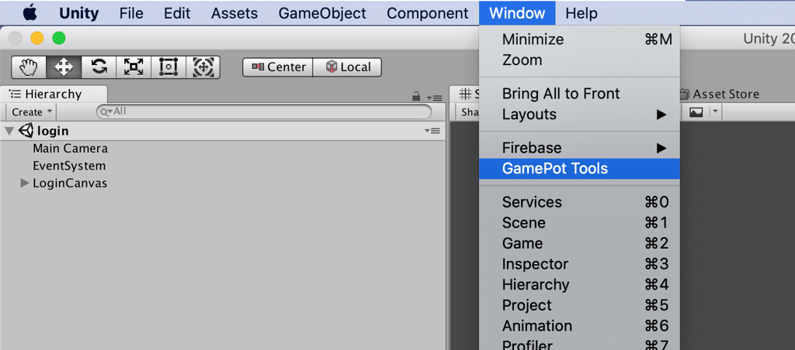
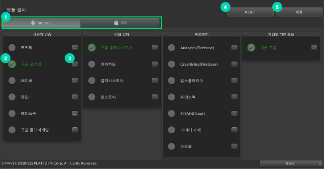

---
search:
  keyword:
    - gamepot
---

#### **为提供 NAVER CLOUD PLATFORM 产品的详细使用方法和 API 的多种使用方式，分别提供<a href="https://guide.ncloud-docs.com/docs/zh/home" target="_blank">[说明书]</a>和<a href="https://api.ncloud-docs.com/docs/zh/home" target="_blank">[API 参考指南]</a>以供参考。**

<a href="https://api.ncloud-docs.com/docs/zh/game-gamepot" target="_blank">进入 Gamepot API 参考指南 >></a> 
<a href="https://guide.ncloud-docs.com/docs/zh/game-gamepot-overview" target="_blank">进入 Gamepot 说明书 >></a>

# GamePot Tools - 测试

关于 NAVER CLOUD PLATFORM GAMEPOT 提供的 GamePot Tools 指南。

## GAMEPOT Tools 介绍

**Q. 什么是 GAMEPOT Tools？**

为一目了然地查看并管理通过 Unity 引擎开发游戏的过程中可能会发生的包依赖性问题，
由 GAMEPOT SDK 提供的一款相应管理工具。

可一键管理 GAMEPOT SDK 提供的现有库模块及各种第三方库。

还可以诊断、解决各平台、模块的包依赖性现状。

## 1. 开始

### 第一步.导入 GamePot Tools 插件

访问所创建的 GAMEPOT 仪表盘后，下载最新的插件。
 **其他 > 下载 SDK > Unity > 下载 GamePot Tools**

### 第二步. 导入插件

> Unity 版本须在 2017.4.x 以上。

在**Assets > Import Package > Custom Package**菜单中选择已下载的`GamePotTools_xxxx.unitypackage`文件。

检查插件后导入时，会添加到相应项目中。

### 第三步. Android/iOS

GamePot Tools 会要求各平台的命名空间，因此在已设置 Android/iOS 构建环境的状态下会正常运行。请在 Unity 编辑器中确认**File > Build Settings > Android/iOS**模块是否已全部下载。

## 2. 使用

点击**Window > GamePot Tools**标签即可运行 GamePot Tools。

① 可在网页上查看 GAMEPOT 指南。

② 可在网页上查看 NAVER CLOUD PLATFORM 指南。

③ 下载最少模块配置状态的 GamePot Sdk。

④ 可选择平台。（Android/iOS）

### Android 指纹工具

从当前项目中设置的 KeyStore 获取各种指纹。

点击**密钥工具**按钮。

> Unity 平台设置须更改为 Android。

① 确认当前项目 PlayerSetting 中设置的 KeyStore 信息。

② 获取 Sha1 指纹。

③ 获取 Base64 哈希。

④ 输入 APK 文件路径，获取哈希。

⑤ 跳转到 Android Studio 安装页面。

⑥ 跳转到 JDK 下载页面。

⑦ 跳转到保存通过 Install 功能删除的包的本地存储。

⑧ 跳转到保存缓存文件的本地存储。

### GAMEPOT 设置工具

管理 GamePot 的各种设置值。

#### Android

设置有关 Android Bulid 的 Gamepot 项目环境。
在`Android > mainTemplate.gradle`中反映。

#### IOS

设置有关 IOS Bulid 的 Gamepot 项目环境。
在`IOS > GamePotConfig-info.plist`中反映。

### 模块安装

按平台管理模块与库。

① 可选择平台。（Android/iOS）

② 可选择想在项目内配置的模块。已配置的模块会维持激活状态。

③ 可查看相应模块的依赖性包列表，查看项目内的现状。

④ 删除并初始化 GAMEPOT SDK 及相关的所有包。

⑤ 对于所选模块列表，配置所需的依赖性包。

- 最初选择模块时，黄色代表着“依赖性包兼容性未完成”。此时，须通过“解决”功能调整包兼容性。（部分第三方模块需要提前先执行 Android Play Resolver。）

#### 包安装

- 项目内没有相应包，所以在 CDN 服务器中下载。

- 本地没有包的情况。在显示路径下进行下载。

- 存在重复包的情况。只保留推荐版本的包，其余都删除。

- 已安装推荐版本包的情况。维持当前状态。
   再次点击所有“已选中”按钮取消选中时，可以删除现有包并在 CDN 服务器中重新下载。

- 点击安装按钮时，开始解析包。

- 完成解析后，相应模块项目会变成绿色。

### 更改语言

- GamePot Tools 的语言会更改为所选语言。支持英语、韩语、日语、中文。

