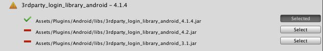

---
search:
  keyword:
    - gamepot
---

# GamePot Tools - Beta

> ### 这是机器翻译的文档，可能在词汇，语法或语法上有错误。 我们很快会为您提供由专业翻译人员翻译的文档。
>
> #### 如有任何疑问，请[联系我们](https://www.ncloud.com/support/question)。
>
> 我们将尽一切努力进一步改善我们的服务。

这是 NAVER CLOUD PLATFORM 的 GAMEPOT 提供的 GamePot 工具指南。

## GAMEPOT 工具简介

**问 什么是 Gamepot 工具？**

可以一目了然地识别和管理通过 Unity 引擎进行游戏开发期间可能发生的程序包相关性问题。
这是 GAMEPOT SDK 提供的管理工具。

除了 GAMEPOT SDK 提供的现有库模块之外，您还可以一键管理各种第三方库。

您可以诊断和解决每个平台和模块的程序包依赖状态。

## 1. 开始吧

### Step 1. 获取 GamePot Tools 插件

连接到创建的 GAMEPOT 仪表板并下载最新的插件。
  **其他>下载 SDK> Unity>下载 GamePot 工具**

### 步骤 2.导入插件

> Unity 版本 2017.4.x 或更高版本。

**Assets &gt; Import Package &gt; Custom Package** 从菜单中选择下载的`GamePotTools_xxxx.unitypackage`文件。

检查插件并将其导入以将其添加到项目中。

### Step 3. Android/iOS

就 GamePot 工具而言，因为它需要每个平台一个名称空间，所以它可以与 Android / iOS 构建环境集一起正常使用。 请检查**File> Build Settings> Android / iOS**模块是否都已在 Unity Editor 中下载。

## 2. 使用

**Window > GamePot Tools** 单击选项卡以启动 GamePot 工具。

① 检查 GamePot Tools 的版本，并在更新最新版本时执行更新。

② 您可以在网页上查看游戏机指南。

③ 您可以在网页上查看《 Naver Cloud Platform 指南》。

④ 下载配置了最小模块的 GamePot Sdk。

### Android 指纹工具

从当前项目中的 KetStore 中获取各种指纹。

点击**关键工具**按钮。

> Unity 平台设置应更改为 Android。

① 检查在当前项目的 PlayerSetting 中设置的 KeyStore 信息。

② 获取 Sha1 指纹。

③ 获取 Base64 哈希。

④ 输入 APK 文件的路径并获取哈希。

⑤ 转到 Android Studio 安装页面。

⑥ 转到 JDK 下载页面。

⑦ 它会移动到本地存储，通过“安装”功能保存已删除的软件包。

⑧ 移动到存储缓存数据的本地存储。

### Gamepot 设置工具

它管理 GamePot 的各种设置。

#### Android

为 Android Bulid 设置 Gamepot 项目环境。
它反映在`Android> mainTemplate.gradle`中。

#### IOS

IOS Bulid 的 Gamepot 项目环境。
它反映在`IOS> GamePotConfig-info.plist`中。

### 模块安装

管理平台特定的模块和库。

① 可以选择平台。 （Android / iOS）

② 您可以在项目中选择要配置的模块。 对于已经配置的模块，它们保持活动状态。

③ 您可以检查模块的依赖包列表，并检查项目中的状态。

④ 对于选定的模块列表，配置所需的依赖程序包。

#### 安装软件包

- 由于项目中没有相应的软件包，请从 CDN 服务器下载它。

- 存在重复的软件包。 仅保留推荐版本的软件包，其余的将被删除。

- 已安装该软件包的最新版本。 保持最新状态。
   如果再次单击“选定”按钮以取消选择它，则可以删除现有软件包，然后从 CDN 服务器再次下载。

当您单击安装按钮时，软件包解析将开始。

### 改变语言

GamePot 工具的语言将更改为您选择的语言。 支持英语，韩语，日语和中文。

