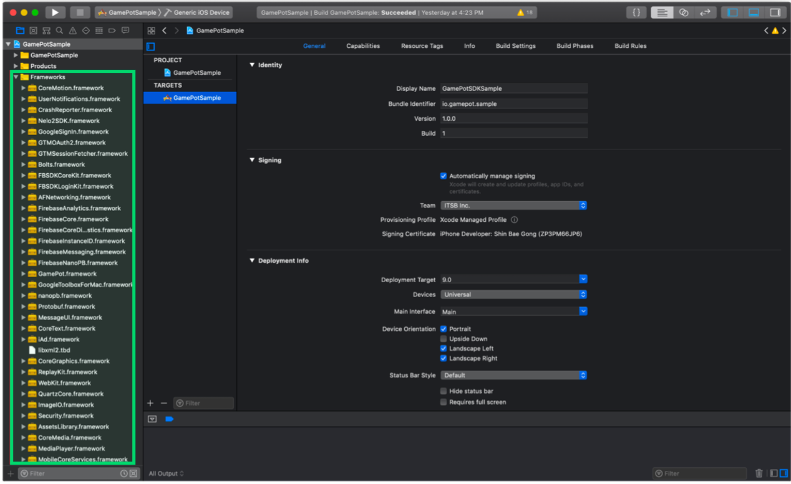

---
search:
  keyword:
    - gamepot
---

# iOS SDK

## 1. 开始

#### 第一步. 配置开发环境

为开发用于iOS的应用程序，需要安装开发工具\(Xcode\)。在iOS中使用GAMEPOT时需要的系统环境如下。

* 操作系统：iOS 10.0以上
* 开发环境：Xcode

#### 第二步. 添加框架



用鼠标拖拽已下载的iOS SDK文件，将其添加到Xcode项目目标文件夹内。

#### 第三步. 添加依赖

所需的依赖列表因要使用的服务而异。

参考以下表格，根据服务添加依赖。

各类服务的依赖

| 服务| 框架| 依赖| 捆绑|
| :--- | :--- | :--- | :--- |
| 基本\(Base\)| AFNetworking.framework FirebaseAnalytics.framework FirebaseCore.framework FirebaseCoreDiagnostics.framework FirebaseInstanceID.framework FirebaseMessaging.framework FirebaseNanoPB.framework GamePot.framework GoogleToolboxForMac.framework nanopb.framework Protobuf.framework| libz.tbd WebKit.framework UserNotifications.framework| GamePot.bundle|
| 登录\(Login\)| \[ 基本 \]<br>GamePotChannel.framework <br><br>\[ Google登录 \]<br>GamePotGoogleSignIn.framework GoogleSignIn.framework GoogleSignInDependencies.framework  <br><br>\[ Facebook \] <br>FBSDKCoreKit.framework FBSDKLoginKit.framework GamePotFacebook.framework<br><br>\[ LINE \]<br>GamePotLine.framework LineSDK.framework LineSDKObjC.framework<br><br>\[ NAVER \]<br>GamePotNaver.framework NaverThirdPartyLogin.framework<br><br>\[ Twitter \]<br>GamePotTwitter.framework<br>TwitterKit.framework \(通过Dynamic Library添加\)<br>TwitterCore.framework \(通过Dynamic Library添加\)| \[ Google登录 \] AuthenticationServices.framework LocalAuthentication.framework<br><br>\[ Facebook \] SafariServices.framework<br><br>\[ LINE \]<br>SafariServices.framework<br><br>\[ Twitter \]SafariServices.framework| \[ Google登录 \]GoogleSignIn.bundle|
| GameCenter| GamePotGameCenter.framework|  |  |
| AppleID| GamePotApple.framework|  |  |


#### 第四步. 添加Bundle Resource

根据要使用的服务，需要添加Bundle Resource文件。

参考各类服务的依赖表，添加Bundle Resource文件。


#### 第五步. 添加InfoPlist


GAMEPOT SDK使用Google Firebase。因此，需要在项目中添加设置Google Firebase时创建的GoogleService-Info.plist。

还要添加包含GAMEPOT SDK默认设置值的GamePotConfig-Info.plist文件。如果没有GamePotConfig-Info.plist文件，创建同名文件后输入与该键对应的值。

**GamePotConfig-Info.plist设置**


```markup
gamepot_project_id：GAMEPOT项目ID
gamepot_elsa_projectid：GAMEPOT日志项目ID（可选）
```

#### 第六步. 添加构建选项

在**Build Settings > Linking > Other Linker Flags**区段中添加-ObjC选项。


#### 第七步. 修改Info.plist

请在Targets >> Info >> Custom iOS Target Properties中添加以下用户权限获取选项。

该用户权限在GamePot客服中心内的文件上传功能中使用。

```text
NSCameraUsageDescription
NSPhotoLibraryUsageDescription
```

#### 第八步. 设置Google登录环境

参考各服务依赖表的**Login > Google登录**，添加框架与依赖。

复制GoogleService-Info.plist文件的`REVERSED_CLIENT_ID`值，在**Info > URL Types**中添加项目，并在URL Schemes中输入值。


**GamePotConfig-Info.plist设置**


```markup
gamepot_google_app_id：GoogleService-Info.plist文件的CLIENT_ID值
gamepot_google_url_schemes：GoogleService-Info.plist文件的REVERSED_CLIENT_ID值
```

#### 第九步. 设置Facebook登录环境

参考各服务依赖表的**Login > Facebook**，添加框架与依赖。

以fb+Facebook App ID格式在**Info > URL Types**中添加Facebook App ID。


在**Info > iOS Target Property**的**LSApplicationQueriesSchemes**中添加以下项目。

* fbapi
* fb-messenger-share-api
* fbauth2
* fbshareextension


**GamePotConfig-Info.plist设置**


```markup
gamepot_facebook_app_id : Facebook App ID
gamepot_facebook_display_name : Facebook display name
```

#### 第十步. 设置LINE登录环境

**GamePotConfig-Info.plist设置**

```markup
gamepot_line_channelid : Line Channel ID
gamepot_line_url_schemes : Line URL Scheme (line3rdp.{项目捆绑 ID})
```

#### 第十一步. 设置Twitter登录环境

**GamePotConfig-Info.plist设置**

```markup
gamepot_twitter_consumerkey : Twitter Consumer Key
gamepot_twitter_consumersecret :  Twitter Consumer Secret
```

#### 第十二步.设置Naver登录环境

**GamePotConfig-Info.plist设置**

```text
gamepot_naver_clientid : Naver Client Id
gamepot_naver_secretid : Naver Secret Id
gamepot_naver_urlscheme : Naver Url Scheme
```

在**Info > iOS Target Property**的**LSApplicationQueriesSchemes**中添加以下项目。

* naversearchapp
* naversearchthirdlogin
* navercafe

在**Info > URL Types**中添加在gamepot\_naver\_urlscheme中输入的值。

#### 第十三步.设置AppleID登录环境

添加**Xcode > TARGETS > Signing & Capabilities > + Capability > Sign In with Apple。**

## 2. 初始化

在AppDelegate文件中添加下列部分。

```text
#import <GamePot/GamePot.h>

- (BOOL)application:(UIApplication *)application didFinishLaunchingWithOptions:(NSDictionary *)launchOptions {
    ...
    // GamePot SDK Initialize
    [[GamePot getInstance] setup];

    // Push Permission
    if(SYSTEM_VERSION_GRATERTHAN_OR_EQUALTO(@"10.0"))
    {
        UNUserNotificationCenter *center = [UNUserNotificationCenter currentNotificationCenter];
        center.delegate = self;
        [center requestAuthorizationWithOptions:(UNAuthorizationOptionSound | UNAuthorizationOptionAlert | UNAuthorizationOptionBadge) completionHandler:^(BOOL granted, NSError * _Nullable error){
            if(!error){
                dispatch_async(dispatch_get_main_queue(), ^{
                    [[UIApplication sharedApplication] registerForRemoteNotifications];
                });
            }
        }];
    }
    else
    {
        // Code for old versions
        UIUserNotificationType allNotificationTypes = (UIUserNotificationTypeSound | UIUserNotificationTypeAlert | UIUserNotificationTypeBadge);
        UIUserNotificationSettings *settings = [UIUserNotificationSettings settingsForTypes:allNotificationTypes categories:nil];
        [application registerUserNotificationSettings:settings];
        [application registerForRemoteNotifications];
    }
    ...
}

 // Push
- (void)application:(UIApplication *)application didRegisterForRemoteNotificationsWithDeviceToken:(NSData *)deviceToken
{
    ...
    [[GamePot getInstance] handleRemoteNotificationsWithDeviceToken:deviceToken];
    ...
}

- (void)applicationWillEnterForeground:(UIApplication *)application {
    [[GamePotChat getInstance] start];
}

- (void)applicationDidEnterBackground:(UIApplication *)application {
    [[GamePotChat getInstance] stop];
}
```

## 3. 登录、退出登录、注销会员

可统一使用Google、Facebook、Naver等各种登录SDK。

#### 第一步. 设置

```text
// AppDelegate.m
#import <GamePotChannel/GamePotChannel.h>

// 使用Google登录时
#import <GamePotGoogleSignIn/GamePotGoogleSignIn.h>

// 使用Facebook登录时
#import <GamePotFacebook/GamePotFacebook.h>

// 使用AppleID登录时
#import <GamePotApple/GamePotApple.h>

// 使用Line登录时
#import <GamePotLine/GamePotLine.h>

// 使用Twitter登录时
#import <GamePotTwitter/GamePotTwitter.h>

// 使用Naver登录时
#import <GamePotNaver/GamePotNaver.h>

- (BOOL)application:(UIApplication *)application didFinishLaunchingWithOptions:(NSDictionary *)launchOptions {
    ...
    // GamePotSDK渠道初始化。只能按要使用的渠道使用addChannel，
    // 默认包括Guest方式。
    // Google登录初始化
    GamePotChannelInterface* google     = [[GamePotGoogleSignIn alloc] init];
    [[GamePotChannelManager getInstance] addChannelWithType:GOOGLE interface:google];

    // Facebook登录初始化
    GamePotChannelInterface* facebook   = [[GamePotFacebook alloc] init];
    [[GamePotChannelManager getInstance] addChannelWithType:FACEBOOK interface:facebook];

    // AppleID登录初始化
    GamePotChannelInterface* apple      = [[GamePotApple alloc] init];
    [[GamePotChannel getInstance] addChannelWithType:APPLE interface:apple];

    // Line登录初始化
    GamePotChannelInterface* line = [[GamePotLine alloc] init];
    [[GamePotChannel getInstance] addChannelWithType:LINE interface:line];

    // Twitter登录初始化
    GamePotChannelInterface* twitter = [[GamePotTwitter alloc] init];
    [[GamePotChannel getInstance] addChannelWithType:TWITTER interface:twitter];

      // Naver登录初始化
      GamePotChannelInterface* naver = [[GamePotNaver alloc] init];
      [[GamePotChannel getInstance] addChannelWithType:NAVER interface:naver];

    // 进行登录处理时需要。
    [[GamePotChannel getInstance] application:application didFinishLaunchingWithOptions:launchOptions];

    ...
}

- (BOOL)application:(UIApplication *)app openURL:(NSURL *)url options:(NSDictionary<UIApplicationOpenURLOptionsKey,id> *)options
{
    // 进行登录处理时需要。
    BOOL nChannelResult = [[GamePotChannel getInstance] application:app openURL:url options:options];
    return nChannelResult;
}
```

#### 第二步. 登录

点击登录按钮时关联。

```text
#import <GamePotChannel/GamePotChannel.h>
// 定义登录类型
// GamePotChannelType.GOOGLE
// GamePotChannelType.FACEBOOK
// GamePotChannelType.GUEST
// GamePotChannelType.LINE
// GamePotChannelType.TWITTER
// GamePotChannelType.NAVER
// GamePotChannelType.APPLE

// 点击Google登录按钮时调用
[[GamePotChannel getInstance] Login:GOOGLE viewController:self success:^(GamePotUserInfo* userInfo) {
    // 登录成功
} cancel:^{
    // 尝试登录过程中用户取消时
} fail:^(NSError *error) {
    // 登录过程中发生错误
    // TODO: 请通过游戏弹窗显示失败原因相关语句。
    // TODO: 请使用[error localizedDescription]语句。
}];
```

#### 第三步. 自动登录

GAMEPOT支持自动登录。

```text
#import <GamePotChannel/GamePotChannel.h>

// 获取最后一次登录的信息并调用，以便使用该信息自动登录。
// lastLoginType：可以获取最后一次登录值。
GamePotChannelType type = [[GamePotChannel getInstance] lastLoginType];

if(type != NONE)
{
    // 以用户最后一次的登陆方式进行登录。
    // 处理自动登录时如下调用即可。
    [[GamePotChannel getInstance] Login:type viewController:self success:^(GamePotUserInfo* userInfo) {

    } cancel:^{

    } fail:^(NSError *error) {
        // TODO: 请通过游戏弹窗显示失败原因相关语句。
        // TODO: 请使用[error localizedDescription]语句。
    }];
}
else
{
    // 没有最后登录信息。跳转到有登录按钮的登录界面
}
```

#### 第四步. 退出登录

使当前会员账户退出登录。

```text
#import <GamePotChannel/GamePotChannel.h>

[[GamePotChannel getInstance] LogoutWithSuccess:^{
    // 成功退出登录后跳转到初始页面。
} fail:^(NSError *error) {
    // 显示退出登录失败的错误消息。
    // TODO: 请通过游戏弹窗显示失败原因相关语句。
    // TODO: 请使用[error localizedDescription]语句。
}];
```

#### 第五步. 注销会员

注销当前登录的会员账户。

```text
#import <GamePotChannel/GamePotChannel.h>

[[GamePotChannel getInstance] DeleteMemberWithSuccess:^{
    // 会员注销成功，跳转到登录页面
} fail:^(NSError *error) {
    // 会员注销失败
    // TODO: 请通过游戏弹窗显示失败原因相关语句。
    // TODO: 请使用[error localizedDescription]语句。
}];
```

#### 第六步. 验证

登录成功后，登录信息从开发公司服务器传递至GAMEPOT服务器后，开始进行登录验证。

详细说明请参考`Server to server api`菜单中的`Authentication check`项目。

## 4. 账户关联

该功能可以将多个社交账户\(Google、Facebook等\)与一个游戏账户关联或解除关联。\(至少关联一个社交账户。\)

在游戏中实现关联页面UI，按下关联按钮时调用以下代码。

#### 第一步. 关联账户

可用Google、Facebook等ID关联账户。

```text
#import <GamePotChannel/GamePotChannel.h>

// 定义类型
// GamePotChannelType.GOOGLE
// GamePotChannelType.FACEBOOK
// GamePotChannelType.LINE
// GamePotChannelType.TWITTER
// GamePotChannelType.NAVER
// GamePotChannelType.APPLE

[[GamePotChannel getInstance] CreateLinking:GOOGLE viewController:self success:^(GamePotUserInfo *userInfo) {
    // TODO: 关联成功，请通过游戏弹窗显示关联结果相关语句。（例如：账户关联成功。）
} cancel:^{
    // TODO: 用户取消时
} fail:^(NSError *error) {
    // TODO: 关联失败。请通过游戏弹窗显示关联失败原因相关语句。
    // TODO: 请使用[error localizedDescription]语句。
}];
```

#### 第二步. 已关联列表

可以通过相应API确认是否关联账户。

```text
#import <GamePotChannel/GamePotChannel.h>

// 定义类型
// GamePotChannelType.GOOGLE
// GamePotChannelType.FACEBOOK
// GamePotChannelType.LINE
// GamePotChannelType.TWITTER
// GamePotChannelType.NAVER
// GamePotChannelType.APPLE

// 返回各类型的关联结果。 
BOOL isGoogleLinked = [[GamePotChannel getInstance] isLinked:GOOGLE];

// 对已关联的类型，以JsonString格式返回。
NSString* linkedList = [[GamePotChannel getInstance] getLinkedListJsonString];
```

#### 第三步. 解除关联

解除当前关联账户。

```text
#import <GamePotChannel/GamePotChannel.h>

[[GamePotChannel getInstance] DeleteLinking:GOOGLE success:^{
     // TODO: 解除成功。请通过游戏弹窗显示关联结果相关语句。（例如：已解除账户关联。）
} fail:^(NSError *error) {
     // TODO: 解除失败。请通过游戏弹窗显示解除失败原因相关语句。
     // TODO: 请使用[error localizedDescription]语句。
}];
```

## 5. 支付

#### 第一步. 设置

付款结果值以Delegate形式实现。因此请如下添加Delegate。

```text
#import <GamePot/GamePot.h>

@interface ViewController () <GamePotPurchaseDelegate>
@end
@implementation ViewController

- (void)viewDidLoad
{
    ...
    [[GamePot getInstance] setPurchaseDelegate:self];
    ...
}

- (void)GamePotPurchaseSuccess:(GamePotPurchaseInfo *)_info
{
    // 付款成功

    // 用于在广告平台投放付款活动的代码，使用广告时请务必!插入。
    [[GamePotAd getInstance] tracking:BILLING obj:_info];
}

- (void)GamePotPurchaseFail:(NSError *)_error
{
    // 付款错误
    // TODO: 请通过游戏弹窗显示失败原因相关语句。
    // TODO: 请使用[error localizedDescription]语句。
}

- (void)GamePotPurchaseCancel
{
    // 启动付款过程中取消
    // 通过游戏弹窗显示“付款已被取消”语句。
}
@end
```

#### 第二步. 尝试付款

```text
事例一：一般性支付时

#import <GamePot/GamePot.h>

// productid：输入商店中添加的商品ID。
[[GamePot getInstance] purchase:productid];
```

```text
事例二：想单独管理支付时发行的发票号时：

#import <GamePot/GamePot.h>

// productId : 输入在商店中添加的商品ID即可。
// uniqueId  : 加入单独管理的发票号即可。
[[GamePot getInstance] purchase:productid uniqueId:uniqueid];
```

```text
事例三：想要向webhook传递支付时进行的发票号/服务器ID/角色ID/其他信息时：

#import <GamePot/GamePot.h>

// productId : 输入在商店中添加的商品ID即可。
// uniqueId  : 加入单独管理的发票号即可。
// serverId  : 输入进行支付的角色的服务器ID即可。
// playerId  : 输入进行支付的角色的角色ID即可。
// etc       : 输入进行支付的角色的其他信息即可。
[[GamePot getInstance] purchase:productid uniqueId:uniqueid serverId:serverid playerId:playerid etc:etc]];
```

#### 第三步. **获取付款道具列表**

可以获取商店提供的应用内道具列表。

```text
NSArray<SKProduct*>* itemList = [[GamePot getInstance] getDetails];

// 根据设备设置获取货币价格时
[[GamePot getInstance] getLocalizePrice:[product productIdentifier]];
```

#### 第四步. 发放付款道具

因为GAMEPOT在通过Server to server api完成对支付商店发票的验证后才向开发公司服务器发出发放请求，所以不可能存在非法支付。

为此，需要参考`Server to server api`菜单的`Purchase`项目进行处理。

## 6. 其他API

### 优惠券

使用用户输入的优惠券时请调用以下代码。

> 请开发公司实现优惠券输入页面UI。

```text
#import <GamePot/GamePot.h>

[[GamePot getInstance] coupon:/*用户输入的优惠券*/ handler:^(BOOL _success, NSError *_error) {
    if(_success)
    {
        // TODO: message中返回优惠券使用相关结果。请在游戏弹窗中显示该消息。
    }
    else
    {
        // TODO: _error中返回优惠券使用失败原因相关信息。
        // 请通过游戏弹窗显示[_error localizedDescription]的内容。
    }
}];
```

#### 发放道具

如果优惠券使用成功，会通过Server to server api向开发公司的服务器请求发放道具。

为此，需要参考`Server to server api`菜单的`Item`项目进行处理。

### 推送

```text
#import <GamePot/GamePot.h>

// 开启/关闭接收推送
[[GamePot getInstance] setPushEnable:YES success:^{

} fail:^(NSError *error) {

}];

// 开启/关闭接收夜间推送
[[GamePot getInstance] setNightPushEnable:YES success:^{

} fail:^(NSError *error) {

}];

// 一次性设置推送/夜间推送
// 如果是登录前需要获得推送/夜间推送权限的游戏，登录后必须调用以下代码。
[[GamePot getInstance] setPushStatus:YES night:YES ad:YES success:^{
    <#code#>
} fail:^(NSError *error) {
    <#code#>
}];
```

### 公告事项

显示仪表盘-公告事项中所上传图像的功能。

#### 调用

```text
[[GamePot getInstance] showNotice:/*viewController*/ setSchemeHandler:^(NSString *scheme) {
    NSLog(@"scheme = %@", scheme);
}];
```

### 客服中心

这是与仪表盘-客服中心关联的用户与运营者之间的沟通渠道。

客户咨询UI会根据设备语言更改。支持韩语、英语、日语、中文（简体、繁体），其他语言显示英语。

#### 调用

```text
[[GamePot getInstance] showHelpWebView:(UIViewController *)];
```

支持外部链接，未登录的客户也可以提交咨询事项。

#### 调用

```text
// showWebView Type
    // WEBVIEW_NORMAL // 没有返回按钮。
    // WEBVIEW_NORMALWITHBACK // 有返回按钮

    [[GamePot getInstance] showWebView:/*当前ViewController*/ setType:/*Type*/ setURL:/*外部咨询访问URL*/];
```

### 本地推送\(Local Push notification\)

不通过推送服务器，在终端自主显示推送的功能。

#### 调用

#### 添加推送

在规定时间显示本地推送的方法如下。

> 作为返回值传递的pushid由开发公司管理。

```text
 NSDateFormatter* formatter = [[NSDateFormatter alloc] init];
 [formatter setDateFormat:@"yyyy-MM-dd HH:mm:ss"];

 NSString* strDate = [formatter stringFromDate:[[NSDate date] dateByAddingTimeInterval:30]];

 int pushId  = [[GamePot getInstance] sendLocalPush:@"Title" setMessage:@"Message" setDateString:strDate];
```

#### 取消已添加的推送

可以根据添加推送时获取的pushid取消已添加的推送。

```text
[[GamePot getInstance] cancelLocalPush:(int)pushId];
```

### 检查、强制更新

需要检查或强制更新功能时，在仪表盘-操作中激活时可启动。

#### 调用

可在之前已应用的以下API中使用。

#### 1. 登录API

```text
[[GamePotChannel getInstance] Login:GAMECENTER viewController:self
    success:^(GamePotUserInfo* userInfo) {
            // 登录成功，请按游戏逻辑处理。
    } cancel:^{
            // 用户取消登录时的情况。
    } fail:^(NSError *error) {
            // 登录失败。请使用[error localizedDescription]显示错误消息。
    } update:^(GamePotAppStatus *appStatus) {
        // TODO: 需要强制更新时。调用以下API，可在SDK中直接弹出窗口。
        // TODO: 需要定制时，不调用以下API、直接进行定制即可。
        [[GamePot getInstance] showAppStatusPopup:self setAppStatus:appStatus
         setCloseHandler:^{
            // TODO: 调用showAppStatusPopup API时，在需要结束应用时调用。
            // TODO: 请处理结束进程。
        } setNextHandler:^(NSObject* resultPayload) {
            // TODO : 在仪表盘更新设置中建议设置时，显示"下次进行"按钮。
            // 用户选择该按钮时调用。
            // TODO : 请与使用resultPayload信息成功登录时做出同样的处理。
            // GamePotUserInfo* userInfo = (GamePotUserInfo*)resultPayload;

        }];
    } maintenance:^(GamePotAppStatus *appStatus) {
          // TODO: 检查中时：调用以下API，可在SDK中直接弹出窗口。
        // TODO: 需要定制时，不调用以下API、直接进行定制即可。
        [[GamePot getInstance] showAppStatusPopup:self setAppStatus:appStatus
         setCloseHandler:^{
            // TODO: 调用showAppStatusPopup API时，在需要结束应用时调用。
            // TODO: 请处理结束进程。
        }];
    }];
```

### 同意条款

提供UI以便能迅速收到“使用条款”和“个人信息收集与使用指南”同意。

提供`BLUE`和`GREEN`两种主题，还可以按各区域定制。

- `BLUE`主题示例


- `GREEN`主题示例


#### 调用条款同意

> 请开发公司根据游戏决定是否显示条款同意弹窗。
>
> 点击“查看”按钮时显示的内容可以在仪表盘中应用和修改。

```text
// 蓝色主题[[GamePotAgreeOption alloc] init:BLUE];
// 绿色主题[[GamePotAgreeOption alloc] init:GREEN];
GamePotAgreeOption* option = [[GamePotAgreeOption alloc] init:BLUE];
[[GamePot getInstance] showAgreeView:self option:option handler:^(GamePotAgreeInfo *result) {
   // [result agree]：同意全部强制条款时为true
   // [result agreeNight]：勾选同意夜间接收广告类消息时为true，否则为false
   // agreeNight值请于成功登录后通过[[GamePot getInstance] setNightPushEnable]; api
   // 传递。
}];
```

#### 定制

不使用主题，根据游戏更改颜色。

调用条款同意之前，可在`GamePotAgreeOption`指定各区域的颜色。

```text
 GamePotAgreeOption* option = [[GamePotAgreeOption alloc] init:GREEN];

[option setHeaderBackGradient:@[@0xFF00050B,@0xFF0F1B21]];
[option setHeaderTitleColor:0xFF042941];
[option setContentBackGradient:@[@0xFF112432,@0xFF112432]];
[option setContentIconColor:0xFF042941];
[option setContentCheckColor:0xFF91adb5];
[option setContentTitleColor:0xFF98b3c6];
[option setContentShowColor:0xFF98b3c6];
[option setFooterBackGradient:@[@0xFF112432,@0xFF112432]];
[option setFooterButtonGradient:@[@0xFF1E3A57,@0xFF57B2E2]];
[option setFooterButtonOutlineColor:0xFF0b171a];
[option setFooterTitleColor:0xFFFFFFD5];

// 更改语句
[option setAllMessage:@"全部同意"];
[option setTermMessage:@"必选）使用条款"];
[option setPrivacyMessage:@"必选）个人信息处理方针"];
[option setNightPushMessage:@"可选）同意接收夜间推送"];
[option setFooterTitle:@"开始游戏"];

// 未使用时设置为@""
[option setHeaderTitle:@"同意条款"];

// 是否显示“同意夜间接收广告类消息”按钮
[option setShowNightPush:YES];
```

各个变量将应用到以下区域。

> contentIconDrawable的图像不在IOS中显示。


### 使用条款

调用使用条款UI。

> 请先在仪表盘 - 客户支持 - 使用条款设置项目中输入内容。

```java
#import <GamePot/GamePot.h>

[[GamePot getInstance] showTerms:/*ViewController*/];
```


### 个人信息处理方针

调用个人信息处理方针UI。

> 请先在仪表盘 - 客户支持 - 个人信息处理方针设置项目中输入内容。

```java
#import <GamePot/GamePot.h>

[[GamePot getInstance] showPrivacy:/*ViewController*/];
```


### 退款规定

调用退款规定UI。

> 请先在仪表盘 - 客户支持 - 退款规定设置项目中输入内容。

```java
#import <GamePot/GamePot.h>

[[GamePot getInstance] showRefund:/*ViewController*/];
```


### 远程配置

从客户端获取已添加到仪表盘的参数值。
    
> 请先在仪表盘 - 设置 - 远程配置界面添加参数。

添加的参数会在登录时加载，之后可以调用。

```java
#import <GamePot/GamePot.h>

//key : 参数字符串
NSString *str_value = [[GamePot getInstance] getConfig:(NSString*)key];

//以json格式获取已添加到仪表盘的所有参数。
NSArray *json_value = [[GamePot getInstance] getConfigs];
```

### 发送游戏日志

添加游戏中使用的信息并调用时，可在`仪表盘` - `游戏`中查询。

下面是可使用的保留字定义表。

| 保留字| 必选| 类型| 描述|
| :-------------------------------- | :--- | :----- | :----------- |
| GamePotSendLogCharacter.NAME| 必选| 字符串| 角色名|
| GamePotSendLogCharacter.LEVEL| 可选| 字符串| 等级|
| GamePotSendLogCharacter.SERVER_ID| 可选| 字符串| 服务器ID|
| GamePotSendLogCharacter.PLAYER_ID| 可选| 字符串| 角色ID|
| GamePotSendLogCharacter.USERDATA| 可选| 字符串| 其他|

```java
#import <GamePot/GamePotSendLog.h>
#import <GamePot/GamePotSendLogCharacter.h>
  
GamePotSendLogCharacter* info = [[GamePotSendLogCharacter alloc] init];
    
[info put:@"name" forKey:GAMEPOT_NAME];
[info put:@"playerid" forKey:GAMEPOT_PLAYER_ID];
[info put:@"serverid" forKey:GAMEPOT_SERVER_ID];
[info put:@"level" forKey:GAMEPOT_LEVEL];
[info put:@"userdata" forKey:GAMEPOT_USERDATA];

BOOL result = [GamePotSendLog characterInfo:info];

// Result is TRUE : validation success.Logs will send to GamePot Server
// Result is FALSE : validation was failed.Please check logcat

```

## 7. 下载

可以在GAMEPOT仪表盘的**下载SDK**菜单下载SDK。

# 附录

### 支持第三方SDK关联

TODO : 描述

## 登录

TODO : 描述

> 不支持自动登录。需要每次调用。

| 参数名称| 必选| 类型| 描述|
| :------------- | :--- | :--------------- | :------------------------ |
| viewController| 必选| UIViewController| 当前ViewContoller|
| userid| 必选| NSString| 玩家唯一ID|
| success| 必选| 字符串| 成功时回调|
| fail| 必选| 字符串| 失败时回调|
| update| 可选| 字符串| 更新功能运行时回调|
| maintenance| 可选| 字符串| 检查功能运行时回调|

```text
NSString userid = @"memberid of 3rd party sdk";

[[GamePotChannel getInstance] loginByThirdPartySDK:self uId:userid success:^(GamePotUserInfo* userInfo) {
    // 登录成功，请按游戏逻辑处理。
} cancel:^{
    // 用户取消登录时的情况。
} fail:^(NSError *error) {
    // 登录失败。请使用[error localizedDescription]显示错误消息。
} update:^(GamePotAppStatus *appStatus) {
    // TODO: 需要强制更新时。调用以下API，可在SDK中直接弹出窗口。
    // TODO: 需要定制时，不调用以下API、直接进行定制即可。
    [[GamePot getInstance] showAppStatusPopup:self setAppStatus:appStatus
        setCloseHandler:^{
        // TODO: 调用showAppStatusPopup API时，在需要结束应用时调用。
        // TODO: 请处理结束进程。
    } setNextHandler:^(NSObject* resultPayload) {
        // TODO : 在仪表盘更新设置中建议设置时，显示"下次进行"按钮。
        // 用户选择该按钮时调用。
        // TODO : 请与使用resultPayload信息成功登录时做出同样的处理。
        // GamePotUserInfo* userInfo = (GamePotUserInfo*)resultPayload;

    }];
} maintenance:^(GamePotAppStatus *appStatus) {
    // TODO: 检查中时：调用以下API，可在SDK中直接弹出窗口。
    // TODO: 需要定制时，不调用以下API、直接进行定制即可。
    [[GamePot getInstance] showAppStatusPopup:self setAppStatus:appStatus
        setCloseHandler:^{
        // TODO: 调用showAppStatusPopup API时，在需要结束应用时调用。
        // TODO: 请处理结束进程。
    }];
}];
```

## 支付

TODO : 描述

> 付款道具须已在GamePot仪表盘中添加。

| 参数名称| 必选| 类型| 描述|
| :------------ | :--- | :------------------- | :------------------------------------- |
| productid| 必选| NSString| 添加到GamePot仪表盘的道具ID|
| transactionid| 必选| NSString| 付款发票号(xxxxxxxxxxx)|
| currency| 可选| NSString| 货币（KRW、USD）|
| price| 可选| NSDecimalNumber| 付款道具金额|
| paymentid| 可选| NSString| 支付商店（apple）|
| success| 可选| GamePotCommonSuccess| 成功时回调|
| fail| 可选| GamePotCommonFail| 失败时回调|

```text
NSString* productId = @"purchase_001";
NSString* transactionId = @"xxxxxxxxxxx";
NSString* currency = @"USD";
NSDecimalNumber* price = [[NSDecimalNumber alloc] initWithString:@"1.09"];
NSString* paymentId = "apple";
NSString* uniqueId = "developer unique id";

[[GamePot getInstance] sendPurchaseByThirdPartySDK:productId transactionId:transactionId currency:currency price:price paymentId:paymentId uniqueId:uniqueId success:^{
    // success
} fail:^(NSError *error) {
    // fail
}];
```
