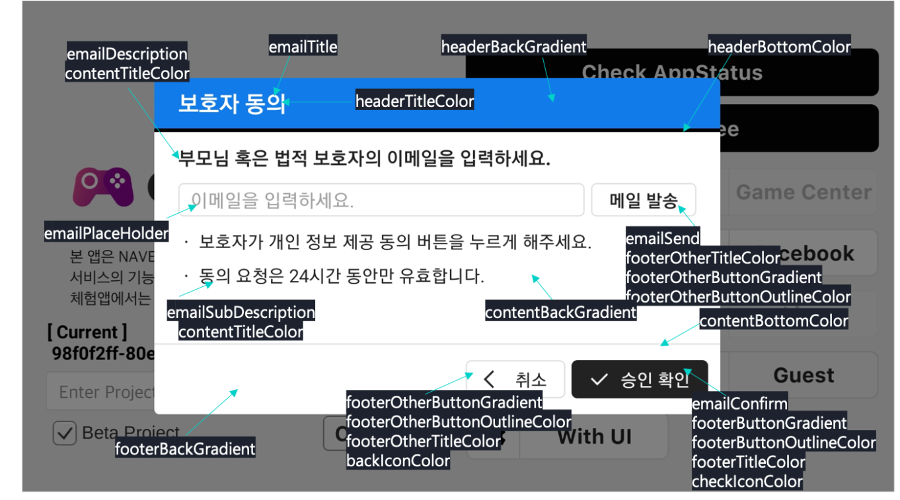

---
search:
  keyword:
    - gamepot
---

#### **为提供 NAVER CLOUD PLATFORM 产品的详细使用方法和 API 的多种使用方式，分别提供<a href="https://guide.ncloud-docs.com/docs/zh/home" target="_blank">[说明书]</a>和<a href="https://api.ncloud-docs.com/docs/zh/home" target="_blank">[API 参考指南]</a>以供参考。**

<a href="https://api.ncloud-docs.com/docs/zh/game-gamepot" target="_blank">进入 Gamepot API 参考指南 >></a><br />
<a href="https://guide.ncloud-docs.com/docs/zh/game-gamepot-overview" target="_blank">进入 Gamepot 说明书 >></a><br />
<a href="https://guide.ncloud-docs.com/docs/zh/game-gamepotios" target="_blank">进入 Gamepot iOS SDK 说明书 >></a>

下面将介绍用于开发iOS游戏的GAMEPOT iOS SDK使用方法。通过安装SDK并配置环境，可关联游戏和仪表盘。

## 配置要求<a name="요구사양"></a>

为使用iOS的GAMEPOT SDK，所需的配置要求如下。

- 最低配置：iOS 10.0以上
- 开发环境：Xcode

## SDK安装及环境配置<a name="SDK설치및환경구성"></a>

安装GAMEPOT iOS SDK后配置环境并关联GAMEPOT仪表盘和游戏，即可使用游戏开发所需的功能。

게임팟 SDK에서 지원 언어는 아래와 같습니다.
 - 영어, 이탈리아어,태국어,베트남어,일본어,중국어(간체/번체),인도네시아어,독일어,스페인어,프랑스어,한국어 

앱 실행시 기기 디바이스의 언어에 따라 SDK내 지원언어로 표기되며 미지원언어는 영어로 표기됩니다.
xcode >  localization에 적용하고자 하는 언어 추가를 해야 합니다.

빌드시 **버전 코드**는 정수형태로 유니크하게 증가하는 방식으로 진행 부탁드립니다.

### 安装SDK<a name="SDK설치"></a>

安装GAMEPOT iOS SDK后，在Xcode中配置项目的方法如下。

1. 请使用管理员账户登录仪表盘。
2. 依次点击**下载SDK > iOS**菜单后点击**下载**。
3. 运行Xcode后，开启游戏项目。
4. 解压下载的SDK文件后，拖放至已创建的项目文件夹。

### 添加Dependencies及Bundle Resource<a name="Dependencies및BundleResource추가"></a>

为使用SDK，如要在Xcode中按各类服务添加合适的Dependencies及Bundle Resource，请参考下表。

| Service | Framework | Dependencies | Bundle Resource |
| --- | --- | --- | --- |
| 基本（Base） | AFNetworking.framework<br>FirebaseAnalytics.framework <br>FirebaseCore.framework<br>FirebaseCoreDiagnostics.framework <br>FirebaseInstanceID.framework <br>FirebaseMessaging.framework <br>FirebaseNanoPB.framework <br>GamePot.framework <br>GoogleToolboxForMac.framework <br>nanopb.framework <br>Protobuf.framework | libz.tbd WebKit.framework<br>UserNotifications.framework | GamePot.bundle |
| 登录（Login） | **Base**<br>GamePotChannel.framework<br><br>**Google Sign In**<br>GamePotGoogleSignIn.framework <br>GoogleSignIn.framework <br>GoogleSignInDependencies.framework<br><br>**Facebook**<br>FBSDKCoreKit.framework <br>FBSDKLoginKit.framework <br>GamePotFacebook.framework<br><br>**LINE**<br>GamePotLine.framework <br>LineSDK.framework<br> LineSDKObjC.framework<br><br>**NAVER**<br>GamePotNaver.framework<br> NaverThirdPartyLogin.framework<br><br>**Twitter**<br>GamePotTwitter.framework<br>TwitterKit.framework （用Dynamic Library添加）<br>TwitterCore.framework（用Dynamic Library添加） | **Google Sign In**<br>AuthenticationServices.framework<br> LocalAuthentication.framework<br><br>**Facebook**<br>SafariServices.framework<br><br>**LINE**<br> SafariServices.framework<br><br>**Twitter**<br>SafariServices.framework | **Google Sign In**<br>GoogleSignIn.bundle |
| GameCenter | GamePotGameCenter.framework |     |     |
| AppleID | GamePotApple.framework |     |     |

### 添加并设置Information Property List<a name="InformationPropertyList추가및설정"></a>

为使用SDK需将Information Property List添加到Xcode后进行设置。

由于GAMEPOT iOS SDK使用Google Firebase，因此除了包含SDK默认值的Information Property List以外，同时要在项目中添加从Firebase控制台获取的Information Property List。

添加并设置Information Property List的方法如下。

1. 将下载的SDK文件中包含的GamePotConfig-Info.plist文件添加到项目中。
  
  - 如果相应文件不存在，请使用相同的名称创建文件后输入密钥对应的值。
2. 将Google Firebase控制台中获取的GoogleService-Info.plist文件添加到项目中。
  
3. 在Xcode添加的GamePotConfig-Info.plist中变更以下设置。
  
  - `gamepot_project_id`：GAMEPOT项目ID
  - `gamepot_elsa_projectid`：(可选) GAMEPOT日志项目ID
4. 依次点击**Targets > Info > Custom iOS Target Properties**菜单后，添加以下用户权限获取选项。
  
  - 该用户权限在GAMEPOT客服中心内的文件上传功能中使用。
    ```NSCameraUsageDescription```, ```NSPhotoLibraryUsageDescription```, ```NSMicrophoneUsageDescription```
    
    - 从iOS 14版本开始，改成了获取IDFA值时必须向用户请求权限才能获取IDFA值。 因此，为了在获取IDFA值时使用向用户请求权限的弹窗，请在Targets >> Info >> Custom iOS Target Properties中添加以下用户权限获取选项。 （必须添加关于收集目的与使用地点的说明。）
      ```NSUserTrackingUsageDescription```

5. 게임팟 대시보드 생성 리전이 싱가포르인 경우에만 다음 설정을 추가해 주십시오.
    * ```gamepot_region```: sg
6. 게임팟 대시보드 생성 리전이 일본인 경우에만 다음 설정을 추가해 주십시오.
    * ```gamepot_license_url```: https://gamepot.apigw.ntruss.com/fw/jp-v1

### 添加Build Settings选项<a name="BuildSettings옵션추가"></a>

为使用SDK需在Xcode Build Settings添加`-ObjC -lz -lstdc++ -lc++`选项。

如要添加选项，在Xcode依次点击**Build Settings > Linking > Other Linker Flags**菜单后添加`-ObjC -lz -lstdc++ -lc++`选项。

### 设置登录环境<a name="로그인환경설정"></a>

如要设置第三方账户的登录环境，需在Xcode项目添加合适的设置。

#### Facebook登录环境<a name="페이스북로그인환경"></a>

如果已完成添加[Dependencies](Dependencies및BundleResource추가)，即可设置Facebook登录环境。

Facebook登录环境的设置方法如下。

1. 在Facebook for Developers控制台将应用类型选择为**None**、**Consumer**或**Gaming**后创建应用。
2. 将Facebook App ID值以"fb{Facebook App ID}"格式添加到Xcode的**Info > URL Types**菜单（例：fb561593141718906）。
3. 依次点击**Info > iOS Target Property**菜单后，在**LSApplicationQueriesSchemes**添加以下设置。
  - `fbapi`, `fb-messenger-share-api`, `fbauth2`, `fbshareextension`, ```fb-messenger-api```
4. 在GamePotConfig-Info.plist变更以下设置。
  - `gamepot_facebook_app_id`: Facebook App ID
  - `gamepot_facebook_display_name`: Facebook display name
  - `gamepot_facebook_client_token`: // 페이스북 콘솔 > 앱 >  설정 > 고급 설정 > 클라이언트 토큰

#### 设置Google Sign In、LINE、NAVER、Apple ID登录环境<a name="구글SignIn라인트위터네이버AppleID로그인환경설정"></a>

如果已完成添加[Dependencies](Dependencies및BundleResource추가)，即可设置第三方账户的登录环境。

如要设置第三方账户的登录环境，需在Xcode项目中添加以下设置。

- **Google Sign In**
  
  - 复制GoogleService-Info.plist文件的`REVERSED_CLIENT_ID`值，在Xcode依次点击**Info > URL Types**菜单后添加项目，并在**URL Schemes**进行输入
    
  - 在GamePotConfig-Info.plist变更以下设置
    `gamepot_google_app_id`：GoogleService-Info.plist文件的`CLIENT_ID`值
    `gamepot_google_url_schemes`：GoogleService-Info.plist文件的`REVERSED_CLIENT_ID`值
    
    <br>
    
- **LINE**
  
  - 在GamePotConfig-Info.plist变更以下设置
    `gamepot_line_channelid`: Line Channel ID
    `gamepot_line_url_schemes`：LINE URL Scheme（line3rdp.{项目绑定ID}）
    
    - 依次点击**Info > iOS Target Property**菜单后，在**LSApplicationQueriesSchemes**添加以下设置。
      ```lineauth2```
    


 
 <!--    
- **Twitter**
  
  - 在GamePotConfig-Info.plist变更以下设置
    `gamepot_twitter_consumerkey`: Twitter Consumer Key
    `gamepot_twitter_consumersecret`: Twitter Consumer Secret
    
    - 依次点击**Info > iOS Target Property**菜单后，在**LSApplicationQueriesSchemes**添加以下设置。
      ```twitter```, ```twitterauth```
--> 
 

    
- **NAVER**
  
  - 在GamePotConfig-Info.plist变更以下设置
    `gamepot_naver_clientid`: Naver Client Id
    `gamepot_naver_secretid`: Naver Secret Id
    `gamepot_naver_urlscheme`: Naver URL Scheme
    
  - 在**Info > iOS Target Property** 菜单的**LSApplicationQueriesSchemes**添加以下设置
    `naversearchapp`, `naversearchthirdlogin`, `navercafe`
    
  - 在**Info > URL Types** 菜单添加与`gamepot_naver_urlscheme`相同的值
    
    <br>
    
- **Apple ID**
  
  - 选择Target后在**Signing & Capabilities**菜单添加**Sign In with Apple** Capability

### 重置<a name="초기화"></a>

如要执行重置，在AppDelegate文件使用以下代码。

```Text
#import <GamePot/GamePot.h>

#if __has_include(<AppTrackingTransparency/AppTrackingTransparency.h>)
#import <AppTrackingTransparency/AppTrackingTransparency.h>
#endif


- (BOOL)application:(UIApplication *)application didFinishLaunchingWithOptions:(NSDictionary *)launchOptions {
    ...
    // GamePot SDK Initialize
    [[GamePot getInstance] setup];

    // Push Permission
    if(SYSTEM_VERSION_GRATERTHAN_OR_EQUALTO(@"10.0"))
    {
        UNUserNotificationCenter *center = [UNUserNotificationCenter currentNotificationCenter];
        center.delegate = self;
        [center requestAuthorizationWithOptions:(UNAuthorizationOptionSound | UNAuthorizationOptionAlert | UNAuthorizationOptionBadge) completionHandler:^(BOOL granted, NSError * _Nullable error){
            if(!error){
                dispatch_async(dispatch_get_main_queue(), ^{
                    [[UIApplication sharedApplication] registerForRemoteNotifications];
                });
            }
        }];
    }
    else
    {
        // Code for old versions
        UIUserNotificationType allNotificationTypes = (UIUserNotificationTypeSound | UIUserNotificationTypeAlert | UIUserNotificationTypeBadge);
        UIUserNotificationSettings *settings = [UIUserNotificationSettings settingsForTypes:allNotificationTypes categories:nil];
        [application registerUserNotificationSettings:settings];
        [application registerForRemoteNotifications];
    }

// 为在iOS 14版本导入IDFA值，调用权限请求弹窗
// 项目中未添加AppTrackingTransparency.framework时，无法调用。
#if __has_include(<AppTrackingTransparency/AppTrackingTransparency.h>)
   if (@available(iOS 14, *)) {
       if(NSClassFromString(@"ATTrackingManager"))
       {
           // 没有注册侦听器时，不会弹出请求弹窗。
           [ATTrackingManager requestTrackingAuthorizationWithCompletionHandler:^(ATTrackingManagerAuthorizationStatus status) {

               switch (status)
               {
                   case ATTrackingManagerAuthorizationStatusNotDetermined:
                       break;
                   case ATTrackingManagerAuthorizationStatusRestricted:
                       break;
                   case ATTrackingManagerAuthorizationStatusDenied:
                       break;
                   case ATTrackingManagerAuthorizationStatusAuthorized:
                       break;
                   default:
                       break;
               }
           }];
       }
   }
#endif
    ...
}

 // Push
- (void)application:(UIApplication *)application didRegisterForRemoteNotificationsWithDeviceToken:(NSData *)deviceToken
{
    ...
    [[GamePot getInstance] handleRemoteNotificationsWithDeviceToken:deviceToken];
    ...
}

- (void)applicationWillEnterForeground:(UIApplication *)application {
    [[GamePotChat getInstance] start];
}

- (void)applicationDidEnterBackground:(UIApplication *)application {
    [[GamePotChat getInstance] stop];
}
```

## 登录相关功能<a name="로그인관련기능"></a>

集成Google、Facebook、NAVER等各种登录SDK功能，可在GAMEPOT iOS SDK中使用。

트위터 로그인은 미지원합니다.

### 使用前设置<a name="사용전설정"></a>

如要使用登录相关SDK功能，请先在Appdelegate添加以下代码并配置设置。

```text
// AppDelegate.m
#import <GamePotChannel/GamePotChannel.h>

// 使用Google登录时
#import <GamePotGoogleSignIn/GamePotGoogleSignIn.h>

// 使用Facebook登录时
#import <GamePotFacebook/GamePotFacebook.h>

// 使用Apple ID登录时
#import <GamePotApple/GamePotApple.h>

// 使用LINE登录时
#import <GamePotLine/GamePotLine.h>

// 使用Twitter登录时
#import <GamePotTwitter/GamePotTwitter.h>

// 使用NAVER登录时
#import <GamePotNaver/GamePotNaver.h>

- (BOOL)application:(UIApplication *)application didFinishLaunchingWithOptions:(NSDictionary *)launchOptions {
    ...
    // 重置GamePotSDK频道。需按照所需频道使用addChannel（默认包括Guest方式）。
    // 重置Google登录
    GamePotChannelInterface* google     = [[GamePotGoogleSignIn alloc] init];
    [[GamePotChannelManager getInstance] addChannelWithType:GOOGLE interface:google];

    // 重置Facebook登录
    GamePotChannelInterface* facebook   = [[GamePotFacebook alloc] init];
    [[GamePotChannelManager getInstance] addChannelWithType:FACEBOOK interface:facebook];

    // 重置Apple ID登录
    GamePotChannelInterface* apple      = [[GamePotApple alloc] init];
    [[GamePotChannel getInstance] addChannelWithType:APPLE interface:apple];

    // LINE登录初始化
    GamePotChannelInterface* line = [[GamePotLine alloc] init];
    [[GamePotChannel getInstance] addChannelWithType:LINE interface:line];

    // 重置Twitter登录
    GamePotChannelInterface* twitter = [[GamePotTwitter alloc] init];
    [[GamePotChannel getInstance] addChannelWithType:TWITTER interface:twitter];

      // NAVER登录初始化
      GamePotChannelInterface* naver = [[GamePotNaver alloc] init];
      [[GamePotChannel getInstance] addChannelWithType:NAVER interface:naver];

    // 进行登录处理时需要。
    [[GamePotChannel getInstance] application:application didFinishLaunchingWithOptions:launchOptions];

    ...
}

- (BOOL)application:(UIApplication *)app openURL:(NSURL *)url options:(NSDictionary<UIApplicationOpenURLOptionsKey,id> *)options
{
    // 进行登录处理时需要。
    BOOL nChannelResult = [[GamePotChannel getInstance] application:app openURL:url options:options];
    return nChannelResult;
}
```

### 登录功能<a name="로그인기능"></a>

如要使用根据开发商实现的登录UI点击登录按钮时操作的SDK登录功能，请使用下列代码。

```text
#import <GamePotChannel/GamePotChannel.h>
// 定义登录类型
// GamePotChannelType.GOOGLE
// GamePotChannelType.FACEBOOK
// GamePotChannelType.GUEST
// GamePotChannelType.LINE
// GamePotChannelType.TWITTER
// GamePotChannelType.NAVER
// GamePotChannelType.APPLE

// 点击Google登录按钮时调用
[[GamePotChannel getInstance] Login:GOOGLE viewController:self success:^(GamePotUserInfo* userInfo) {
    // 登录成功
} cancel:^{
    // 尝试登录中用户取消
} fail:^(NSError *error) {
    // 登录过程中发生错误
    // TODO：请用游戏弹窗显示失败原因相关消息。
    // TODO：消息语句请使用[error localizedDescription]。
}];
```

### 自动登录功能<a name="자동로그인기능"></a>

如要使用通过传输会员最后一次登录信息的API自动登录功能时，请使用下列代码。

```text
#import <GamePotChannel/GamePotChannel.h>

// lastLoginType：获取最后一次登录值。
GamePotChannelType type = [[GamePotChannel getInstance] lastLoginType];

if(type != NONE)
{
    // 以最后一次登录的类型登录的方式。
    // 处理自动登录时如下调用即可。
    [[GamePotChannel getInstance] Login:type viewController:self success:^(GamePotUserInfo* userInfo) {

    } cancel:^{

    } fail:^(NSError *error) {
        // 请在游戏弹窗显示失败原因相关消息。
        // 消息语句请使用[error localizedDescription]。
    }];
}
else
{
    // 没有最后登录信息。跳转到有登录按钮的登录界面
}
```

### 退出登录功能<a name="로그아웃기능"></a>

如要使用退出功能，请使用下列代码。

```text
#import <GamePotChannel/GamePotChannel.h>

[[GamePotChannel getInstance] LogoutWithSuccess:^{
    // 退出成功后跳转到初始页面。
} fail:^(NSError *error) {
    // 退出登录失败。请在游戏弹窗显示失败原因相关消息。
    // 消息语句请使用[error localizedDescription]。
}];
```

### 会员注销功能<a name="회원탈퇴기능"></a>

如要使用会员注销功能，请使用下列代码。

```text
#import <GamePotChannel/GamePotChannel.h>

[[GamePotChannel getInstance] DeleteMemberWithSuccess:^{
    // 会员注销成功。将跳转至登录界面。
} fail:^(NSError *error) {
    // 会员注销失败。请在游戏弹窗显示失败原因相关消息。
    // 消息语句请使用[error localizedDescription]。
}];
```

### 登录验证功能<a name="로그인검증기능"></a>

登录成功并由开发商服务器向GAMEPOT服务器传递登录信息后，即可进行登录验证。

详细说明请参考[登录验证请求](/docs/zh/game-gamepotserver#로그인검증요청)。

## 第三方账户关联<a name="외부계정연동"></a>

可以在一个游戏账户中关联或解除关联多个第三方账户。

### 账户关联功能<a name="계정연동기능"></a>

如要使用Google、Facebook、NAVER等第三方账户的关联功能，请使用下列代码。

```text
#import <GamePotChannel/GamePotChannel.h>

// 定义类型
// GamePotChannelType.GOOGLE
// GamePotChannelType.FACEBOOK
// GamePotChannelType.LINE
// GamePotChannelType.TWITTER
// GamePotChannelType.NAVER
// GamePotChannelType.APPLE

[[GamePotChannel getInstance] CreateLinking:GOOGLE viewController:self success:^(GamePotUserInfo *userInfo) {
    // 关联成功。请在游戏弹窗显示关联结果相关消息。（例如：账户关联成功。）
} cancel:^{
    // 用户取消
} fail:^(NSError *error) {
    // 关联失败。请在游戏弹窗显示失败原因相关消息。
    // 消息语句请使用[error localizedDescription]。
}];
```

### 关联列表确认功能<a name="연동리스트확인기능"></a>

如要确认与账户关联的第三方账户列表，请使用下列代码。

```text
#import <GamePotChannel/GamePotChannel.h>

// 定义类型
// GamePotChannelType.GOOGLE
// GamePotChannelType.FACEBOOK
// GamePotChannelType.LINE
// GamePotChannelType.TWITTER
// GamePotChannelType.NAVER
// GamePotChannelType.APPLE

// 返回各类型的关联结果。 
BOOL isGoogleLinked = [[GamePotChannel getInstance] isLinked:GOOGLE];

// 对已关联的类型，以JsonString格式返回。
NSString* linkedList = [[GamePotChannel getInstance] getLinkedListJsonString];
```

### 解除关联功能<a name="연동해제기능"></a>

如要使用解除与第三方账户的关联功能，请使用下列代码。

```text
#import <GamePotChannel/GamePotChannel.h>

[[GamePotChannel getInstance] DeleteLinking:GOOGLE success:^{
     // 解除成功。请在游戏弹窗显示关联结果相关消息。（例如：已解除账户关联。）
} fail:^(NSError *error) {
     // 解除失败。请在游戏弹窗显示失败原因相关消息。
     // 消息语句请使用[error localizedDescription]。
}];
```

## 支付功能<a name="결제기능"></a>

可使用应用内购买所需的支付功能。支付结果值以Delegate形式实现。

### AppDelegate设置<a name="AppDelegate설정"></a>

为使用支付功能设置AppDelegate时，请使用下列代码。

```text
#import <GamePot/GamePot.h>

@interface ViewController () <GamePotPurchaseDelegate>
@end
@implementation ViewController

- (void)viewDidLoad
{
    ...
    [[GamePot getInstance] setPurchaseDelegate:self];
    ...
}

- (void)GamePotPurchaseSuccess:(GamePotPurchaseInfo *)_info
{
    // 付款成功
}

- (void)GamePotPurchaseFail:(NSError *)_error
{
    // 支付错误。请在游戏弹窗显示失败原因相关消息。
    // 消息语句请使用[error localizedDescription]。
}

- (void)GamePotPurchaseCancel
{
    // 启动付款过程中取消
    // 在游戏弹窗显示“已取消支付。”消息。
}
@end
```

### 支付尝试功能<a name="결제시도기능"></a>

如要使用支付尝试功能，请使用下列代码。

- 尝试一般支付

```text
#import <GamePot/GamePot.h>

// productid：输入商店中注册的商品ID
[[GamePot getInstance] purchase:productid];
```

<br>

- 单独管理支付尝试及发票号

```text
#import <GamePot/GamePot.h>

// productId：输入商店中注册的商品ID
// uniqueId：输入单独管理的发票号
[[GamePot getInstance] purchase:productid uniqueId:uniqueid];
```

<br>

- 单独管理支付尝试、发票号，将角色信息传递到Webhook

```text
#import <GamePot/GamePot.h>

// productId：商店中添加的商品ID
// uniqueId：单独管理的发票号
// serverId：付费角色的服务器ID
// playerId：付费角色的角色ID
// etc      ： 付费角色的其他信息
[[GamePot getInstance] purchase:productid uniqueId:uniqueid serverId:serverid playerId:playerid etc:etc]];
```

### 获取付费道具列表功能<a name="결제아이템리스트획득기능"></a>

如要使用获取由商店传递的应用内付费道具列表功能，请使用下列代码。

```text
[case1]
NSArray<SKProduct*>* itemList = [[GamePot getInstance] getDetails];

// 读取根据设备的货币设置标注的价格时
[[GamePot getInstance] getLocalizePrice:[product productIdentifier]];

[case2]

[[GamePot getInstance] getPurchaseItemsJsonString];


[case3]

@try{
    [[GamePot getInstance] getPurchaseDetailListAsyncToJSON:^(BOOL _success, NSString *_items, NSError *_error)
    {
        if(_success)
        {
            if(_items)
            {
                // In-app information
            }
        }else
        {
            if(_error){
                // NSLog(@"Error = %@", [_error localizedDescription]);
            }
        }
    }];
}
@catch(NSException* ex){
    NSLog(@"Error : %@", ex);
}

```

### 发放付费道具的功能<a name="결제아이템지급기능"></a>

可设置为与支付商店的发票明细进行对照并完成所有验证后向开发商服务器传递发放请求。

详细说明请参考[道具发放请求](/docs/zh/game-gamepotserver#아이템지급요청)。

## SDK自主提供的登录UI<a name="SDK자체제공로그인UI"></a>

可以使用GAMEPOT iOS SDK提供的完整的登录UI。

### AppDelegate设置<a name="AppDelegate설정"></a>

为使用自主提供的登录UI设置AppDelegate时，请使用下列代码。

```C
#import <GamePot/GamePot.h>
#import <GamePotChannel/GamePotChannel.h>

NSArray* order = @[@(GOOGLE), @(FACEBOOK), @(APPLE),@(NAVER), @(LINE), @(TWITTER), @(GUEST)];
GamePotChannelLoginOption* options = [[GamePotChannelLoginOption alloc] init:order];
[option setShowLogo:YES];

[[GamePotChannel getInstance] showLoginWithUI:self option:options success:^(GamePotUserInfo *userInfo) {
    // 登录成功。请根据游戏逻辑进行处理。

} update:^(GamePotAppStatus *appStatus) {
        // 需强制更新。调用以下API，即可显示SDK自主弹窗。
        // 需要自定义时，在没有调用以下API的状态下进行自定义。
        [[GamePot getInstance] showAppStatusPopup:self setAppStatus:appStatus
         setCloseHandler:^{
            // 调用showAppStatusPopup API时，在必须关闭应用的情况下调用。
            // 请处理终止进程。
        } setNextHandler:^(NSObject* resultPayload) {
            // 将仪表盘的更新设置设为推荐时，会显示"下次进行"按钮。
            // 用户选择该按钮时会调用。
            // 请使用resultPayload信息，进行与登录成功时同样的处理。
            // GamePotUserInfo* userInfo = (GamePotUserInfo*)resultPayload;

        }];
    } maintenance:^(GamePotAppStatus *appStatus) {
          // 正在维护中。调用以下API，即可显示SDK自主弹窗。
        // 需要自定义时，在没有调用以下API的状态下进行自定义。
        [[GamePot getInstance] showAppStatusPopup:self setAppStatus:appStatus
         setCloseHandler:^{
            // 调用showAppStatusPopup API时，在必须关闭应用的情况下调用。
            // 请处理终止进程。
        }];
    } exit:^{
    // 点击X按钮时处理
}];
```

### 设置自主提供的登录UI图片标志<a name="자체제공로그인UI이미지로고설정"></a>

可设置自主提供的登录UI上方显示的图片。如果不另行设置，则使用包含在SDK的默认图片，也可自行设置适合游戏的图片。建议使用的图片大小为310x220。

如要设置自主提供的登录UI图片，需将拟设置的图片文件名变更为 ic_stat_gamepot_login_logo.png后，与GamePot.bundle中存在的同名文件进行替换。

## 优惠券功能<a name="쿠폰기능"></a>

如要使用用户输入优惠券即处理为已使用的功能，请使用下列代码。

```text
#import <GamePot/GamePot.h>

[[GamePot getInstance] coupon:/*用户输入的优惠券*/ handler:^(BOOL _success, NSError *_error) {
    if(_success)
    {
        // message中返回优惠券使用相关结果。请在游戏弹窗显示相应消息。
    }
    else
    {
        // _error中返回优惠券使用失败原因相关信息。
        // 请在游戏弹窗显示[_error localizedDescription]内容。
    }
}];
```

### 发放道具<a name="아이템지급"></a>

优惠券使用成功时，向开发商服务器请求发放道具。

详细说明请参考[道具发放请求](/docs/zh/game-gamepotserver#아이템지급요청)。

## 推送功能<a name="푸시기능"></a>

可开启或关闭全部推送、夜间推送、广告推送功能，并可使用本地推送功能。
使用推送功能时，需将广告推送设置为YES（广告推送值为NO时，无论一般/夜间推送如何设置，都不会收到推送。）

### 推送开启及关闭<a name="푸시활성화및활성화"></a>

如要使用推送功能，请使用下列代码。

```text
#import <GamePot/GamePot.h>

// 开启/关闭推送接收
[[GamePot getInstance] setPushEnable:YES success:^{

} fail:^(NSError *error) {

}];

// 开启/关闭夜间推送接收
[[GamePot getInstance] setNightPushEnable:YES success:^{

} fail:^(NSError *error) {

}];

// 同时设置推送/夜间推送
// 如果是登录前需要获取推送/夜间推送权限的游戏，登录后必须调用以下代码。
[[GamePot getInstance] setPushStatus:YES night:YES ad:YES success:^{
    <#code#>
} fail:^(NSError *error) {
    <#code#>
}];
```

### 图片推送功能<a name="이미지푸시기능"></a>

为在iOS应用中接收并处理通知图片，按以下方法添加通知服务扩展程序。

1. 在Xcode点击**Target**菜单选择**Notification Service Extension**后点击**Next**。
  
2. 输入**Project Name**后点击**Finish**。
  
3. 对已创建的Notification Service Extension模块的NotificationService.h文件，进行如下修改。
  
  ```text
  // 导入GamePot/GamePotNotificationServiceExtension.h
  // #import <UserNotifications/UserNotifications.h>
  #import <GamePot/GamePotNotificationServiceExtension.h>
  
  // 取代UNNotificationServiceExtension继承GamePotNotificationServiceExtension
  // @interface NotificationService : UNNotificationServiceExtension
  @interface NotificationService : GamePotNotificationServiceExtension
  @end
  ```
  
4. 对已创建的Notification Service Extension模块的NotificationService.m文件，进行如下修改。
  
  ```text
  ...
  - (void)didReceiveNotificationRequest:(UNNotificationRequest *)request withContentHandler:(void (^)(UNNotificationContent * _Nonnull))contentHandler {
      // self.contentHandler = contentHandler;
      // self.bestAttemptContent = [request.content mutableCopy];
  
      // Modify the notification content here...
      // self.bestAttemptContent.title = [NSString stringWithFormat:@"%@ [modified]", self.bestAttemptContent.title];
  
      // self.contentHandler(self.bestAttemptContent);
      [super didReceiveNotificationRequest:request withContentHandler:contentHandler];
  }
  ...
  ```
  
5. 在已创建的Notification Service Extension模块依次点击**Targets > Build Phases > Link Binary With Libraries**菜单后添加GamePot.framework。
  

### 本地推送功能<a name="로컬푸시기능"></a>

可以不通过推送消息服务器，直接在设备自主显示推送。

如要通过注册推送在规定时间显示本地推送时，请使用下列代码。

```text
 NSDateFormatter* formatter = [[NSDateFormatter alloc] init];
 [formatter setDateFormat:@"yyyy-MM-dd HH:mm:ss"];

 NSString* strDate = [formatter stringFromDate:[[NSDate date] dateByAddingTimeInterval:30]];

 int pushId  = [[GamePot getInstance] sendLocalPush:@"Title" setMessage:@"Message" setDateString:strDate];
/* pushid的返回值由开发商管理*/
```

#### 取消已注册的本地推送<a name="등록한로컬푸시취소"></a>

如要使用注册本地推送时获得的`pushid`值取消已注册的推送，请使用下列代码。

```text
[[GamePot getInstance] cancelLocalPush:(int)pushId];
```

## 显示公告事项图片的功能<a name="공지사항이미지표시기능"></a>

可设置为在仪表盘**公告事项**菜单显示上传的图片。推荐图片大小如下。

- 大小：720x1200（Portrait）、1280x640（Landscape）
- 容量：250KB以下

如要在仪表盘**公告事项**菜单显示上传的图片，请使用下列代码。

```text
[[GamePot getInstance] showNotice:/*viewController*/ setSchemeHandler:^(NSString *scheme) {
    NSLog(@"scheme = %@", scheme);
}];
```

### 仅显示特定分类的公告事项图片<a name="특정한분류의공지사항이미지만표시"></a>

如要仅显示特定分类的公告事项图片，请使用下列代码。

```text
[[GamePot getInstance] showEvent:/*viewController*/ setType:/*Type*/ setSchemeHandler:^(NSString *scheme) {
    NSLog(@"scheme = %@", scheme);
}];
```

## 客户支持功能<a name="고객지원기능"></a>

通过与仪表盘关联，可使用客户咨询、调用政策及条款UI、同意收集等功能。

### 客户咨询功能<a name="고객문의기능"></a>

可使用会员发送咨询，由负责人回复的客户咨询功能。与仪表盘的**客户支持 > 客户咨询**菜单关联。

客户咨询UI根据设备语言将变更为韩语、英语、日语、中文（简体、繁体）中的一个语言，除此之外的设备语言，则变更为英语。

如要与仪表盘关联使用客户咨询功能，请使用下列代码。

```text
[[GamePot getInstance] showHelpWebView:(UIViewController *)];
```

#### 外部链接客户咨询<a name="외부링크고객문의"></a>

如要允许通过外部链接访问的未登录客户也能提交咨询，请使用下列代码。

```text
// showWebView Type
    // WEBVIEW_NORMAL// 没有返回按钮
    // WEBVIEW_NORMALWITHBACK// 有返回按钮

    [[GamePot getInstance] showWebView:/*当前ViewController*/ setType:/*Type*/ setURL:/*外部咨询访问URL*/];
```

### 条款及政策UI调用功能<a name="약관및정책UI호출기능"></a>

可在仪表盘的**客户支持**菜单以UI形式调用已撰写的各种条款、政策。

如要调用条款及政策UI，请使用下列代码。

- **使用条款**
  
  ```java
  #import <GamePot/GamePot.h>
  
  [[GamePot getInstance] showTerms:/*ViewController*/];
  ```
  
- **隐私政策**
  
  ```java
  #import <GamePot/GamePot.h>
  
  [[GamePot getInstance] showPrivacy:/*ViewController*/];
  ```
  
- **退款政策**
  
  ```java
  #import <GamePot/GamePot.h>
  
  [[GamePot getInstance] showRefund:/*ViewController*/];
  ```
  

### 条款同意功能（含GDPR）<a name="약관동의기능GDPR포함"></a>

可使用提供的弹窗UI功能收集在仪表盘已撰写的各种政策及条款的同意。也可以收集GDPR政策的同意。

#### 自动调用条款同意<a name="약관동의자동호출"></a>

如果使用GAMEPOT iOS SDK v3.3.0以上版本，当会员登录时，将自动显示条款同意弹窗。

如要变更登录时是否自动调用条款同意，请使用下列代码。

```Shell
// 默认值为YES
// 自动弹出时，应用MATERIAL_BLUE主题
// 若设置为false，登录时不显示条款同意弹窗。
[[GamePot getInstance] setAutoAgree:YES];

// 自定义应用MATERIAL_ORANGE主题时
GamePotAgreeOption* options = [[GamePotAgreeOption alloc] init:MATERIAL_ORANGE];
[[GamePot getInstance] setAgreeBuilder:options];

...

[[GamePotChannel getInstance] Login:GamePotChannelType viewController:self success:^(GamePotUserInfo* userInfo) {

} cancel:^{

} fail:^(NSError *error) {

} update:^(GamePotAppStatus *appStatus) {

} maintenance:^(GamePotAppStatus *appStatus) {

}];

...
```

#### 手动调用条款同意<a name="수동약관동의호출"></a>

如要手动执行条款调用，请使用下列代码。

- 选择主题
  
  ```text
  // 默认主题
  [[GamePotAgreeOption alloc] init:BLUE];
  [[GamePotAgreeOption alloc] init:GREEN];
  
  // 改进主题
  //  [[GamePotAgreeOption alloc] init:MATERIAL_RED];
  //  [[GamePotAgreeOption alloc] init:MATERIAL_BLUE];
  //  [[GamePotAgreeOption alloc] init:MATERIAL_CYAN];
  //  [[GamePotAgreeOption alloc] init:MATERIAL_ORANGE];
  //  [[GamePotAgreeOption alloc] init:MATERIAL_PURPLE];
  //  [[GamePotAgreeOption alloc] init:MATERIAL_DARKBLUE];
  //  [[GamePotAgreeOption alloc] init:MATERIAL_YELLOW];
  //  [[GamePotAgreeOption alloc] init:MATERIAL_GRAPE];
  //  [[GamePotAgreeOption alloc] init:MATERIAL_GRAY];
  //  [[GamePotAgreeOption alloc] init:MATERIAL_GREEN];
  //  [[GamePotAgreeOption alloc] init:MATERIAL_PEACH];
  ```
  
- 调用
  
  ```shell
  GamePotAgreeOption* option = [[GamePotAgreeOption alloc] init:MATERIAL_BLUE];
  [[GamePot getInstance] showAgreeView:self option:option handler:^(GamePotAgreeInfo *result) {
     // [result agree]：同意全部强制条款时为true
     // [result agreePush]：勾选同意接收一般广告类消息时为true，未勾选时为false
     // [result agreeNight]：勾选同意夜间接收广告类消息时为true，否则为false
     // agreePush/agreeNight值请在登录成功后通过setPushEnable API一次性设置。
  }];
  ```
  

#### 自行配置条款同意UI主题<a name="약관동의UI테마직접구성"></a>

可使用自行配置的条款同意UI主题替代SDK提供的主题。

如要使用自行设置的条款同意UI主题，调用条款同意前请使用下列代码配置主题。

- 自动调用条款时弹窗自定义设置

```Shell
GamePotAgreeOption* options = [[GamePotAgreeOption alloc] init:MATERIAL_BLUE];

[[GamePot getInstance] setAgreeBuilder:options];
```

- 详细设置

```text
GamePotAgreeOption* option = [[GamePotAgreeOption alloc] init:MATERIAL_BLUE];

[option setHeaderBackGradient:@[@0xFF00050B,@0xFF0F1B21]];
[option setHeaderTitleColor:0xFF042941];
[option setContentBackGradient:@[@0xFF112432,@0xFF112432]];
[option setContentIconColor:0xFF042941];
[option setContentCheckColor:0xFF91adb5];
[option setContentTitleColor:0xFF98b3c6];
[option setContentShowColor:0xFF98b3c6];
[option setFooterBackGradient:@[@0xFF112432,@0xFF112432]];
[option setFooterButtonGradient:@[@0xFF1E3A57,@0xFF57B2E2]];
[option setFooterButtonOutlineColor:0xFF0b171a];
[option setFooterTitleColor:0xFFFFFFD5];

// 更改语句
[option setAllMessage:@"全部同意"];
[option setTermMessage:@"必选) 使用条款"];
[option setPrivacyMessage:@"必选) 隐私政策"];
[option setPushMessage:@"可选) 同意接收一般推送"];
[option setNightPushMessage:@"可选) 同意接收夜间推送"];
[option setFooterTitle:@"开始游戏"];

// 勾选同意接收广告类消息（一般/夜间）后，开始游戏时是否显示提醒消息（同意时间）
[option setShowToastPushStatus:YES];

// 修改同意接收广告类消息（一般/夜间）内容
[option setPushToastMsg:@"Push on"];
[option setNightPushToastMsg:@"Night Push on"];
// 未使用时设置为@""
[option setHeaderTitle:@"同意条款"];

// 是否显示同意接收一般广告类消息按钮
[option setShowPush:YES];

// 是否显示同意接收夜间广告类消息按钮
[option setShowNightPush:YES];

// 设置同意接收一般广告类链接（不使用时无需设置）
[option setPushDetailURL:@"https://..."];

// 设置同意接收夜间广告类链接（不使用时无需设置）
[option setNightPushDetailURL:@"https://..."];
```

- 各个变量将应用到如下图片所显示的区域中。
  - **AgeView**
    
  - **EmailView**
    
  - **AgreeView**
    

#### GDPR条款确认列表功能<a name="GDPR약관체크리스트기능"></a>

如要以列表形式导入在仪表盘激活的GDPR条款项目，请使用下列代码。

```C
(NSArray*) [[GamePot getInstance] getGDPRCheckedList];

//返回的各项参数属于仪表盘的以下设置。
gdpr_privacy：个人信息处理方针
gdpr_term：使用条款
gdpr_gdpr：GDPR使用条款
gdpr_push_normal：同意接收活动推送
gdpr_push_night：同意接收夜间活动推送（仅限韩国）
gdpr_adapp_custom：同意接收个人精准广告投放（GDPR实施国家）
gdpr_adapp_nocustom：同意接收除个人精准广告投放以外的一般广告（GDPR实施国家）
```

## 维护及强制更新功能<a name="점검및강제업데이트기능"></a>

可以使用游戏维护及强制更新功能。在仪表盘的**维护&更新**菜单激活各功能后即可操作。

如要使用维护及强制更新功能，请使用下列代码。

```text
[[GamePotChannel getInstance] Login:GAMECENTER viewController:self
    success:^(GamePotUserInfo* userInfo) {
            // 登录成功。请根据游戏逻辑进行处理。
    } cancel:^{
            // 用户取消登录
    } fail:^(NSError *error) {
            // 登录失败。请使用[error localizedDescription]显示错误消息。
    } update:^(GamePotAppStatus *appStatus) {
        // 需强制更新。调用以下API，即可显示SDK自主弹窗。
        // 需要自定义时，在没有调用以下API的状态下进行自定义。
        [[GamePot getInstance] showAppStatusPopup:self setAppStatus:appStatus
         setCloseHandler:^{
            // 调用showAppStatusPopup API时，在必须关闭应用的情况下调用。
            // 请处理终止进程。
        } setNextHandler:^(NSObject* resultPayload) {
            // 将仪表盘的更新设置设为推荐时，会显示"下次进行"按钮。
            // 用户选择该按钮时会调用。
            // 请使用resultPayload信息，进行与登录成功时同样的处理。
            // GamePotUserInfo* userInfo = (GamePotUserInfo*)resultPayload;

        }];
    } maintenance:^(GamePotAppStatus *appStatus) {
          // 正在维护中。调用以下API，即可显示SDK自主弹窗。
          // 需要自定义时，在没有调用以下API的状态下进行自定义。
        [[GamePot getInstance] showAppStatusPopup:self setAppStatus:appStatus
         setCloseHandler:^{
            // TODO：在需要停止调用了showAppStatusPopup API的应用时调用。
            // TODO：请处理终止进程。
        }];
    }];
```

## 远程配置功能<a name="원격구성기능"></a>

可导入注册在仪表盘**游戏 > 远程配置**菜单的服务器参数值。如果在SDK使用导入的参数值，无需更新游戏可对各个要素进行修改及控制。

导入的参数值会在登录时加载，之后可以被调用。

如要使用远程配置功能，请使用下列代码。

```java
#import <GamePot/GamePot.h>

//key：参数字符串
NSString *str_value = [[GamePot getInstance] getConfig:(NSString*)key];

//将添加到仪表盘的所有参数以JSON格式导入。
NSArray *json_value = [[GamePot getInstance] getConfigs];
```

## 游戏日志传输功能<a name="게임로그전송기능"></a>

调用游戏日志后，可在仪表盘的**游戏 > 日志**菜单进行确认。

如要使用游戏日志传输功能，请参考表的内容在下列代码输入保留字后调用代码。

- **保留字及代码**
  
  | 保留字 | 是否必需 | 类型  | 概述  | 最大长度 |
  | --- | --- | --- | --- | --- |
  | `GamePotSendLogCharacter.NAME` | 必填  | `String` | 角色名称 | 128 |
  | `GamePotSendLogCharacter.LEVEL` | 选择  | `String` | 级别  | 128 |
  | `GamePotSendLogCharacter.SERVER_ID` | 选择  | `String` | 服务器ID | 128 |
  | `GamePotSendLogCharacter.PLAYER_ID` | 选择  | `String` | 角色ID | 128 |
  | `GamePotSendLogCharacter.USERDATA` | 选择  | `String` | ETC | 128 |
  
  ```java
  #import <GamePot/GamePotSendLog.h>
  #import <GamePot/GamePotSendLogCharacter.h>
  
  GamePotSendLogCharacter* info = [[GamePotSendLogCharacter alloc] init];
  
  [info put:@"name" forKey:GAMEPOT_NAME];
  [info put:@"playerid" forKey:GAMEPOT_PLAYER_ID];
  [info put:@"serverid" forKey:GAMEPOT_SERVER_ID];
  [info put:@"level" forKey:GAMEPOT_LEVEL];
  [info put:@"userdata" forKey:GAMEPOT_USERDATA];
  
  BOOL result = [GamePotSendLog characterInfo:info];
  
  // 结果值true：验证成功。日志将发送到GAMEPOT服务器。
  // 结果值false：验证失败。请确认logcat。
  ```
  

## 确认AppStatus<a name="AppStatus확인"></a>

如要确认当前客户端的AppStatus，请使用下列代码。

```C
#import <GamePot/GamePot.h>

[[GamePot getInstance] checkAppStatus:^{

    //Login Success

} setFailHandler:^(NSError *error) {

    //Failed

} setUpdateHandler:^(GamePotAppStatus *status) {

    //NeedUpdate
    // 需强制更新。调用以下API，即可显示SDK自主弹窗。
    // 需要自定义时，在没有调用以下API的状态下进行自定义。
    [[GamePot getInstance] showAppStatusPopup:self setAppStatus:appStatus
        setCloseHandler:^{
        // 调用showAppStatusPopup API时，在必须关闭应用的情况下调用。
        // 请处理终止进程。
    } setNextHandler:^(NSObject* resultPayload) {
        // 将仪表盘的更新设置设为推荐时，会显示"下次进行"按钮。
        // 用户选择该按钮时会调用。
        // 请使用resultPayload信息，进行与登录成功时同样的处理。
        // GamePotUserInfo* userInfo = (GamePotUserInfo*)resultPayload;

    }];

} setMaintenanceHandler:^(GamePotAppStatus *status) {

    //OnMaintenance
    // 正在维护中。调用以下API，即可显示SDK自主弹窗。
    // 需要自定义时，在没有调用以下API的状态下进行自定义。
    [[GamePot getInstance] showAppStatusPopup:self setAppStatus:appStatus
        setCloseHandler:^{
        // 调用showAppStatusPopup API时，在必须关闭应用的情况下调用。
        // 请处理终止进程。
    }];

}];
```

### setUserData设置<a name="setUserData설정"></a>

登录后想给相应会员添加附加信息时使用。
密钥数量上限为50个
值长度上限为1024字节
相应信息只能在会员详细项目中确认。

```C
#import <GamePot/GamePot.h>

NSDictionary *dict = [[NSDictionary alloc] initWithObjectsAndKeys:
                        @"1.0.23",@"appversion",
                        @"s1",@"server"];

[[GamePot getInstance] setUserData:dict handler:^(BOOL _success, NSError *_error) {
    if(_success)
    {
        //setUserData成功
    }
    else
    {
         //setUserData失败
    }
}];
```

## 第三方SDK关联<a name="3rdPartySDK연동"></a>

GAMEPOT iOS SDK支持与第三方SDK关联。

### 第三方SDK登录关联<a name="3rdPartySDK로그인연동"></a>

如要通过第三方SDK关联使用登录功能，请参考表的内容在下列参数输入值后使用代码。

- **参数及代码**
  
  | 参数名 | 是否必需 | 类型  | 概述  |
  | --- | --- | --- | --- |
  | `viewController` | 必填  | `UIViewController` | 当前ViewController |
  | `userid` | 必填  | `NSString` | 用户唯一ID |
  | `success` | 必填  | `String` | 成功时回调 |
  | `fail` | 必填  | `String` | 失败时回调 |
  | `update` | 选择  | `String` | 更新功能运行时回调 |
  | `maintenance` | 选择  | `String` | 检查功能运行时回调 |
  
  ```text
  NSString userid = @"memberid of 3rd party sdk";
  
  [[GamePotChannel getInstance] loginByThirdPartySDK:self uId:userid success:^(GamePotUserInfo* userInfo) {
      // 登录成功。请根据游戏逻辑进行处理。
  } cancel:^{
      // 用户取消登录
  } fail:^(NSError *error) {
      // 登录失败。请使用[error localizedDescription]显示错误消息。
  } update:^(GamePotAppStatus *appStatus) {
      // 需强制更新。调用以下API，即可显示SDK自主弹窗。
      // 需要自定义时，在没有调用以下API的状态下进行自定义。
      [[GamePot getInstance] showAppStatusPopup:self setAppStatus:appStatus
          setCloseHandler:^{
          // 调用showAppStatusPopup API时，在必须关闭应用的情况下调用。
          // 请处理终止进程。
      } setNextHandler:^(NSObject* resultPayload) {
          // 将仪表盘的更新设置设为推荐时，会显示"下次进行"按钮。
          // 用户选择该按钮时会调用。
          // 请使用resultPayload信息，进行与登录成功时同样的处理。
          // GamePotUserInfo* userInfo = (GamePotUserInfo*)resultPayload;
  
      }];
  } maintenance:^(GamePotAppStatus *appStatus) {
      // 正在维护中。调用以下API，即可显示SDK自主弹窗。
      // 正在维护中。调用以下API，即可显示SDK自主弹窗。
      [[GamePot getInstance] showAppStatusPopup:self setAppStatus:appStatus
          setCloseHandler:^{
          // 调用showAppStatusPopup API时，在必须关闭应用的情况下调用。
          // 请处理终止进程。
      }];
  }];
  ```
  

### 第三方SDK支付关联<a name="3rdParty결제연동"></a>

如要通过第三方SDK关联使用支付功能，请参考表的内容在下列代码输入参数值后使用代码。

- **参数及代码**
  
  | 参数名 | 是否必需 | 类型  | 概述  |
  | --- | --- | --- | --- |
  | `productid` | 必填  | `NSString` | 在仪表盘添加的道具ID |
  | `transactionid` | 必填  | `NSString` | 付费发票号（GPA-xxx-xxxx-xxxx） |
  | `currency` | 选择  | `NSString` | 货币（KRW、USD） |
  | `price` | 选择  | `NSDecimalNumber` | 付费道具的金额 |
  | `paymentid` | 选择  | `NSString` | 支付商店（`apple`） |
  | `success` | 选择  | `GamePotCommonSuccess` | 成功时回调 |
  | `fail` | 选择  | `GamePotCommonFail` | 失败时回调 |
  
  ```text
  NSString* productId = @"purchase_001";
  NSString* transactionId = @"xxxxxxxxxxx";
  NSString* currency = @"USD";
  NSDecimalNumber* price = [[NSDecimalNumber alloc] initWithString:@"1.09"];
  NSString* paymentId = "apple";
  NSString* uniqueId = "developer unique id";
  
  [[GamePot getInstance] sendPurchaseByThirdPartySDK:productId transactionId:transactionId currency:currency price:price paymentId:paymentId uniqueId:uniqueId success:^{
      // success
  } fail:^(NSError *error) {
      // fail
  }];
  ```