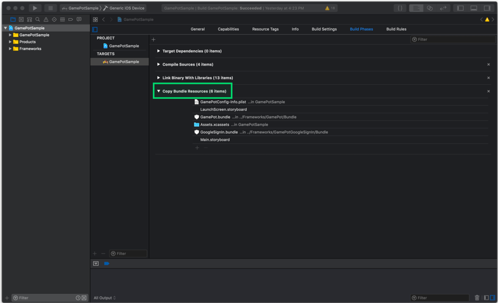
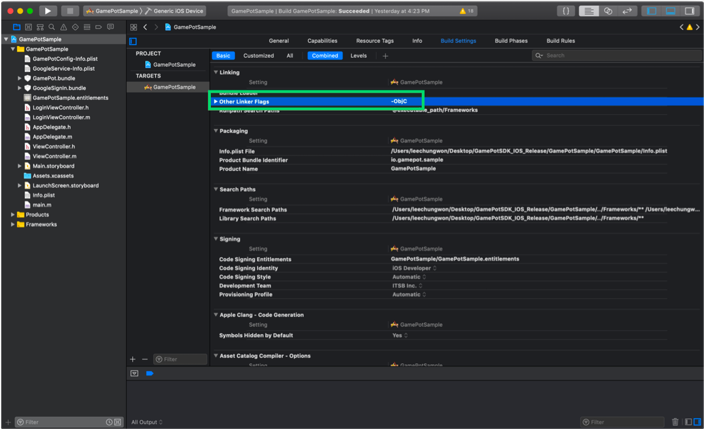
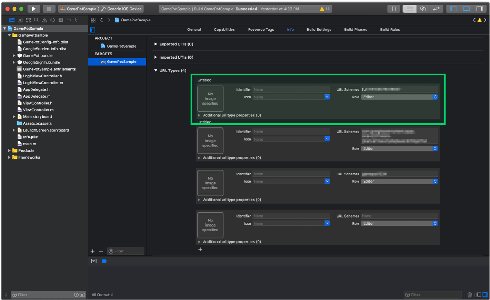

---
search:
  keyword:
    - gamepot
---

# iOS SDK

> ### 这是机器翻译的文档，可能在词汇，语法或语法上有错误。 我们很快会为您提供由专业翻译人员翻译的文档。
>
> #### 如有任何疑问，请[联系我们](https://www.ncloud.com/support/question)。
>
> 我们将尽一切努力进一步改善我们的服务。

## 1. 入门

#### Step 1. 配置开发环境

为了开发 IOS APP 首先需要安装开发工具（XCode）。

- 操作系统：iOS 10.0 或更高版本
- 开发环境：Xcode

#### Step 2. Framework 加


将下载的 iOS SDK 文件拖放到 Xcode 项目文件夹目标中。

#### Step 3. Dependencies 加

所需依赖项列表取决于您要使用的服务。

根据服务，请参考下表以添加依赖关系。

服务依赖性

| Service    | Framework                                                                                                                                                                                                                                                                                                                                                                                                                                                                                                                                                                                            | Dependencies                                                                                                                                                                                                                      | bundle                                   |
| :--------- | :--------------------------------------------------------------------------------------------------------------------------------------------------------------------------------------------------------------------------------------------------------------------------------------------------------------------------------------------------------------------------------------------------------------------------------------------------------------------------------------------------------------------------------------------------------------------------------------------------- | :-------------------------------------------------------------------------------------------------------------------------------------------------------------------------------------------------------------------------------- | :--------------------------------------- |
| Base       | AFNetworking.framework FirebaseAnalytics.framework FirebaseCore.framework FirebaseCoreDiagnostics.framework FirebaseInstanceID.framework FirebaseMessaging.framework FirebaseNanoPB.framework GamePot.framework GoogleToolboxForMac.framework nanopb.framework Protobuf.framework                                                                                                                                                                                                                                                                                                                    | libz.tbd WebKit.framework UserNotifications.framework                                                                                                                                                                             | GamePot.bundle                           |
| Login      | \[ Base \]<br> GamePotChannel.framework <br><br> \[ Google Sign In \]<br> GamePotGoogleSignIn.framework GoogleSignIn.framework GoogleSignInDependencies.framework <br><br>\[ Facebook \] <br>FBSDKCoreKit.framework FBSDKLoginKit.framework GamePotFacebook.framework<br><br> \[ LINE \]<br> GamePotLine.framework LineSDK.framework LineSDKObjC.framework<br><br> \[ NAVER \]<br> GamePotNaver.framework NaverThirdPartyLogin.framework<br><br> \[ Twitter \]<br> GamePotTwitter.framework<br> TwitterKit.framework \(添加为 Dynamic Library\)<br> TwitterCore.framework \(添加为 Dynamic Library\) | \[ Google Sign In \] AuthenticationServices.framework LocalAuthentication.framework<br><br> \[ Facebook \] SafariServices.framework<br><br> \[ LINE \]<br>SafariServices.framework<br><br> \[ Twitter \] SafariServices.framework | \[ Google Sign In \] GoogleSignIn.bundle |
| GameCenter | GamePotGameCenter.framework                                                                                                                                                                                                                                                                                                                                                                                                                                                                                                                                                                          |                                                                                                                                                                                                                                   |                                          |
| AppleID    | GamePotApple.framework                                                                                                                                                                                                                                                                                                                                                                                                                                                                                                                                                                               |                                                                                                                                                                                                                                   |                                          |


#### Step 4. Bundle Resource 加

您需要根据要使用的服务添加捆绑资源文件。

通过参考每个服务的“依赖关系”表来添加捆绑资源文件。



#### Step 5. InfoPlist 加


GAMEPOT SDK 使用 Google Firebase。 因此，设置 Google Firebase 并将创建的 GoogleService-Info.plist 添加到您的项目中。

还要添加 GamePotConfig-Info.plist 文件，其中包含 GAMEPOT SDK 的基本设置。 如果没有 GamePotConfig-Info.plist 文件，请使用相同的文件名创建该文件，然后输入与键对应的值。

**GamePotConfig-Info.plist 设定值**


```markup
gamepot_project_id : GAMEPOT项目编号
gamepot_elsa_projectid：GAMEPOT日志项目ID（可选）
```

#### Step 6. 添加构建选项

**Build Settings > Linking > Other Linker Flags** 将-ObjC 选项添加到该部分。



#### Step 7. Info.plist 改性

在目标>>信息>>自定义 iOS 目标属性中，请添加以下选项以获取用户权限。

此用户权限在 GamePot 客户中心的文件上传功能中使用。

```text
NSCameraUsageDescription
NSPhotoLibraryUsageDescription
```

iOS 14 或更高版本

从 iOS 14 开始，获得 IDFA 值后，用户必须获得许可。

已对其进行了更改以启用 IDFA 值的获取。

因此，如果您使用弹出式窗口在获取 IDFA 值时获得了用户的授权，
在目标>>信息>>自定义 iOS 目标属性中，请在下面添加用户权限获取选项。

> 2020.09.11 <br/>
> 当苹果获得 IDFA 值时，为获得用户许可而强制性弹出窗口的申请已推迟到 2021 年初。<br/>
> 请参阅下面的链接。<br/>

```text
NSUserTrackingUsageDescription
```

#### Step 8. Google Sign In 登录首选项

参照每个服务的“依赖关系”表中的**登录>“Google 登录”**，添加框架和依赖关系。

通过在 GoogleService-Info.plist 文件中复制`REVERSED_CLIENT_ID`的值，然后在“信息”>**URL 类型**中添加一个条目，以在 URL 方案中输入值。


**GamePotConfig-Info.plist 设定值**


```markup
gamepot_google_app_id : GoogleService-Info.plist文件中的CLIENT_ID值
gamepot_google_url_schemes : GoogleService-Info.plist文件中的REVERSED_CLIENT_ID值
```

#### Step 9. Facebook 登录首选项

通过引用每个服务的“依赖关系”表中的“登录”>“ Facebook \*\*”来添加框架和依赖关系。

将 Facebook App ID 作为 fb + Facebook App ID 添加到“信息> URL 类型”中。



将以下内容添加到**信息>iOS 目标属性中的** LSApplicationQueriesSchemes 中。

- fbapi
- fb-messenger-share-api
- fbauth2
- fbshareextension


**GamePotConfig-Info.plist 设定值**


```markup
gamepot_facebook_app_id : Facebook App ID
gamepot_facebook_display_name : Facebook display name
```

#### Step 10. LINE 登录首选项

**GamePotConfig-Info.plist 设置**

```markup
gamepot_line_channelid : Line Channel ID
gamepot_line_url_schemes : Line URL Scheme (line3rdp.{프로젝트 번들 ID})
```

#### Step 11. Twitter 登录首选项

**GamePotConfig-Info.plist 设置**

```markup
gamepot_twitter_consumerkey : Twitter Consumer Key
gamepot_twitter_consumersecret :  Twitter Consumer Secret
```

#### Step12. Naver 登录首选项

**GamePotConfig-Info.plist 设置**

```text
gamepot_naver_clientid : Naver Client Id
gamepot_naver_secretid : Naver Secret Id
gamepot_naver_urlscheme : Naver Url Scheme
```

将以下内容添加到**信息”>“ iOS 目标属性”中的“ LSApplicationQueriesSchemes**中。

- naversearchapp
- naversearchthirdlogin
- navercafe

将在 gamepot_naver_urlscheme 中输入的值添加到**Info > URL Types**

#### Step13. AppleID 登录首选项

**加 Xcode > TARGETS > Signing & Capabilities > + Capability > Sign In with Apple**

## 2. 重启

AppDelegate 将以下部分添加到文件中。

```text
#import <GamePot/GamePot.h>

#if __has_include(<AppTrackingTransparency/AppTrackingTransparency.h>)
#import <AppTrackingTransparency/AppTrackingTransparency.h>
#endif

- (BOOL)application:(UIApplication *)application didFinishLaunchingWithOptions:(NSDictionary *)launchOptions {
    ...
    // GamePot SDK Initialize
    [[GamePot getInstance] setup];

    // Push Permission
    if(SYSTEM_VERSION_GRATERTHAN_OR_EQUALTO(@"10.0"))
    {
        UNUserNotificationCenter *center = [UNUserNotificationCenter currentNotificationCenter];
        center.delegate = self;
        [center requestAuthorizationWithOptions:(UNAuthorizationOptionSound | UNAuthorizationOptionAlert | UNAuthorizationOptionBadge) completionHandler:^(BOOL granted, NSError * _Nullable error){
            if(!error){
                dispatch_async(dispatch_get_main_queue(), ^{
                    [[UIApplication sharedApplication] registerForRemoteNotifications];
                });
            }
        }];
    }
    else
    {
        // Code for old versions
        UIUserNotificationType allNotificationTypes = (UIUserNotificationTypeSound | UIUserNotificationTypeAlert | UIUserNotificationTypeBadge);
        UIUserNotificationSettings *settings = [UIUserNotificationSettings settingsForTypes:allNotificationTypes categories:nil];
        [application registerUserNotificationSettings:settings];
        [application registerForRemoteNotifications];
    }

    // 调用权限请求弹出窗口以获取iOS 14版本中的IDFA值
    // 如果未将AppTrackingTransparency.framework添加到项目中，则不会调用它。
#if __has_include(<AppTrackingTransparency/AppTrackingTransparency.h>)
   if (@available(iOS 14, *)) {
       if(NSClassFromString(@"ATTrackingManager"))
       {
           [ATTrackingManager requestTrackingAuthorizationWithCompletionHandler:^(ATTrackingManagerAuthorizationStatus status) {

               switch (status)
               {
                   case ATTrackingManagerAuthorizationStatusNotDetermined:
                       break;
                   case ATTrackingManagerAuthorizationStatusRestricted:
                       break;
                   case ATTrackingManagerAuthorizationStatusDenied:
                       break;
                   case ATTrackingManagerAuthorizationStatusAuthorized:
                       break;
                   default:
                       break;
               }
           }];
       }
   }
#endif
    ...
}

 // Push
- (void)application:(UIApplication *)application didRegisterForRemoteNotificationsWithDeviceToken:(NSData *)deviceToken
{
    ...
    [[GamePot getInstance] handleRemoteNotificationsWithDeviceToken:deviceToken];
    ...
}

- (void)applicationWillEnterForeground:(UIApplication *)application {
    [[GamePotChat getInstance] start];
}

- (void)applicationDidEnterBackground:(UIApplication *)application {
    [[GamePotChat getInstance] stop];
}
```

## 3. 登录，注销，退出会员

您可以集成和使用各种登录 SDK，例如 Google，Facebook 和 Naver。

#### Step 1. 设置

```text
// AppDelegate.m
#import <GamePotChannel/GamePotChannel.h>

// Google Login 使用时
#import <GamePotGoogleSignIn/GamePotGoogleSignIn.h>

// Facebook Login 使用时
#import <GamePotFacebook/GamePotFacebook.h>

// AppleID Login 使用时
#import <GamePotApple/GamePotApple.h>

// Line Login 使用时
#import <GamePotLine/GamePotLine.h>

// Twitter Login 使用时
#import <GamePotTwitter/GamePotTwitter.h>

// Naver Login 使用时
#import <GamePotNaver/GamePotNaver.h>

- (BOOL)application:(UIApplication *)application didFinishLaunchingWithOptions:(NSDictionary *)launchOptions {
    ...
    // GamePotSDK 通道初始化。 您必须为要使用的每个通道使用addChannel。
     //默认情况下包含guest方法。
    // Google Login 重启
    GamePotChannelInterface* google     = [[GamePotGoogleSignIn alloc] init];
    [[GamePotChannelManager getInstance] addChannelWithType:GOOGLE interface:google];

    // Facebook 登录 重启
    GamePotChannelInterface* facebook   = [[GamePotFacebook alloc] init];
    [[GamePotChannelManager getInstance] addChannelWithType:FACEBOOK interface:facebook];

    // AppleID 登录 重启
    GamePotChannelInterface* apple      = [[GamePotApple alloc] init];
    [[GamePotChannel getInstance] addChannelWithType:APPLE interface:apple];

    // Line 登录 重启
    GamePotChannelInterface* line = [[GamePotLine alloc] init];
    [[GamePotChannel getInstance] addChannelWithType:LINE interface:line];

    // Twitter 登录 重启
    GamePotChannelInterface* twitter = [[GamePotTwitter alloc] init];
    [[GamePotChannel getInstance] addChannelWithType:TWITTER interface:twitter];

      // Naver 登录 重启
      GamePotChannelInterface* naver = [[GamePotNaver alloc] init];
      [[GamePotChannel getInstance] addChannelWithType:NAVER interface:naver];

    // 登录处理所需。
    [[GamePotChannel getInstance] application:application didFinishLaunchingWithOptions:launchOptions];

    ...
}

- (BOOL)application:(UIApplication *)app openURL:(NSURL *)url options:(NSDictionary<UIApplicationOpenURLOptionsKey,id> *)options
{
    // 登录处理所需。
    BOOL nChannelResult = [[GamePotChannel getInstance] application:app openURL:url options:options];
    return nChannelResult;
}
```

#### Step 2. 登录

当您单击登录按钮时，它起作用。

```text
#import <GamePotChannel/GamePotChannel.h>
// 定义登录类型
// GamePotChannelType.GOOGLE
// GamePotChannelType.FACEBOOK
// GamePotChannelType.GUEST
// GamePotChannelType.LINE
// GamePotChannelType.TWITTER
// GamePotChannelType.NAVER
// GamePotChannelType.APPLE

// 单击Google登录按钮时调用
[[GamePotChannel getInstance] Login:GOOGLE viewController:self success:^(GamePotUserInfo* userInfo) {
    // 登录完成
} cancel:^{
    // 当用户在尝试登录时取消时
} fail:^(NSError *error) {
    // 登录时出错
    // TODO: 通过弹出游戏来解释失败的原因。
    // TODO: 将[error localizedDescription]用作短语。
}];
```

#### Step 3. 自动登录

GAMEPOT 支持自动登录。

```text
#import <GamePotChannel/GamePotChannel.h>

// 获取最后登录的信息，并调用该信息以自动使用该信息登录。
// lastLoginType：您可以获取最后的登录值。
GamePotChannelType type = [[GamePotChannel getInstance] lastLoginType];

if(type != NONE)
{
    // 这是使用最后一种登录类型登录的方法。
    // 如果是自动登录处理，只需按如下所示进行调用。
    [[GamePotChannel getInstance] Login:type viewController:self success:^(GamePotUserInfo* userInfo) {

    } cancel:^{

    } fail:^(NSError *error) {
        // TODO: 通过游戏弹出窗口解释失败的原因。
        // TODO：将[error localizedDescription]用作短语。
    }];
}
else
{
    // 没有上次登录的信息。 使用登录按钮进入登录屏幕
}
```

#### Step 4. 登出

注销当前的会员帐户。

```text
#import <GamePotChannel/GamePotChannel.h>

[[GamePotChannel getInstance] LogoutWithSuccess:^{
    // 完成注销后，您将被重定向到初始屏幕。
}失败：^（NSError * error）{
     //显示注销失败错误消息。
     // TODO：通过弹出游戏来解释失败的原因。
     // TODO：将[error localizedDescription]用作短语。
}];
```

#### Step 5. 退出

退出您当前的会员帐户。

```text
#import <GamePotChannel/GamePotChannel.h>

[[GamePotChannel getInstance] DeleteMemberWithSuccess:^{
    // 进入登录页面成功退出会员
}失败：^（NSError * error）{
     //成员退出失败
     // TODO：通过弹出游戏来解释失败的原因。
     // TODO：将[error localizedDescription]用作短语。
}];
```

#### Step 6. 验证

完成登录后，通过将登录信息从开发者服务器传递到 GAMEPOT 服务器来执行登录验证。

有关更多信息，请参阅`服务器到服务器api`菜单中的`身份验证检查`项。

## 4.帐户关联

此功能可以将多个社交帐户（Google/Facebook 等）连接断开与一个游戏帐户的连接。

在游戏中实现联锁屏幕 UI，并在按下联锁按钮时调用以下代码。

#### Step 1. 帐户连结

您可以将您的帐户与 ID（例如 Google 和 Facebook）相关联。

```text
#import <GamePotChannel/GamePotChannel.h>

// 类型定义
// GamePotChannelType.GOOGLE
// GamePotChannelType.FACEBOOK
// GamePotChannelType.LINE
// GamePotChannelType.TWITTER
// GamePotChannelType.NAVER
// GamePotChannelType.APPLE

[[GamePotChannel getInstance] CreateLinking:GOOGLE viewController:self success:^(GamePotUserInfo *userInfo) {
    // TODO：互通完成。 请在游戏弹出窗口中显示有关链接结果的文本（例如，帐户链接成功）。
}取消：^ {
     // TODO：当用户取消时
}失败：^（NSError * error）{
     // TODO：集成失败。 请在游戏弹出窗口中显示有关链接失败原因的文字。
     // TODO：将[error localizedDescription]用作短语。
}];
```

#### Step 2. 链表

您可以检查帐户是否通过相应的 API 进行了链接。

```text
#import <GamePotChannel/GamePotChannel.h>

// 类型定义
// GamePotChannelType.GOOGLE
// GamePotChannelType.FACEBOOK
// GamePotChannelType.LINE
// GamePotChannelType.TWITTER
// GamePotChannelType.NAVER
// GamePotChannelType.APPLE

// 根据类型返回互锁结果。
BOOL isGoogleLinked = [[GamePotChannel getInstance] isLinked:GOOGLE];

// 返回JsonString类型的链接类型。
NSString* linkedList = [[GamePotChannel getInstance] getLinkedListJsonString];
```

#### Step 3. 开锁

取消现有的关联帐户。

```text
#import <GamePotChannel/GamePotChannel.h>

[[GamePotChannel getInstance] DeleteLinking:GOOGLE success:^{
     // TODO：发布完成。 请在游戏弹出窗口中显示有关互锁结果的文本。 （例如：帐户链接已被取消。）
}失败：^（NSError * error）{
      // TODO：发布失败。 请在游戏弹出窗口中显示有关终止失败原因的短语。
      // TODO：将[error localizedDescription]用作短语。
}];
```

## 5. 付款

#### Step 1. 设置

付款的结果值以委托的形式实现。 因此，请按以下方式添加代表。

```text
#import <GamePot/GamePot.h>

@interface ViewController () <GamePotPurchaseDelegate>
@end
@implementation ViewController

- (void)viewDidLoad
{
    ...
    [[GamePot getInstance] setPurchaseDelegate:self];
    ...
}

- (void)GamePotPurchaseSuccess:(GamePotPurchaseInfo *)_info
{
    // 付款成功

     //如果您使用广告作为代码将付款事件引发到广告平台，请确保！ 请插入。
    [[GamePotAd getInstance] tracking:BILLING obj:_info];
}

- (void)GamePotPurchaseFail:(NSError *)_error
{
    // 付款错误
    // TODO：通过弹出游戏来解释失败的原因。
    // TODO：将[error localizedDescription]用作短语。
}

- (void)GamePotPurchaseCancel
{
    // 付款启动期间取消
    //弹出“付款已取消”作为游戏弹出窗口。
}
@end
```

#### Step 2. 尝试付款

```text
CASE 1 : 一般付款

#import <GamePot/GamePot.h>

// productid : 输入在商店中注册的产品ID。
[[GamePot getInstance] purchase:productid];
```

```text
CASE 2 : 当您要单独管理付款时处理的收据编号时：

#import <GamePot/GamePot.h>

// productId : 输入在商店中注册的产品ID。
// uniqueId：您可以输入单独管理的收据编号。
[[GamePot getInstance] purchase:productid uniqueId:uniqueid];
```

```text
CASE 3 : 当您想提供通过Webhook付款时处理的收据编号/服务器ID /字符ID /其他信息时。 :

#import <GamePot/GamePot.h>

// productId：输入在商店中注册的产品ID。
// uniqueId：您可以输入单独管理的收据编号。
// serverId：输入进行付款的角色的服务器ID。
// playerId：输入进行付款的角色的角色ID。
// etc       : 您可以输入其他信息，例如付款的字符。
[[GamePot getInstance] purchase:productid uniqueId:uniqueid serverId:serverid playerId:playerid etc:etc]];
```

#### Step 3. **获取付款项目清单**

您可以获取商店提供的应用内商品的列表。

```text
NSArray<SKProduct*>* itemList = [[GamePot getInstance] getDetails];

// 根据设备设置获取货币价格时
[[GamePot getInstance] getLocalizePrice:[product productIdentifier]];
```

#### Step 4. 付款项目付款

非法付款是不可能的，因为 GAMEPOT 在通过服务器到服务器 api 验证了付款存储区中的收据后，要求向开发者的服务器付款。

为此，请参考“服务器到服务器 api”菜单中的“购买”项并进行处理。

## 6.其他 API

### SDK 지원 로그인 UI

SDK 내에서, 자체적으로 (완성된 형태의) Login UI를 제공합니다.


```c++
#import <GamePot/GamePot.h>
#import <GamePotChannel/GamePotChannel.h>

NSArray* order = @[@(GOOGLE), @(FACEBOOK), @(APPLE),@(NAVER), @(LINE), @(TWITTER), @(GUEST)];
GamePotChannelLoginOption* option = [[GamePotChannelLoginOption alloc] init:order];
[option setShowLogo:YES];

 [[GamePotChannel getInstance] showLoginWithUI:self option:option success:^(GamePotUserInfo *userInfo) {
    // 로그인 성공
    } cancel:^{
    // 로그인 취소
    } fail:^(NSError *error) {
    // 로그인 실패
    } update:^(GamePotAppStatus *appStatus) {
    // 업데이트
    } maintenance:^(GamePotAppStatus *appStatus) {
    // 점검
    } exit:^{
    // showLoginWithUI 종료
    }
];
```

#### 로그인 UI 이미지 로고 설정

로그인 UI 상단에 노출되는 이미지 로고는 SDK 내부에서 기본 이미지로 노출하며, 직접 추가할 수도 있습니다.

**이미지 로고 직접 넣기**

> 이미지 로고는 GamePot.bundle 내에, ic_stat_gamepot_logo.png 파일로 존재합니다.

이미지 파일명을 `ic_stat_gamepot_login_logo.png`로 변경한 다음 교체합니다.

(권장 사이즈 : 310x220)

### 优惠券

使用用户输入的优惠券时，请拨打以下代码。

> 请开发人员实施优惠券输入屏幕 UI。

```text
#import <GamePot/GamePot.h>

[[GamePot getInstance] coupon:/*用户收到的优惠券*/ handler:^(BOOL _success, NSError *_error) {
    if(_success)
    {
        // TODO: 消息中将返回使用优惠券的结果。 请在游戏弹出窗口中显示此消息。
    }
    else
    {
        // TODO: _error返回有关优惠券失败原因的信息。
        // [_error localizedDescription]的内容公开为游戏弹出窗口。
    }
}];
```

#### 物品付款

如果优惠券成功使用，则要求开发者服务器通过服务器到服务器 api 支付商品。

为此，请参考`服务器到服务器api`菜单中的`项目`项并进行处理。

### Push

```text
#import <GamePot/GamePot.h>

// 推送接收 On/Off
[[GamePot getInstance] setPushEnable:YES success:^{

} fail:^(NSError *error) {

}];

// 夜推接待 On/Off
[[GamePot getInstance] setNightPushEnable:YES success:^{

} fail:^(NSError *error) {

}];

// 一次设置推送/夜间推送
//如果您被允许在登录前进行推送/夜间推送，请务必在登录后调用以下代码。
[[GamePot getInstance] setPushStatus:YES night:YES ad:YES success:^{
    <#code#>
} fail:^(NSError *error) {
    <#code#>
}];
```

### 公告

DashBoard - 在公告栏所上传图像显示的功能。

#### 调用

```text
[[GamePot getInstance] showNotice:/*viewController*/ setSchemeHandler:^(NSString *scheme) {
    NSLog(@"scheme = %@", scheme);
}];
```

### 公告(按类别致电)

仪表板-此功能仅显示公告中上载并设置为分类的图像。

#### 调用

```text
[[GamePot getInstance] showEvent:/*viewController*/ setType:/*Type*/ setSchemeHandler:^(NSString *scheme) {
    NSLog(@"scheme = %@", scheme);
}];
```

### 客户中心

DashBoard - 连接客户中心的功能。用户与运营商之间的沟通窗口。

与我们联系 UI 会根据设备语言进行更改。 它支持韩文，英文，日文和中文（简体和繁体），其他语言以英文显示。

#### 通话

```text
[[GamePot getInstance] showHelpWebView:(UIViewController *)];
```

未登录的客户可以通过支持外部链接来注册查询。

#### 通话

```text
// showWebView Type
    // WEBVIEW_NORMAL // 没有后退按钮。
    // WEBVIEW_NORMALWITHBACK //返回按钮存在

    [[GamePot getInstance] showWebView:/*现在 ViewController*/ setType:/*Type*/ setURL:/*外门进出URL*/];
```

### 本地推送通知

此功能可在不通过推送服务器的情况下从终端公开推送本身。

#### 通话

#### 推送注册

这是在给定时间公开本地推送的方法。

> 作为返回值传递的 pushid 由开发人员管理。

```text
 NSDateFormatter* formatter = [[NSDateFormatter alloc] init];
 [formatter setDateFormat:@"yyyy-MM-dd HH:mm:ss"];

 NSString* strDate = [formatter stringFromDate:[[NSDate date] dateByAddingTimeInterval:30]];

 int pushId  = [[GamePot getInstance] sendLocalPush:@"Title" setMessage:@"Message" setDateString:strDate];
```

#### 取消注册推送

您可以根据推送注册过程中获得的推送 ID 取消先前注册的推送。

```text
[[GamePot getInstance] cancelLocalPush:(int)pushId];
```

### 检查，强制更新

如果需要检查或强制更新功能，则在仪表板操作中激活该功能时将激活该功能。

#### 通话

可以在下面应用的 API 中使用它。

#### 1. Login API

```text
[[GamePotChannel getInstance] Login:GAMECENTER viewController:self
    success:^(GamePotUserInfo* userInfo) {
            // 登录完成。 请根据游戏逻辑处理。
    } cancel:^{
            // 用户取消登录的情况。
    } fail:^(NSError *error) {
            // 登录失败。 使用[error localizedDescription]显示错误消息。
    } update:^(GamePotAppStatus *appStatus) {
        // TODO: 需要强制更新时。 如果您调用下面的API，则SDK本身可以弹出。
         // TODO：如果要自定义，请不要调用下面的API，而是要自定义。
        [[GamePot getInstance] showAppStatusPopup:self setAppStatus:appStatus
         setCloseHandler:^{
            // TODO：调用showAppStatusPopup API时，需要关闭应用程序时调用它。
             // TODO：请注意终止过程。
        } setNextHandler:^(NSObject* resultPayload) {
            // TODO : 在仪表板更新设置中，建议时将显示“下一步”按钮。
             //当用户选择按钮时调用。
             // TODO：使用resultPayload信息以与登录完成时相同的方式对其进行处理。
            // GamePotUserInfo* userInfo = (GamePotUserInfo*)resultPayload;

        }];
    } maintenance:^(GamePotAppStatus *appStatus) {
          // TODO: 如果您正在检查。 如果您调用下面的API，则SDK本身可以弹出。
         // TODO：如果要自定义，请不要调用下面的API，而是要自定义。
        [[GamePot getInstance] showAppStatusPopup:self setAppStatus:appStatus
         setCloseHandler:^{
            // TODO: 调用showAppStatusPopup API时，需要关闭应用程序时调用该API。
             // TODO：请注意终止过程。
        }];
    }];
```

### 接受条款

提供了 UI，以便用户可以轻松接受“使用条款”和“个人信息收集和使用指南”。

`BLUE` 테마와 `GREEN` 테마 두 가지의 `기본테마` 이외에도, 새롭게 추가된 11 종류의 `개선테마`를 제공합니다. 

-`蓝色`主题示例


- `GREEN`主题示例


- 개선테마 중, `MATERIAL_ORANGE` 테마 예시


#### 条款及细则电话

> 开发者同意公开适合该游戏的弹出窗口。
>
> 单击“查看”按钮时显示的内容可以在仪表板中应用和修改。

```text
// 블루테마 [[GamePotAgreeOption alloc] init:BLUE];
// 그린테마 [[GamePotAgreeOption alloc] init:GREEN];

// 개선테마  
//  [[GamePotAgreeOption alloc] init:MATERIAL_RED];
//  [[GamePotAgreeOption alloc] init:MATERIAL_BLUE];
//  [[GamePotAgreeOption alloc] init:MATERIAL_CYAN];
//  [[GamePotAgreeOption alloc] init:MATERIAL_ORANGE];
//  [[GamePotAgreeOption alloc] init:MATERIAL_PURPLE];
//  [[GamePotAgreeOption alloc] init:MATERIAL_DARKBLUE];
//  [[GamePotAgreeOption alloc] init:MATERIAL_YELLOW];
//  [[GamePotAgreeOption alloc] init:MATERIAL_GRAPE];
//  [[GamePotAgreeOption alloc] init:MATERIAL_GRAY];
//  [[GamePotAgreeOption alloc] init:MATERIAL_GREEN];
//  [[GamePotAgreeOption alloc] init:MATERIAL_PEACH];

GamePotAgreeOption* option = [[GamePotAgreeOption alloc] init:BLUE];
[[GamePot getInstance] showAgreeView:self option:option handler:^(GamePotAgreeInfo *result) {
   // [result agree] : 如果所有必需条款均已达成，则为true
    // [result acceptNight]：如果选中了每晚广告收据协议，则为true，否则为false
    //同意值的值为[[GamePot getInstance] setNightPushEnable]; api
    //通过。
}];
```

#### Customizing

更改颜色以匹配游戏而不使用主题。

您可以在调用条款协议之前在`GamePotAgreeOption`中为每个区域指定颜色。

```text
 GamePotAgreeOption* option = [[GamePotAgreeOption alloc] init:GREEN];

[option setHeaderBackGradient:@[@0xFF00050B,@0xFF0F1B21]];
[option setHeaderTitleColor:0xFF042941];
[option setContentBackGradient:@[@0xFF112432,@0xFF112432]];
[option setContentIconColor:0xFF042941];
[option setContentCheckColor:0xFF91adb5];
[option setContentTitleColor:0xFF98b3c6];
[option setContentShowColor:0xFF98b3c6];
[option setFooterBackGradient:@[@0xFF112432,@0xFF112432]];
[option setFooterButtonGradient:@[@0xFF1E3A57,@0xFF57B2E2]];
[option setFooterButtonOutlineColor:0xFF0b171a];
[option setFooterTitleColor:0xFFFFFFD5];

// 词组变化
[option setAllMessage:@"全部同意"];
[option setTermMessage:@"必要) 使用条款"];
[option setPrivacyMessage:@"必要) 隐私政策"];
[option setNightPushMessage:@"选拔) 同意稍微推动"];
[option setFooterTitle:@"开始游戏"];

// 不用时设置为@“”
[option setHeaderTitle:@"接受条款"];

// 是否公开用于接收夜间广告的按钮
[option setShowNightPush:YES];
```

每个变量都适用于以下区域。

> contentIconDrawable 的图像未暴露给 IOS。


### 이용약관

调用使用条款 UI。

> 仪表板-客户支持-在“使用条款”设置中首先输入内容。

```java
#import <GamePot/GamePot.h>

[[GamePot getInstance] showTerms:/*ViewController*/];
```


### 隐私声明

调用隐私策略用户界面。

> 仪表板-客户支持-首先在“隐私策略设置”部分中输入详细信息。

```java
#import <GamePot/GamePot.h>

[[GamePot getInstance] showPrivacy:/*ViewController*/];
```


### 退款政策

调用退款规则用户界面。

> 控制台-客户支持-在退款政策设置项中输入详细信息。

```java
#import <GamePot/GamePot.h>

[[GamePot getInstance] showRefund:/*ViewController*/];
```


### 远程配置

获取在客户端的仪表板上注册的参数值。

> 首先在 Dashboard-Settings-Remote Config 屏幕中添加参数。

添加的参数在登录时加载，以后可以调用。

```java
#import <GamePot/GamePot.h>

//key : 参数 string
NSString *str_value = [[GamePot getInstance] getConfig:(NSString*)key];

//添加到仪表板的所有参数均以json的形式导入。
NSArray *json_value = [[GamePot getInstance] getConfigs];
```

### 游戏日志转移

如果使用游戏中使用的信息进行调用，则可以在`仪表板`-`游戏`中进行搜索。

以下是可用保留字定义的表。

| 保留字                            | 必要 | 类型   | 说明      |
| :-------------------------------- | :--- | :----- | :-------- |
| GamePotSendLogCharacter.NAME      | 必要 | String | 角色名称  |
| GamePotSendLogCharacter.LEVEL     | 选拔 | String | 级别      |
| GamePotSendLogCharacter.SERVER_ID | 选拔 | String | 服务器 ID |
| GamePotSendLogCharacter.PLAYER_ID | 选拔 | String | 角色 ID   |
| GamePotSendLogCharacter.USERDATA  | 选拔 | String | ETC       |

```java
#import <GamePot/GamePotSendLog.h>
#import <GamePot/GamePotSendLogCharacter.h>

GamePotSendLogCharacter* info = [[GamePotSendLogCharacter alloc] init];

[info put:@"name" forKey:GAMEPOT_NAME];
[info put:@"playerid" forKey:GAMEPOT_PLAYER_ID];
[info put:@"serverid" forKey:GAMEPOT_SERVER_ID];
[info put:@"level" forKey:GAMEPOT_LEVEL];
[info put:@"userdata" forKey:GAMEPOT_USERDATA];

BOOL result = [GamePotSendLog characterInfo:info];

// Result is TRUE : validation success. Logs will send to GamePot Server
// Result is FALSE : validation was failed. Please check logcat

```
### GDPR 약관 체크리스트

대시보드에서 활성화 한, GDPR 약관 항목을 리스트형태로 가져옵니다.

```c++
(NSArray*) [[GamePot getInstance] getGDPRCheckedList];

//리턴되는 각 파라메터는, 대시보드의 다음 설정에 해당합니다.
gdpr_privacy : 개인정보취급방침
gdpr_term : 이용약관
gdpr_gdpr : GDPR 이용약관
gdpr_push_normal : 이벤트 Push 수신동의
gdpr_push_night : 야간 이벤트 Push 수신동의 (한국만 해당)
gdpr_adapp_custom : 개인 맞춤광고 보기에 대한 동의 (GDPR 적용국가)
gdpr_adapp_nocustom : 개인 맞춤이 아닌 광보 보기에 대한 동의 (GDPR 적용국가)
```

## 7. 下载

您可以从 GAMEPOT 仪表板上的**SDK 下载**菜单下载 SDK。

# 附录

### 第三方 SDK 集成支持

TODO : 说明

## 로그인

TODO : 说明

> 不支持自动登录。 每次都需要打电话。

| 参数名称       | 必要 | 类型             | 描述               |
| :------------- | :--- | :--------------- | :----------------- |
| viewController | 必要 | UIViewController | 当前 ViewContoller |
| userid         | 必要 | NSString         | 用户唯一标识       |
| success        | 必要 | String           | 成功回调           |
| fail           | 必要 | String           | 失败回调           |
| update         | 选拔 | String           | 更新过程中的回调   |
| maintenance    | 选拔 | String           | 检查功能回调       |

```text
NSString userid = @"memberid of 3rd party sdk";

[[GamePotChannel getInstance] loginByThirdPartySDK:self uId:userid success:^(GamePotUserInfo* userInfo) {
    // 登录完成。 请根据游戏逻辑处理。
}取消：^ {
     //用户取消登录的情况。
}失败：^（NSError * error）{
     // 登录失败。 使用[error localizedDescription]显示错误消息。
} update:^(GamePotAppStatus *appStatus) {
    // TODO: 需要强制更新时。 如果您调用下面的API，则SDK本身可以弹出。
     // TODO：如果要自定义，请不要调用下面的API，而是要自定义。
    [[GamePot getInstance] showAppStatusPopup:self setAppStatus:appStatus
        setCloseHandler:^{
        // TODO: 调用showAppStatusPopup API时，需要关闭应用程序时调用该API。
         // TODO：请注意终止过程。
    } setNextHandler:^(NSObject* resultPayload) {
        // TODO : 在仪表板更新设置中，建议时将显示“下一步”按钮。
         //当用户选择按钮时调用。
         // TODO：使用resultPayload信息以与登录完成时相同的方式对其进行处理。
        // GamePotUserInfo* userInfo = (GamePotUserInfo*)resultPayload;

    }];
} maintenance:^(GamePotAppStatus *appStatus) {
    // TODO: 如果您正在检查。 如果您调用下面的API，则SDK本身可以弹出。
     // TODO：如果要自定义，请不要调用下面的API，而是要自定义。
    [[GamePot getInstance] showAppStatusPopup:self setAppStatus:appStatus
        setCloseHandler:^{
        // TODO: 调用showAppStatusPopup API时，需要关闭应用程序时调用该API。
         // TODO：请注意终止过程。
    }];
}];
```

## 付款

TODO：说明

> 付款项目必须在游戏机仪表板中注册。

| 参数名称      | 必要 | 类型                 | 描述                          |
| :------------ | :--- | :------------------- | :---------------------------- |
| productid     | 必要 | NSString             | 在游戏机仪表板上注册的物品 ID |
| transactionid | 必要 | NSString             | 付款收据编号（xxxxxxxxxxx）   |
| currency      | 选拔 | NSString             | 货币（韩元，美元)             |
| price         | 选拔 | NSDecimalNumber      | 付款项目金额                  |
| paymentid     | 选拔 | NSString             | 付款商店（苹果)               |
| success       | 选拔 | GamePotCommonSuccess | 成功回调                      |
| fail          | 选拔 | GamePotCommonFail    | 失败回调                      |

```text
NSString* productId = @"purchase_001";
NSString* transactionId = @"xxxxxxxxxxx";
NSString* currency = @"USD";
NSDecimalNumber* price = [[NSDecimalNumber alloc] initWithString:@"1.09"];
NSString* paymentId = "apple";
NSString* uniqueId = "developer unique id";

[[GamePot getInstance] sendPurchaseByThirdPartySDK:productId transactionId:transactionId currency:currency price:price paymentId:paymentId uniqueId:uniqueId success:^{
    // success
} fail:^(NSError *error) {
    // fail
}];
```
