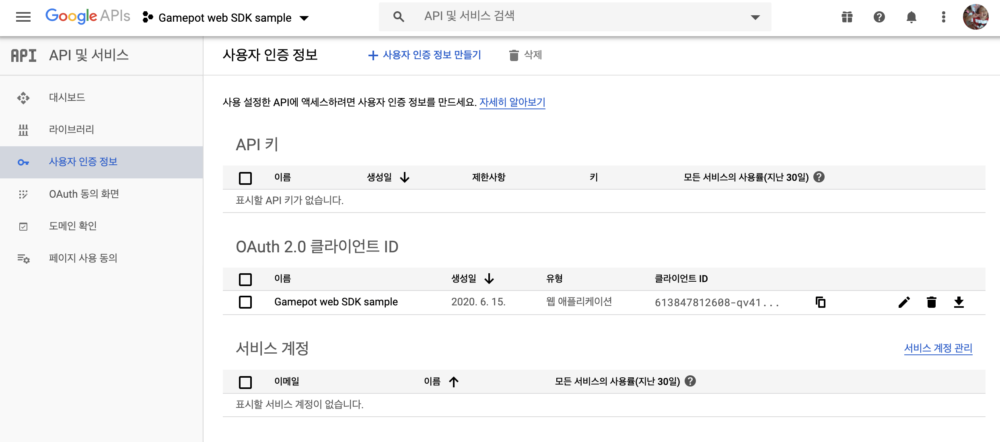

---
search:
  keyword:
    - gamepot
---

# Javascript SDK

> ### 这是机器翻译的文档，可能在词汇，语法或语法上有错误。 我们很快会为您提供由专业翻译人员翻译的文档。
>
> #### 如有任何疑问，请[联系我们](https://www.ncloud.com/support/question)。
>
> 我们将尽一切努力进一步改善我们的服务。

## 1. 开始吧

### 开发环境配置

在浏览器中使用 GAMEPOT 的系统环境如下。

[系统环境]

- 最低：Chrome 4，IE 8，Firefox 3.5，Safari 4，Opera 10.50 等。

#### 添加 JavaScript

将下载的 Javascript SDK 文件添加到`<header>`块或`<body>`块中。

> 您可以通过`GP`全局变量使用该功能\
> 加载 gamepot 脚本后，请注意不要重新声明相同的变量名。

```html
<script src="/js/GamePot-2.1.0b.js"></script>
```

## 2. 重启

在使用`window.onload = function（）{...}`或 jQuery 的 `$（ducement）.ready（function（）{...}）`块中，以便可以在网页加载完成后执行它。 从初始化。

```html
<html>
  <head></head>
  <body>
    <!-- YOUR WEB HTML CODES -->

    <script>
      window.onload = function () {
        // 可以在游戏机仪表板上找到项目ID。
        var project_id = "f2c4f50b-2546-280e-913b-a7cea5548384";

        var gamepotConfig = {
          // 使用Google登录名时，输入Google API客户端ID，如下所示。
          google_signin_client_id:
            "403241810604-fv81........apps.googleusercontent.com",
          // 如果使用Facebook登录名，请输入Facebook应用程序ID，如下所示
          facebook_app_id: "149535310821467",
        };
        // 游戏机重置
        GP.setup(project_id, gamepotConfig);
      };
    </script>

    <!-- YOUR WEB HTML CODES -->
  </body>
</html>
```

## 3. 登录，注销，退出会员

您可以集成和使用各种登录 SDK，例如 Google，Facebook 和电子邮件。

### Google\(API CONSOLE\) 控制台设置

[Google API Console](https://console.developers.google.com) 中创建一个项目>创建用户身份验证信息> OAuth 客户端 ID>创建为 Web 应用程序类型并使用客户端 ID 值。

> 例) 533847112608-qv8149tijkoh0vljrpeashk0udf39eoe.apps.googleusercontent.com



### Facebook 控制台设置

[Facebook Developers](https://developers.facebook.com/apps) 에서 앱 생성 후 앱 ID 사용

> 例) 149235210820417

### 登录

登录 UI 由开发人员实现，并在单击登录按钮时起作用。

### #社交平台登录

```javascript
// 로그인 타입 정의
// GP.ChannelType.GOOGLE: GOOGLE
// GP.ChannelType.FACEBOOK: FACEBOOK
// GP.ChannelType.EMAIL: EMAIL

// 按下Facebook登录按钮时调用
GP.login(GP.ChannelType.FACEBOOK, {
  onSuccess: function (userInfo) {
    console.log(
      "登录成功. memberid: " +
        userInfo.memberid +
        ", userid: " +
        userInfo.userid
    );
  },
  onCancel: function () {
    console.log("取消登入");
  },
  onFailure: function (gamepotError) {
    console.log("登录失败: " + gamepotError.toString());
  },
});
```

#### 邮箱登录

```javascript
// <input>用户在标签等中的输入
var email_id = $("#input-email-id").val();
var email_password = $("#input-email-password").val();

$("#email-result-status").html("");

GP.login(GP.ChannelType.EMAIL, email_id, email_password, {
  onSuccess: function (gamepotUserInfo) {
    console.log("电子邮件登录成功", gamepotUserInfo);
    $("#email-result-status").html(
      "登录成功. memberid: " +
        gameUserInfo.memberid +
        ", userid: " +
        gameUserInfo.userid
    );
  },
  onCancel: function () {
    console.log("取消电子邮件登录");
  },
  onFailure: function (gamepotError) {
    console.log("电子邮件登录失败: " + gamepotError.toString());

    var msg = "";
    switch (gamepotError.getCode()) {
      case GP.Error.EMAIL_AUTH_WRONG_EMAIL_FORMAT:
        msg = "电子邮件格式不正确。";
        break;
      case GP.Error.EMAIL_AUTH_WRONG_PASSWORD_EMPTY:
        msg = "请输入密码。";
        break;
      case GP.Error.EMAIL_AUTH_WRONG_PASSWORD_LENGTH:
        msg = "您可以输入至少8个字符和最多32个字符的密码。";
        break;
      case GP.Error.EMAIL_AUTH_WRONG_PASSWORD:
        msg = "密码不匹配。";
        break;
      case GP.Error.EMAIL_AUTH_WRONG_PASSWORD_BLOCKED:
        msg = "由于超出密码错误数量，因此无法登录。";
        break;
      case GP.Error.EMAIL_AUTH_NOT_FOUND:
        msg = "关联的帐户不存在。";
        break;
      default:
        msg = gamepotError.getMessage();
        break;
    }

    $("#email-result-status").html(msg); // 结果显示示例。
  },
});
```

#### 电子邮件订阅

```javascript
// <input>用户在标签等中的输入
var new_email_id = $("#input-email-new-id").val();
var new_email_password = $("#input-email-new-password").val();

$("#email-result-status2").html("");

GP.Channel.emailRegister(new_email_id, new_email_password, {
  onSuccess: function (gamepotUserInfo) {
    console.log("电子邮件订阅成功", gamepotUserInfo);
  },
  onCancel: function () {
    console.log("取消电子邮件订阅");
  },
  onFailure: function (gamepotError) {
    console.log("电子邮件订阅失败: " + gamepotError.toString());

    var msg = "";
    switch (gamepotError.getCode()) {
      case GP.Error.EMAIL_AUTH_WRONG_EMAIL_FORMAT:
        msg = "电子邮件格式不正确。";
        break;
      case GP.Error.EMAIL_AUTH_WRONG_PASSWORD_EMPTY:
        msg = "请输入密码。";
        break;
      case GP.Error.EMAIL_AUTH_WRONG_PASSWORD_LENGTH:
        msg = "您可以输入至少8个字符和最多32个字符的密码。";
        break;
      case GP.Error.EMAIL_AUTH_WRONG_PASSWORD:
        msg = "密码不匹配。";
        break;
      case GP.Error.EMAIL_AUTH_WRONG_PASSWORD_BLOCKED:
        msg = "由于超出密码错误数量，因此无法登录。";
        break;
      case GP.Error.EMAIL_AUTH_NOT_FOUND:
        msg = "关联的帐户不存在。";
        break;
      case GP.Error.EMAIL_AUTH_ALREADY_IN_USE:
        msg = "此帐户已被使用。";
        break;
      default:
        msg = gamepotError.getMessage();
        break;
    }
    $("#email-result-status2").html(msg);
  },
});
```

#### 会员 ID

```javascript
GP.getMemberId();
```

### 自动登录

可以使用 API​​ 来实现自动登录，该 API 可以提供用户上次登录的信息。

```javascript
// 提供用户上次登录信息的API
var lastLoginType = GP.getLastLoginType();
if (lastLoginType !== GP.ChannelType.NONE) {
  console.log("自动登录. lastLoginType: " + lastLoginType);
  GP.login(lastLoginType, {
    onSuccess: function (gameUserInfo) {
      console.log(
        "自动登录 - 完成. memberid: " +
          gameUserInfo.memberid +
          ", userid: " +
          gameUserInfo.userid
      );
    },

    onCancel: function () {
      console.log("自动登录 - 取消");
    },

    onFailure: function (gamepotError) {
      console.log("自动登录 - 失败: " + gamepotError.toString());
    },

    onNeedUpdate: function (status) {
      console.log("自动登录 - 需要更新: " + status);
    },

    onMainternance: function (status) {
      console.log("自动登录 - 接受检查中: " + status);
    },
  });
} else {
  // 第一次运行游戏或注销。 向用户显示登录屏幕以登录。
}
```

### 登出

注销您当前的会员帐户。

```javascript
GP.logout({
  onSuccess() {
    console.log("注销完成。");
  },
  onFailure(gamepotError) {
    console.log(
      "注销失败。 如果您尚未登录或会话已经结束: " + gamepotError.toString()
    );
  },
});
```

### 修改邮箱密码

更改当前登录的电子邮件帐户的密码。

```javascript
GP.changeEmailPassword("my_old_password", "my_new_password", {
  onSuccess: function () {
    // 密码更改完成。 请公开有关互锁结果的文字。 （例如：帐户关联已被取消。）
  },
  onFailure: function (error) {
    // 电子邮件密码更改失败。 使用error.getMessage（）显示错误消息。
  },
});
```

### 退出

退出您当前的会员帐户。

```javascript
GP.deleteMember({
  onSuccess: function () {
    console.log("会员退出成功。 请移至初始屏幕。");
  },
  onFailure: function (error) {
    // 会员退出失败。 使用error.getMessage（）显示错误消息。
    console.log(error.getMessage());
  },
});
```

### 验证

完成登录后，如果您将登录信息从开发者服务器传递到 GAMEPOT 服务器，则将继续进行登录验证。

有关更多信息，请参阅“服务器到服务器 api”菜单中的“身份验证检查”项。

## 4.帐户关联

此功能可将多个社交帐户（Google，Facebook 等）连接/断开到一个游戏帐户。（至少只有一个社交帐户链接。）

> 在开发人员中实现互锁屏幕 UI。

### 社交帐户整合

您可以将您的帐户与 ID 关联，例如 Google 和 Facebook。

```javascript
// 连结至Google帐户
// GP.ChannelType.GOOGLE
// 连结至FACEBOOK帐户
// GP.ChannelType.FACEBOOK
// 连结至EMAIL帐户
// GP.ChannelType.EMAIL

GP.createLinking(GP.ChannelType.GOOGLE, {
  onSuccess: function (userInfo) {
    // 联锁完成。 请公开链接结果的文本（例如，帐户链接成功）。
  },

  onCancel: function () {
    // 用户已取消
  },

  onFailure: function (error) {
    // 互锁失败。 使用error.getMessage（）显示错误消息。
  },
});
```

### 电子邮件帐号链接

您还可以通过电子邮件 ID 链接到与社交帐户关联的帐户。

```javascript
GP.createEmailLinking("some@example.com", "some_my_password", {
  onSuccess: function (userInfo) {
    // 联锁完成。 请公开链接结果的文本（例如，帐户链接成功）。
  },

  onFailure: function (error) {
    // 互锁失败。 使用error.getMessage（）显示错误消息。
  },
});
```

### 链表

您可以检查帐户是否通过相应的 API 进行了链接。

```javascript
// 类型定义
// GP.ChannelType.GOOGLE
// GP.ChannelType.FACEBOOK
// GP.ChannelType.EMAIL
// 根据类型返回互锁结果。
var isLinked = GP.isLinked(GP.ChannelType.GOOGLE);

// 返回所有链接类型的json对象。
// 如果已将其链接到GOOGLE和FACEBOOK，则将返回以下内容。
// [{“provider”:”google”},{“provider”:”facebook”}]
var linking = GP.getLinkedList();
```

### 开锁

取消现有的关联帐户。

```javascript
GP.deleteLinking(GP.ChannelType.GOOGLE, {
  onSuccess: function () {
    //联锁完成。 请公开有关互锁结果的文字。 （例如：帐户关联已被取消。）
  },
  onFailure: function (error) {
    // 互锁失败。 使用error.getMessage（）显示错误消息。
  },
});
```
