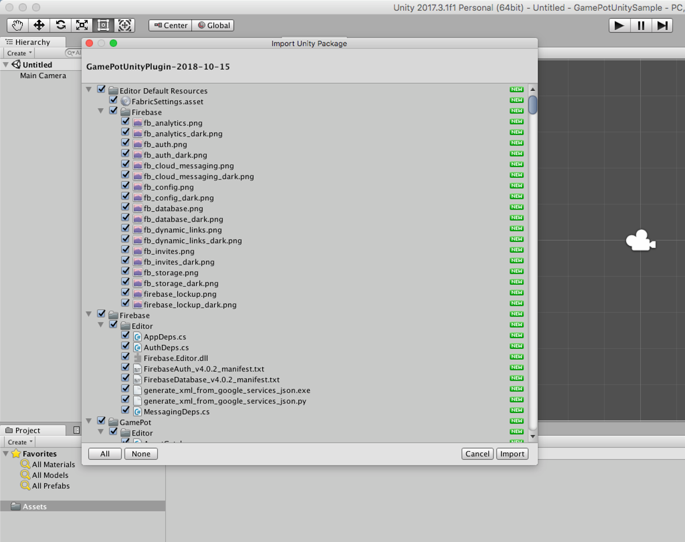

---
search:
  keyword: ['gamepot']
---

# Unity SDK

> ### 这是机器翻译的文档，可能在词汇，语法或语法上有错误。 我们很快会为您提供由专业翻译人员翻译的文档。
>
> #### 如有任何疑问，请[联系我们](https://www.ncloud.com/support/question)。
>
> 我们将尽一切努力进一步改善我们的服务。

## 1. 开始吧

### Step 1. 导入 GAMEPOT 插件

连接到创建的 GAMEPOT 仪表板并下载最新的插件。

### Step 2. 导入插件

**Assets > Import Package > Custom Package** 从菜单中选择下载的 GamePotUnityPlugin-xxxx.unitypackage 文件。


检查插件并将其导入以将其添加到项目中。



### Step 3. Android

#### 默认首选项

```d
minSdkVersion : API 17 (Jelly Bean, 4.2)
```

**Gradle 如何设置环境**

/Assets/Plugin/Android/mainTemplate.gradle 在编辑器中打开文件。

```java
...
android {
    ...
    defaultConfig {
        ...
        resValue "string", "gamepot_project_id", "" // required
        resValue "string", "gamepot_store", "google" // required
        resValue "string", "gamepot_app_title","@string/app_name" // required (fcm)
        resValue "string", "gamepot_push_default_channel","Default" // required (fcm)
        resValue "string", "facebook_app_id", "0" // optional (facebook)
        resValue "string", "fb_login_protocol_scheme", "fb0" // optional (facebook)
        // resValue "string", "gamepot_elsa_projectid", "" // optional (ncp elsa)
    }
    ...
}
```

在下面找到并修改所需的值。 以下值应进行修改以正常运行。

```java
resValue "string", "[key]", "[value]"
```

| 价值                         | 描述                                                                                      |
| :--------------------------- | :---------------------------------------------------------------------------------------- |
| gamepot_project_id           | 请输入 GAMEPOT 发布的项目 ID。                                                            |
| gamepot_store                | 储值\（`google`或`one`或`galaxy`）                                                        |
| gamepot_app_title            | 应用标题 (FCM)                                                                            |
| gamepot_push_default_channel | 注册的默认频道名称 (Default) - 不要换。                                                   |
| facebook_app_id              | Facebook 应用程序 ID                                                                      |
| fb_login_protocol_scheme     | Facebook 发布的协议方案 fb \ [app_id \]                                                   |
| gamepot_elsa_projectid       | 使用 NCLOUD ELSA 时的项目 ID（[了解更多](https://www.ncloud.com/product/analytics/elsa)） |

**如何更改通知栏上的推送图标**


收到推送时将在 Android 通知栏上显示的小图标作为 SDK 内的默认图像公开，可以直接添加。

如果您想自己添加图片，则需要将图片放在每个“ drawable”文件夹中([Android Asset Studio](http://romannurik.github.io/AndroidAssetStudio/icons-notification.html#source.type=clipart&source.clipart=ac_unit&source.space.trim=1&source.space.pad=0&name=ic_stat_gamepot_small)如果使用它来创建它，则会为每个文件夹自动创建图像。）

图像文件名应为 ic_stat_gamepot_small。

| 资料夹名称                                                     | 尺寸  |
| :------------------------------------------------------------- | :---- |
| /Assets/Plugins/Android/GamePotResources/res/drawable-mdpi/    | 24x24 |
| /Assets/Plugins/Android/GamePotResources/res/drawable-hdpi/    | 36x36 |
| /Assets/Plugins/Android/GamePotResources/res/drawable-xhdpi/   | 48x48 |
| /Assets/Plugins/Android/GamePotResources/res/drawable-xxhdpi/  | 72x72 |
| /Assets/Plugins/Android/GamePotResources/res/drawable-xxxhdpi/ | 96x96 |

**Screen Orientation 如何设置**

使用编辑器打开/Assets/Plugin/Android/AndroidManifest.xml 文件。

```markup
...
    <activity android:screenOrientation="sensorLandscape">
      <intent-filter>
        <action android:name="android.intent.action.MAIN" />
          ...
      </intent-filter>
    </activity>
...
```

在主要活动中添加 screenOrientation，然后根据游戏输入`sensorLandscape`或`sensorPortrait`。

**Android Resolver Settings**

`Assets > Play Services Resolver > Android Resolver > Settings` 转到菜单。


`Enable Resolution On Build` 请清除该复选框。


**Unity Build Settings**

`File > Build Settings > Build System` 从菜单中选择 Gradle。


### Step 4. iOS

> 如果您不想使用 GameCenter 登录名，请在以下位置删除文件。
>
> > `Assets/Plugins/IOS/Frameworks/GamePotGameCenter.framework`
> > 如果包含该库，则必须在“功能”设置中激活 GameCenter。

将从 Google Firebase 下载的`GoogleService-Info.plist`文件复制到`/ Assets / Plugins / IOS /`。

在/Assets/Plugin/IOS/GamePotConfig-Info.plist 中添加所需的环境变量。


| 环境变量                      | 描述                                              |
| ----------------------------- | ------------------------------------------------- |
| gamepot_project_id            | 请输入 GAMEPOT 发布的项目 ID。                    |
| gamepot_facebook_app_id       | Facebook 应用程序 ID                              |
| gamepot_facebook_display_name | Facebook 上显示的名称                             |
| gamepot_google_app_id         | GoogleService-Info 文件中的 CLIENT_ID 值          |
| gamepot_google_url_schemes    | RoogleService-Info 文件中的 REVERSED_CLIENT_ID 值 |
| gamepot_elsa_projectid        | 使用 NCLOUD ELSA 时的项目 ID                      |

添加场景后，运行“文件”>“构建设置”>“构建并运行”，操作就完成了。


XCode 构建后

在目标>>信息>>自定义 iOS 目标属性中，请在下面添加“用户权限获取选项”。

此用户权限在 GamePot 客户中心的文件上传功能中使用。

```text
NSCameraUsageDescription
NSPhotoLibraryUsageDescription
```

iOS 14 或更高版本

从 iOS 14 开始，获得 IDFA 值后，用户必须获得许可。

已对其进行了更改以启用 IDFA 值的获取。

因此，如果您使用弹出式窗口在获取 IDFA 值时获得了用户的授权，
在目标>>信息>>自定义 iOS 目标属性中，请在下面添加用户权限获取选项。

> 2020.09.11 <br/>
> 当苹果获得 IDFA 值时，为获得用户许可而强制性弹出窗口的申请已推迟到 2021 年初。<br/>
> 请参阅下面的链接。<br/>

```text
NSUserTrackingUsageDescription
```

## 2. 重启

将以下代码添加到用于在启动游戏时加载的第一个场景的对象中。

```csharp
using GamePotUnity;
public class GamePotLoginSampleScene : MonoBehaviour {
    void Awake() {
        GamePot.initPlugin();
    }
    void Start () {
        GamePot.setListener(GamePotInterface.cs继承到的class);
         // ex) GamePot.setListener(new GamePotSampleListener());
    }

}

ex)
public class GamePotSampleListener : MonoBehaviour , IGamePot {
    ....
}
```

## 3. 错误代码

```csharp
public class NError
{
    // 未知错误
    public static readonly int CODE_UNKNOWN_ERROR           = 0;
    // 初始化失败
    public static readonly int CODE_NOT_INITALIZE           = 1;
    // 如果参数不正确
    public static readonly int CODE_INVAILD_PARAM           = 2;
    // 没有会员ID数据
    public static readonly int CODE_MEMBERID_IS_EMPTY       = 3;
    // 未登录
    public static readonly int CODE_NOT_SIGNIN              = 4;
    // 未初始化网络模块时
    public static readonly int CODE_NETWORK_MODULE_NOT_INIT = 3000;
    // 如果出现网络连接错误和超时
    public static readonly int CODE_NETWORK_ERROR           = 3001;
    // 服务器端错误
    public static readonly int CODE_SERVER_ERROR            = 4000;
    // http响应代码不成功
    public static readonly int CODE_SERVER_HTTP_ERROR       = 4001;
    // 如果出现网络连接错误和超时
    public static readonly int CODE_SERVER_NETWORK_ERROR    = 4002;
    // 解析从服务器接收的数据时出错
    public static readonly int CODE_SERVER_PARSING_ERROR    = 4003;
    // 当付款中发生未知错误并且商店发出错误时
    public static readonly int CODE_CHARGE_UNKNOWN_ERROR    = 5000;
    // 未输入产品ID
    public static readonly int CODE_CHARGE_PRODUCTID_EMPTY  = 5001;
    // 如果商品ID不正确
    public static readonly int CODE_CHARGE_PRODUCTID_WRONG  = 5002;
    // 消费时出错
    public static readonly int CODE_CHARGE_CONSUME_ERROR    = 5003;

    // error Code
    public int code { get; set; }
    // error Message
    public string message { get; set; }
}
```

## 4. 登录首选项

### Google 登录

#### Google Firebase Console

1. 从 Google Firebase 控制台下载适用于 Android 的 google-service.json 文件，然后将其复制到`/ Assets / Plugins / Android /`中。
2. 将构建 APK 时使用的密钥库的 SHA-1 值添加到 Google Firebase 控制台。
3. 从 Google Firebase 控制台下载 iOS 的 GoogleService-Info.plist 文件，并将其复制到`/ Assets / Plugins / IOS /`。

**登录到 Google 时，onCancel 会响应并且无法登录**。请检查以下内容。

1. 检查上面请求的 google-service.json 文件是否成功应用
2. 检查在构建期间使用的密钥库是否是从中提取在 Firebase 控制台中注册的 sha-1 的密钥库。
3. 确保使用在 Firebase 控制台中注册的软件包名称进行构建

### Facebook 登入

#### Facebook Developer Console

将构建 APK 时使用的密钥库的密钥哈希值添加到 Facebook 控制台。

#### Android

修改 mainTemplate.gradle

```java
...
defaultConfig {
    resValue "string", "facebook_app_id", "1234567890"
    resValue "string", "fb_login_protocol_scheme", "fb1234567890"
}
...
```

在“ facebook_app_id”的值中输入由 Facebook 开发人员中心发布的应用 ID，在“ fb_login_protocol_scheme”的值中输入“ fb {facebook_app_id}”。

如果 app_id 为 1234567890，则 fb1234567890 是`fb_login_protocol_scheme`的值。

#### iOS

/Assets/Plugins/IOS/Frameworks 将以下框架添加到路径。

FBSDKLoginKit.framework FBSDKCoreKit.framework GamePotFacebook.framework

### APPLE登录

> 此功能仅适用于 iOS。（对于Android，它以Web登录的形式受支持-请参阅8。其他API）

**添加 Xcode > TARGETS > Signing & Capabilities > + Capability > Sign In with Apple**


### 游戏中心登录

> 此功能仅适用于 iOS。
>
> 如果您使用的是 GameCenter 登录名，请如下图所示进行设置。
>
> > `Assets/Plugins/IOS/etcFrameworks/GamePotGameCenter.framework`


> 如果包含该库，则必须在“功能设置”中启用 GameCenter。

在**Xcode> Build Phases> Linked Binary With Libraries**中添加 Gamekit.framework。


**添加 Xcode>目标>签名和功能> +功能> GameCenter。**在 Xcode 中添加 Gamekit.framework>构建阶段>库链接二进制。


## 5. 登录/注销/取款/验证

### 登录

用户帐户创建时没有单独的订阅。 为所有身份验证生成 MemberId，并将生成的信息存储在 NUserInfo 结构中并返回。

- Case 1

Request:

```csharp
GamePot.login(NCommon.LoginType);
```

Response:

```csharp
// 登录成功
public void onLoginSuccess(NUserInfo userInfo)
{
}
// 登录失败
public void onLoginFailure(NError error)
{
     //登录失败时
     //请通过弹出窗口告知用户error.message。
// 取消登录
public void onLoginCancel()
{
    // 当用户随机取消登录时
}
// 强制更新（商店版本和客户端版本不同时调用）
public void onNeedUpdate(NAppStatus status)
{
    /// TODO：您应该通过根据传递给参数的状态信息创建一个弹出窗口来通知用户。
    // TODO：选择以下两种方法之一。
    //情况1：通过游戏内弹出窗口直接从开发人员实现UI
    //情况2：使用SDK的弹出窗口（在这种情况下，请调用下面的代码）
    // GamePot.showAppStatusPopup(status.ToJson());
}
// 检查（在仪表板上启用检查时调用）
public void onMainternance(NAppStatus status)
{
        // TODO：您应该通过根据传递给参数的状态信息创建一个弹出窗口来通知用户。
     // TODO：选择以下两种方法之一。
     //情况1：通过游戏内弹出窗口直接从开发人员实现UI
     //情况2：使用SDK的弹出窗口（在这种情况下，请调用下面的代码）
    // GamePot.showAppStatusPopup(status.ToJson());
}
// 退出应用
public void onAppClose()
{
    // TODO：在情况2中实施强制更新或检查功能时
     // TODO：由于可以强制终止该应用程序，因此请实施该应用程序，以便可以在此处终止该应用程序。
}
```

- Case 2

Request:

```csharp
GamePot.login(NCommon.LoginType, GamePotCallbackDelegate.CB_Login);
```

```csharp
GamePot.login(NCommon.LoginType, (resultState, userInfo, appStatus, error) => {
    switch (resultState)
    {
        case NCommon.ResultLogin.SUCCESS:
        // login success
        break;
        case NCommon.ResultLogin.CANCELLED:
        // login cancel
        break;
        case NCommon.ResultLogin.FAILED:
        // login fail
        break;
        default:
        break;
    }
});
```

LoginType 正义

```csharp
public enum LoginType
{
    NONE,
    GOOGLE,
    GOOGLEPLAY,
    FACEBOOK,
    NAVER,
    GAMECENTER,
    TWITTER,
    LINE,
    APPLE,
    GUEST,
    THIRDPARTYSDK
}
```

NUserInfo 正义

```csharp
public class NUserInfo
{
    public string memberid { get; set; }        // 成员ID（玩家独特ID）
    public string name { get; set; }            // 姓名
    public string profileUrl { get; set; }      // 简介URL（存在时）
    public string email { get; set; }           // 邮件（存在时）
    public string token { get; set; }           // 用于用户有效性检查的令牌（在Token Authentication API中使用）
    public string userid { get; set; }          // Social ID(google, facebook ...)
}
```

NAppStatus 正义
```csharp
public class NAppStatus
{
    public string type {get;set; } // AppStatus类型 “maintenance”：检查，“needupdate”：更新
    public string message {get;set; } //检查设置：在控制台中输入的消息
    public string url {get;set; } //检查设置：在控制台中输入的URL
    public string currentAppVersion {get;set; } //更新：当前应用程序版本
    public string updateAppVersion {get;set; } //更新：在控制台中输入的应用版本
    public int currentAppVersionCode {get;set; } //更新：当前应用程序代码
    public int updateAppVersionCode {get;set; } //更新：在控制台中输入的应用版本代码
    public bool isForce {get;set; } //更新：在仪表板中设置强制更新时为true
    public string resultPayload {get;set; } //您可以忽略它作为从客户端SDK传递的Json值。
    public double startsAt {get;set; } //检查：开始时间
    public double endAt {get;set; } //检查：结束时间
}
```

### 获取登录信息

```csharp
GamePot.getMemberId(); // 会员ID（用户的唯一ID）
```

### 自动登录

```csharp
NCommon.LoginType type = GamePot.getLastLoginType();
if(type != NCommon.LoginType.NONE) {
{
    // 如何使用最后一种登录类型登录。
    GamePot.login(type);
}
else
{
    // 第一次运行或注销游戏。 请转到您可以登录的登录屏幕。
}
```

### 登出

注销用户。 该帐户不会被删除，您可以使用同一帐户登录。

- Case 1

Request:

```csharp
GamePot.logout();
```

Response:

```csharp
/// 注销成功
public void onLogoutSuccess()
{
}

/// 登出失败
public void onLogoutFailure(NError error)
{
    // 当注销失败时
     //请通过弹出窗口告知用户error.message。
}
```

- Case 2

Request:

```csharp
GamePot.logout(GamePotCallbackDelegate.CB_Common);
```

```csharp
GamePot.logout((success, error) => {
   if(success)
   {
       // 注销成功
   }
   else
   {
         //当注销失败时
         //请通过弹出窗口告知用户error.message。
   }
});
```

### 脱离

会员资格撤销，无法恢复。

- Case 1

Request:

```text
GamePot.deleteMember();
```

Response:

```csharp
/// 会员提现成功
public void onDeleteMemberSuccess() {
}

/// 会员退出失败
public void  onDeleteMemberFailure(NError error) {
    // 如果会员资格提取失败
    //请通过弹出窗口告知用户error.message。
}
```

- Case 2

Request:

```csharp
GamePot.deleteMember(GamePotCallbackDelegate.CB_Common);
```

```csharp
GamePot.deleteMember((success, error) => {
   if(success)
   {
        // 成功退出会员
   }
   else
   {
        // 如果成员退出失败
        // 请通过弹出窗口告知用户error.message。
   }
});
```

### 验证

完成登录后，通过将登录信息从开发者服务器传递到 GAMEPOT 服务器来执行登录验证。

有关更多信息，请参阅服务器到服务器 api 菜单中的“令牌认证”项。

## 6. 帐户关联

此功能允许您将多个社交帐户（Google / Facebook 等）连接/断开到一个游戏帐户。

> 在开发人员中实现互锁屏幕 UI。

```csharp
public enum LinkingType
{
    GOOGLEPLAY,
    GAMECENTER,
    GOOGLE,
    FACEBOOK,
    NAVER,
    TWITTER,
    LINE,
    APPLE
}
```

### 蠕动

您可以将您的帐户与 ID 关联，例如 Google / Facebook。

- Case 1

Request:

```csharp
void GamePot.createLinking(NCommon.LinkingType.XXXXX);
```

Response:

```csharp
/// 取消帐户关联
public void onCreateLinkingCancel() {
    // 当用户取消帐户关联时
}

/// 帐户链接成功
public void onCreateLinkingSuccess(NUserInfo userInfo) {
}

/// 帐户链接失败
public void onCreateLinkingFailure(NError error) {
    // 当帐户关联失败时
    // 请通过弹出窗口告知用户error.message。
}
```

- Case 2

Request:

```csharp
void GamePot.createLinking(NCommon.LinkingType.XXXXX, GamePotCallbackDelegate.CB_CreateLinking);
```

```csharp
GamePot.createLinking(NCommon.LinkingType.XXXXX, (resultState, userInfo, error) => {
      switch (resultState)
    {
        case NCommon.ResultLinking.SUCCESS:
        // 成功的帐户关联
        break;
        case NCommon.ResultLinking.CANCELLED:
        // 取消帐户关联
        break;
        case NCommon.ResultLinking.FAILED:
        // 帐户关联失败
        break;
        default:
        break;
    }
});
```

您可以获得所有当前链接的帐户信息。

```csharp
List<NLinkingInfo> linkedList = GamePot.getLinkedList();
```

定义链接信息

```csharp
public class NLinkingInfo
{
    public LinkingType provider { get; set; }  // google, facebook, naver, apple..
}
```

### 开锁

取消现有的关联帐户。

- Case 1

Request :

```csharp
void GamePot.deleteLinking(NCommon.LinkingType.XXXXX);
```

Response:

```csharp
/// 取消帐户关联成功
public void onDeleteLinkingSuccess() {
}

/// 帐户取消关联失败
public void onDeleteLinkingFailure(NError error) {
    //当取消链接失败时
    //请通过弹出窗口告知用户error.message。
}
```

- Case 2

Request:

```csharp
void GamePot.deleteLinking(NCommon.LinkingType.XXXXX, GamePotCallbackDelegate.CB_Common);
```

```csharp
GamePot.deleteLinking(NCommon.LinkingType.XXXXX, (success, error) => {
    if(success)
    {
       // 取消帐户关联成功
    }
   else
   {
        // 取消链接的情况
        // 请通过弹出窗口告知用户error.message。
    }
});
```

#### 帐户关联状态的处理结果示例

根据 createLinking / deleteLinking 的结果，它会接收当前已链接的帐户信息，并更新已链接状态的 UI。

```csharp
public void onInit()
{
    UI_Update();
}
public void onCreateLink_GAMECENTER_Click()
{
    GamePot.createLinking(NCommon.LinkingType.GAMECENTER);
}
public void onCreateLink_GOOGLE_Click()
{
    GamePot.createLinking(NCommon.LinkingType.GOOGLE);
}
public void onCreateLinkingSuccess(NUserInfo userInfo)
{
    UI_Update();
}
public void onCreateLinkingFailure(NError error)
{
    UI_Update();
}
public void onDeleteLinkingSuccess(NUserInfo userInfo)
{
    UI_Update();
}
public void onDeleteLinkingFailure(NError error)
{
    UI_Update();
}

Public void UI_Update()
{
    // Ui Update in GAME
    CreateLinkManager.instance._IOS_google_state  = false;
    CreateLinkManager.instance._IOS_gamecenter_state  = false;

    List<NLinkingInfo> linkedList = GamePot.getLinkedList();
    foreach ( NLinkingInfo item in linkedList)
    {
        switch(item.provider)
        {
        case NCommon.LinkingType.GOOGLE :
            CreateLinkManager.instance._IOS_google_state  = true;
            break;
        case NCommon.LinkingType.GAMECENTER :
            CreateLinkManager.instance._IOS_gamecenter_state  = true;
            break;

        ...

        }
    }
}
```

## 7. 付款

### 应用内商品查询

交付在商店中注册的产品信息。

如果使用此功能，价格，货币和产品名称将根据用户显示不同。

```csharp
NPurchaseItem[] items = GamePot.getPurchaseItems();
foreach(NPurchaseItem item in items) {
    Debug.Log(item.productId);        // 产品ID
    Debug.Log(item.price);            // 价格
    Debug.Log(item.title);            // 标题
    Debug.Log(item.description);    // 概述
}
```

### 应用内商品付款

Google，Apple 和 App Store 可以使用以下功能之一进行付款。

- Case 1

Request:

```csharp
// productId：输入在商店中注册的产品ID。
// uniqueId：您可以输入单独管理的收据编号。
// serverId：输入进行付款的角色的服务器ID。
// playerId：输入进行付款的角色的角色ID。
// etc       : 您可以输入其他信息，例如付款的字符。
GamePot.purchase(string productId);

GamePot.purchase(string productId, string uniqueId);

GamePot.purchase(string productId, string uniqueId, string serverId, string playerId, string etc);
```

Response:

```csharp
/// 应用内付款成功
public void onPurchaseSuccess(NPurchaseInfo purchase) {
}

/// 应用内付款失败
public void onPurchaseFailure(NError error) {
    //付款失败时
     //请通过弹出窗口告知用户error.message。
}

/// 应用内付款失败
public void onPurchaseCancel() {
}
```

- Case 2

Request:

```csharp
// productId : 在市场上注册的产品ID
GamePot.purchase(string productId, GamePotCallbackDelegate.CB_Purchase);

GamePot.purchase(string productId, string uniqueId, GamePotCallbackDelegate.CB_Purchase);

GamePot.purchase(string productId, string uniqueId, string serverId, string playerId, string etc, GamePotCallbackDelegate.CB_Purchase);

```

```csharp
GamePot.purchase(productId, (resultState, purchaseInfo, error) => {
      switch (resultState)
    {
        case NCommon.ResultPurchase.SUCCESS:
        // purchase success
        break;
        case NCommon.ResultPurchase.CANCELLED:
        // purchase cancel
        break;
        case NCommon.ResultPurchase.FAILED:
        // purchase fail
        break;
        default:
        break;
    }
});
```

### NPurchaseInfo 正义

有关成功付款后已付款商品的信息。 您可以使用它作为参考。

```csharp
public class NPurchaseInfo
{
    public string price { get; set; }               // 付款项目的价格
    public string productId { get; set; }           // 付款项目ID
    public string currency { get; set; }            // 付款价格币种(KRW/USD)
    public string orderId { get; set; }             // 商店订单ID
    public string productName { get; set; }         // 付款项目名称
    public string gamepotOrderId { get; set; }      // 由GAMEPOT创建的订单ID
    public string uniqueId { get; set; }            // 开发者的唯一ID
    public string serverId { get; set; }            // 服务器ID（付款人的角色）
    public string playerId { get; set; }            // 角色ID（付款人的角色）
    public string etc { get; set; }                 // 其他信息（付款人的信息）
    public string signature { get; set; }           // 付款签名
    public string originalJSONData { get; set; }    // 收据数据
}
```

### 付款项目付款

非法付款是不可能的，因为 GAMEPOT 在通过服务器到服务器 api 验证了付款存储区中的收据后，要求向开发者的服务器付款。

为此，请参考“服务器到服务器 api”菜单中的“购买 Webhook”项并进行处理。

###外部付款

使用此功能，您可以在允许外部付款的商店和非官方商店中使用付款。

> 仅调用 API 有所不同，其余（例如响应和购买 Webhook）与正常付款相同。
>
> 要使用此功能，需要进行设置。 请参阅仪表板手册的“外部付款”部分。

- Case 1

Request:

```csharp
// productId : 在市场上注册的产品ID
GamePot.purchaseThirdPayments(string productId);
```

使用外部付款时，请使用下面的 api 获取产品信息列表。

Request:

```csharp
// 返回的数据格式与getPurchaseItems（）相同。
GamePot.getPurchaseThirdPaymentsItems();
```

- Case 2

Request:

```csharp
// productId : 在市场上注册的产品ID
GamePot.purchaseThirdPayments(string productId, GamePotCallbackDelegate.CB_Purchase);
```

```csharp
// 返回的数据格式与getPurchaseItems（）相同。
GamePot.purchase(productId, (resultState, purchaseInfo, error) => {
      switch (resultState)
    {
        case NCommon.ResultPurchase.SUCCESS:
        // purchase success
        break;
        case NCommon.ResultPurchase.CANCELLED:
        // purchase cancel
        break;
        case NCommon.ResultPurchase.FAILED:
        // purchase fail
        break;
        default:
        break;
    }
});
```

## 8. 其他 API

### SDK支持登录UI

SDK中自行提供（完成形式的）Login UI。

```csharp
public class NLoginUIInfo
{
    public NCommon.LoginType[] loginTypes { get; set; }     // 显示的Login UI类型（排列）
    public bool showLogo { get; set; }                      // 是否显示镜像标志
}
```

#### SDK登录UI调用

- Case 1

Request:

```csharp
 NLoginUIInfo info = new NLoginUIInfo();

//待调用登录UI类型
 info.loginTypes = new NCommon.LoginType[]
 {
     NCommon.LoginType.GOOGLE,
     NCommon.LoginType.FACEBOOK,
     NCommon.LoginType.GUEST
     ...
 };
 info.showLogo = true;
 GamePot.showLoginWithUI(info);
```

Response:

 **与一般登录API回复逻辑相同。 （但onLoginCancel / onLoginFailure时，Native等级中将以提示信息处理）**

```csharp
// 登录成功
public void onLoginSuccess(NUserInfo userInfo)
{
}
// 强制更新（商店版本和客户端版本不一致时调用）
public void onNeedUpdate(NAppStatus status)
{
    // TODO：要基于从参数导入的status信息创建弹窗告知用户。
    // TODO：请从下列两种方式中选择一种。
    // case 1：通过游戏内弹窗由开发公司直接实现UI
    // case 2：使用SDK的弹窗（此时请调用下列代码。）
    // GamePot.showAppStatusPopup(status.ToJson());
}
// 检验（仪表盘中检验被激活时调用）
public void onMainternance(NAppStatus status)
{
       // TODO：要基于从参数导入的status信息创建弹窗告知用户。
    // TODO：请从下列两种方式中选择一种。
    // case 1：通过游戏内弹窗由开发公司直接实现UI
    // case 2：使用SDK的弹窗（此时请调用下列代码。）
    // GamePot.showAppStatusPopup(status.ToJson());
}
// 应用程序终止
public void onAppClose()
{
    // TODO：用case 2方式实现强制更新或检验功能时
    // TODO：可能会强制终止应用程序，因此请在此终止应用程序。
}
```

- Case 2

Request:

```csharp
 GamePot.showLoginWithUI(NLoginUIInfo, GamePotCallbackDelegate.CB_Login);
```

```csharp
 GamePot.showLoginWithUI(NLoginUIInfo, (resultState, userInfo, appStatus, error) => {
    switch (resultState)
    {
        case NCommon.ResultLogin.SUCCESS:
        // login success
        break;
        default:
        break;
    }
});
```

#### Customizing

**登录UI镜像标志变更方法**

登录UI上方显示的镜像标志在SDK内部中以默认镜像显示，也可以直接添加。

**[Android]**

> 直接添加时，须在各`drawable`文件夹放入镜像。\(利用[Android Asset Studio](http://romannurik.github.io/AndroidAssetStudio/icons-notification.html#source.type=clipart&source.clipart=ac_unit&source.space.trim=1&source.space.pad=0&name=ic_stat_gamepot_login_logo)制作时，镜像将按文件夹自动制作，更加方便。\)

镜像文件名应为ic_stat_gamepot_login_logo.png。

| 文件夹名称                                                         | 大小  |
| :------------------------------------------------------------- | :---- |
| /Assets/Plugins/Android/GamePotResources/res/drawable-mdpi/    | 78x55 |
| /Assets/Plugins/Android/GamePotResources/res/drawable-hdpi/    | 116x82 |
| /Assets/Plugins/Android/GamePotResources/res/drawable-xhdpi/   | 155x110 |
| /Assets/Plugins/Android/GamePotResources/res/drawable-xxhdpi/  | 232x165 |
| /Assets/Plugins/Android/GamePotResources/res/drawable-xxxhdpi/ | 310x220 |

 **[iOS]**

> 镜像标志在GamePot.bundle中，以ic_stat_gamepot_logo.png文件格式存在。

将镜像文件名变更为`ic_stat_gamepot_login_logo.png`后更换。

（推荐大小：310x220）

**屏幕方向设置方法**

**[Android]**

/Assets/Plugin/Android/AndroidManifest.xml文件须使用编辑器打开。

```markup
...e
    <activity android:screenOrientation="sensorLandscap">
      <intent-filter>
        <action android:name="android.intent.action.MAIN" />
          ...
      </intent-filter>
    </activity>
...
```

在Main Activity中添加screenOrientation后，请根据游戏输入`sensorLandscape`或`sensorPortrait`。


###  Apple Developers (for Android - Web Login)

#### GAMEPOT Dashboard

仪表板项目设置>>常规>> Apple ID登录设置

> 要使用该功能，您需要设置Apple Developer Console。
>
> 请参阅仪表板上相应项目中的**得到帮助**。

将下面的aar文件添加到/ Assets / Plugins / Android / libs路径。 （选中用于插件的精选平台-Android）
- gamepot-channel-apple-signin.aar

### NAVER 登录

#### Naver Developers

选择使用 API​​ 为“nearo”后注册应用程序

#### Android

mainTemplate.gradle 改性

```java
...
defaultConfig {
    resValue "string", "gamepot_naver_clientid", "abcdefg1234567890"
    resValue "string", "gamepot_naver_secretid", "hijklmn"
}
...
```

在“ gamepot_naver_clientid”值中输入从控制台发出的客户端 ID，在“ gamepot_naver_secretid”值中输入客户端密钥。

#### iOS

GamePotConfig-Info.plist 将以下项目添加到文件中，然后输入相应的值。

```text
gamepot_naver_clientid // Naver使用的客户端ID
gamepot_naver_secretid // Naver使用的秘密ID
gamepot_naver_urlscheme // Naver使用的urlscheme
```

在查看 GamePotConfig-Info.plist 文件作为 SourceCode 时，添加如下内容

```markup
...
<key>gamepot_naver_clientid</key>
<string>xxxxxx</string>
<key>gamepot_naver_secretid</key>
<string>xxxxxx</string>
<key>gamepot_naver_urlscheme</key>
<string>xxxxxx</string>
...
```

在“目标>>信息>> URL 类型”中，添加使用 NAVER ID 在登录设置中注册的 URL 方案。

在创建 URL 方案时，请注意，可能无法识别除小写字母，。，\_以外的其他字符。

### Line 登录

#### LINE Developers

将构建 APK 时使用的包名称，密钥库的 SHA 值和 url 方案值添加到命令行控制台。

#### Android

mainTemplate.gradle 改性

在“ gamepot_line_channelid”值中输入颁发的客户 ID。

```java
...
defaultConfig {
    resValue "string", "gamepot_line_channelid","xxxxxxx"
}
...
```

#### iOS

/Assets/Plugins/IOS/GamePotConfig-Info.plist 将以下项目添加到文件中，然后输入相应的值。

```text
gamepot_line_channelid // Naver使用的客户端ID
gamepot_line_url_schemes // Line URL Scheme (line3rdp.{项目包 identifier})
```

当以 SourceCode 形式查看 GamePotConfig-Info.plist 文件时，添加如下内容。

```markup
...
<key>gamepot_line_channelid</key>
<string>xxxxxx</string>
<key>gamepot_line_url_schemes</key>
<string>xxxxxx</string>
...
```

### Twitter 登录

#### Twitter Developers

#### Android

mainTemplate.gradle 改性

```java
...
defaultConfig {
        resValue "string", "gamepot_twitter_consumerkey","xxxxx" // Twitter 从开发者控制台获取
        resValue "string", "gamepot_twitter_consumersecret","xxx" // Twitter 从开发者控制台获取
}
...
```

#### iOS

将以下各项添加到 GamePotConfig-Info.plist 文件中，然后输入相应的值。

```text
gamepot_twitter_consumerkey : Twitter Consumer Key
gamepot_twitter_consumersecret :  Twitter Consumer Secret
```

在查看 GamePotConfig-Info.plist 文件作为 SourceCode 时，添加如下内容

```markup
...
<key>gamepot_twitter_consumerkey</key>
<string>xxxxxx</string>
...
```

### 优惠券

#### 优惠券兑换

> 实施从开发者那里接收优惠券的 UI。

- Case 1

Request:

```csharp
GamePot.coupon(string couponNumber); // 优惠券编号

GamePot.coupon(string couponNumber, string userData); // 优惠券号码，用户信息
```

Response:

```csharp
/// 优惠券使用成功
public void onCouponSuccess() {
}

/// 优惠券使用失败
public void onCouponFailure(NError error) {
    //如果您无法使用优惠券
    //请通过弹出窗口告知用户error.message。
}
```

- Case 2

Request:

```csharp
GamePot.coupon(string couponNumber, GamePotCallbackDelegate.CB_Common); // 优惠券编号

GamePot.coupon(string couponNumber, string userData, GamePotCallbackDelegate.CB_Common);    // 优惠券编号，用户信息
```

```csharp
GamePot.coupon(couponNumber, (success, error) => {
   if(success)
   {
       // 成功使用优惠券
   }
   else
   {
        // 如果您无法使用优惠券
        // 请通过弹出窗口告知用户error.message。
   }
});
```

#### 物品付款

如果优惠券成功使用，则要求开发者服务器通过服务器到服务器 api 支付商品。

为此，请参考服务器到服务器 api 菜单中的“ Item Webhook”项并进行处理。

### 开/关

推送和夜间推送可以分别进行开/关处理。

> 在开发人员中实现开/关 UI。

#### 推送设置

- Case 1

Request:

```csharp
GamePot.setPushStatus(bool pushEnable);
```

Response:

```csharp
/// 服务器通信成功完成推送状态更改
public void onPushSuccess() {
}

/// 用于推送状态更改的服务器通信失败
public void onPushFailure(NError error) {

    // 当推送状态更改失败时
    //请通过弹出窗口告知用户error.message。
}
```

- Case 2

Request:

```csharp
void GamePot.setPushStatus(bool pushEnable, GamePotCallbackDelegate.CB_Common);
```

```csharp
GamePot.setPushStatus(pushEnable, (success, error) => {
    if(success)
    {
        // 服务器通信成功完成推送状态更改
    }
   else
   {
    // 当推送状态更改失败时
    //请通过弹出窗口告知用户error.message。
    }
});
```

#### 夜间推送设置

- Case 1

Request:

```csharp
GamePot.setPushNightStatus(bool nightPushEnable);
```

Response:

```csharp
/// 夜间推送状态更改的服务器通信成功
public void onPushNightSuccess() {
}

/// 夜间推送状态更改的服务器通信失败
public void onPushNightFailure(NError error) {

    // 每晚推送​​状态更改失败
    // 请通过弹出窗口告知用户error.message。
}
```

- Case 2

Request:

```csharp
void GamePot.setPushNightStatus(bool nightPushEnable, GamePotCallbackDelegate.CB_Common);
```

```csharp
GamePot.setPushNightStatus(nightPushEnable, (success, error) => {
    if(success)
    {
        // 夜间推送状态更改的服务器通信成功
    }
   else
   {
        // 每晚推送​​状态更改失败
        // 请通过弹出窗口告知用户error.message。
    }
});
```

#### 广告推送设置

- Case 1

Request:

```csharp
GamePot.setPushADStatus(bool adPushEnable);
```

Response:

```csharp
/// 成功进行服务器通信以更改广告推送状态
public void onPushAdSuccess() {
}

/// 服务器推送广告更改状态失败
public void onPushAdFailure(NError error) {

    // 如果广告推送状态更改失败
    // 请通过弹出窗口告知用户error.message。
}
```

- Case 2

Request:

```csharp
void GamePot.setPushADStatus(bool adPushEnable, GamePotCallbackDelegate.CB_Common);
```

```csharp
GamePot.setPushADStatus(adPushEnable, (success, error) => {
    if(success)
    {
        // 成功进行服务器通信以更改广告推送状态
    }
   else
   {
        // 如果广告推送状态更改失败
        // 请通过弹出窗口告知用户error.message。
    }
});
```

#### 一 次推送/夜间推送/广告推送

如果允许在登录前进行推送/夜间推送，则登录后必须调用以下代码。

- Case 1

Request:

```csharp
GamePot.setPushStatus(bool pushEnable, bool nightPushEnable, bool adPushEnable);
```

Response:

```csharp
/// 服务器通信成功完成推送状态更改
public void onPushStatusSuccess() {
}

/// 服务器通信因推送状态更改而失败
public void onPushStatusFailure(NError error) {

    // 如果推送状态更改失败
    // 请通过弹出窗口告知用户error.message。
}
```

- Case 2

Request:

```csharp
void GamePot.setPushADStatus(bool pushEnable, bool nightPushEnable, bool adPushEnable, GamePotCallbackDelegate.CB_Common);
```

```csharp
GamePot.setPushADStatus(pushEnable, nightPushEnable, adPushEnable, (success, error) => {
    if(success)
    {
        // 服务器通信成功完成推送状态更改
    }
   else
   {
        // 如果推送状态更改失败
        // 请通过弹出窗口告知用户error.message。
    }
});
```

#### 推送状态查询

```csharp
NPushInfo pushInfo = GamePot.getPushStatus();

// pushInfo.enable  是否允许推送
// pushInfo.night   是否允许夜间推送
```

### 注意

此功能按顺序显示在 GAMEPOT 仪表板中添加到“通知”的图像。

推荐的图像规格如下。

- 尺寸 : 720 _1200(Portrait) / 1280_ 640(Landscape)

  > 如果未观察到上述尺寸，则图像将作为中心裁切进行处理。

- 容量：250KB 以下

Request:

```csharp
GamePot.showNotice(bool Flag = true);

// true：申请今天不看
// false：强制曝光，无论今天没有看到

GamePot.showEvent(string Type)

// Type : 仪表板注意>>仅暴露与“类别”中设置的类别名称相对应的图像
```

Response:

如果在 GAMEPOT 信息中心中将“点击操作”设置为“ SCHEME”，则在点击相应的图片时会传递“ SCHEME”值。

```csharp
public void onReceiveScheme(string scheme)
{
    // 传递在GAMEPOT仪表板中设置的方案值
}
```

### 客户支持

此功能允许客户向操作员注册查询并接收答案。

与我们联系 UI 会根据设备语言进行更改。 它支持韩文，英文，日文和中文（简体和繁体），其他语言以英文显示。

#### 呼叫

```csharp
GamePot.showCSWebView();
```

未登录的客户可以通过支持外部链接来注册查询。

#### 呼叫

```csharp
// url : GamePod发行的外部客户支持URL

GamePot.showWebView(string url);
```

### 本地推送(Local Push notification)

此功能无需通过推送服务器即可在终端上显示推送。

#### 推送注册

这是在给定时间公开本地推送的方法。

> 作为返回值传递的 pushId 由开发人员管理。

```csharp
int pushId = GamePot.sendLocalPush(DateTime.Parse("2018-01-01 00:00:00"), "title", "content");
```

#### 取消注册推送

您可以基于在推送注册过程中获得的 pushId 取消先前注册的推送。

```csharp
GamePot.cancelLocalPush(/*推送注册期间获取的PushId*/);
```

### 接受条款

提供了 UI，以便用户可以轻松接受“使用条款”和“个人信息收集和使用指南”。

除了`BLUE`主题与`GREEN`主题两种`默认主题`以外，还提供11种新添加的`改善主题`。

各领域可以自定义。

#### 条款及细则电话

```csharp
// 基本主题
BLUE
GREEN

// 改善主题
MATERIAL_RED,
MATERIAL_BLUE,
MATERIAL_CYAN,
MATERIAL_ORANGE,
MATERIAL_PURPLE,
MATERIAL_DARKBLUE,
MATERIAL_YELLOW,
MATERIAL_GRAPE,
MATERIAL_GRAY,
MATERIAL_GREEN,
MATERIAL_PEACH,
```

> 开发者同意公开适合该游戏的弹出窗口。
>
> 单击“查看”按钮时显示的内容可以在仪表板中应用和修改。

- Case 1

Request:

```csharp
// 基本通话（适用于蓝色主题）
GamePot.showAgreeDialog();

// 其它主题应用时
NAgreeInfo info = new NAgreeInfo();
info.theme = "MATERIAL_RED";
GamePot.showAgreeDialog(info);
```

Response:

```csharp
// 如果您同意条款
public void onAgreeDialogSuccess(NAgreeResultInfo info)
{
     // info.agree：如果所有必需条款都已同意，则为true
     // info.agreeNight：如果选中了接受夜间广告的同意，则为true；否则为false
     //完成登录后，通过setPushNightStatus api传递acceptNight的值。
}

// 发生错误
public void onAgreeDialogFailure(NError error)
{
    // 请通过弹出窗口告知用户error.message。
}
```

- Case 2

Request:

```csharp
// 基本通话（适用于蓝色主题）
showAgreeDialog(GamePotCallbackDelegate.CB_ShowAgree);

// 其它主题应用时
NAgreeInfo info = new NAgreeInfo();
info.theme = "MATERIAL_RED";
GamePot.showAgreeDialog(info,GamePotCallbackDelegate.CB_ShowAgree);
```

```csharp
GamePot.showAgreeDialog(bool info, (success, NAgreeResultInfo agreeInfo, NError error) => {
   if(success)
   {
        // 如果您同意条款
   }
   else
   {
        // 发生错误
        // 请通过弹出窗口告知用户error.message。
   }
});
```

#### Customizing

更改颜色以匹配游戏而不使用主题。

您可以在调用协议之前在“ NAgreeInfo”中为每个区域指定颜色。

```csharp
NAgreeInfo info = new NAgreeInfo();
info.theme = "MATERIAL_RED";
info.headerBackGradient = new string[] { "0xFF00050B", "0xFF0F1B21" };
info.headerTitleColor = "0xFFFF0000";
info.headerBottomColor = "0xFF00FF00";
// 不使用时设置为“”
info.headerTitle = "同意使用条款";
// Android : res/drawable 对象ID（文件名）
// iOS : 资产对象ID（文件名）
info.headerIconDrawable = "ic_stat_gamepot_agree";

info.contentBackGradient = new string[] { "0xFFFF2432", "0xFF11FF32" };
info.contentIconColor = "0xFF0429FF";
info.contentCheckColor = "0xFFFFADB5";
info.contentTitleColor = "0xFF98FFC6";
info.contentShowColor = "0xFF98B3FF";
// Android : res / drawable对象ID（文件名）
// iOS : 资产对象ID（文件名）
info.contentIconDrawable = "ic_stat_gamepot_small";

info.footerBackGradient = new string[] { "0xFFFFFFFF", "0xFF112432" };
info.footerButtonGradient = new string[] { "0xFF1E3A57", "0xFFFFFFFF" };
info.footerButtonOutlineColor = "0xFFFF171A";
info.footerTitleColor = "0xFFFF00D5";
info.footerTitle = "开始游戏";

// 일반 광고성 수신동의 버튼 노출 여부
info.showPush = true;

// 是否公开用于接收夜间广告的按钮
info.showNightPush = true;

// 일반 광고성 수신동의 링크 버튼 설정(미사용 시, 입력 안함)
info.pushDetailURL = "https://...";

// 야간 광고성 수신동의 링크 버튼 설정(미사용 시, 입력 안함)
info.nightPushDetailURL = "https://...";

// 更改词组
info.allMessage = "全部同意";
info.termMessage = "必需的使用条款";
info.privacyMessage = "必需的”隐私政策";
info.pushMessage = "선택) 일반 푸시 수신 동의";
info.nightPushMessage = "可选）同意在晚上接收推送";

GamePot.showAgreeDialog(info);
```

每个变量都适用于以下区域。

> contentIconDrawable 仅在 AOS 中显示，默认设置为推送图标。


### 使用条款

调用使用条款 UI。

> 仪表板-客户支持-在“使用条款”设置中首先输入内容。

```csharp
GamePot.showTerms();
```

### 隐私声明

调用隐私策略用户界面。

> 仪表板-客户支持-首先在“隐私策略设置”部分中输入详细信息。

```csharp
GamePot.showPrivacy();
```

### 退款政策

调用退款规则用户界面。

> 控制台-客户支持-在退款政策设置项中输入详细信息。

```csharp
GamePot.showRefund();
```

### 远程配置

获取在客户端的仪表板上注册的参数值。

> 在 Dashboard-Settings-Remote Config 屏幕中添加参数。

> 添加的参数在登录时加载，以后可以调用。

```csharp
//"test_01" : 参数 string
var str_value = GamePot.getConfig("test_01");

//获取所有以json字符串形式添加到仪表板的参数。
var json_value = GamePot.getConfigs();
```

### 付款取消滥用者的自动取消功能

提供已取消付款滥用者的自动取消功能的 UI。 可以针对每个区域进行自定义。

> 仅对于 Google 付款，如果用户通过随机请求 Google 取消付款，则可以通过“取消 Google 付款”功能暂停该用户。
>
> 这时，当用户登录时，弹出窗口会暴露在 SDK 中，以促使用户重新支付付款项。
> 提供一项功能，可以在付款时正常访问。
>
> 如果还清所有已取消的付款，则暂停将自动取消。

```csharp

NVoidInfo info = new NVoidInfo();

//主题种类
MATERIAL_RED,
MATERIAL_BLUE,
MATERIAL_CYAN,
MATERIAL_ORANGE,
MATERIAL_PURPLE,
MATERIAL_DARKBLUE,
MATERIAL_YELLOW,
MATERIAL_GRAPE,
MATERIAL_GRAY,
MATERIAL_GREEN,
MATERIAL_PEACH

//主题变更
info.theme = "MATERIAL_ORANGE";
// 词组变化
info.headerTitle = "Header Title Section!";

info.descHTML = "descHTML Section!";

info.listHeaderTitle = "listHeaderTitle Section!";

info.footerTitle = "footerTitle Section!";

GamePot.setVoidBuilder(info);

```

### 游戏日志转移

如果使用游戏中使用的信息进行调用，则可以在“仪表板”-“游戏”中进行搜索。

以下是可用保留字定义的表。

| 保留字                            | 必填 | 类型   | 描述      |
| :-------------------------------- | :--- | :----- | :-------- |
| GamePotSendLogCharacter.NAME      | 必填 | String | 角色名称  |
| GamePotSendLogCharacter.LEVEL     | 选择 | String | 级别      |
| GamePotSendLogCharacter.SERVER_ID | 选择 | String | 服务器 ID |
| GamePotSendLogCharacter.PLAYER_ID | 选择 | String | 角色 ID   |
| GamePotSendLogCharacter.USERDATA  | 选择 | String | ETC       |

```csharp
String name = "角色名字";
String level = "10";
String serverid = "svn_001";
String playerid = "283282191001";
String userdata = "";

GamePotSendLogCharacter characterLog = new GamePotSendLogCharacter();
characterLog.put(GamePotSendLogCharacter.NAME, name);
characterLog.put(GamePotSendLogCharacter.PLAYER_ID, playerid);
characterLog.put(GamePotSendLogCharacter.LEVEL, level);
characterLog.put(GamePotSendLogCharacter.SERVER_ID, serverid);
characterLog.put(GamePotSendLogCharacter.USERDATA, userdata);

Boolean result = GamePot.characterInfo(characterLog);

// Result is TRUE : validation success. Logs will send to GamePot Server
// Result is FALSE : validation was failed. Please check logcat
```

### GDPR条款选项列表

将在仪表盘中激活的GDPR条款项目以列表形式导出。

```csharp
//返回的数据格式是string[]。
GamePot.getGDPRCheckedList();

//返回的各项参数，属于仪表盘的以下设置。
gdpr_privacy：个人信息处理方针
gdpr_term：使用条款
gdpr_gdpr：GDPR使用条款
gdpr_push_normal：同意接收事件推送
gdpr_push_night：同意夜间接收事件推送（仅限韩国）
gdpr_adapp_custom：同意接收个人精准广告投放（GDPR实施国家）
gdpr_adapp_nocustom：同意接收精准投放以外的一般广告（GDPR实施国家）
```

# 附录

### 第三方 SDK 集成支持

## 登录

> 不支持自动登录。 每次都需要打电话。

| 参数名称 | 必填 | 类型   | 描述         |
| :------- | :--- | :----- | :----------- |
| userid   | 必填 | String | 用户唯一标识 |

```csharp
String userid = "memberid of 3rd party sdk";

GamePot.loginByThirdPartySDK("userid");
```

## 付款

> 付款项目必须在游戏机仪表板中注册。

| 参数名称      | 必填 | 类型   | 描述                                    |
| :------------ | :--- | :----- | :-------------------------------------- |
| productid     | 必填 | String | 在游戏机仪表板上注册的物品 ID           |
| transactionid | 必填 | String | 付款收据编号(GPA-xxx-xxxx-xxxx)         |
| store         | 必填 | String | (付款商店 - google, apple, one, galaxy) |
| currency      | 选择 | String | 货币(KRW, USD)                          |
| price         | 选择 | double | 付款项目金额                            |
| paymentid     | 选择 | String | 付款方式（通常与 store_id 相同）        |
| uniqueid      | 选择 | String | 开发人员使用的唯一 ID                   |

```csharp
String productId = "purchase_001";
String transactionId = "GPA-xxx-xxxx-xxxx";
String currency = "KRW";
double price = 1200;
String paymentId = "google";
String uniqueId = "developer unique id";

sendPurchaseByThirdPartySDK(string productId, string transactionId, string currency, double price, string store, string paymentId, string uniqueId);
```
