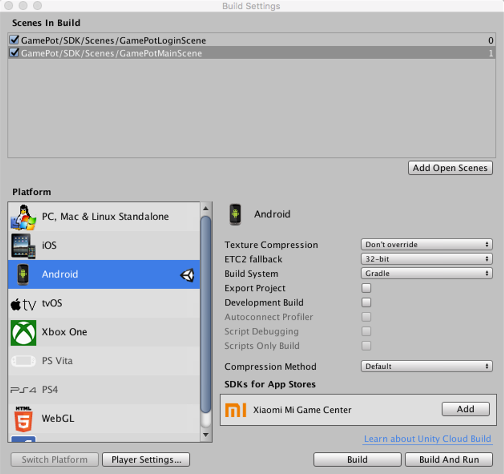
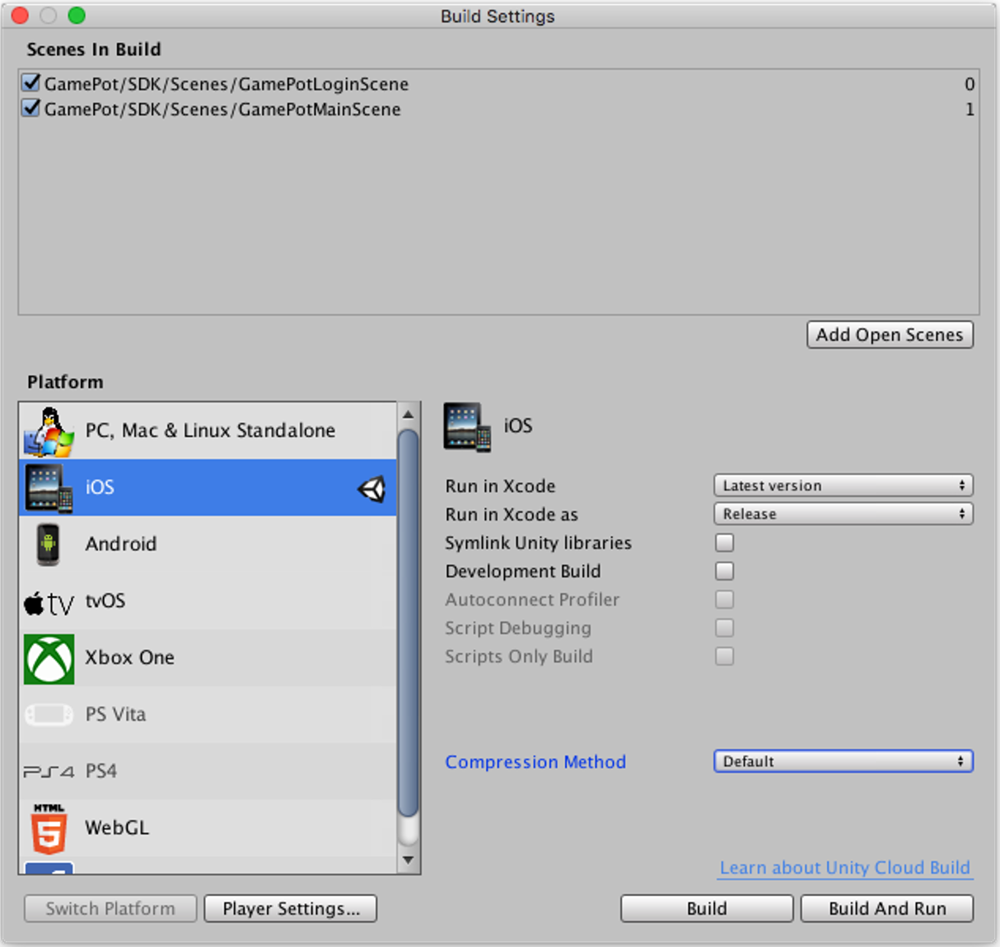
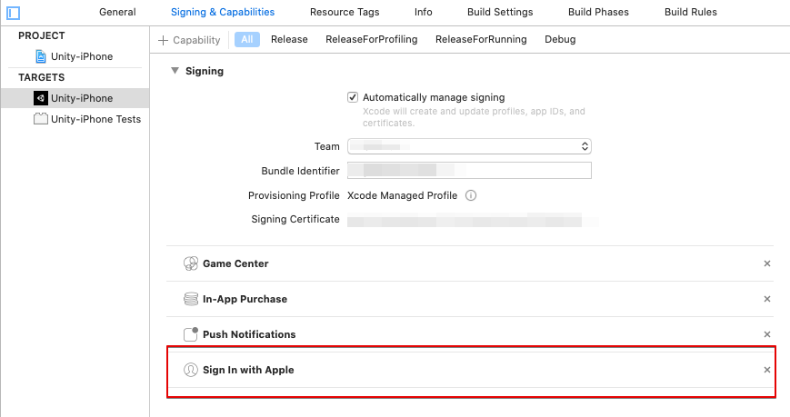
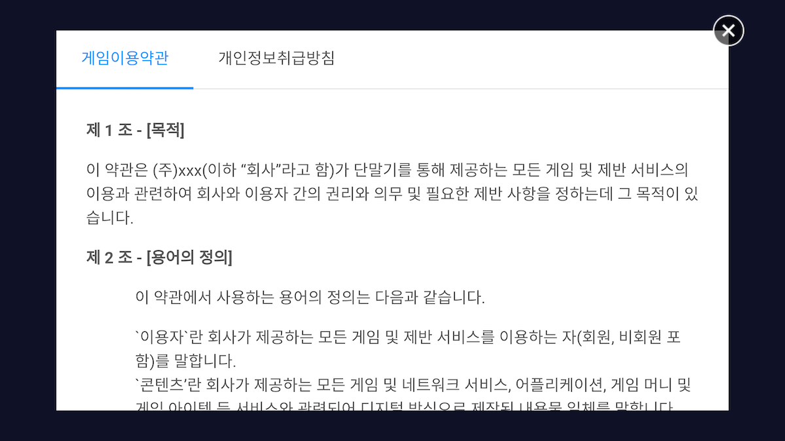
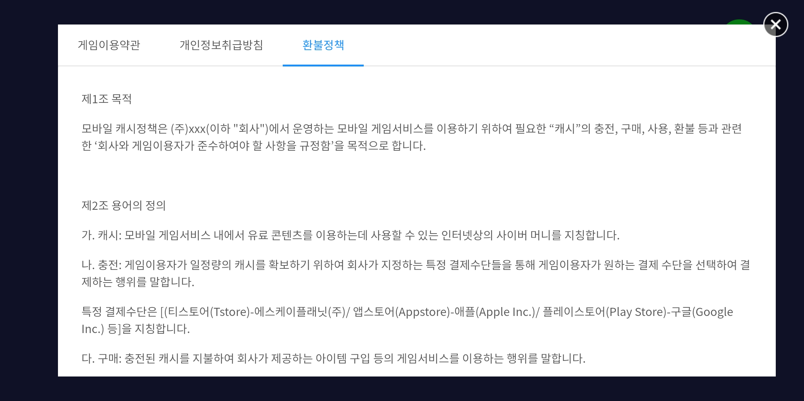
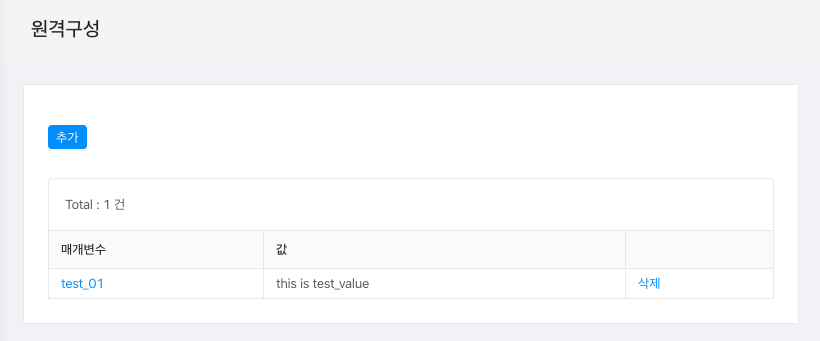
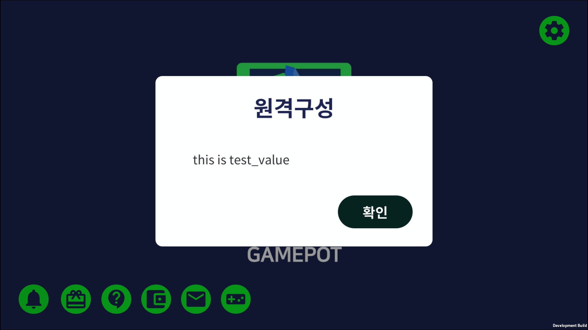

---
search:
  keyword: ['gamepot']
---

# Unity SDK

## 1. 开始

### 第一步.导入GAMEPOT插件

访问所创建的GAMEPOT仪表盘后，下载最新的插件。

### 第二步. 导入插件

在**Assets > Import Package > Custom Package**菜单中选择已下载的GamePotUnityPlugin-xxxx.unitypackage文件。


检查插件后导入时，会添加到相应项目中。


### 第三步. Android

#### 设置基本环境

```d
minSdkVersion : API 17 (Jelly Bean, 4.2)
```

**Gradle环境设置方法**

使用编辑器打开/Assets/Plugin/Android/mainTemplate.gradle文件。

```java
...
android {
    ...
    defaultConfig {
        ...
        resValue "string", "gamepot_project_id", "" // required
        resValue "string", "gamepot_store", "google" // required
        resValue "string", "gamepot_app_title","@string/app_name" // required (fcm)
        resValue "string", "gamepot_push_default_channel","Default" // required (fcm)
        resValue "string", "facebook_app_id", "0" // optional (facebook)
        resValue "string", "fb_login_protocol_scheme", "fb0" // optional (facebook)
        // resValue "string", "gamepot_elsa_projectid", "" // optional (ncp elsa)
    }
    ...
}
```

找出下列必填值进行修改。只有修改下列值才能正常操作。

```java
resValue "string", "[key]", "[value]"
```

| 值| 描述|
| :-- | :--- |
| gamepot_project_id| 请输入从GAMEPOT获取的项目ID。|
| gamepot_store| 商店值\(`google`、`one`或`galaxy`\)|
| gamepot_app_title| 应用主题\(FCM\)|
| gamepot_push_default_channel| 注册的默认渠道名称\(Default\) - 请勿修改。|
| facebook_app_id| 从Facebook获取的应用ID|
| fb_login_protocol_scheme| 从Facebook获取的protocol scheme fb\[app_id\]|
| gamepot_elsa_projectid| 使用NCLOUD ELSA时项目ID \([查看详情](https://www.ncloud.com/product/analytics/elsa)\)|

**在通知栏更改推送图标的方法**


接收推送时Android通知栏上显示的小图标默认显示SDK内部的默认图像，还可以直接添加。

想直接添加时，须按`drawable`文件夹放入图像。\(使用[Android Asset Studio](http://romannurik.github.io/AndroidAssetStudio/icons-notification.html#source.type=clipart&source.clipart=ac_unit&source.space.trim=1&source.space.pad=0&name=ic_stat_gamepot_small)制作时，会自动按照文件夹制作图像，更加方便。\)

图像文件名应为ic_stat_gamepot_small。

| 文件夹名| 容量|
| :------------------------------------------------------------- | :---- |
| /Assets/Plugins/Android/GamePotResources/res/drawable-mdpi/    | 24x24 |
| /Assets/Plugins/Android/GamePotResources/res/drawable-hdpi/    | 36x36 |
| /Assets/Plugins/Android/GamePotResources/res/drawable-xhdpi/   | 48x48 |
| /Assets/Plugins/Android/GamePotResources/res/drawable-xxhdpi/  | 72x72 |
| /Assets/Plugins/Android/GamePotResources/res/drawable-xxxhdpi/ | 96x96 |

**屏幕方向设置方法**

使用编辑器打开/Assets/Plugin/Android/AndroidManifest.xml文件。

```markup
...
    <activity android:screenOrientation="sensorLandscape">
      <intent-filter>
        <action android:name="android.intent.action.MAIN" />
          ...
      </intent-filter>
    </activity>
...
```

请在Main Activity中添加screenOrientation后，根据游戏输入`sensorLandscape`或`sensorPortrait`。

**Android Resolver Settings**

跳转到`Assets > Play Services Resolver > Android Resolver > Settings`菜单。


请`取消Enable Resolution On Build复选框`。


**Unity Build Settings**

在`File > Build Settings > Build System`菜单中选择Gradle。



### 第四步. iOS

> `不使用`GameCenter登录时，请在下列位置删除相应文件。
> > `Assets/Plugins/IOS/Frameworks/GamePotGameCenter.framework`
> 包含相应库时，须在`Capabilities设置中激活GameCenter`。

将从Google Firebases下载的`GoogleService-Info.plist`文件复制到`/Assets/Plugins/IOS/`。

请在`/Assets/Plugin/IOS/GamePotConfig-Info.plist`内添加所需的环境变量。


| 环境变量| 描述|
| :---------------------------- | :---------------------------------------------------- |
| gamepot_project_id| 请输入从GAMEPOT获取的项目ID。|
| gamepot_facebook_app_id| 从Facebook获取的应用ID|
| gamepot_facebook_display_name| Facebook中显示的名称|
| gamepot_google_app_id| GoogleService-Info文件的CLIENT_ID值|
| gamepot_google_url_schemes| GoogleService-Info文件的REVERSED_CLIENT_ID值|
| gamepot_elsa_projectid| 使用NCLOUD ELSA时项目ID|

添加scenes之后，运行**File > Build Settings > Build And Run**即可完成。



构建XCode后

请在Targets >> Info >> Custom iOS Target Properties中`添加以下用户权限获取选项`。

该用户权限在GamePot客服中心内的文件上传功能中使用。

```text
NSCameraUsageDescription
NSPhotoLibraryUsageDescription
```

## 2. 初始化

在游戏开始时加载的第一个场景中使用的对象中添加以下代码。

```csharp
using GamePotUnity;
public class GamePotLoginSampleScene : MonoBehaviour {
    void Awake() {
        GamePot.initPlugin();
    }
    void Start () {
        GamePot.setListener(  GamePotInterface.cs 继承到的 class );
         // ex) GamePot.setListener(new GamePotSampleListener());
    }

}

ex)
public class GamePotSampleListener : MonoBehaviour , IGamePot {
    ....
}
```

## 3. 错误代码

```csharp
public class NError
{
    // 未知错误
    public static readonly int CODE_UNKNOWN_ERROR           = 0;
    // 初始化失败
    public static readonly int CODE_NOT_INITALIZE           = 1;
    // 参数不正确时
    public static readonly int CODE_INVAILD_PARAM           = 2;
    // 没有成员ID数据时
    public static readonly int CODE_MEMBERID_IS_EMPTY       = 3;
    // 未登录的状态
    public static readonly int CODE_NOT_SIGNIN              = 4;
    // 网络模块未初始化时
    public static readonly int CODE_NETWORK_MODULE_NOT_INIT = 3000;
    // 发生网络连接错误及超时时
    public static readonly int CODE_NETWORK_ERROR           = 3001;
    // 在server-side发生的错误
    public static readonly int CODE_SERVER_ERROR            = 4000;
    // http response code不成功时
    public static readonly int CODE_SERVER_HTTP_ERROR       = 4001;
    // 发生网络连接错误及超时时
    public static readonly int CODE_SERVER_NETWORK_ERROR    = 4002;
    // 解析来自服务器的数据时发生错误
    public static readonly int CODE_SERVER_PARSING_ERROR    = 4003;
    // 付款时发生未知错误及商店方传递错误时
    public static readonly int CODE_CHARGE_UNKNOWN_ERROR    = 5000;
    // 未放入product id时
    public static readonly int CODE_CHARGE_PRODUCTID_EMPTY  = 5001;
    // 放入错误的product id时
    public static readonly int CODE_CHARGE_PRODUCTID_WRONG  = 5002;
    // consume时错误
    public static readonly int CODE_CHARGE_CONSUME_ERROR    = 5003;

    // error Code
    public int code { get; set; }
    // error Message
    public string message { get; set; }
}
```

## 4. 设置登录环境

### Google登录

#### Google Firebase控制台

1. 从Google Firebase控制台下载适用于Android的google-service.json文件后，复制到`/Assets/Plugins/Android/`。
2. 将构建APK时使用的Keystore的SHA-1值添加到Google Firebase控制台中。
3. 从Google Firebase控制台下载适用于iOS的GoogleService-Info.plist文件后，复制到`/Assets/Plugins/IOS/`。

**进行Google登录时响应onCancel且无法登录时**请检查下列内容。

1. 检查是否已正常应用以上请求应用的google-service.json文件
2. 检查构建时使用的Keystore是否是导出在Firebase控制台中添加的sha-1的Keystore
3. 检查是否使用了在Firebase控制台中添加的包名进行构建

### Facebook登录

#### Facebook Developer Console

在Facebook控制台里添加构建APK时使用的密钥库的密钥哈希值。

#### Android

修改mainTemplate.gradle

```java
...
defaultConfig {
    resValue "string", "facebook_app_id", "1234567890"
    resValue "string", "fb_login_protocol_scheme", "fb1234567890"
}
...
```

将从Facebook开发人员中心获取的应用ID输入到`facebook_app_id`值中，在`fb_login_protocol_scheme`值中输入`fb{facebook_app_id}`。

> app_id为1234567890时，fb1234567890是`fb_login_protocol_scheme`值。

#### iOS

在/Assets/Plugins/IOS/Frameworks路径下添加下列框架。

FBSDKLoginKit.framework FBSDKCoreKit.framework GamePotFacebook.framework

### APPLE登录

> 该功能性仅限于iOS。

**添加Xcode > TARGETS > Signing & Capabilities > + Capability > Sign In with Apple。**



### GameCenter登录

> 该功能性仅限于iOS。
>
> 使用GameCenter登录时，请按下图所示方法在下列位置进行设置。
> > `Assets/Plugins/IOS/etcFrameworks/GamePotGameCenter.framework`


> 包含相应库时，须在`Capabilities设置中激活GameCenter`。

在**Xcode > Build Phases > Linked Binary With Libraries**中添加Gamekit.framework。


**添加Xcode > TARGETS > Signing & Capabilities > + Capability > GameCenter。**


## 5. 登录/退出登录/注销/验证

### 登录

不用另行注册，直接创建用户账户。创建MemberId以确认所有的身份，创建的信息保存在NUserInfo结构中并返回。

- 案例一

请求：

```csharp
GamePot.login(NCommon.LoginType);
```

响应：

```csharp
// 登录成功
public void onLoginSuccess(NUserInfo userInfo)
{
}
// 登录失败
public void onLoginFailure(NError error)
{
    // 登录失败时
    // 请通过弹窗等告知玩家error.message。
}
// 取消登录
public void onLoginCancel()
{
    // 用户任意取消登录时
}
// 强制更新（商店版本与客户端版本不一致时调用）
public void onNeedUpdate(NAppStatus status)
{
    // TODO: 须基于从参数导入的status信息创建弹窗告知用户。
    // TODO: 请从下列两种方式中选择一种。
    // 案例一：通过游戏内弹窗由开发公司直接实现UI
    // 案例二：使用SDK的弹窗（此时请调用下列代码。）
    // GamePot.showAppStatusPopup(status.ToJson());
}
// 维护（仪表盘中维护功能激活时调用）
public void onMainternance(NAppStatus status)
{
       // TODO: 须基于从参数导入的status信息创建弹窗告知用户。
    // TODO: 请从下列两种方式中选择一种。
    // 案例一：通过游戏内弹窗由开发公司直接实现UI
    // 案例二：使用SDK的弹窗（此时请调用下列代码。）
    // GamePot.showAppStatusPopup(status.ToJson());
}
// 终止应用
public void onAppClose()
{
    // TODO: 用案例二中的方式实现强制更新或维护功能时
    // TODO: 因应用可能被强制终止，因此请在这里实现应用的终止。
}
```

- 案例二

请求：

```csharp
GamePot.login(NCommon.LoginType, GamePotCallbackDelegate.CB_Login);
```

```csharp
GamePot.login(NCommon.LoginType, (resultState, userInfo, appStatus, error) => {
    switch (resultState)
    {
        case NCommon.ResultLogin.SUCCESS:
        // login success
        break;
        case NCommon.ResultLogin.CANCELLED:
        // login cancel
        break;
        case NCommon.ResultLogin.FAILED:
        // login fail
        break;
        default:
        break;
    }
});
```

LoginType定义

```csharp
public enum LoginType
{
    NONE、
    GOOGLE、
    GOOGLEPLAY、
    FACEBOOK、
    NAVER、
    GAMECENTER、
    TWITTER、
    LINE、
    APPLE、
    GUEST、
    THIRDPARTYSDK
}
```

NUserInfo定义

```csharp
public class NUserInfo
{
    public string memberid { get; set; }        // 成员ID（玩家的唯一ID）
    public string name { get; set; }            // 姓名
    public string profileUrl { get; set; }      // 头像URL（存在时）
    public string email { get; set; }           // 邮箱（存在时）
    public string token { get; set; }           // 玩家广告ID
    public string userid { get; set; }          // 社交ID（google、facebook…）
}
```

### 导入登录信息

```csharp
GamePot.getMemberId(); // 成员ID（玩家的唯一ID）
```

### 自动登录

```csharp
NCommon.LoginType type = GamePot.getLastLoginType();
if(type != NCommon.LoginType.NONE) {
{
    // 以用户最后一次的登陆方式进行登录。
    GamePot.login(type);
}
else
{
    // 第一次运行游戏或退出登录的状态。请转到可以登录的登录页面。
}
```

### 退出登录

让用户退出登录。不会删除账户，可以使用同一账户登录。

- 案例一

请求：

```csharp
GamePot.logout();
```

响应：

```csharp
///成功退出登录
public void onLogoutSuccess()
{
}

///退出登录失败
public void onLogoutFailure(NError error)
{
    // 退出登录失败时
    // 请通过弹窗等告知玩家error.message。
}
```

- 案例二

请求：

```csharp
GamePot.logout(GamePotCallbackDelegate.CB_Common);
```

```csharp
GamePot.logout((success, error) => {
   if(success)
   {
       // 成功退出登录
   }
   else
   {
        // 退出登录失败时
        // 请通过弹窗等告知玩家error.message。
   }
});
```

### 注销

注销会员，不可恢复。

- 案例一

请求：

```text
GamePot.deleteMember();
```

响应：

```csharp
///会员注销成功
public void onDeleteMemberSuccess() {
}

///会员注销失败
public void  onDeleteMemberFailure(NError error) {
    // 会员注销失败时
    // 请通过弹窗等告知玩家error.message。
}
```

- 案例二

请求：

```csharp
GamePot.deleteMember(GamePotCallbackDelegate.CB_Common);
```

```csharp
GamePot.deleteMember((success, error) => {
   if(success)
   {
        // 会员注销成功
   }
   else
   {
        // 会员注销失败时
        // 请通过弹窗等告知玩家error.message。
   }
});
```

### 验证

登录成功后，登录信息从开发公司服务器传递至GAMEPOT服务器后，开始进行登录验证。

详细说明请参考Server to server api菜单的`Token Authentication`项目。

## 6. 账户关联

可以将多个社交账户\(Google、Facebook等\)与一个游戏账户关联或解除关联的功能。\(至少关联一个社交账户。\)

> 关联页面UI由开发公司实现。

```csharp
public enum LinkingType
{
    GOOGLEPLAY、
    GAMECENTER、
    GOOGLE、
    FACEBOOK、
    NAVER、
    TWITTER、
    LINE、
    APPLE
}
```

### 关联

可以用Google、Facebook等的ID关联账户。

- 案例一

请求：

```csharp
void GamePot.createLinking(NCommon.LinkingType.XXXXX);
```

响应：

```csharp
///取消账户关联
public void onCreateLinkingCancel() {
    // 玩家取消账户关联时
}

///账户关联成功
public void onCreateLinkingSuccess(NUserInfo userInfo) {
}

///账户关联失败
public void onCreateLinkingFailure(NError error) {
    // 账户关联失败时
    // 请通过弹窗等告知玩家error.message。
}
```

- 案例二

请求：

```csharp
void GamePot.createLinking(NCommon.LinkingType.XXXXX, GamePotCallbackDelegate.CB_CreateLinking);
```

```csharp
GamePot.createLinking(NCommon.LinkingType.XXXXX, (resultState, userInfo, error) => {
      switch (resultState)
    {
        case NCommon.ResultLinking.SUCCESS:
        // 账户关联成功
        break;
        case NCommon.ResultLinking.CANCELLED:
        // 取消账户关联
        break;
        case NCommon.ResultLinking.FAILED:
        // 账户关联失败
        break;
        default:
        break;
    }
});
```

可以导入当前关联的所有账户信息。

```csharp
List<NLinkingInfo> linkedList = GamePot.getLinkedList();
```

定义链接信息

```csharp
public class NLinkingInfo
{
    public LinkingType provider { get; set; }  // google, facebook, naver, apple..
}
```

### 解除关联

解除关联账户。 

- 案例一

请求：

```csharp
void GamePot.deleteLinking(NCommon.LinkingType.XXXXX);
```

响应：

```csharp
///账户关联解除成功
public void onDeleteLinkingSuccess() {
}

///账户关联解除失败
public void onDeleteLinkingFailure(NError error) {
    // 解除关联失败时
    // 请通过弹窗等告知玩家error.message。
}
```

- 案例二

请求：

```csharp
void GamePot.deleteLinking(NCommon.LinkingType.XXXXX, GamePotCallbackDelegate.CB_Common);
```

```csharp
GamePot.deleteLinking(NCommon.LinkingType.XXXXX, (success, error) => {
    if(success)
    {
       // 账户关联解除成功
    }
   else
   {
        // 解除关联失败时
        // 请通过弹窗等告知玩家error.message。
    }
});
```

#### 账户关联状态处理结果示例

根据createLinking / deleteLinking结果获取当前关联的账户信息，并更新关联状态相关UI。

```csharp
public void onInit()
{
    UI_Update();
}
public void onCreateLink_GAMECENTER_Click()
{
    GamePot.createLinking(NCommon.LinkingType.GAMECENTER);
}
public void onCreateLink_GOOGLE_Click()
{
    GamePot.createLinking(NCommon.LinkingType.GOOGLE);
}
public void onCreateLinkingSuccess(NUserInfo userInfo)
{
    UI_Update();
}
public void onCreateLinkingFailure(NError error)
{
    UI_Update();
}
public void onDeleteLinkingSuccess(NUserInfo userInfo)
{
    UI_Update();
}
public void onDeleteLinkingFailure(NError error)
{
    UI_Update();
}

Public void UI_Update()
{
    // Ui Update in GAME
    CreateLinkManager.instance._IOS_google_state  = false;
    CreateLinkManager.instance._IOS_gamecenter_state  = false;

    List<NLinkingInfo> linkedList = GamePot.getLinkedList();
    foreach ( NLinkingInfo item in linkedList)
    {
        switch(item.provider)
        {
        case NCommon.LinkingType.GOOGLE :
            CreateLinkManager.instance._IOS_google_state  = true;
            break;
        case NCommon.LinkingType.GAMECENTER :
            CreateLinkManager.instance._IOS_gamecenter_state  = true;
            break;

        ...

        }
    }
}
```

## 7. 支付

### 应用内产品查询

传递商店中添加的产品信息。

如果启用该功能，会根据不同的用户显示不一样的价格、货币和产品名称。

```csharp
NPurchaseItem[] items = GamePot.getPurchaseItems();
foreach(NPurchaseItem item in items) {
    Debug.Log(item.productId);        // 产品ID
    Debug.Log(item.price);            // 价格
    Debug.Log(item.title);            // 题目
    Debug.Log(item.description);    // 描述
}
```

### 应用内产品付款

可以用一个下列函数，在Google、Apple和AppStore中进行支付。

- 案例一

请求：

```csharp
// productId : 输入在商店中添加的商品ID即可。
// uniqueId  : 加入单独管理的发票号即可。
// serverId  : 输入进行支付的角色的服务器ID即可。
// playerId  : 输入进行支付的角色的角色ID即可。
// etc       : 输入进行支付的角色的其他信息即可。
GamePot.purchase(string productId);

GamePot.purchase(string productId, string uniqueId);

GamePot.purchase(string productId, string uniqueId, string serverId, string playerId, string etc);
```

Response:

```csharp
///应用内付款成功
public void onPurchaseSuccess(NPurchaseInfo purchase) {
}

///应用内付款失败
public void onPurchaseFailure(NError error) {
    // 付款失败时
    // 请通过弹窗等告知玩家error.message。
}

///应用内付款失败
public void onPurchaseCancel() {
}
```

- 案例二

请求：

```csharp
// productId : 商城中添加的产品ID
GamePot.purchase(string productId, GamePotCallbackDelegate.CB_Purchase);

GamePot.purchase(string productId, string uniqueId, GamePotCallbackDelegate.CB_Purchase);

GamePot.purchase(string productId, string uniqueId, string serverId, string playerId, string etc, GamePotCallbackDelegate.CB_Purchase);

```

```csharp
GamePot.purchase(productId, (resultState, purchaseInfo, error) => {
      switch (resultState)
    {
        case NCommon.ResultPurchase.SUCCESS:
        // purchase success
        break;
        case NCommon.ResultPurchase.CANCELLED:
        // purchase cancel
        break;
        case NCommon.ResultPurchase.FAILED:
        // purchase fail
        break;
        default:
        break;
    }
});
```

### 定义NPurchaseInfo

付款成功后付款的道具信息。可以用于参考。

```csharp
public class NPurchaseInfo
{
    public string price { get; set; }               // 付款道具价格
    public string productId { get; set; }           // 付款道具ID
    public string currency { get; set; }            // 付款价格货币（KRW/USD）
    public string orderId { get; set; }             // 商店Order ID
    public string productName { get; set; }         // 付款道具名称
    public string gamepotOrderId { get; set; }      // 在GAMEPOT中创建的order id
    public string uniqueId { get; set; }            // 开发公司unique ID
    public string signature { get; set; }           // 付款Signature
    public string originalJSONData { get; set; }    // 发票Data
}
```

### 发放付款道具

因为GAMEPOT在通过Server to server api完成对支付商店发票的验证后才向开发公司服务器发出发放请求，所以不可能存在非法支付。

为此，须参考`Server to server api`菜单中的`Purchase Webhook`项目进行处理。

### 外部付款

该功能允许外部付款的商店和官方商店之外的场所也能进行付款。

> 只有调用api不同，响应和purchase webhook等其他部分与常规付款一样。
>
> 要使用该功能，需要先进行设置。请参考仪表盘手册中的“外部付款”条目。

- 案例一

请求：

```csharp
// productId : 商城中添加的产品ID
GamePot.purchaseThirdPayments(string productId);
```

使用外部付款时，产品信息列表请使用以下api。

请求：

```csharp
// 返回的数据格式与getPurchaseItems()相同。
GamePot.getPurchaseThirdPaymentsItems();
```

- 案例二

请求：

```csharp
// productId : 商城中添加的产品ID
GamePot.purchaseThirdPayments(string productId, GamePotCallbackDelegate.CB_Purchase);
```

```csharp
// 返回的数据格式与getPurchaseItems()相同。
GamePot.purchase(productId, (resultState, purchaseInfo, error) => {
      switch (resultState)
    {
        case NCommon.ResultPurchase.SUCCESS:
        // purchase success
        break;
        case NCommon.ResultPurchase.CANCELLED:
        // purchase cancel
        break;
        case NCommon.ResultPurchase.FAILED:
        // purchase fail
        break;
        default:
        break;
    }
});
```

## 8. 其他API

### Naver登录

#### Naver Developers

使用API选择`NAVER ID登录`后注册应用程序

#### Android

修改mainTemplate.gradle

```java
...
defaultConfig {
    resValue "string", "gamepot_naver_clientid", "abcdefg1234567890"
    resValue "string", "gamepot_naver_secretid", "hijklmn"
}
...
```

将从Console获取的Client ID输入到`gamepot_naver_clientid`值中，Client Secret输入到`gamepot_naver_secretid`值中。

#### iOS

在GamePotConfig-Info.plist文件中添加下列项目并输入相应值。

```text
gamepot_naver_clientid// 要在Naver使用的client ID
gamepot_naver_secretid// 要在Naver使用的secret ID
gamepot_naver_urlscheme// 要在Naver使用的urlscheme
```

用SourceCode查看GamePotConfig-Info.plist文件时按以下方法添加

```markup
...
<key>gamepot_naver_clientid</key>
<string>xxxxxx</string>
<key>gamepot_naver_secretid</key>
<string>xxxxxx</string>
<key>gamepot_naver_urlscheme</key>
<string>xxxxxx</string>
...
```

在Targets >> Info >> URL Types中添加用NAVER ID登录设置中添加的URL Schemes。

创建URL Schemes时，使用`英文小写`、`、`、`_`以外的文字将无法识别，请注意。

### LINE登录

#### LINE Developers

将构建APK时使用的包名和keystore的SHA值、url Scheme值添加到Line控制台中。

#### Android

修改mainTemplate.gradle

将获取的客户端ID输入到`gamepot_line_channelid`值中。

```java
...
defaultConfig {
    resValue "string", "gamepot_line_channelid","xxxxxxx"
}
...
```

#### iOS

在/Assets/Plugins/IOS/GamePotConfig-Info.plist文件中添加下列项目并输入相应值。

```text
gamepot_line_channelid // 要在Naver使用的client ID
gamepot_line_url_schemes // Line URL Scheme (line3rdp.{项目Bundle identifier})
```

用SourceCode查看GamePotConfig-Info.plist文件时按以下方法添加即可。

```markup
...
<key>gamepot_line_channelid</key>
<string>xxxxxx</string>
<key>gamepot_line_url_schemes</key>
<string>xxxxxx</string>
...
```

### Twitter登录

#### Twitter Developers

#### Android

修改mainTemplate.gradle

```java
...
defaultConfig {
        resValue "string", "gamepot_twitter_consumerkey","xxxxx" // 从Twitter开发者控制台获取
        resValue "string", "gamepot_twitter_consumersecret","xxx" // 从Twitter开发者控制台获取
}
...
```

#### iOS

在GamePotConfig-Info.plist文件中添加下列项目并输入相应值。

```text
gamepot_twitter_consumerkey : Twitter Consumer Key
gamepot_twitter_consumersecret :  Twitter Consumer Secret
```

用SourceCode查看GamePotConfig-Info.plist文件时按以下方法添加

```markup
...
<key>gamepot_twitter_consumerkey</key>
<string>xxxxxx</string>
...
```

### 优惠券

#### 使用优惠券

> 请开发公司实现输入优惠券的UI。

- 案例一

请求：

```csharp
GamePot.coupon(string couponNumber); // 优惠券编号

GamePot.coupon(string couponNumber, string userData); // 优惠券编号、用户信息
```

响应：

```csharp
///优惠券使用成功
public void onCouponSuccess() {
}

///优惠券使用失败
public void onCouponFailure(NError error) {
    // 优惠券使用失败时
    // 请通过弹窗等告知玩家error.message。
}
```

- 案例二

请求：

```csharp
GamePot.coupon(string couponNumber, GamePotCallbackDelegate.CB_Common); // 优惠券编号

GamePot.coupon(string couponNumber, string userData, GamePotCallbackDelegate.CB_Common);    // 优惠券编号、用户信息
```

```csharp
GamePot.coupon(couponNumber, (success, error) => {
   if(success)
   {
       // 优惠券使用成功
   }
   else
   {
        // 优惠券使用失败时
        // 请通过弹窗等告知玩家error.message。
   }
});
```

#### 发放道具

如果优惠券使用成功，会通过Server to server api向开发公司的服务器请求发放道具。

为此，须参考Server to server api菜单的`Item Webhook`项目进行处理。

### 开启/关闭推送

可以分别开启/关闭推送、夜间推送。

> 请开发公司实现设置开启/关闭的UI。

#### 推送设置

- 案例一

请求：

```csharp
GamePot.setPushStatus(bool pushEnable);
```

响应：

```csharp
///对推送状态变更的服务器通信成功
public void onPushSuccess() {
}

///对推送状态变更的服务器通信失败
public void onPushFailure(NError error) {

    // 推送状态变更失败时
    // 请通过弹窗等告知玩家error.message。
}
```

- 案例二

请求：

```csharp
void GamePot.setPushStatus(bool pushEnable, GamePotCallbackDelegate.CB_Common);
```

```csharp
GamePot.setPushStatus(pushEnable, (success, error) => {
    if(success)
    {
        // 对推送状态变更的服务器通信成功
    }
   else
   {
        // 推送状态变更失败时
        // 请通过弹窗等告知玩家error.message。
    }
});
```

#### 夜间推送设置

- 案例一

请求：

```csharp
GamePot.setPushNightStatus(bool nightPushEnable);
```

响应：

```csharp
///对夜间推送状态变更的服务器通信成功
public void onPushNightSuccess() {
}

///对夜间推送状态变更的服务器通信失败
public void onPushNightFailure(NError error) {

    // 夜间推送状态变更失败时
    // 请通过弹窗等告知玩家error.message。
}
```

- 案例二

请求：

```csharp
void GamePot.setPushNightStatus(bool nightPushEnable, GamePotCallbackDelegate.CB_Common);
```

```csharp
GamePot.setPushNightStatus(nightPushEnable, (success, error) => {
    if(success)
    {
        // 对夜间推送状态变更的服务器通信成功
    }
   else
   {
        // 夜间推送状态变更失败时
        // 请通过弹窗等告知玩家error.message。
    }
});
```

#### 广告推送设置

- 案例一

请求：

```csharp
GamePot.setPushADStatus(bool adPushEnable);
```

响应：

```csharp
///对广告推送状态变更的服务器通信成功
public void onPushAdSuccess() {
}

///对广告推送状态变更的服务器通信失败
public void onPushAdFailure(NError error) {

    // 广告推送状态变更失败时
    // 请通过弹窗等告知玩家error.message。
}
```

- 案例二

请求：

```csharp
void GamePot.setPushADStatus(bool adPushEnable, GamePotCallbackDelegate.CB_Common);
```

```csharp
GamePot.setPushADStatus(adPushEnable, (success, error) => {
    if(success)
    {
        // 对广告推送状态变更的服务器通信成功
    }
   else
   {
        // 广告推送状态变更失败时
        // 请通过弹窗等告知玩家error.message。
    }
});
```

#### 一次性设置推送/夜间推送/广告推送

如果是登录前需要获得推送/夜间推送权限的游戏，登录后必须调用以下代码。

- 案例一

请求：

```csharp
GamePot.setPushStatus(bool pushEnable, bool nightPushEnable, bool adPushEnable);
```

响应：

```csharp
///对推送状态变更的服务器通信成功
public void onPushStatusSuccess() {
}

///对推送状态变更的服务器通信失败
public void onPushStatusFailure(NError error) {

    // 推送状态变更失败时
    // 请通过弹窗等告知玩家error.message。
}
```

- 案例二

请求：

```csharp
void GamePot.setPushADStatus(bool pushEnable, bool nightPushEnable, bool adPushEnable, GamePotCallbackDelegate.CB_Common);
```

```csharp
GamePot.setPushADStatus(pushEnable, nightPushEnable, adPushEnable, (success, error) => {
    if(success)
    {
        // 对推送状态变更的服务器通信成功
    }
   else
   {
        // 推送状态变更失败时
        // 请通过弹窗等告知玩家error.message。
    }
});
```

#### 查询推送状态

```csharp
NPushInfo pushInfo = GamePot.getPushStatus();

// pushInfo.enable  是否允许推送
// pushInfo.night   是否允许夜间推送
```

### 公告事项

该功能可将GAMEPOT仪表盘内“公告事项”里新添加的图像按顺序显示。


图像建议规格如下。

- 大小: 720 _1200\(Portrait\) / 1280_ 640\(Landscape\)

  > 如果不满足以上大小，用中心裁剪处理图像。

- 容量：250 KB以下

请求：

```csharp
GamePot.showNotice(bool Flag = true);

// true：应用“今日不再显示”
// false：与“今日不再显示”无关，强制显示
```

响应：

在GAMEPOT仪表盘中将`点击操作`设置为`SCHEME`时，点击该图像时传递`SCHEME`值。

```csharp
public void onReceiveScheme(string scheme)
{
    // 传递在GAMEPOT仪表盘设置的scheme值
}
```

### 客户支持

该功能可以让客户向运营商提交咨询并收到回复。

客户咨询UI会根据设备语言更改。支持韩语、英语、日语、中文（简体、繁体），其他语言显示英语。

- 咨询提交页面

  

- 我的咨询明细页面

  

#### 调用

```csharp
GamePot.showCSWebView();
```

支持外部链接，未登录的客户也可以提交咨询事项。

#### 调用

```csharp
// url：从GAMEPOT获取的外部客户支持URL

GamePot.showWebView(string url);
```

### 本地推送\(Local Push notification\)

这是不通过推送服务器，直接在终端显示推送的功能。

#### 添加推送

在规定时间显示本地推送的方法如下。

> 作为返回值传递的pushId由开发公司管理。

```csharp
int pushId = GamePot.sendLocalPush(DateTime.Parse("2018-01-01 00:00:00"), "title", "content");
```

#### 取消已添加的推送

可以根据添加推送时获得的pushId取消之前添加的推送。

```csharp
GamePot.cancelLocalPush(/*添加推送时获得的pushId*/);
```

### 同意条款

提供UI以便能迅速收到“使用条款”和“个人信息收集与使用指南”同意。

提供`BLUE`和`GREEN`两种主题，还可以按各区域定制。

- `BLUE`主题示例

  

- `GREEN`主题示例

  

#### 调用条款同意

> 请开发公司根据游戏决定是否显示条款同意弹窗。
>
> 点击“查看”按钮时显示的内容可以在仪表盘中应用和修改。

- 案例一

请求：

```csharp
// 默认调用（应用蓝色主题）
GamePot.showAgreeDialog();

// 应用绿色主题时
NAgreeInfo info = new NAgreeInfo();
info.theme = "green";
GamePot.showAgreeDialog(info);
```

响应：

```csharp
// 同意条款时
public void onAgreeDialogSuccess(NAgreeResultInfo info)
{
    // info.agree : 同意全部强制条款时为true
    // info.agreeNight : 勾选同意夜间接收广告类消息时为true，否则为false
    // agreeNight值请于成功登录后通过setPushNightStatus api传递。
}

// 发生错误
public void onAgreeDialogFailure(NError error)
{
    // 请通过弹窗等告知玩家error.message。
}
```

- 案例二

请求：

```csharp
// 默认调用（应用蓝色主题）
showAgreeDialog(GamePotCallbackDelegate.CB_ShowAgree);

// 应用绿色主题时
NAgreeInfo info = new NAgreeInfo();
info.theme = "green";
GamePot.showAgreeDialog(info,GamePotCallbackDelegate.CB_ShowAgree);
```

```csharp
GamePot.showAgreeDialog(bool info, (success, NAgreeResultInfo agreeInfo, NError error) => {
   if(success)
   {
        // 同意条款时
   }
   else
   {
        // 发生错误
        // 请通过弹窗等告知玩家error.message。
   }
});
```

#### 定制

不使用主题，根据游戏更改颜色。

调用条款同意之前，可在`NAgreeInfo`指定各区域的颜色。

```csharp
NAgreeInfo info = new NAgreeInfo();
info.theme = "green";
info.headerBackGradient = new string[] { "0xFF00050B", "0xFF0F1B21" };
info.headerTitleColor = "0xFFFF0000";
info.headerBottomColor = "0xFF00FF00";
// 未使用时设置为""
info.headerTitle = "同意条款";
// Android : res/drawable对象ID（文件名）
// iOS : asset对象ID（文件名）
info.headerIconDrawable = "ic_stat_gamepot_agree";

info.contentBackGradient = new string[] { "0xFFFF2432", "0xFF11FF32" };
info.contentIconColor = "0xFF0429FF";
info.contentCheckColor = "0xFFFFADB5";
info.contentTitleColor = "0xFF98FFC6";
info.contentShowColor = "0xFF98B3FF";
// Android : res/drawable对象ID（文件名）
// iOS : asset对象ID（文件名）
info.contentIconDrawable = "ic_stat_gamepot_small";

info.footerBackGradient = new string[] { "0xFFFFFFFF", "0xFF112432" };
info.footerButtonGradient = new string[] { "0xFF1E3A57", "0xFFFFFFFF" };
info.footerButtonOutlineColor = "0xFFFF171A";
info.footerTitleColor = "0xFFFF00D5";
info.footerTitle = "开始游戏";
// 是否显示“同意夜间接收广告类消息”按钮
info.showNightPush = true;

// 更改语句
info.allMessage = "全部同意";
info.termMessage = "必选）使用条款";
info.privacyMessage = "必选）个人信息处理方针";
info.nightPushMessage = "可选）同意接收夜间推送";

GamePot.showAgreeDialog(info);
```

各个变量将应用到以下区域。

> contentIconDrawable只在AOS中显示，默认值设置为推送图标。


### 使用条款

调用使用条款UI。

> 请先在仪表盘 - 客户支持 - 使用条款设置项目中输入内容。

```csharp
GamePot.showTerms();
```



### 个人信息处理方针

调用个人信息处理方针UI。

> 请先在仪表盘 - 客户支持 - 个人信息处理方针设置项目中输入内容。

```csharp
GamePot.showPrivacy();
```


### 退款规定

调用退款规定UI。

> 请先在仪表盘 - 客户支持 - 退款规定设置项目中输入内容。

```csharp
GamePot.showRefund();
```



### 远程配置

从客户端获取已添加到仪表盘的参数值。

> 在仪表盘 - 设置 - 远程配置界面中添加参数。



> 添加的参数会在登录时加载，之后可以调用。

```csharp
//"test_01" : 参数字符串
var str_value = GamePot.getConfig("test_01");

//以json字符串形式获取仪表盘中添加的所有参数。
var json_value = GamePot.getConfigs();
```



### 恶意利用付款取消者自动终止功能

提供恶意利用付款取消者自动终止功能的UI。可以按各区域进行定制。

> 仅限Google支付，玩家任意向Google请求取消付款时，可通过“取消Google支付”功能让使玩家停用。
>
> 此时该玩家登录时，在SDK内显示弹窗，引导对该付款道具重新进行付款，
> 提供的功能可以让玩家在付款时重新正常登录。
>
> 对所有已取消的付款进行重新支付时，停用会自动解除。


```csharp

NVoidInfo info = new NVoidInfo();

// 更改语句
info.headerTitle = "Header Title Section!";

info.descHTML = "descHTML Section!";

info.listHeaderTitle = "listHeaderTitle Section!";

info.footerTitle = "footerTitle Section!";

GamePot.setVoidBuilder(info);

```


### 发送游戏日志

添加游戏中使用的信息并调用时，可在`仪表盘` - `游戏`中查询。

下面是可使用的保留字定义表。

| 保留字| 必选| 类型| 描述|
| :-------------------------------- | :--- | :----- | :----------- |
| GamePotSendLogCharacter.NAME| 必选| 字符串| 角色名|
| GamePotSendLogCharacter.LEVEL| 可选| 字符串| 等级|
| GamePotSendLogCharacter.SERVER_ID| 可选| 字符串| 服务器ID|
| GamePotSendLogCharacter.PLAYER_ID| 可选| 字符串| 角色ID|
| GamePotSendLogCharacter.USERDATA| 可选| 字符串| 其他|

```csharp
String name = "角色名";
String level = "10";
String serverid = "svn_001";
String playerid = "283282191001";
String userdata = "";

GamePotSendLogCharacter characterLog = new GamePotSendLogCharacter();
characterLog.put(GamePotSendLogCharacter.NAME, name);
characterLog.put(GamePotSendLogCharacter.PLAYER_ID, playerid);
characterLog.put(GamePotSendLogCharacter.LEVEL, level);
characterLog.put(GamePotSendLogCharacter.SERVER_ID, serverid);
characterLog.put(GamePotSendLogCharacter.USERDATA, userdata);

Boolean result = GamePot.characterInfo(characterLog);

// Result is TRUE : validation success.Logs will send to GamePot Server
// Result is FALSE : validation was failed.Please check logcat
```

# 附录

### 支持第三方SDK关联

## 登录

> 不支持自动登录。需要每次调用。

| 参数名称| 必选| 类型| 描述|
| :--------- | :--- | :----- | :----------------- |
| userid| 必选| 字符串| 玩家唯一ID|

```csharp
String userid = "memberid of 3rd party sdk";

GamePot.loginByThirdPartySDK("userid");
```

## 支付

> 付款道具须已在GamePot仪表盘中添加。

| 参数名称| 必选| 类型| 描述|
| :------------ | :--- | :----- | :-------------------------------------- |
| productid| 必选| 字符串| 添加到GamePot仪表盘的道具ID|
| transactionid| 必选| 字符串| 付款发票号（GPA-xxx-xxxx-xxxx）|
| store| 必选| 字符串| （支付商店 - google、apple、one、galaxy）|
| currency| 可选| 字符串| 货币（KRW、USD）|
| price| 可选| double| 付款道具金额|
| paymentid| 可选| 字符串| 付款payment（一般与store_id相同）|
| uniqueid| 可选| 字符串| 开发公司使用的固有ID|

```csharp
String productId = "purchase_001";
String transactionId = "GPA-xxx-xxxx-xxxx";
String currency = "KRW";
double price = 1200;
String paymentId = "google";
String uniqueId = "developer unique id";

sendPurchaseByThirdPartySDK(string productId, string transactionId, string currency, double price, string store, string paymentId, string uniqueId);
```
