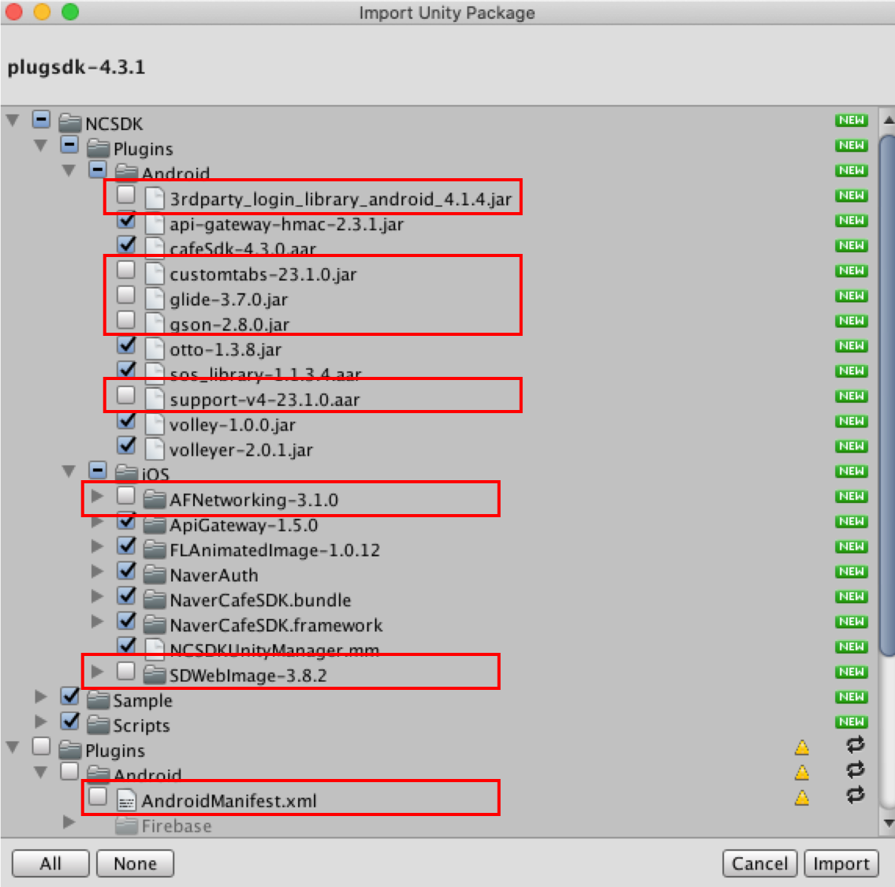
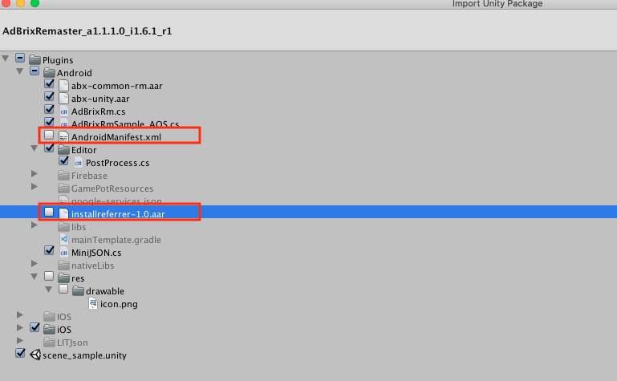
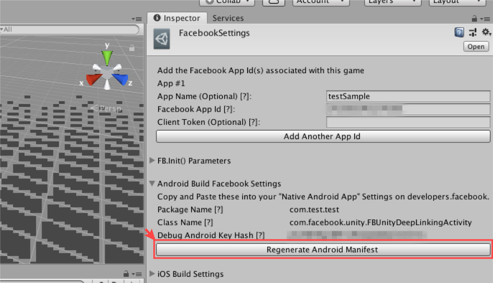

# 3rd-party SDK

> ### This is a machine-translated document that may have errors in vocabulary, syntax, or grammar. We will soon provide you with the document translated by a professional translator.
>
> #### If you have any questions, please [contact us](https://www.ncloud.com/support/question).
>
> We will make every effort to further enhance our services.

This is a guide for applying 3rd-party SDK applied in addition to GAMEPOT SDK to game projects without build errors.

> It is described based on the guide of each SDK, and refer to the guide of each SDK for how to apply the API.

## Naver cafe SDK

### Android

> We are preparing.

### iOS

> We are preparing.

### Unity \([Link](https://github.com/naver/cafe-sdk-unity)\)

⒈ When importing Unity Package, please exclude some files as below.



## Adjust

### Android \([Link](https://github.com/adjust/android_sdk/blob/master/doc/korean/README.md#qs-getting-started)\)

When adding a package to `build.gradle`, ignore the two packages listed below.

```java
implementation'com.android.installreferrer:installreferrer:1.0'
implementation'com.google.android.gms:play-services-analytics:16.0.4'
```

권한 Ignore this because'AndroidManifest.xml' already has permission.

```java
<uses-permission android:name="android.permission.INTERNET" />
<uses-permission android:name="android.permission.ACCESS_NETWORK_STATE" />
```

### iOS\([Link](https://github.com/adjust/ios_sdk/blob/master/README.md)\)

- No conflict with Gamepot.

### Unity\([Link](https://github.com/adjust/unity_sdk#qs-get-sdk)\)

- No conflict with Gamepot.

## Adbrix

### Android

> We are preparing.

### iOS

> We are preparing.

### Unity \([Link](https://help.adbrix.io/hc/en/articles/360007861793-%EC%95%A0%EB%93%9C%EB%B8%8C%EB%A6 %AD%EC%8A%A4-Android-%EC%97%B0%EB%8F%99%ED%95%98%EA%B8%B0-Unity-#toc2)\)

⒈ When importing Unity Package, please exclude some files as below.



⒉ Please download the next patch. \([Download](https://kr.object.ncloudstorage.com/itsb/gamepot-bridge.aar.zip)\)

⒊ Replace the downloaded'gamepot-bridge.aar' file with the file in the following path.

> /Assets/Android/libs/gamepot-bridge.aar

Ad You need to import and insert the necessary settings from Adbrix in /Assets/Plugins/Android/AndroidManifest.xml.
Please refer to Adbrix SDK guide for details. \([Guide](https://help.adbrix.io/hc/en/articles/360007861793-%EC%95%A0%EB%93%9C%EB%B8%8C%EB%A6%AD%EC %8A%A4-Android-%EC%97%B0%EB%8F%99%ED%95%98%EA%B8%B0-Unity-#toc6)\)

## Singular

### Android \([Link](https://developers.singular.net/docs/android-sdk)\)

_`[sdk v9.2.0]`_

⒈ When adding a package to the app-level `build.gradle`, the package below is already included, please ignore it.

```java
compile'com.android.installreferrer:installreferrer:1.0'
```

권한 Ignore this because'AndroidManifest.xml' already has permission.

```java
<uses-permission android:name="android.permission.INTERNET" />
<uses-permission android:name="android.permission.ACCESS_NETWORK_STATE" />
```

### iOS \([Link](https://developers.singular.net/docs/ios-sdk)\)

_`[sdk v9.2.0]`_

- No conflict with Gamepot.

### Unity \([Link](https://developers.singular.net/docs/unity-sdk)\)

_`[sdk v9.2.0]`_

- Delete the library file in the following path.

> `Assets/Plugins/Android/libs/installreferrer-1.0.aar`

## Appsflyer

### Android

> We are preparing.

### iOS

> We are preparing.

### Unity

> We are preparing.

## AdMob

**_`Due to migration issue to androidx package, sdk with Google Play Service version 18.0.0 or higher cannot be used.`_**

### Android \([Link](https://firebase.google.com/docs/admob/android/quick-start?hl=en)\)

- Gamepot service uses Firebase Messaging service. Please set up through Admob with Firebase.

### iOS \([Link](https://developers.google.com/admob/ios/quick-start?hl=en)\)

- No conflict with Gamepot.

### Unity \([Link](https://github.com/googleads/googleads-mobile-unity/releases/tag/3.17.0)\)

_`[Google Mobile Ads v3.17.0]`_

플러그인 Import the plugin (v3.17.0) into the game project through the link above.

Ad Add AdMob Android project as below in `mainTemplate.gradle`.


⒊ For AdMob SDK (Unity), you must use Unity Play Services Resolver function after importing Unity package. (See AdMob Guide)

- When applying the Resolve function, the library that is used in the existing Gamepot SDK is also copied.

- Remove the list of libraries that overlap with AdMob SDK from /Assets/Plugins/Android/libs/.

- The list of libraries to be removed is as follows.

  |                                       |                                               |
  | :------------------------------------ | :-------------------------------------------- |
  | 1. core-common-1.1.0.jar              | 2. lifecycle-common-1.1.0.jar                 |
  | 3. lifecycle-runtime-1.1.0.aar        | 4. customtabs-27.1.1.aar                      |
  | 5. support-annotations-27.1.1.jar     | 6. support-compat-27.1.1.aar                  |
  | 7. support-core-ui-27.1.1.aar         | 8. support-core-utils-27.1.1.aar              |
  | 9. support-fragment-27.1.1.aar        | 10. support-media-compat-27.1.1.aar           |
  | 11. support-v4-27.1.1.aar             | 12. play-services-ads-identifier-16.0.0.aar   |
  | 13. play-services-basement-16.2.0.aar | 14. play-services-measurement-base-16.0.5.aar |
  |                                       |                                               |

## Admob Mediation

**_`Due to migration issue to androidx package, sdk with Google Play Service version 18.0.0 or higher cannot be used.`_**

### Android\([Link](https://developers.google.com/admob/android/mediate)\)

_`[Google Play service Ads SDK 17.2.0]`_

#### - Vungle\([Link](https://developers.google.com/admob/android/mediation/vungle)\)

- No conflict with Gamepot. \(Vungle sdk 6.3.24\)

#### - Unity Ads\([Link](https://developers.google.com/admob/android/mediation/unity)\)

- When adding a package to the app-level `build.gradle`, add it with the corresponding package.

```java
compile'com.google.ads.mediation:unity:3.1.0.0'
```

#### - Facebook\([Link](https://developers.google.com/admob/android/mediation/facebook)\)

- When adding a package to the app-level `build.gradle`, add it with the corresponding package.

```java
compile'com.google.ads.mediation:facebook:5.4.0.0'
```

### iOS \([Link](https://developers.google.com/admob/ios/mediate)\)

_`[Google Mobile Ads SDK 7.49.0]`_

#### - Vungle\([Link](https://developers.google.com/admob/ios/mediation/vungle)\)

- No conflict with Gamepot. \(Vungle sdk 6.3.2\)

#### - Unity Ads\([Link](https://developers.google.com/admob/ios/mediation/unity)\)

- No conflict with Gamepot. \(UnityAds sdk 3.2.0\)

#### - Facebook\([Link](https://developers.google.com/admob/ios/mediation/facebook)\)

- No conflict with Gamepot. \(iOS Audience Network sdk 5.5.0\)

### Unity \([Link](https://github.com/googleads/googleads-mobile-unity/releases/tag/3.17.0)\)

_`[Google Mobile Ads Unity Plugin v3.17.0]`_

#### - Vungle\([Link](https://developers.google.com/admob/unity/mediation/vungle)\)

- No conflict with Gamepot.

#### - Unity Ads\([Link](https://developers.google.com/admob/unity/mediation/unity)\)

- No conflict with Gamepot.

#### - Facebook\([Link](https://developers.google.com/admob/unity/mediation/facebook)\)

- No conflict with Gamepot.

## Facebook SDK (Unity Plugin)

### Unity \([Link](https://developers.facebook.com/docs/unity/downloads)\)

_`[FB UnityPackage ver 7.18.0]`_

⒈ After importing the Unity Package, apply the Unity Play Services Resolver.


- When applying the Resolve function, the library that is used in the existing Gamepot SDK is also copied.

- Remove the list of libraries that overlap with the Facebook SDK from /Assets/Plugins/Android/libs/.

- The list of libraries to be removed is as follows.

  |                                        |                                        |
  | :------------------------------------- | :------------------------------------- |
  | 1. animated-vector-drawable-27.1.1.aar | 2. appcompat-v7-27.1.1.aar             |
  | 3. bolts-android-1.4.0.jar             | 4. bolts-applinks-1.4.0.jar            |
  | 5. bolts-tasks-1.4.0.jar               | 6. cardview-v7-27.0.2.aar              |
  | 7. core-3.3.0.jar                      | 8. core-common-1.1.0.jar               |
  | 9. customtabs-27.1.1.aar               | 10. facebook-android-sdk-5.2.0.aar     |
  | 11. facebook-applinks-5.2.0.aar        | 12. facebook-common-5.2.0.aar          |
  | 13. facebook-core-5.2.0.aar            | 14. facebook-login-5.2.0.aar           |
  | 15. facebook-messenger-5.2.0.aar       | 16.facebook-places-5.2.0.aar           |
  | 17. facebook-share-5.2.0.aar           | 18. lifecycle-runtime-1.1.0.aar        |
  | 19. lifecycle-common-1.1.0.jar         | 20. support-compat-27.1.1.aar          |
  | 21. support-core-ui-27.1.1.aar         | 22. support-core-utils-27.1.1.aar      |
  | 23. support-fragment-27.1.1.aar        | 24. support-media-compat-27.1.1.aar    |
  | 25. support-v4-27.1.1.aar              | 26. support-vector-drawable-27.1.1.aar |
  | 27. support-annotations-27.1.1.jar     |
  |                                        |                                        |

- (For iOS) Remove the overlapping framework list from /Assets/Plugins/IOS/Frameworks/.

  |                            |     |
  | :------------------------- | :-- |
  | 1. FBSDKCoreKit.framework  |
  | 2. FBSDKLoginKit.framework |
  |                            |     |

  ⒉ Enter Facebook App Id in FacebookSettings on UnityEditer, and click the red button to regenerate AndroidManifest.



⒊ Open /Assets/Plugins/Android/AndroidManifest.xml in the editor and remove the red line (Facebook App ID).


