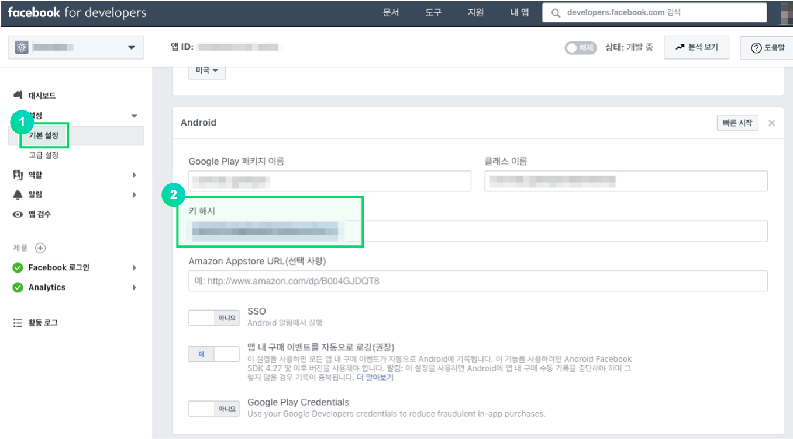

---
search:
  keyword: ['gamepot']
---

#### **We provide the <a href="https://guide.ncloud-docs.com/docs/en/home" target="_blank">[Manual]</a>and <a href="https://api.ncloud-docs.com/docs/en/home" target="_blank">[API Reference]</a>separately to offer more detailed information on how to use the NAVER CLOUD PLATFORM and help maximize the use of the API.**

<a href="https://api.ncloud-docs.com/docs/en/game-gamepot" target="_blank">Go to Gamepot API Reference >></a><br />
<a href="https://guide.ncloud-docs.com/docs/en/game-gamepotconsole" target="_blank">Go to Gamepot Manual >></a>

# Android SDK

## 1. Get started

### Development environment setup

You must install required development tools \(such as Android Studio\) to develop Android applications. The development tools you use may require JAVA SDK, Android SDK, etc.

The system requirements for GAMEPOT in Android are described below:

\[ System requirements \]

- Minimum requirements: API 17 \(Jelly Bean, 4.2\) or later, gradle 3.3.3 or later
- Development environment: Android Studio

#### Create a project


#### Add libraries

Add the AOS SDK file you downloaded to the app/libs folder.


#### Configure build.gradle

The build.gradle file is located in your project's root and app folders.

1. Edit build.gradle under the root folder

   ```java
   buildscript {

       repositories {
           ...
           google()
           jcenter()
           maven { url "https://jitpack.io" }
           maven { url "https://jcenter.bintray.com" }
       }
       dependencies {
          ...
           classpath 'com.google.gms:google-services:4.2.0'
       }
   }

   allprojects {
       repositories {
           ...
           google()
           jcenter()
           maven { url "https://jitpack.io" }
           maven { url "https://jcenter.bintray.com" }
       }
   }
   ```

2. Edit build.gradle under the app folder

   > Replace \[xxxxx\] with your own value.

| Value                        | Description                                                                                      |
| :--------------------------- | :----------------------------------------------------------------------------------------------- |
| gamepot_project_id           | Enter a project ID issued from GAMEPOT.                                                          |
| gamepot_store                | Store value \(`Google`, `One`, or `Galaxy`\)                                                     |
| gamepot_payment              | Payment method value \(Only applicable if it's Google Play Store. Currently supports `mycard`\)  |
| gamepot_app_title            | App title \(FCM\)                                                                                |
| gamepot_push_default_channel | Default channel name registered \(Default\) - DO NOT change.                                     |
| facebook_app_id              | App ID issued from Facebook                                                                      |
| fb_login_protocol_scheme     | Protocol scheme fb\[app_id\] issued from Facebook                                                |
| gamepot_elsa_projectid       | Project ID when using NCLOUD ELSA \([View more](https://www.ncloud.com/product/analytics/elsa)\) |

```java
android {
    defaultConfig {
        ...
        // GamePot [START]
        resValue "string", "gamepot_project_id", "[projectId]" // required
        resValue "string", "gamepot_store", "[storeId]" // required
        resValue "string", "gamepot_payment", "[storeId]" // optional
        resValue "string", "gamepot_app_title","@string/app_name" // required (fcm)
        resValue "string", "gamepot_push_default_channel","Default" // required (fcm)
        resValue "string", "facebook_app_id", "[Facebook ID]" // facebook
        resValue "string", "fb_login_protocol_scheme", "fb[Facebook ID]" // (facebook)
        // resValue "string", "gamepot_elsa_projectid", "" // (ncp elsa)
        // GamePot [END]
    }

    packagingOptions {
        exclude 'META-INF/proguard/androidx-annotations.pro'
    }
}

repositories {
    flatDir {
        dirs 'libs'
    }
}

dependencies {
    compile 'com.android.support:multidex:1.0.1'

    // GamePot common [START]
    compile(name: 'gamepot-common', ext: 'aar')
    compile('io.socket:socket.io-client:1.0.0') {
        exclude group: 'org.json', module: 'json'
    }
    compile('com.github.ihsanbal:LoggingInterceptor:3.0.0') {
        exclude group: 'org.json', module: 'json'
    }
    compile "com.github.nisrulz:easydeviceinfo:2.4.1"
    compile 'com.android.installreferrer:installreferrer:1.0'
    compile 'com.google.code.gson:gson:2.8.2'
    compile 'com.jakewharton.timber:timber:4.7.0'
    compile 'com.squareup.okhttp3:okhttp:3.10.0'
    compile 'com.apollographql.apollo:apollo-runtime:1.0.0-alpha2'
    compile 'com.apollographql.apollo:apollo-android-support:1.0.0-alpha2'
    compile 'com.android.billingclient:billing:1.1'
    compile 'com.github.bumptech.glide:glide:3.7.0'
    compile 'com.romandanylyk:pageindicatorview:1.0.3'
    compile 'com.google.firebase:firebase-core:16.0.6'
    compile 'com.google.firebase:firebase-messaging:17.3.4'
    compile 'androidx.sqlite:sqlite-framework:2.0.1'
    compile 'com.cookpad.puree:puree:4.1.6'
    // GamePot common [END]

    compile(name: 'gamepot-channel-base', ext: 'aar')
    // GamePot facebook [START]
    compile(name: 'gamepot-channel-facebook', ext: 'aar')
    compile 'com.facebook.android:facebook-android-sdk:5.2.0'
    // GamePot facebook [END]

    // GamePot google sigin [START]
    compile(name: 'gamepot-channel-google-signin', ext: 'aar')
    compile "com.google.android.gms:play-services-base:16.0.1"
    compile "com.google.android.gms:play-services-auth:16.0.1"
    // GamePot google sigin [END]
}

// ADD THIS AT THE BOTTOM
apply plugin: 'com.google.gms.google-services'
```

3. Copy google-service.json issued from Google into the /app/ folder.
4. Gradle Sync Now

   Click the button highlighted in the red box in the figure below to refresh.


- Failures you may encounter after clicking Refresh

  - Configuration 'compile' is obsolete and has been replaced with 'implementation' and 'api'. It will be removed at the end of 2018. For more information see: [http://d.android.com/r/tools/update-dependency-configurations.html](http://d.android.com/r/tools/update-dependency-configurations.html)

    > If you use Gradle version 3 or later, replace "compile" with "implementation"

  - No matching client found for package name 'packagename'

    > Make sure that the package name of the app matches the one declared in googld-service.json.

#### Configure AndroidManifest.xml

Add settings generally used for games. Refer to the following code example for more information.

> Configure each element based on the recommendations by the developer.

```xml
<?xml version="1.0" encoding="utf-8"?>
<manifest xmlns:android="http://schemas.android.com/apk/res/android"
    xmlns:tools="http://schemas.android.com/tools">

    <!--Enable devices without a telephony feature, such as a tablet, to download the app from the app store.-->
    <uses-feature android:name="android.hardware.telephony" android:required="false" />
    <!--Enable devices without a microphone to download games supporting voice chat from the app store.-->
    <uses-feature android:name="android.hardware.microphone" android:required="false" />

    <!--allowBackup must be set to false. (This is to prevent shared preference from automatically being restored when the game is reinstalled.)-->
    <application
        android:name="android.support.multidex.MultiDexApplication"
        android:allowBackup="false"
        tools:replace="android:allowBackup">

        <!--resizeableActivity: Disable split screen-->
        <activity
            android:resizeableActivity="false">
            <intent-filter>
                <action android:name="android.intent.action.MAIN" />
                <category android:name="android.intent.category.LAUNCHER" />
            </intent-filter>
        </activity>

        <!--Deal with screens such as Galaxy S8.-->
        <meta-data android:name="android.max_aspect" android:value="2.1" />

    </application>
</manifest>
```

#### Configure push notification icon


When you receive a push notification, the default image in the SDK is shown as an icon displayed on the notification bar; you can also specify your own image for your game.

**Specify your own icon**

> Using [Android Asset Studio](http://romannurik.github.io/AndroidAssetStudio/icons-notification.html#source.type=clipart&source.clipart=ac_unit&source.space.trim=1&source.space.pad=0&name=ic_stat_gamepot_small), icons are automatically created for each folder. You can simply put them in the corresponding folder.

1. Create folders associated with res/drawable as listed below:
   - res/drawable-mdpi/
   - res/drawable-hdpi/
   - res/drawable-xhdpi/
   - res/drawable-xxhdpi/
   - res/drawable-xxxhdpi/
2. Create images in each of the following sizes:
   - 24x24
   - 36x36
   - 48x48
   - 72x72
   - 96x96
3. Add an image of the specified size to each folder as shown in the following table:

| Folder name           | Size  |
| :-------------------- | :---- |
| res/drawable-mdpi/    | 24x24 |
| res/drawable-hdpi/    | 36x36 |
| res/drawable-xhdpi/   | 48x48 |
| res/drawable-xxhdpi/  | 72x72 |
| res/drawable-xxxhdpi/ | 96x96 |

1. Change the name of the image file to `ic_stat_gamepot_small.`

## 2. Initialization

Add the following code to MainActivity.java.

```java
import io.gamepot.common.GamePot;
import io.gamepot.common.GamePotLocale;

@Override
protected void onCreate(Bundle savedInstanceState) {
    super.onCreate(savedInstanceState);
    // Initialize GAMEPOT. Make sure to add application context.
    // Initially, you must call the setup API.
    GamePot.getInstance().setup(getApplicationContext());
}

@Override
protected void onActivityResult(int requestCode, int resultCode, Intent data) {
    super.onActivityResult(requestCode, resultCode, data);
    GamePot.getInstance().onActivityResult(requestCode, resultCode, data);
}

@Override
protected void onStart() {
    super.onStart();
    GamePotChat.getInstance().start();
    GamePot.getInstance().onStart(this);
}

@Override
protected void onStop() {
    super.onStop();
    GamePotChat.getInstance().stop();
}

@Override
protected void onDestroy() {
    super.onDestroy();
    GamePot.getInstance().onDestroy();
}
```

## 3. Login, Logout, Delete Member

Use various login SDKs, such as Google, Facebook, and NAVER.

### Google \(Firebase\) console

Add the SHA-1 value of Keystore used when your APK is built to the Firebase console.

> Request the SHA-1 value from the developer.


### Facebook console

Add the key hash value of Keystore, used when your APK is built, to the Facebook console.

> Request the key hash value from the developer.



### Settings

#### Edit MainActivity.java

Edit MainActivity.java as follows so that you can implement login features.

```java
import io.gamepot.channel.GamePotChannel;
import io.gamepot.channel.GamePotChannelType;
import io.gamepot.channel.facebook.GamePotFacebook;
import io.gamepot.channel.google.signin.GamePotGoogleSignin;

public class MainActivity extends AppCompatActivity {
    @Override
    protected void onCreate(Bundle savedInstanceState) {
        // You must call the setup API at the very beginning.
        GamePot.getInstance().setup(getApplicationContext());

        ...
        // Call addChannel for each channel to use login. (Guest type is included by default.)
        // Initialize Google Login
        GamePotChannel.getInstance().addChannel(this, GamePotChannelType.GOOGLE, new GamePotGoogleSignin());
        // Initialize Facebook Login
        GamePotChannel.getInstance().addChannel(this, GamePotChannelType.FACEBOOK, new GamePotFacebook());
        ...
    }

    @Override
    protected void onActivityResult(int requestCode, int resultCode, Intent data) {
        super.onActivityResult(requestCode, resultCode, data);
        GamePotChannel.getInstance().onActivityResult(this, requestCode, resultCode, data);
    }

    @Override
    protected void onDestroy() {
        super.onDestroy();
        GamePotChannel.getInstance().onDestroy();
    }
}
```

### Login

The login UI must be implemented by the developer; it connects when a user clicks the login button.

```java
import io.gamepot.channel.GamePotChannel;
import io.gamepot.channel.GamePotChannelListener;
import io.gamepot.channel.GamePotChannelType;
import io.gamepot.channel.GamePotUserInfo;
import io.gamepot.common.GamePotError;

// Define login type.
// GamePotChannelType.GOOGLE: Google
// GamePotChannelType.FACEBOOK: Facebook
// GamePotChannelType.NAVER: NAVER
// GamePotChannelType.LINE: LINE
// GamePotChannelType.TWITTER: Twitter
// GamePotChannelType.APPLE: Apple
// GamePotChannelType.GUEST: Guest

// Appears when a user clicks the Google login button.
GamePotChannel.getInstance().login(this, GamePotChannelType.GOOGLE, new GamePotChannelListener<GamePotUserInfo>() {
    @Override
    public void onCancel() {
        // When a user cancels login.
    }

    @Override
    public void onSuccess(GamePotUserInfo userinfo) {
        // Login Complete. Handle this according to the game logic.
        // userinfo.getMemberid() : Member's unique ID
    }

    @Override
    public void onFailure(GamePotError error) {
        // Log in failed. Use error.getMessage() to show an error message.
    }
});
```

#### Member's unique ID

```java
GamePot.getInstance().getMemberId();
```

### Auto login

You can implement auto login by using the API, bypassing the user’s last login information.

```java
import io.gamepot.channel.GamePotChannel;
import io.gamepot.channel.GamePotChannelListener;
import io.gamepot.channel.GamePotChannelType;
import io.gamepot.channel.GamePotUserInfo;
import io.gamepot.common.GamePotError;

// API bypasses the user’s last login information
final GamePotChannelType lastLoginType = GamePotChannel.getInstance().getLastLoginType();

if(lastLoginType != GamePotChannelType.NONE) {
    // Log in with the user's last login type.
    GamePotChannel.getInstance().login(this, lastLoginType, new GamePotChannelListener<GamePotUserInfo>() {
        @Override
        public void onCancel() {
            // When a user cancels login.
        }

        @Override
        public void onSuccess(GamePotUserInfo info) {
            // Auto login completed. Handle this according to the game logic.
        }

        @Override
        public void onFailure(GamePotError error) {
            // Auto log in failed. Use error.getMessage() to show an error message.
        }
    });
}
else
{
    // The user logs in the game for the first time, or is currently logged out. Move to the login screen where the user can log in.
}
```

### Logout

It logs the current member account out.

```java
import io.gamepot.channel.GamePotChannel;
import io.gamepot.common.GamePotCommonListener;
import io.gamepot.common.GamePotError;

GamePotChannel.getInstance().logout(this, new GamePotCommonListener() {
    @Override
    public void onSuccess() {
        // Logout completed. Move to the initial screen.
    }

    @Override
    public void onFailure(GamePotError error) {
        // Logout failed. Use error.getMessage() to show an error message.
    }
});
```

### Membership Withdrawal

Deletes the current member account.

```java
import io.gamepot.channel.GamePotChannel;
import io.gamepot.common.GamePotCommonListener;
import io.gamepot.common.GamePotError;

GamePotChannel.getInstance().deleteMember(this, new GamePotCommonListener() {
    @Override
    public void onSuccess() {
        // Succeeded. Move to the initial screen.
    }

    @Override
    public void onFailure(GamePotError error) {
        // Failed to delete account. Use error.getMessage() to show an error message.
    }
});
```

### Authentication check

After the login is complete, the login information is passed from the developer server to the GAMEPOT server to perform authentication checks.

For more information, refer to `Authentication check` under `Server to server api.`

## 4. Connect/Disconnect Accounts

Connect or disconnect a game account to or from multiple social media accounts \(including Google and Facebook\).\(At least one social media account must be connected.\)

> The developer must implement the connection screen UI.

### Connect/Disconnect Accounts

Connect user accounts with social media accounts including Google and Facebook.

```java
import io.gamepot.channel.GamePotChannel;
import io.gamepot.channel.GamePotChannelListener;
import io.gamepot.channel.GamePotChannelType;
import io.gamepot.channel.GamePotUserInfo;
import io.gamepot.common.GamePotError;

// Connect with Google account
// GamePotChannelType.GOOGLE
// Connect with Facebook account
// GamePotChannelType.FACEBOOK
// Connect with NAVER account
// GamePotChannelType.NAVER
// Connect with LINE account
// GamePotChannelType.LINE
// Connect with Twitter account
// GamePotChannelType.TWITTER
// Connect with Apple account
// GamePotChannelType.APPLE

GamePotChannel.getInstance().createLinking(this, GamePotChannelType.GOOGLE, new GamePotChannelListener<GamePotUserInfo>() {
    @Override
    public void onSuccess(GamePotUserInfo userInfo) {
        // Connection completed. Display the message showing the connection result. (Example: Successfully connected.)
    }

    @Override
    public void onCancel() {
        // When the user cancels the account connection
    }

    @Override
    public void onFailure(GamePotError error) {
        // Connection failed. Use error.getMessage() to display an error message.
    }
});
```

### List of connected accounts

Verify that an account has been connected to a social media account.

```java
import io.gamepot.channel.GamePotChannel;
import java.util.ArrayList;

// Define types.
// GamePotChannelType.GOOGLE
// GamePotChannelType.FACEBOOK
// GamePotChannelType.NAVER
// GamePotChannelType.LINE
// GamePotChannelType.TWITTER
// GamePotChannelType.APPLE
// Return connection results for each type.
boolean isLinked = GamePotChannel.getInstance().isLinked(GamePotChannelType.GOOGLE);

// Return results in JSON for all connected types.
// If the account is connected with GOOGLE or FACEBOOK, it returns the following results.
// [{“provider”:”google”},{“provider”:”facebook”}]
JSONArray linking = GamePotChannel.getInstance().getLinkedList();
```

### Disconnect accounts

Disconnect user accounts from their social media accounts.

```java
import io.gamepot.channel.GamePotChannel;
import io.gamepot.channel.GamePotChannelType;
import io.gamepot.common.GamePotCommonListener;
import io.gamepot.common.GamePotError;

GamePotChannel.getInstance().deleteLinking(this, GamePotChannelType.GOOGLE, new GamePotCommonListener() {
    @Override
    public void onSuccess() {
        // Disconnection completed. Display the message showing the connection result. (Example: Successfully disconnected.)
    }

    @Override
    public void onFailure(GamePotError error) {
        // Disconnection failed. Use error.getMessage() to display an error message.
    }
});
```

## 5. Payment

The results of payment are implemented as Listener.

When the app starts in MainActivity.java, mark it as called.

```java
import io.gamepot.common.GamePot;
import io.gamepot.common.GamePotPurchaseInfo;
import io.gamepot.common.GamePotPurchaseListener;
import io.gamepot.common.GamePotError;

public class MainActivity extends AppCompatActivity {
    @Override
    protected void onCreate(Bundle savedInstanceState) {
        // You must call the setup API at the very beginning.
        GamePot.getInstance().setup(getApplicationContext());

        ...
        GamePot.getInstance().setPurchaseListener(new GamePotPurchaseListener<GamePotPurchaseInfo>() {
            @Override
            public void onSuccess(GamePotPurchaseInfo info) {
                // Payment succeeded. Make a server-to-server request to the address set in webhook to get items.
                // Handle the result here and DO NOT provide items.
            }

            @Override
            public void onFailure(GamePotError error) {
                // Payment failed. Use error.getMessage() to show an error message.
            }

            @Override
            public void onCancel() {
                // When the user cancels the payment process
            }
        });
        ...
    }
}
```

### Payment attempt

With one payment API, payments can be made at both GooglePlay Store and One Store.

> During the payment attempt to Payment complete/Payment failed process, show the in-game loading screen to ensure that no duplicate calls are made.

```java
Case 1: General payment

import io.gamepot.common.GamePot;

// productId: Put the product ID registered in the store.
GamePot.getInstance().purchase("product id");
```

```java
Case 2: Managing receipt numbers separately at the payment time:

import io.gamepot.common.GamePot;

// productId: Put the product ID registered in the store.
// uniqueId: Put the receipt numbers managed separately.
GamePot.getInstance().purchase("product id", "uniqueId");
```

```java
Case 3: Sending receipt numbers/server ID/character ID/further information processed in payments to webhook:

import io.gamepot.common.GamePot;

// productId: Put the product ID registered in the store.
// uniqueId: Put the receipt numbers managed separately.
// serverId: Use the server ID of the character who made the payment.
// playerId: Enter the character's ID who made the payment.
// etc.: Enter the other information from the character who made the payment.
GamePot.getInstance().purchase("product id","uniqueId","serverId","playerId","etc");
```

### Get purchased items list

Get in-app item list transferred from stores.

```java
import io.gamepot.common.GamePot;

GamePotPurchaseDetailList details = GamePot.getInstance().getPurchaseDetailList();
```

### Provide purchased items

GAMEPOT requests items from the developer server after checking receipts from the store by using the Server to server api, thereby preventing illegal payments.

Refer to `Purchase` in `Server to server api` to implement this.

## 6. External payment

ONE Store allows third-party payment modules other than the default store payment module.

### Settings

Set the dashboard first by referring to external payments.

`5.` If you implemented the `payment` first, you don't need to set anymore.

### Payment attempt

```java
import io.gamepot.common.GamePot;

// activity: Current activity
// product id: Payment ID registered in the dashboard
GamePot.getInstance().purchaseThirdPayments(activity, product id);
```

### Get purchased items list

```java
import io.gamepot.common.GamePot;

GamePotPurchaseDetailList thirdPaymentsDetailList = GamePot.getInstance().getPurchaseThirdPaymentsDetailList();
```

## 7. Other APIs

### Login UI supported by SDK

SDK provides an independent, complete Login UI.

```java
import io.gamepot.channel.GamePotChannel;
import io.gamepot.channel.GamePotChannelListener;
import io.gamepot.channel.GamePotAppStatusChannelListener;
import io.gamepot.channel.GamePotChannelType;
import io.gamepot.channel.GamePotChannelLoginBuilder;
import io.gamepot.channel.GamePotUserInfo;
import io.gamepot.common.GamePotError;

String[] channelList = {"google", "facebook", "naver", "line", "twitter", "apple", "guest"};
GamePotChannelLoginBuilder builder = new GamePotChannelLoginBuilder(channelList);

// Appears when a user clicks the Google login button.
GamePotChannel.getInstance().showLoginWithUI(this, builder, new GamePotAppStatusChannelListener<GamePotUserInfo>() {
    @Override
    public void onCancel() {
        // When a user cancels login.
    }

    @Override
    public void onSuccess(GamePotUserInfo userinfo) {
        // Login complete. Handle this according to the game logic.
        // userinfo.getMemberid(): Member's unique ID
    }

    @Override
    public void onFailure(GamePotError error) {
        // Login failed. Show an error message using error.getMessage().
    }
});
```

#### Setting Login UI image logo

The image logo at the top of the login UI shows the default image within the SDK, and this can be replaced by users.

**Customizing Image Logo**

> Using [Android Asset Studio](http://romannurik.github.io/AndroidAssetStudio/icons-notification.html#source.type=clipart&source.clipart=ac_unit&source.space.trim=1&source.space.pad=0&name=ic_stat_gamepot_login_logo), icons are automatically created for each folder. You can simply put them in the corresponding folder.

1. Create res/drawable associated folders as below

   - res/drawable-mdpi/
   - res/drawable-hdpi/
   - res/drawable-xhdpi/
   - res/drawable-xxhdpi/
   - res/drawable-xxxhdpi/

2. Create images in each of the following sizes

   - 78x55
   - 116x82
   - 155x110
   - 232x165
   - 310x220

3. Add an image of the specified size to each folder as shown in the following table

| Folder name           | Size    |
| :-------------------- | :------ |
| res/drawable-mdpi/    | 78x55   |
| res/drawable-hdpi/    | 116x82  |
| res/drawable-xhdpi/   | 155x110 |
| res/drawable-xxhdpi/  | 232x165 |
| res/drawable-xxxhdpi/ | 310x220 |

- Rename the image file to `ic_stat_gamepot_login_logo.png`

### Log in to NAVER

#### Configure build.gradle

```java
android {
    defaultConfig {
        ...
        resValue "string", "gamepot_naver_clientid", "xxxxxxxx" // Get from NAVER developer console
        resValue "string", "gamepot_naver_secretid", "xxx" // Get from NAVER developer console
    }
}

dependencies {
  ...
  compile(name: 'gamepot-channel-naver', ext: 'aar')
  ...
}
```

#### Set MainActivity.java

```java
import io.gamepot.channel.GamePotChannel;
import io.gamepot.channel.GamePotChannelType;
import io.gamepot.channel.naver.GamePotNaver;

@Override
protected void onCreate(Bundle savedInstanceState) {
    super.onCreate(savedInstanceState);
        ...
        GamePotChannel.getInstance().addChannel(this, GamePotChannelType.NAVER, new GamePotNaver());
}
```

#### Login

```java
GamePotChannel.getInstance().login(this, GamePotChannelType.NAVER, new GamePotAppStatusChannelListener<GamePotUserInfo>() {
  ...
});
```

### Log in to LINE

#### Configure build.gradle

```java
android {
    defaultConfig {
        ...
        resValue "string", "gamepot_line_channelid","00000000" // Get from Line developer console
    }
}

dependencies {
  ...
  compile(name: 'gamepot-channel-line', ext: 'aar')
  compile(name: 'line-sdk-4.0.10', ext: 'aar')
  ...
}
```

#### Set MainActivity.java

```java
import io.gamepot.channel.GamePotChannel;
import io.gamepot.channel.GamePotChannelType;
import io.gamepot.channel.line.GamePotLine;

@Override
protected void onCreate(Bundle savedInstanceState) {
    super.onCreate(savedInstanceState);
        ...
        GamePotChannel.getInstance().addChannel(this, GamePotChannelType.LINE, new GamePotLine());
}
```

#### Login

```java
GamePotChannel.getInstance().login(this, GamePotChannelType.LINE, new GamePotAppStatusChannelListener<GamePotUserInfo>() {
  ...
});
```

### Log in to Twitter

#### Configure build.gradle

```java
android {
    compileOptions {
        sourceCompatibility JavaVersion.VERSION_1_8
        targetCompatibility JavaVersion.VERSION_1_8
    }

    defaultConfig {
        ...
        resValue "string", "gamepot_twitter_consumerkey","xxxxx" // Get from Twitter developer console
        resValue "string", "gamepot_twitter_consumersecret","xxx" // Get from Twitter developer console
    }
}

dependencies {
  ...
  compile(name: 'gamepot-channel-twitter', ext: 'aar')
  compile('com.twitter.sdk.android:twitter-core:3.3.0@aar') {
      transitive = true
  }
  ...
}
```

#### Set MainActivity.java

```java
import io.gamepot.channel.GamePotChannel;
import io.gamepot.channel.GamePotChannelType;
import io.gamepot.channel.twitter.GamePotTwitter;

@Override
protected void onCreate(Bundle savedInstanceState) {
    super.onCreate(savedInstanceState);
        ...
        GamePotChannel.getInstance().addChannel(this, GamePotChannelType.TWITTER, new GamePotTwitter());
}
```

#### Login

```java
GamePotChannel.getInstance().login(this, GamePotChannelType.TWITTER, new GamePotAppStatusChannelListener<GamePotUserInfo>() {
  ...
});
```

### Log in to Apple (Web login)

#### Configure build.gradle

```java
dependencies {
  ...
  compile(name: 'gamepot-channel-apple-signin', ext: 'aar')
  ...
}
```

#### Set MainActivity.java

```java
import io.gamepot.channel.GamePotChannel;
import io.gamepot.channel.GamePotChannelType;
import io.gamepot.channel.apple.signin.GamePotAppleSignin;

@Override
protected void onCreate(Bundle savedInstanceState) {
    super.onCreate(savedInstanceState);
        ...
        GamePotChannel.getInstance().addChannel(this, GamePotChannelType.APPLE, new GamePotAppleSignin());
}
```

#### Login

```java
GamePotChannel.getInstance().login(this, GamePotChannelType.APPLE, new GamePotAppStatusChannelListener<GamePotUserInfo>() {
  ...
});
```

### Coupon

Call the following code to use a coupon entered by a user.

> The developer must implement the screen UI to get coupons.

```java
import io.gamepot.common.GamePot;
import io.gamepot.common.GamePotError;
import io.gamepot.common.GamePotListener;

GamePot.getInstance().coupon(/*Coupon entered by the user*/, new GamePotListener<String>() {
    @Override
    public void onSuccess(String message) {
        // Succeeded in using coupons. Display the message as a pop-up.
    }

    @Override
    public void onFailure(GamePotError error) {
        // Failed to use coupons. Use error.getMessage() to show an error message.
    }
});
```

#### Provide items

When a coupon is used successfully, request an item from the developer server by using the Server to server api.

Refer to `Item` in `Server to server api` to implement this.

### Push on/off

You can turn each of the following three push notifications on or off: All, Night and Ad.

> The developer must implement the UI to turn push notifications on or off.

```java
import io.gamepot.common.GamePot;
import io.gamepot.common.GamePotError;
import io.gamepot.common.GamePotCommonListener;

// Push On/Off
GamePot.getInstance().setPushEnable(/*true or false*/, new GamePotCommonListener() {
    @Override
    public void onSuccess() {
    }

    @Override
    public void onFailure(GamePotError error) {
    }
});

// Night Push On/Off
GamePot.getInstance().setNightPushEnable(/*true or false*/, new GamePotCommonListener() {
    @Override
    public void onSuccess() {
    }

    @Override
    public void onFailure(GamePotError error) {
    }
});

// Set Push and Night Push at the same time.
// For games that prompt users to turn Push and Night Push on or off before login, call the following code snippet after login.
GamePot.getInstance().setPushEnable(/*true or false*/, /*true or false*/, true, new GamePotCommonListener() {
    @Override
    public void onSuccess() {
    }

    @Override
    public void onFailure(GamePotError error) {
    }
});
```

Refer to the following code to get the current push status.

```java
import io.gamepot.common.GamePot;
import org.json.JSONObject;

// enable: All Push
// night: Night Push
// {"enable":true, "night":true}
JSONObject status = GamePot.getInstance().getPushStatus();
```

### Notices

This feature displays images uploaded in Dashboard > Notice.

#### Call

```java
/* showTodayButton: Provides a choice to show 'Do not show for 24 hours' button or not. It will always appear if it's false. */
boolean showTodayButton = true;

GamePot.getInstance().showNotice(/*Current activity*/, showTodayButton, new GamePotNoticeDialog.onSchemeListener() {
    @Override
    public void onReceive(String scheme) {
        // TODO : Process scheme
    }
});
```

### Notice (Call by classification)

Dashboard - This feature displays the classified image from the images uploaded in Notice.

#### Call

```java
/* Dashboard Notice >> Name set in classification */
string type = "";

GamePot.getInstance().showEvent(/*Current activity*/, type, new GamePotNoticeDialog.onSchemeListener() {
    @Override
    public void onReceive(String scheme) {
        // TODO: Process scheme
    }
});
```

### Customer Support

This is a communication channel between users and administrators that is connected with Dashboard > Customer Support > Inquiries.

UI for Inquiries changes according to the device's language. It supports Korean, English, Japanese, Chinese (Simplified, Traditional). English is applied for other languages.

#### Call

```java
GamePot.getInstance().showCSWebView(/*Current activity*/);
```

It supports external links so that customers who haven't logged in can register inquiries.

#### Call

```java
String url = "External customer support issued by GAMEPOT URL";

GamePot.getInstance().showWebView(/*Current activity*/, url, true);
```

### FAQ

This is a FAQ list, which is connected with Dashboard > Customer support > FAQ.

#### Call

```java
GamePot.getInstance().showFaq(/*Current activity*/);
```

### Local Push notification

This feature enables devices to display push notifications independently, not via the push server.

#### Call

**Add push**

Refer to the following code to display local push notifications at a specified time.

> The pushid passed as a return value must be managed by the developer.

```java
String date = "2018-09-27 20:00:00";
GamePotLocalPushBuilder builder = new GamePotLocalPushBuilder(getActivity())
                        .setTitle("Local push test")
                        .setMessage("Local push message " + date)
                        .setDateString(date).build();
int pushid = GamePot.getInstance().sendLocalPush(builder);
```

**Cancel push**

You can cancel previously added push notifications using the pushid you get when adding push.

```java
GamePot.getInstance().cancelLocalPush(/*Current activity*/, /*pushid you get when adding push*/);
```

### Maintenance check and force update

If you need maintenance checks or force updates, you can enable this feature in Dashboard > Operation.

#### Call

Modify the previously applied APIs as described below.

**1. login API**

Change the listener in the login API to `GamePotAppStatusChannelListener.`

```java
GamePotChannel.getInstance().login(this, GamePotChannelType.GOOGLE, new GamePotAppStatusChannelListener<GamePotUserInfo>() {
    @Override
    public void onNeedUpdate(GamePotAppStatus status) {
        // TODO: When you need force update. Call the following API to enable the SDK to display pop-ups by itself.
        // TODO: You can also customize the function without calling this API.
        GamePot.getInstance().showAppStatusPopup(MainActivity.this, status, new GamePotAppCloseListener() {
            @Override
            public void onClose() {
                // TODO: This API is called to close the app if the showAppStatusPopup API is called.
                // TODO: Handle the shutdown process.
                MainActivity.this.finish();
            }

            @Override
            public void onNext(Object obj) {
                // TODO : When you set the dashboard update as recommended, the "Do next time" button will appear.
                // Called when the user selects that button.
                // TODO : Handle in the same way as when login is completed with the obj information.
                // GamePotUserInfo userInfo = (GamePotUserInfo)obj;
            }
        });
    }

    @Override
    public void onMainternance(GamePotAppStatus status) {
        // TODO: When a maintenance check is in progress. Call the following API to enable the SDK to display pop-ups by itself.
        // TODO: You can also customize the function without calling this API.
        GamePot.getInstance().showAppStatusPopup(MainActivity.this, status, new GamePotAppCloseListener() {
            @Override
            public void onClose() {
                // TODO: This API is called to close the app if the showAppStatusPopup API is called.
                // TODO: Handle the shutdown process.
                MainActivity.this.finish();
            }
        });
    }

    @Override
    public void onCancel() {
        // When a user cancels login.
    }

    @Override
    public void onSuccess(GamePotUserInfo userinfo) {
        // Login Complete. Handle this according to the game logic.
    }

    @Override
    public void onFailure(GamePotError error) {
        // Log in failed. Use error.getMessage() to show an error message.
    }
});
```

### Agree to terms and conditions

Provides UI to easily obtain agreement to "Terms of service" and "Collection and use of personal information".

11 types of new, `improved themes` are provided in addition to two `basic themes`, `BLUE` and `GREEN`.

Each area can be customized.

#### Call Agree to terms and conditions

```java
// Default theme
GamePotAgreeBuilder.THEME.BLUE
GamePotAgreeBuilder.THEME.GREEN

//Improved theme
GamePotAgreeBuilder.THEME.MATERIAL_RED,
GamePotAgreeBuilder.THEME.MATERIAL_BLUE,
GamePotAgreeBuilder.THEME.MATERIAL_CYAN,
GamePotAgreeBuilder.THEME.MATERIAL_ORANGE,
GamePotAgreeBuilder.THEME.MATERIAL_PURPLE,
GamePotAgreeBuilder.THEME.MATERIAL_DARKBLUE,
GamePotAgreeBuilder.THEME.MATERIAL_YELLOW,
GamePotAgreeBuilder.THEME.MATERIAL_GRAPE,
GamePotAgreeBuilder.THEME.MATERIAL_GRAY,
GamePotAgreeBuilder.THEME.MATERIAL_GREEN,
GamePotAgreeBuilder.THEME.MATERIAL_PEACH,
```

> Handle Agree to Terms and Conditions pop-up according to games.
>
> When you click the 'View' button, you can apply and edit the content in the dashboard.

Request:

```java
// Default call (with BLUE theme)
GamePot.getInstance().showAgreeDialog(/*activity*/, new GamePotAgreeBuilder(), new GamePotListener<GamePotAgreeInfo>() {
    @Override
    public void onSuccess(GamePotAgreeInfo data) {
        // data.agree: True if agreed to all required terms and conditions
        // data.agreeNight: True if Agree to Receive Night Ad push is checked, false if not.
        // Pass agreeNight value via setPushNightStatus api after logging in.
    }

    @Override
    public void onFailure(GamePotError error) {
        // Provide the user with error.message as a pop-up message.
    }
});

// When applying MATERIAL_ORANGE theme
GamePotAgreeBuilder bulider = new GamePotAgreeBuilder(GamePotAgreeBuilder.THEME.MATERIAL_ORANGE);
GamePot.getInstance().showAgreeDialog(/*activity*/, bulider, new GamePotListener<GamePotAgreeInfo>() {
  ....
}
```

#### Customizing

Change colors depending on the games without using themes.

You can specify colors to each area in `GamePotAgreeBuilder` before calling Agree to Terms and Conditions.

```java
GamePotAgreeBuilder agreeBuilder= new GamePotAgreeBuilder();
agreeBuilder.setHeaderBackGradient(new int[] {0xFF00050B,0xFF0F1B21});
agreeBuilder.setHeaderTitleColor(0xFFFF0000);
agreeBuilder.setHeaderBottomColor(0xFF00FF00);
// Set to "" if not used
agreeBuilder.setHeaderTitle("Agree to Terms and Conditions");
// res/drawable object ID
agreeBuilder.setHeaderIconDrawable(R.drawable.ic_stat_gamepot_agree);

agreeBuilder.setContentBackGradient(new int[] { 0xFFFF2432, 0xFF11FF32 });
agreeBuilder.setContentTitleColor(0xFF0429FF);
agreeBuilder.setContentCheckColor(0xFFFFADB5);
agreeBuilder.setContentIconColor(0xFF98FFC6);
agreeBuilder.setContentShowColor(0xFF98B3FF);
// res/drawable object ID
agreeBuilder.setContentIconDrawable(R.drawable.ic_stat_gamepot_small);

agreeBuilder.setFooterBackGradient(new int[] { 0xFFFFFFFF, 0xFF112432 });
agreeBuilder.setFooterButtonGradient(new int[] { 0xFF1E3A57, 0xFFFFFFFF });
agreeBuilder.setFooterButtonOutlineColor(0xFFFF171A);
agreeBuilder.setFooterTitleColor(0xFFFF00D5);
agreeBuilder.setFooterTitle("Start game");

//일반 광고성 수신동의 버튼 노출 여부
agreeBuilder.setShowPush(true);

// Whether to show Agree to Receive Night Ad push button
agreeBuilder.setShowNightPush(true);

// 일반 광고성 수신동의 링크 버튼 설정(미사용 시, 입력 안함)
agreeBuilder.setPushDetailURL("https://...");

// 야간 광고성 수신동의 링크 버튼 설정 (미사용 시, 입력 안함)
agreeBuilder.setNightPushDetailURL("https://...");

// Change description
agreeBuilder.setAllMessage("Agree to all");
agreeBuilder.setTermMessage("Required) Terms of service");
agreeBuilder.setPrivacyMessage("Required) Terms and conditions of the privacy policy");
agreeBuilder.setPushMessage("선택) 일반 푸시 수신 동의");
agreeBuilder.setNightPushMessage("Optional) Agree to receive night push");

GamePot.getInstance().showAgreeDialog(/*activity*/, agreeBuilder, new GamePotListener<GamePotAgreeInfo>() {
  ....
}
```

Each parameter applies to the following area:

> contentIconDrawable's default image is set to push icon.


### Terms of service

Call terms of service UI.

> Enter contents in Dashboard > Customer support > Set terms of service first.

```java
import io.gamepot.common.GamePot;

// activity: Current activity
GamePot.getInstance().showTerms(activity);
```

### Terms and conditions of the privacy policy

Call terms and conditions of the privacy policy UI.

> Enter contents in Dashboard > Customer support > Set terms and conditions of the privacy policy first.

```java
import io.gamepot.common.GamePot;

// activity: Current activity
GamePot.getInstance().showPrivacy(activity);
```

### Refund policy

Call refund policy UI.

> Enter contents in Dashboard > Customer support > Set refund policy first.

```java
import io.gamepot.common.GamePot;

// activity: Current activity
GamePot.getInstance().showRefund(activity);
```

### Remote configuration

Import parameter values registered with the dashboard from the client.

> Add parameters first in Dashboard > Settings > Remote configuration screen.

The parameters added are loaded at login. You can call them after they have been loaded.

```java
import io.gamepot.common.GamePot;

//key : Parameter string
String str_value = GamePot.getInstance().getConfig(key);

//Import all parameters added in the dashboard in json string format.
String json_value = GamePot.getInstance().getConfigs();
```

### Transfer game logs

You can call the logs that contain in-game information and view them in `Dashboard` > `Game.`

Check reserved words from the table below:

| Reserved Words                    | Required | Type   | Description    |
| :-------------------------------- | :------- | :----- | :------------- |
| GamePotSendLogCharacter.NAME      | Required | String | Character Name |
| GamePotSendLogCharacter.LEVEL     | Select   | String | Level          |
| GamePotSendLogCharacter.SERVER_ID | Select   | String | Server ID      |
| GamePotSendLogCharacter.PLAYER_ID | Select   | String | Character ID   |
| GamePotSendLogCharacter.USERDATA  | Select   | String | ETC            |

```java
import android.text.TextUtils;

import io.gamepot.common.GamePotSendLogCharacter;
import io.gamepot.common.GamePotSendLog;

String name = "Character Name";
String level = "10";
String serverid = "svn_001";
String playerid = "283282191001";
String userdata = "";

GamePotSendLogCharacter obj = new GamePotSendLogCharacter();
if(!TextUtils.isEmpty(name))
    obj.put(GamePotSendLogCharacter.NAME, name);
if(!TextUtils.isEmpty(level))
    obj.put(GamePotSendLogCharacter.LEVEL, level);
if(!TextUtils.isEmpty(serverid))
    obj.put(GamePotSendLogCharacter.SERVER_ID, serverid);
if(!TextUtils.isEmpty(playerid))
    obj.put(GamePotSendLogCharacter.PLAYER_ID, playerid);
if(!TextUtils.isEmpty(playerid))
    obj.put(GamePotSendLogCharacter.USERDATA, userdata);

// result : It is true if logs are transferred, false if not.
boolean result = GamePotSendLog.characterInfo(obj);
```

### GDPR Terms and Conditions Checklist

Shows the list of GDPR terms and conditions items activated from Dashboard.

```java
import io.gamepot.common.GamePot;

(List<String>) GamePot.getInstance().getGDPRCheckedList();

//Each parameter returned applies to the following settings in Dashboard.
gdpr_privacy: Privacy Policy
gdpr_term: Terms and Conditions
gdpr_gdpr: GDPR Terms and Conditions
gdpr_push_normal: Consent to receive event push notifications
gdpr_push_night: Consent to receive nighttime event push notifications (only applicable in Korea)
gdpr_adapp_custom: Consent to personalized advertisement (for countries where GDPR is applicable)
gdpr_adapp_nocustom: Consent to non-personalized advertisement (for countries where GDPR is applicable)
```

# Appendix

### It supports third-party SDK connection

TODO : Description

## Login

TODO : Description

> It does not support auto login. Call is required every time.

| Parameter Name | Required | Type                                                     | Description      |
| :------------- | :------- | :------------------------------------------------------- | :--------------- |
| activity       | Required | String                                                   | Current activity |
| userid         | Required | String                                                   | User’s unique ID |
| listener       | Required | GamePotChannelListener / GamePotAppStatusChannelListener | Request result   |

```java
String memberId = "memberid of 3rd party sdk";

GamePotChannel.getInstance().loginByThirdPartySDK(getActivity(), memberId, new GamePotAppStatusChannelListener<GamePotUserInfo>() {
    @Override
    public void onNeedUpdate(GamePotAppStatus status) {
        // TODO: When you need force update. Call the following API to enable the SDK to display pop-ups by itself.
        // TODO: You can also customize the function without calling this API.
        GamePot.getInstance().showAppStatusPopup(MainActivity.this, status, new GamePotAppCloseListener() {
            @Override
            public void onClose() {
                // TODO: This API is called to close the app if the showAppStatusPopup API is called.
                // TODO: Handle the shutdown process.
                MainActivity.this.finish();
            }

            @Override
            public void onNext(Object obj) {
                // TODO : When you set the dashboard update as recommended, the "Do next time" button will appear.
                // Called when the user selects that button.
                // TODO : Handle in the same way as when login is completed with the obj information.
                // GamePotUserInfo userInfo = (GamePotUserInfo)obj;
            }
        });
    }

    @Override
    public void onMainternance(GamePotAppStatus status) {
        // TODO: When a maintenance check is in progress. Call the following API to enable the SDK to display pop-ups by itself.
        // TODO: You can also customize the function without calling this API.
        GamePot.getInstance().showAppStatusPopup(MainActivity.this, status, new GamePotAppCloseListener() {
            @Override
            public void onClose() {
                // TODO: This API is called to close the app if the showAppStatusPopup API is called.
                // TODO: Handle the shutdown process.
                MainActivity.this.finish();
            }
        });
    }

    @Override
    public void onCancel() {
        // When a user cancels login.
    }

    @Override
    public void onSuccess(GamePotUserInfo userinfo) {
        // Login Complete. Handle this according to the game logic.
    }

    @Override
    public void onFailure(GamePotError error) {
        // Log in failed. Use error.getMessage() to show an error message.
    }
});
```

## Payment

TODO : Description

> Purchased items must be registered in GAMEPOT dashboard.

| Parameter Name | Required | Type            | Description                                    |
| :------------- | :------- | :-------------- | :--------------------------------------------- |
| productid      | Required | String          | Item ID registered in GAMEPOT dashboard        |
| transactionid  | Required | String          | Payment receipt number (GPA-xxx-xxxx-xxxx)     |
| currency       | Select   | String          | Currency (KRW, USD)                            |
| price          | Select   | double          | Amount of purchased items                      |
| paymentid      | Select   | String          | Store for payment (google, apple, one, galaxy) |
| uniqueid       | Select   | String          | Developer's unique ID                          |
| listener       | Select   | GamePotListener | Request result                                 |

```java
String productId = "purchase_001";
String transactionId = "GPA-xxx-xxxx-xxxx";
String currency = "KRW";
double price = 1200;
String paymentId = "google";
String uniqueId = "developer unique id";

GamePot.getInstance().sendPurchaseByThirdPartySDK(productId, transactionId, currency, price, paymentId, uniqueId, null);
```