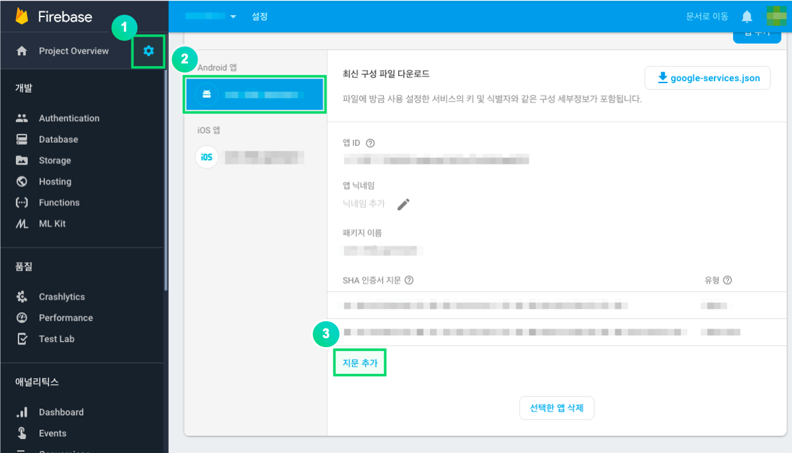

---
search:
  keyword: ['gamepot']
---

# 1. Get Started

## Development environment setup

You should install development tools such as Android Studio, required to develop Android applications. The development tools you use may require JAVA SDK, Android SDK, etc.

The system requirements for GAMEPOT in Android are described below: 

**[System requirements]**

- Minimum requirements: API 15 (IceCreamSandwich, 4.0.3) or later, gradle 2.3.0 or later
- Development environment: Android Studio

### Create a project


### Add libraries

Add the AOS SDK file you downloaded to the app/libs folder.


### Configure build.gradle

The `build.gradle file` is located in the `root` folder and `app` folder of your project, respectively.

1. Edit `build.gradle` under the `root` folder

   ```java
   buildscript {

       repositories {
           ...
           google()
           jcenter()
           maven { url "https://jitpack.io" }
           maven { url "https://jcenter.bintray.com" }
       }
       dependencies {
          ...
           classpath 'com.google.gms:google-services:4.2.0'
       }
   }

   allprojects {
       repositories {
           ...
           google()
           jcenter()
           maven { url "https://jitpack.io" }
           maven { url "https://jcenter.bintray.com" }
       }
   }

   ```

2. Edit `build.gradle` under the `app` folder

   > Replace [xxxxx] with your own value.

   ```java
   android {
       defaultConfig {
           ...
           // GamePot [START]
           resValue "string", "gamepot_project_id", "[projectId]" // required
           resValue "string", "gamepot_api_url", "[apiUrl]" // required
           resValue "string", "gamepot_store", "[storeId]" // required
           resValue "string", "gamepot_app_title","@string/app_name" // required (fcm)
           resValue "string", "gamepot_push_default_channel","Default" // required (fcm)
           resValue "string", "facebook_app_id", "[Facebook ID]" // facebook
           resValue "string", "fb_login_protocol_scheme", "fb[Facebook ID]" // (facebook)
           // GamePot [END]
       }
   }

   repositories {
       flatDir {
           dirs 'libs'
       }
   }

   dependencies {
       compile 'com.android.support:multidex:1.0.1'

       // GamePot common [START]
       compile(name: 'gamepot-common', ext: 'aar')
       compile('io.socket:socket.io-client:1.0.0') {
           exclude group: 'org.json', module: 'json'
       }
       compile('com.github.ihsanbal:LoggingInterceptor:2.0.5') {
           exclude group: 'org.json', module: 'json'
       }
       compile "com.github.nisrulz:easydeviceinfo:2.4.1"
       compile 'com.android.installreferrer:installreferrer:1.0'
       compile 'com.google.code.gson:gson:2.8.2'
       compile 'com.jakewharton.timber:timber:4.7.0'
       compile 'com.squareup.okhttp3:okhttp:3.10.0'
       compile 'com.apollographql.apollo:apollo-runtime:1.0.0-alpha2'
       compile 'com.apollographql.apollo:apollo-android-support:1.0.0-alpha2'
       compile 'com.android.billingclient:billing:1.1'
       compile 'com.google.firebase:firebase-core:16.0.6'
       compile 'com.google.firebase:firebase-messaging:17.3.4'
       // GamePot common [END]

       compile(name: 'gamepot-channel-base', ext: 'aar')
       // GamePot facebook [START]
       compile(name: 'gamepot-channel-facebook', ext: 'aar')
       compile 'com.facebook.android:facebook-android-sdk:4.39.0'
       // GamePot facebook [END]

       // GamePot google signin [START]
       compile(name: 'gamepot-channel-google-signin', ext: 'aar')
       compile "com.google.android.gms:play-services-base:16.0.1"
       compile "com.google.android.gms:play-services-auth:16.0.1"
       // GamePot google signin [END]
   }

   // ADD THIS AT THE BOTTOM
   apply plugin: 'com.google.gms.google-services'
   ```

3. Copy `google-service.json` issued from Google into the `/app/` folder.

4. Gradle Sync Now

   Click the button highlighted in red box in the figure below to refresh.


* Failures you may encounter after clicking Refresh

  * Configuration 'compile' is obsolete and has been replaced with 'implementation' and 'api'.
    It will be removed at the end of 2018. For more information see: <http://d.android.com/r/tools/update-dependency-configurations.html>

    > If you use Gradle version 3 or later, replace “compile” with “implementation.”

  * No matching client found for package name 'packagename'

    > Make sure that the package name of the app matches the one declared in google-service.json.

### Configure AndroidManifest.xml

Add settings generally used for games. See the following code example for more information.

> Configure each element based on the recommendations by the developer.

```xml
<?xml version="1.0" encoding="utf-8"?>
<manifest xmlns:android="http://schemas.android.com/apk/res/android"
    xmlns:tools="http://schemas.android.com/tools">

    <!--Enable devices with no telephony feature, such as a tablet, to download the app from the app store-->
    <uses-feature android:name="android.hardware.telephony" android:required="false" />
    <!--Enable devices with no microphone to download games supporting voice chatting from the app store.-->
    <uses-feature android:name="android.hardware.microphone" android:required="false" />

    <!--Must set allowBackup to false. (This is to prevent shared preference from automatically being restored when the game is re-installed.)-->
    <application
        android:name="android.support.multidex.MultiDexApplication"
        android:allowBackup="false"
        tools:replace="android:allowBackup">

        <!--resizeableActivity : Disable split screen-->
        <activity
            android:resizeableActivity="false">
            <intent-filter>
                <action android:name="android.intent.action.MAIN" />
                <category android:name="android.intent.category.LAUNCHER" />
            </intent-filter>
        </activity>

        <!--Deal with screens such as Galaxy S8.-->
        <meta-data android:name="android.max_aspect" android:value="2.1" />

    </application>
</manifest>
```

### Configure push notification icon


For the icon to be displayed on the notification bar when a push notification message is received, the default image in the SDK is used; you can also specify your own image for your game.

#### Specify your own icon

> Using [Android Asset Studio](http://romannurik.github.io/AndroidAssetStudio/icons-notification.html#source.type=clipart&source.clipart=ac_unit&source.space.trim=1&source.space.pad=0&name=ic_stat_gamepot_small), you can automatically create icons by folder. Then, just put them in each folder.

1. Create folders associated with `res/drawable` as listed below:
   - res/drawable-mdpi/
   - res/drawable-hdpi/
   - res/drawable-xhdpi/
   - res/drawable-xxhdpi/
   - res/drawable-xxxhdpi/

2. Create images in each of the following sizes:
    - 24x24
    - 36x36
    - 48x48
    - 72x72
    - 96x96

3. Add an image of the specified size to each folder as shown in the following table:

|  Folder name                 |  Size  |
|  --------------------  |  -----  |
|  res/drawable-mdpi/     |  24x24  |
|  res/drawable-hdpi/     |  36x36  |
|  res/drawable-xhdpi/    |  48x48  |
|  res/drawable-xxhdpi/   |  72x72  |
|  res/drawable-xxxhdpi/  |  96x96  |

4. Change the name of the image file to `ic_stat_gamepot_small.`

# 2. Initialize

Add the following code to `MainActivity.java`.

```java
import io.gamepot.common.GamePot;
import io.gamepot.common.GamePotLocale;

@Override
protected void onCreate(Bundle savedInstanceState) {
    super.onCreate(savedInstanceState);
    // Initialize GAMEPOT. Make sure to add application context.
    // You should call the setup API at first.
    GamePot.getInstance().setup(getApplicationContext());
}

@Override
protected void attachBaseContext(Context newBase) {
    super.attachBaseContext(GamePotLocale.onAttach(newBase));
}

@Override
protected void onActivityResult(int requestCode, int resultCode, Intent data) {
    super.onActivityResult(requestCode, resultCode, data);
    GamePot.getInstance().onActivityResult(requestCode, resultCode, data);
}

@Override
protected void onStart() {
    super.onStart();
    GamePotChat.getInstance().start();
}

@Override
protected void onStop() {
    super.onStop();
    GamePotChat.getInstance().stop();
}

@Override
protected void onDestroy() {
    super.onDestroy();
    GamePot.getInstance().onDestroy();
}
```

# 3. Login, Logout, Delete Member

You can use various login SDKs, such as Google, Facebook, and NAVER.

## Google (Firebase) Console

Add the SHA-1 value of Keystore used when your APK is built to the Firebase Console.

> Request the SHA-1 value from the developer.



## Facebook Console

Add the key hash value of Keystore used when your APK is built to the Facebook Console.

> Request the key hash value from the developer.


## Configuration

### Edit MainActivity.java

Edit MainActivity.java as follows so that you can implement login features.

```java
import io.gamepot.channel.GamePotChannel;
import io.gamepot.channel.GamePotChannelType;
import io.gamepot.channel.facebook.GamePotFacebook;
import io.gamepot.channel.google.signin.GamePotGoogleSignin;

public class MainActivity extends AppCompatActivity {
    @Override
    protected void onCreate(Bundle savedInstanceState) {
        // You should call the setup API at the very beginning.
        GamePot.getInstance().setup(getApplicationContext());

        ...
        // Call addChannel for each channel to use login. (Guest type is included by default.)
        // Initialize Google Login
        GamePotChannel.getInstance().addChannel(this, GamePotChannelType.GOOGLE, new GamePotGoogleSignin());
        // Initialize Facebook Login
        GamePotChannel.getInstance().addChannel(this, GamePotChannelType.FACEBOOK, new GamePotFacebook());
        ...
    }

    @Override
    protected void onActivityResult(int requestCode, int resultCode, Intent data) {
        super.onActivityResult(requestCode, resultCode, data);
        GamePotChannel.getInstance().onActivityResult(this, requestCode, resultCode, data);
    }

    @Override
    protected void onDestroy() {
        super.onDestroy();
        GamePotChannel.getInstance().onDestroy();
    }
}
```

## Login

The developer should implement the login UI; the login feature is performed when a user clicks the login button.

```java
import io.gamepot.channel.GamePotChannel;
import io.gamepot.channel.GamePotChannelListener;
import io.gamepot.channel.GamePotChannelType;
import io.gamepot.channel.GamePotUserInfo;
import io.gamepot.common.GamePotError;

// Define login type.
// GamePotChannelType.GOOGLE: Google
// GamePotChannelType.FACEBOOK: Facebook
// GamePotChannelType.GUEST: Guest

// Call this method when a user clicks the Google login button.
GamePotChannel.getInstance().login(this, GamePotChannelType.GOOGLE, new GamePotChannelListener<GamePotUserInfo>() {
    @Override
    public void onCancel() {
        // When a user cancels login
    }

    @Override
    public void onSuccess(GamePotUserInfo userinfo) {
        // Login completed. Handle this depending on your game logic.
    }

    @Override
    public void onFailure(GamePotError error) {
        // Login failed. Use error.getMessage() to show an error message.
    }
});
```

## Auto login

You can implement auto login by using the API passing the user’s last login information.

```java
import io.gamepot.channel.GamePotChannel;
import io.gamepot.channel.GamePotChannelListener;
import io.gamepot.channel.GamePotChannelType;
import io.gamepot.channel.GamePotUserInfo;
import io.gamepot.common.GamePotError;

// API passing the user’s last login information
final GamePotChannelType lastLoginType = GamePotChannel.getInstance().getLastLoginType();

if(lastLoginType != GamePotChannelType.NONE) {
    // Log in with the login type of the user’s last login.
    GamePotChannel.getInstance().login(this, lastLoginType, new GamePotChannelListener<GamePotUserInfo>() {
        @Override
        public void onCancel() {
            // When a user cancels login
        }

        @Override
        public void onSuccess(GamePotUserInfo info) {
            // Auto login completed. Handle this depending on your game logic.
        }

        @Override
        public void onFailure(GamePotError error) {
            // Auto login failed. Use error.getMessage() to show an error message.
        }
    });
}
else
{
    // The user logs in the game for the first time, or is currently logged out. Move to the login screen where the user can log in.
}
```

## Logout

Logs the current member account out.

```java
import io.gamepot.channel.GamePotChannel;
import io.gamepot.common.GamePotCommonListener;
import io.gamepot.common.GamePotError;

GamePotChannel.getInstance().logout(this, new GamePotCommonListener() {
    @Override
    public void onSuccess() {
        // Logout completed. Move to the initial screen.
    }

    @Override
    public void onFailure(GamePotError error) {
        // Logout failed. Use error.getMessage() to show an error message.
    }
});
```

## Delete member

Deletes the current member account.

```java
import io.gamepot.channel.GamePotChannel;
import io.gamepot.common.GamePotCommonListener;
import io.gamepot.common.GamePotError;

GamePotChannel.getInstance().deleteMember(this, new GamePotCommonListener() {
    @Override
    public void onSuccess() {
        // Succeeded. Move to the initial screen.
    }

    @Override
    public void onFailure(GamePotError error) {
        // Failed. Use error.getMessage() to show an error message.
    }
});
```

## Authentication check

After the login is completed, the login information is passed from the developer server to the GAMEPOT server to perform authentication checks.

For more information, refer to `Authentication check` under `Server to server api`.


# 4. Connect/Disconnect Accounts

Connects or disconnects a game account to or from multiple social media accounts including Google and Facebook. (At least one social media account should be connected.)

> The developer should implement the connection screen UI.

## Connect accounts

Connects user accounts with their social media accounts including Google and Facebook.

```java
import io.gamepot.channel.GamePotChannel;
import io.gamepot.channel.GamePotChannelListener;
import io.gamepot.channel.GamePotChannelType;
import io.gamepot.channel.GamePotUserInfo;
import io.gamepot.common.GamePotError;

// Connect Google account
// GamePotChannelType.GOOGLE
// Connect Facebook account
// GamePotChannelType.FACEBOOK

GamePotChannel.getInstance().createLinking(this, GamePotChannelType.GOOGLE, new GamePotChannelListener<GamePotUserInfo>() {
    @Override
    public void onSuccess(GamePotUserInfo userInfo) {
        // Connection completed. Display the message showing the connection result. (Example: Successfully connected.)
    }

    @Override
    public void onCancel() {
        // When the user cancels the account connection
    }

    @Override
    public void onFailure(GamePotError error) {
        // Connection failed. Use error.getMessage() to show an error message.
    }
});
```

## List of connected accounts

Checks whether an account is connected with social media accounts.

```java
import io.gamepot.channel.GamePotChannel;
import java.util.ArrayList;

// Define types.
// GamePotChannelType.GOOGLE
// GamePotChannelType.FACEBOOK
// Return connection results for each type.
boolean isLinked = GamePotChannel.getInstance().isLinked(GamePotChannelType.GOOGLE);

// Return results in JSON for all connected types.
// If the account is connected with GOOGLE and FACEBOOK, it returns the following results.
// [{“provider”:”google”},{“provider”:”facebook”}]
JSONArray linking = GamePotChannel.getInstance().getLinkedList();
```

## Disconnect accounts

Disconnects user accounts from their social media accounts.

```java
import io.gamepot.channel.GamePotChannel;
import io.gamepot.channel.GamePotChannelType;
import io.gamepot.common.GamePotCommonListener;
import io.gamepot.common.GamePotError;

GamePotChannel.getInstance().deleteLinking(this, GamePotChannelType.GOOGLE, new GamePotCommonListener() {
    @Override
    public void onSuccess() {
        // Disconnection completed. Display the message showing the connection result. (Example: Successfully disconnected.)
    }

    @Override
    public void onFailure(GamePotError error) {
        // Disconnection failed. Use error.getMessage() to show an error message.
    }
});
```

# 5. Advertisement Platform

You can use various advertisement platform SDKs such as Facebook, Adjust, and Adbrix.

## Configuration

### Edit MainActivity.java

Edit MainActivity.java as follows so that you can implement advertisement platform features.

```java
import io.gamepot.ad.GamePotAd;
import io.gamepot.ad.GamePotAdActions;
import io.gamepot.ad.facebook.GamePotAdFacebook;
import io.gamepot.ad.igaworks.GamePotAdIgaworks;
import io.gamepot.ad.adjust.GamePotAdAdjust;

public class MainActivity extends AppCompatActivity {
    @Override
    protected void onCreate(Bundle savedInstanceState) {
        // You should call the setup API at the very beginning.
        GamePot.getInstance().setup(getApplicationContext());

        ...
                // Initialize GAMEPOT ad. Call addAd for each ad module to use.
        GamePotAd.getInstance().setSandbox(false); // Development Version is 'true'. Deployment Version is 'false'
        GamePotAd.getInstance().setActivity(this);
        // Initialize Facebook (add this if needed).
                GamePotAd.getInstance().addAd(new GamePotAdFacebook());
        // Initialize IGAWorks (add this if needed).
                GamePotAd.getInstance().addAd(new GamePotAdIgaworks());
        // Initialize Adjust (add this if needed).
        GamePotAd.getInstance().addAd(new GamePotAdAdjust());
        ...
    }

    @Override
    protected void onResume() {
        super.onResume();
        GamePotAd.getInstance().tracking(GamePotAdActions.RESUME);
    }

    @Override
    protected void onPause() {
        super.onPause();
        GamePotAd.getInstance().tracking(GamePotAdActions.PAUSE);
    }

    @Override
    protected void onDestroy() {
        super.onDestroy();
        GamePotAd.getInstance().onDestroy();
    }
}
```

### Configure InstallReferrer

#### Add ReferrerCatcher.java

Create ReferrerCatcher.java in your project and add the following code to it.

```java
import android.content.BroadcastReceiver;
import android.content.Context;
import android.content.Intent;
import android.os.Bundle;
import android.util.Log;

import com.adjust.sdk.AdjustReferrerReceiver;
import com.google.android.gms.analytics.CampaignTrackingReceiver;
import com.igaworks.IgawReceiver;

public class ReferrerCatcher extends BroadcastReceiver {
    @Override
    public void onReceive(Context context, Intent intent) {
        if(intent != null) {
            Bundle extras = intent.getExtras();
            if (extras != null) {
                Log.i("ReferrerCatcher", extras.getString("referrer"));
            }
        }

        // TODO : Add the following code snippet only when using Adjust.
        try {
            Class.forName("com.adjust.sdk.AdjustReferrerReceiver");
            Class.forName("com.google.android.gms.analytics.CampaignTrackingReceiver");

            // Adjust [START]
            new AdjustReferrerReceiver().onReceive(context, intent);
            new CampaignTrackingReceiver().onReceive(context, intent);
            // Adjust [END]

            Log.i("ReferrerCatcher", "Adjust");
        } catch (Exception e) {
            e.printStackTrace();
        }

        // TODO : Add the following code snippet only when using Igaworks.
        try {
            Class.forName("com.igaworks.IgawReceiver");

            // IGAW [START]
            IgawReceiver igawReceiver = new IgawReceiver();
            igawReceiver.onReceive(context, intent);
            // IGAW [END]

            Log.i("ReferrerCatcher", "IGAW");
        }
        catch(Exception e) {
            e.printStackTrace();
        }
    }
}
```

#### Edit AndroidManifest.xml

Add the following code to AndoridManifest.xml, and put the path of the ReferrerCatcher class created above in `android:name`.

```xml
<manifest>
    ...
    <application>
        ...
        <!--Required when using IGAW/Facebook/Adjust modules-->
        <receiver android:name="{ReferrerCatcher's path}" android:exported="true">
            <intent-filter>
                <action android:name="com.android.vending.INSTALL_REFERRER" />
            </intent-filter>
        </receiver>
        <!--[END]-->
        ...
    </application>
    ...
</manifest>
```

### Edit build.gradle

Add settings for the platform you want to use.

```java

android {
    ...
    defaultConfig {
        ...
        // For Facebook [START]
        resValue "string", "facebook_app_id", "xxxxxxxxxxxxxxxx"
        resValue "string", "fb_login_protocol_scheme", "fbxxxxxxxxxxxxxxxx"
        // For Facebook [END]

        // For Adjust [START]
        resValue "string", "gamepot_adjust_apptoken","xxxxxxxxxxxx"
        resValue "string", "gamepot_adjust_signature","(1, xxxxxxxxxx, xxxxxxxxxx, xxxxxxxxxx, xxxxxxxxxx)" // For adjust sdk signature
        // For Adjust [END]

        // For IGAWorks [START]
        resValue "string", "gamepot_igaworks_app_key", "xxxxxxxxxx"
        resValue "string", "gamepot_igaworks_hash_key", "xxxxxxxxxx"
        // For IGAWorks [END]
    }
}

dependencies {
    compile(name: 'gamepot-ad-base', ext: 'aar')

    // For Adjust [START]
    compile(name: 'gamepot-ad-adjust', ext: 'aar')
    compile 'com.adjust.sdk:adjust-android:4.14.0'
    compile 'com.android.installreferrer:installreferrer:1.0'
    compile 'com.google.android.gms:play-services-analytics:16.0.1'
    // For Adjust [END]

    // For Facebook [START]
    compile(name: 'gamepot-ad-facebook', ext: 'aar')
    compile 'com.facebook.android:facebook-android-sdk:[4,5)'
    // For Facebook [END]

    // For IGAWorks [START]
    compile(name: 'gamepot-ad-igaworks', ext: 'aar')
    compile 'com.android.installreferrer:installreferrer:1.0'
    // For IGAWorks [END]
}
```

## Event tracking

Implement event tracking as you need. Refer to the following code example.

```java
import io.gamepot.ad.GamePotAd;
import io.gamepot.ad.GamePotAdActions;
import io.gamepot.ad.builders.GamePotAdEventBuilder;
import io.gamepot.ad.builders.GamePotAdLevelBuilder;
import io.gamepot.ad.builders.GamePotAdTutorialBuilder;

// When starting the app.
GamePotAd.getInstance().tracking(GamePotAdActions.APPLICATION_START);

// Common
GamePotAd.getInstance().tracking(GamePotAdActions.EVENT, new GamePotAdEventBuilder().setEvent("test").build());

// When leveling up
GamePotAd.getInstance().tracking(GamePotAdActions.LEVEL, new GamePotAdLevelBuilder().setLevel(4).build());

// When completing the tutorial
GamePotAd.getInstance().tracking(GamePotAdActions.TUTORIAL_COMPLETE, new GamePotAdTutorialBuilder().setContentData("Tutorial complete").setContentId("1").setSuccess(true).build());

// When completing the payment
// Refer to "Configuration" in "6. Payment."

// When using Adjust
// Add an adjust event key in setAdjustKey api in each builder.

```

# 6. Payment

## Facebook Console

Turn **Log In-App Purchase Events Automatically (Recommended)** OFF.


## Configuration

The results of payment are implemented as a listener.

Declare it to be called once when starting the app in MainActivity.java.

```java
import io.gamepot.common.GamePot;
import io.gamepot.common.GamePotPurchaseInfo;
import io.gamepot.common.GamePotPurchaseListener;
import io.gamepot.common.GamePotError;

public class MainActivity extends AppCompatActivity {
    @Override
    protected void onCreate(Bundle savedInstanceState) {
        // You should call the setup API at the very beginning.
        GamePot.getInstance().setup(getApplicationContext());

        ...
        GamePot.getInstance().setPurchaseListener(new GamePotPurchaseListener<GamePotPurchaseInfo>() {
            @Override
            public void onSuccess(GamePotPurchaseInfo info) {
                        // Must add this code snippet to pass the payment event to the ad platform!  
                GamePotAd.getInstance().tracking(GamePotAdActions.BILLING, info);

                // Payment succeeded. Make a server-to-server request to the address set in webhook to get items.
                // Handle the result here, and DO NOT provide items.
            }

            @Override
            public void onFailure(GamePotError error) {
                // Payment failed. Use error.getMessage() to show an error message.
            }

            @Override
            public void onCancel() {
                // When the user cancels the payment process
            }
        });
        ...
    }
}
```

## Payment API

With one payment API, payments can be made in both Google Play and ONE store.

```java
import io.gamepot.common.GamePot;

// Put the product ID registered in the store in “productId.”
GamePot.getInstance().purchase("product id");
```

## Acquisition of payment item list

You can obtain a list of in-app items delivered by the store.

```java
import io.gamepot.common.GamePot;

GamePotPurchaseDetailList details = GamePot.getInstance().getPurchaseDetailList();
```

## Provide purchased items

GAMEPOT requests items from the developer server after checking receipts from the store by using the Server to server api, preventing illegal payments.

Refer to `Purchase` in `Server to server api` to implement this.

# 7. External payment

One store accepts a third payment module rather than a basic store payment module.

## Set

Please refer to the external billing item on your dashboard to set up your dashboard first.

7. If you have implemented the `payment 'item first, there is no additional setting.

## Payment attempt

```java
import io.gamepot.common.GamePot;

// activity : Current Activity
// product id : Dashboard-registered payment ID
GamePot.getInstance().purchaseThirdPayments(activity, product id);
```

## Acquisition of payment item list

```java
import io.gamepot.common.GamePot;

GamePotPurchaseDetailList thirdPaymentsDetailList = GamePot.getInstance().getPurchaseThirdPaymentsDetailList();
```

# 8. Other APIs

## NAVER Cafe SDK

You should get values required to integrate with the NAVER Cafe SDK in advance.

### Configuration

#### Edit build.gradle

```java
android {
    ...
    defaultConfig {
        ...
        resValue "string", "gamepot_naver_clientid", "{Client ID to be used in Login with NAVER ID}"
        resValue "string", "gamepot_naver_secretid", "{Secret ID to be used in Login with NAVER ID}"
        resValue "integer", "gamepot_naver_cafeid", "{NAVER Cafe ID}"
        // Add the following for global use.
        resValue "string", "gamepot_naver_global_consumerkey", "{consumerKey}"
        resValue "string", "gamepot_naver_global_consumersecretkey", "{consumerSecretKey}"
        resValue "integer", "gamepot_naver_global_communityno", "{communityNo}"
        resValue "integer", "gamepot_naver_global_loungeno", "{loungeNo}"
        ...
    }
}
...
dependencies {
    ...
    // naver cafe [START]
    compile(name: 'gamepot-navercafe', ext: 'aar')
    compile(name: 'cafeSdk-4.0.4', ext: 'aar')
    compile(name: 'sos_library-1.1.3.4', ext: 'aar')
    compile 'com.navercorp.volleyextensions:volleyer:2.0.1', {
        exclude group: 'com.mcxiaoke.volley', module: 'library'
    }
    compile 'com.github.bumptech.glide:glide:3.7.0'
    compile 'com.squareup:otto:1.3.8'
    // naver cafe [END]
    ...
}
```

#### Edit MainActivity.java

```java
import io.gamepot.navercafe.GamePotNaverCafe;

public class MainActivity extends Activity {
    @Override
    protected void onCreate(final Bundle savedInstanceState) {
        // You should call the setup API at the very beginning.
        GamePot.getInstance().setup(getApplicationContext());

        ...
        // Call this method after calling the GamePot setup API.
        GamePotNaverCafe.getInstance().init(this);
        ...
    }
}
```

### How to call

Refer to the following code to call the NAVER Cafe SDK.

```java
GamePotNaverCafe.getInstance().startHome(this);
```

After successful login, add the following code to identify members in the admin menu of NAVER Cafe.

```java
GamePotNaverCafe.getInstance().setUserId(this, GamePot.getInstance().getMemberId());
```

## Coupon

Call the following code to use coupons entered by users.

> The developer should implement the screen UI for entering coupons.

```java
import io.gamepot.common.GamePot;
import io.gamepot.common.GamePotError;
import io.gamepot.common.GamePotListener;

GamePot.getInstance().coupon(/*Coupon entered by the user*/, new GamePotListener<String>() {
    @Override
    public void onSuccess(String message) {
        // Succeeded in using coupons. Display the message as a popup.
    }

    @Override
    public void onFailure(GamePotError error) {
        // Failed to use coupons. Use error.getMessage() to show an error message.
    }
});
```

### Provide items

When a coupon is successfully used, request an item from the developer server by using the Server to server api.

Refer to `Item` in `Server to server api` to implement this.

## Push On/Off

You can turn each of the following three push notifications on or off: All, Night and Ad.

> The developer should implement the UI to turn push notifications on or off.

```java
import io.gamepot.common.GamePot;
import io.gamepot.common.GamePotError;
import io.gamepot.common.GamePotCommonListener;

// Push On/Off
GamePot.getInstance().setPushEnable(/*true or false*/, new GamePotCommonListener() {
    @Override
    public void onSuccess() {
    }

    @Override
    public void onFailure(GamePotError error) {
    }
});

// Night Push On/Off
GamePot.getInstance().setNightPushEnable(/*true or false*/, new GamePotCommonListener() {
    @Override
    public void onSuccess() {
    }

    @Override
    public void onFailure(GamePotError error) {
    }
});

// Set all of Push, Night Push and Ad Push at once.
// For games that prompt users to turn Push, Night Push and Ad Push on or off before login, call the following code snippet after login.
GamePot.getInstance().setPushEnable(/*true or false*/, /*true or false*/, /*true or false*/, new GamePotCommonListener() {
    @Override
    public void onSuccess() {
    }

    @Override
    public void onFailure(GamePotError error) {
    }
});
```

Refer to the following code to get the current push status.

```java
import io.gamepot.common.GamePot;
import org.json.JSONObject;

// enable: All Push
// night: Night Push
// ad: Ad Push
// {"enable":true, "night":true, "ad":false}
JSONObject status = GamePot.getInstance().getPushStatus();
```

## Notice

This feature displays images uploaded in **Dashboard > Notice**.

### How to call

```java
GamePot.getInstance().showNotice(/*Current Activity*/, new GamePotNoticeDialog.onSchemeListener() {
    @Override
    public void onReceive(String scheme) {
        // TODO : scheme processing
    }
});
```

## Customer support

This is a communication channel between users and administrators, which is connected with **Dashboard > Customer support**.

### How to call

```java
GamePot.getInstance().showCSWebView(/*Current activity*/);
```

## Local push notification

This feature enables devices to display push notifications by themselves, not via the push server.

### How to call

#### Add push

Refer to the following code to display local push notifications at a specified time.

> The pushid passed as a return value should be managed by the developer.

```java
String date = "2018-09-27 20:00:00";
GamePotLocalPushBuilder builder = new GamePotLocalPushBuilder(getActivity())
                        .setTitle("Local push test")
                        .setMessage("Local push message" + date)
                        .setDateString(date).build();
int pushid = GamePot.getInstance().sendLocalPush(builder);
```

#### Cancel push

You can cancel push notifications previously added, using the pushid you can get when adding push.

```java
GamePot.getInstance().cancelLocalPush(/*Current activity*/, /*pushid returned when adding push*/);
```

## Maintenance check and force update

If you need maintenance checks or force updates, you can enable this feature in **Dashboard > Operation**.

### How to call

Modify the previously applied APIs as described below.

#### 1. login API

Change the listener in the login API to `GamePotAppStatusChannelListener`.

```java
GamePotChannel.getInstance().login(this, GamePotChannelType.GOOGLE, new GamePotAppStatusChannelListener<GamePotUserInfo>() {
    @Override
    public void onNeedUpdate(GamePotAppStatus status) {
        // TODO : When you need force update. Call the following API to enable the SDK to display popups by itself.
        // TODO : You can also customize the function without calling this API.
        GamePot.getInstance().showAppStatusPopup(MainActivity.this, status, new GamePotAppCloseListener() {
            @Override
            public void onClose() {
                // TODO : This API is called to close the app if the showAppStatusPopup API is called.
                // TODO : Handle the process of shutting down.
                MainActivity.this.finish();
            }
        });
    }

    @Override
    public void onMainternance(GamePotAppStatus status) {
        // TODO : When a maintenance check is in progress. Call the following API to enable the SDK to display popups by itself.
        // TODO : You can also customize the function without calling this API.
        GamePot.getInstance().showAppStatusPopup(MainActivity.this, status, new GamePotAppCloseListener() {
            @Override
            public void onClose() {
                // TODO : This API is called to close the app if the showAppStatusPopup API is called.
                // TODO : Handle the process of shutting down.
                MainActivity.this.finish();
            }
        });
    }

    @Override
    public void onCancel() {
        // When a user cancels login
    }

    @Override
    public void onSuccess(GamePotUserInfo userinfo) {
        // Login completed. Handle this depending on your game logic.
    }

    @Override
    public void onFailure(GamePotError error) {
        // Login failed. Use error.getMessage() to show an error message.
    }
});
```

## Accept terms

We provide the UI to make it easy to get the 'Terms of Use' and 'Guide to collecting and using personal information'.

There are two types of `BLUE` and` GREEN` themes. Customization is also available for each area.

- Example of `BLUE` theme

  

- Example of `GREEN` theme

  

### Call for agreement

> Please agree to the terms of the agreement pop-ups are processed by the developer.
>
> **View** The information displayed when the button is clicked can be applied and modified in the dashboard.

Request:

```csharp
// Basic call (applied as BLUE theme)
GamePot.getInstance().showAgreeDialog(/*activity*/, new GamePotAgreeBuilder(), new GamePotListener<GamePotAgreeInfo>() {
    @Override
    public void onSuccess(GamePotAgreeInfo data) {
        // data.agree : True if all of the required conditions are true
        // data.agreeNight : True if evening advertising acceptance is checked; false otherwise
        // Pass the agreeNight value through the setPushNightStatus api after the login is complete.
    }

    @Override
    public void onFailure(GamePotError error) {
	    // Please let the user know the error.message by popup etc.
    }
});

// Apply as GREEN theme
GamePotAgreeBuilder bulider = new GamePotAgreeBuilder(GamePotAgreeBuilder.THEME.GREEN);
GamePot.getInstance().showAgreeDialog(/*activity*/, bulider, new GamePotListener<GamePotAgreeInfo>() {
  ....
}
```

### Customizing

Change the color for the game without using a theme.

You can specify a color for each area in the `GamePotAgreeBuilder` before invoking the agreement.

```c#
GamePotAgreeBuilder agreeBuilder= new GamePotAgreeBuilder();
agreeBuilder.setHeaderBackGradient(new int[] {0xFF00050B,0xFF0F1B21});
agreeBuilder.setHeaderTitleColor(0xFFFF0000);
agreeBuilder.setHeaderBottomColor(0xFF00FF00);
// Set to ""when not in use
agreeBuilder.setHeaderTitle("Accept terms");
// res/drawable Object ID
agreeBuilder.setHeaderIconDrawable(R.drawable.ic_stat_gamepot_agree);

agreeBuilder.setContentBackGradient(new int[] { 0xFFFF2432, 0xFF11FF32 });
agreeBuilder.setContentIconColor(0xFF0429FF);
agreeBuilder.setContentCheckColor(0xFFFFADB5);
agreeBuilder.setContentIconColor(0xFF98FFC6);
agreeBuilder.setContentShowColor(0xFF98B3FF);
// res/drawable Object ID
agreeBuilder.setContentIconDrawable(R.drawable.ic_stat_gamepot_small);

agreeBuilder.setFooterBackGradient(new int[] { 0xFFFFFFFF, 0xFF112432 });
agreeBuilder.setFooterButtonGradient(new int[] { 0xFF1E3A57, 0xFFFFFFFF });
agreeBuilder.setFooterButtonOutlineColor(0xFFFF171A);
agreeBuilder.setFooterTitleColor(0xFFFF00D5);
agreeBuilder.setFooterTitle("Start the game");
// Nightly advertising acceptance button
agreeBuilder.setShowNightPush(true);

// Change the text
agreeBuilder.setAllMessage("All agree");
agreeBuilder.setTermMessage("Required) Terms and Conditions");
agreeBuilder.setPrivacyMessage("Required) Privacy Policy");
agreeBuilder.setNightPushMessage("Select) Night push acceptance");

GamePot.getInstance().showAgreeDialog(/*activity*/, agreeBuilder, new GamePotListener<GamePotAgreeInfo>() {
  ....
}
```

Each variable is applied to the area below.

> The default image for contentIconDrawable is set to the push icon.


## Terms of service

Call the Terms of Use UI.

> Dashboard - Customer Support - Enter your content first in the Terms and Conditions section.

```java
import io.gamepot.common.GamePot;

// activity : Current Activity
GamePot.getInstance().showTerms(activity);
```

## Privacy Statement

Calls the privacy policy UI.

> Dashboard - Customer Support - Enter your privacy policy settings first.

```java
import io.gamepot.common.GamePot;

// activity : Current Activity
GamePot.getInstance().showPrivacy(activity);
```


