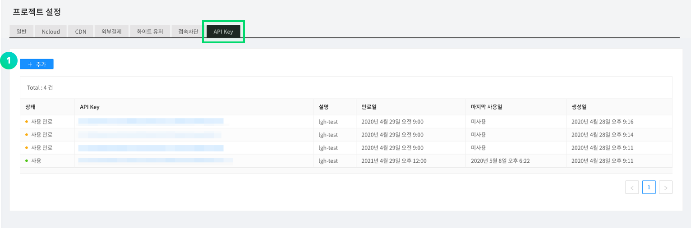
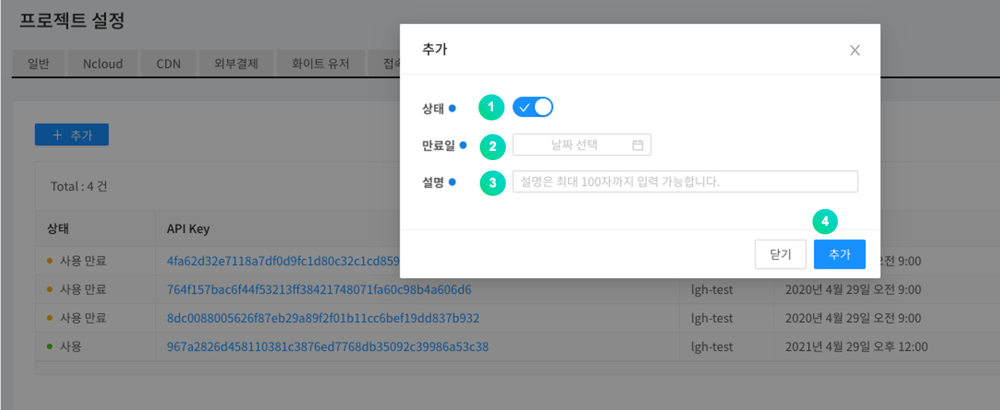
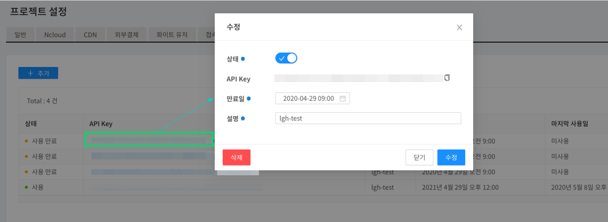

---
search:
  keyword:
    - gamepot
---

# Open API

> ### This is a machine-translated document that may have errors in vocabulary, syntax, or grammar. We will soon provide you with the document translated by a professional translator.
>
> #### If you have any questions, please [contact us](https://www.ncloud.com/support/question).
>
> We will make every effort to further enhance our services.

It is a function that can call some functions provided by the game pod with a prescribed API.

> You can use the allowed API Key issued by the dashboard to make calls, and you can specify whether to use it and the expiration date.

## API Key Issuance

To call the Open API, you must first create an API Key in the dashboard.

API Key can be created in <b>Dashboard> Project Settings> API Key </b>.



① Click the Add button to generate the API key.



① Select whether to activate the corresponding API Key.

② Set API Key expiration date.

③ Enter a description that the user can recognize.

④ Register API Key with the Add button.



You can modify or delete the status by clicking the generated API KEY.

> When the Open API is used, the generated Key value goes into the x-api-key value of the header.

## Using Open API

### Error code

Common error code that occurs when requesting Open API.

| Code | Description                                                      |
| :--- | :--------------------------------------------------------------- |
| -1   | If you used a key that is not on the dashboard                   |
| -2   | The key of the dashboard is different from the key of the header |
| -3   | When using a key deleted from the dashboard                      |
| -4   | Unused key in dashboard                                          |
| -5   | Key expired                                                      |
| -6   | If no project ID                                                 |

### User Lookup API

Look up a user by user UID.

#### Request

-Method: GET
-URI: /user/{userID}

```text
GET
url: https://dashboard-api.gamepot.ntruss.com/v1/api/project/{projectId}/user/{userId}
Header:'accept-language: en'
Header:'x-api-key: {API Key issued from GamePot dashboard}'
```

| Header    | Type   | Required | Description                          |
| :-------- | :----- | :------- | :----------------------------------- |
| x-api-key | String | O        | Authentication key issued by GamePot |

| Attribute | Type   | Description              |
| :-------- | :----- | :----------------------- |
| projectId | String | ProjectId in GamePot SDK |
| userId    | String | UserId in GamePot SDK    |

#### Response

success

```javascript
{
  "status": 1,
  "result": {
    "id": "xxxxxxxxxxxxxx",
    "deleted": false,
    "store_id": "google",
    "country": "KR",
    "remoteip": "xxx.xxx.xxx.xxx",
    "adid": "test_s6SksBK",
    "device": "android",
    "network": "WI-FI",
    "version": "testVersion",
    "model": "test-111",
    "token": "test:Qz9Fd81H6O",
    "push": true,
    "night": true,
    "ad": true,
    "memo": null,
    "device_id": null,
    "createdAt": "Tue Apr 07 2020 16:32:17 GMT+0900 (GMT+09:00)",
    "updatedAt": "Tue Apr 07 2020 16:32:19 GMT+0900 (GMT+09:00)",
    "loginedAt": "Tue Apr 07 2020 16:32:19 GMT+0900 (GMT+09:00)",
    "deletedAt": null
  }
}
```

| Attribute | Type    | Description                                                            |
| :-------- | :------ | :--------------------------------------------------------------------- |
| status    | Int     | Result value \(1: Refer to Error code for success and failure\)        |
| id        | String  | User ID                                                                |
| deleted   | Boolean | Whether to delete members \(true: delete, false: normal\)              |
| store_id  | String  | Store accessed when creating account (google...)                       |
| country   | String  | User country code (based on ISO 3166-1)                                |
| remoteip  | String  | User IP                                                                |
| adid      | String  | Advertising id                                                         |
| device    | String  | Device type (android,ios)                                              |
| network   | String  | User Access Network (WI-FI...)                                         |
| version   | String  | Client Version Information                                             |
| model     | String  | User device model name                                                 |
| token     | String  | Push token                                                             |
| push      | Boolean | Whether to agree with push \(true: agree, false: disagree\)            |
| night     | Boolean | Whether to agree to push at night \(true: agree, false: disagree\)     |
| ad        | Boolean | Whether advertising consent is pushed \(true: agree, false: disagree\) |
| memo      | String  | Member notes                                                           |
| device_id | String  | Member Device ID                                                       |
| createdAt | String  | Date the member was created                                            |
| updatedAt | String  | Date the member information was modified                               |
| loginedAt | String  | Last Connected                                                         |
| deletedAt | String  | Member Deleted Date                                                    |

실패

```javascript
{
  "status": -6,
  "message": "projectId was wrong."
}
```

| Attribute | Type   | Description                                                     |
| :-------- | :----- | :-------------------------------------------------------------- |
| status    | Int    | Result value \(1: Refer to Error code for success and failure\) |
| message   | String | Error content                                                   |

### User Stop Lookup API

Query if the user is stopped by user UID.

#### Request

- Method : GET
- URI : /user/{userID}/block

```text
GET
url : https://dashboard-api.gamepot.ntruss.com/v1/api/project/{projectId}/user/{userId}/block
Header : 'accept-language: ko'
Header : 'x-api-key: {GamePot 대시보드에서 발급받은 API Key}'
```

| Header    | Type   | Required | Description                          |
| :-------- | :----- | :------- | :----------------------------------- |
| x-api-key | String | O        | Authentication key issued by GamePot |

| Attribute | Type   | Description              |
| :-------- | :----- | :----------------------- |
| projectId | String | ProjectId in GamePot SDK |
| userId    | String | UserId in GamePot SDK    |

#### Response

success

```javascript
{
  "status": 1,
  "result": {
    "id": "xxxxxxxxxxxxxx",
    "member_id": "xxxxxxxxxxxxxx",
    "deleted": false,
    "type": "manual",
    "status": 1,
    "message": null,
    "messageMulti": [
      {
        "lang": "ko",
        "value": "테스트-ko",
        "default": true
      }
    ],
    "startedAt": "Mon May 11 2020 12:02:00 GMT+0900 (GMT+09:00)",
    "endedAt": "Mon May 25 2020 22:00:00 GMT+0900 (GMT+09:00)",
    "createdAt": "Tue May 12 2020 14:06:40 GMT+0900 (GMT+09:00)",
    "updatedAt": "Tue May 12 2020 14:06:40 GMT+0900 (GMT+09:00)",
    "deletedAt": null,
    "category_id": ""
  }
}
```

| Attribute   | Type    | Description                                                                                                                              |
| :---------- | :------ | :--------------------------------------------------------------------------------------------------------------------------------------- |
| status      | Int     | Result value \(1: Refer to Error code for success and failure\)                                                                          |
| id          | String  | ID for user suspension information                                                                                                       |
| member_id   | String  | User ID                                                                                                                                  |
| deleted     | Boolean | Whether to delete user suspension information \(true: delete, false: normal\)                                                            |
| type        | String  | Classification of suspension of use \(manual: manual, autopurchase: automatic\)                                                          |
| status      | Int     | Status \(1: active, 2: inactive\)                                                                                                        |
| message     | String  | Reason for suspension (not currently used)                                                                                               |
| lang        | String  | Stop Message Language                                                                                                                    |
| value       | String  | Reason for suspension                                                                                                                    |
| default     | Boolean | Default language setting If the language value of the <br> device is not in messageMulti, the message set to true is exposed by default. |
| startedAt   | String  | Start date of suspension                                                                                                                 |
| endedAt     | String  | End date of use                                                                                                                          |
| createdAt   | Boolean | Date of suspension of use                                                                                                                |
| updatedAt   | Boolean | Date of suspension of use                                                                                                                |
| deletedAt   | Boolean | Date of suspension of use                                                                                                                |
| category_id | String  | Usage Suspension Classification ID                                                                                                       |

failure

```javascript
{
  "status": -6,
  "message": "projectId was wrong."
}
```

| Attribute | Type   | Description                                                           |
| :-------- | :----- | :-------------------------------------------------------------------- |
| status    | Int    | Result value \(1: Refer to Error code in case of success or failure\) |
| message   | String | Error content                                                         |

### User Stop Settings API

User is suspended by user UID.

#### Request

- Method : POST
- URI : /user/{userID}/block

```text
POST
url : https://dashboard-api.gamepot.ntruss.com/v1/api/project/{projectId}/user/{userId}/block
Header : 'accept-language: ko'
Header : 'content-type: application/json'
Header : 'x-api-key: {API Key issued from GamePot Dashboard}'
data: '{
        "messageMulti": [
                {
                    "lang": "ko",
                    "value": "테스트",
                    "default": true
                }
            ],
            "startedAt": "2020-05-11 12:02",
            "endedAt": "2020-05-25 22:00"
       }'
```

| Header    | Type   | Required | Description                          |
| :-------- | :----- | :------- | :----------------------------------- |
| x-api-key | String | O        | Authentication key issued by GamePot |

| Attribute | Type    | Description                                                                                                                            |
| :-------- | :------ | :------------------------------------------------------------------------------------------------------------------------------------- |
| projectId | String  | ProjectId in GamePot SDK                                                                                                               |
| userId    | String  | UserId in GamePot SDK                                                                                                                  |
| lang      | String  | Stop Message Language                                                                                                                  |
| value     | String  | Reason for suspension                                                                                                                  |
| default   | Boolean | Default language setting<br>If the language value of the device is not in messageMulti, the message set to true is exposed by default. |
| startedAt | String  | Start date of suspension of use `YYYY-MM-DD HH:mm`                                                                                     |
| endedAt   | String  | End date of suspension of use `YYYY-MM-DD HH:mm`                                                                                       |

#### Response

success

```javascript
{
   "status": 1,
   "result": {
     "memberBlock": {
       "id": "xxxxxxxxxxxxx"
     }
   }
}
```

| Attribute | Type   | Description                                                     |
| :-------- | :----- | :-------------------------------------------------------------- |
| status    | Int    | Result value \(1: Refer to Error code for success and failure\) |
| id        | String | ID suspended                                                    |

failure

```javascript
{
   "status": -5,
   "message": "ApiKey was expired."
}
```

| Attribute | Type   | Description                                                     |
| :-------- | :----- | :-------------------------------------------------------------- |
| status    | Int    | Result value \(1: Refer to Error code for success and failure\) |
| message   | String | Error content                                                   |

#### Error code

| Code | Description                                                                                         |
| :--- | :-------------------------------------------------------------------------------------------------- |
| -11  | body lack of data                                                                                   |
| -12  | messageMulti value is not JSON Array                                                                |
| -13  | If the format of the startedAt value is not correct, only the format `YYYY-MM-DD HH:mm` is possible |
| -14  | If the format of the endedAt value is incorrect, only `YYYY-MM-DD HH:mm` format is possible         |
| -15  | data format of messageMulti value is incorrect                                                      |
| -16  | When there is no default true or multiple of messageMulti value data                                |

### Daily Accessor (DAU) Lookup API

You can search daily users.

#### Request

- Method : GET
- URI : /user/statistics/dau

```text
GET
url : https://dashboard-api.gamepot.ntruss.com/v1/api/project/{projectId}/user/statistics/dau
Header : 'accept-language: ko'
Header:'x-api-key: {API Key issued from GamePot dashboard}'
```

| Header    | Type   | Required | Description                          |
| :-------- | :----- | :------- | :----------------------------------- |
| x-api-key | String | O        | Authentication key issued by GamePot |

| Attribute | Type   | Description                           |
| :-------- | :----- | :------------------------------------ |
| projectId | String | ProjectId in GamePot SDK              |
| startDate | String | Start date to look up `YYYY-MM-DD`    |
| endDate   | String | Last date to be searched `YYYY-MM-DD` |

> If startDate and endDate are not included in the query, the data of the last 30 days is retrieved.

#### Response

success

```javascript
{
  "status": 1,
  "result": {
    "totalCount": 3,
    "edges": [
      {
        "node": {
          "date": "Fri Apr 10 2020 09:00:00 GMT+0900 (Korean Standard Time)",
          "count": 2
        }
      },

      ...

      {
        "node": {
          "date": "Tue Apr 14 2020 09:00:00 GMT+0900 (Korean Standard Time)",
          "count": 4
        }
      }
    ]
  }
}
```

| Attribute  | Type   | Description                                                     |
| :--------- | :----- | :-------------------------------------------------------------- |
| status     | Int    | Result value \(1: Refer to Error code for success and failure\) |
| totalCount | Int    | dau Search Result (Number) Count                                |
| date       | String | Aggregate date and time                                         |
| count      | Int    | (Date) DAU                                                      |

failure

```javascript
{
  "status": -11,
  "message": "startDate format was wrong. (YYYY-MM-DD)"
}
```

| Attribute | Type   | Description                                                     |
| :-------- | :----- | :-------------------------------------------------------------- |
| status    | Int    | Result value \(1: Refer to Error code for success and failure\) |
| message   | String | Error content                                                   |

#### Error code

| Code | Description                                                                 |
| :--- | :-------------------------------------------------------------------------- |
| -11  | The format of the startDate value is incorrect. `YYYY-MM-DD` only available |
| -12  | The format of the endDate value is incorrect. `YYYY-MM-DD` only available   |

### New User (NRU) Lookup API

You can search for new users.

#### Request

- Method : GET
- URI : /user/statistics/nru

```text
GET
url : https://dashboard-api.gamepot.ntruss.com/v1/api/project/{projectId}/user/statistics/nru
Header : 'accept-language: ko'
Header:'x-api-key: {API Key issued from GamePot dashboard}'
```

| Header    | Type   | Required | Description                          |
| :-------- | :----- | :------- | :----------------------------------- |
| x-api-key | String | O        | Authentication key issued by GamePot |

| Attribute | Type   | Description                           |
| :-------- | :----- | :------------------------------------ |
| projectId | String | ProjectId in GamePot SDK              |
| startDate | String | Start date to look up `YYYY-MM-DD`    |
| endDate   | String | Last date to be searched `YYYY-MM-DD` |

> If startDate and endDate are not included in the query, the data of the last 30 days is retrieved.

#### Response

success

```javascript
{
  "status": 1,
  "result": {
    "totalCount": 3,
    "edges": [
      {
        "node": {
          "date": "2020-04-10",
          "count": 2
        }
      },

    ...

      {
        "node": {
          "date": "2020-04-14",
          "count": 1
        }
      }
    ]
  }
}
```

| Attribute  | Type   | Description                                                     |
| :--------- | :----- | :-------------------------------------------------------------- |
| status     | Int    | Result value \(1: Refer to Error code for success and failure\) |
| totalCount | int    | Views (cases)                                                   |
| date       | String | Aggregate Date                                                  |
| count      | int    | (Date) NRU                                                      |

failure

```javascript
{
  "status": -11,
  "message": "startDate format was wrong. (YYYY-MM-DD)"
}
```

| Attribute | Type   | Description                                                     |
| :-------- | :----- | :-------------------------------------------------------------- |
| status    | Int    | Result value \(1: Refer to Error code for success and failure\) |
| message   | String | Error content                                                   |

#### Error code

| Code | Description                                                                             |
| :--- | :-------------------------------------------------------------------------------------- |
| -11  | If the format of the startDate value is incorrect, only `YYYY-MM-DD` format is possible |
| -12  | If the format of the endDate value is incorrect, only `YYYY-MM-DD` format is possible   |

### Concurrent Visitor (CCU) Lookup API

For 3 selected dates, you can search concurrent users by time.

#### Request

- Method : GET
- URI : /user/statistics/ccu

```text
GET
url : https://dashboard-api.gamepot.ntruss.com/v1/api/project/{projectId}/user/statistics/ccu
Header : 'accept-language: ko'
Header:'x-api-key: {API Key issued from GamePot dashboard}'
```

| Header    | Type   | Required | Description                          |
| :-------- | :----- | :------- | :----------------------------------- |
| x-api-key | String | O        | Authentication key issued by GamePot |

| Attribute | Type   | Description                                         |
| :-------- | :----- | :-------------------------------------------------- |
| projectId | String | ProjectId in GamePot SDK                            |
| oneDate   | String | Date of first inquiry `YYYY-MM-DD`                  |
| twoDate   | String | Second date to search `YYYY-MM-DD`                  |
| threeDate | String | The date to look up for the third time `YYYY-MM-DD` |

> There are oneDate, twoDate, and threeDate as a query, and if there is no query, it is searched up to 2 days before including the day.

#### Response

success

```javascript
{
  "status": 1,
  "result": {
    "totalCount": 1440,
    "edges": [
      {
        "node": {
          "createdAt": "00:00",
          "one": 0,
          "two": 0,
          "three": 0
        }
      },

        ...

      {
        "node": {
          "createdAt": "23:59",
          "one": 0,
          "two": 0,
          "three": null
        }
      }
    ]
  }
}

```

| Attribute  | Type   | Description                                                     |
| :--------- | :----- | :-------------------------------------------------------------- |
| status     | Int    | Result value \(1: Refer to Error code for success and failure\) |
| totalCount | Int    | ccu Search Result (Number)                                      |
| createdAt  | String | Aggregate date and time                                         |
| one        | Int    | Number of concurrent users at the time (for the first date)     |
| two        | Int    | Number of concurrent users at the time (for the second date)    |
| three      | Int    | Number of concurrent users at the time (for the third date)     |

failure

```javascript
{
  "status": -11,
  "message": "threeDate format was wrong. (YYYY-MM-DD)"
}
```

| Attribute | Type   | Description                                                     |
| :-------- | :----- | :-------------------------------------------------------------- |
| status    | Int    | Result value \(1: Refer to Error code for success and failure\) |
| message   | String | Error content                                                   |

#### Error code

| Code | Description                                                                             |
| :--- | :-------------------------------------------------------------------------------------- |
| -11  | If the format of the threeDate value is incorrect, only `YYYY-MM-DD` format is possible |
| -12  | If the format of the twoDate value is incorrect, only `YYYY-MM-DD` format is possible   |
| -13  | If the format of oneDate value is incorrect, only `YYYY-MM-DD` format is possible       |

### Payment Lookup API

Display payment details by payment ID.

#### Request

- Method : GET
- URI : /purchase/{transactionID}

```text
GET
url : https://dashboard-api.gamepot.ntruss.com/v1/api/project/{projectId}/purchase/{transactionID}
Header : 'accept-language: ko'
Header:'x-api-key: {API Key issued from GamePot dashboard}'
```

| Header    | Type   | Required | Description                          |
| :-------- | :----- | :------- | :----------------------------------- |
| x-api-key | String | O        | Authentication key issued by GamePot |

| Attribute     | Type   | Description               |
| :------------ | :----- | :------------------------ |
| projectId     | String | ProjectId in GamePot SDK  |
| transactionID | String | Payment ID of GamePot SDK |

#### Response

success

```javascript
{
  "status": 1,
  "result": {
    "status": 1,
    "exchange_price": 5000,
    "project_id": "xxxxxxxxxxxxxx",
    "store_id": "google",
    "payment_id": "google",
    "signature": "xxxxxxxxxxxxxxxxxxxxxxxxxxxx",
    "order_id": "u8934",
    "currency": "KRW",
    "userdata": "{\"unique_id\":\"u8934\",\"server_id\":\"\",\"player_id\":\"\",\"etc\":\"\"}",
    "price": 5000,
    "id": "xxxxxxxxxxxxxx",
    "unique_id": "u8934",
    "transaction_id": "xxxxxxxxxxxxxx",
    "createdAt": "Wed Mar 18 2020 17:55:29 GMT+0900 (GMT+09:00)",
    "updatedAt": "Wed Mar 18 2020 17:55:29 GMT+0900 (GMT+09:00)",
    "request": "https://xxxxxxxxxxxxxx",
    "response": "{\"status\":1}",
    "item_id": {
      "status": null,
      "type": "inapp",
      "name": "name_001",
      "prices": []
    },
    "user_id": {
      "id": "xxxxxxxxxxxxxx",
      "deleted": false,
      "store_id": "google",
      "country": "KR",
      "remoteip": "xxx.xxx.xxx.xxx",
      "adid": "xxxxxxxxxxxxxx",
      "device": "android",
      "network": "WIFI",
      "version": "10",
      "model": "Pixel_3",
      "token": "xxxxxxxxxxxxxx",
      "push": true,
      "night": false,
      "ad": true,
      "memo": null,
      "device_id": "xxxxxxxxxxxxxx",
      "createdAt": "Wed Mar 18 2020 17:54:41 GMT+0900 (GMT+09:00)",
      "updatedAt": "Wed Mar 18 2020 17:54:42 GMT+0900 (GMT+09:00)",
      "loginedAt": "Wed Mar 18 2020 17:54:41 GMT+0900 (GMT+09:00)",
      "deletedAt": null
    }
  }
}
```

| Attribute        | Type   | Description                                                                                           |
| :--------------- | :----- | :---------------------------------------------------------------------------------------------------- |
| status           | Int    | Result value \(1: Refer to Error code for success and failure\)                                       |
| (result) status  | Int    | Payment Result \(1: Success)                                                                          |
| exchange_price   | Int    | Payment amount (exchange rate applied)                                                                |
| project_id       | String | ProjectId in GamePot SDK                                                                              |
| store_id         | String | Store ID (google,one,apple,galaxy)                                                                    |
| payment_id       | String | Payment store ID (google,tpay...)                                                                     | Generally same as store_id |
| signature        | String | Signature                                                                                             |
| order_id         | String | Order ID                                                                                              |
| currency         | String | Currency                                                                                              |
| userdata         | String | User information                                                                                      |
| price            | Int    | Payment amount                                                                                        |
| id               | String | Unique ID of payment data                                                                             |
| unique_id        | String | Unique ID                                                                                             |
| transaction_id   | String | Store Payment ID                                                                                      |
| createdAt        | String | Creation date                                                                                         |
| updatedAt        | String | Update date                                                                                           |
| request          | String | Payment Request Value                                                                                 |
| response         | String | Payment response value                                                                                |
| (item_id) status | String | result (of item_id)                                                                                   |
| type             | String | Item type (inapp)                                                                                     |
| name             | String | Item name                                                                                             |
| prices           | String | Item price                                                                                            |
| user_id          |        | Please refer to <b><I>User Inquiry API</I></b> for the user_id part of the successful response value. |

failure

```javascript
{
  "status": -6,
  "message": "projectId was wrong."
}
```

| Attribute | Type   | Description                                                           |
| :-------- | :----- | :-------------------------------------------------------------------- |
| status    | Int    | Result value \(1: Refer to Error code in case of success or failure\) |
| message   | String | Error content                                                         |

### Payment Cancellation Query API

View payment cancellation history by payment ID.

> Only Google payments are viewed.

#### Request

- Method : GET
- URI : /purchase/voided/{transactionID}

```text
GET
url : https://dashboard-api.gamepot.ntruss.com/v1/api/project/{projectId}/purchase/voided/{transactionID}
Header : 'accept-language: ko'
Header : 'x-api-key: {API Key issued from GamePot Dashboard}'
```

| Header    | Type   | Required | Description                          |
| :-------- | :----- | :------- | :----------------------------------- |
| x-api-key | String | O        | Authentication key issued by GamePot |

| Attribute     | Type   | Description               |
| :------------ | :----- | :------------------------ |
| projectId     | String | ProjectId in GamePot SDK  |
| transactionID | String | Payment ID of GamePot SDK |

#### Response

success

```javascript
{
  "status": 1,
  "result": {
    "id": "xxxxxxxxxxxxxx",
    "member_id": "xxxxxxxxxxxxxx",
    "package_id": "xxx.xxx.xxxxxxx",
    "price": 3000,
    "deleted": false,
    "purchasedAt": "Fri Feb 21 2020 16:32:35 GMT+0900 (GMT+09:00)",
    "voidedAt": "Fri Feb 21 2020 16:33:58 GMT+0900 (GMT+09:00)",
    "createdAt": "Fri Feb 21 2020 17:25:10 GMT+0900 (GMT+09:00)",
    "updatedAt": "Fri Feb 21 2020 17:25:10 GMT+0900 (GMT+09:00)",
    "deletedAt": null,
    "currency": "KRW",
    "status": 0,
    "purchase_id": {
      "status": 1,
      "exchange_price": 3000,
      "project_id": "xxxxxxxxxxxxxxxxxx",
      "store_id": "google",
      "payment_id": "google",
      "signature": "xxxxxxxxxxxxxxxxxxxxxxxxxxxxxxxxxxxxxxxxxx",
      "order_id": "xxxxxxxxxxxxxx",
      "currency": "KRW",
      "userdata": "{\"unique_id\":\"\",\"server_id\":\"\",\"player_id\":\"\",\"etc\":\"\"}",
      "price": 3000,
      "id": "xxxxxxxxxxxxxx",
      "unique_id": "",
      "transaction_id": "GPA.3307-2597-6064-86473",
      "createdAt": "Fri Feb 21 2020 16:32:39 GMT+0900 (GMT+09:00)",
      "updatedAt": "Fri Feb 21 2020 17:25:10 GMT+0900 (GMT+09:00)",
      "request": "https://xxxxxxxxxxxxxxxxxxxxxxxxxxxx",
      "response": "{\"status\":1}"
    }
  }
}
```

| Attribute   | Type    | Description                                                                                                  |
| :---------- | :------ | :----------------------------------------------------------------------------------------------------------- |
| status      | Int     | Result value \(1: Refer to Error code for success and failure\)                                              |
| id          | String  | Payment Cancel ID                                                                                            |
| member_id   | String  | User UID                                                                                                     |
| package_id  | String  | Package name                                                                                                 |
| price       | int     | Payment amount                                                                                               |
| deleted     | Boolean | Whether to delete \(true: delete, false: normal\)                                                            |
| purchasedAt | String  | Payment date                                                                                                 |
| voidedAt    | String  | Payment cancellation date                                                                                    |
| createdAt   | String  | Creation date                                                                                                |
| updatedAt   | String  | Update date                                                                                                  |
| deletedAt   | String  | Deleted Date                                                                                                 |
| currency    | String  | Currency                                                                                                     |
| status      | Int     | Status                                                                                                       |
| purchase_id |         | Please refer to <b><I>Payment inquiry API</I></b> for the purchase_id part of the successful response value. |

failure

```javascript
{
  "status": -6,
  "message": "projectId was wrong."
}
```

| Attribute | Type   | Description                                                           |
| :-------- | :----- | :-------------------------------------------------------------------- |
| status    | Int    | Result value \(1: Refer to Error code in case of success or failure\) |
| message   | String | Error content                                                         |

### Payment Sales Statistics Query API

Display billing sales statistics.

#### Request

- Method : GET
- URI : /purchase/statistics

```text
GET
url : https://dashboard-api.gamepot.ntruss.com/v1/api/project/{projectId}/purchase/statistics?startDate={startDate}&endDate={endDate}&currency={currency}
Header : 'accept-language: ko'
Header:'x-api-key: {API Key issued from GamePot dashboard}'
```

| Header    | Type   | Required | Description                          |
| :-------- | :----- | :------- | :----------------------------------- |
| x-api-key | String | O        | Authentication key issued by GamePot |

| Attribute | Type   | Description                                                                           |
| :-------- | :----- | :------------------------------------------------------------------------------------ |
| projectId | String | ProjectId in GamePot SDK                                                              |
| startDate | String | Payment Sales Statistics Search Start Date `YYYY-MM-DD`                               |
| endDate   | String | Payment Sales Statistics Search End Date `YYYY-MM-DD`                                 |
| currency  | String | Payment Sales Statistics Currency Search (all...)<br> We follow ISO 4217 regulations. |

> If startDate and endDate are not included in the query, the data of the last 30 days is retrieved.

#### Response

success

```javascript
"status": 1,
  "result": {
    "totalCount": 13,
    "currencyList": [
      "KRW",
      "USD"
    ],
    "edges": [
      {
        "node": {
          "date": "2020-05-01",
          "count": 0
        }
      },
      {
        "node": {
          "date": "2020-05-02",
          "count": 0
        }
      },

...

      {
        "node": {
          "date": "2020-05-13",
          "count": 4008857.31
        }
      }
    ]
  }
}
```

| Attribute    | Type   | Description                                                     |
| :----------- | :----- | :-------------------------------------------------------------- |
| status       | Int    | Result value \(1: Refer to Error code for success and failure\) |
| totalCount   | Int    | Number of search result values ​​                               |
| currencyList | String | Currency list <br> ISO 4217 is used.                            |
| date         | String | Statistics date                                                 |
| count        | String | Sales statistics amount                                         |

failure

```javascript
{
  "status": -6,
  "message": "projectId was wrong."
}
```

| Attribute | Type   | Description                                                     |
| :-------- | :----- | :-------------------------------------------------------------- |
| status    | Int    | Result value \(1: Refer to Error code for success and failure\) |
| message   | String | Error content                                                   |

#### Error code

| Code | Description                                                                             |
| :--- | :-------------------------------------------------------------------------------------- |
| -11  | If the format of the startDate value is incorrect, only `YYYY-MM-DD` format is possible |
| -12  | If the format of the endDate value is incorrect, only `YYYY-MM-DD` format is possible   |

### Character Lookup API

Retrieves the in-game player ID.

#### Request

- Method : GET
- URI : /player/{playerID}

```text
GET
url : https://dashboard-api.gamepot.ntruss.com/v1/api/project/{projectId}/player/{playerID}
Header : 'accept-language: ko'
Header:'x-api-key: {API Key issued from GamePot dashboard}'
```

| Header    | Type   | Required | Description                          |
| :-------- | :----- | :------- | :----------------------------------- |
| x-api-key | String | O        | Authentication key issued by GamePot |

| Attribute | Type   | Description               |
| :-------- | :----- | :------------------------ |
| projectId | String | ProjectId in GamePot SDK  |
| playerID  | String | Player ID for GamePot SDK |

#### Response

success

```javascript
{
  "status": 1,
  "result": {
    "id": "xxxxxxxxxxxxxxx",
    "player_id": "Test ID",
    "server_id": "test server",
    "name": "test name",
    "level": "12",
    "userdata": "dododo",
    "ip": "xxx.xxx.xxx.xxx",
    "createdAt": "Fri Feb 21 2020 14:15:33 GMT+0900 (GMT+09:00)",
    "updatedAt": "Fri Feb 21 2020 14:15:33 GMT+0900 (GMT+09:00)",
    "user_id": "xxxxxxxxxxxxxxx"
  }
}
```

| Attribute | Type   | Description                                                     |
| :-------- | :----- | :-------------------------------------------------------------- |
| status    | Int    | Result value \(1: Refer to Error code for success and failure\) |
| id        | String | User ID                                                         |
| player_id | String | Player ID                                                       |
| server_id | String | Server ID                                                       |
| name      | String | Player name                                                     |
| level     | String | Player level                                                    |
| userdata  | String | Registered Userdata                                             |
| ip        | String | Player IP                                                       |
| createdAt | String | Player creation date                                            |
| updatedAt | String | Player Update Date                                              |
| user_id   | String | Gamepot UID                                                     |

failure

```javascript
{
  "status": -1,
  "message": "ApiKey was wrong."
}
```

| Attribute | Type   | Description                                                           |
| :-------- | :----- | :-------------------------------------------------------------------- |
| status    | Int    | Result value \(1: Refer to Error code in case of success or failure\) |
| message   | String | Error content                                                         |

### Coupon usage inquiry API

View coupon usage history.

> For keyword coupons, only used coupons are displayed.

#### Request

-Method: GET
-URI: /coupon/{couponNumber}

```text
GET
url: https://dashboard-api.gamepot.ntruss.com/v1/api/project/{projectId}/coupon/{couponNumber}?userData={userData}
Header:'accept-language: en'
Header:'x-api-key: {API Key issued from GamePot dashboard}'
```

| Header    | Type   | Required | Description                          |
| :-------- | :----- | :------- | :----------------------------------- |
| x-api-key | String | O        | Authentication key issued by GamePot |

| Attribute    | Type   | Description                       |
| :----------- | :----- | :-------------------------------- |
| projectId    | String | ProjectId in GamePot SDK          |
| couponNumber | String | Coupon number issued by dashboard |
| userData     | String | User data                         |

#### Response

success

```javascript
{
  "status": 1,
  "result": {
    "id": "xxxxxxxxxxxxxxxx",
    "status": false,
    "enable": 1,
    "number": "xxxxxxxxxxxxxxxx",
    "userdata": "",
    "usedAt": null,
    "createdAt": "Wed May 13 2020 12:12:04 GMT+0900 (Korean Standard Time)",
    "request": null,
    "response": null,
    "coupon_id": {
      "id": "xxxxxxxxxxxxxxxx",
      "enable": 1,
      "type": "normal",
      "keyword": null,
      "desc": "Season 2 Update Pre-Reward Rewards",
      "used": 1,
      "count": 2010,
      "length": 7,
      "limit": null,
      "prefix": "",
      "suffix": "",
      "store_id": "",
      "startedAt": "Sun May 10 2020 16:35:00 GMT+0900 (Korean Standard Time)",
      "endedAt": "Sat May 23 2020 16:35:00 GMT+0900 (Korean Standard Time)",
      "items": [
        {
          "item_id": "xxxxxxxxxxxxxxxx",
          "store_item_id": "xxxxxxxxxxxxxxxx",
          "count": 10
        },
        {
          "item_id": "xxxxxxxxxxxxxxxx",
          "store_item_id": "xxxxxxxxxxxxxxxx",
          "count": 1
        }
      ]
    }
  }
}
```

| Attribute          | Type    | Description                                                     |
| :----------------- | :------ | :-------------------------------------------------------------- |
| status             | Int     | Result value \(1: Refer to Error code for success and failure\) |
| id                 | String  | Coupon Usage ID                                                 |
| status             | Boolean | Whether to use coupon\(true: used, false: not used\)            |
| enable             | Int     | Availability                                                    |
| number             | String  | Coupon number                                                   |
| userdata           | String  | Coupon User Information                                         |
| usedAt             | String  | Coupon Day                                                      |
| request            | String  | Coupon Request                                                  |
| response           | String  | Coupon use response                                             |
| (coupon_id) id     | String  | Coupon id                                                       |
| (coupon_id) enable | int     | Availability                                                    |
| type               | String  | Coupon type                                                     |
| keyword            | String  | Keywords Coupon Keywords                                        |
| desc               | String  | Coupon name                                                     |
| used               | int     | Coupon status                                                   |
| count              | int     | Coupon Quantity                                                 |
| length             | int     | Coupon length                                                   |
| limit              | String  | Item Quantity                                                   |
| prefix             | String  | Coupon suffix                                                   |
| suffix             | String  | Coupon prefix                                                   |
| store_id           | String  | Store ID (google,one,apple,galaxy)                              |
| startedAt          | String  | Coupon start date                                               |
| endedAt            | String  | Coupon end date                                                 |
| item_id            | String  | Item ID                                                         |
| store_item_id      | String  | Item Store ID                                                   |
| count              | int     | Item Quantity                                                   |

failure

```javascript
{
  "status": -1,
  "message": "ApiKey was wrong."
}
```

| Attribute | Type   | Description                                                           |
| :-------- | :----- | :-------------------------------------------------------------------- |
| status    | Int    | Result value \(1: Refer to Error code in case of success or failure\) |
| message   | String | Error content                                                         |

### Coupon Usage API

Coupons are available.

#### Request

- Method : PUT
- URI : /store/{storeID}/user/{userID}/coupon/{couponNumber}

```text
PUT
url : https://dashboard-api.gamepot.ntruss.com/v1/api/project/{projectId}/store/{storeID}/user/{userID}/coupon/{couponNumber}
Header : 'accept-language: ko'
Header:'x-api-key: {API Key issued from GamePot dashboard}'
```

| Header    | Type   | Required | Description                          |
| :-------- | :----- | :------- | :----------------------------------- |
| x-api-key | String | O        | Authentication key issued by GamePot |

| Attribute    | Type   | Description                        |
| :----------- | :----- | :--------------------------------- |
| projectId    | String | ProjectId in GamePot SDK           |
| storeID      | String | Store ID (google,one,apple,galaxy) |
| userID       | String | UserPid of GamePot SDK             |
| couponNumber | String | Coupon number                      |

#### Response

success

```javascript
{
  "status": 1,
  "message": "success"
}
```

| Attribute | Type   | Description                                                     |
| :-------- | :----- | :-------------------------------------------------------------- |
| status    | Int    | Result value \(1: Refer to Error code for success and failure\) |
| message   | String | Results content                                                 |

failure

```javascript
{
   "status": -5,
   "message": "ApiKey was expired."
}
```

| Attribute | Type   | Description                                                           |
| :-------- | :----- | :-------------------------------------------------------------------- |
| status    | Int    | Result value \(1: Refer to Error code in case of success or failure\) |
| message   | String | Error content                                                         |
| errorcode | String | Error code                                                            |

### Notice API being posted

You can check the announcement being posted.

#### Request

- Method : GET
- URI : /store/{storeID}/notice/posting

```text
GET
url : https://dashboard-api.gamepot.ntruss.com/v1/api/project/{projectId}/store/{storeID}/notice/posting
Header : 'accept-language: ko'
Header:'x-api-key: {API Key issued from GamePot dashboard}'
```

| Header    | Type   | Required | Description                          |
| :-------- | :----- | :------- | :----------------------------------- |
| x-api-key | String | O        | Authentication key issued by GamePot |

| Attribute | Type   | Description                        |
| :-------- | :----- | :--------------------------------- |
| projectId | String | ProjectId in GamePot SDK           |
| storeID   | String | Store ID (google,one,apple,galaxy) |

#### Response

success

```javascript
{
  "status": 1,
  "result": {
    "totalCount": 1,
    "baseUrl": "https://kr.object.ncloudstorage.com/gamepot-rms76mi9",
    "edges": [
      {
        "node": {
          "id": "Tm90aWNlOjU5ZDY3MTE3LTYyZWUtNGY0ZC04YTc0LTIyZmIzZWNjYmJiMQ==",
          "store_id": "",
          "enable": true,
          "url": null,
          "scheme": null,
          "startDate": "Fri May 01 2020 15:21:00 GMT+0900 (Korean Standard Time)",
          "endDate": "Sun May 31 2020 18:24:00 GMT+0900 (Korean Standard Time)",
          "image": [
            {
              "lang": "ko",
              "value": "/notices/06cd531c-ff20-4139-bfa3-317def49dcc8.png",
              "default": true
            }
          ]
        }
      }
    ]
  }
}
```

| Attribute  | Type    | Description                                                     |
| :--------- | :------ | :-------------------------------------------------------------- |
| status     | Int     | Result value \(1: Refer to Error code for success and failure\) |
| totalCount | String  | Notice (image) Inquiry (case) Count                             |
| baseUrl    | String  | Object Storage Bucket URL                                       |
| id         | String  | Unique ID (of the image)                                        |
| store_id   | String  | Payment Store (google,one,apple,galaxy)                         |
| enable     | Boolean | Announcement Activation                                         |
| url        | String  | (Click Action) url                                              |
| scheme     | String  | (Click Action) scheme                                           |
| startDate  | String  | Notice start date                                               |
| endDate    | String  | Notice End Date                                                 |
| lang       | String  | Language                                                        |
| value      | String  | (baseUrl or less) Resource address                              |
| default    | Boolean | Default language                                                |

failure

```javascript
{
  "status": -1,
  "message": "ApiKey was wrong."
}
```

| Attribute | Type   | Description                                                           |
| :-------- | :----- | :-------------------------------------------------------------------- |
| status    | Int    | Result value \(1: Refer to Error code in case of success or failure\) |
| message   | String | Error content                                                         |
