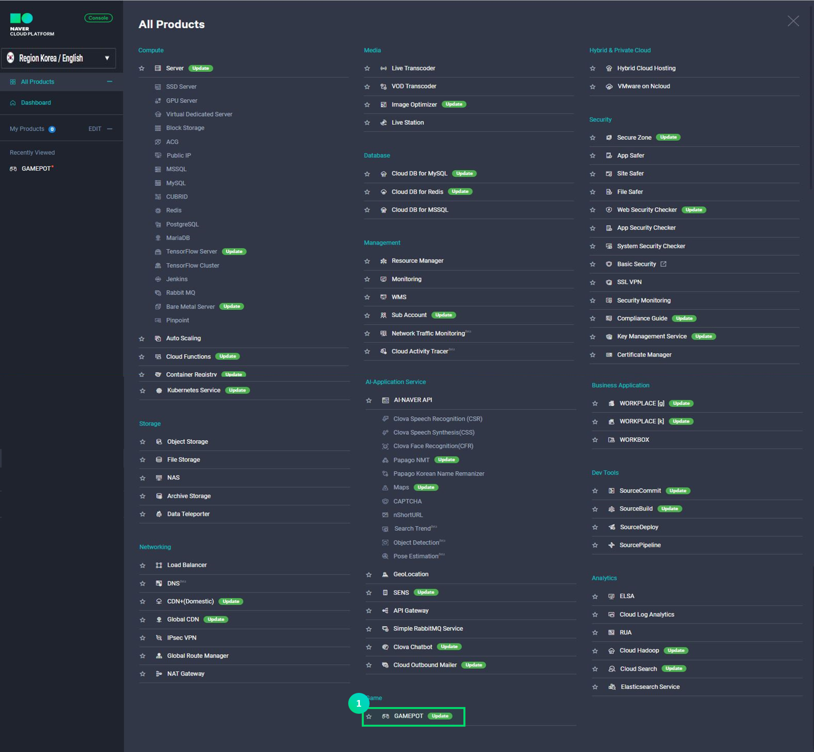
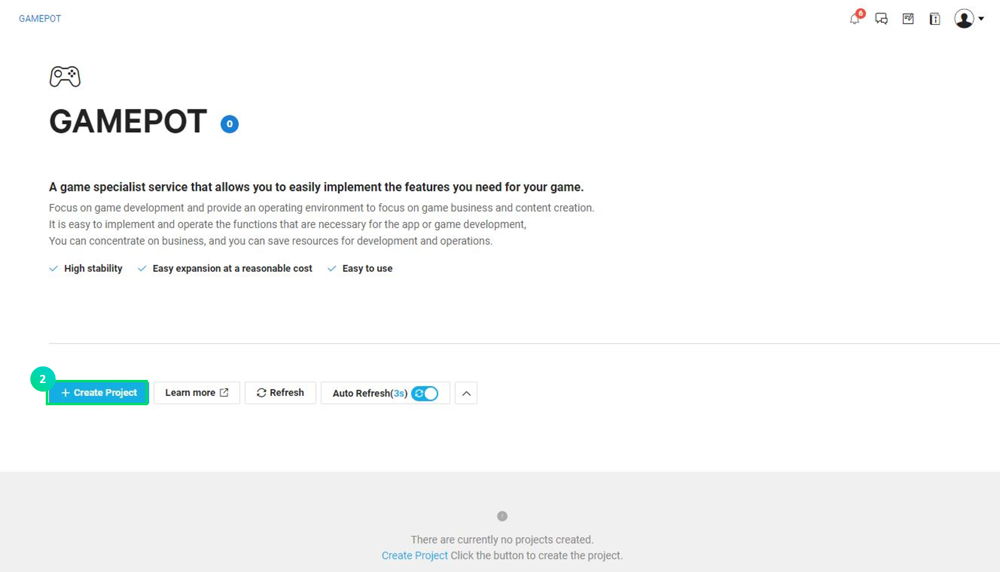
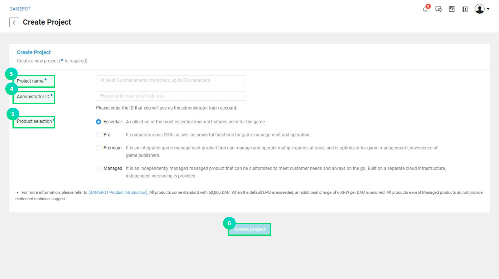
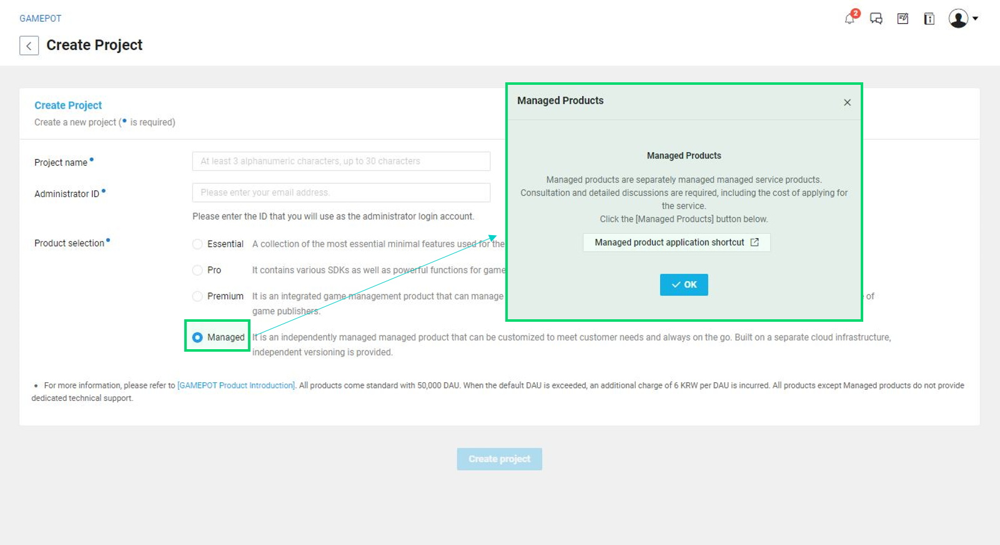
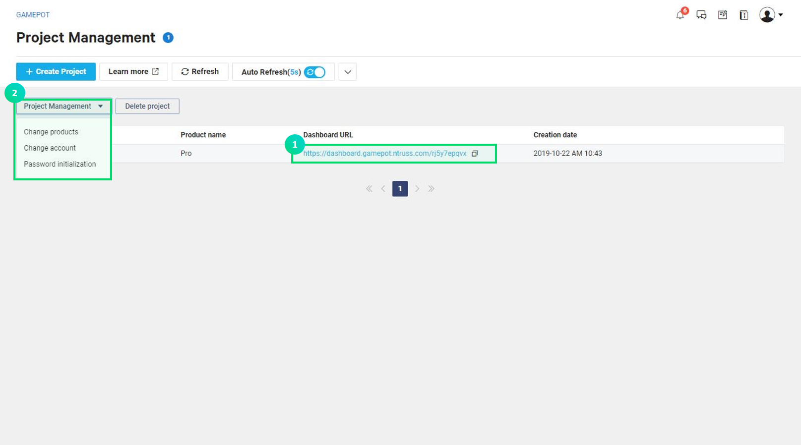
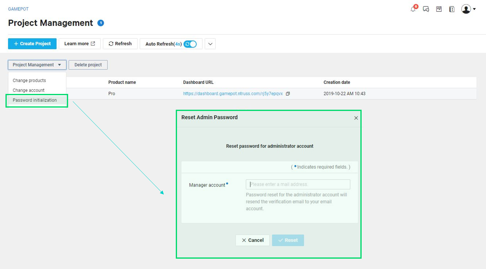

---
search:
  keyword: ['gamepot']
---

#### **We provide the <a href="http://docs.ncloud.com/ko/" target="_blank">[Manual]</a>and <a href="https://apidocs.ncloud.com/ko/" target="_blank">[API Reference]</a>separately to offer more detailed information on how to use the NAVER CLOUD PLATFORM and help maximize the use of the API.**

<a href="https://apidocs.ncloud.com/ko/game/gamepot/" target="_blank">Go to Gamepot API Reference >></a> 
<a href="https://docs.ncloud.com/ko/game/gamepot_console.html" target="_blank">Go to Gamepot Manual >></a>

# Before use

GAMEPOT Platform On the real Time (hereinafter called "GAMEPOT") is a cloud service that helps you easily implement functions required to develop and service games without additional costs. In particular, it is a fully-managed service providing essential functions necessary for developing games as well as common SDK. GAMEPOT eliminates the need to develop operation tools or SDK servers and operate infrastructure so that you can efficiently manage resources.

**GAMEPOT characteristics**

- GAMEPOT provides a variety of functions for game operations.
- GAMEPOT provides a “Dashboard” that helps you conveniently use management and statistics features. Dashboard supports stronger data security as it does not simply rely on accounts to identify customers.
- The dashboard is more secure because customers can directly manage accounts for game operations.
- GAMEPOT can easily be linked with various NAVER CLOUD PLATFORMS. The price of the connected services is also affordable.

**Q. Competitors’ services cost more as games grow. How about GAMEPOT?**

The cost of GAMEPOT does not increase in proportion to the growth of your game. Similar existing services worldwide have an ineffective structure that increases costs as the game becomes more popular, incurring unexpected extra costs. GAMEPOT has a hybrid payment plan that includes a flat rate plan, which includes a base DAU, and a usage-based plan that only incurs excess charges if the base DAU is exceeded. The basic DAU is 50,000 DAU/day, which is never a small amount.

**Q. I’d like to learn about dashboard security.**

When a customer accesses the shared dashboard using their account, leaks of their account information can lead to exposure of all data stored in the dashboard. Although NAVER CLOUD PLATFORM fundamentally prevents information leaks, GAMEPOT provides each and every customer with a different access domain and dashboard system to ensure stronger security.

# How to use GAMEPOT

## Step 1. Create a project

First, you must create a project.

① Click **Game &gt; GAMEPOT** in your console.

② Click **+Create project**.

③ Enter a game project name.

- The name can be between 3 and 30 characters in length.
- Only English alphabet, numbers and '-' are allowed.

④ Enter an admin ID to be used in the dashboard.

- Enter the administrator ID in the form of an email address.
- An ID authentication email is sent to the email address provided.

⑤ Select a service.

- Selecting a Managed service will provide a prompt for a separate service application.

⑥ Click **Create project** to create a project.

- Once you create a project, an hourly fee including the basic DAU is charged. Fees are charged even if you don't use the service after creating a project, so be sure to select your choice carefully.

Once a project is created, a URL to access the dashboard appears. You must complete admin authentication by checking the email address entered by the admin ID.

Once you complete email authentication, you'll be directed to a dashboard pane where you can enter your initial password. Log in after setting your initial password.

## Step 2. Manage a project

When a project is created, the list indicating your game project name and product name is displayed.

① Once you have access to your dashboard, you can manage game features using the dashboard URL.

② Select your project and click **Project Management** to check simple management menus.

- Change products: Change the service product in use. This may temporarily prevent you from accessing your dashboard. When you click **Change products**, the following pop-up window will appear. Select a product to change and click **Edit**.

- Change accounts: You can change the admin ID you entered at the time of creating a project. Once you complete a change request, an authentication email is sent to the email address of the changed account.

- Reset password: Use this menu if you forget your password for the dashboard or need to reset it. After resetting your password, access the dashboard and change the password.

## Step 3. Delete a project

Hourly charges apply as soon as a GAMEPOT project has been created. Therefore, you should delete unnecessary projects to avoid excessive charges.

① Click **Delete project** to delete a project. Once you click **Delete project**, the following pop-up window will appear.

② Enter the name of the project to delete.

③ Click **OK** on the pop-up window shown above and the project will be deleted.
