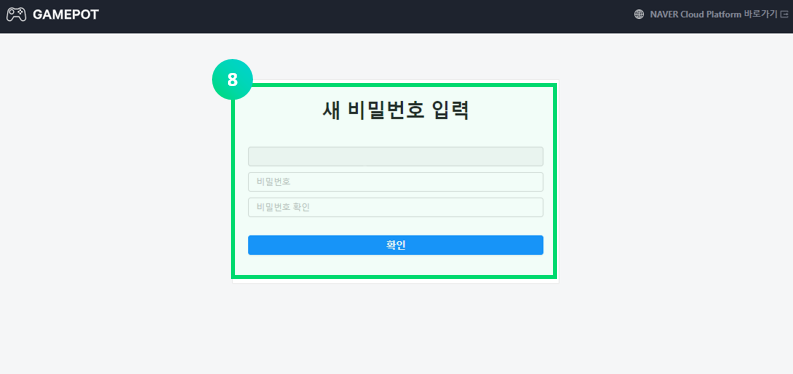
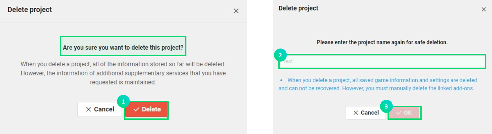

---
search:
  keyword: ['gamepot']
---

> ### This is a machine-translated document that may have errors in vocabulary, syntax, or grammar. We will soon provide you with the document translated by a professional translator.
>
> #### If you have any questions, please [contact us](https://www.ncloud.com/support/question).
>
> We will make every effort to further enhance our services.

## Before use

GAME Platform On the Real Time (hereinafter referred to as GAMEPOT) is a cloud service that enables you to easily implement the functions needed to develop and service games without incurring additional development costs. In particular, it is a fully managed service that allows users to concentrate on game development by providing essential functions and various additional functions required for game operation as well as common SDK. You don't have to develop operational tools or SDK servers and operate your infrastructure, so you can streamline resources.

**Unique features of NAVER CLOUD PLATFORM GAMEPOT**

* It provides various functions which is necessary for game operation. 
* A separate "dashboard" is provided for convenient management and statistics. Dashboards provide high data security because you don't just divide every customer by account. 
* Dashboard access to game operations is more secure because you can manage your own accounts. 
* You can easily link with various product of NAVER CLOUD PLATFORM. In addition, the price of the linked product is reasonable. 

**Q. Competitor's services increase cost as the game grows. What about GAMEPOT?**

GAMEPOT is not a structure that increases costs in proportion to the growth of the game. Existing domestic and foreign similar services have an inefficient structure, in which the cost increases as the game enters the box, resulting in an unexpected additional cost. However, GAMEPOT has a hybrid plan that includes a flat rate plan that includes a base DAU and a pay-as-you-go plan that goes beyond the base DAU. The default DAU is 50,000 DAU / day, which is never small.

**Q. Please describe your dashboard security.**

If you access a common dashboard through a client account, all stored account information may be leaked if the client account information is leaked. The security of NAVER CLOUD PLATFORM prevents the leakage of external information at the origin level, but for added security, all of GAMEPOT's customers are provided with different access domains and dashboard systems to keep their data safer.

## How to use GAMEPOT 

#### Step 1. Create a project

To use the service, you must first create a project.

① In the console, select  **Game > GAMEPOT**.

② Select **+Create project** button.

③ Enter a name for the game project.

- The name can be from 3 to 30 characters long.
- Only letters, numbers, and the '-' sign are allowed.

④ Enter the administrator ID to be used for the dashboard.

- Enter the administrator ID in the form of e-mail.
- Mail required for ID authentication will be delivered to the mail you entered.

⑤ Choose a product

* When you select a Managed product, you will be presented with a pop-up to request a separate service.

⑥ Click the **Create Project** button to complete the project creation.

* When you create a project, you are charged an hourly rate with a default DAU. After creating a project, you will be charged even if you do not use it, so choose carefully.

⑦ Once the project is created, you will see a URL that you can access with the dashboard. You will need to verify the email you entered with your administrator ID to complete administrator verification.

⑧ Once email verification is complete, you will be taken to a dashboard window where you can enter your initial password. Please login after setting the initial password.

#### Step 2. How to manage project

Once the project is created, you will see a list screen with the game project name and product name.

① You can enter the dashboard to manage game features through the dashboard URL.

② Check the project and click the **Project Management** button to display a simple management menu.

* Product change : Change the service product you're using. You may temporarily lose access to the dashboard. Click the **Change product** button to display the following popup. Select the product you want to change and click the **Edit** button.

* Change account : You can change the administrator ID that you entered when creating the project. Once you complete the change request, a verification email will be sent to the email address of the changed account.

* Reset password : This function is used when you lose the dashboard access password or need to reset. After resetting the password, you can reset the password by accessing the dashboard.

#### Step 3. Delete project

GAMEPOT will incur an hourly rate from the time the project is created. Therefore, if you do not need it, you should delete the project to avoid incurring unnecessary charges.

① To delete a project, click **Delete Project** button. Click the **Delete Project** button to display the following popup.

② You must enter a project name to delete it.

③ When the same popup is displayed above, click the **OK** button to finalize the deletion.
