---
search:
  keyword: ['gamepot']
---

#### **We provide the <a href="https://guide.ncloud-docs.com/docs/en/home" target="_blank">[Manual]</a>and <a href="https://api.ncloud-docs.com/docs/en/home" target="_blank">[API Reference]</a>separately to offer more detailed information on how to use the NAVER CLOUD PLATFORM and help maximize the use of the API.**

<a href="https://api.ncloud-docs.com/docs/en/game-gamepot-index" target="_blank">Go to Gamepot API Reference >></a> 
<a href="https://guide.ncloud-docs.com/docs/en/game-gamepotconsole" target="_blank">Go to Gamepot Manual >></a>

# Dashboard

This document describes how to use the dashboard provided by NAVER CLOUD PLATFORM’s GAMEPOT.

## About GAMEPOT dashboard

**Q. What is a dashboard?**

A dashboard helps you run and manage games.

**Q. What kind of features does the dashboard provide?**

It provides statistical data regarding member access and payment, and works with NAVER CLOUD PLATFORM’s other services to enable you to control various features including Push, SMS, and log analysis. It also provides operation features required for games, such as coupons and updates, allowing you to manage games more effectively.

## Get started with GAMEPOT dashboard

### Login

#### Step 1. Access dashboard

Click the dashboard URL in NAVER CLOUD PLATFORM’s console to access the dashboard.

#### Step 2. Sign up

An email to reset the password is sent to the admin account registered at the time of creating a project.

#### Step 3. Login

The admin account becomes a master account that includes all permissions for dashboard management.

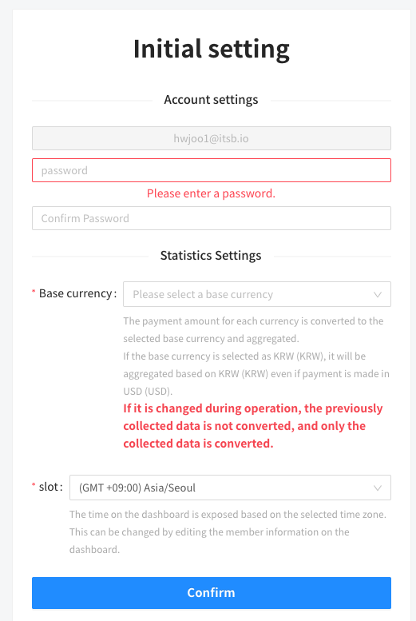

① Set the password to be used in the admin account.

② Select a reference currency of the dashboard. The selected currency is used for sales indices, payment statistics, etc. <i>Previous data does not change even if the reference currency is changed during the operation, so make a careful choice.</i>

③ Select a time zone for the dashboard.

## How to use dashboard menus

### Dashboard

The dashboard helps you view the overall operation status of your games, including signup status, sales, access and statistics at a glance.

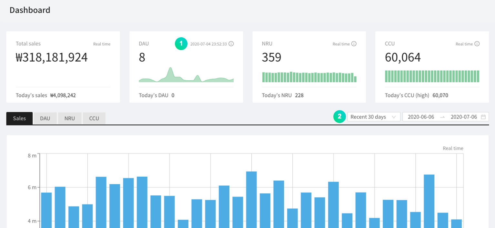

① Check a graph for a date.

## Statistics

### User Indicators

Displays a graph of various user indicators for a specified period.

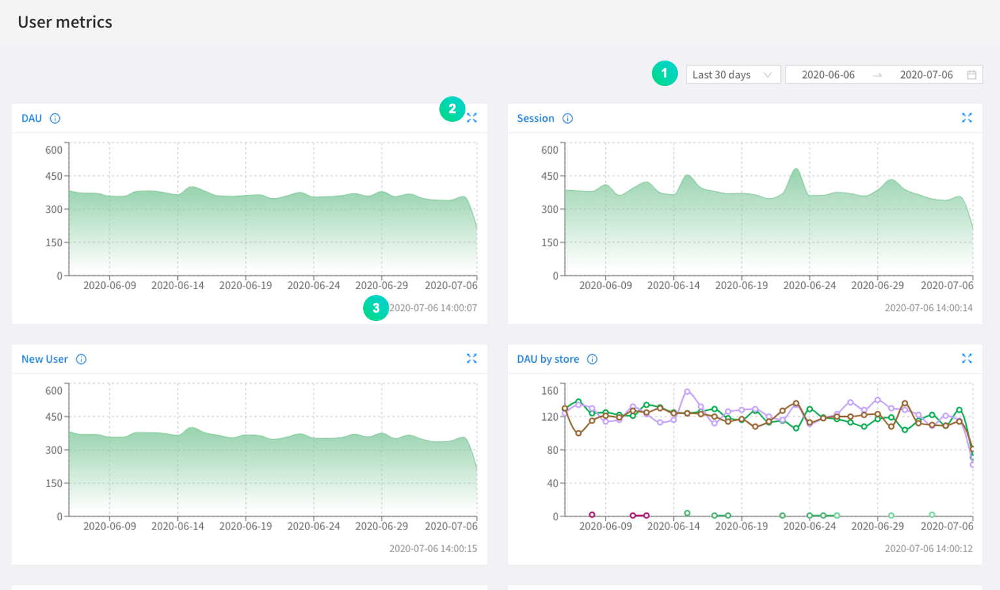

① Displays user indicators for the last 30 days by default, and also allows you to specify a period during which you want to view user indicators.

② View details by zooming in to each graph.

③ Check the last updated time.

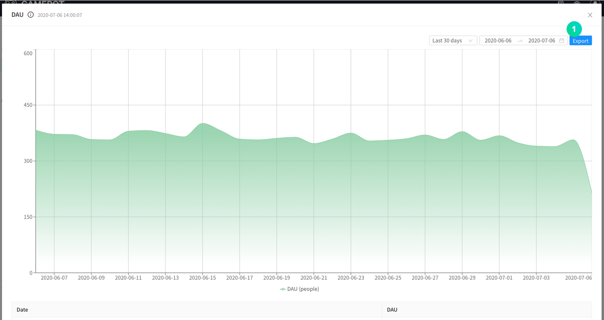

① Download RAW data of current graph as a CSV file.

#### Retention

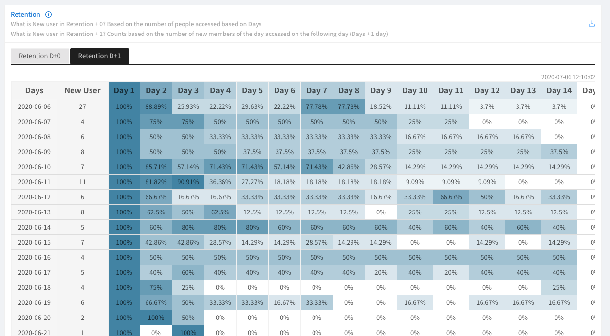

Check the retention data. [Retention D+0] is displayed on indicators from the date of sign-up. [Retention D+1] will be displayed to members the day after the subscription date.

### Sales index

Displays a graph of various sales indices for a specified period.

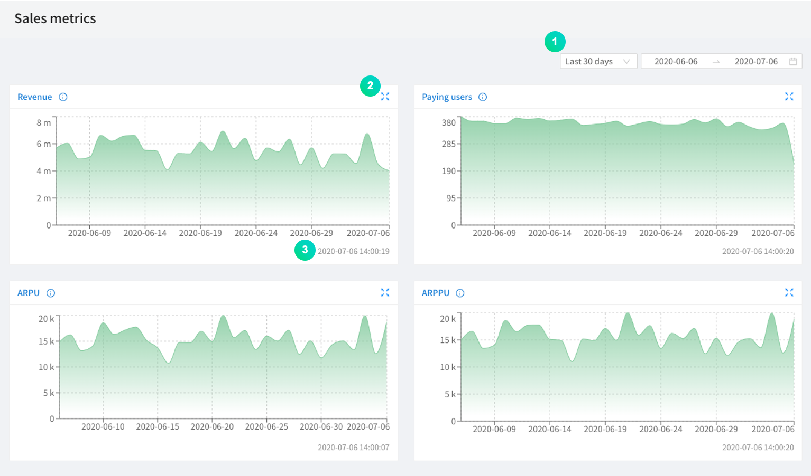

① Displays sales indices for the last 30 days by default, and also allows you to specify a period during which you want to view sales indices.

② View details by zooming in to each graph.

③ Check the last updated time.

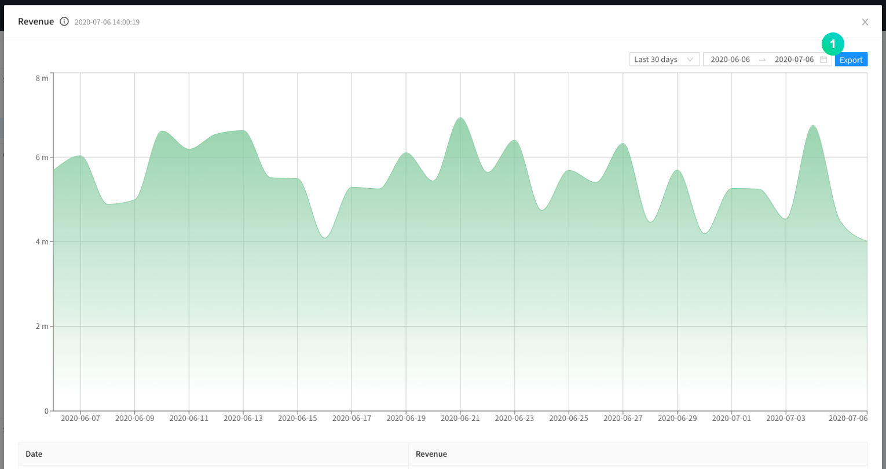

① Download RAW data of current graph as a CSV file.

## Operate

### Member

#### - List

Displays the list of members who signed up.

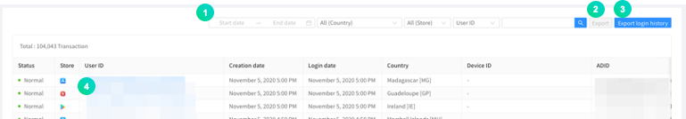

① Members can be viewed by specifying sign-up date, country, store, user ID, device ID, ADID, IP, etc.

② The members' list can be downloaded in CSV file format.

③ Members' login history, up to 90 days, can be downloaded in CSV file format.

④ The page displaying the details of a member is displayed in the figure below.

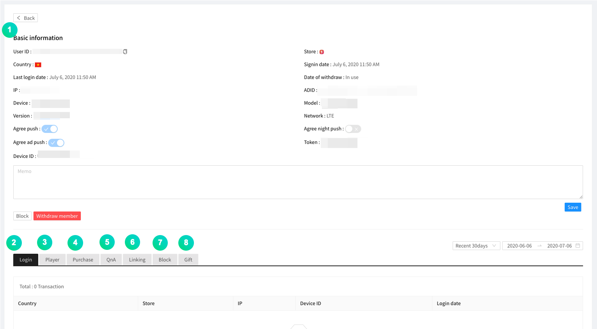

① Displays the basic information of the member.

② Displays access\(login\) information of the member.

③ Displays your information such as player ID, level.

④ Displays payment details of the member.

⑤ Displays questions and answers of the member.

⑥ Displays connected social media accounts of the member.

- Connect or disconnect social media accounts.

⑦ Display blocking details of the member.

⑧ Displays details of the provided items.

Click **Send individual push** to send push messages to certain members.

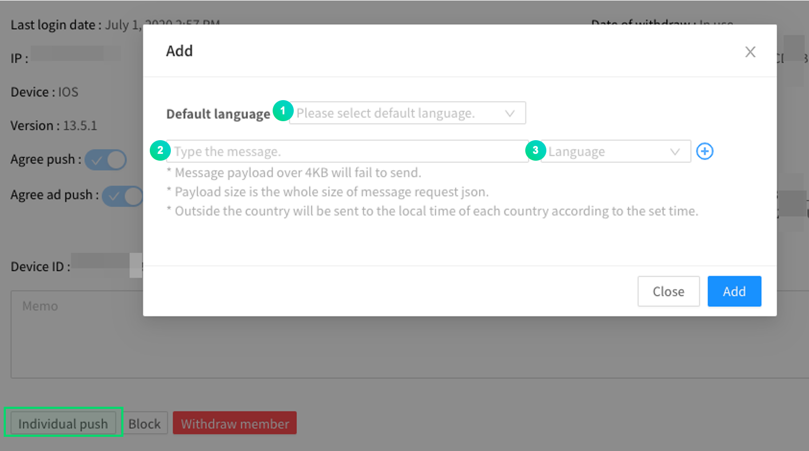

① Specify a default language of push messages to be sent.

② Enter a message to send.

③ Select a language to send.

⑤ Click **Block** to block certain members.

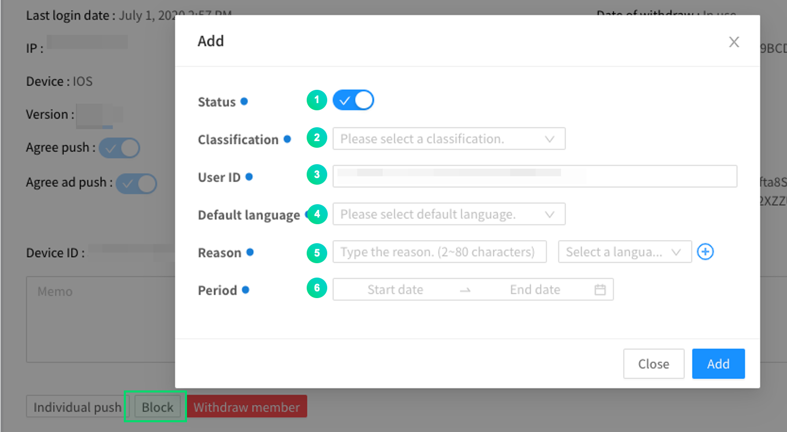

① Select a blocking status.

② Select a blocking category registered.

③ Specified user ID is entered.

④ Select a default language to display a reason for blocking.

⑤ Enter the reason for blocking and specify a language.

⑥ Specify the blocking period.

Click **Delete member** to delete certain members.

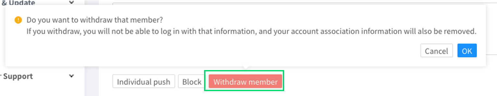

#### - DAU

Displays a graph of daily active users (DAUs) for a specified period.

Displays DAUs for the last 30 days by default and allows you to specify a period during which you want to view daily DAUs.

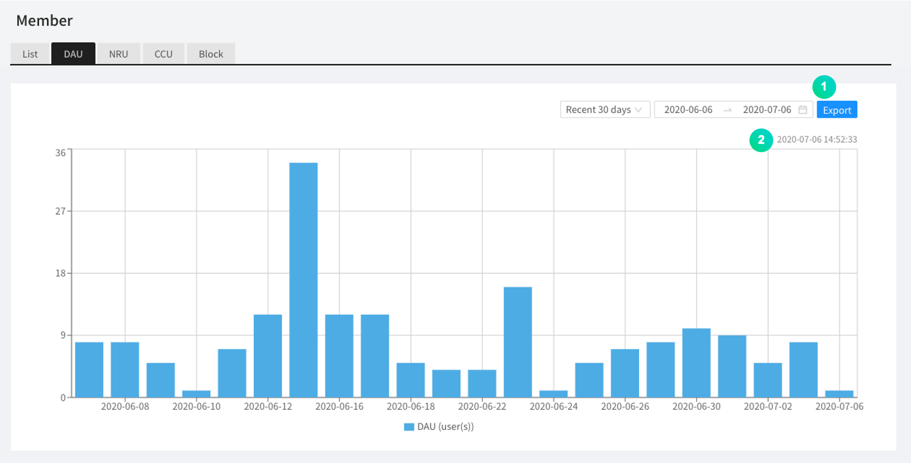

① Download RAW data of current graph as a CSV file.

② Check the last updated time.

#### - New user

Displays a graph of daily new users who joined your game for a specified period.

Displays daily new users for the last 30 days by default, and also allows you to specify a period during which you want to view daily new users.

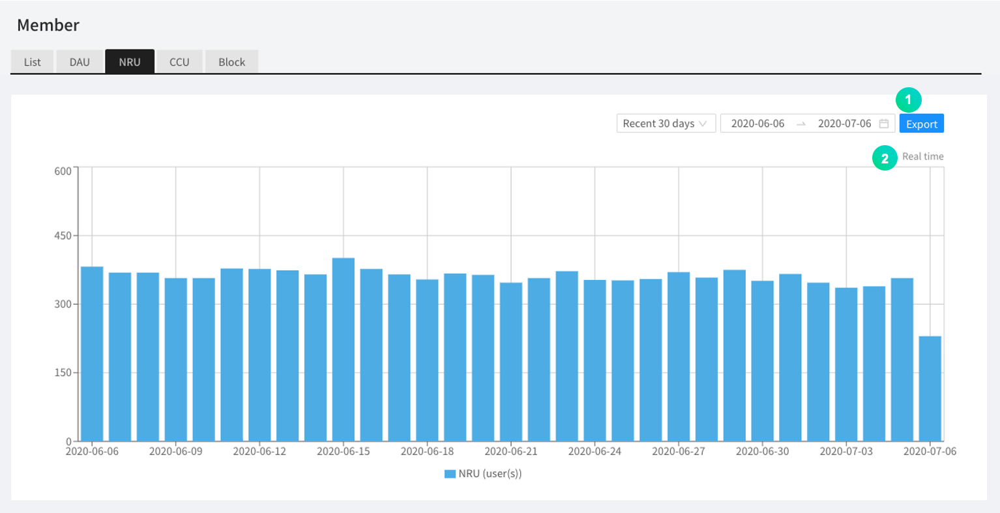

① Download RAW data of current graph as a CSV file.

② Check the last updated time.

#### - CCU

Displays the number of concurrent users (CCUs) who accessed your game, in minutes for up to 3 days.

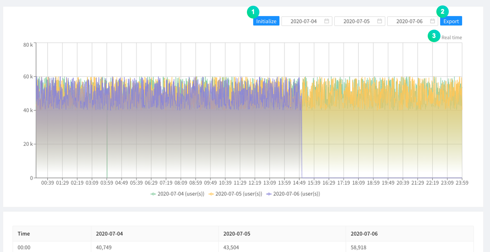

① The period is specified as the last three days, today, yesterday, and the day before yesterday, by default, and you can select \(change\) the period as needed. Click **Initialize** to return to the default period.

② Download RAW data of the current graph as a CSV file.

③ Check the last updated time.

#### - Block

Block a member from accessing your game for a specified period.

This feature works based on a user ID.

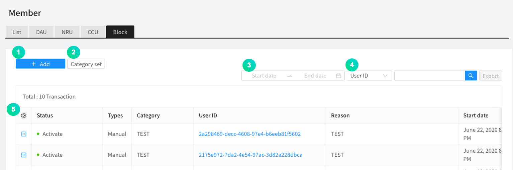

① Click Add to block a user.

② Set blocking categories to register response message templates.

③ Specify the period for which you want to view the block history. The search result will be displayed by the starting date of the blocked period

④ Specify a user ID you want to view blocking details of.

⑤ Displays the details of blocked users.

- Enabled: The blocking is enabled.
- Disabled: The blocking is disabled.

### Payment

#### - List

Check payments attempted in Google Play Store, App Store, ONE Store, and Galaxy Store.

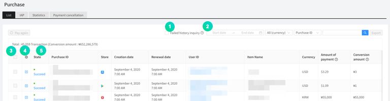

① Select multiple checkboxes for failed payments, then click Provide Again button to give them again.

② The history of canceled or failed payments is only viewed.

③ Select time period, store, currency, payment ID, or user ID to view the payment list.

④ The payment list can be downloaded in CSV file format.

⑤ Successful payments can be canceled. The canceled payments are excluded from the sales statistics.

⑥ View whether or not a payment attempt made by a user was successful. Items can be provided again for failed payment attempts.

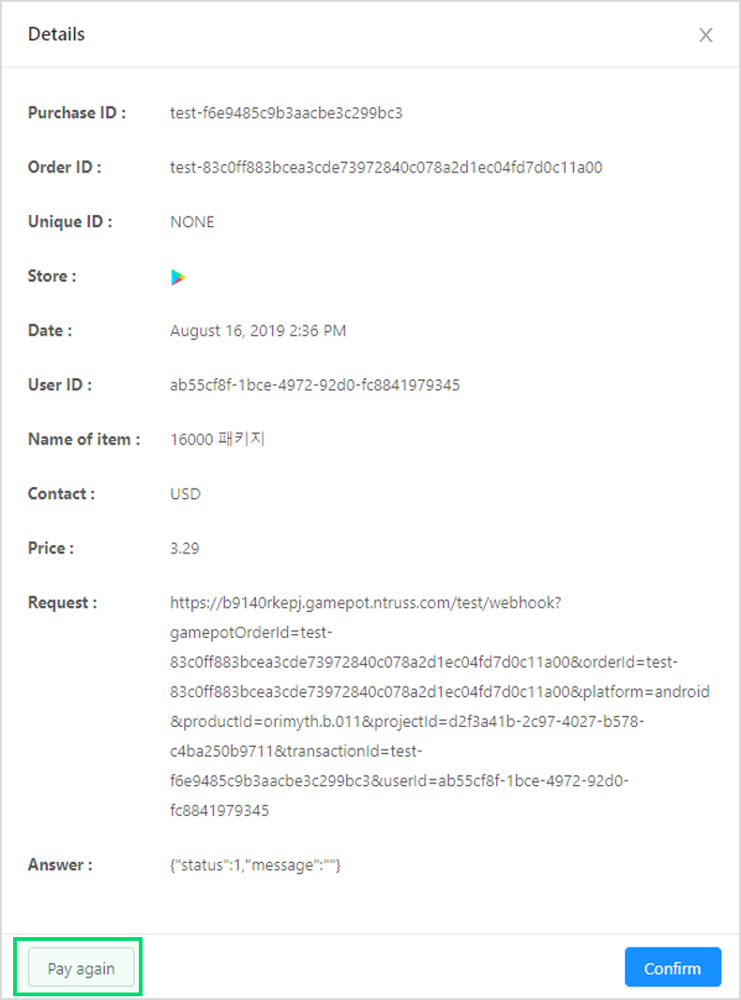

Click the payment status to check the payment details. For failed payments, click Provide again to give items again.

#### - IAP

Manages product information when an in-app purchase is made. You must add all products from Google Play, App Store, ONE Store, and Galaxy Store.

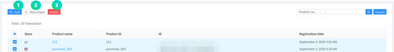

① Click **Add in-app item** and enter a store, product name and product ID to create a paid item.

② Click **Mass input** to add multiple in-app items as a CSV file.

③ Select multiple checkboxes for product items and click **Delete** button to delete.

#### - Statistics

Provides a graph displaying payments on a daily basis.

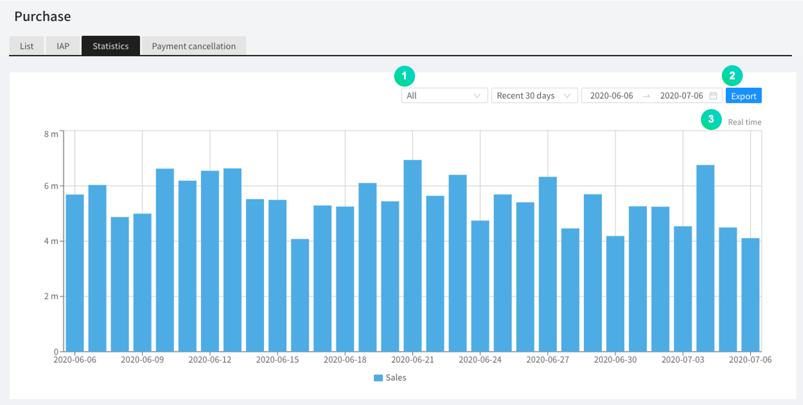

① Specify the store where you want to view payment data.

② Download RAW data of the current graph as a CSV file.

③ Check the last updated time.

#### - Cancel a payment

① You can block a member's access to your game who arbitrarily cancels his/her payment by comparing the payment receipt status in the store. The member will be unblocked when he/she makes a payment for the item again. Supports receipt verification from Google Play Store and the Apple App Store.

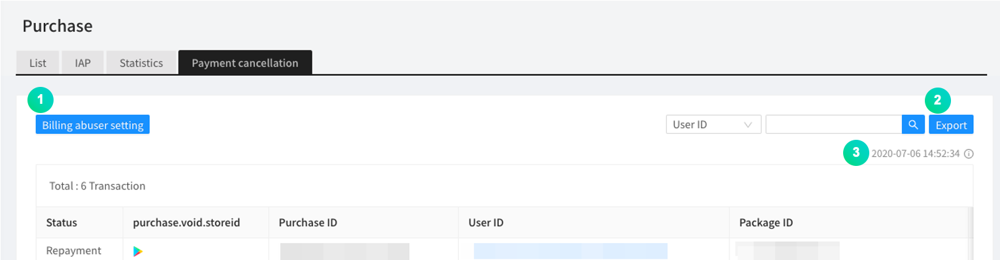

① Set the blocking conditions for users who cancel payments.

② Select status, store, user ID, or package ID to view the canceled payment list.

③ The canceled payment list can be downloaded in CSV file format.

④ Check the last updated time.

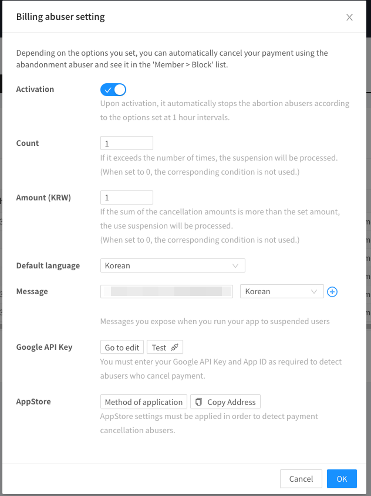

① Set whether you'd like to block members who arbitrarily cancel payments. When it is enabled, those who meet the following conditions will be automatically blocked on an hourly basis.

② Blocks members who canceled Google payments more times than specified.

③ Blocks members who canceled Google payments if the amount is greater than specified.

④ Select a default language for a message that is displayed when a blocked member attempts to access the game.

⑤ A message that is displayed when a blocked member attempts to access the game.

⑥ A Google API key must be entered to see the list of canceled Google payments. Click Test to check if the functions are working properly.

⑦ Click Copy address to copy a URL and paste it in the App Store to access the payment cancel list from App Store.

### Notices

Notice images registered in the dashboard appear for users who are logged in to your game. Specify the store and the period during which those images will be displayed.

To use this feature, you need NAVER CLOUD PLATFORM’s API authentication key and Object Storage. Note that when using the announcement function, the Object Storage cost is incurred separately.

#### Step 0. Create a sub account to grant permission to use Object Storage services

① It is recommended that you create a sub account and get the account key before issuing API authentication keys or granting permission to use Object Storage.

② Create a sub account by referring to [Sub Account User Guide](https://docs.ncloud.com/ko/management/management-4-1.html). (Check **API Gateway Access** when you create a sub account.)

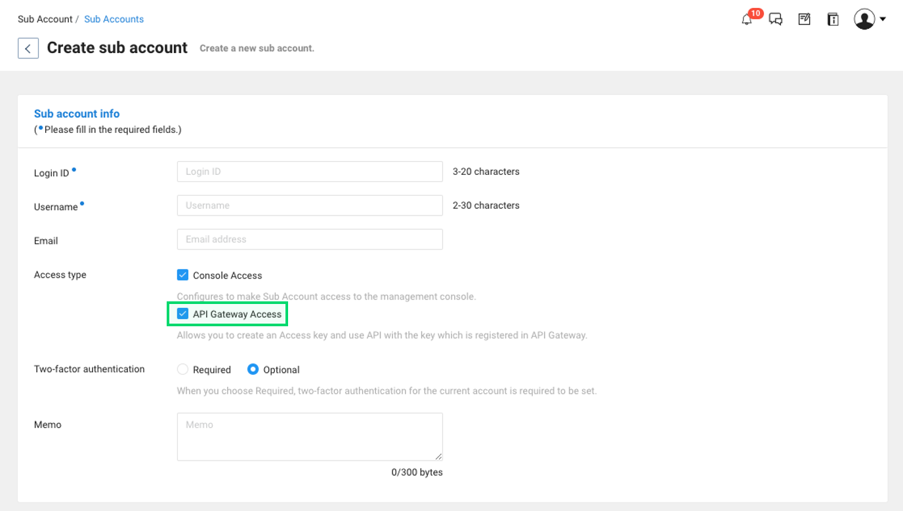

③ Grant permission to use Object Storage services in the created sub account. Refer to [System Managed Policy Manual](https://docs.ncloud.com/ko/management/management-4-2.html) to grant permission as **NCP_OBJECT_STORAGE_MANAGER** to the sub account. (Or permission including Object Storage)

③ Access with the sub account created and get an API authentication key.

#### Step 1. Prepare an API authentication key

Notice menus work with Object Storage by using APIs. Therefore, you must get an API authentication key from the NAVER CLOUD PLATFORM.

Go to **My Page &gt; Manage Account &gt; Manage Auth Key** in the portal to create an API authentication key.

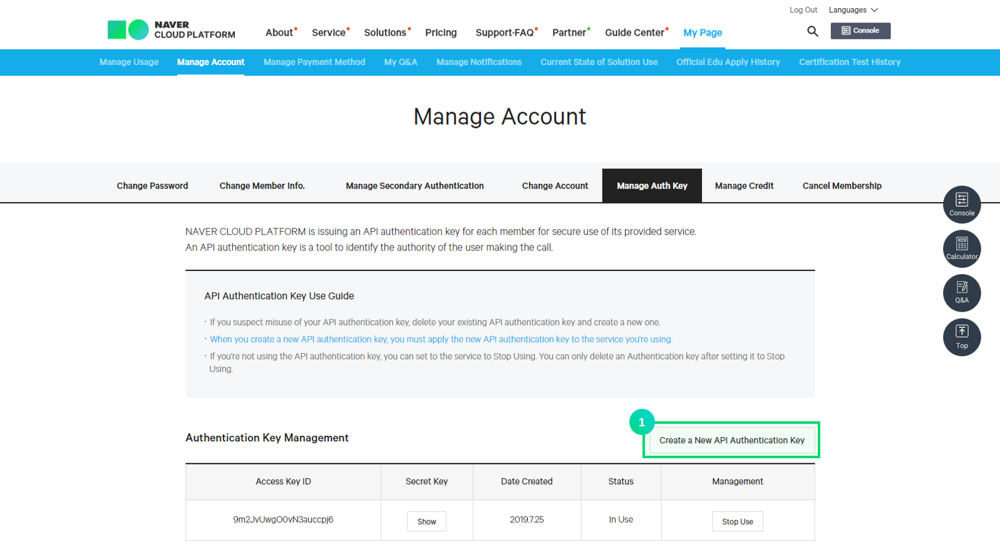

① Click **Create a New API Authentication Key**.

- An account can have a maximum of two API authentication keys.

#### Step 2. Connect dashboard with API auth key

You must connect your API authentication key with the dashboard to create a bucket in Object Storage and use dashboard features. Go to **Project settings &gt; Ncloud** in the dashboard and connect your API authentication key.

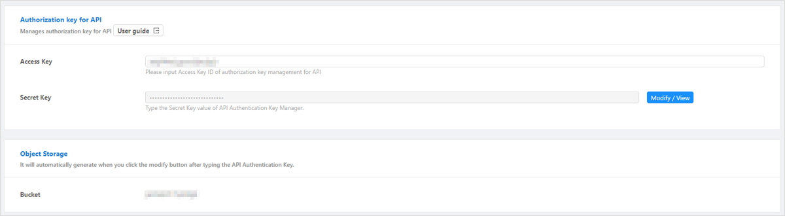

Once your API authentication key is connected, a bucket in Object Storage is automatically created. All the notice images are stored in the bucket.

#### Step 3. Add a notice

공지사항을 추가하기 위해서 **공지사항** 메뉴로 이동합니다.

화살표 버튼을 이용하여 사용자에게 노출할 이미지 순서를 지정할 수 있습니다.

**공지사항 추가** 버튼을 통해 이미지를 추가할 수 있습니다.

이후 팝업 메뉴가 나타나면 원하는 값을 입력하고 **저장** 버튼을 클릭하면 공지가 추가됩니다.

선택한 스토어의 분류에 따라 모든 스토어의 해당 앱에 공지사항이 노출되거나, 특정 스토어를 통하여 게임을 접속한 사용자에게만 공지사항이 노출될 수 있도록 지정할 수 있습니다.

분류가 지정된 이미지는, 해당 분류 값으로 호출할 때에만 이미지가 노출됩니다.

국가를 지정하면 해당 국가에 해당하는 디바이스에 대해서만 이미지가 노출됩니다.

노출된 공지사항 이미지를 사용자가 터치할 경우 클릭액션 타입에 의해 URL은 외부 브라우저로 이동하며, SCHEME은 callback 함수로 값을 리턴합니다.

언어 설정 별로, 노출 될 이미지를 추가 등록 할 수 있습니다.

### Check and update

It allows you to easily check and update your game.

#### - Check

During the game check period, this feature automatically displays check messages and prevents users from accessing your game.

Enter the check period and message and click Save, then the check notice will be displayed in the game.

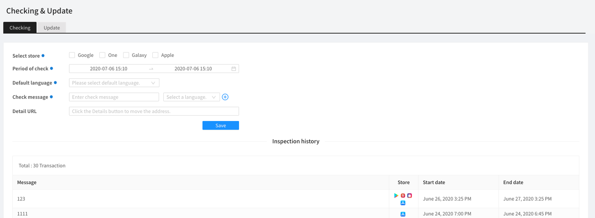

① Select a store. Select all if all of them must be inspected.

② Specify the period during which checks will be performed.

③ Specify a default language among check messages displayed for the device's language setting.

④ Register additional images displayed for each language setting.

⑤ Enter the URL to be redirected when users click View more of the check.

**e.g. Notice of a cafe or self-created check information page**

#### - Update

If a user’s game is not up-to-date, this feature displays updated information and redirects the user to the game’s update page in Google Play or Apple Store.

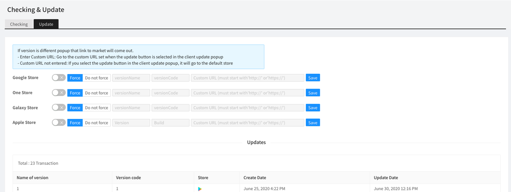

① Set by store.

② Select whether to enable the feature.

③ If you select **Forced**, users cannot play the game until they update the game in the store. If you select **Recommended**, they can play the game without updating in the store.

④ Enter version information. The feature works if the version is lower or different from the one entered.

⑤ Enter a URL to move when Update is selected.

- Enter custom URL: Move to a custom URL set when selecting Update from the client update pop-up
- Don't enter custom URL: Move to a default store set when selecting Update from the client update pop-up

### Message

This service helps you implement notification features by using SMS and Push, without a message server. To do so, you must sign up for NAVER CLOUD PLATFORM’s Simple & Easy Notification Service \(SENS\).

① It is recommended to create a sub account and request the SENS service. Refer to **Notice -&gt; Step 0** in the body to make a sub account. (Like **Step 0**, get an API authentication key from a sub account.)

② Grant permission to use SENS services to the sub account created. Refer to [System Managed Policy Manual](https://docs.ncloud.com/ko/management/management-4-2.html) to grant permission (including) **NCP_SENS_MANAGER** to the sub account.

① For using SENS, you must get a service key. Click **Get service key**, access with the sub account created, and get a service key by referring to [SENS Common Guide](https://docs.ncloud.com/ko/sens/sens-1-2.html).

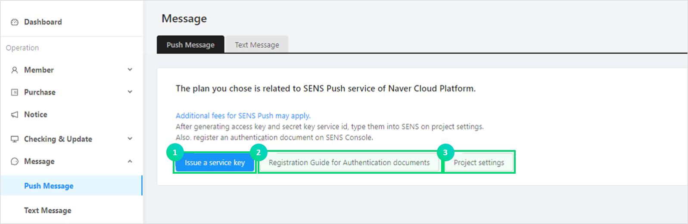

② Click **Certificate registration guide** and add a certificate by referring to **SENS Web Console Guide**.

③ Click **Settings** to go to the following window and enter the Push service ID.

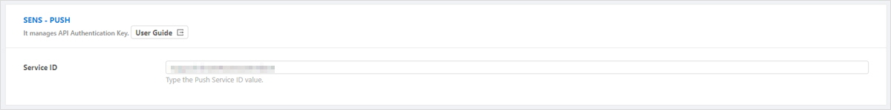

#### - Push message

Click **Message &gt; Push message** to view information including sending status, scheduled date and time and sent date and time.

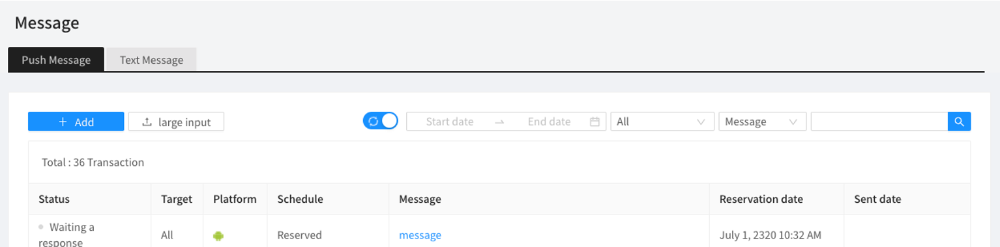

Click **Add message** from **Push message**, and the following pop-up window appears. On this pop-up window, you can send messages.

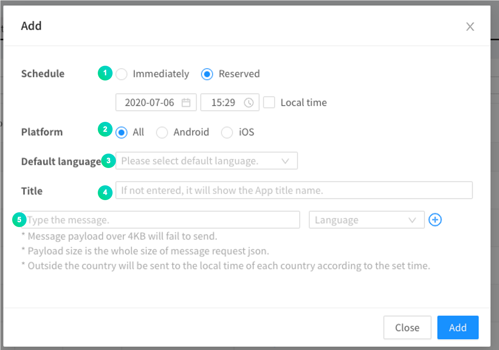

① Specify a schedule for sending push messages. \(Send immediately / Send as scheduled / Send as scheduled \(Global local time\)\)

② Select a platform so that you can send the push message only to the specified users.

③ Specify a default language among check messages sent for the device's language setting.

④ Enter a title as needed. The title will be the app's name if nothing is entered.

⑤ Add different push messages to the device's language setting.

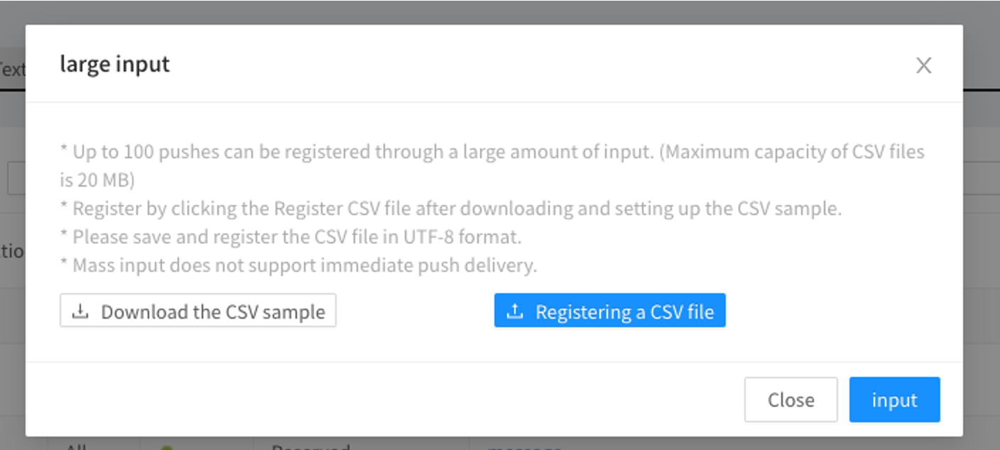

Send bulk push messages by uploading csv files.

- Set up to 100 pushes with bulk add. (Max capacity for csv files: 20 MB)
- Download csv samples, set, and click Register CSV file to register them.
- Register csv files by saving them as UTF-8 format.
- Bulk add does not support sending pushes immediately.

#### - Text message

It helps you send SMS/LMS messages and view history and results. To send SMS/LMS messages, you must first get a service key and register a caller ID in SENS.

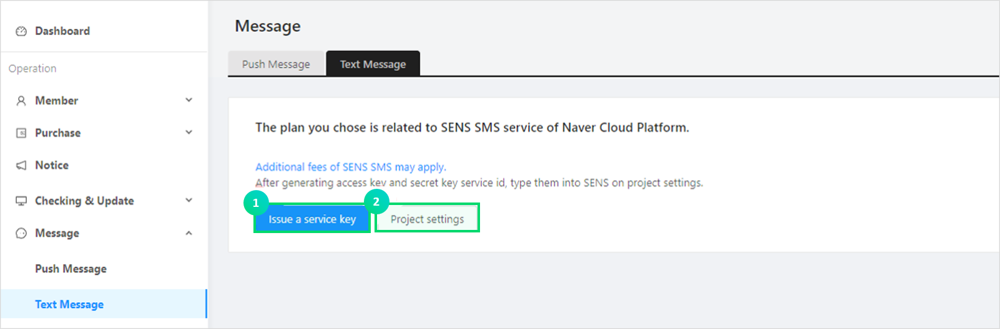

① For using SENS, you must get a service key and register a caller ID. Click **Get service key**, and get a service key and register a caller ID by referring to [SENS Common Guide](https://docs.ncloud.com/ko/sens/sens-1-1.html) and [How to Use SENS SMS](https://docs.ncloud.com/ko/sens/sens-1-3.html).

② Click **Settings**, and enter the service ID and secret key.

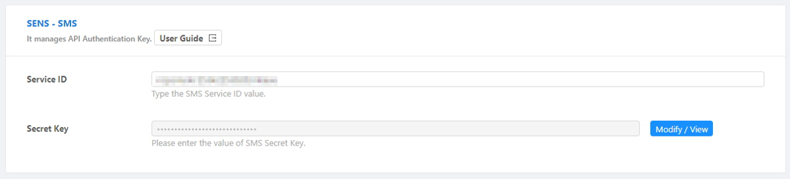

Click **Add message**. Then, the following pop-up window appears.

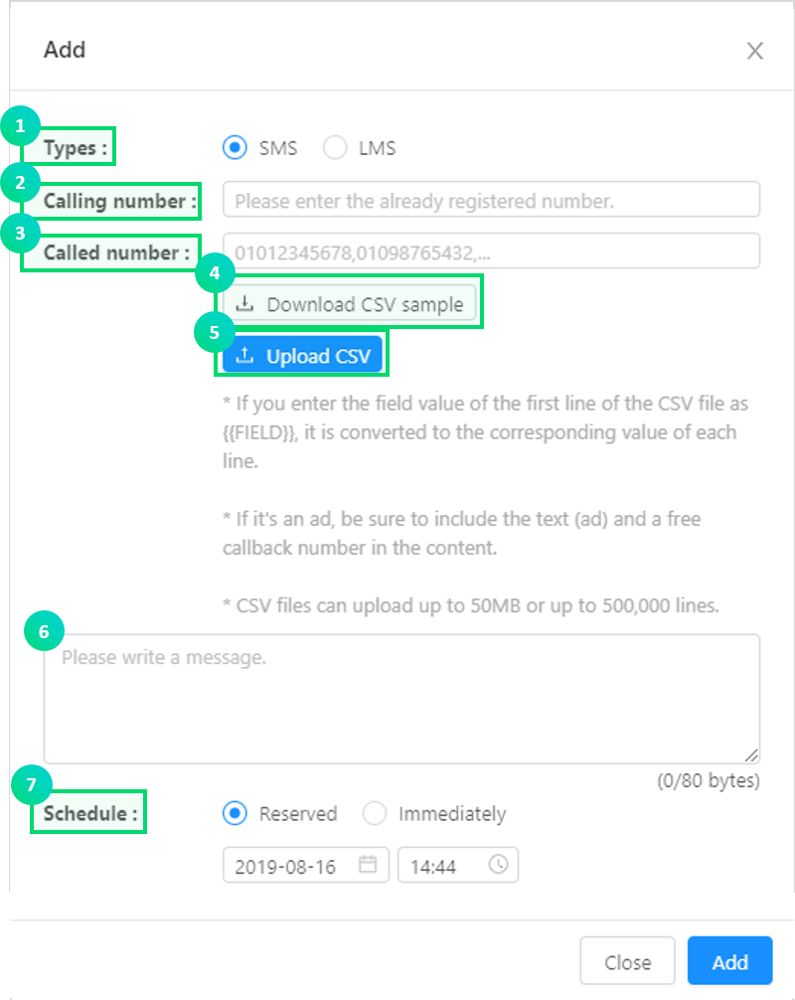

① Select between SMS and LMS. Charges differ depending on the message type.

② Enter the calling number registered in the console.\(Messages will not be sent if the calling number is not registered.\)

③ Enter a called number.

④ Download a sample file to bulk add called numbers and random coupon numbers as a CSV file.

⑤ Upload a CSV file to bulk add called numbers and random coupon numbers. The uploaded called numbers and random coupon numbers are automatically added to send messages specified in ⑥.

⑥ Enter a message to send as an SMS or LMS.

⑦ Schedule a time at which the message will be sent.

### Coupon

Coupons are an essential element in games. Two types of coupons are supported: common and keyword.

#### - Common coupon

일반 쿠폰은 일반적인 코드 형태로 되어 있는 쿠폰입니다.

게임 내에서 사용될 쿠폰을 쉽게 생성 및 관리 하실 수 있는 기능입니다.

리스트 앞 쪽의 아이콘을 클릭하면 쿠폰 수량을 추가하거나 사용 통계를 확인할 수 있습니다.

**+쿠폰생성**을 클릭하면 쿠폰을 생성할 수 있습니다.

Prefix\(접두사\), Suffix\(접미사\)를 지정한 경우 쿠폰번호 생성 시 지정된 문구가 붙습니다.

쿠폰 수량은 최대 10만개 생성 가능하며, 생성 후에 증가시킬 수 있습니다. 최대 쿠폰 수는 50만개 입니다.

제목과 내용을 입력하면 인게임에서 쿠폰 제목과 쿠폰 내용을 보여줄 수 있습니다.

쿠폰 사용 시 지급되는 아이템과 아이템의 수량을 지정할 수 있습니다. + 버튼을 통해 복수의 아이템을 지급할 수 있습니다.

#### - Keyword coupon

This feature allows you to create keywords such as “Christmas”, “open event”, and “new year”, and provide items when users enter such keywords in the coupon window. Recently, keyword coupons are much preferred over common coupons as it is difficult to enter a coupon code.

Click **+Create coupon**.

기간과 쿠폰을 지급할 키워드를 입력해야 합니다.

제한 수량을 초과하지 않고 지급이 가능합니다.

제목과 내용을 입력하면 인게임에서 쿠폰 제목과 쿠폰 내용을 보여줄 수 있습니다.

쿠폰 사용 시 지급되는 아이템과 아이템의 수량을 지정할 수 있습니다. + 버튼을 통해 복수의 아이템을 지급할 수 있습니다.

#### - Usage history

전체 발급된 쿠폰 번호를 기간, 쿠폰 번호, 사용자 ID 등으로 조회하실 수 있습니다.

[실패 이력 조회] 버튼을 체크하면 실패한 이력만 조회할 수 있습니다.

### Customer Support

Enables you to answer questions asked by users. If there is a customer support menu in your game where users can enter their basic information, you can view the information in GAMEPOT.

#### - Inquiries

고객이 문의한 내역을 확인하실 수 있습니다.

고객문의 페이지에서 해당 회원에 대한 모든 정보를 확인할 수 있습니다.

번역 기능으로 문의 내용, 답변 내용의 언어를 감자히거나 원하는 언어로 번역할 수 있습니다.

> 고객문의 번역 기능은 프로젝트 설정>NCloud>Papago 값을 설정해야 노출됩니다. 기본 번역 언어, 자동 언어 감지, 자동 번역 기능은 회원 정보 수정에서 설정할 수 있습니다.

각 문의에 담당자를 지정할 수 있습니다. 담당자를 지정하면 해당 담당자 외 다른 사용자는 문의에 답변할 수 없습니다.

답변 템플릿을 선택하여 자주 쓰는 답변 내용을 불러올 수 있습니다.

답변에 필요한 이미지 및 동영상 파일을 업로드할 수 있습니다.

답변 만족도는 문의 종료 후 고객이 만족도를 선택해야 노출됩니다.

**\[알림 및 문의 설정\]**

문의 답변 시 고객에게 푸시, 메일을 발송을 설정하거나 문의 설정을 하는 기능입니다.

##### 푸시 설정

디바이스 언어 설정에 따른 푸시 알림 기능을 설정합니다.

##### 메일 설정

발신 메일 설정을 언어별로 입력합니다.

메일 발송 기능을 사용하려면 발신 메일 주소, 발신 메일 이름을 필수로 입력해야 합니다.

메일 내용을 입력하지 않으면 기본 메시지가 발송됩니다.

**발신 메일 미리보기** 버튼을 클릭하여 발송될 메일 템플릿을 확인할 수 있습니다.

##### 고객문의 설정

문의 시 수집 항목 노출 여부를 선택합니다.

활성화한 항목은 고객 문의 UI에 입력 항목이 표시됩니다.

**\[Set category\]**

Presets a template for inquiries.

Click **Set category.**

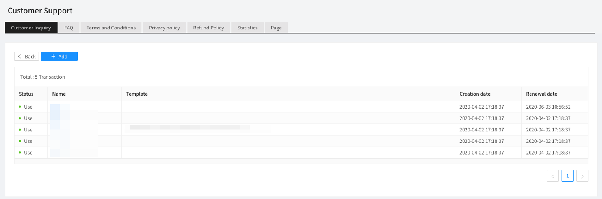

**분류 추가**를 통해, 고객문의에 대한 분류명을 추가하고 관리할 수 있습니다.

디바이스 언어설정에 따라 다른 분류명과 템플릿을 지정해 놓을 수 있습니다.

이벤트 약관을 설정하면 SDK에서 해당 분류를 선택했을때 약관창이 노출됩니다.

**\[Web inquiry address\]**

It enables users to register web inquiries without logging in. Answers are sent via email.

Click **Web inquiry address** to save the external inquiry's URL in the clipboard.

**\[Reply Template Settings\]**

You can set up your own inquiry reply templates.

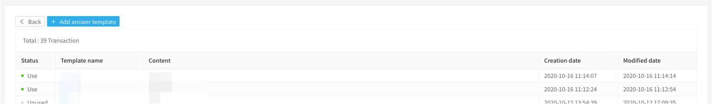

Click **Add reply template**.

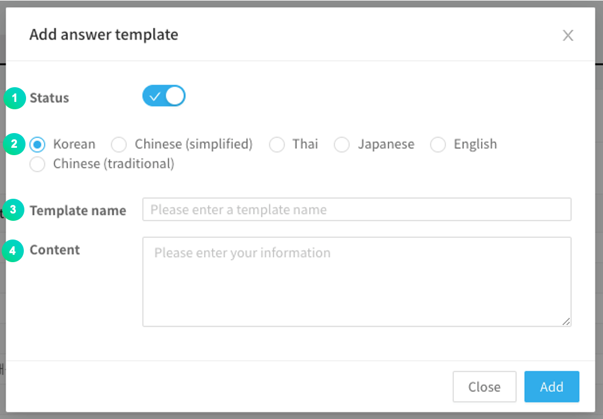

① Select whether to use a reply template.

② Select a template language. Only the languages used in the project can be selected.

③ Enter a template name for the selected language.

④ Enter template content for the selected language.

#### - FAQ

Register and check FAQs.

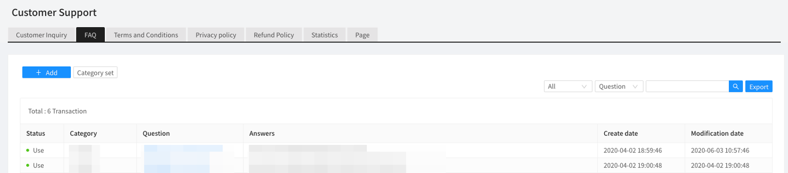

Click **Add**.

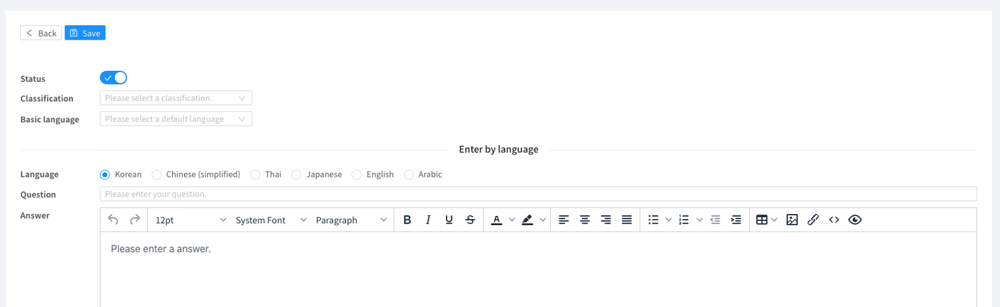

① Check the status to enable the inquiry.

② Select the FAQ's category.

③ Specify a default language among FAQs displayed differently for the device's language setting.

④ Register different questions and answers for the device's language setting.

⑤ Enter a question and a corresponding answer.

**\[Set category\]**

It categorizes FAQs.

Click **Set category.**

**Set category** enables you to add and manage categories for inquiries..

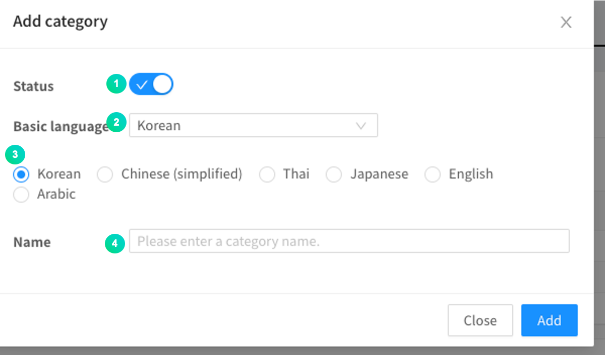

① Check the status to activate the category.

② Specify a default language among FAQ categories displayed differently for the device's language setting.

③ Add different FAQ categories for the device's language setting.

④ Enter a category for the specified language.

**\[Web access address\]**

Enables users to view the FAQ on the web without logging in.

#### - Set terms of service

Enter the contents of internal terms of service. Users can view this via SDK.

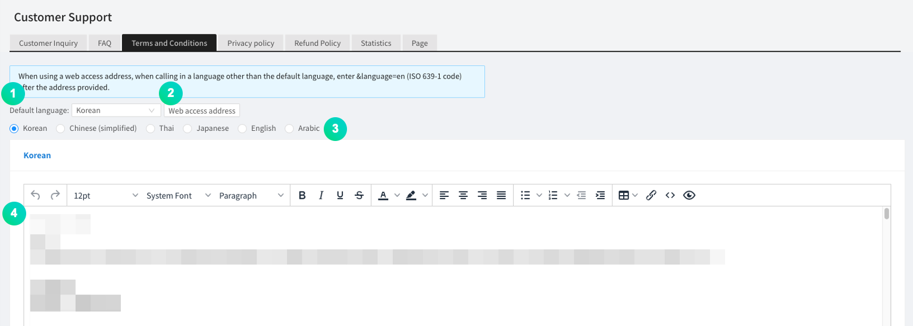

① Specify a default language among the contents of terms of service displayed differently for the device's language setting.

② Check the terms of service from a webpage. Click to copy the URL. Add <b><i>&language=ko</i> (refer to ISO 639-1 codes)</b> after the URL to access in a different language.

③ Enter different contents of terms of service for the device's language setting.

④ Enter the contents of the terms of service for the specified language.

#### - Set terms and conditions of the privacy policy

Enter the contents of internal terms and conditions of the privacy policy. Users can view this via SDK.

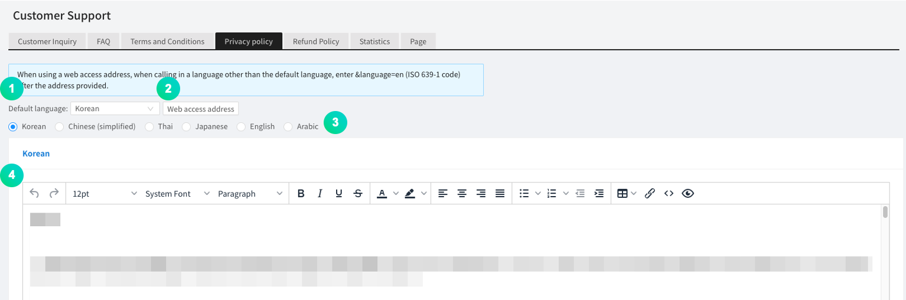

① Specify a default language among the contents of terms and conditions of the privacy policy displayed differently for the device's language setting.

② Check the terms and conditions of the privacy policy from a webpage. Click to copy the URL. Add <b><i>&language=ko</i> (refer to ISO 639-1 codes)</b> after the URL to access in a different language.

③ Enter different contents of terms and conditions of the privacy policy for the device's language setting.

④ Enter the contents of the terms and conditions of the privacy policy for the specified language.

#### - Set refund policy

Enter the contents of internal refund policy. Users can view this via SDK.

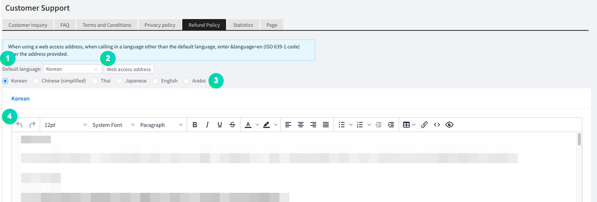

① Specify a default language among the contents of the refund policy displayed differently for the device's language setting.

② Check the refund policy from a webpage. Click to copy the URL. Add <b><i>&language=ko</i> (refer to ISO 639-1 codes)</b> after the URL to access in a different language.

③ Enter different contents of refund policy for the device's language setting.

④ Enter the contents of the refund policy for the specified language.

#### - Statistics

Check the inquiry statistics for a specified period.

답변 만족도는 문의 종료 후 고객이 만족도를 선택해야 노출됩니다.

#### - 담당자별 통계

담당자를 선택하여 담당자별 통계를 확인할 수 있습니다.

#### - 일별 리포트

고객 문의 통계를 일별로 확인할 수 있습니다.

최대 90일까지 조회가능합니다.

#### - Page

Create a web document and provides an access address.

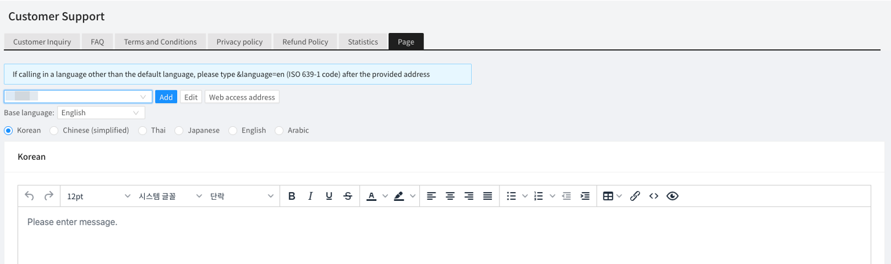

① Create and edit a webpage.

② Enter the contents of a page for the specified language.

#### -GDPR

Display the GDPR terms and conditions instead of existing terms and conditions when the GDPR applicable country is identified based on the client access IP.

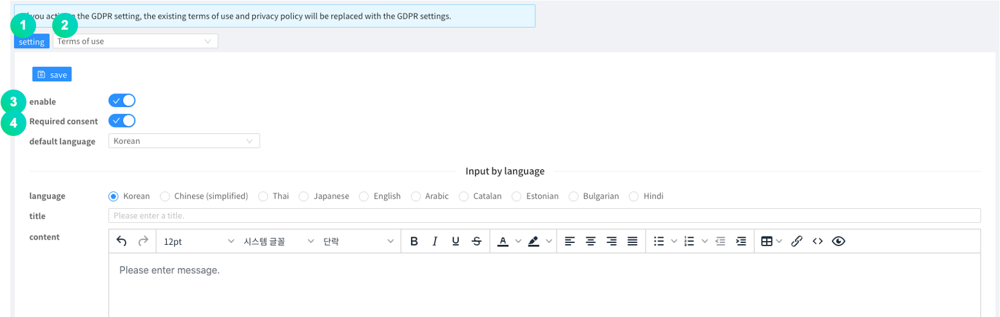

① Specify the settings related to GDPR.

② Select GDPR page.

③ Select whether to use the current page.

④ Select whether to set the current page check as mandatory.

> Enable OutBoundMailer function from Naver Cloud Console to use GDPR.

① Select whether to activate GDPR. When GDPR is activated, the existing terms and conditions and privacy policy will be replaced with the content for the GDPR setting.

② Enter the sender's email address.

③ Enter the sender's name.

④ Select whether to enable consent request for in-app advertisement. It must be enabled to display [Consent to personalized advertisement] or [Consent to non-personalized advertisement].

## Game

### Player

SDK enables you to send in-game character information and check it on the dashboard.

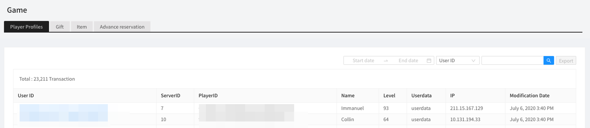

### Present

Webhook enables you to send items to game servers.

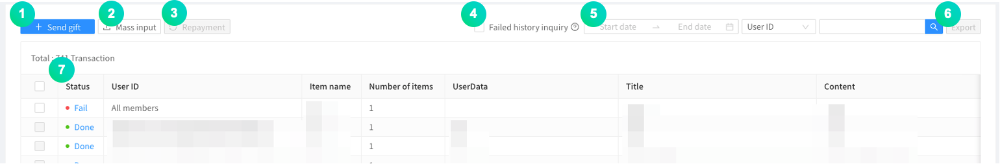

① Add gift to send.

② Add multiple gifts to send by uploading CSV.

③ Select multiple checkboxes for failed gift sending items, then click Send Again button to send them again.

④ The history of gift sending items is only viewed.

⑤ Search with period, user ID, title, content, etc.

⑥ The list of gift sent can be downloaded in CSV file format.

⑦ View details of gift sent.

Click **Send gifts**.

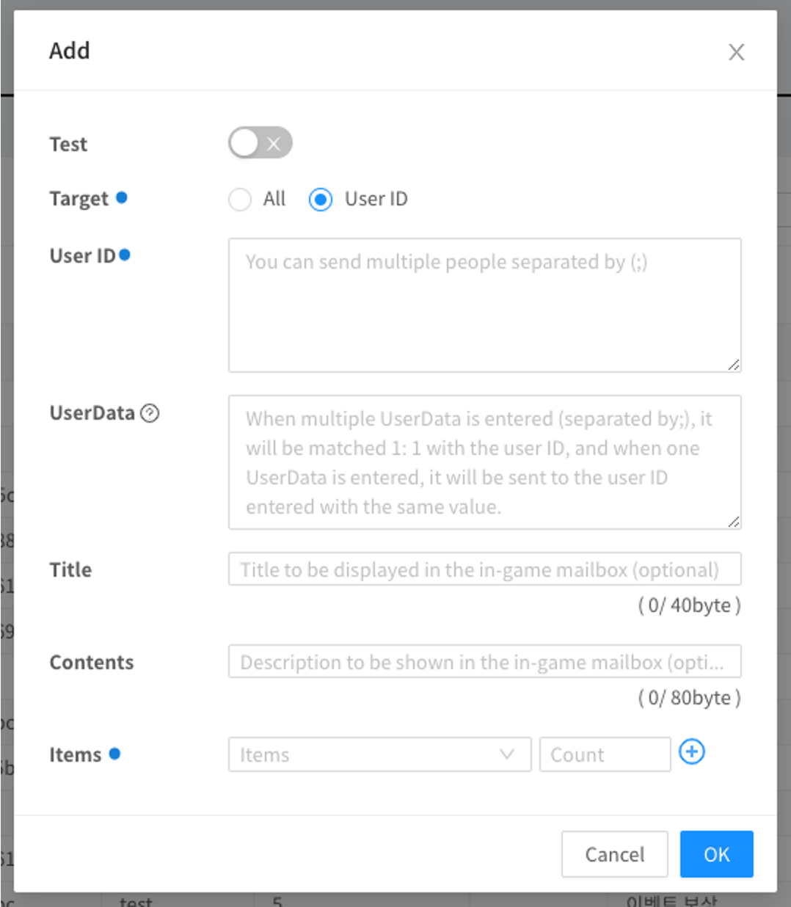

① Check to test without sending to the actual game server.

② Select a target.

③ Enter a target ID.

④ Enter the data to be sent as UserData values when sending items.

⑤ Enter a title to be displayed.

⑥ Enter a description to be displayed.

⑦ Specify items and their quantity to be sent.

#### - Item

This menu allows you to create an item that can be obtained by the coupon. Click **Add item** to add an item.
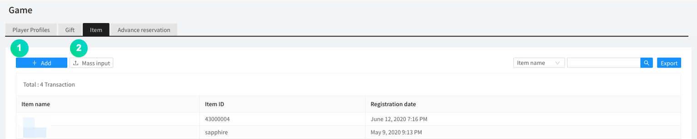

① Add an item.

② Click **Mass input** to add multiple items as a CSV file.

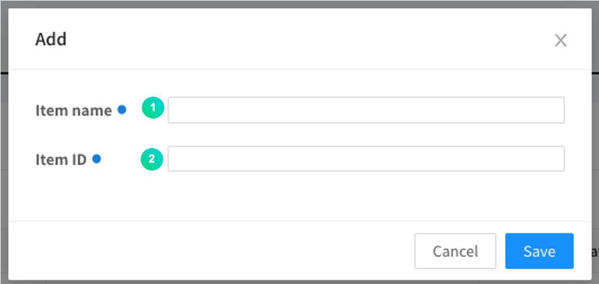

① Enter an item name.

② Enter an item ID. The item ID must be unique for each item.

### Pre-Reservation

Displays statistical data of the users who register via the advance reservation web page.

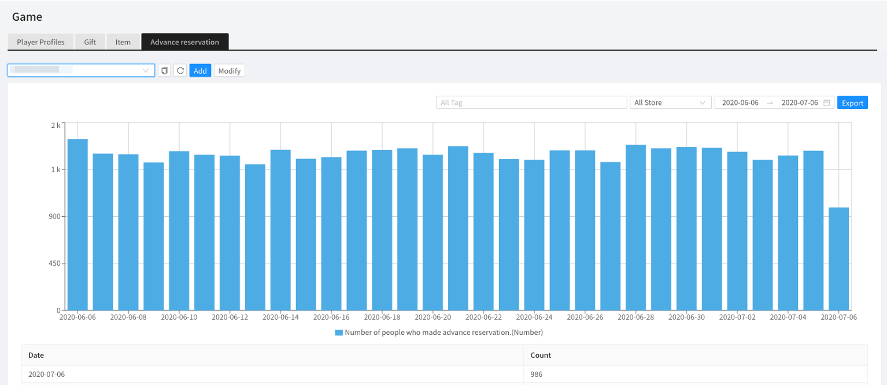

① Add an advance reservation. The name will be used as an ID for statistical data.

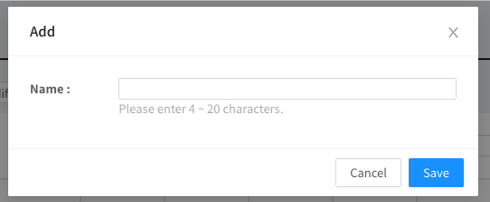

② Edit an advance reservation name.

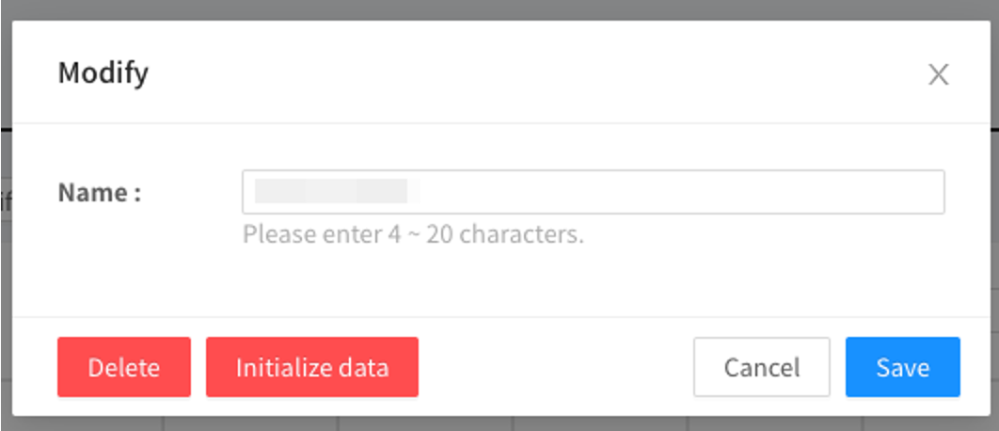

③ Download users who made an advance reservation.

The feature to send bulk messages to the users will be added later.

### Remote configurations

Enables you to change how your app works and looks without updating it. Add parameters to the server and import them in the GAMEPOT SDK. Using this feature, you can remotely control game features in the server.

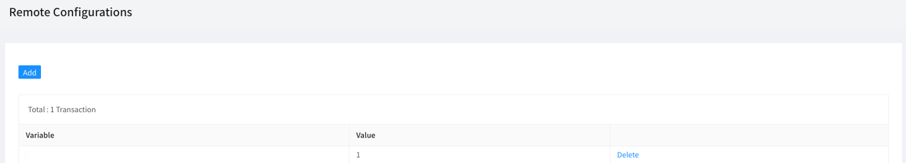

Click **Add**. When the pop-up window displayed below appears, add a parameter and value.

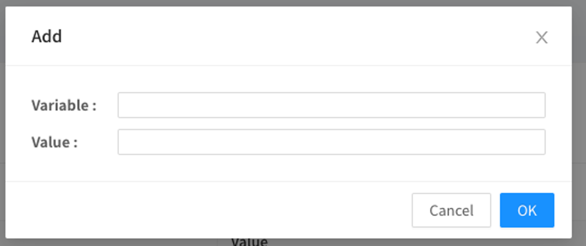

The parameter and value will apply since users recently ran the app.

### Log

This feature works with NAVER CLOUD PLATFORM’s ELSA to allow you to collect game logs or crash logs. Refer to [How to Use ELSA](https://docs.ncloud.com/ko/elsa/elsa-1-1.html) for details.

## Advertisement

In partnership with Nasmedia Co., Ltd, the users can easily apply to run advertisements and view various statistical information on GAMEPOT dashboard.

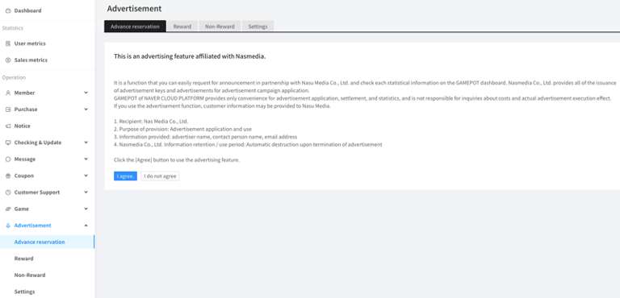

## Settings

### Project settings

#### - General

Set the overall environment of the app and specify various keys required to run the app.

##### Basic information

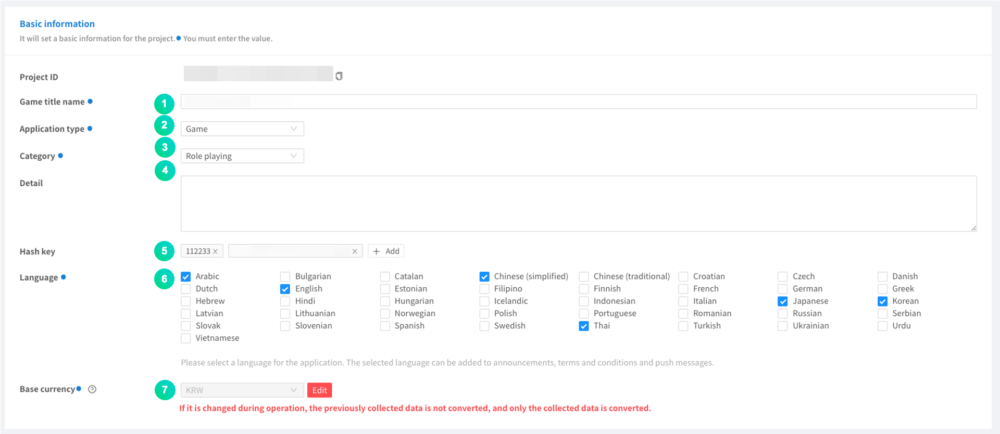

① Enter a game name.

② Select an application type.

③ Select a category.

④ Enter a project description.

⑤ Add a hash key.

⑥ Select a language to be used.

⑦ Change the reference currency.

- Previous payment amount is not changed even if reference currency is changed during the operation, so make a careful choice.

##### Public Key

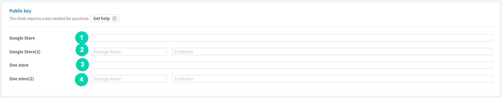

It is needed to connect with Google Play Store and ONE Store.

① Enter a public key of Google Play Store.

② If you need to release your game in two different versions\((e.g., for those over 12 years old and 18 years old)\)in Google Play Store, enter a package name followed by a public key.

③ Enter a public key for ONE Store.

④ If you need to release your game in two different versions\((e.g., for those over 12 years old and 18 years old)\)in ONE Store, enter a package name followed by a public key.

##### Google API key

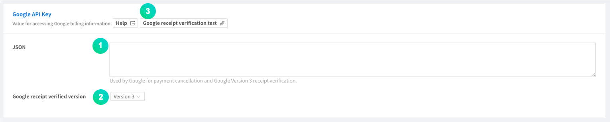

It is needed to connect with the Google API \(to check users who canceled their payments made in Google Play and verify the latest payment receipts\).

① Enter JSON data provided by Google. Refer to "View Help."

② The version for verified payment receipts. If you enter data in 1 above, select “Version 3.”

③ Perform Google's receipt verification test to check if Google's JSON value entered is correct.

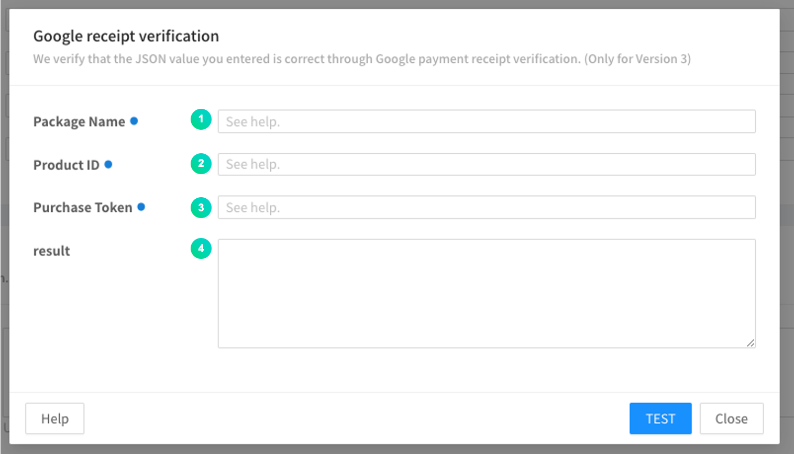

① Enter Google receipt's package name.

② Enter Google receipt's product name.

③ Enter Google receipt's purchase token.

④ Check the result of viewing Google receipt.

##### Apple ID Login

This information is required to be set up in advance in order for the user to log in with Apple ID on the Android device. Click View Help to see in detail how to enter this information and the return URL.

##### App ID

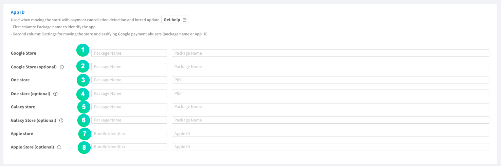

These are settings required when transferring among stores with forced updates. - Click View Help to check how to get an ID. Enter a value for distinguishing versions in the first box and a value to be sent to the store in the second box.

① Enter a package name for Google Play Store.

② If you need to release your game in two different versions\((e.g., for those over 12 years old and 18 years old)\), enter an additional package name for Google Play Store.

③ ② Enter a package name and a PID for ONE Store.

④ If you need to release your game in two different versions, enter an additional package name and a PID for ONE Store.

⑤ Enter a package name for Galaxy Store.

⑥ If you need to release your game in two different versions, enter an additional package name for Galaxy Store.

⑦ Enter a bundle ID and an Apple ID for Apple App Store.

⑧ If you need to release your game in two different versions, enter a bundle ID and an Apple ID for Apple App Store.

##### Server key

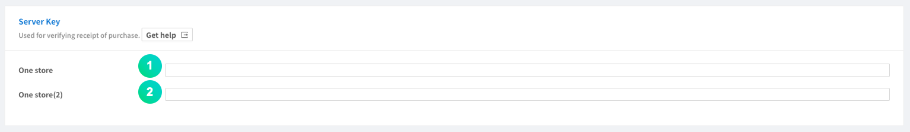

The information that needs to be specified to make in-app payments in ONE store and get items.

① Enter the license key from ONE Store.

② If there are two versions of your app, enter a license key of the other version.\( (It can be omitted if there is only one version.\)

##### Auth Key

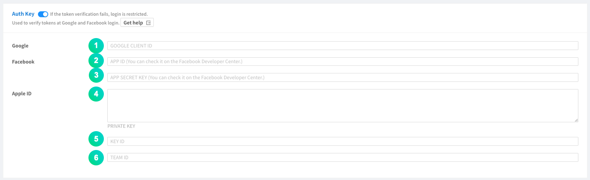

Auth Key is used to verify a token when a user logs in to Google or Facebook; if a token verification fails, the user will be blocked from logging into the game. The blocked users are automatically registered to the Block menu.

① Enter a Google Client ID.

② Enter a Facebook App ID.

③ Enter a Facebook App Secret Key.

④ Enter an Apple private key.

⑤ Enter an Apple key ID.

⑥ Enter an Apple team ID.

##### WebHook

결제 아이템은 결제 성공 시 아이템 지급을 요청하는 주소를 입력합니다.

쿠폰 아이템은 SDK를 이용하여 쿠폰 사용 성공 시 SDK 서버에서 개발사 서버로 성공에 대한 처리\(아이템 지급\)를 요청하는 주소를 입력합니다.

실 서비스에 이용되는 주소\(서비스\)와 서비스 중 테스트 환경이 필요한 경우의 주소\(테스트사용자\)가 제공됩니다. 테스트 사용자 주소로 동작하게 하려면 '프로젝트 설정 &gt; 테스트 사용자'에 추가해 주셔야 합니다.

**WebHook Test** 버튼을 클릭하여 WebHook 적용을 간단하게 테스트할 수 있습니다.

**White IP** 버튼을 클릭하여 Webhook을 통해 게임 서버 호출 시 허용해야 하는 IP 리스트를 확인할 수 있습니다.

**테스트 결제 발송 차단** 스위치를 활성화하면 테스트 결제 시 Webhook을 발송을 차단할 수 있습니다.

> 활성화한 경우 : 테스트 결제 시 결제 실패로 처리
>
> 비활성화한 경우 : 테스트 결제 시 결제 성공으로 처리

#### - Ncloud

Allows you to change keys required to work with NAVER CLOUD PLATFORM. For more information, refer to each item's User Guide.

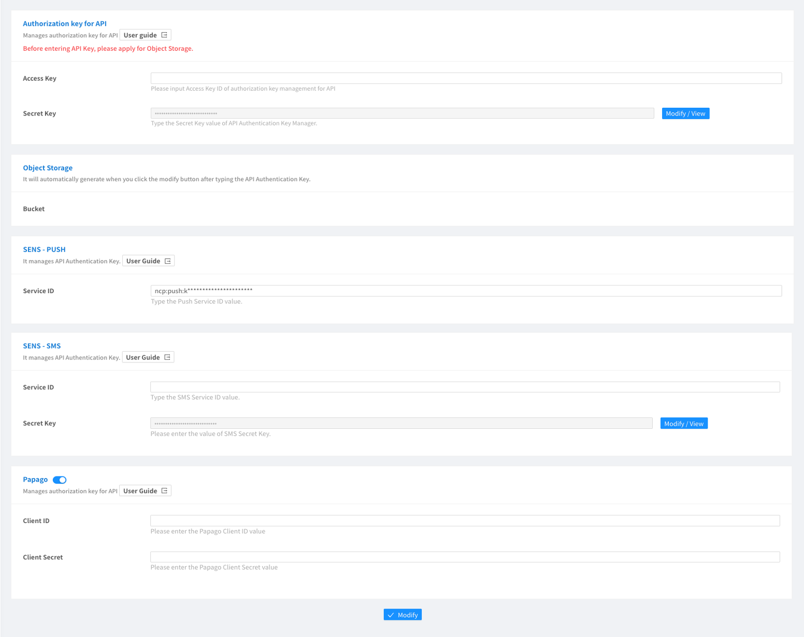

#### - CDN

Add a CDN address if you want to use CDN.

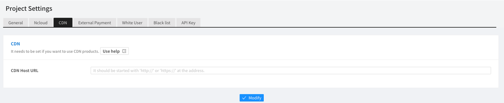

**Notice when adding a CDN address**

- Be sure that the source of CDN must be located in the same Object Storage bucket as the one used for the \[Notice\] feature.
- If no CDN is specified, the URL has typos, the source settings are not correct, or the uploaded images are not properly displayed in the game.

#### - External payment

ONE Store allows third-party payment modules other than the default store payment module.

We're supporting Danal as a PG company, and more PG companies will be added continuously.

**\[Settings\]**

Get required values for each payment method via Danal and enter **Client secret** in ONE Store console for **Store Secret key**.

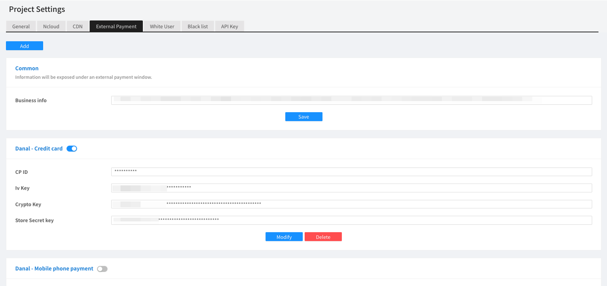

**\[Enter price\]**

Enter the amount to be paid by a user for each in-app item in Payment > IAP.

#### - White user

When a test user with the registered IP address accesses the game, the following features are activated depending on the specified type.

- Development: SDK logs are activated and displayed.
- Payment/Coupon: The address set by Webhook is called in payment and coupon usage.
- Check: The game proceeds even if checks are activated.
- Update: The game proceeds even if updates are activated.
- Member: The game proceeds even if there are countries or IPs blocked.

**추가** 버튼을 클릭해서 매개변수와 값을 입력합니다.

#### - Block

Block users accessing with registered IPs and country codes, and Device IDs.

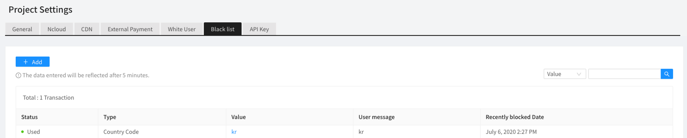

Click **Add**. When the pop-up window displayed below appears, add a corresponding value.

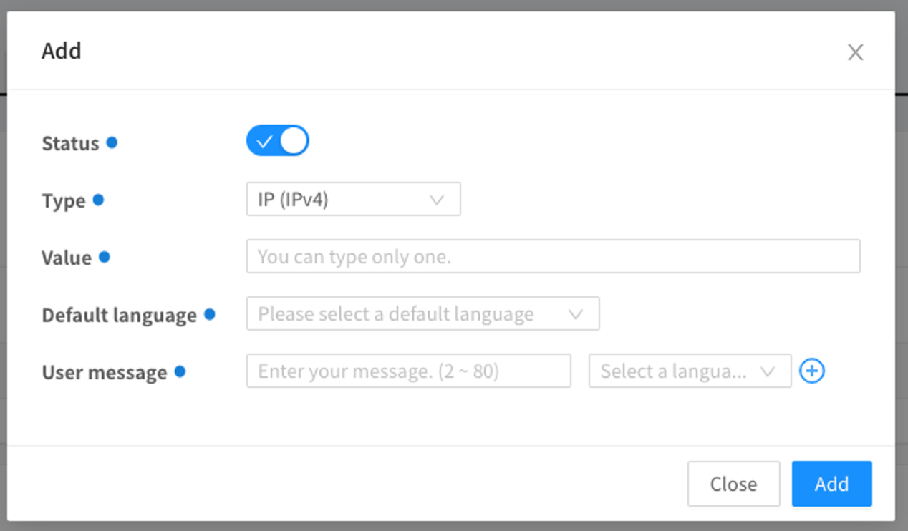

① Check the status to activate blocking.

② Specify an input value of a target to block.

③ Add a target to block.

④ Specify a default language among messages displayed differently for the device's language setting of the target to be blocked.

⑤ Register different messages for the device's language setting.

#### - API Key

It manages keys used in authentications for using open APIs.
Click [+Add] to create a key and enter the key value created in the header as x-api-key value when calling open APIs.
Click the key created to access Edit. Edit the key status, key expiration date, and description or delete the key.

### 관리자

#### 감사

최고 관리자 계정으로 대시보드 사용자의 활동 기록을 확인할 수 있습니다.

## Others

### Job management

Download the output result of csv files from each menu for a month.

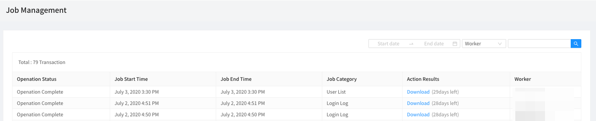

## その他

### SDK다운로드

Android, IOS, Unity SDK를 다운로드할 수 있습니다.

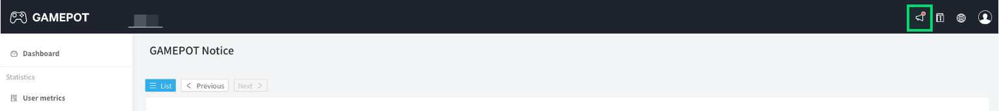

> 대시보드 우측 상단에서 GAMEPOT 정보를 확인할 수 있습니다.

### GAMEPOT 공지사항

GAMEPOT의 공지사항을 확인할 수 있습니다.

### 사용자 가이드

GAMEPOT 대시보드 사용 가이드 페이지로 이동합니다.

### 언어 변경

대시보드의 각 메뉴 등이 선택한 언어로 변경됩니다.

### 회원정보수정

대시보드 이용 계정의 이름, 비밀번호를 변경하실 수 있습니다.

대시보드 우측 상단의 아이콘을 클릭하면 나타나는 드롭다운 메뉴 중 회원정보수정을 선택할 수 있습니다.

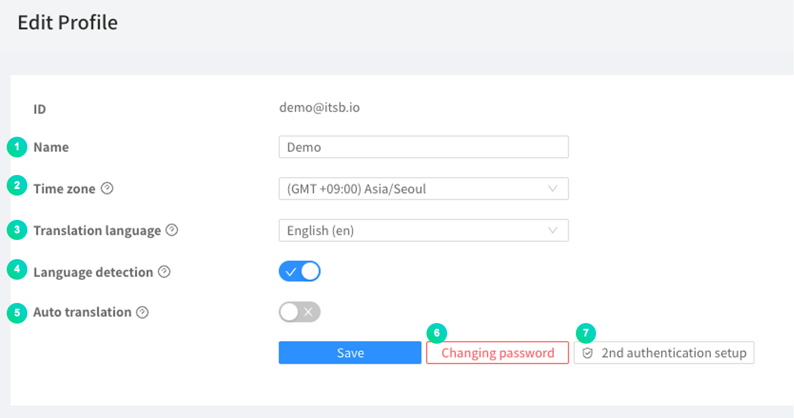

① Edit the user name.

② Select a standard time zone of the dashboard.

③ Select a target language when using inquiry translations.

④ Set whether or not to detect the languages of inquiries automatically when using inquiry translations.

⑤ Set whether or not to translate the languages of inquiries automatically when using inquiry translations.

⑥ Change the password.

⑦ You can set up 2-step login authentication.

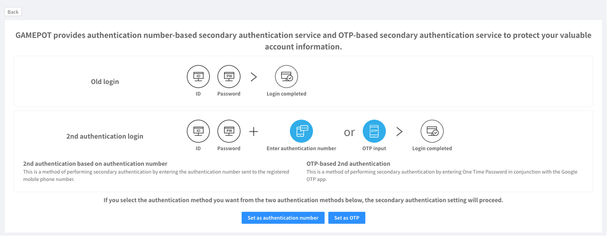

The 2-step login authentication can be set up either by authentication number or OTP.

① Set up 2-step authentication by mobile SMS authentication number.

② Set up 2-step authentication by Google OTP.

### Settings

Enables you to manage users, role management, and update features for your GAMEPOT dashboard.

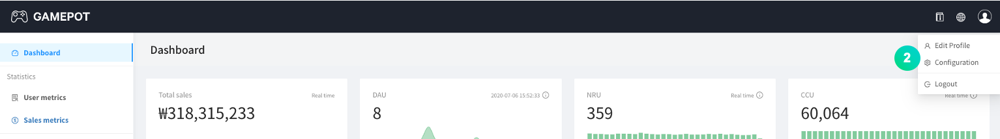

#### - User

Add or delete users of the dashboard.

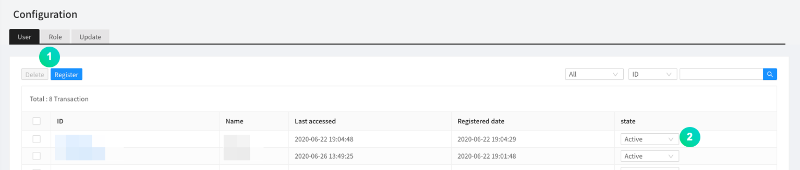

① Check the status to activate the user.

Click **Register**. When the pop-up window displayed below appears, add a corresponding value.

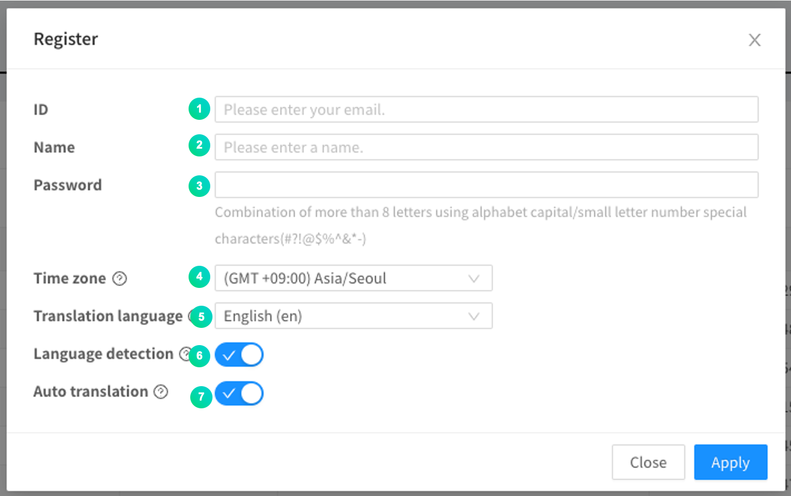

① Select a standard time zone for the user dashboard.

② Select a target language when using customer support translations.

③ Set whether to detect the languages of inquiries automatically when using customer support translations.

④ Set whether to translate the inquiries automatically when using customer support translations.

⑤ Select whether to require 2-step authentication when the user logs in.

⑥ Restrict access from unauthorized IPs when IP access restriction is enabled.

#### - Role

It allows you to manage dashboard users in unit and grant different permissions for each role.

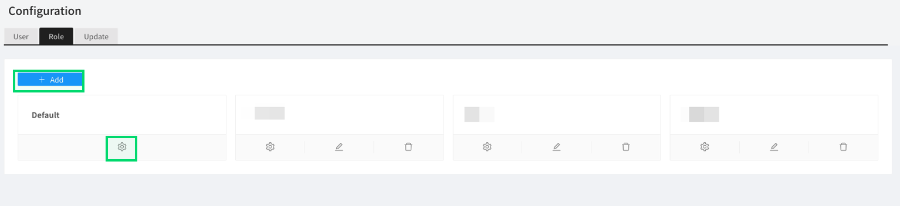

Click **Gears**. Set roles in the screen below.

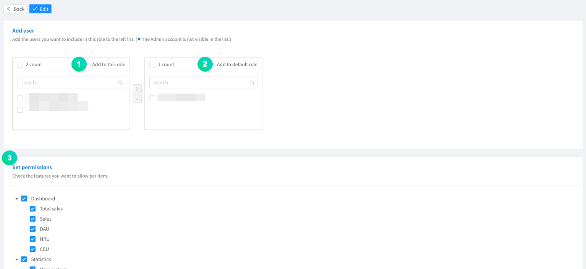

① Locates the user to be included in the role.

② Locates the user to be included in a basic role. Basic roles are provided all permissions.

③ Select a feature to be permitted to the role.

#### - Update

Check GAMEPOT system's update history.

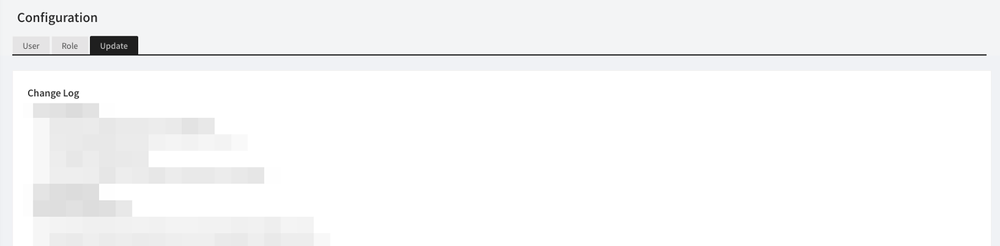
