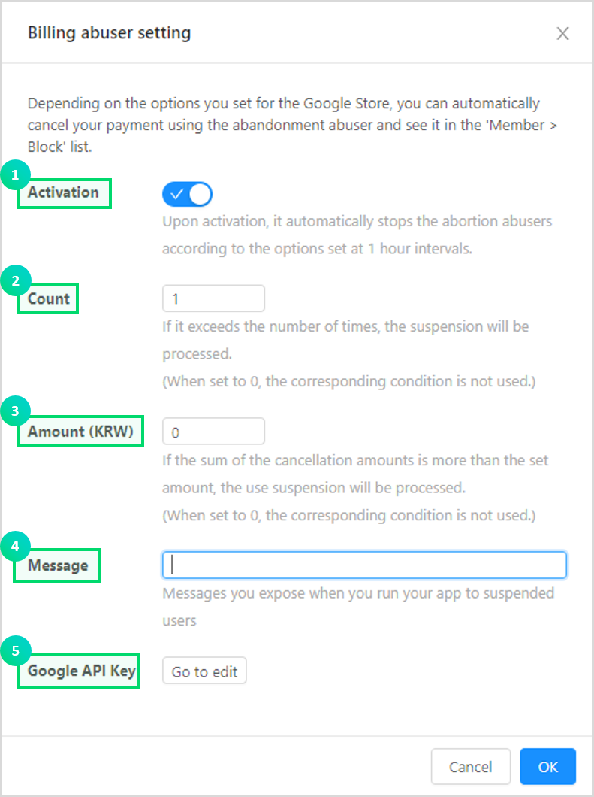
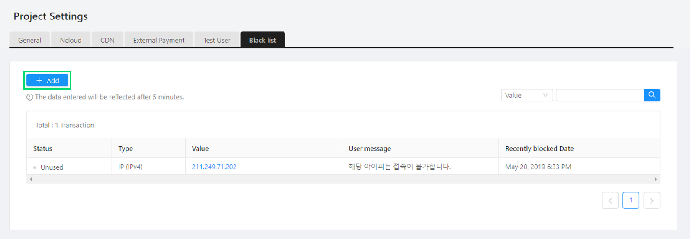
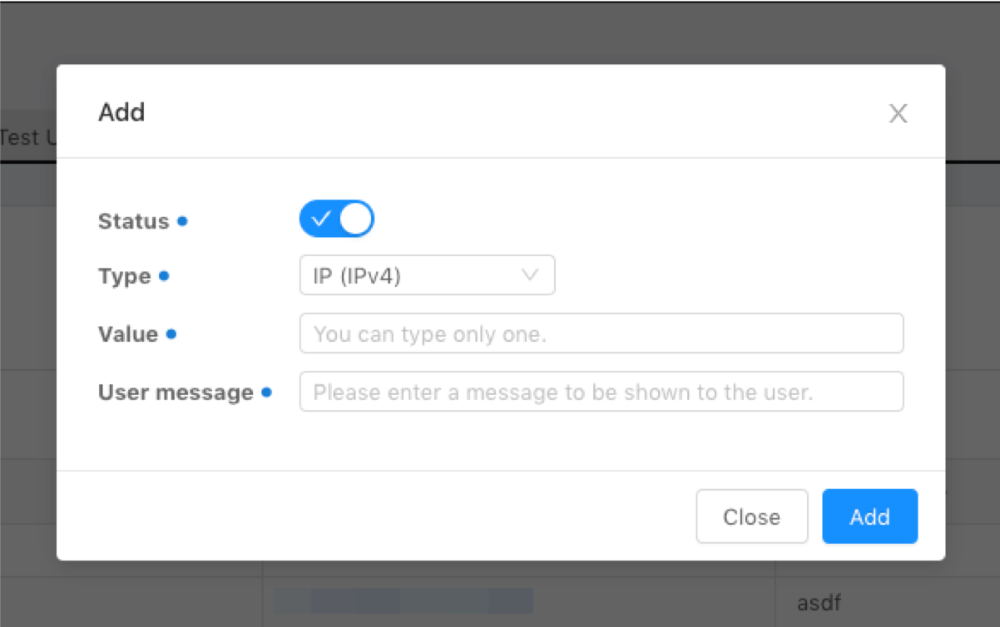

---
search:
  keyword: ['gamepot']
---

This document describes how to use the dashboard provided by NAVER CLOUD PLATFORM’s GAMEPOT.

## About GAMEPOT dashboard

**Q. What is a dashboard?**

A dashboard helps you run and manage games.

**Q. What kind of features does the dashboard provide?**

It provides statistical data regarding user access and payment, and works with NAVER CLOUD PLATFORM’s other services to enable you to control various features including Push, SMS, and log analysis. It also provides operation features required for games, such as coupons and updates, allowing you to manage games more effectively.

## Get started with GAMEPOT dashboard

### Login

#### Step 1. Access dashboard

Click the dashboard URL in NAVER CLOUD PLATFORM’s Console to access the dashboard.

#### STEP 2. Sign up

When you first access the dashboard, you need to click **Join GAMEPOT** to create an account.

The account created at first becomes the master account that has all permissions for dashboard management.

Create an account for the dashboard. The account you created first is automatically assigned as “master.”

#### STEP 3. Log in

Log in with your account to access the dashboard.

## How to use dashboard menus

### Dashboard

The dashboard helps you view the overall operation status of your games, including signup status, sales, access and statistics at a glance.

① You can select a currency to see the total revenue for each call.

② You can view a sales graph for each call by selecting a currency.

### Member

#### List

Shows the list of users who signed up.

① Specify a period to view users who signed up during the specified period.

② Specify a user ID or IP address to view specific users.

③ Download users as a CSV file.

④ Click a user ID to view the details of the user as in the figure below.

① Shows the basic information of the user.

② Sends push notifications to individual users.

③ Shows login information of the user.

④ Shows the payment details of the user.

⑤ Shows questions and answers of the user.

⑥ Shows connected social media accounts of the user.

- You can connect or disconnect social media accounts.

#### DAU

Shows a graph of daily active users (DAUs) for a specified period. 

It displays daily DAUs for the last 30 days by default, and also allows you to specify a period during which you want to view daily DAUs.

① RAW data of the current graph can be downloaded as a CSV file.

#### New user

Shows a graph of daily new users who joined your game for a specified period.

It displays daily new users for the last 30 days by default, and also allows you to specify a period during which you want to view daily new users.

① RAW data of the current graph can be downloaded as a CSV file.

#### CCU

Shows the number of concurrent users (CCUs) who accessed your game, in minutes for up to 3 days.

① Shows a graph of CCUs in minutes for the specified 3 days.

② The period is specified as the last three days, today, yesterday, and the day before yesterday, by default, and you can change the period as needed. Click **Initialize** to get back to the default period.

③ Shows a graph of CCUs in minutes for the specified period.

#### Block

Blocks a user from accessing your game for a specified period.

This features works based on a user ID.

① Click **Add** to block a user.

② Specify the period during which you want to view block information.

③ Specify a user ID you want to view blocking details of.

④ Shows the details of blocked users.

- Enabled: The blocking is enabled.
- Disabled: The blocking is disabled.

### Purchase

#### List

Shows payments attempted in Google Play, App Store and ONE store.

① Cancels payments that were successfully made. The canceled payments are excluded from the sales.

② Shows whether a payment attempt was successful. Items can be re-provided for failed payment attempts.

③ Shows whether a payment attempts was canceled.

- Y: Payment canceled.
- N: Payment not canceled.

You can click the payment status to see the payment details, and for failed payments, you can click **Re-provide** to re-provide items.

#### IAP

Manages product information when an in-app purchase is made. You should add all products of Google Play, App Store and ONE store.

① Click **Add in-app item** and enter a store, product name and product ID to create a paid item.

② Click **Mass input** to add multiple in-app items as a CSV file.

#### Statistics

Provides a graph showing payments on a daily basis.

① Specify a store which you want to view payments data.

② Specify a currency which you want to view payments data.

② Specify the period during which you want to view payments data.

#### Cancel the Google payment

Regularly refers to the status of payment receipts in the Google Console, and shows the payments that were successfully made but arbitrarily canceled by users.

① Specify conditions to block users who arbitrarily cancel Google payments from accessing your game. 

① Set whether to block users who arbitrarily cancel Google payments. When it is enabled, those who meet the following conditions will be automatically blocked on an hourly basis.

② Blocks the users who canceled Google payments more times than specified.

③ Blocks the users who canceled Google payments the amount of which is greater than specified.

④ It is a message that is displayed when a blocked user attempts to access the game.

⑤ Enter a Google API key to get the list of Google payments canceled.

### Notice

Notice images registered in the dashboard are shown to the logged-in users of your game. You can specify the store and the period during which those images will be shown.

To use this feature, you need NAVER CLOUD PLATFORM’s API authentication key and Object Storage. Note that additional charges will apply for using Object Storage.  

#### Step 1. Get API authentication key

Notice menus work with Object Storage, by using APIs. Therefore, you need to get an API authentication key of NAVER CLOUD PLATFORM.

Go to **My Page > Manage Account > Manage Auth Key** in the portal to create an API authentication key.

① Click **Create a New API Authentication Key**.

- An account can have up to two API authentication keys.

#### Step 2. Connect dashboard with API auth key

You should connect your API authentication key with the dashboard to create a bucket in Object Storage and use dashboard features. Go to **Project settings > NAVER CLOUD PLATFORM** in the dashboard and connect your API authentication key.

Once your API authentication key is connected, a bucket in Object Storage is automatically created. All the notice images are stored in the bucket.

#### Step 3. Add notice

To add a notice, go to **Notice** on the left and click **Add**.

① Images can be added via the **Add notice** button.

② Specify the sequence of images you want to expose to your users.

Specify the fields in the following popup window and click **Save**, and a notice is added.

① Select whether to activate the notice.

① Specify the start date and the end date during which you want to show the notice.

② Select all stores or a specific store which you want to show the notice to.

③ Specify a URL to display an additional web page if needed.

④ Drag and drop images or directly select them to upload image files.

### Check and update  

Helps you easily check and update your game.

#### Check

During the game check period, this feature automatically displays check messages and prevents users from accessing your game.

Enter the check period and message and click **Save**, and the check notice is displayed in the game.

① Select a store.  Select all if all of them should be inspected.

② Specify the period during which checks will be performed.

③ Enter the URL to be redirected when users click **View more** of the check.

**Example:  Notice of a cafe or self-created check information page**

#### Update

If a user’s game is not up-to-date, this feature forcibly shows update information and redirects the user to the game’s update page in Google Play or App Store.

① Set by store.

② Select whether to activate the function.

③ If you select **Force**, you will not be able to use the game until you make an update in the store, and if you choose **recommended**, you will still be able to use the game without updating from the store.

④ Enter the version information. If it is different from the input version, the function will work.

### Message

This service helps you implement notification features by using SMS and Push, with no message server. To do so, you should sign up for NAVER CLOUD PLATFORM’s Simple & Easy Notification Service .

① For using Simple & Easy Notification Service, you need to get a service key. Click **Get service key** and get a service key by referring to [Simple & Easy Notification Service Common Guide](../sens/sens-1-2.md).

② Click **Certificate registration** and add a certificate by referring to **Simple & Easy Notification Service Web Console Guide**.

③ Click **Settings** to go to the following window and enter the Push service ID.

#### Push message

Click **Message > Push message** to view information including sending status, scheduled date and time and sent date and time.

Click **Add message**, and the following popup window appears. On this popup window, you can send messages.

① Enter a push message.

② Enter a title if necessary. If not specified, it is displayed as the app name.

③ Select a platform so that you can send the push message only to the specified users.

#### Text message

Helps you send SMS/LMS messages and view history and results. To send SMS/LMS messages, you should first get a service key and register a caller ID in Simple & Easy Notification Service.

① For using Simple & Easy Notification Service, you should get a service key and register a caller ID. Click **Get service key**, and get a service key and register a caller ID by referring to [Simple & Easy Notification Service Common Guide](../sens/sens-1-2.md) and [How to Use Simple & Easy Notification Service SMS](../sens/sens-1-3.md).

② Click **Settings**, and enter the service ID and secret key.

Click **Add message**. Then, the following popup window appears.

① Select between SMS and LMS. Charges differ depending on the message type.

② Enter the calling number registered in the Console. (Messages will not be sent if the calling number is not registered.)

③ Enter a called number. 

④ Download a sample file which is used to bulk add called numbers and random coupon numbers as a CSV file.

⑤ Upload a CSV file to bulk add called numbers and random coupon numbers. The uploaded called numbers and random coupon numbers are automatically added to send messages specified in ⑥.

⑥ Enter a message to send as an SMS or LMS.

⑦ You can schedule a time at which the message will be sent.

### Coupon

Coupons are an essential element in games. Two types of coupons are supported: common and keyword.

#### Common coupon

A common coupon is generally provided to users as a coupon code. This feature allows you to easily create and manage coupons in your game. Click **Create coupon** to create a coupon in the following popup window.

① Specify the period during which the coupon is available.

② Limit the length of the coupon. Usually, 8-10 characters are recommended.

③ You can specify the prefix and suffix, which will be added to your coupon code when it is created.

④ You can add up to 100,000 coupons, the number of which can be increased later. (The maximum number of coupons is 500,000.)

⑤ Specify an item to be offered for a coupon and the number of items. Click + button to provide multiple items.

When a coupon is created, the list of coupons created is displayed as shown in the figure below.

You can check the current status and quantity of each coupon from the list.

You can also edit the number of coupons previously created.

① Click the blue icon on the left of the list to increase the quantity.

② Enter the number of coupons to add, and click **OK**.

#### Keyword coupon

This feature allows you to create keywords, such as “Christmas,” “open event,” and “new year,” and provide items when users enter such keywords in the coupon window.  Recently, keyword coupons are much preferred over common coupons as it is hard to enter a coupon code.

Click **Create coupon**.

① Specify the period during which the coupon is available.

② Enter a keyword for the coupon.

③ The number of available coupons cannot exceed this value.

④ Specify an item to be offered for a coupon and the number of items. Click + button to provide multiple items.

#### Usage history

Shows all coupon codes issued. 

① Specify a period, coupon number, and user ID to check whether the coupon is used.

② Shows whether a coupon is used.

-  Success: The coupon was successfully used.
- Not used: The coupon was not used.

#### Item

This menu allows you to create an item that can be obtained by the coupon. Click **Add item** to add an item.

① Add an item.

② Click **Mass input** to add multiple items as a CSV file.

① Enter an item name.

② Enter an item ID. An item ID must be unique among items.

### Customer support

Enables you to answer the questions asked by users. If there is a customer support menu in your game where users can enter their basic information, you can view the information in GAMEPOT.

#### Customer support

Shows inquiries made by users.

Click **User ID**.

① You can see the information of the customer who inquired. (Answering satisfaction is revealed only after the customer finishes the inquiry.)

② You can respond to inquiries.

③ You can upload the images and text files needed for your answers.

④ It is the history of the inquiry/answer with the customer. You can see all the contents in the chat format.

⑤ Answer registration If you set the alarm, you will be exposed. You can choose whether or not to send the push when registering the answer.

⑥ All information about this member is displayed by default.

##### Push

Sends push messages to users when you answer their questions.

① Set whether to enable Push.

② Enter a push message to send.

#### Terms of Use

You can enter the terms of use of the company. This content can be exposed to users through the SDK.

#### Set up privacy policy

You can enter your company's privacy policy. This content can be exposed to users through the SDK.

### Advance reservation

Shows statistical data of the users who register via the advance reservation web page. 

① Add an advance reservation. The name will be used as an ID for statistical data. 

② Edit an advance reservation name.

③ Download users who made an advance reservation.

The feature to send bulk messages to the users will be added later.

### Remote configurations

Enables you to change how your app works and looks without updating it. You can add parameters to the server and import them in the GAMEPOT SDK. Using this feature, you can remotely control game features in the server. 

Click **Add**. When the popup window shown below appears, add a parameter and value.

The parameter and value will apply since users newly run the app.

### Project settings

#### General

Helps you set the overall environment of the app and specify various keys required to run the app.

① Enter a game name.

② Select an application type.

③ Select a category.

④ Add a hash key. 

It is needed to connect with Google Play and ONE store.

① Enter a public key of Google Play.

② If you need to release your game in two different versions (e.g., for those over 12 years old and 18 years old) in Google Play, enter a package name followed by a public key.

③ Enter a public key of ONE store.

④ If you need to release your game in two different versions (e.g., for those over 12 years old and 18 years old) in ONE store, enter a package name followed by a public key.

It is needed to connect with the Google API (to check users who canceled their payments made in Google Play and verify the latest payment receipts).

1. Enter JSON data provided by Google. View Help.
2. It is the version of verified payment receipts. If you enter data in 1 above, select “Version 3.”

① Enter your Google Play ID.

② Enter your ONE store ID.

③ Enter your App Store ID.

It is the information that needs to be specified to make in-app payments in ONE store and get items.

① Enter a license key of ONE store.

② If you app is in two versions, enter a license key of the other version. (It can be omitted if there is only one version.)

**Auth Key** is used to verify a token when a user logs in to Google or Facebook; if a token verification fails, the user will be blocked from logging into the game. The blocked users are automatically registered to the Block menu. 

① Enter a Google Client ID.

② Enter a Facebook App ID. 

③ Enter a Facebook App Secret Key.

For **Purchased item** under **WebHook**, add an address to request items when the payment is successfully made.

For **Coupon item**, add an address for the SDK server to request items from the developer server when a coupon is successfully used.
There are two types of addresses: service address used for the live service and test user address for testing environment.
If you need to use a test user address, add it in **Project settings > Test user**.

① Enter a service URL for purchased items.

② Enter a test user URL for purchased items.

③ Enter a service URL for coupon items.

④ Enter a test user URL for coupon items.

#### Ncloud

Allows you to change keys required to work with NAVER CLOUD PLATFORM.
For more information, refer to Manual.

#### CDN+

Add a CDN+(Content Delivery Network) address if you want to use CDN+.

**Notice when adding a CDN+ address**

* Make sure that the source of CDN+ must be located in the same Object Storage bucket as the one used for the Notice feature.
* If no CDN+ is specified, the URL has typos, or the source settings are not correct, the uploaded images are not properly displayed in the game.

#### External payment

One store accepts a third payment module rather than a basic store payment module.

Supported PG is Danal and will be added continuously.

##### Setting

The required value for each payment method is obtained through Danal and the **Store Secret key** is entered into the OneStore console as **Client secret**.

##### Enter Price

In the Billing - IAP menu, enter the price you want to pay for each in-app item.

#### Test user

When a test user with the registered IP address accesses the game, the following features are activated depending on the specified type.

* Development: SDK logs are activated and displayed.
* Check: The game proceeds even if checks are activated.
* Update: The game proceeds even if updates are activated.

Click **Add**. When the popup window shown below appears, add a parameter and value.

#### Blocking access

Blocks users who connect with registered IP and country code.

Click the **Add** button. When the following pop-up window is exposed, enter the corresponding value.

### Log

This feature works with NAVER CLOUD PLATFORM’s Effective Log Search & Analytics to allow you to collect game logs or crash logs. Refer to [How to Use Effective Log Search & Analytics](https://docs.ncloud.com/en/elsa/elsa-1-1.html) for details.

### User Guide

Go to the GAMEPOT Dashboard User Guide page.

### Change language

Changes the display language of the dashboard to the selected language.

### Edit member info

Enables you to edit the name and password of the dashboard account.

① Click the icon on the upper right side of the dash board and click **Edit member info**.

② Edit the user name.

③ Change the password.

### Environment settings

Enables you to manage users, updates and system features for your GAMEPOT dashboard.

#### User

Allows you to add or delete users of the dashboard.

① Registered user IDs.

② Registered user names.

#### Update

Updates the GAMEPOT system to the latest version.

#### System

You can check the current disk status and backup status as well as the last backup time.

① It is the current disk usage of the system.

② If enabled, it backs up the entire database once a day, and the backup data is automatically stored in Object Storage.

※ Backup is performed every 12 hours after being enabled.
