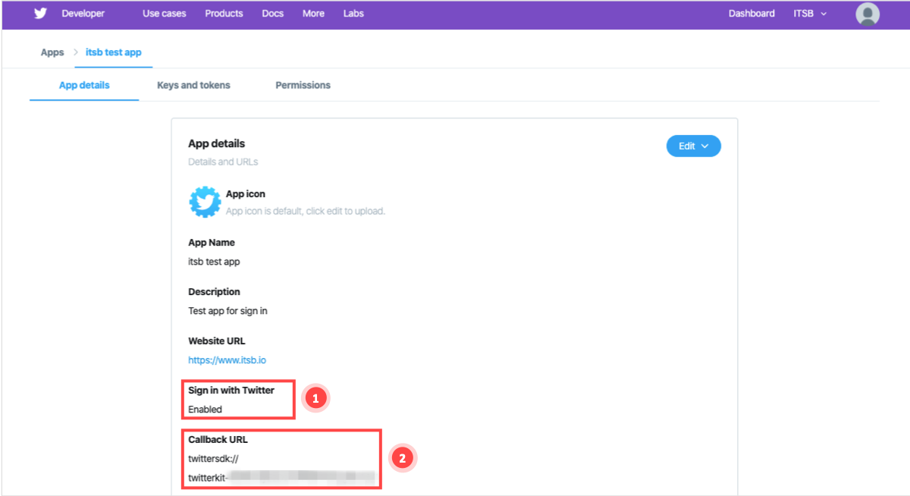
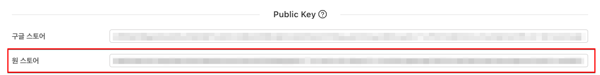
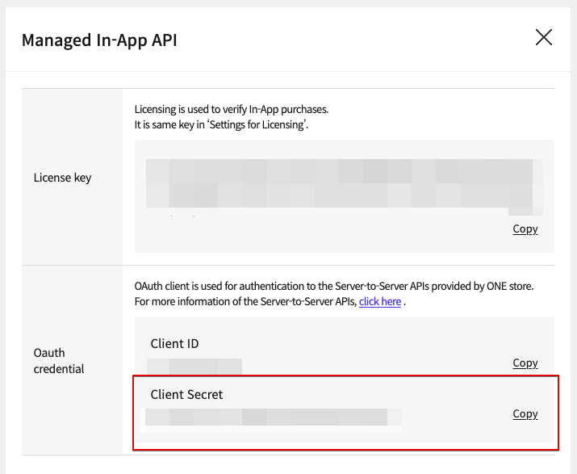
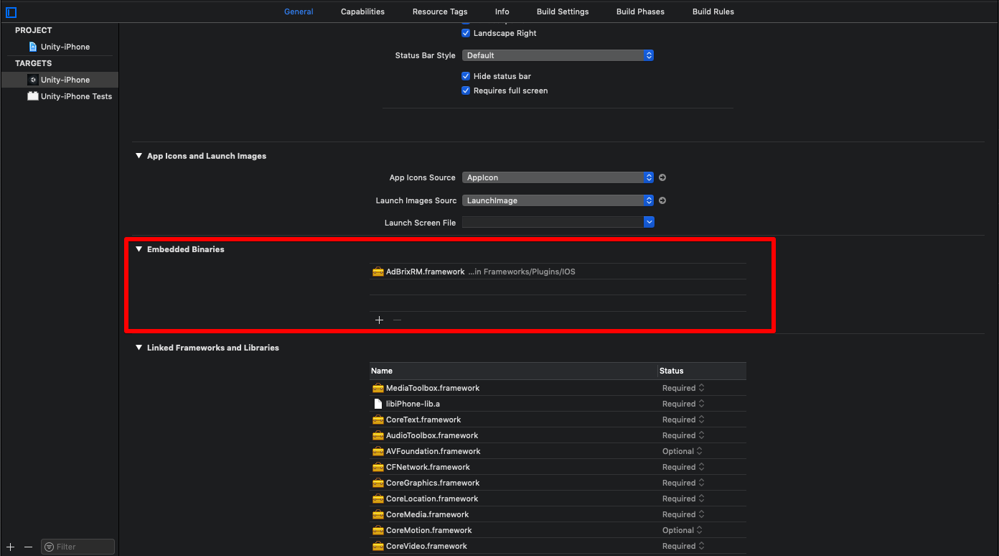
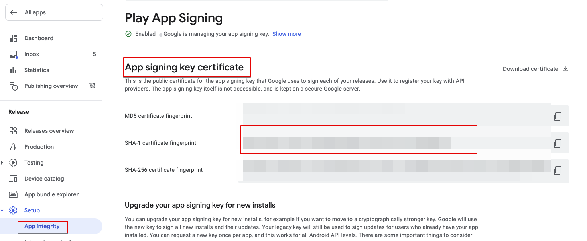
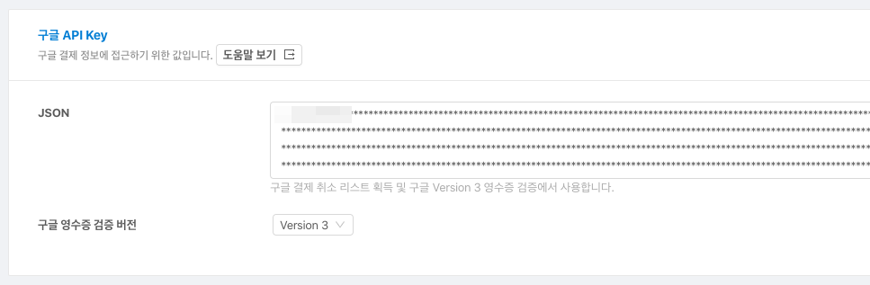
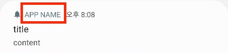
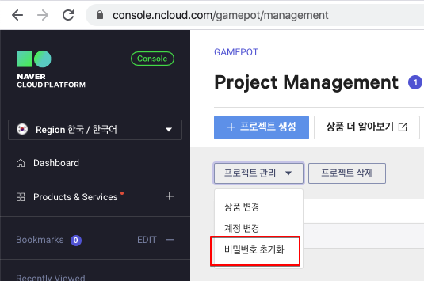

# FAQ

> ### This is a machine-translated document that may have errors in vocabulary, syntax, or grammar. We will soon provide you with the document translated by a professional translator.
>
> #### If you have any questions, please [contact us](https://www.ncloud.com/support/question).
>
> We will make every effort to further enhance our services.

## I can't log in!

> For social login function, it is basically based on the development guide of the platform. In case of problems, please check the login development guide of the platform first.

### 1. Google Login

#### 1-1)

    # Q. If you try to log in, login cancellation is returned immediately. (AOS, iOS)
    # A. This is a phenomenon that occurs because the required environment is not set correctly.

1. Check if the google-service.json file, the Firebase configuration file, is normally included in the project.

2.(AOS) Check if the SHA-1 value of the keystore used when building the APK was added to the Firebase Console.

> Request SHA-1 value from the developer.

3. Check if the project is set properly in the Firebase Console.

   -Check if the build to which the content is applied is correct

   1. Whether it was built with the Package Name (AOS) / Bundle ID (iOS) set on the console.

   2. (AOS) Whether SHA-1 was built with the extracted keystore

   -Make sure you have set up a support email in Firbase Conosole

    * (AOS) When using `App Signature` in the Google Console, you must also add the SHA-1 value created in the Console.

4. If you still check all of the above checks, try changing your support email to another email.

   > Intermittently, when setting the first support email, it sometimes works properly. In this case, changing to a different email fixed all of the above issues.

#### 1-2)

# Q. When you install the APK directly, you are logged in, but when you download and log in the app uploaded to the store, you are not logged in. (AOS)

    # A. This is done by using the'App Signing' function in the Google Developer Console.

When'app signing' is activated when uploading the APK from the console, the keystore is replaced with the key managed by the console. This requires that the sha-1 value of the keystore managed by the console be added to the Firebase console.

> If you use Facebook login at this time, you must also add the keyhash value of the new keystore to the Facebook developer console.

#### 1-3)

    # Q. I get an error \(401 error: disabled\_client\) when logging into Google on iOS. (iOS)
    # A. There may be a problem because the support email is not set in the Firebase console settings.

Please set up a support email and check.

#### 1-4)

    # Q. A pop-up occurs when logging in to Google on iOS, but it is exposed with a value other than the game name. (iOS)
    # A. Change the value of Xcode >> Targets >> build Settings >> Product Name.

### 2. Facebook Login

    # Q. When the Facebook app is installed on the smartphone, I cannot log in normally. (AOS, iOS)
    # A. The problem may occur because the environment setting of the Facebook Developer Console is incorrect.

Add the key hash value of the keystore used when building the APK to the Facebook console.

-When using the'App Signature' function in the Google Console, you must also add the keyhash value of the keystore managed by the Google Console.

### 3. APPLE LOGIN

    # Q. When I try to log in to APPLE, an error occurs. (iOS)
    # A. This is a phenomenon that occurs because the required environment is not set correctly.

1. Make sure you have added Xcode >> TARGETS >> Signing & Capabilities >> + Capability >> Sign In with Apple

2. Check whether LocalAuthentication.framework, AuthenticationService.framework has been added to Xcode >> TARGETS >> Build phases >> Link Binary With Libraries
   (If the target version is iOS 13 or lower, AuthenticationService.framework is set to optional)

### 4. Login to Naver (Nero)

#### 4-1)

    # Q. An error occurs when logging in to Naver. (AOS, iOS)
    # A. NAVER Developers Console's environment setting is different from the build setting.

Make sure that the NAVER Developers Application settings and build settings match.

#### 4-2)

**_`This applies only when Naver Cafe SDK is integrated.`_**

    # Q. When linking with Naver Cafe SDK, Nearo (login with Naver ID) through web view is not possible. (iOS)
    # A. This is an issue that occurs when the login module of Nearo SDK and Cafe SDK coexist.

1. Download the patch for the link. \([Download](https://kr.object.ncloudstorage.com/itsb/patch/Patch_GamePotNaverLogin_20200508.zip)\)

2. Delete the two existing frameworks in the project.

   -GamePotNaver.framework
   -NaverThirdPartyLogin.framework (if present)

3. Put the downloaded patch (GamePotNaver.framework) in the same path.

   Due to the IOS UIWebview issue, please use the Naver Cafe SDK version 4.4.7 or later.

4. (UNITY ONLY) In the Naver Cafe initialization phase, url scheme is explicitly inserted

   ../Assets/NCSDK/Plugins/iOS/NCSDKUnityManager.mm

5. Modify the priority of the URL Scheme value in info.plist first. \([Link](https://docs.gamepot.io/undefined/gamepot_troubleshooting#unity-sdk-ios)\)

### 5. Log in to Line

    # Q. An error \(400 error: Bad\_Request\) occurs when logging in to the line. (AOS, iOS)
    # A. Problems may occur due to incorrect configuration of LINE Developers Console.

Check if the setting of Line Developer Console is correct.

### 6. Twitter Login

    # Q. Error \(Error Code-1011\) occurs when logging in to Twitter. (AOS, iOS)
    # A. The Twitter Developers Console's environment settings may be incorrect.

Check if the Twitter Developer Console settings are correct.

1. Make sure Sign in with Twitter is Enabled.

2. Check if the callback URL setting is correct.
   -First line (using AOS): twittersdk://
   -Second line (using iOS): twitterkit-{twitter_consumerkey}://

## Payment is not possible!

### 1. Common

#### 1-1)

    # Q.'productid was wrong!' The phrase is exposed.
    # A. GAMEPOT Dashboard -> Payment -> Add the product ID of the store to the IAP.

#### 1-2)

    # Q. There is no response to the first payment attempt, and the second payment attempt is successful. (Play Store, ONEStore)
    # A. Dashboard-Project Settings-General-Public Key is incorrect.

Please enter the key referring to the contents in'View Help'.

### 2. Google Play Store

#### 2-1)

    # Q. The Google payment popup is exposed, but the payment does not proceed.
    # A. This occurs when the environment for Google payments is not set properly. Please check the items below one by one.

1.Console> App Info> Check if the in-app is set to'active APK' in the in-app product

2. Check if the app is in the'released' state on the console

   > Put it on the'Private'/'Internal Test' track, not the'Production' track.

3. Make sure you have registered your test account in Console -> Testing -> Manage track -> Testers -> Testers Management

4. Check if you applied for test participation by accessing the test participation URL

5. Check if you have added a test account to `License Test` in Console -> Settings

6. In terminal -> settings -> account menu, check if all accounts are deleted, leaving only the participating accounts.

### 3. ONEStore

#### 3-1)

    # Q. The phrase'Payment requested by abnormal app' is exposed.
    # A. Before opening the app, only the test account is accessible. Please check below.

1. Make sure your test account is registered.

2. Check if the One Store app installed on the terminal logs in with the test account registered in step 1.

#### 3-2)

    # Q. At the time of payment, \[package\] doesn't exist or wrong secret. The phrase is exposed.
    # A. Check again whether the key value related to the one store is properly applied to the GAMEPOT dashboard.

1. Whether the package name of the APK is the same as the package name registered in One Store

2. Whether the'License Key' of the One Store Console is applied

> Whether that value has been applied to items below the GAMEPOT dashboard

3. Whether or not to apply `Client secret` of One Store Console

> Whether the value has been applied to the items below in the GAMEPOT dashboard

#### 3-3)

    # Q. After the payment is completed, the payment fails with the phrase "The query result value does not exist. \(9001\)".
    # A. It is the case that a problem occurs due to the difference in real/test environment when requesting verification of a receipt from One Store.
    **A-1. One store payment screen is in Sandbox environment**

-Gamepot dashboard-Project settings-Check if IP is'registered' as'Payment/Coupon' in the test user menu.

-Gamepot dashboard-Project settings-Check if the'payment item (test user)' address is'registered' in the webhook item.

**A-2. One store payment screen is in production environment**

-Gamepot dashboard-Project settings-In the test user menu, check whether the IP is'unused' or'unregistered' with'Payment/Coupon'.

-Gamepot dashboard-Project settings-Check if the address is registered in the `payment item (service)` in the webhook item.

#### 3-4)
- OneStore SDK In-app version SDK v17, API v5 only.

- When Android is built, if the targetSdkVersion 30 (Android 11) is built, the OneStore APK is not recognized by the Android 11 OS device.

    [AndroidManifest.xml ファイル内にフレーズを追加する必要]

        <!-- Additional code for OneStore version when building with targetSdkVersion 30 [Start] -->
        <queries>
            <intent>
                <action android:name="com.onestore.ipc.iap.IapService.ACTION" />
            </intent>
            <intent>
                <action android:name="android.intent.action.VIEW" />
                <data android:scheme="onestore" />
            </intent>
        </queries>
        <!-- Additional code for OneStore version when building with targetSdkVersion 30 [End] -->

        <application

## Adbrix Remaster

    # Q. Crash occurs when building IOS after applying Adbrix Remaster.
    # A. Adbrix Remaster is a library implemented in Swift, and additional settings are required when applying the Swift library.

Please build after setting as below in XCode.

If the build is the same, please check after a clean build.

#### Q. After applying Adbrix Remaster, an error occurs when uploading AppStore.

#### A. This is a problem that the Adbrix Remaster library includes x86_64 and i386 architecture. Please check again after rebuilding after taking action as below.

Go to the location of the AdBrixRM.framework file in Console\(Terminal\) and enter the following two commands lipo -remove x86_64 ./AdBrixRM.framework/AdBrixRM -o ./AdBrixRM.framework/AdBrixRM lipo -remove i386 ./AdBrixRM.framework/ AdBrixRM -o ./AdBrixRM.framework/AdBrixRM

## Naver Cafe

    # Q. iOS Naver Cafe will be exposed in English.
    # A. Please change XCode >> Targets >> Info >> Localization native development region to Korea.

## Service Launch

    # Q. The service will be launched for the iOS platform.
    # A. In the case of the iOS App Store, it takes about 1~2 weeks to inspect the app, so you need to leave a period of about 2 weeks and apply for the transfer to the Real Zone dashboard for smooth progress.

## Push

    # Q. I cannot receive push on iOS.
    # A. Please check the parts in the description below one by one.

**One. Please check if iOS certificate is registered in Certification in NCloud SENS settings.**

iOS requires different certificates to be registered depending on the type of provisioning profile used at build time.

-Developement Provisioning >> Push Development Certificate Registration Type is set to Sandbox
-Adhoc / Distribution Provisioning >> Push Distribution Certificate Registration Type is set to Production

**2. After registering the certificate, please check if the client is logged in.**

Gamepot delivers the push token to the server when login is complete.

Therefore, if you have registered a certificate, please proceed after logging in from the client.

**3. Please make sure your app is in Forground.**

In the case of iOS, the push is not received when the app is in the foreground.

Press the home button and check if a push is received on the main screen.

**4. When building in Xcode, check if Push Notification is included in Capability.**

When building in Xcode, Capability must include Push Notification. If you cannot receive it, please check if this part is not included in the build.

## App Signature

    # Q. Social login is normal for APKs that you installed yourself, but if you log in after downloading from the store, you cannot log in.
    # A. This is when the keystore has been changed because app signing is enabled in the Google Developer Console.

The following screen is displayed in the'Setup' ->'App Signing' menu in the Google Developer Console.

If you are using Google login, add `SHA-1` to the firebase console,

If you are using Facebook login, add `keyhash` of the above `SHA-1` value to the Facebook console.

## Casebook

###-Dashboard

#### 1. When push message is not received

    1. Dashboard >> Project Setting >> Check the AccessKey, Secret Key, SENS-PUSH, and SENS-SMS values ​​of the ncloud API authentication key.
    2. Check if the certificate of the SENS project has been set for the corresponding authentication key.

#### 2. User indicator Retention calculation method

After creating an account on the first day, users who access the next day are counted as New Users. (This is to remove imaginary flows through advertisements and other routes.)

    example)
     Based on the 2020-01-07 standard in the image table below,
     Among the new users on 2020-01-07, 5 people accessed on 01/08/20.
     On this day (2020-01-07), 5 New Users are judged. (Same as Day1 value.)
     Based on the number of people, it shows the status of one access to Day 2 (next day 2020-01-09) / one access to Day 3 / one access to Day 4.
     Of the 5 users, there is a section that falls to 0% in the middle because it is counted on n Day.

#### 3. When member's suspension is deactivated

    When a user ID is added to the suspension list and the status is inactive, the list is not automatically reactivated even if a Google refund is made.
    Also, account access is not blocked for disabled user IDs.

###-ETC.

#### 1. When extracting google-service.json from Firebase Console

    On the Firebase Console, extract google-service.json with the SHA fingerprint registered.
    Otherwise, some values ​​in the json file may be missing and extracted, so normal login may not be possible.

#### 2. Token authentication failed error occurs when verifying gamepot login

    This is an issue that can occur in companies using the beta zone.
    If the login verification request URL is set to'https://gamepot.apigw.ntruss.com/gpapps/v1/loginauth', please change to https://cloud-api.gamepot.io/loginauth to confirm.

    Real Zone: https://gamepot.apigw.ntruss.com/gpapps/v1/loginauth
    Beta Zone: https://cloud-api.gamepot.io/loginauth (service termination)

#### 3. When the build was executed,'The application was executed abnormally. Download from store' message pops up

In Dashboard >> Project Settings >> General tab, this may be caused by incorrect hash setting.
Delete the hash, or enter the correct hash and check.

#### 4. When attempting to pay in Gamepot SDK, Gamepot SDK received a successful response, but it was not registered for the payment history in the dashboard >> Payment List, and req was not delivered to the game server.

    In Dashboard >> Project Settings >> General tab, check if the Json value of Google API Key is registered.
    When the Google API Key is set to version 2, payment is possible even if there is no corresponding key value, but you must enter the key value from version 3.
    If it is already entered, please click the help button to regenerate the JSON value and register it.
    ref.) When a new account is issued and the key value is extracted, it takes about a day for the new key to be applied.

#### 5. After payment, Google Play Developer API not linked error occurs

    This problem can occur when the Google API Key setting is incorrect.
    Click View Help to regenerate the JSON value and register it.
    ref.) When a new account is issued and the key value is extracted, it takes about a day for the new key to be applied.

#### 6. If the payment API fails even after applying the key value after issuing a new service account

    (When transferring a Google service account) Even though a new key was issued and applied, a bug report on the Google console side where the payment API failed was introduced. (2020.02.13)
    In this case, randomly create an in-app product in the Google Console, and check if the problem is solved.

#### 7. Problems receiving IOS Push message \[[IOS APNS certificate registration guide](https://kr.object.ncloudstorage.com/itsb/patch/IOS%20APNS%20%E1%84%8B%E1 %85%B5%E1%86%AB%E1%84%8C%E1%85%B3%E1%86%BC%E1%84%89%E1%85%A5%20%E1%84%80%E1 %85%A1%E1%84%8B%E1%85%B5%E1%84%83%E1%85%B3%20%E1%84%86%E1%85%AE%E1%86%AB%E1 %84%89%E1%85%A5.docx)\]

    1. Please check if the authentication key and certificate are registered in the certification in the SENS setting.

    2. IOS requires different certificates to be registered depending on the provisioning profile type used at build time.

    [Development]
    Upload the Provisioning >> Push Development certificate and set the Type to Sandbox.

    [Adhoc / Distribution]
    Please upload the Provisioning >> Push Distribution certificate and set the Type to Production.

    3. Gamepot delivers the Push Token to the server when login is complete. Therefore, after registering the certificate, check from the client to login.

    4. In the case of IOS, the push is not received when the app is in the foreground. Press the home button and check if a push is received on the main screen.

    5. For IOS, Push Notification should be included in Capability when building in Xcode. If you can't receive it, please check if the relevant part was not added during the build.

#### 8. IOS Payment Test Method

    1. Settings of the device you want to test >> iTunse and Store >> Apple ID: Touch XXXX >> Log out

    2. Launch the app

    3. Select the payment item of the app

    4. When pop-up occurs, select using existing appleID

    5. Enter the test account ID / PW and log in (sometimes pop-ups appear several times depending on the status, but you do not need to pay special attention.)

    6. The price and name of the paid payment item are exposed in the form of a pop-up, and the phrase [Environment: Sandbox] is exposed.

    7. Purchase Choice

    * If the [Environment: Sandbox] text is displayed on the payment popup, the actual fee will not be charged.

#### 9. The app name of the Push message is determined when building the client.

If you want to change the app name according to the language, you can proceed as follows.

    [Android]

    app/src/main/res/values-countrycode/strings.xml

    ex) When you want to change the app name when the device language is English
    app/src/main/res/values-en/strings.xml

    [Unity Android]

    Assets/Plugins/Android/GamePotResources/res/values-country code/strings.xml

    ex) When you want to change the app name when the device language is Korean
    Assets/Plugins/Android/GamePotResources/res/values-en/strings.xml

    [strings.xml]
    <?xml version="1.0" encoding="utf-8"?>
        <resources>
            <string name="app_name">Set the app name for your language</string>
        </resources>

IOS setting is as follows.

1. XCode >> Targets >> Info >> Localization >> Add the language you want to add
   

2. Click the Xcode >> File >> file >> Strings File icon >> next> Define the file name as InfoPlist and create the file
3. Select the created file and give localization settings

4. When you select a language, related files are created, and you can give each file the appropriate app name for the language.

   [InfoPlist.string]
   CFBundleDisplayName="Set app name for language";

#### 10. When getting in-app list information, the price value of GamePot.getPurchaseItems() API is different for each store.

    When getting in-app list information, we share the value that each store in-app SDK delivers.

    Google Store: The value of price is currency unit + in-app price
    ex) ₩1,000

    Apple Store: The value of price is the in-app price
    ex) 1000

    To indicate the currency unit in IOS, refer to the price_currency_code value.
    ex) price_currency_code: KRW

#### 11. I can't log in because my dashboard administrator account fails with 5 passwords. (For V2 dashboard users)

1. Connect to the https://console.ncloud.com/gamepot site with an admin account.

2. After selecting the dashboard for which you want to reset the password, click the project management item to display the password reset menu.

3. If you select the password reset menu, a pop-up for entering an administrator account occurs and an email that can be initialized as a related email is sent when you enter the contents.

