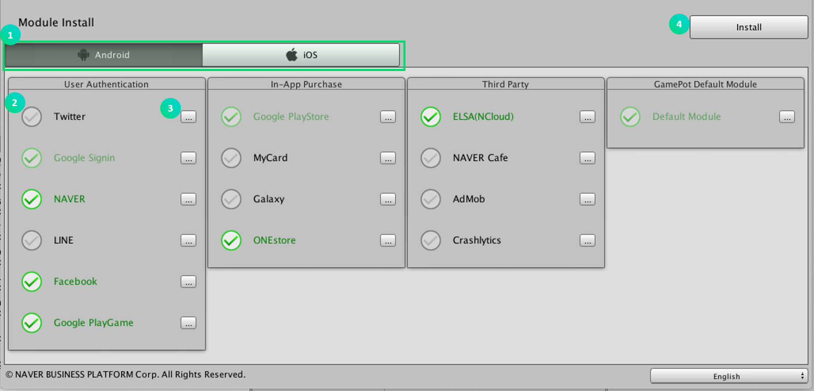

---
search:
  keyword:
    - gamepot
---

#### **We provide the <a href="https://guide.ncloud-docs.com/docs/en/home" target="_blank">[Manual]</a>and <a href="https://api.ncloud-docs.com/docs/en/home" target="_blank">[API Reference]</a>separately to offer more detailed information on how to use the NAVER CLOUD PLATFORM and help maximize the use of the API.**

<a href="https://api.ncloud-docs.com/docs/en/game-gamepot" target="_blank">Go to Gamepot API Reference >></a> 
<a href="https://guide.ncloud-docs.com/docs/en/game-gamepot-overview" target="_blank">Go to Gamepot Manual >></a>

# GamePot Tools - Beta

> ### This is a machine-translated document that may have errors in vocabulary, syntax, or grammar. We will soon provide you with the document translated by a professional translator.
>
> #### If you have any questions, please [contact us](https://www.ncloud.com/support/question).
>
> We will make every effort to further enhance our services.

This is a guide to GamePot Tools provided by GAMEPOT of NAVER CLOUD PLATFORM.

## Introduction to GAMEPOT Tools

**Q. What is Gamepot Tools?**

Package dependency issues that can occur during game development through the Unity engine can be identified and managed at a glance.
This is a management tool provided by GamePod SDK.

In addition to the existing library modules provided by the IMPT SDK, you can manage various third-party libraries with one click.

You can diagnose and resolve the package dependency status for each platform and module.

## 1. Getting Started

### Step 1. Get GamePot Tools plugin

Connect to the created GAMEPOT dashboard and download the latest plugin.
 
**Other> Download SDK> Unity> Download GamePot Tools**

### Step 2. Import plugin

> Unity version 2017.4.x or higher.

Select the downloaded `GamePotTools_xxxx.unitypackage` file from **Assets> Import Package> Custom Package** menu.

Check the plugin and import it to add it to the project.

### Step 3. Android/iOS

In the case of GamePot Tools, since it requires a namespace for each platform, it works normally with the Android/iOS build environment set. Please check if **File> Build Settings> Android/iOS** modules are all downloaded in Unity Editor.

## 2. Using

You can launch GamePot Tools by clicking the **Window> GamePot Tools** tab.

① Check the version of GamePot Tools and execute the update when the latest version is updated.

② You can check the gamepot guide on the web page.

③ You can check the Naver Cloud Platform Guide on the web page.

④ Download GamePot Sdk with minimum module configured.

### Android Fingerprint Tool

Various fingerprints are acquired from the KetStore set in the current project.

Click the **Key tool** button.

> Unity platform setting should be changed to Android.

① Check the KeyStore information set in the current project's PlayerSetting.

② Acquire the Sha1 fingerprint.

③ Obtain the Base64 hash.

④ Enter the path to the APK file and obtain the hash.

⑤ Move to Android studio installation page.

⑥ Move to JDK download page.

⑦ It moves to the local storage where the deleted package is saved through the Install function.

⑧ Move to the local storage where the cache data is stored.

### Gamepot Settings Tool

It manages various settings of GamePot.

#### Android

Set up the Gamepot project environment for Android Bulid.
It is reflected in `Android> mainTemplate.gradle`.

#### IOS

Gamepot project environment for IOS Bulid.
It is reflected in `IOS> GamePotConfig-info.plist`.

### Module Installation

Manage platform-specific modules and libraries.

① Platform can be selected. (Android / iOS)

② You can select the module you want to configure in the project. For modules that are already configured, they remain active.

③ You can check the dependency package list for the module and check the status in the project.

④ For the selected module list, configure the required dependency package.

#### Install Package

- Since there is no corresponding package in the project, download it from the CDN server.

- Duplicate package exists. Only the recommended version of the package is left, and the rest are deleted.

- The latest version of the package is installed. Stay current.
   If you click the'Selected' button again to deselect it, you can delete the existing package and download it again from the CDN server.

When you click the install button, package resolving will start.

### Change language

The language of GamePot Tools will be changed to the language of your choice. English, Korean, Japanese and Chinese are supported.

