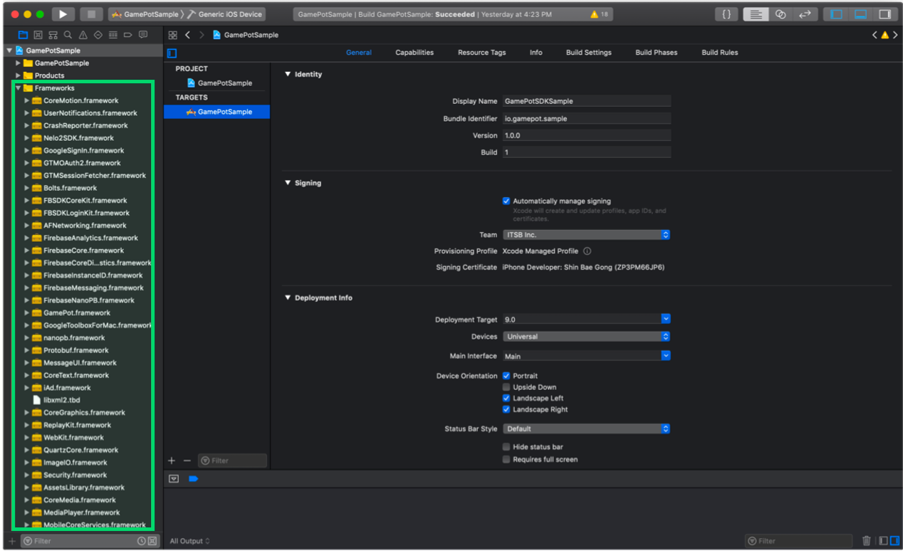
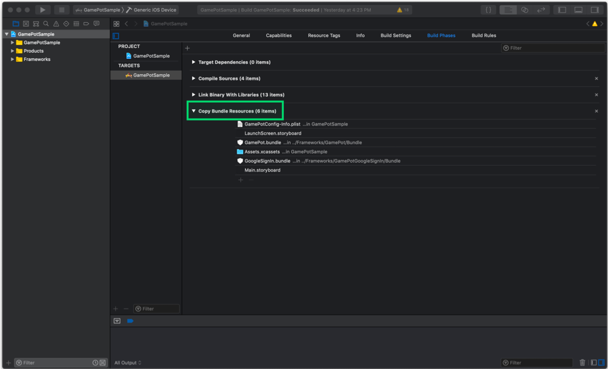
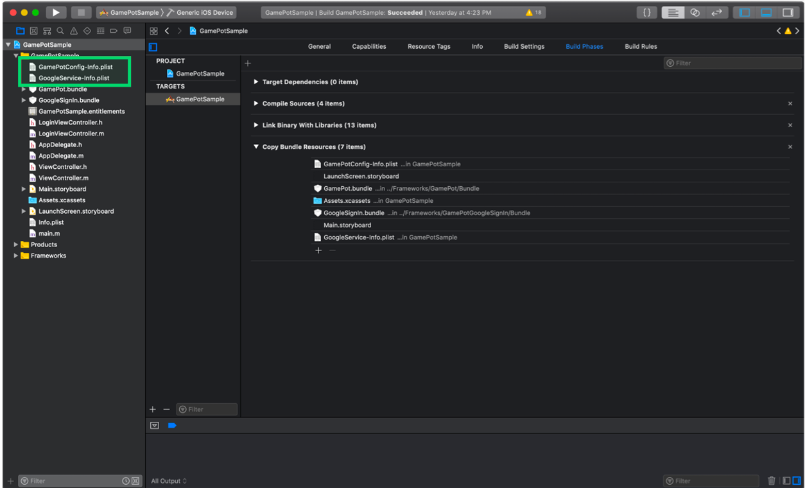
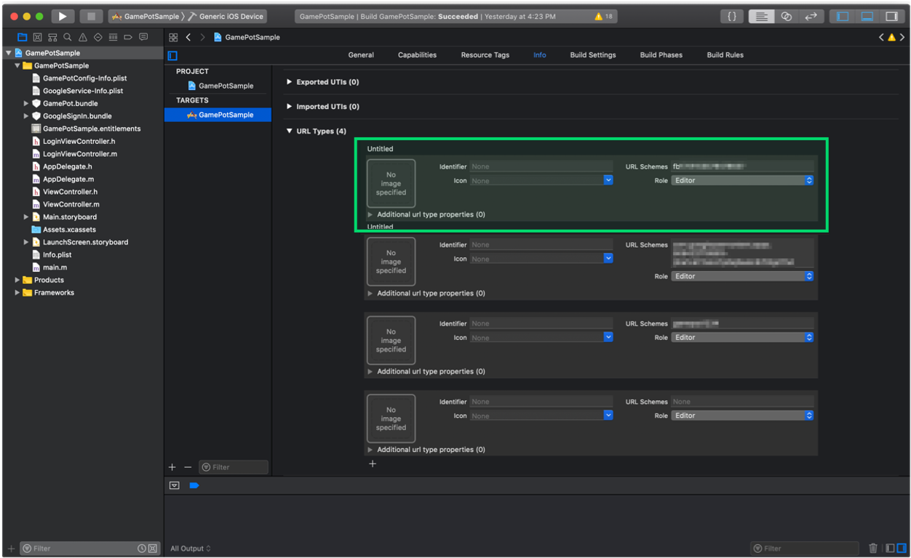
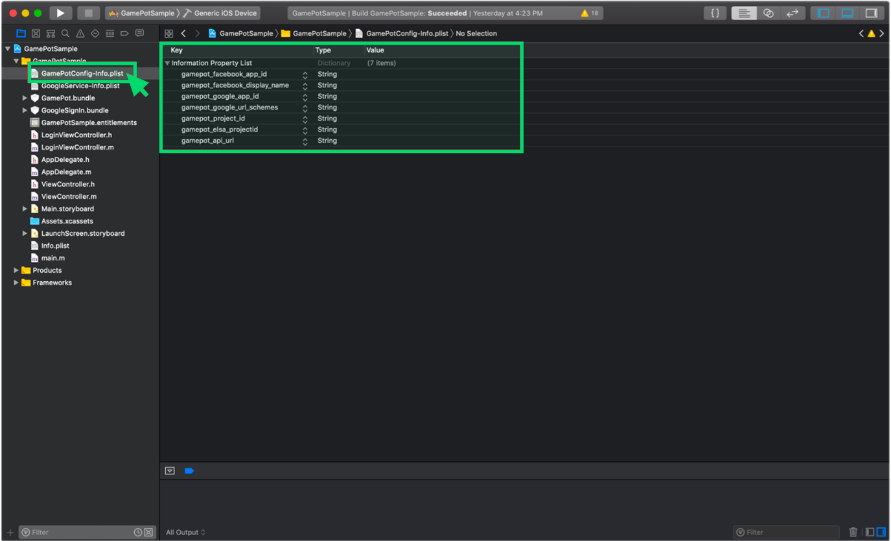
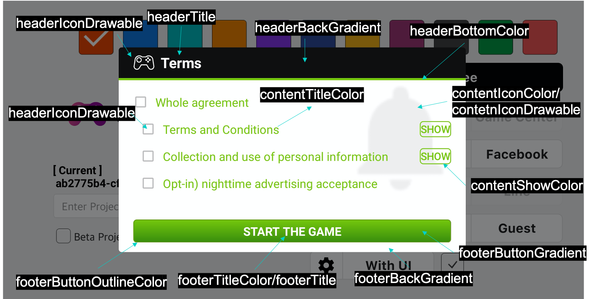

---
search:
  keyword:
    - gamepot
---

#### **We provide the <a href="https://guide.ncloud-docs.com/docs/en/home" target="_blank">[Manual]</a>and <a href="https://api.ncloud-docs.com/docs/en/home" target="_blank">[API Reference]</a>separately to offer more detailed information on how to use the NAVER CLOUD PLATFORM and help maximize the use of the API.**

<a href="https://api.ncloud-docs.com/docs/en/game-gamepot" target="_blank">Go to Gamepot API Reference >></a><br />
<a href="https://guide.ncloud-docs.com/docs/en/game-gamepotconsole" target="_blank">Go to Gamepot Manual >></a>

# iOS SDK

## 1. Get started

#### Step 1. Development environment setup

Install a development tool \(Xcode\) for developing iOS applications. A system environment for using GAMEPOT in iOS is as follows.

- OS: iOS 10.0 or later
- Development environment: Xcode

#### Step 2. Add frameworks



Add the downloaded iOS SDK to TARGETS of your Xcode project folder.

#### Step 3. Add dependencies

Required dependencies depend on the service you want to use.

Depending on the service, add the Dependencies by referring to the following table.

Dependencies for each service

| Service    | Framework                                                                                                                                                                                                                                                                                                                                                                                                                                                                                                                                                                                            | Dependencies                                                                                                                                                                                                                      | bundle                                   |
| :--------- | :--------------------------------------------------------------------------------------------------------------------------------------------------------------------------------------------------------------------------------------------------------------------------------------------------------------------------------------------------------------------------------------------------------------------------------------------------------------------------------------------------------------------------------------------------------------------------------------------------- | :-------------------------------------------------------------------------------------------------------------------------------------------------------------------------------------------------------------------------------- | :--------------------------------------- |
| Base       | AFNetworking.framework FirebaseAnalytics.framework FirebaseCore.framework FirebaseCoreDiagnostics.framework FirebaseInstanceID.framework FirebaseMessaging.framework FirebaseNanoPB.framework GamePot.framework GoogleToolboxForMac.framework nanopb.framework Protobuf.framework                                                                                                                                                                                                                                                                                                                    | libz.tbd WebKit.framework UserNotifications.framework                                                                                                                                                                             | GamePot.bundle                           |
| Login      | \[ Base \]<br> GamePotChannel.framework <br><br> \[ Google Sign In \]<br> GamePotGoogleSignIn.framework GoogleSignIn.framework GoogleSignInDependencies.framework <br><br>\[ Facebook \] <br>FBSDKCoreKit.framework FBSDKLoginKit.framework GamePotFacebook.framework<br><br> \[ LINE \]<br> GamePotLine.framework LineSDK.framework LineSDKObjC.framework<br><br> \[ NAVER \]<br> GamePotNaver.framework NaverThirdPartyLogin.framework<br><br> \[ Twitter \]<br> GamePotTwitter.framework<br> TwitterKit.framework \(Add to dynamic library\)<br> TwitterCore.framework \(Add to dynamic library\) | \[ Google Sign In \] AuthenticationServices.framework LocalAuthentication.framework<br><br> \[ Facebook \] SafariServices.framework<br><br> \[ LINE \]<br>SafariServices.framework<br><br> \[ Twitter \] SafariServices.framework | \[ Google Sign In \] GoogleSignIn.bundle |
| GameCenter | GamePotGameCenter.framework                                                                                                                                                                                                                                                                                                                                                                                                                                                                                                                                                                          |                                                                                                                                                                                                                                   |                                          |
| AppleID    | GamePotApple.framework                                                                                                                                                                                                                                                                                                                                                                                                                                                                                                                                                                               |                                                                                                                                                                                                                                   |                                          |


#### Step 4. Add bundle resources

In accordance with the service you wish to use, you should add a bundle resource file.

Add bundle resources by referring to “Dependencies for each service” above.



#### Step 5. Add InfoPlist



The GAMEPOT SDK uses Google Firebase. Therefore, add GoogleService-Info.plist created by setting Google Firebase to your project.

Also, add GamePotConfig-Info.plist containing default settings of the GAMEPOT SDK. If there is no GamePotConfig-Info.plist, create a file with the same name and add the required keys and values to the file.

**Configure GamePotConfig-Info.plist**


```markup
gamepot_project_id: GAMEPOT Project ID
gamepot_elsa_projectid: GAMEPOT log project ID (optional)
```

#### Step 6. Add build options

Add -ObjC to **Build Settings &gt; Linking &gt; Other Linker Flags**.


#### Step 7. Edit InfoPlist

Add user rights options to get user roles shown below in Targets &gt;&gt; Info &gt;&gt; Custom iOS Target Properties.

The user roles are used for uploading files in the GamePot customer center.

```text
NSCameraUsageDescription
NSPhotoLibraryUsageDescription
```

iOS 14 or later version

Starting with iOS 14, when IDFA value is obtained, the user must obtain permission.

It has been changed to enable acquisition of IDFA values.

Therefore, if you use a pop-up that obtains authority to the user when obtaining the IDFA value,
In Targets >> Info >> Custom iOS Target Properties, please add the user rights acquisition option below.

> 2020.09.11<br/>
> When Apple acquires IDFA value, the mandatory application of pop-up to acquire permission to user has been postponed until early 2021.<br/>
> Please refer to the link below.<br/> > https://developer.apple.com/news/?id=hx9s63c5

```text
NSUserTrackingUsageDescription
```

#### Step 8. Set up Google Sign In environment

Add frameworks and dependencies by referring to **Login &gt; Google Sign In** in Dependencies for each service.

Copy `REVERSED_CLIENT_ID` in GoogleService-Info.plist and paste it into URL Schemes in **Info &gt; URL Types**.



**Configure GamePotConfig-Info.plist**


```markup
gamepot_google_app_id: CLIENT_ID in GoogleService-Info.plist
gamepot_google_url_schemes: REVERSED_CLIENT_ID in GoogleService-Info.plist
```

#### Step 9. Set up Facebook login environment

Add frameworks and dependencies by referring to **Login &gt; Facebook** in “Dependencies for each service.”

Add your Facebook App ID to **Info &gt; URL Types**, in the form of fb+Facebook App ID.


Add the following to **LSApplicationQueriesSchemes** in **Info &gt; iOS Target Property**.

- fbapi
- fb-messenger-share-api
- fbauth2
- fbshareextension


**Configure GamePotConfig-Info.plist**



```markup
gamepot_facebook_app_id : Facebook App ID
gamepot_facebook_display_name : Facebook display name
```

#### Step 10. Set up LINE login environment

**Configure GamePotConfig-Info.plist**

```markup
gamepot_line_channelid : Line Channel ID
gamepot_line_url_schemes : Line URL Scheme (line3rdp.{Project bundle ID})
```

#### Step 11. Set up Twitter login environment

**Configure GamePotConfig-Info.plist**

```markup
gamepot_twitter_consumerkey : Twitter Consumer Key
gamepot_twitter_consumersecret :  Twitter Consumer Secret
```

#### Step 12. Set up Naver login environment

**Configure GamePotConfig-Info.plist**

```text
gamepot_naver_clientid : Naver Client Id
gamepot_naver_secretid : Naver Secret Id
gamepot_naver_urlscheme : Naver Url Scheme
```

Add the following to **LSApplicationQueriesSchemes** in **Info &gt; iOS Target Property**.

- naversearchapp
- naversearchthirdlogin
- navercafe

Add the value entered in gamepot_naver_urlscheme in **Info &gt; URL Types.**

#### Step 13. Set up AppleID login environment

**Xcode &gt; TARGETS &gt; Signing & Capabilities &gt; + Capability &gt; Add Sign In with Apple**

## 2. Initialization

Add the following code to the AppDelegate file.

```text
#import <GamePot/GamePot.h>

#if __has_include(<AppTrackingTransparency/AppTrackingTransparency.h>)
#import <AppTrackingTransparency/AppTrackingTransparency.h>
#endif

- (BOOL)application:(UIApplication *)application didFinishLaunchingWithOptions:(NSDictionary *)launchOptions {
    ...
    // GamePot SDK Initialize
    [[GamePot getInstance] setup];

    // Push Permission
    if(SYSTEM_VERSION_GRATERTHAN_OR_EQUALTO(@"10.0"))
    {
        UNUserNotificationCenter *center = [UNUserNotificationCenter currentNotificationCenter];
        center.delegate = self;
        [center requestAuthorizationWithOptions:(UNAuthorizationOptionSound | UNAuthorizationOptionAlert | UNAuthorizationOptionBadge) completionHandler:^(BOOL granted, NSError * _Nullable error){
            if(!error){
                dispatch_async(dispatch_get_main_queue(), ^{
                    [[UIApplication sharedApplication] registerForRemoteNotifications];
                });
            }
        }];
    }
    else
    {
        // Code for old versions
        UIUserNotificationType allNotificationTypes = (UIUserNotificationTypeSound | UIUserNotificationTypeAlert | UIUserNotificationTypeBadge);
        UIUserNotificationSettings *settings = [UIUserNotificationSettings settingsForTypes:allNotificationTypes categories:nil];
        [application registerUserNotificationSettings:settings];
        [application registerForRemoteNotifications];
    }

    // Call the permission request popup to get the IDFA value in iOS 14 version
    // If AppTrackingTransparency.framework is not added to the project, it is not called.
#if __has_include(<AppTrackingTransparency/AppTrackingTransparency.h>)
   if (@available(iOS 14, *)) {
       if(NSClassFromString(@"ATTrackingManager"))
       {
           // If a listener is not registered, then the request pop-up won't be called.
           [ATTrackingManager requestTrackingAuthorizationWithCompletionHandler:^(ATTrackingManagerAuthorizationStatus status) {

               switch (status)
               {
                   case ATTrackingManagerAuthorizationStatusNotDetermined:
                       break;
                   case ATTrackingManagerAuthorizationStatusRestricted:
                       break;
                   case ATTrackingManagerAuthorizationStatusDenied:
                       break;
                   case ATTrackingManagerAuthorizationStatusAuthorized:
                       break;
                   default:
                       break;
               }
           }];
       }
   }
#endif
    ...
}

 // Push
- (void)application:(UIApplication *)application didRegisterForRemoteNotificationsWithDeviceToken:(NSData *)deviceToken
{
    ...
    [[GamePot getInstance] handleRemoteNotificationsWithDeviceToken:deviceToken];
    ...
}

- (void)applicationWillEnterForeground:(UIApplication *)application {
    [[GamePotChat getInstance] start];
}

- (void)applicationDidEnterBackground:(UIApplication *)application {
    [[GamePotChat getInstance] stop];
}
```

## 3. Login, Logout, Delete Member

Use various login SDKs, such as Google, Facebook, and NAVER.

#### Step 1. Settings

```text
// AppDelegate.m
#import <GamePotChannel/GamePotChannel.h>

// For Google Login
#import <GamePotGoogleSignIn/GamePotGoogleSignIn.h>

// For Facebook Login
#import <GamePotFacebook/GamePotFacebook.h>

// For AppleID Login
#import <GamePotApple/GamePotApple.h>

// For Line Login
#import <GamePotLine/GamePotLine.h>

// For Twitter Login
#import <GamePotTwitter/GamePotTwitter.h>

// For Naver Login
#import <GamePotNaver/GamePotNaver.h>

- (BOOL)application:(UIApplication *)application didFinishLaunchingWithOptions:(NSDictionary *)launchOptions {
    ...
    // Initialize GamePotSDK channel. You must use an addChannel for each channel,
    // and Guest type is included by default.
    // Initialize Google Login
    GamePotChannelInterface* google     = [[GamePotGoogleSignIn alloc] init];
    [[GamePotChannelManager getInstance] addChannelWithType:GOOGLE interface:google];

    // Initialize Facebook login.
    GamePotChannelInterface* facebook   = [[GamePotFacebook alloc] init];
    [[GamePotChannelManager getInstance] addChannelWithType:FACEBOOK interface:facebook];

    // Initialize AppleID login.
    GamePotChannelInterface* apple      = [[GamePotApple alloc] init];
    [[GamePotChannel getInstance] addChannelWithType:APPLE interface:apple];

    // Initialize Line login.
    GamePotChannelInterface* line = [[GamePotLine alloc] init];
    [[GamePotChannel getInstance] addChannelWithType:LINE interface:line];

    // Initialize Twitter login.
    GamePotChannelInterface* twitter = [[GamePotTwitter alloc] init];
    [[GamePotChannel getInstance] addChannelWithType:TWITTER interface:twitter];

      // Initialize Naver login.
      GamePotChannelInterface* naver = [[GamePotNaver alloc] init];
      [[GamePotChannel getInstance] addChannelWithType:NAVER interface:naver];

    // Required for login processing.
    [[GamePotChannel getInstance] application:application didFinishLaunchingWithOptions:launchOptions];

    ...
}

- (BOOL)application:(UIApplication *)app openURL:(NSURL *)url options:(NSDictionary<UIApplicationOpenURLOptionsKey,id> *)options
{
    // Required for login processing.
    BOOL nChannelResult = [[GamePotChannel getInstance] application:app openURL:url options:options];
    return nChannelResult;
}
```

#### Step 2. Login

Click the login button to link.

```text
#import <GamePotChannel/GamePotChannel.h>
// Define login type.
// GamePotChannelType.GOOGLE
// GamePotChannelType.FACEBOOK
// GamePotChannelType.GUEST
// GamePotChannelType.LINE
// GamePotChannelType.TWITTER
// GamePotChannelType.NAVER
// GamePotChannelType.APPLE

// Call this method when Google login button is clicked.
[[GamePotChannel getInstance] Login:GOOGLE viewController:self success:^(GamePotUserInfo* userInfo) {
    // Login Complete
} cancel:^{
    // When the user cancels login during login attempts
} fail:^(NSError *error) {
    // Error occurs during login
    // TODO: Display a pop-up message regarding reasons for failure.
    // TODO: Use [error localizedDescription].
}];
```

#### Step 3. Auto login

GAMEPOT supports auto login.

```text
#import <GamePotChannel/GamePotChannel.h>

// Call this method to automatically log the user in with the previous login information.
// lastLoginType: Accesses the most recent login information.
GamePotChannelType type = [[GamePotChannel getInstance] lastLoginType];

if(type != NONE)
{
    // Log in with the user's last login type.
    // Call the following to perform auto login.
    [[GamePotChannel getInstance] Login:type viewController:self success:^(GamePotUserInfo* userInfo) {

    } cancel:^{

    } fail:^(NSError *error) {
        // TODO: Display a pop-up message regarding reasons for failure.
        // TODO: Use [error localizedDescription].
    }];
}
else
{
    // There is no last login information. Move to the login screen where the user can log in.
}
```

#### Step 4. Logout

Logs out of the current user account.

```text
#import <GamePotChannel/GamePotChannel.h>

[[GamePotChannel getInstance] LogoutWithSuccess:^{
    // Moves to the initial screen after logout is completed.
} fail:^(NSError *error) {
    // Displays an error message regarding logout failure.
    // TODO: Display a pop-up message regarding reasons for failure.
    // TODO: Use [error localizedDescription].
}];
```

#### Step 5. Delete member

Deletes the current member account.

```text
#import <GamePotChannel/GamePotChannel.h>

[[GamePotChannel getInstance] DeleteMemberWithSuccess:^{
    // Moves to the login screen when deleting the member has succeeded.
} fail:^(NSError *error) {
    // Failed to delete account.
    // TODO: Display a pop-up message regarding reasons for failure.
    // TODO: Use [error localizedDescription].
}];
```

#### Step 6. Authentication check

After the login is complete, the login information is passed from the developer server to the GAMEPOT server to perform authentication checks.

For more information, refer to `Authentication check` under `Server to server api.`

## 4. Connect/Disconnect Accounts

It connects or disconnects a game account to or from multiple social media accounts \(including Google/Facebook\).\(At least one social media account should be connected.\)

Implement the connection UI in the game and call the following code when the connect button is clicked.

#### Step 1. Connect/Disconnect accounts

Connect user accounts with social media accounts including Google and Facebook.

```text
#import <GamePotChannel/GamePotChannel.h>

// Define types.
// GamePotChannelType.GOOGLE
// GamePotChannelType.FACEBOOK
// GamePotChannelType.LINE
// GamePotChannelType.TWITTER
// GamePotChannelType.NAVER
// GamePotChannelType.APPLE

[[GamePotChannel getInstance] CreateLinking:GOOGLE viewController:self success:^(GamePotUserInfo *userInfo) {
    // TODO: Connection completed. Display a pop-up message to show the message about the connection result. (Example: Successfully connected.)
} cancel:^{
    // TODO: When the user cancels the account connection
} fail:^(NSError *error) {
    // TODO: Connection failed. Display a pop-up message regarding reasons for connection failure.
    // TODO: Use [error localizedDescription].
}];
```

#### Step 2. List of connected accounts

Check whether an account has been connected using social media accounts.

```text
#import <GamePotChannel/GamePotChannel.h>

// Define types.
// GamePotChannelType.GOOGLE
// GamePotChannelType.FACEBOOK
// GamePotChannelType.LINE
// GamePotChannelType.TWITTER
// GamePotChannelType.NAVER
// GamePotChannelType.APPLE

// Return connection results for each type.
BOOL isGoogleLinked = [[GamePotChannel getInstance] isLinked:GOOGLE];

// Return connection types in JsonString.
NSString* linkedList = [[GamePotChannel getInstance] getLinkedListJsonString];
```

#### Step 3. Disconnect accounts

Disconnect user accounts from their social media accounts.

```text
#import <GamePotChannel/GamePotChannel.h>

[[GamePotChannel getInstance] DeleteLinking:GOOGLE success:^{
     // TODO: Disconnected successfully. Display the message showing the disconnection result. (e.g. Successfully disconnected.)
} fail:^(NSError *error) {
     // TODO: Disconnection failed. Display a pop-up message regarding reasons for disconnection failure.
     // TODO: Use [error localizedDescription].
}];
```

## 5. Payment

#### Step 1. Settings

Payment results are implemented as a delegate. Add a delegate as in the example below.

```text
#import <GamePot/GamePot.h>

@interface ViewController () <GamePotPurchaseDelegate>
@end
@implementation ViewController

- (void)viewDidLoad
{
    ...
    [[GamePot getInstance] setPurchaseDelegate:self];
    ...
}

- (void)GamePotPurchaseSuccess:(GamePotPurchaseInfo *)_info
{
    // Payment succeeded.

    // Must add this code snippet to pass the payment event to the ad platform! Add it.
    [[GamePotAd getInstance] tracking:BILLING obj:_info];
}

- (void)GamePotPurchaseFail:(NSError *)_error
{
    // Payment error
    // TODO: Display a pop-up message regarding reasons for failure.
    // TODO: Use [error localizedDescription].
}

- (void)GamePotPurchaseCancel
{
    // Cancellation during payment attempts.
    // Display a popup message "The payment is canceled."
}
@end
```

#### Step 2. Payment attempt

```text
Case 1: General payment

#import <GamePot/GamePot.h>

// productId: Enter the product ID registered in the store.
[[GamePot getInstance] purchase:productid];
```

```text
Case 2: Managing receipt numbers separately at the payment time:

#import <GamePot/GamePot.h>

// productId: Put the product ID registered in the store.
// uniqueId: Put the receipt numbers managed separately.
[[GamePot getInstance] purchase:productid uniqueId:uniqueid];
```

```text
Case 3: Sending receipt numbers/server ID/character ID/further information processed in payments to webhook:

#import <GamePot/GamePot.h>

// productId: Put the product ID registered in the store.
// uniqueId: Put the receipt numbers managed separately.
// serverId: Use the server ID of the character who made the payment.
// playerId: Enter the character's ID who made the payment.
// etc.: Enter the other information from the character who made the payment.
[[GamePot getInstance] purchase:productid uniqueId:uniqueid serverId:serverid playerId:playerid etc:etc]];
```

#### Step 3. **Get purchased items list**

Get in-app item list transferred from stores.

```text
NSArray<SKProduct*>* itemList = [[GamePot getInstance] getDetails];

// When getting currencies and prices for the device's settings
[[GamePot getInstance] getLocalizePrice:[product productIdentifier]];
```

#### Step 4. Provide purchased items

GAMEPOT requests items from the developer server after checking receipts from the store by using the Server to server api, thereby preventing illegal payments.

Refer to `Purchase` in `Server to server api` to implement this.

## 6. Other APIs

### Login UI supported by SDK

SDK provides an independent, complete Login UI.

```c++
#import <GamePot/GamePot.h>
#import <GamePotChannel/GamePotChannel.h>

NSArray* order = @[@(GOOGLE), @(FACEBOOK), @(APPLE),@(NAVER), @(LINE), @(TWITTER), @(GUEST)];
GamePotChannelLoginOption* option = [[GamePotChannelLoginOption alloc] init:order];
[option setShowLogo:YES];

 [[GamePotChannel getInstance] showLoginWithUI:self option:option success:^(GamePotUserInfo *userInfo) {
    // Login succeeded
    } cancel:^{
    // Cancel login
    } fail:^(NSError *error) {
    // Login failed
    } update:^(GamePotAppStatus *appStatus) {
    // Update
    } maintenance:^(GamePotAppStatus *appStatus) {
    // Check
    } exit:^{
    // Close showLoginWithUI
    }
];
```

#### Setting Login UI image logo

The image logo at the top of the login UI shows the default image within the SDK, and this can be replaced by users.

**Customizing Image Logo**

> The image logo is the ic_stat_gamepot_logo.png file in GamePot.bundle.

Rename the image file to `ic_stat_gamepot_login_logo.png` and replace it.

(Recommended image size: 310x220)

### Coupon

Call the following code to use a coupon entered by a user.

> The developer must implement the screen UI to get coupons.

```text
#import <GamePot/GamePot.h>

[[GamePot getInstance] coupon:/*Coupon entered by the user*/ handler:^(BOOL _success, NSError *_error) {
    if(_success)
    {
        // TODO: The coupon use is shown as a message. Display this message as a pop-up message in the game.
    }
    else
    {
        // TODO: The reason for coupon use failure is shown in _error.
        // Display [_error localizedDescription] as a pop-up message in the game.
    }
}];
```

#### Provide items

When a coupon is used successfully, request an item from the developer server by using the Server to server api.

Refer to `Item` in `Server to server api` to implement this.

### Push

```text
#import <GamePot/GamePot.h>

// Push On/Off
[[GamePot getInstance] setPushEnable:YES success:^{

} fail:^(NSError *error) {

}];

// Night Push On/Off
[[GamePot getInstance] setNightPushEnable:YES success:^{

} fail:^(NSError *error) {

}];

// Set all Push/Night Push at the same time.
// For games that prompt users to turn Push/Night Push on or off before login, call the following code snippet after login.
[[GamePot getInstance] setPushStatus:YES night:YES ad:YES success:^{
    <#code#>
} fail:^(NSError *error) {
    <#code#>
}];
```

### Image Push
iOS 앱에서 알림 이미지를 수신하고 처리하려면 알림 서비스 확장 프로그램을 추가해야 합니다.

- Notification Service Extension 프로젝트에 추가하기
    1. Xcode -> File -> New -> Target.. 메뉴 클릭
    2. Target을 클릭하여 출력되는 화면에서 Notification Service Extension을 선택 후 Next를 클릭
    3. 이후 추가될 Target(Notification Service Extension)의 Project Name을 지정 후 Finish를 클릭 -> Notification Service Extension 모듈이 추가된것을 확인

- 알림 서비스 확장 프로그램 추가하기
    1. 생성된 Notification Service Extension 모듈의 NotificationService.h 파일을 아래와 같이 수정

        ```text
        // GamePot/GamePotNotificationServiceExtension.h를 Import
        // #import <UserNotifications/UserNotifications.h>
        #import <GamePot/GamePotNotificationServiceExtension.h>

        // UNNotificationServiceExtension 대신 GamePotNotificationServiceExtension를 상속
        // @interface NotificationService : UNNotificationServiceExtension
        @interface NotificationService : GamePotNotificationServiceExtension
        @end
        ```

    2. 생성된 Notification Service Extension 모듈의 NotificationService.m 파일을 아래와 같이 수정
        ```text
        ...
        - (void)didReceiveNotificationRequest:(UNNotificationRequest *)request withContentHandler:(void (^)(UNNotificationContent * _Nonnull))contentHandler {
            // self.contentHandler = contentHandler;
            // self.bestAttemptContent = [request.content mutableCopy];

            // Modify the notification content here...
            // self.bestAttemptContent.title = [NSString stringWithFormat:@"%@ [modified]", self.bestAttemptContent.title];

            // self.contentHandler(self.bestAttemptContent);
            [super didReceiveNotificationRequest:request withContentHandler:contentHandler];
        }
        ...
        ```
    3. 생성된 Notification Service Extension 모듈의 Targets >> Build Phases >> Link Binary With Libraries에 GamePot.framework 추가


### Notices

This feature displays images uploaded in Dashboard > Notice.

#### Call

```text
[[GamePot getInstance] showNotice:/*viewController*/ setSchemeHandler:^(NSString *scheme) {
    NSLog(@"scheme = %@", scheme);
}];
```

### Notice (Call by classification)

Dashboard - This feature displays the classified image from the images uploaded in Notice.

#### Call

```text
[[GamePot getInstance] showEvent:/*viewController*/ setType:/*Type*/ setSchemeHandler:^(NSString *scheme) {
    NSLog(@"scheme = %@", scheme);
}];
```

### Customer service

This is a communication channel between users and administrators, which is connected with Dashboard > Customer support.

UI for Inquiries changes according to the device's language. It supports Korean, English, Japanese, Chinese (Simplified, Traditional). English is applied for other languages.

#### Call

```text
[[GamePot getInstance] showHelpWebView:(UIViewController *)];
```

It supports external links so that customers who haven't logged in can register inquiries.

#### Call

```text
// showWebView Type
    // WEBVIEW_NORMAL // No Back button.
    // WEBVIEW_NORMALWITHBACK // Back button exists.

    [[GamePot getInstance] showWebView:/*Current ViewController*/ setType:/*Type*/ setURL:/*external inquiry access URL*/];
```

### \(Local Push notification\)

This feature enables devices to display push notifications independently, not via the push server.

#### Call

#### Add push

Refer to the following code to display local push notifications at a specified time.

> The pushid passed as a return value must be managed by the developer.

```text
 NSDateFormatter* formatter = [[NSDateFormatter alloc] init];
 [formatter setDateFormat:@"yyyy-MM-dd HH:mm:ss"];

 NSString* strDate = [formatter stringFromDate:[[NSDate date] dateByAddingTimeInterval:30]];

 int pushId  = [[GamePot getInstance] sendLocalPush:@"Title" setMessage:@"Message" setDateString:strDate];
```

#### Cancel push

You can cancel previously added push notifications using the pushid you get when adding push.

```text
[[GamePot getInstance] cancelLocalPush:(int)pushId];
```

### Maintenance check and force update

If you need maintenance checks or force updates, you can enable this feature in Dashboard > Operation.

#### Call

Modify the previously applied APIs as described below.

#### 1. Login API

```text
[[GamePotChannel getInstance] Login:GAMECENTER viewController:self
    success:^(GamePotUserInfo* userInfo) {
            // Login Complete. Handle this according to the game logic.
    } cancel:^{
            // When a user cancels login.
    } fail:^(NSError *error) {
            // Login failed. Use [error localizedDescription] to show an error message.
    } update:^(GamePotAppStatus *appStatus) {
        // TODO: When you need force update. Call the following API to enable the SDK to display pop-ups by itself.
        // TODO: You can also customize the function without calling this API.
        [[GamePot getInstance] showAppStatusPopup:self setAppStatus:appStatus
         setCloseHandler:^{
            // TODO: This API is called to close the app if the showAppStatusPopup API is called.
            // TODO: Handle the shutdown process.
        } setNextHandler:^(NSObject* resultPayload) {
            // TODO : When you set the dashboard update as recommended, the "Do next time" button will appear.
            // Called when the user selects that button.
            // TODO : Use the resultPayload information to process it in the same way as when login has been completed.
            // GamePotUserInfo* userInfo = (GamePotUserInfo*)resultPayload;

        }];
    } maintenance:^(GamePotAppStatus *appStatus) {
          // TODO: When a maintenance check is in progress. Call the following API to enable the SDK to display pop-ups by itself.
        // TODO: You can also customize the function without calling this API.
        [[GamePot getInstance] showAppStatusPopup:self setAppStatus:appStatus
         setCloseHandler:^{
            // TODO: This API is called to close the app if the showAppStatusPopup API is called.
            // TODO: Handle the shutdown process.
        }];
    }];
```

### Agree to terms and conditions

Provides UI to easily obtain agreement to "Terms of service" and "Collection and use of personal information".

11 types of new, `improved themes` are provided in addition to two `basic themes`, `BLUE` and `GREEN`.

Each area can be customized.

#### Call Agree to terms and conditions

> Handle Agree to Terms and Conditions pop-up according to games.
>
> When you click the 'View' button, you can apply and edit the content in the dashboard.

```text
// BLUE theme [[GamePotAgreeOption alloc] init:BLUE];
// GREEN theme [[GamePotAgreeOption alloc] init:GREEN];

// Improved themes
//  [[GamePotAgreeOption alloc] init:MATERIAL_RED];
//  [[GamePotAgreeOption alloc] init:MATERIAL_BLUE];
//  [[GamePotAgreeOption alloc] init:MATERIAL_CYAN];
//  [[GamePotAgreeOption alloc] init:MATERIAL_ORANGE];
//  [[GamePotAgreeOption alloc] init:MATERIAL_PURPLE];
//  [[GamePotAgreeOption alloc] init:MATERIAL_DARKBLUE];
//  [[GamePotAgreeOption alloc] init:MATERIAL_YELLOW];
//  [[GamePotAgreeOption alloc] init:MATERIAL_GRAPE];
//  [[GamePotAgreeOption alloc] init:MATERIAL_GRAY];
//  [[GamePotAgreeOption alloc] init:MATERIAL_GREEN];
//  [[GamePotAgreeOption alloc] init:MATERIAL_PEACH];
GamePotAgreeOption* option = [[GamePotAgreeOption alloc] init:BLUE];
[[GamePot getInstance] showAgreeView:self option:option handler:^(GamePotAgreeInfo *result) {
   // [result agree]: It is true if all required terms and conditions have been agreed to
   // [result agreeNight]: It is true if agree to receive night ad push has been agreed to, false if it has not.
   // Pass agreeNight value via [[GamePot getInstance] setNightPushEnable]; api
   // after logging in.
}];
```

#### Customization

Change colors depending on the games without using themes.

You can specify colors to each area in `GamePotAgreeOption` before calling Agree to terms and conditions.

```text
 GamePotAgreeOption* option = [[GamePotAgreeOption alloc] init:GREEN];

[option setHeaderBackGradient:@[@0xFF00050B,@0xFF0F1B21]];
[option setHeaderTitleColor:0xFF042941];
[option setContentBackGradient:@[@0xFF112432,@0xFF112432]];
[option setContentIconColor:0xFF042941];
[option setContentCheckColor:0xFF91adb5];
[option setContentTitleColor:0xFF98b3c6];
[option setContentShowColor:0xFF98b3c6];
[option setFooterBackGradient:@[@0xFF112432,@0xFF112432]];
[option setFooterButtonGradient:@[@0xFF1E3A57,@0xFF57B2E2]];
[option setFooterButtonOutlineColor:0xFF0b171a];
[option setFooterTitleColor:0xFFFFFFD5];

// Change description
[option setAllMessage:@"Agree to all"];
[option setTermMessage:@"Required) Terms of service"];
[option setPrivacyMessage:@"Required) Terms and conditions of the privacy policy"];
[option setPushMessage:@"선택) 일반 푸쉬 수신 동의"];
[option setNightPushMessage:@"Optional) Agree to receive night push"];
[option setFooterTitle:@"Start game"];

// Set to @"" if not used
[option setHeaderTitle:@"Agree to Terms and Conditions"];

// 일반 광고성 수신동의 버튼 노출 여부
[option setShowPush:YES];

// Whether to show Agree to Receive Night Ad push button
[option setShowNightPush:YES];

// 일반 광고성 수신동의 링크 설정 (미사용 시, 설정 안함)
[option setPushDetailURL:@"https://..."];

// 야간 광고성 수신동의 링크 설정 (미사용 시, 설정 안함)
[option setNightPushDetailURL:@"https://..."];
```

Each parameter applies to the following area:

> contentIconDrawable's image does not appear in iOS.



### Terms of service

Call terms of service UI.

> Enter contents in Dashboard > Customer support > Set terms of service first.

```java
#import <GamePot/GamePot.h>

[[GamePot getInstance] showTerms:/*ViewController*/];
```

### Terms and conditions of the privacy policy

Call terms and conditions of the privacy policy UI.

> Enter contents in Dashboard > Customer support > Set terms and conditions of the privacy policy first.

```java
#import <GamePot/GamePot.h>

[[GamePot getInstance] showPrivacy:/*ViewController*/];
```

### Refund policy

Call refund policy UI.

> Enter contents in Dashboard > Customer support > Set refund policy first.

```java
#import <GamePot/GamePot.h>

[[GamePot getInstance] showRefund:/*ViewController*/];
```

### Remote configuration

Import parameter values registered with the dashboard from the client.

> Add parameters first in Dashboard > Settings > Remote configuration screen.

The parameters added are loaded at login. You can call them after they have been loaded.

```java
#import <GamePot/GamePot.h>

//key : Parameter string
NSString *str_value = [[GamePot getInstance] getConfig:(NSString*)key];

//Import all parameters added in the dashboard in json format.
NSArray *json_value = [[GamePot getInstance] getConfigs];
```

### Transfer game logs

You can call the logs that contain in-game information and view them in `Dashboard` > `Game.`

Check reserved words from the table below:

| Reserved Words                    | Required | Type   | Description    |
| :-------------------------------- | :------- | :----- | :------------- |
| GamePotSendLogCharacter.NAME      | Required | String | Character Name |
| GamePotSendLogCharacter.LEVEL     | Select   | String | Level          |
| GamePotSendLogCharacter.SERVER_ID | Select   | String | Server ID      |
| GamePotSendLogCharacter.PLAYER_ID | Select   | String | Character ID   |
| GamePotSendLogCharacter.USERDATA  | Select   | String | ETC            |

```java
#import <GamePot/GamePotSendLog.h>
#import <GamePot/GamePotSendLogCharacter.h>

GamePotSendLogCharacter* info = [[GamePotSendLogCharacter alloc] init];

[info put:@"name" forKey:GAMEPOT_NAME];
[info put:@"playerid" forKey:GAMEPOT_PLAYER_ID];
[info put:@"serverid" forKey:GAMEPOT_SERVER_ID];
[info put:@"level" forKey:GAMEPOT_LEVEL];
[info put:@"userdata" forKey:GAMEPOT_USERDATA];

BOOL result = [GamePotSendLog characterInfo:info];

// Result is TRUE : validation success. Logs will send to GamePot Server
// Result is FALSE : validation was failed. Please check logcat

```

### GDPR Terms and Conditions Checklist

Shows the list of GDPR terms and conditions items activated from Dashboard.

```c++
(NSArray*) [[GamePot getInstance] getGDPRCheckedList];

//Each parameter returned applies to the following settings in Dashboard.
gdpr_privacy: Privacy Policy
gdpr_term: Terms and Conditions
gdpr_gdpr: GDPR Terms and Conditions
gdpr_push_normal: Consent to receive event push notifications
gdpr_push_night: Consent to receive nighttime event push notifications (only applicable in Korea)
gdpr_adapp_custom: Consent to personalized advertisement (for countries where GDPR is applicable)
gdpr_adapp_nocustom: Consent to non-personalized advertisement (for countries where GDPR is applicable)
```

## 7. Download

You can download the SDK from GAMEPOT Dashboard's **Download SDK.**

# Appendix

### It supports third-party SDK connection

TODO : Description

## Login

TODO : Description

> It does not support auto login. Call is required every time.

| Parameter Name | Required | Type             | Description                     |
| :------------- | :------- | :--------------- | :------------------------------ |
| viewController | Required | UIViewController | Current ViewContoller           |
| userid         | Required | NSString         | User’s unique ID                |
| success        | Required | String           | Call back upon success          |
| fail           | Required | String           | Call back when failed           |
| update         | Select   | String           | Call back when the update works |
| maintenance    | Select   | String           | Call back when the check works  |

```text
NSString userid = @"memberid of 3rd party sdk";

[[GamePotChannel getInstance] loginByThirdPartySDK:self uId:userid success:^(GamePotUserInfo* userInfo) {
    // Login Complete. Handle this according to the game logic.
} cancel:^{
    // When a user cancels login.
} fail:^(NSError *error) {
    // Login failed. Use [error localizedDescription] to show an error message.
} update:^(GamePotAppStatus *appStatus) {
    // TODO: When you need force update. Call the following API to enable the SDK to display pop-ups by itself.
    // TODO: You can also customize the function without calling this API.
    [[GamePot getInstance] showAppStatusPopup:self setAppStatus:appStatus
        setCloseHandler:^{
        // TODO: This API is called to close the app if the showAppStatusPopup API is called.
        // TODO: Handle the shutdown process.
    } setNextHandler:^(NSObject* resultPayload) {
        // TODO : When you set the dashboard update as recommended, the "Do next time" button will appear.
        // Called when the user selects that button.
        // TODO : Use the resultPayload information to process it in the same way as when login has been completed.
        // GamePotUserInfo* userInfo = (GamePotUserInfo*)resultPayload;

    }];
} maintenance:^(GamePotAppStatus *appStatus) {
    // TODO: When a maintenance check is in progress. Call the following API to enable the SDK to display pop-ups by itself.
    // TODO: You can also customize the function without calling this API.
    [[GamePot getInstance] showAppStatusPopup:self setAppStatus:appStatus
        setCloseHandler:^{
        // TODO: This API is called to close the app if the showAppStatusPopup API is called.
        // TODO: Handle the shutdown process.
    }];
}];
```

## Payment

TODO : Description

> Purchased items must be registered in GAMEPOT dashboard.

| Parameter Name | Required | Type                 | Description                             |
| :------------- | :------- | :------------------- | :-------------------------------------- |
| productid      | Required | NSString             | Item ID registered in GAMEPOT dashboard |
| transactionid  | Required | NSString             | Payment receipt number (xxxxxxxxxxx)    |
| currency       | Select   | NSString             | Currency (KRW, USD)                     |
| price          | Select   | NSDecimalNumber      | Amount of purchased items               |
| paymentid      | Select   | NSString             | Store for payment (Apple)               |
| success        | Select   | GamePotCommonSuccess | Call back upon success                  |
| fail           | Select   | GamePotCommonFail    | Call back when failed                   |

```text
NSString* productId = @"purchase_001";
NSString* transactionId = @"xxxxxxxxxxx";
NSString* currency = @"USD";
NSDecimalNumber* price = [[NSDecimalNumber alloc] initWithString:@"1.09"];
NSString* paymentId = "apple";
NSString* uniqueId = "developer unique id";

[[GamePot getInstance] sendPurchaseByThirdPartySDK:productId transactionId:transactionId currency:currency price:price paymentId:paymentId uniqueId:uniqueId success:^{
    // success
} fail:^(NSError *error) {
    // fail
}];
```
