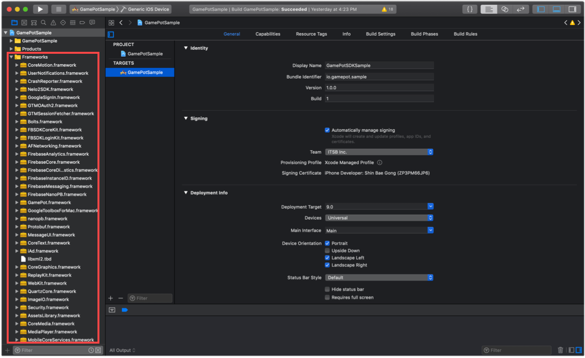
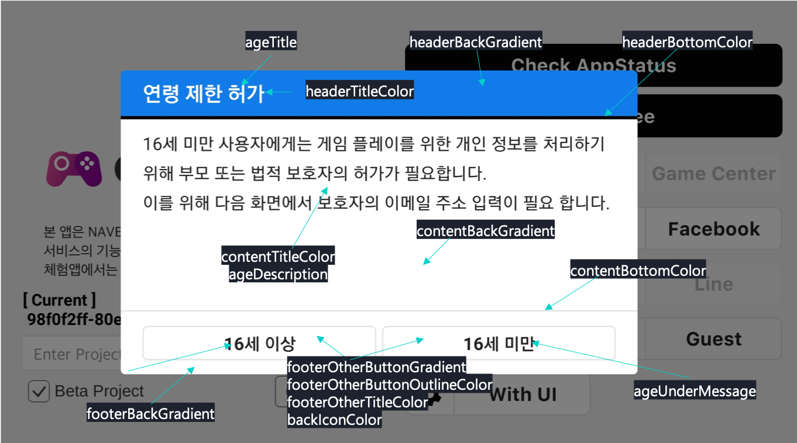

---
search:
  keyword: ['gamepot']
---


## 1. Get started

#### Step 1. Set up development environment

You should install Xcode to develop an application for iOS.

The system requirements for GAMEPOT in iOS are described below: 

- Operating system: iOS 9.0 or later
- Development environment: Xcode

#### Step 2. Add framework



Add the downloaded iOS SDK to TARGETS of your Xcode project folder.

#### Step 3. Add dependencies

Required dependencies depend on the service you want to use.

Add dependencies by referring to the following table.

Dependencies for each service

| Service       | Framework                                                    | Dependencies                                                 | Bundle                                            |
| ------------- | ------------------------------------------------------------ | ------------------------------------------------------------ | ------------------------------------------------- |
| Base    | AFNetworking.framework<br />FirebaseAnalytics.framework<br />FirebaseCore.framework<br />FirebaseCoreDiagnostics.framework<br />FirebaseInstanceID.framework<br />FirebaseMessaging.framework<br />FirebaseNanoPB.framework<br />GamePot.framework<br />GoogleToolboxForMac.framework<br />nanopb.framework<br />Protobuf.framework<br /> | libz.tbd<br />WebKit.framework<br />UserNotifications.framework<br /> | GamePot.bundle<br />                              |
| Login | [ Base ]<br />GamePotChannel.framework<br /><br />[ Google Sign In ]<br />GamePotGoogleSignIn.framework<br />GoogleSignIn.framework<br />GTMOAuth2.framework<br />GTMSessionFetcher.framework<br /><br />[ Facebook ]<br />Bolts.framework<br />FBSDKCoreKit.framework<br />FBSDKLoginKit.framework<br />GamePotFacebook.framework<br /> | [ Google Sign In ]<br />SafariServices.framework<br />[ Facebook ]<br />SafariServices.framework<br /> | [ Google Sign In ]<br />GoogleSignIn.bundle<br /> |
| AD      | [ Base ]<br />GamePotAd.framework<br /><br />[ Facebook ]<br />Bolts.framework<br />FBSDKCoreKit.framework<br />GamePotAdFacebook.framework<br /><br />[ Adbirx ]<br />AdBrix.framework<br />GamePotAdAdbrix.framework<br />IgaworksCore.framework<br /><br />[ Adjust ] <br />AdjustSdk.framework<br />GamePotAdAdjust.framework<br />     | [ Facebook ]<br /><br />[ Adbrix ]<br />MessageUI.framework<br />libxml2.tbd<br />iAd.framework<br />CoreTelephony.framework<br />UIKit.framework<br />CoreGraphics.framework<br />CoreText.framework<br />MobileCoreServices.framework<br />SystemConfiguration.framework<br />Security.framework<br /><br />[ Adjust ] <br />AdSupport.framework<br /> |                                                   |
| GameCenter    | GamePotGameCenter.framework                                  |                                                              |                                                   |
| NaverCafe     | AFNetworking.framework<br />GamePotNavarCafe.framework<br />NaverCafeSDK.framework<br /> | AVKit.framework<br />AVFoundation.framework<br />MediaPlayer.framework<br />CoreMedia.framework<br />AssetsLibrary.framework<br />ImageIO.framework<br />QuartzCore.framework<br />ReplayKit.framework (Optional)<br />MobileCoreServices.framework<br />SystemConfiguration.framework<br />Security.framework<br />WebKit.framework<br />libNaverLogin.a<br />NaverThirdPartyConstantsForApp.h<br />NaverThirdPartyLoginConnection.h<br />NLoginThirdPartyOAuth20InAppBrowserViewController.h<br />NLoginThirdPartyOAuth20InAppBrowserViewController.m<br /> | NaverAuth.bundle<br />NaverCafeSDK.bundle<br />    |
|               |                                                              |                                                              |                                                   |


#### Step 4. Add bundle resources

You should add bundle resources depending on the service to use.

Add bundle resources by referring to “Dependencies for each service” above.


#### Step 5. Add InfoPlist


The GAMEPOT SDK uses Google Firebase by default. Therefore, add GoogleService-Info.plist created by setting Google Firebase to your project.

Also, add GamePotConfig-Info.plist containing default settings of the GAMEPOT SDK. If there is no GamePotConfig-Info.plist, create a file with the same name and put required keys and values in the file.

**Configure GamePotConfig-Info.plist**


```xml
gamepot_project_id: GAMEPOT project ID
gamepot_elsa_projectid: GAMEPOT log project ID (optional)
```


#### Step 6. Add build options

Add -ObjC to **Build Settings > Linking > Other Linker Flags**.


#### Step 7. Edit Info.plist

Please add the option to acquire the following user privileges in Targets >> Info >> Custom iOS Target Properties.

This user right is used by the file upload function within the GamePot Customer Center.

```
NSCameraUsageDescription
NSPhotoLibraryUsageDescription
```


#### Step 8. Set up Google Sign In environment

Add frameworks and dependencies by referring to Login > Google Sign In in “Dependencies for each service.”

Copy `REVERSED_CLIENT_ID` in GoogleService-Info.plist, and paste it to URL Schemes in **Info > URL Types**.


**Configure GamePotConfig-Info.plist**


```xml
gamepot_google_app_id: CLIENT_ID in GoogleService-Info.plist
gamepot_google_url_schemes: REVERSED_CLIENT_ID in GoogleService-Info.plist
```


#### Step 9. Set up Facebook login environment

Add frameworks and dependencies by referring to Login > Facebook in “Dependencies for each service.”

Add your Facebook App ID to **Info > URL Types**, in the form of fb+Facebook App ID.


Add the following to **LSApplicationQueriesSchemes** in **Info > iOS Target Property**.

- fbapi
- fb-messenger-share-api
- fbauth2
- fbshareextension


**Configure GamePotConfig-Info.plist**


```xml
gamepot_facebook_app_id : Facebook App ID
gamepot_facebook_display_name : Facebook display name
```

## 2. Initialization

Add the following code to the AppDelegate file.

```objc
#import <GamePot/GamePot.h>

- (BOOL)application:(UIApplication *)application didFinishLaunchingWithOptions:(NSDictionary *)launchOptions {
    ...
    // GamePot SDK Initialize
    [[GamePot getInstance] setup];

    // Push Permission
    if(SYSTEM_VERSION_GRATERTHAN_OR_EQUALTO(@"10.0"))
    {
        UNUserNotificationCenter *center = [UNUserNotificationCenter currentNotificationCenter];
        center.delegate = self;
        [center requestAuthorizationWithOptions:(UNAuthorizationOptionSound | UNAuthorizationOptionAlert | UNAuthorizationOptionBadge) completionHandler:^(BOOL granted, NSError * _Nullable error){
            if(!error){
                dispatch_async(dispatch_get_main_queue(), ^{
                    [[UIApplication sharedApplication] registerForRemoteNotifications];
                });
            }
        }];
    }
    else
    {
        // Code for old versions
        UIUserNotificationType allNotificationTypes = (UIUserNotificationTypeSound | UIUserNotificationTypeAlert | UIUserNotificationTypeBadge);
        UIUserNotificationSettings *settings = [UIUserNotificationSettings settingsForTypes:allNotificationTypes categories:nil];
        [application registerUserNotificationSettings:settings];
        [application registerForRemoteNotifications];
    }
    ...
}

 // Push
- (void)application:(UIApplication *)application didRegisterForRemoteNotificationsWithDeviceToken:(NSData *)deviceToken
{
    ...
    [[GamePot getInstance] handleRemoteNotificationsWithDeviceToken:deviceToken];
    ...
}

- (void)applicationWillEnterForeground:(UIApplication *)application {
    [[GamePotChat getInstance] start];
}

- (void)applicationDidEnterBackground:(UIApplication *)application {
    [[GamePotChat getInstance] stop];
}
```


## 3. Login, Logout, Delete member

You can use various login SDKs, such as Google, Facebook, and NAVER.

#### Step 1. Configuration

```objc
// AppDelegate.m
#import <GamePotChannel/GamePotChannel.h>

// For Google Login
#import <GamePotGoogleSignIn/GamePotGoogleSignIn.h>

// For Facebook Login
#import <GamePotFacebook/GamePotFacebook.h>

- (BOOL)application:(UIApplication *)application didFinishLaunchingWithOptions:(NSDictionary *)launchOptions {
    ...
    // Initialize GamePotSDK channels. You should use an addChannel for each channel,
    // and Guest type is included by default.
    // Initialize Google Login
    GamePotChannelInterface* google     = [[GamePotGoogleSignIn alloc] init];
    [[GamePotChannelManager getInstance] addChannelWithType:GOOGLE interface:google];

    // Initialize Facebook Login
    GamePotChannelInterface* facebook   = [[GamePotFacebook alloc] init];
    [[GamePotChannelManager getInstance] addChannelWithType:FACEBOOK interface:facebook];

    // Required to handle login.
    [[GamePotChannel getInstance] application:application didFinishLaunchingWithOptions:launchOptions];

    ...
}

- (BOOL)application:(UIApplication *)app openURL:(NSURL *)url options:(NSDictionary<UIApplicationOpenURLOptionsKey,id> *)options
{
    // Required to handle login.
    BOOL nChannelResult = [[GamePotChannel getInstance] application:app openURL:url options:options];
    return nChannelResult;
}
```

#### Step 2. Login

It works when the login button is clicked.

```objc
#import <GamePotChannel/GamePotChannel.h>
// Define login type.
// GamePotChannelType.GOOGLE
// GamePotChannelType.FACEBOOK
// GamePotChannelType.GUEST

// Call this method when Google login button is clicked.
[[GamePotChannel getInstance] Login:GOOGLE viewController:self success:^(GamePotUserInfo* userInfo) {
    // Login completed
} cancel:^{
    // When the user cancels login during login attempts
} fail:^(NSError *error) {
    // Error occurs during login
    // TODO: Display a popup message regarding failure reasons.
    // TODO: Use [error localizedDescription].
}];

```

#### Step 3. Auto login

GAMEPOT supports auto login.

```objc
#import <GamePotChannel/GamePotChannel.h>

// Call this method to automatically log the user in with the last login information.
// lastLoginType: Gets the last login information.
GamePotChannelType type = [[GamePotChannel getInstance] lastLoginType];

if(type != NONE)
{
    // Log in with the login type of the user’s last login.
    // Call the following to perform auto login.
    [[GamePotChannel getInstance] Login:type viewController:self success:^(GamePotUserInfo* userInfo) {

    } cancel:^{

    } fail:^(NSError *error) {
        // TODO: Display a popup message regarding failure reasons.
        // TODO: Use [error localizedDescription].
    }];
}
else
{
	// There is no last login information. Move to the login screen where the user can log in.
}
```

#### Step 4. Logout

Logs the current member account out.

```objc
#import <GamePotChannel/GamePotChannel.h>

[[GamePotChannel getInstance] LogoutWithSuccess:^{
	// Moves to the initial screen after logout is completed.
} fail:^(NSError *error) {
    // Displays an error message about logout failure.
    // TODO: Display a popup message regarding failure reasons.
    // TODO: Use [error localizedDescription].
}];
```

#### Step 5. Delete member

Deletes the current member account.

```objc
#import <GamePotChannel/GamePotChannel.h>

[[GamePotChannel getInstance] DeleteMemberWithSuccess:^{
	// Moves to the login screen when deleting the member is succeeded.
} fail:^(NSError *error) {
    // Failed to delete account.
    // TODO: Display a popup message regarding failure reasons.
    // TODO: Use [error localizedDescription].
}];

```

#### Step 6. Authentication check

After the login is completed, the login information is passed from the developer server to the GAMEPOT server to perform authentication checks.

For more information, refer to `Authentication check` under `Server to server api`.

## 4. Connect/disconnect accounts

Connects or disconnects a game account to or from multiple social media accounts including Google and Facebook. (At least one social media account should be connected.)

Implement the connection UI in the game, and call the following code when the connect button is pressed.

#### Step 1. Connect accounts

Connects user accounts with their social media accounts including Google and Facebook.

```objc
#import <GamePotChannel/GamePotChannel.h>

// Define types.
// GamePotChannelType.GOOGLE
// GamePotChannelType.FACEBOOK
[[GamePotChannel getInstance] CreateLinking:GOOGLE viewController:self success:^(GamePotUserInfo *userInfo) {
	// TODO: Connection completed. Display the message showing the disconnection result. (Example: Successfully connected.)
} cancel:^{
	// TODO: // When the user cancels the account connection
} fail:^(NSError *error) {
    // TODO: Connection failed. Display a popup message regarding failure reasons.
    // TODO: Use [error localizedDescription].
}];

```

#### Step 2. List of connected accounts

Checks whether an account is connected with social media accounts.

```objc
#import <GamePotChannel/GamePotChannel.h>

// Define types.
// GamePotChannelType.GOOGLE
// GamePotChannelType.FACEBOOK
// Returns connection results for each type.
BOOL isGoogleLinked = [[GamePotChannel getInstance] isLinked:GOOGLE];

// Returns connected types in JsonString.
NSString* linkedList = [[GamePotChannel getInstance] getLinkedListJsonString];
```

#### Step 3. Disconnect accounts

Disconnects user accounts from their social media accounts.

```objc
#import <GamePotChannel/GamePotChannel.h>

[[GamePotChannel getInstance] DeleteLinking:GOOGLE success:^{
     // TODO: Disconnected successfully. Display the message showing the disconnection result. (Example: Successfully disconnected.)
} fail:^(NSError *error) {
     // TODO: Disconnection failed. Display a popup message regarding failure reasons.
     // TODO: Use [error localizedDescription].
}];
```

## 5. Advertisement platform

You can use various advertisement platform SDKs such as Facebook, Adjust, and Adbrix.

#### Step 1. Configuration

```objc
// AppDelegate.m

#import <GamePotAd/GamePotAd.h>
// For Facebook ad platform
#import <GamePotAdFacebook/GamePotAdFacebook.h>
// For Adjust ad platform
#import <GamePotAdAdjust/GamePotAdAdjust.h>
// For Adbrix ad platform
#import <GamePotAdAdbrix/GamePotAdAdbrix.h>

- (BOOL)application:(UIApplication *)application didFinishLaunchingWithOptions:(NSDictionary *)launchOptions {
    ...
    // Initialize Facebook ad platform
    GamePotAdInterface* adFacebook    = [[GamePotAdFacebook alloc] init];
    [[GamePotAd getInstance] addAds:adFacebook];

    // Initialize Adjust ad platform
    GamePotAdInterface* adAdjust      = [[GamePotAdAdjust alloc] init];
    [[GamePotAd getInstance] addAds:adAdjust];

    // Initialize Adbrix ad platform
    GamePotAdInterface* adAdbrix      = [[GamePotAdAdbrix alloc] init];
	[[GamePotAd getInstance] addAds:adAdbrix];
	...
}
```

#### Step 2. For Facebook ad platform

No additional process is required, except the initialization part described above.

#### Step 3. For Adbrix ad platform

Add the key required for Adbrix to GamePotConfig-Info.plist.


```
gamepot_adbrix_appid: Adbrix app ID
gamepot_adbrix_hashkey : Adbrix Hash Key
```

#### Step 4. Event tracking

Implement event tracking as you need, by referring to the following code as an example.

```objc
#import <GamePotAd/GamePotAd.h>

// Common
TrackerEvent* event = [[TrackerEvent alloc] init];
[event setEvent:@"test"];
// [event setAdjustKey:@"3m586u"]; // Add this code when using Adjust.
[[GamePotAd getInstance] tracking:EVENT obj:event];

// When leveling up
TrackerLevel* level = [[TrackerLevel alloc] init];
[level setLevel:@"12"];
// [level setAdjustKey:@"x7en7q"]; // Add this code when using Adjust.
[[GamePotAd getInstance] tracking:LEVEL obj:level];

// When completing the tutorial
TrackerTutorial* tutorialEvent = [[TrackerTutorial alloc] init];
[tutorialEvent setContentData:@"Tutorial completed"];
[tutorialEvent setContentId:@"1"];
[tutorialEvent setSuccess:YES];
// [tutorialEvent setAdjustKey:@"byoplo"]; // Add this code when using Adjust.
[[GamePotAd getInstance] tracking:TUTORIAL_COMPLETE obj:tutorialEvent];

```

#### Step 5. Deep Link

Add URL Schemes to **Info.plist > URL types**.


Add the following to AppDelegate.

```objc

// AppDelegate.m
#import <GamePotAd/GamePotAd.h>

- (BOOL)application:(UIApplication *)app openURL:(NSURL *)url options:(NSDictionary<UIApplicationOpenURLOptionsKey,id> *)options
{
    ...
    // Add this code when using DeepLinking.
    [[GamePotAd getInstance] application:app openURL:url options:options];
	...
}

```

## 6. Payment

#### Step 1. Configuration

Payment results are implemented as a delegate. Add a delegate as in the example below.

```objc
#import <GamePot/GamePot.h>

@interface ViewController () <GamePotPurchaseDelegate>
@end
@implementation ViewController

- (void)viewDidLoad
{
    ...
    [[GamePot getInstance] setPurchaseDelegate:self];
    ...
}

- (void)GamePotPurchaseSuccess:(GamePotPurchaseInfo *)_info
{
    // Payment succeeded

    // Must add this code snippet to pass the payment event to the ad platform!  
    [[GamePotAd getInstance] tracking:BILLING obj:_info];
}

- (void)GamePotPurchaseFail:(NSError *)_error
{
    // Payment error
    // TODO: Display a popup message regarding failure reasons.
    // TODO: Use [error localizedDescription].
}

- (void)GamePotPurchaseCancel
{
    // Cancel the payment during payment attempts.
    // Display a popup message that reads that the payment is canceled.   
}
@end
```

#### Step 2. Payment attempt

```objc
#import <GamePot/GamePot.h>

// Put the product ID registered in the store in “productId.”
[[GamePot getInstance] purchase:productid];
```

#### Step 3. **Acquisition of payment item list**

You can obtain a list of in-app items delivered by the store.

```objective-c
NSArray<SKProduct*>* itemList = [[GamePot getInstance] getDetails];

// When you get the call price according to the device setting
[[GamePot getInstance] getLocalizePrice:[product productIdentifier]];
```

#### Step 4. Provide purchased items

GAMEPOT requests items from the developer server after checking receipts from the store by using the Server to server api, preventing illegal payments.

Refer to `Purchase` in `Server to server api` to implement this.

## 7. Other APIs

#### NAVER Cafe SDK

You should get values required to integrate with the NAVER Cafe SDK in advance.

Add required values to GamePotConfig-Info.plist.


```objc
gamepot_naver_cafeid // NAVER Cafe ID
gamepot_naver_clientid // Client ID to be used in NAVER
gamepot_naver_secretid // Secret ID to be used in NAVER
gamepot_naver_urlscheme // urlscheme to be used in NAVER
```

Add frameworks and dependencies by referring to NAVER Cafe in “Dependencies for each service” above.

```objc
// AppDelegate.m
#import <GamePotNavarCafe/GamePotNavarCafe.h>

- (BOOL)application:(UIApplication *)application didFinishLaunchingWithOptions:(NSDictionary *)launchOptions {
    ...
    // Initialize NAVER Cafe
    [[GamePotNaverCafe getInstance] setup];
    ...
}

- (BOOL)application:(UIApplication *)app openURL:(NSURL *)url options:(NSDictionary<UIApplicationOpenURLOptionsKey,id> *)options
{
    BOOL nChannelResult = [[GamePotChannel getInstance] application:app openURL:url options:options];
    BOOL nNaverCafeResult = [[GamePotNaverCafe getInstance] application:app openURL:url options:options];

    return nChannelResult || nNaverCafeResult;
}
```

Refer to the following code to call the NAVER Cafe SDK.

```objc
#import <GamePotNavarCafe/GamePotNavarCafe.h>

[[GamePotNaverCafe getInstance] start:self];
```

After successful login, add the following code to identify members in the admin menu of NAVER Cafe.

```objc
#import <GamePotNavarCafe/GamePotNavarCafe.h>

[[GamePotNaverCafe getInstance] setUserId:[userInfo memberid]];
```

#### Coupon

Call the following code to use a coupon entered by a user.

> The developer should implement the screen for entering coupons.

```objc
#import <GamePot/GamePot.h>

[[GamePot getInstance] coupon:/*User-entered coupon*/ handler:^(BOOL _success, NSError *_error) {
    if(_success)
    {
        // TODO: The coupon use result is returned in a message. Display this message as a popup message in the game.
    }
    else
    {
        // TODO: The coupon use failure reason is returned in _error.
        // Display [_error localizedDescription] as a popup message in the game.
    }
}];
```

##### Provide items

When a coupon is successfully used, request an item from the developer server by using the Server to server api.

Refer to `Item` in `Server to server api` to implement this.

#### Push

```objc
#import <GamePot/GamePot.h>

// Push On/Off
[[GamePot getInstance] setPushEnable:YES success:^{

} fail:^(NSError *error) {

}];

// Night Push On/Off
[[GamePot getInstance] setNightPushEnable:YES success:^{

} fail:^(NSError *error) {

}];

// Ad Push On/Off
[[GamePot getInstance] setAdPushEnable:YES success:^{

} fail:^(NSError *error) {

}];

// Set all of Push, Night Push and Ad Push at once.
// For games that prompt users to turn Push, Night Push and Ad Push on or off before login, call the following code snippet after login.
[[GamePot getInstance] setPushStatus:YES night:YES ad:YES success:^{
    <#code#>
} fail:^(NSError *error) {
    <#code#>
}];
```

## Notice

This feature displays images uploaded in **Dashboard > Notice**.

### How to call

```objc
[[GamePot getInstance] showNoticeWebView:(UIViewController *)];
```

## Customer Support

This is a communication channel between users and administrators, which is connected with **Dashboard > Customer support**.

### How to call

```objc
[[GamePot getInstance] showHelpWebView:(UIViewController *)];
```

## Local push notification

This feature enables devices to display push notifications by themselves, not via the push server.

### How to call

#### Add push

Refer to the following code to display local push notifications at a specified time.

> The pushid passed as a return value should be managed by the developer.

```objc
 NSDateFormatter* formatter = [[NSDateFormatter alloc] init];
 [formatter setDateFormat:@"yyyy-MM-dd HH:mm:ss"];

 NSString* strDate = [formatter stringFromDate:[[NSDate date] dateByAddingTimeInterval:30]];

 int pushId  = [[GamePot getInstance] sendLocalPush:@"Title" setMessage:@"Message" setDateString:strDate];
```

#### Cancel push

You can cancel push notifications previously added, using the pushid you can get when adding push.

```objc
[[GamePot getInstance] cancelLocalPush:(int)pushId];
```

## Maintenance check and force update

If you need maintenance checks or force updates, you can enable this feature in **Dashboard > Operation**.

### How to call

Modify the previously applied APIs as described below.

#### 1. setup API

```objc
[[GamePot getInstance] setupWithAppStatus:^(GamePotAppStatus *status) {
        NSLog(@"Update : %@", [status toString]);
	    // TODO: When you need force update. Call the following API to enable the SDK to display popups by itself.
        // TODO: You can also customize the function without calling this API.
        [[GamePot getInstance] showAppStatusPopup:self setAppStatus:status setCloseHandler:^{
           // TODO: This API is called to close the app if the showAppStatusPopup API is called.
           // TODO: Handle the process of shutting down.
        }];
    } setMaintenance:^(GamePotAppStatus *status) {
        NSLog(@"Maintenance : %@", [status toString]);
	    // TODO: When a maintenance check is in progress. Call the following API to enable the SDK to display popups by itself.
        // TODO: You can also customize the function without calling this API.
        [[GamePot getInstance] showAppStatusPopup:self setAppStatus:status setCloseHandler:^{
            // TODO: This API is called to close the app if the showAppStatusPopup API is called.
            // TODO: Handle the shutdown process.
        }];
    }];
```

## Accept terms

We provide the UI to make it easy to get the 'Terms of Use' and 'Guide to collecting and using personal information'.

There are two types of `BLUE` and` GREEN` themes. Customization is also available for each area.

\- Example of `BLUE` theme


\- Example of `GREEN` theme 

### Call for agreement

> Please agree to the terms of the agreement pop-ups are handled by the developer.
>
> The contents of the 'View' button can be applied and modified in the dashboard.

```objective-c
// Blue theme [[GamePotAgreeOption alloc] init:BLUE]; 
// Green theme [[GamePotAgreeOption alloc] init:GREEN];
GamePotAgreeOption* option = [[GamePotAgreeOption alloc] init:BLUE]; 
[[GamePot getInstance] showAgreeView:self option:option handler:^(GamePotAgreeInfo *result) {
   // [result agree] : True if all of the required conditions are true
   // [result agreeNight] : True if evening advertising acceptance is checked; false otherwise
   // The agreeNight value is after login [[GamePot getInstance] setNightPushEnable]; api
   // Deliver it through
}];
```


### Customizing

Change the color for the game without using a theme.

You can specify a color for each area in `GamePotAgreeOption` before invoking the agreement.

```objective-c
 GamePotAgreeOption* option = [[GamePotAgreeOption alloc] init:GREEN];
    
[option setHeaderBackGradient:@[@0xFF00050B,@0xFF0F1B21]];
[option setHeaderTitleColor:0xFF042941];
[option setContentBackGradient:@[@0xFF112432,@0xFF112432]];
[option setContentIconColor:0xFF042941];
[option setContentCheckColor:0xFF91adb5];
[option setContentTitleColor:0xFF98b3c6];
[option setContentShowColor:0xFF98b3c6];
[option setFooterBackGradient:@[@0xFF112432,@0xFF112432]];
[option setFooterButtonGradient:@[@0xFF1E3A57,@0xFF57B2E2]];
[option setFooterButtonOutlineColor:0xFF0b171a];
[option setFooterTitleColor:0xFFFFFFD5];

// Change the text
[option setAllMessage:@"All agree"];
[option setTermMessage:@"Required) Terms and Conditions"];
[option setPrivacyMessage:@"Required) Privacy Policy"];
[option setNightPushMessage:@"Select) Slight push acknowledgment"];
[option setFooterTitle:@"Start the game"];

// Set to @""when not in use
[option setHeaderTitle:@"Accept terms"];

// Nightly advertising acceptance button
[option setShowNightPush:YES];
```


Each variable is applied to the area below.

> The image of contentIconDrawable is not exposed to IOS.


## Terms of service

Call the Terms of Use UI.

> Dashboard - Customer Support - Enter your content first in the Terms and Conditions section.

```java
#import <GamePot/GamePot.h>

[[GamePot getInstance] showTerms:/*ViewController*/];
```


## Privacy Statement

Calls the privacy policy UI.

> Dashboard - Customer Support - Enter your privacy policy settings first.

```java
#import <GamePot/GamePot.h>

[[GamePot getInstance] showPrivacy:/*ViewController*/];
```




## 8. Download

You can download the GAMEPOT SDK for iOS from **Dashboard > Download SDK**.

