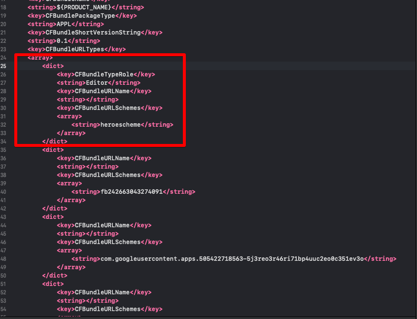

# Troubleshooting

> ### This is a machine-translated document that may have errors in vocabulary, syntax, or grammar. We will soon provide you with the document translated by a professional translator.
>
> #### If you have any questions, please [contact us](https://www.ncloud.com/support/question).
>
> We will make every effort to further enhance our services.

## When building in 64-bit environment, a crash occurs when attempting Nearo (Naver ID login). (Android build of API 28 or higher)

⒈ Add the following code to the `AndroidManifest.xml` file

> For Unity, edit /Assets/Plugins/Android/AndroidManifest.xml

```java
// TODO: Please put it inside the <application> tag.

<application>

...

   <uses-library android:name="org.apache.http.legacy" android:required="false" />

...

</application>
```

ref.) that part can be replaced by replacement of the patched library. \[[gamepot-channel-naver.aar](https://kr.object.ncloudstorage.com/itsb/patch/gamepot-channel-naver.aar)\]

## When uploading Play Store APK, com.nhncorp.nelo2.android.util encryption pattern security notification occurs

Problem caused by obsolete library related to logging function

⒉ (If you do not use the dashboard log function) Among the library of Gamepot SDK, remove the library listed below

|                                        |     |
| :------------------------------------- | :-- |
| 1. gamepot-logger.aar                  |
| 2. nelo2-android-sdk-common-0.10.2.jar |
| 3. nelo2-android-sdk-https-0.10.2.jar  |
|                                        |     |

## Line i386 x86_64 IOS Archive upload issue

이동 After moving to the location of the LineSDK.framework file in the console (terminal), enter the following commands one by one.

```text
(This code removes the disallowed architecture.)

lipo -remove x86_64 ./LineSDK.framework/LineSDK -o ./LineSDK.framework/LineSDK
lipo -remove i386 ./LineSDK.framework/LineSDK -o ./LineSDK.framework/LineSDK
lipo -remove x86_64 ./LineSDKObjC.framework/LineSDKObjC -o ./LineSDKObjC.framework/LineSDKObjC
lipo -remove i386 ./LineSDKObjC.framework/LineSDKObjC -o ./LineSDKObjC.framework/LineSDKObjC
```

## Twitter i386 x86_64 IOS build issue

After moving to the location of TwitterCore.framework in the console (terminal), enter the following commands one by one.

```text
(This code removes the disallowed architecture.)

lipo -remove x86_64 ./TwitterCore.framework/TwitterCore -o ./TwitterCore.framework/TwitterCore
lipo -remove i386 ./TwitterCore.framework/TwitterCore -o ./TwitterCore.framework/TwitterCore
lipo -remove x86_64 ./TwitterKit.framework/TwitterKit -o ./TwitterKit.framework/TwitterKit
lipo -remove i386 ./TwitterKit.framework/TwitterKit -o ./TwitterKit.framework/TwitterKit
```

## AdbrixRM i386 x86_64 IOS build issue

After moving to the location of AdBrixRM.framework in the console (terminal), enter the following commands one by one.

```text
(This code removes the disallowed architecture.)

lipo -remove x86_64 ./AdBrixRM.framework/AdBrixRM -o ./AdBrixRM.framework/AdBrixRM
lipo -remove i386 ./AdBrixRM.framework/AdBrixRM -o ./AdBrixRM.framework/AdBrixRM
```

## Nearo NaverThirdPartyLogin.framework i386 x86_64 issue

```text
(This code removes the disallowed architecture.)

lipo -remove x86_64 ./NaverThirdPartyLogin.framework/NaverThirdPartyLogin -o ./NaverThirdPartyLogin.framework/NaverThirdPartyLogin
lipo -remove i386 ./NaverThirdPartyLogin.NaverThirdPartyLogin -o ./NaverThirdPartyLogin.framework/NaverThirdPartyLogin
```

## Android build issue in Unity 2018.4.4 or higher, Unity 2019.2.0 or higher

⒈ Modify `mainTemplate.gradle` file as below

> See TODO.

```java
// TODO: Remove all where GradleVersion is used.

buildscript {
    repositories {
        // if (GradleVersion.current() >= GradleVersion.version("4.2")) {
            google()
            jcenter()
        //} else {
        // jcenter()
        //}
    }
    dependencies {
        // if (GradleVersion.current() <GradleVersion.version("4.0")) {
        // classpath'com.android.tools.build:gradle:2.1.0'
        //} else if (GradleVersion.current() <GradleVersion.version("4.2")) {
        // classpath'com.android.tools.build:gradle:2.3.0'
        //} else {
                  // TODO: Change Android gradle plugin version to 3.4.0 version.
            classpath'com.android.tools.build:gradle:3.4.0'
        //}
        classpath'com.google.gms:google-services:3.2.0'
    }
}

allprojects {
   repositories {
        flatDir {
            dirs'libs'
        }

        // if (GradleVersion.current() >= GradleVersion.version("4.2")) {
            google()
            jcenter()
        //} else {
        // jcenter()
        //}
   }
}


dependencies {
    // if (GradleVersion.current() >= GradleVersion.version("4.2")) {
        implementation fileTree(include: ['*.jar'], dir:'libs')
        implementation project(":GamePotResources")
        implementation project(':Firebase')
    //} else {
    // compile fileTree(include: ['*.jar'], dir:'libs')
    // compile project(":GamePotResources")
    // compile project(':Firebase')
    //}
}

fileTree(dir:'libs', include: ['*.aar'])
        .each {File file ->
    // println file.name
    // if (GradleVersion.current() >= GradleVersion.version("4.2")) {
        dependencies.add("implementation", [name: file.name.lastIndexOf('.').with {it != -1? file.name[0..<it]: file.name }, ext:'aar '])
    //} else {
    // dependencies.add("compile", [name: file.name.lastIndexOf('.').with {it != -1? file.name[0..<it]: file.name }, ext: 'aar'])
    //}
}
```

⒉ Edit Firebase related files

-Download the patch file through [Link](https://kr.object.ncloudstorage.com/gamepot/Firebase_patch.zip)

-Copy file as below

```java
/Firebase_patch/Assets/Firebase/Editor
 Copy files from the above path to the below path
-> {unity project}/Assets/Firebase/Editor

{unity project}/Assets/PlayServicesResolver/Editor
 After deleting all files in the above path, copy the files to the below path
-> /Firebase_patch/Assets/PlayServicesResolver/Editor
```

-⒊ If /Assets/Plugins/Android/Firebase/res folder is not created, restart Unity

## (Unity) When applying Naver Plug SDK (plug_sdk_4_4_7.unitypackage.unitypackage or higher), IOS build error occurs.

-Download and extract patch files through [Link](https://kr.object.ncloudstorage.com/itsb/patch/Patch_GamePotNaverLogin_20200508.zip) (GamePotNaver.framework)

-Replace the downloaded patch (GamePotNaver.framework) with the framework of the existing path.

## (IOS) When NAVER Plug SDK is applied, NAVER ID login is not possible through web view.

-Open info.plist in XCode.

-As shown below, upload and save the URLScheme value of the Naver Cafe to the first index of the corresponding Array, then check the normal operation of the login.




## (Unity) Naver Lounge SDK applied (based on NaverSDK Ver 1.1.1)

Reference URL: https://navergame.gitbook.io/naver-game/naver-game-sdk-faq-1#unity-android-class-duplication-exception

- When the Unity plugin package is applied, the navergame-sdk-1.1.1.aar file is not included or deleted.

../Assets/NGSDK/Plugins/Android/navergame-sdk-1.1.1.aar

- Android native NAVER Lounge SDK library installed

../Assets/Plugins/Android/navergame-sdk-gradle-1.1.1.aar 

- Edit mainTemplate.gradle file (Add library used in Naver Lounge SDK)

```text
dependencies {
..
implementation 'androidx.multidex:multidex:2.0.1'
implementation "androidx.recyclerview:recyclerview:1.2.0"
implementation "androidx.viewpager2:viewpager2:1.0.0"
implementation "com.squareup.retrofit2:retrofit:2.6.4"
```

- Delete duplicate libraries in ../Assets/Plugins/Android/libs folder (deletion list)

```text
../Assets/Plugins/Android/libs/activity-1.0.0.aar
../Assets/Plugins/Android/libs/annotation-1.1.0.jar
../Assets/Plugins/Android/libs/collection-1.1.0.jar
../Assets/Plugins/Android/libs/core-1.3.0.aar
../Assets/Plugins/Android/libs/core-common-2.1.0.jar
../Assets/Plugins/Android/libs/core-runtime-2.0.0.aar
../Assets/Plugins/Android/libs/customview-1.0.0.aar
../Assets/Plugins/Android/libs/fragment-1.1.0.aar
../Assets/Plugins/Android/libs/lifecycle-common-2.1.0.jar
../Assets/Plugins/Android/libs/lifecycle-livedata-2.0.0.aar
../Assets/Plugins/Android/libs/lifecycle-livedata-core-2.0.0.aar
../Assets/Plugins/Android/libs/lifecycle-runtime-2.1.0.aar
../Assets/Plugins/Android/libs/lifecycle-viewmodel-2.1.0.aar
../Assets/Plugins/Android/libs/loader-1.0.0.aar
../Assets/Plugins/Android/libs/okhttp-4.9.1.jar
../Assets/Plugins/Android/libs/okio-2.8.0.jar
../Assets/Plugins/Android/libs/savedstate-1.0.0.aar
../Assets/Plugins/Android/libs/versionedparcelable-1.1.0.aar
../Assets/Plugins/Android/libs/viewpager-1.0.0.aar
../Assets/Plugins/Android/libs/retrofit-2.5.0.aar
```

## (Unity) Apply GoogleMobileAds SDK (Description based on GoogleMobileAds-v6.1.2)

In the case of AdMob SDK (Unity), you need to use the Unity Play Services Resolver function after importing the Unity package.

In Unity, go to Assets > Play Services Resolver > Android Resolver > Settings menu.

Select Use Jetifier

Please proceed with Resolver with the Enable Resolution On Build / Enable Auto-Resolution / Patch gradle Template.properties items unchecked.

In Unity, go to Assets > Play Services Resolver > IOS Resolver > Settings menu.

Add use_frameworks! To podfile / Always add the main target to Podfile is unchecked and proceed with the iOS build.


After that, in case of a duplicate library error, you can remove one of the two libraries.

List of duplicate library files:
```text
..Assets/Plugins/Android/libs/annotation-1.1.0.jar
..Assets/Plugins/Android/libs/browser-1.0.0.aar
..Assets/Plugins/Android/libs/core-common-2.1.0.jar
..Assets/Plugins/Android/libs/core-runtime-2.0.0.aar
..Assets/Plugins/Android/libs/core-1.3.0.aar
..Assets/Plugins/Android/libs/coordinatorlayout-1.0.0.aar
..Assets/Plugins/Android/libs/collection-1.1.0.jar
..Assets/Plugins/Android/libs/asynclayoutinflater-1.0.0.aar
..Assets/Plugins/Android/libs/fragment-1.1.0.aar
..Assets/Plugins/Android/libs/drawerlayout-1.0.0.aar
..Assets/Plugins/Android/libs/documentfile-1.0.0.aar
..Assets/Plugins/Android/libs/customview-1.0.0.aar
..Assets/Plugins/Android/libs/cursoradapter-1.0.0.aar
..Assets/Plugins/Android/libs/loader-1.0.0.aar
..Assets/Plugins/Android/libs/lifecycle-viewmodel-2.1.0.aar
..Assets/Plugins/Android/libs/lifecycle-runtime-2.1.0.aar
..Assets/Plugins/Android/libs/lifecycle-livedata-2.0.0.aar
..Assets/Plugins/Android/libs/lifecycle-common-2.1.0.jar
..Assets/Plugins/Android/libs/legacy-support-core-utils-1.0.0.aar
..Assets/Plugins/Android/libs/legacy-support-core-ui-1.0.0.aar
..Assets/Plugins/Android/libs/interpolator-1.0.0.aar
..Assets/Plugins/Android/libs/viewpager-1.0.0.aar
..Assets/Plugins/Android/libs/versionedparcelable-1.1.0.aar
..Assets/Plugins/Android/libs/swiperefreshlayout-1.0.0.aar
..Assets/Plugins/Android/libs/sqlite-framework-2.0.1.aar
..Assets/Plugins/Android/libs/sqlite-2.0.1.aar
..Assets/Plugins/Android/libs/slidingpanelayout-1.0.0.aar
..Assets/Plugins/Android/libs/print-1.0.0.aar
..Assets/Plugins/Android/libs/localbroadcastmanager-1.0.0.aar
..Assets/Plugins/Android/libs/lifecycle-livedata-core-2.0.0.aar
..Assets/Plugins/Android/libs/play-services-basement-17.5.0.aar
..Assets/Plugins/Android/libs/play-services-ads-identifier-17.0.0.aar
..Assets/Plugins/Android/libs/play-services-measurement-sdk-api-18.0.1.aar
..Assets/Plugins/Android/libs/play-services-measurement-impl-18.0.1.aar
..Assets/Plugins/Android/libs/play-services-measurement-base-18.0.1.aar
..Assets/Plugins/Android/libs/play-services-tasks-17.2.0.aar
..Assets/Plugins/Android/libs/play-services-measurement-18.0.1.aar

..Assets/Plugins/Android/libs/play-services-measurement-sdk-18.0.1.aar
..Assets/Plugins/Android/libs/play-services-measurement-api-18.0.1.aar

..Assets/Plugins/IOS/Frameworks/nanopb.framework
```

## (Unity) apply appsflyer SDK (based on appsflyer-v6.3.2)

Other SDKs are the same, but UnityAppController class should be inherited from only one file in the project to be built.

If you import the Unity GAMEPOT plugin package , you are inheriting from GamePotAppDelegate.h by default.

In the case of advertising tools such as appsflyer or Singular, the library also inherits UnityAppController, so the GAMEPOT SDK may not work.

You need to modify it so that it is inherited from only one file and use it.

Ex)
[appsflyer-v6.3.2 기준 패치](https://xyuditqzezxs1008973.cdn.ntruss.com/patch/fixed_appsflyer632.zip)


## (Unity) Applying Firebase SDK separately (guide for Firebase Unity 8.7.0)

- If you are using a Unity editor older than 2019.X, please proceed with the patch below first.

Download patch : [Download patch](https://xyuditqzezxs1008973.cdn.ntruss.com/patch/unity_2020_X.zip)

[Replace folders and files]

../Assets/ExternalDependencyManager

../Assets/Firebase

- Change the folder name for the replaced Firebase library
Previous : ../Assets/Plugins/Android/Firebase
New : ../Assets/Plugins/Android/FirebaseApp.androidlib

- Edit mainTemplate.gradle (due to the change in the folder name)
Previous :
dependencies {
...
implementation project('Firebase')
New :
dependencies {
...
implementation project('FirebaseApp.androidlib')
...


- GAMEPOT's Unity plugin package contains some Firebase SDK, so using another Firebase SDK will cause an error due to the duplicate libraries.

Firebase Unity SDK(FirebaseAnalytics.unitypackage / FirebaseMessaging.unitypackage + Firebase SDK you wish to add) needs to be imported first to use the Unity Play Services Resolver.

On Unity, go to Assets > Play Services Resolver > Android Resolver > Settings and

select Use Jetifier.

Enable Resolution On Build / Enable Auto-Resolution / Patch gradle Template.properties need to be deselected to proceed with Resolver.

On Unity, go to Assets > Play Services Resolver > IOS Resolver > Settings and

deselect Add use_frameworks! to podfile / Always add the main target to Podfile to start the IOS build.


1. Must delete duplicate library files:
```text
../Assets/Plugins/Android/libs/viewpager-1.0.0.aar
../Assets/Plugins/Android/libs/versionedparcelable-1.1.0.aar
../Assets/Plugins/Android/libs/transport-runtime-2.2.5.aar
../Assets/Plugins/Android/libs/transport-backend-cct-2.3.3.aar
../Assets/Plugins/Android/libs/transport-api-2.2.1.aar
../Assets/Plugins/Android/libs/swiperefreshlayout-1.0.0.aar
../Assets/Plugins/Android/libs/slidingpanelayout-1.0.0.aar
../Assets/Plugins/Android/libs/print-1.0.0.aar
../Assets/Plugins/Android/libs/play-services-tasks-17.2.0.aar
../Assets/Plugins/Android/libs/play-services-stats-17.0.0.aar
../Assets/Plugins/Android/libs/play-services-measurement-sdk-api-18.0.1.aar
../Assets/Plugins/Android/libs/play-services-measurement-sdk-18.0.1.aar
../Assets/Plugins/Android/libs/play-services-measurement-impl-18.0.1.aar
../Assets/Plugins/Android/libs/play-services-measurement-base-18.0.1.aar
../Assets/Plugins/Android/libs/play-services-measurement-api-18.0.1.aar
../Assets/Plugins/Android/libs/play-services-measurement-18.0.1.aar
../Assets/Plugins/Android/libs/play-services-cloud-messaging-16.0.0.aar
../Assets/Plugins/Android/libs/play-services-basement-17.5.0.aar
../Assets/Plugins/Android/libs/play-services-base-17.5.0.aar
../Assets/Plugins/Android/libs/play-services-ads-identifier-17.0.0.aar
../Assets/Plugins/Android/libs/localbroadcastmanager-1.0.0.aar
../Assets/Plugins/Android/libs/loader-1.0.0.aar
../Assets/Plugins/Android/libs/lifecycle-viewmodel-2.1.0.aar
../Assets/Plugins/Android/libs/lifecycle-runtime-2.1.0.aar
../Assets/Plugins/Android/libs/lifecycle-livedata-core-2.0.0.aar
../Assets/Plugins/Android/libs/lifecycle-livedata-2.0.0.aar
../Assets/Plugins/Android/libs/lifecycle-common-2.1.0.jar
../Assets/Plugins/Android/libs/legacy-support-core-utils-1.0.0.aar
../Assets/Plugins/Android/libs/legacy-support-core-ui-1.0.0.aar
../Assets/Plugins/Android/libs/javax.inject-1.jar
../Assets/Plugins/Android/libs/interpolator-1.0.0.aar
../Assets/Plugins/Android/libs/fragment-1.1.0.aar
../Assets/Plugins/Android/libs/firebase-messaging-21.0.1.aar
../Assets/Plugins/Android/libs/firebase-measurement-connector-18.0.0.aar
../Assets/Plugins/Android/libs/firebase-installations-interop-16.0.1.aar
../Assets/Plugins/Android/libs/firebase-installations-16.3.5.aar
../Assets/Plugins/Android/libs/firebase-iid-interop-17.0.0.aar
../Assets/Plugins/Android/libs/firebase-iid-21.0.1.aar
../Assets/Plugins/Android/libs/firebase-encoders-json-17.1.0.aar
../Assets/Plugins/Android/libs/firebase-encoders-16.1.0.jar
../Assets/Plugins/Android/libs/firebase-datatransport-17.0.10.aar
../Assets/Plugins/Android/libs/firebase-core-18.0.1.aar
../Assets/Plugins/Android/libs/firebase-components-16.1.0.aar
../Assets/Plugins/Android/libs/firebase-common-19.5.0.aar
../Assets/Plugins/Android/libs/firebase-annotations-16.0.0.jar
../Assets/Plugins/Android/libs/firebase-analytics-18.0.1.aar
../Assets/Plugins/Android/libs/drawerlayout-1.0.0.aar
../Assets/Plugins/Android/libs/documentfile-1.0.0.aar
../Assets/Plugins/Android/libs/customview-1.0.0.aar
../Assets/Plugins/Android/libs/cursoradapter-1.0.0.aar
../Assets/Plugins/Android/libs/core-runtime-2.0.0.aar
../Assets/Plugins/Android/libs/core-common-2.1.0.jar
../Assets/Plugins/Android/libs/core-1.3.0.aar
../Assets/Plugins/Android/libs/coordinatorlayout-1.0.0.aar
../Assets/Plugins/Android/libs/collection-1.1.0.jar
../Assets/Plugins/Android/libs/asynclayoutinflater-1.0.0.aar
../Assets/Plugins/Android/libs/annotation-1.1.0.jar
../Assets/Plugins/IOS/Frameworks/nanopb.framework
../Assets/Plugins/IOS/Frameworks/FirebaseNanoPB.framework
../Assets/Plugins/IOS/Frameworks/FirebaseMessaging.framework
../Assets/Plugins/IOS/Frameworks/FirebaseInstanceID.framework
../Assets/Plugins/IOS/Frameworks/FirebaseCoreDiagnostics.framework
../Assets/Plugins/IOS/Frameworks/FirebaseCore.framework
../Assets/Plugins/IOS/Frameworks/FirebaseAnalytics.framework
```


2. ../Assets/Plugins/Android/AndroidManifest.xml Confirm that your FCM-related codes are applied

```text
....
</activity>

<!-- FCM [start]-->
       <service
            android:exported="false"
            android:name="io.gamepot.common.GamePotFCMIDService">
            <intent-filter>
                <action android:name="com.google.firebase.INSTANCE_ID_EVENT"/>
            </intent-filter>
        </service>
        <service
            android:exported="false"
            android:name="io.gamepot.common.GamePotFCMService">
            <intent-filter>
                <action android:name="com.google.firebase.MESSAGING_EVENT"/>
            </intent-filter>
        </service>
<!-- FCM [End]-->

...
<meta-data android:name="android.max_aspect" android:value="2.1" />

```


3. Additional steps for IOS build with Firebase Unity 9.4.0

- In the result of the IOS build on the Unity editor, search for Podfile and edit it as follows. ( if another library exists, add :modular_headers => true )

Firebase / FirebaseCore / GoogleUtilities need to be added as shown on the examples below.


example )

```text

[Previous]

...
target 'UnityFramework' do
pod 'Firebase/Analytics', '9.4.0'
pod 'Firebase/Core', '9.4.0'
pod 'Firebase/Messaging', '9.4.0'
end

[New]

target 'UnityFramework' do
pod 'Firebase/Analytics', '9.4.0' , :modular_headers => true
pod 'Firebase/Core', '9.4.0' , :modular_headers => true
pod 'Firebase/Messaging', '9.4.0' , :modular_headers => true

pod 'Firebase', :modular_headers => true
pod 'FirebaseCore', :modular_headers => true
pod 'GoogleUtilities', :modular_headers => true
end

```

- On terminal, navigate to the location of the Podfile, run pod install, and proceed with this project's build after the file Unity-iPhone.xcworkspace is created