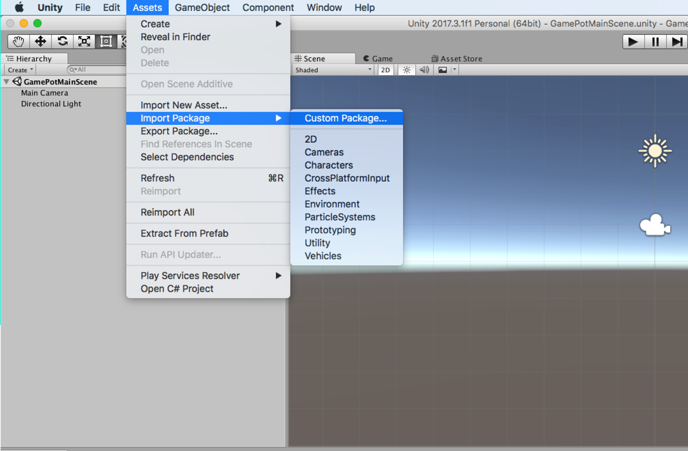
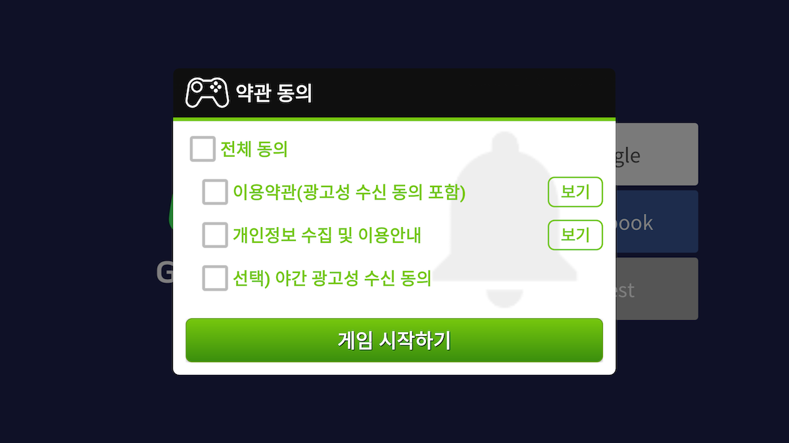
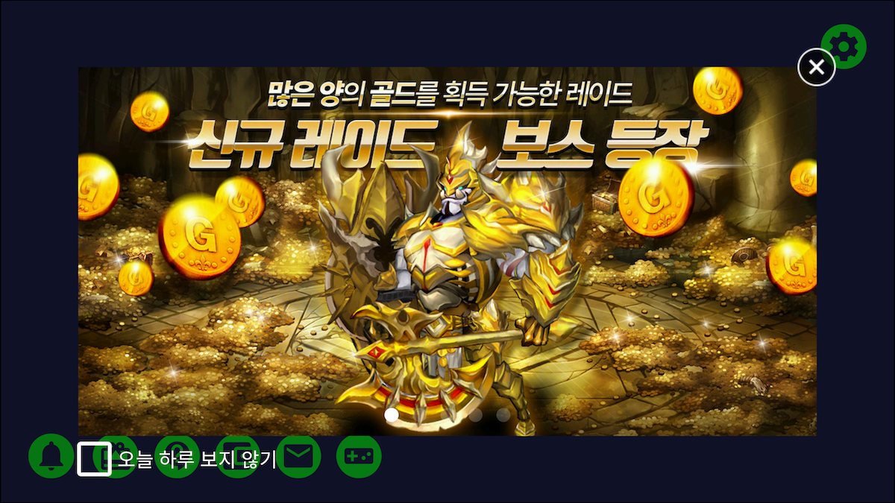
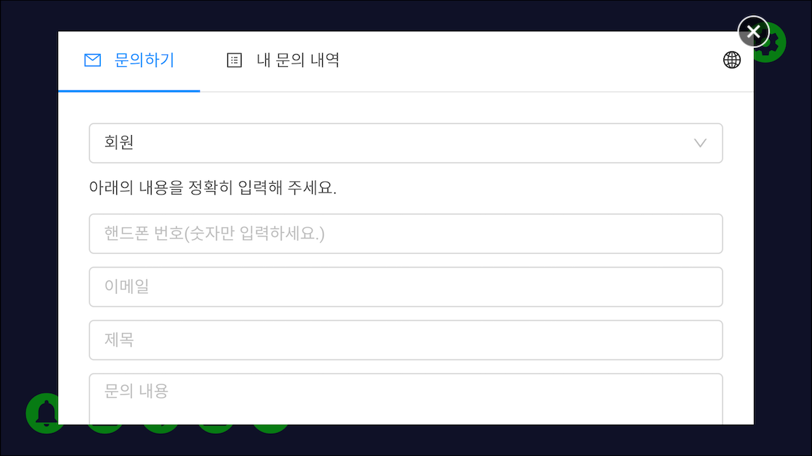
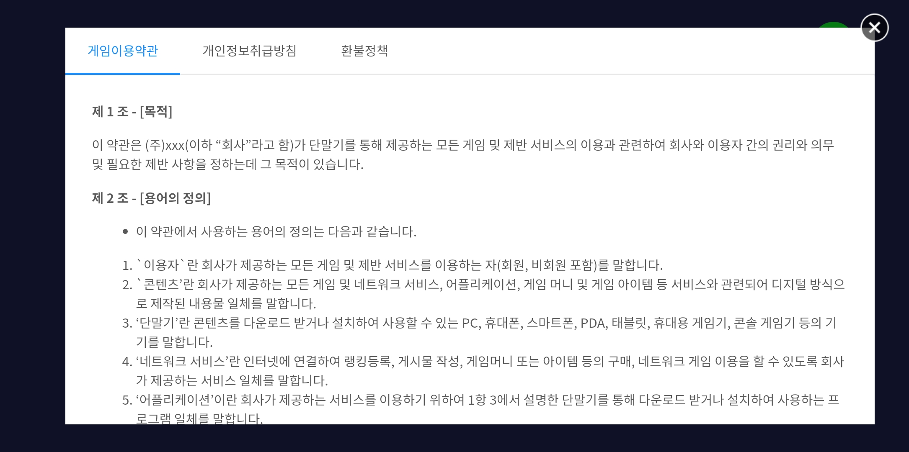

---
search:
  keyword: ['gamepot']
---

## Get started

### Step 1. Download GAMEPOT plugin

Log in to your GAMEPOT dashboard and download the latest plugin.

### Step 2. Import plugin

Go to **Assets > Import Package > Custom Package** in Unity and select `GamePotUnityPlugin-xxxx.unitypackage` you downloaded.



Select the plugin files and import them, and the plugin is added to your project.


### Step 3. Android

#### Set preferences

```
minSdkVersion : API 17 (Jelly Bean, 4.2)
```

##### How to configure Gradle

Open `/Assets/Plugin/Android/mainTemplate.gradle.`

```java
...
android {
	...
	defaultConfig {
		...
        resValue "string", "gamepot_project_id", "" // required
        resValue "string", "gamepot_api_url", "" // required
        resValue "string", "gamepot_store", "google" // required
        resValue "string", "gamepot_app_title","@string/app_name" // required (fcm)
        resValue "string", "gamepot_push_default_channel","Default" // required (fcm)
		resValue "string", "facebook_app_id", "0" // optional (facebook)
		resValue "string", "fb_login_protocol_scheme", "fb0" // optional (facebook)
		// resValue "string", "gamepot_elsa_projectid", "" // optional (ncp elsa)
	}
	...
}
```

Edit the following required values. These values should be edited for the plugin to work.

```java
resValue "string", "[key]", "[value]"
```

| Value                           | Description                                                         |
| ---------------------------- | ------------------------------------------------------------ |
| gamepot_project_id               | Project ID issued from GAMEPOT. |
| gamepot_api_url                  | API URL issued from GAMEPOT.         |
| gamepot_store                    | Store value (`google` or `one`)                           |
| gamepot_app_title                | App title (FCM)                                        |
| gamepot_push_default_channel     | Default channel name registered - DO NOT change.   |
| facebook_app_id                  | App ID issued from Facebook                              |
| fb_login_protocol_scheme         | Protocol scheme fb[app_id] issued from Facebook   |
| gamepot_elsa_projectid           | Project ID when using NCLOUD Effective Log Search & Analytics ([View more](https://www.ncloud.com/product/analytics/elsa))                       |

##### How to change the push notification icon


For the small icon to be displayed on the Android notification bar when a push notification message is received, the default image in the SDK is used; you can also specify your own image for the game.

To add them manually, you need to place an image for each `drawable` folder. ( [Android Asset Studio](http://romannurik.github.io/AndroidAssetStudio/icons-notification.html#source.type=clipart&source.clipart=ac_unit&source.space.trim=1&source.space.pad=0&name=ic_stat_gamepot_small) helps you automatically create images by folder.)

The image file name must be ic_stat_gamepot_small.

| Folder name                | Size  |
| --------------------- | ----- |
| res/drawable-mdpi/    | 24x24 |
| res/drawable-hdpi/    | 36x36 |
| res/drawable-xhdpi/   | 48x48 |
| res/drawable-xxhdpi/  | 72x72 |
| res/drawable-xxxhdpi/ | 96x96 |

##### How to set screen orientation

Open `/Assets/Plugin/Android/AndroidManifest.xml` in your editor.

```xml
...
    <activity android:screenOrientation="sensorLandscape">
      <intent-filter>
        <action android:name="android.intent.action.MAIN" />
          ...
      </intent-filter>
    </activity>
...
```

Add screenOrientation to the Main Activity, and enter `sensorLandscape` or `sensorPortrait` for your game.

##### Unity Build Settings

Go to **File > Build Settings** and select **Gradle** from **Build System**.


### Step 4. iOS

> `If you do not use` GameCenter Login, delete the file from the following location.<br /> > `Assets/Plugins/IOS/Frameworks/GamePotGameCenter.framework`<br />
> If the library is included, you should turn **Game Center** on in **Capabilities**.<br />

Copy `GamePotConfig-Info.plist` downloaded from Google Firebase into `/Assets/Plugins/IOS/`.

Add required environment variables to `/Assets/Plugin/GamePotConfig-Info.plist`.


| Environment variable                                 | Description                                                 |
| -------------------------------- | ---------------------------------------------------- |
| gamepot_project_id               | Project ID issued from GAMEPOT. |
| gamepot_api_url                  | API URL issued from GAMEPOT.         |
| gamepot_facebook_app_id                  | App ID issued from Facebook                              |
| gamepot_facebook_display_name    | Name displayed in Facebook                            |
| gamepot_google_app_id		   | CLIENT_ID in GoogleService-Info             |
| gamepot_google_url_schemes       | REVERSED_CLIENT_ID in GoogleService-Info   |
| gamepot_elsa_projectid           | Project ID when using NCLOUD Effective Log Search & Analytics                        |


After adding scenes, and click **File > Build Settings > Build And Run**.


After XCode build

Please add the option of 'Obtain User Authorization' below in Targets >> Info >> Custom iOS Target Properties.

This user right is used by the file upload function within GAMEPOT Customer Center.

```
NSCameraUsageDescription
NSPhotoLibraryUsageDescription
```


## Initialization

Add the following code to the object used in the first scene loaded when your game starts.

```csharp
using GamePotUnity;
public class GamePotLoginSampleScene : MonoBehaviour {
    void Awake() {
        GamePot.initPlugin();
    }
    void Start () {
        GamePot.setListener(  class that inherits from GamePotInterface.cs );
         // ex) GamePot.setListener(new GamePotSampleListener());
    }

}

ex)
public class GamePotSampleListener : MonoBehaviour , NSDKInterface {
    ....
}
```

## Error codes

```csharp
public class NError
{
    // Unknown error
    public static readonly int CODE_UNKNOWN_ERROR           = 0;
    // Initialization failed
    public static readonly int CODE_NOT_INITALIZE           = 1;
     // Invalid parameter
    public static readonly int CODE_INVAILD_PARAM           = 2;
    // No member ID data
    public static readonly int CODE_MEMBERID_IS_EMPTY       = 3;
    // Not logged in
    public static readonly int CODE_NOT_SIGNIN              = 4;
     // Network module is not initialized
    public static readonly int CODE_NETWORK_MODULE_NOT_INIT = 3000;
      // Network connection error or timeout occurs
    public static readonly int CODE_NETWORK_ERROR           = 3001;
     // Server-side error
    public static readonly int CODE_SERVER_ERROR            = 4000;
     // HTTP response code is not successful
    public static readonly int CODE_SERVER_HTTP_ERROR       = 4001;
      // Network connection error or timeout occurs
    public static readonly int CODE_SERVER_NETWORK_ERROR    = 4002;
     // Error occurs when parsing data received from the server
    public static readonly int CODE_SERVER_PARSING_ERROR    = 4003;
    // Unknown error occurs in payment or error received from store
    public static readonly int CODE_CHARGE_UNKNOWN_ERROR    = 5000;
    // No product id specified
    public static readonly int CODE_CHARGE_PRODUCTID_EMPTY  = 5001;
    // Wrong product id
    public static readonly int CODE_CHARGE_PRODUCTID_WRONG  = 5002;
     // Consume error
    public static readonly int CODE_CHARGE_CONSUME_ERROR    = 5003;

    // error Code
    public int code { get; set; }
    // error Message
    public string message { get; set; }
}
```

## Login environment setup

### Google login

#### Google Firebase Console

1. Download google-service.json for Android from the Google Firebase Console and copy it into`/Assets/Plugins/Android/`.
2. Add the SHA-1 value of Keystore used when you build your APK to the Google Firebase Console.
3. Download GoogleService-Info.plist for iOS from the Google Firebase Console and copy it into `/Assets/Plugins/IOS/`.

### Facebook login

#### Facebook Developer Console

Add the key hash value of Keystore used when your APK is built to the Facebook Console.

#### Android

Edit mainTemplate.gradle.

```java
...
defaultConfig {
	resValue "string", "facebook_app_id", "1234567890"
	resValue "string", "fb_login_protocol_scheme", "fb1234567890"
}
...
```

Add your app ID issued from Facebook for Developers to `facebook_app_id` and `fb{facebook_app_id}` to `fb_login_protocol_scheme`.

> For example, if app_id is 1234567890, `fb_login_protocol_scheme` is fb1234567890.

#### iOS

Add the following frameworks to /Assets/Plugins/IOS/Frameworks.

FBSDKLoginKit.framework
FBSDKCoreKit.framework
Bolts.framework
GamePotFacebook.framework

### Game Center login

> This features is for iOS only.<br />
>
> `If you do not use` GameCenter Login, delete the file from the following location.<br /> > `Assets/Plugins/IOS/Frameworks/GamePotGameCenter.framework`<br />
> If the library is included, you should turn **Game Center** on in **Capabilities**.<br />

Copy Gamekit.framwork into /Assets/Plugins/IOS/Frameworks/. Add the copied framework to **General > Linked Frameworks and Libraries**.

Turn **Game Center** on in **Capabilities**. (Game Center must also be ON in the App Store Console.)


### Naver Login

#### Naver Developer Console

Application registration after selecting use API as `Neuro`

#### Android

Modify mainTemplate.gradle

```java
...
defaultConfig {
	resValue "string", "gamepot_naver_clientid", "abcdefg1234567890"
	resValue "string", "gamepot_naver_secretid", "hijklmn"
}
...
```

Enter the issued Client ID in the value of 'gamepot_naver_clientid' and the Client Secret in the value of 'gamepot_naver_secretid'.

#### iOS

Enter the value by adding the following entry to the GamePotConfig-Info.plist file

```
gamepot_naver_clientid // Client ID to be used by Naver
gamepot_naver_secretid // Secret ID to use on Naver
gamepot_naver_urlscheme // urlscheme for use by Naver
```

When viewing the GamePotConfig-Info.plist file as SourceCode, add it as follows

```xml
...
<key>gamepot_naver_clientid</key>
<string>xxxxxx</string>
<key>gamepot_naver_secretid</key>
<string>xxxxxx</string>
<key>gamepot_naver_urlscheme</key>
<string>xxxxxx</string>
...
```

Add URL Schemes registered with Naver ID to Targets >> Info >> URL Types.

Please note that when creating URL Schemes, it may not be recognized if you use any characters other than `lower case`, `.`, Or `_`.


## Login, Logout, Delete member and Check

### Login

Creates a user account without additional subscription process. It creates a MemberId to identify a user, and returns the created information in the NUserInfo structure.

Request:

```csharp
GamePot.login(NCommon.LoginType);
```

Response:

```csharp
// Login succeeded
public void onLoginSuccess(NUserInfo userInfo)
{
}
// Login failed
public void onLoginFailure(NError error)
{
	// When login fails,
	// provide the user with error.message as a popup message.
}
// Cancel login
public void onLoginCancel()
{
	// When the user cancels login
}
// Force update (call this method when the store version does not match the client version)
public void onNeedUpdate(NAppStatus status)
{
	// TODO: Notify the user of the status information passed in a parameter, as a popup window.
	// TODO: Choose between the following two methods:
    // Case 1: Implement your own UI through an in-game popup window.
    // Case 2: Use a popup window in the SDK. (In this case, call the following code snippet.)
    // GamePot.showAppStatusPopup(status.ToJson());
}
// Check (call this when Check is enabled in the dashboard.)
public void onMainternance(NAppStatus status)
{
   	// TODO: Notify the user of the status information passed in a parameter, as a popup window.
	// TODO: Choose between the following two methods:
    // Case 1: Implement your own UI through an in-game popup window.
    // Case 2: Use a popup window in the SDK. (In this case, call the following code snippet.)
    // GamePot.showAppStatusPopup(status.ToJson());
}
// Exit app
public void onAppClose()
{
    // TODO: When implementing force updates or checks in case 2
    // TODO: As the app can be forced to exit, implement your own code to exit the app here.
}
```

Define LoginType

```csharp
public enum LoginType
{
     NONE,
     GOOGLE,
     FACEBOOK,
     GAMECENTER,
     NAVER,
     GUEST
}

```

Define NUserInfo

```csharp
public class NUserInfo
{
    public string id { get; set; }              // Member ID (User’s unique ID)
    public string name { get; set; }            // Name
    public string profileUrl { get; set; }      // Profile URL (if it exists)
    public string email { get; set; }           // Email (if it exists)
    public string socialid { get; set; }        // Social ID (Google, Facebook ...)
}
```

### Get login information

```csharp
GamePot.getMemberId(); // Member ID (User’s unique ID)
```

### Auto login

```csharp
NCommon.LoginType type = GamePot.getLastLoginType();
if(type != NCommon.LoginType.NONE) {
{
    // Log in with the login type of the user’s last login.
    GamePot.login(type);
}
else
{
    // The user logs in the game for the first time, or is currently logged out. Move to the login screen where the user can log in.
}
```

### Logout

Logs a user out. This does not delete the user’s account; the user can log in again later.

Request:

```
GamePot.logout();
```

Response:

```csharp
/// Logout succeeded
public void onLogoutSuccess()
{
}

/// Logout failed.
public void onLogoutFailure(NError error)
{
   	// When logout fails,
	// provide the user with error.message as a popup message.
}
```

### Delete account

Deletes a user’s account and this cannot be undone.

Request:

```
GamePot.deleteMember();
```

Response:

```csharp
// Account successfully deleted.
public void onDeleteMemberSuccess() {
}

// Failed to delete account.
public void  onDeleteMemberFailure(NError error) {
   	// When deleting an account fails,
	// provide the user with error.message as a popup message.
}
```

### Authentication check

After the login is completed, the developer server passes the login information to the GAMEPOT server to perform authentication checks.

For more information, refer to `Token Authentication` under Server to server api.

## Connect/Disconnect accounts

Connects or disconnects a game account to or from multiple social media accounts including Google and Facebook. (At least one social media account should be connected.)

> The developer should implement the connection screen UI.

```csharp
public enum LinkingType
{
      GAMECENTER,
      GOOGLE,
      FACEBOOK,
      NAVER
}
```

### Connect accounts

Connects user accounts with their social media accounts including Google and Facebook.

Request:

```csharp
GamePot.createLinking(NCommon.LinkingType.XXXXX);
```

Response:

```csharp
/// Cancel account connection.
public void onCreateLinkingCancel() {
    // When a user cancels account connection
}

/// Account connection succeeded.
public void onCreateLinkingSuccess(NUserInfo userInfo) {
}

/// Account connection failed.
public void onCreateLinkingFailure(NError error) {
	// When account connection fails,
	// provide the user with error.message as a popup message.
}
```

You can get information of all accounts currently connected.

```csharp
List<NLinkingInfo> linkedList = GamePot.getLinkedList();
```

Define link information

```csharp
public class NLinkingInfo
{
    public LinkingType provider { get; set; }  // google, facebook, naver
}
```

### Disconnect accounts

Disconnects user accounts from their social media accounts.

Request :

```
void GamePot.deleteLinking(NCommon.LinkType.XXXXX);
```

Response:

```csharp
/// Account disconnection succeeded
public void onDeleteLinkingSuccess() {
}

/// Account disconnection failed
public void onDeleteLinkingFailure(NError error) {
	// When account disconnection fails,
	// provide the user with error.message as a popup message.
}
```

#### Example of processing results for account connection status

According to the createLinking and deleteLinking results, you need to get information of the connected account and update the connection status.

```csharp
public void onInit()
{
	UI_Update();
}
public void onCreateLink_GAMECENTER_Click()
{
	GamePot.createLinking(NCommon.LinkingType.GAMECENTER);
}
public void onCreateLink_GOOGLE_Click()
{
	GamePot.createLinking(NCommon.LinkingType.GOOGLE);
}
public void onCreateLinkingSuccess(NUserInfo userInfo)
{
	UI_Update();
}
public void onCreateLinkingFailure(NError error)
{
	UI_Update();
}
public void onDeleteLinkingSuccess(NUserInfo userInfo)
{	
	UI_Update();
}
public void onDeleteLinkingFailure(NError error)
{
	UI_Update();
}

Public void UI_Update()
{
	// Ui Update in GAME
	CreateLinkManager.instance._IOS_google_state  = false;
	CreateLinkManager.instance._IOS_gamecenter_state  = false;

	List<NLinkingInfo> linkedList = GamePot.getLinkedList(); 
	foreach ( NLinkingInfo item in linkedList)
	{
		case NCommon.LinkingType.GOOGLE : 
			CreateLinkManager.instance._IOS_google_state  = true;
		break;
		case NCommon.LinkingType.GAMECENTER :
			CreateLinkManager.instance._IOS_gamecenter_state  = true;
		break;
	}
}
```

## Payment

### Get in-app products

Gets in-app products registered in the store. 

This feature displays a price, currency and product name depending on each user.

```csharp
NPurchaseItem[] items = GamePot.getPurchaseItems();
foreach(NPurchaseItem item in items) {
    Debug.Log(item.productId); // Product ID
    Debug.Log(item.price); // Price
    Debug.Log(item.title); // Title
    Debug.Log(item.description); // Description
}
```

### In-app payment

Payments can be made in both Google Play and App Store, with the following method.

Request:

```csharp
// productId: Product ID registered in the market
GamePot.purchase(string productId)
```

Response:

```csharp
/// In-app payment succeeded
public void onPurchaseSuccess(NPurchaseInfo purchase) {
}

/// In-app payment failed
public void onPurchaseFailure(NError error) {
	// When an in-app payment fails,
	// provide the user with error.message as a popup message.
}

/// In-app payment failed
public void onPurchaseCancel() {
}
```

### Define NPurchaseInfo

NPurchaseInfo is information of the item that was successfully paid for. It is for your reference.

```csharp
public class NPurchaseInfo
{
    public string price { get; set; }  				// Item price
    public string productId { get; set; }           // Item ID
    public string currency { get; set; }            // Currency (KRW/USD)
    public string orderId { get; set; }             // Store order ID
    public string productName { get; set; }         // Item name
    public string uniqueId { get; set; }            // Second parameter when the purchase api is called
    public string signature { get; set; }           // Payment signature
    public string originalJSONData { get; set; }    // Receipt Data
}
```

### Provide purchased item

GAMEPOT requests items from the developer server after checking receipts from the store by using the Server to server api, preventing illegal payments.

Refer to `Purchase Webhook` in `Server to server api` to implement this.

### External Payment

A feature that allows you to use payments outside of stores and official stores that accept external payments.

> Call API is different and Response and Purchase webhook are the same as regular billing.
>
> The setting is necessary to use the function. Please refer to the 'External Payment' section in the dashboard manual.

Request:

```csharp
// productId : Product ID registered in Market
GamePot.purchaseThirdPayments(string productId);
```

Please use the API below for the product information list when using external payment.

Request:

```csharp
// The data format returned is the same as getPurchaseItems ().
GamePot.getPurchaseThirdPaymentsItems();
```

## Advertisement

As the IGAWorks Unity Plugin is used by default, refer to [IGAWorks Guide](http://help.igaworks.com/hc/en/3_3/Content/Article/common_unity_aos).

> If you need to use a library other than IGAWorks, we will guide you how to include it.

The following versions are included.

| Platform  | Version                                           |
| ------- | ---------------------------------------------- |
| Android | IGAWorks_Unity_Android_Full_Package_2018-12-05 |
| iOS     | IGAWorks_Unity_iOS_Full_Package_2018-10-02     |

## Push On/Off

You can turn each of the following three push notifications on or off: All, Night and Ad.

> The developer should implement the UI to turn push notifications on or off.

### Push

Request:

```csharp
GamePot.setPushStatus(bool pushEnable);
```

Response:

```csharp
/// Push status change succeeded
public void onPushSuccess() {
}

/// Push status change failed
public void onPushFailure(NError error) {
	// When changing push status fails,
	// provide the user with error.message as a popup message.
}
```

### Night Push

Request:

```csharp
GamePot.setPushNightStatus(bool nightPushEnable);
```

Response:

```csharp
/// Push status change succeeded
public void onPushNightSuccess() {
}

/// Push status change failed
public void onPushNightFailure(NError error) {
	// When changing push status fails,
	// provide the user with error.message as a popup message.
}
```

### Set all of Push, Night Push and Ad Push at once.

For games that prompt users to turn Push, Night Push and Ad Push on or off before login, call the following code snippet after login.

Request:

```csharp
GamePot.setPushStatus(bool pushEnable, bool nightPushEnable, bool adPushEnable);
```

Response:

```csharp
/// Push status change succeeded
public void onPushStatusSuccess() {
}

/// Push status change failed
public void onPushStatusFailure(NError error) {
	// When changing push status fails,
	// provide the user with error.message as a popup message.
}
```

### Get push status

```csharp
NPushInfo pushInfo = GamePot.getPushStatus();
// pushInfo.enable indicates whether to allow Push
// pushInfo.night indicates whether to allow Night Push
// pushInfo.ad indicates whether to allow Ad Push
```

## Coupon

#### Get coupon use

> The developer should implement the screen UI for entering coupons.

Request:

```csharp
GamePot.coupon(string couponNumber); // Coupon number
```

Response:

```csharp
/// Succeeded in using coupons.
public void onCouponSuccess() {
}

/// Failed to use coupons.
public void onCouponFailure(NError error) {
	// When using coupons fails,
	// provide the user with error.message as a popup message.
}
```

#### Provide items

When a coupon is successfully used, request an item from the developer server by using the Server to server api.

Refer to `Item Webhook` in `Server to server api` to implement this.

## NAVER Cafe SDK

If you’re using the plugin including NAVER Cafe SDK 4.0.4, refer to [NAVER Cafe SDK Guide](https://github.com/naver/cafe-sdk-unity/blob/master/README.md#usages).

> Since the NAVER Cafe SDK is large in size, two versions (with or without the SDK) of the plugin are provided. You can choose between the two versions as you need.

## Notice
This feature exposes images added to 'Notice' from the GAMEPOT dashboard in order.


The recommended specifications for the image are shown below.

- Size : 720 * 1200 (Portrait) / 1280 * 640 (Landscape)

  > If you do not comply with the above size, process the image with center crop.

- Capacity: not more than 250 KB

Request:

```csharp
GamePot.showNoticeWebView();
```

Response:

If you set 'Click Action' to 'SCHEME' on the GAMEPOT dashboard, click on the image to pass the value of 'SCHEME'.

```csharp
public void onReceiveScheme(string scheme)
{
    // Pass the schema value set by the GAMEPOT dashboard
}
```

## Customer Support

This is a feature that allows the customer to register an inquiry to the operator and receive a reply.

- Contact registration screen

  

- My enquiry details screen

  

### Call

```csharp
GamePot.showCSWebView();
```

## Local push notification

This feature enables devices to display push notifications by themselves, not via the push server.

### How to call
 
#### Add push

Refer to the following code to display local push notifications at a specified time.

> The pushId passed as a return value should be managed by the developer.

```Java
int pushId = GamePot.sendLocalPush(DateTime.Parse("2018-01-01 00:00:00"), "title", "content");
```

#### Cancel push

You can cancel push notifications previously added, using the pushId you can get when adding push.

```Java
GamePot.cancelLocalPush(/*pushId you can get when adding push*/);
```

## Accept terms

We provide the UI to make it easy to get the 'Terms of Use' and 'Guide to collecting and using personal information'.

There are two types of `BLUE` and` GREEN` themes. Customization is also available for each area.

- Example of `BLUE` theme

  

- Example of `GREEN` theme

  

### Calling the Agreement

> Please agree to the terms of the agreement pop-ups are processed by the developer.
>
> Click 'View' button to see the contents of the dashboard.

Request:

```csharp
// Basic call (applied as BLUE theme)
GamePot.showAgreeDialog();

// Apply as GREEN theme
NAgreeInfo info = new NAgreeInfo();
info.theme = "green";
GamePot.showAgreeDialog(info);
```

Response:

```csharp
// If you agree to the terms
public void onAgreeDialogSuccess(NAgreeResultInfo info)
{
    // info.agree : True if all of the required conditions are true
    // info.agreeNight : True if evening advertising acceptance is checked; false otherwise
    // Pass the agreeNight value through the setPushNightStatus api after the login is complete.
}

// Error occurred
public void onAgreeDialogFailure(NError error)
{
	// Please let the user know the error.message by popup etc.
}
```

### Customizing

Change the color for the game without using a theme.

You can specify a color for each area in `NAgreeInfo` before calling the agreement.

```c#
NAgreeInfo info = new NAgreeInfo();
info.theme = "green";
info.headerBackGradient = new string[] { "0xFF00050B", "0xFF0F1B21" };
info.headerTitleColor = "0xFFFF0000";
info.headerBottomColor = "0xFF00FF00";
// Set to "" when not in use
info.headerTitle = "Accept terms";
// Android : res/drawable Object ID (file name)
// iOS : asset Object ID (file name)
info.headerIconDrawable = "ic_stat_gamepot_agree";

info.contentBackGradient = new string[] { "0xFFFF2432", "0xFF11FF32" };
info.contentIconColor = "0xFF0429FF";
info.contentCheckColor = "0xFFFFADB5";
info.contentTitleColor = "0xFF98FFC6";
info.contentShowColor = "0xFF98B3FF";
// Android : res/drawable Object ID (file name)
// iOS : asset Object ID (file name)
info.contentIconDrawable = "ic_stat_gamepot_small";

info.footerBackGradient = new string[] { "0xFFFFFFFF", "0xFF112432" };
info.footerButtonGradient = new string[] { "0xFF1E3A57", "0xFFFFFFFF" };
info.footerButtonOutlineColor = "0xFFFF171A";
info.footerTitleColor = "0xFFFF00D5";
info.footerTitle = "Start the game";
// Nightly advertising acceptance button
info.showNightPush = true;

// Change the text
info.allMessage = "All agree";
info.termMessage = "Required) Terms and Conditions";
info.privacyMessage = "Required) Privacy Policy";
info.nightPushMessage = "Select) Night push acceptance";

GamePot.showAgreeDialog(info);
```

Each variable is applied to the area below.

> The contentIconDrawable is shown only on the AOS, and the default value is set to the push icon.


## Terms of service

Call the Terms of Use UI.

> Dashboard - Customer Support - Enter your content first in the Terms and Conditions section.

```c#
GamePot.showTerms();
```


## Privacy Statement

Calls the privacy policy UI.

> Dashboard - Customer Support - Enter your privacy policy settings first.

```c#
GamePot.showPrivacy();
```

