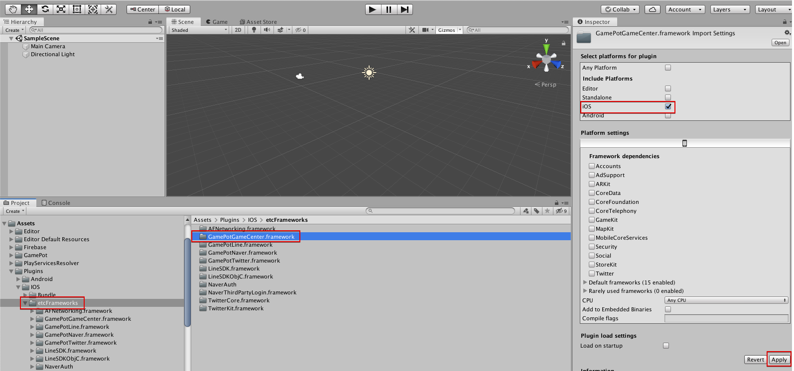

---
search:
  keyword: ['gamepot']
---

#### **We provide the <a href="https://guide.ncloud-docs.com/docs/en/home" target="_blank">[Manual]</a>and <a href="https://api.ncloud-docs.com/docs/en/home" target="_blank">[API Reference]</a>separately to offer more detailed information on how to use the NAVER CLOUD PLATFORM and help maximize the use of the API.**

<a href="https://api.ncloud-docs.com/docs/en/game-gamepot-index" target="_blank">Go to Gamepot API Reference >></a><br />
<a href="https://guide.ncloud-docs.com/docs/en/game-gamepotconsole" target="_blank">Go to Gamepot Manual >></a>

# Unity SDK

## 1. Get started

### Step 1. Download GAMEPOT plugin

Log in to your GAMEPOT dashboard and download the latest plugin.

### Step 2. Download a plugin

Go to **Assets &gt; Import Package &gt; Custom Package** in Unity and select the GamePotUnityPlugin-xxxx.unitypackage that you downloaded.


Select and import the plugin files, then the plugin will be added to your project.


### Step 3. Android

#### Set preferences

```d
minSdkVersion : API 17 (Jelly Bean, 4.2)
```

**How to configure Gradle**

Open /Assets/Plugin/Android/mainTemplate.gradle.

```java
...
android {
    ...
    defaultConfig {
        ...
        resValue "string", "gamepot_project_id", "" // required
        resValue "string", "gamepot_store", "google" // required
        resValue "string", "gamepot_app_title","@string/app_name" // required (fcm)
        resValue "string", "gamepot_push_default_channel","Default" // required (fcm)
        resValue "string", "facebook_app_id", "0" // optional (facebook)
        resValue "string", "fb_login_protocol_scheme", "fb0" // optional (facebook)
        // resValue "string", "gamepot_elsa_projectid", "" // optional (ncp elsa)
    }
    ...
}
```

Edit the following required values. These values must be edited for the plugin to work.

```java
resValue "string", "[key]", "[value]"
```

| Value                        | Description                                                                                      |
| :--------------------------- | :----------------------------------------------------------------------------------------------- |
| gamepot_project_id           | Enter a project ID issued from GAMEPOT.                                                          |
| gamepot_store                | Store value\(`google`, `one`, or `galaxy`\)                                                      |
| gamepot_app_title            | App title \(FCM\)                                                                                |
| gamepot_push_default_channel | Default channel name registered \(Default\) - DO NOT change.                                     |
| facebook_app_id              | App ID issued from Facebook                                                                      |
| fb_login_protocol_scheme     | Protocol scheme fb\[app_id\] issued from Facebook                                                |
| gamepot_elsa_projectid       | Project ID when using NCLOUD ELSA \([View more](https://www.ncloud.com/product/analytics/elsa)\) |

**How to change the push notification icon**


When you receive a push notification, a small icon shown as a default image inside the SDK is displayed on the Android notification bar; you can also choose a custom image for the game.

If you would like to specify your own image, add them to each `drawable` folder as shown in the following table. \(You can easily create icons for each folder automatically using [Android Asset Studio](http://romannurik.github.io/AndroidAssetStudio/icons-notification.html#source.type=clipart&source.clipart=ac_unit&source.space.trim=1&source.space.pad=0&name=ic_stat_gamepot_small).\)

The image file name must be ic_stat_gamepot_small.

| Folder name                                                    | Size  |
| :------------------------------------------------------------- | :---- |
| /Assets/Plugins/Android/GamePotResources/res/drawable-mdpi/    | 24x24 |
| /Assets/Plugins/Android/GamePotResources/res/drawable-hdpi/    | 36x36 |
| /Assets/Plugins/Android/GamePotResources/res/drawable-xhdpi/   | 48x48 |
| /Assets/Plugins/Android/GamePotResources/res/drawable-xxhdpi/  | 72x72 |
| /Assets/Plugins/Android/GamePotResources/res/drawable-xxxhdpi/ | 96x96 |

**How to set screen orientation**

/Assets/Plugin/Android/AndroidManifest.xml Open a file in your editor.

```markup
...
    <activity android:screenOrientation="sensorLandscape">
      <intent-filter>
        <action android:name="android.intent.action.MAIN" />
          ...
      </intent-filter>
    </activity>
...
```

Add screenOrientation to the Main Activity and type `sensorLandscape` or `sensorPortrait` for your game.

**Android Resolver Settings**

Go to `Assets > Play Services Resolver > Android Resolver > Settings`.


Clear the `"Enable Resolution On Build" checkbox`.


**Unity Build Settings**

Go to `File > Build Settings and select Gradle from > Build System.`


### Step 4. iOS

> `If you do not use` GameCenter Login, delete the file from the following location.
> &gt; `Assets/Plugins/IOS/Frameworks/GamePotGameCenter.framework`
> If the library is included, you `should turn Game Center on under Capabilities.`

Copy `GoogleService-Info.plist`, downloaded from Google Firebase, into `/Assets/Plugins/IOS/`.

Add required environment variables in `/Assets/Plugin/IOS/GamePotConfig-Info.plist`.


| Environment variable          | Description                                    |
| :---------------------------- | :--------------------------------------------- |
| gamepot_project_id            | Enter a project ID issued from GAMEPOT.        |
| gamepot_facebook_app_id       | App ID issued from Facebook                    |
| gamepot_facebook_display_name | Name displayed in Facebook                     |
| gamepot_google_app_id         | CLIENT_ID in GoogleService-Info.plist          |
| gamepot_google_url_schemes    | REVERSED_CLIENT_ID in GoogleService-Info.plist |
| gamepot_elsa_projectid        | Project ID when using NCLOUD ELSA              |

After adding scenes, click **File &gt; Build Settings &gt; Build And Run.**


After building XCode

`Add options to get user roles` below in Targets &gt;&gt; Info &gt;&gt; Custom iOS Target Properties.

The user roles are used for uploading files in the GamePot customer center.

```text
NSCameraUsageDescription
NSPhotoLibraryUsageDescription
```

iOS 14 or later version

Starting with iOS 14, when IDFA value is obtained, the user must obtain permission.

It has been changed to enable acquisition of IDFA values.

Therefore, if you use a pop-up that obtains authority to the user when obtaining the IDFA value,
In Targets >> Info >> Custom iOS Target Properties, please add the user rights acquisition option below.

> 2020.09.11<br/>
> When Apple acquires IDFA value, the mandatory application of pop-up to acquire permission to user has been postponed until early 2021.<br/>
> Please refer to the link below.<br/> > https://developer.apple.com/news/?id=hx9s63c5

```text
NSUserTrackingUsageDescription
```

## 2. Initialization

Add the following code to the object used in the first scene loaded when the game starts.

```csharp
using GamePotUnity;
public class GamePotLoginSampleScene : MonoBehaviour {
    void Awake() {
        GamePot.initPlugin();
    }
    void Start () {
        GamePot.setListener (class that inherits from GamePotInterface.cs);
         // ex) GamePot.setListener(new GamePotSampleListener());
    }

}

ex)
public class GamePotSampleListener : MonoBehaviour , IGamePot {
    ....
}
```

## 3. Error code

```csharp
public class NError
{
    // Unknown error
    public static readonly int CODE_UNKNOWN_ERROR           = 0;
    // Initialization failed
    public static readonly int CODE_NOT_INITALIZE           = 1;
    // Invalid parameter
    public static readonly int CODE_INVAILD_PARAM           = 2;
    // No member ID data
    public static readonly int CODE_MEMBERID_IS_EMPTY       = 3;
    // Not logged in
    public static readonly int CODE_NOT_SIGNIN              = 4;
    // Network module is not initialized
    public static readonly int CODE_NETWORK_MODULE_NOT_INIT = 3000;
    // Network connection error or timeout occurs
    public static readonly int CODE_NETWORK_ERROR           = 3001;
    // Server-side error
    public static readonly int CODE_SERVER_ERROR            = 4000;
    // HTTP response code is not successful
    public static readonly int CODE_SERVER_HTTP_ERROR       = 4001;
    // Network connection error or timeout occurs
    public static readonly int CODE_SERVER_NETWORK_ERROR    = 4002;
    // Error occurs when parsing data received from the server
    public static readonly int CODE_SERVER_PARSING_ERROR    = 4003;
    // Unknown error occurs in payment or error received from store
    public static readonly int CODE_CHARGE_UNKNOWN_ERROR    = 5000;
    // No product ID specified
    public static readonly int CODE_CHARGE_PRODUCTID_EMPTY  = 5001;
    // Incorrect product ID
    public static readonly int CODE_CHARGE_PRODUCTID_WRONG  = 5002;
    // Consume error
    public static readonly int CODE_CHARGE_CONSUME_ERROR    = 5003;

    // error Code
    public int code { get; set; }
    // error Message
    public string message { get; set; }
}
```

## 4. Login environment setup

### Google login

#### Google Firebase Console

1. Download google-service.json file for Android from the Google Firebase console and copy it to `/Assets/Plugins/Android/.`
2. Add the SHA-1 value of Keystore used when you build your APK to the Google Firebase console.
3. Download GoogleService-Info.plist file for iOS from the Google Firebase console and copy it to `/Assets/Plugins/IOS/.`

**If you see a notification from onCancel when logging in to Google and you are unable to log in**, please check the following:

1. Check if the requested google-service.json file is applied correctly.
2. Verify that the key store used during build is the one from which the sha-1, registered in the Firebase console, is extracted.
3. Verify that the build was made with the package name registered in the Firebase console.

### Facebook login

#### Facebook Developer Console

Add the key hash value of Keystore, used when your APK is built, to the Facebook console.

#### Android

Edit mainTemplate.gradle.

```java
...
defaultConfig {
    resValue "string", "facebook_app_id", "1234567890"
    resValue "string", "fb_login_protocol_scheme", "fb1234567890"
}
...
```

Add your app ID issued from Facebook for the developer to `facebook_app_id` and `fb{facebook_app_id}` to `fb_login_protocol_scheme`.

> For example, if your app_id is 1234567890, your `fb_login_protocol_scheme` is fb1234567890.

#### iOS

Add the following frameworks to this path: /Assets/Plugins/IOS/Frameworks.

FBSDKLoginKit.framework FBSDKCoreKit.framework GamePotFacebook.framework

### APPLE login

> This features is for iOS only. (For Android, it is supported as Web Login - refer to 8. Other API)

**Add Xcode &gt; TARGETS &gt; Signing & Capabilities &gt; + Capability &gt; Sign in with Apple.**


### Game Center login

> This features is for iOS only.
>
> If you use GameCenter Login, set it up as shown in the image below.
> &gt; `Assets/Plugins/IOS/etcFrameworks/GamePotGameCenter.framework`



> If the library is included, you `should turn Game Center on under Capabilities.`

Add Gamekit.framework in **Xcode &gt; Build Phases &gt; Linked Binary With Libraries.**


**Add Xcode &gt; TARGETS &gt; Signing & Capabilities &gt; + Capability &gt; GameCenter.**


## 5. Login/Logout/Delete member/Check

### Login

Create a user account without any additional subscription process. It creates a MemberId to identify users and returns the created information to the NUserInfo structure.

- Case 1

Request:

```csharp
GamePot.login(NCommon.LoginType);
```

Response:

```csharp
// Login succeeded
public void onLoginSuccess(NUserInfo userInfo)
{
}
// Login failed
public void onLoginFailure(NError error)
{
    // When login fails,
    // Provide the user with error.message as a pop-up message.
}
// Cancel login
public void onLoginCancel()
{
    // When the user cancels login
}
// Force update (use this method when the store version does not match the client version)
public void onNeedUpdate(NAppStatus status)
{
    // TODO: Notify the user of the status information passed in a parameter using a pop-up window.
    // TODO: Choose between the following two methods:
    // case 1: Implement your own UI through an in-game pop-up window.
    // case 2: Use a popup window in the SDK. (In this case, call the following code snippet.)
    // GamePot.showAppStatusPopup(status.ToJson());
}
// Check (call this when Check is enabled in the dashboard.)
public void onMainternance(NAppStatus status)
{
       // TODO: Notify the user of the status information passed in a parameter using a pop-up window.
    // TODO: Choose between the following two methods:
    // case 1: Implement your own UI through an in-game pop-up window.
    // case 2: Use a popup window in the SDK. (In this case, call the following code snippet.)
    // GamePot.showAppStatusPopup(status.ToJson());
}
// Exit app
public void onAppClose()
{
    // TODO: When implementing force updates or checks in case 2
    // TODO: Implement your own code to force exit the app.
}
```

- Case 2

Request:

```csharp
GamePot.login(NCommon.LoginType, GamePotCallbackDelegate.CB_Login);
```

```csharp
GamePot.login(NCommon.LoginType, (resultState, userInfo, appStatus, error) => {
    switch (resultState)
    {
        case NCommon.ResultLogin.SUCCESS:
        // login success
        break;
        case NCommon.ResultLogin.CANCELLED:
        // login cancel
        break;
        case NCommon.ResultLogin.FAILED:
        // login fail
        break;
        default:
        break;
    }
});
```

Define LoginType

```csharp
public enum LoginType
{
    NONE,
    GOOGLE,
    GOOGLEPLAY,
    FACEBOOK,
    NAVER,
    GAMECENTER,
    TWITTER,
    LINE,
    APPLE,
    GUEST,
    THIRDPARTYSDK
}
```

Define NUserInfo

```csharp
public class NUserInfo
{
    public string memberid { get; set; }        // Member ID (User’s unique ID)
    public string name { get; set; }            // Name
    public string profileUrl { get; set; }      // Profile URL (if it exists)
    public string email { get; set; }           // Email (If it exists)
    public string token { get; set; }           // Token for user validity check (used in Token Authentication API)
    public string userid { get; set; }          // Social media ID (Google, Facebook, etc.)
}
```

Define NAppStatus

```csharp
public class NAppStatus
{
    public string type {get; set; } // AppStatus type "maintenance": check, "needupdate": update
    public string message {get; set; } // Check setting: Message entered in Dashboard
    public string url {get; set; } // Check setting: URL entered in Dashboard
    public string currentAppVersion {get; set; } // Update: Current App Version
    public string updateAppVersion {get; set; } // Update: App Version entered in Dashboard
    public int currentAppVersionCode {get; set; } // Update: Current App Code
    public int updateAppVersionCode {get; set; } // Update: App Version code entered in Dashboard
    public bool isForce {get; set; } // Update: true when forced update is set in Dashboard
    public string resultPayload {get; set; } // You can ignore it as the Json value passed from the client SDK.
    public double startedAt {get; set; } // check: start time
    public double endedAt {get; set; } // check: end time
}
```

### Get login information

```csharp
GamePot.getMemberId(); // Member ID (User’s unique ID)
```

### Auto login

```csharp
NCommon.LoginType type = GamePot.getLastLoginType();
if(type != NCommon.LoginType.NONE) {
{
    // Log in with the user's last login type.
    GamePot.login(type);
}
else
{
    // The user logs in the game for the first time, or is currently logged out. Move to the login screen where the user can log in.
}
```

### Logout

It logs a user out. This does not delete the user’s account; the user can log in again later.

- Case 1

Request:

```csharp
GamePot.logout();
```

Response:

```csharp
/// Logout succeeded
public void onLogoutSuccess()
{
}

/// Logout failed
public void onLogoutFailure(NError error)
{
    // When logout fails,
    // Provide the user with error.message as a pop-up message.
}
```

- Case 2

Request:

```csharp
GamePot.logout(GamePotCallbackDelegate.CB_Common);
```

```csharp
GamePot.logout((success, error) => {
   if(success)
   {
       // Logout succeeded
   }
   else
   {
        // When logout fails,
        // Provide the user with error.message as a pop-up message.
   }
});
```

### Delete account

It deletes a user’s account and this cannot be undone.

- Case 1

Request:

```text
GamePot.deleteMember();
```

Response:

```csharp
/// Account successfully deleted.
public void onDeleteMemberSuccess() {
}

/// Failed to delete account.
public void  onDeleteMemberFailure(NError error) {
    // When deleting an account fails,
    // Provide the user with error.message as a pop-up message.
}
```

- Case 2

Request:

```csharp
GamePot.deleteMember(GamePotCallbackDelegate.CB_Common);
```

```csharp
GamePot.deleteMember((success, error) => {
   if(success)
   {
        // Account successfully deleted.
   }
   else
   {
        // When deleting an account fails,
        // Provide the user with error.message as a pop-up message.
   }
});
```

### Authentication check

After the login is complete, the login information is passed from the developer server to the GAMEPOT server to perform authentication checks.

For more information, refer to `Token Authentication` under Server to server api.

## 6. Connect/Disconnect Accounts

It connects or disconnects a game account to or from multiple social media accounts \(including Google/Facebook\).\(At least one social media account must be connected.\)

> The developer must implement the connection screen UI.

```csharp
public enum LinkingType
{
    GOOGLEPLAY,
    GAMECENTER,
    GOOGLE,
    FACEBOOK,
    NAVER,
    TWITTER,
    LINE,
    APPLE
}
```

### Connection

It connects user accounts with their social media accounts including Google/Facebook.

- Case 1

Request:

```csharp
void GamePot.createLinking(NCommon.LinkingType.XXXXX);
```

Response:

```csharp
/// Cancel account connection.
public void onCreateLinkingCancel() {
    // When a user cancels account connection
}

/// Account connection succeeded.
public void onCreateLinkingSuccess(NUserInfo userInfo) {
}

/// Account connection failed.
public void onCreateLinkingFailure(NError error) {
    // When account connection fails,
    // Provide the user with error.message as a pop-up message.
}
```

- Case 2

Request:

```csharp
void GamePot.createLinking(NCommon.LinkingType.XXXXX, GamePotCallbackDelegate.CB_CreateLinking);
```

```csharp
GamePot.createLinking(NCommon.LinkingType.XXXXX, (resultState, userInfo, error) => {
      switch (resultState)
    {
        case NCommon.ResultLinking.SUCCESS:
        // Account connection succeeded.
        break;
        case NCommon.ResultLinking.CANCELLED:
        // Cancel account connection.
        break;
        case NCommon.ResultLinking.FAILED:
        // Account connection failed.
        break;
        default:
        break;
    }
});
```

You can get information of all accounts currently connected.

```csharp
List<NLinkingInfo> linkedList = GamePot.getLinkedList();
```

Define link information

```csharp
public class NLinkingInfo
{
    public LinkingType provider { get; set; }  // google, facebook, naver, apple..
}
```

### Disconnect accounts

It disconnects user accounts from their social media accounts.

- Case 1

Request :

```csharp
void GamePot.deleteLinking(NCommon.LinkingType.XXXXX);
```

Response:

```csharp
/// Account disconnection succeeded
public void onDeleteLinkingSuccess() {
}

/// Account disconnection failed
public void onDeleteLinkingFailure(NError error) {
    // When account disconnection fails,
    // Provide the user with error.message as a pop-up message.
}
```

- Case 2

Request:

```csharp
void GamePot.deleteLinking(NCommon.LinkingType.XXXXX, GamePotCallbackDelegate.CB_Common);
```

```csharp
GamePot.deleteLinking(NCommon.LinkingType.XXXXX, (success, error) => {
    if(success)
    {
       // Account disconnection succeeded
    }
   else
   {
        // When account disconnection fails,
        // Provide the user with error.message as a pop-up message.
    }
});
```

#### Example of processing results for account connection status

According to the createLinking and deleteLinking results, you must get information of the connected account and update the connection status.

```csharp
public void onInit()
{
    UI_Update();
}
public void onCreateLink_GAMECENTER_Click()
{
    GamePot.createLinking(NCommon.LinkingType.GAMECENTER);
}
public void onCreateLink_GOOGLE_Click()
{
    GamePot.createLinking(NCommon.LinkingType.GOOGLE);
}
public void onCreateLinkingSuccess(NUserInfo userInfo)
{
    UI_Update();
}
public void onCreateLinkingFailure(NError error)
{
    UI_Update();
}
public void onDeleteLinkingSuccess(NUserInfo userInfo)
{
    UI_Update();
}
public void onDeleteLinkingFailure(NError error)
{
    UI_Update();
}

Public void UI_Update()
{
    // Ui Update in GAME
    CreateLinkManager.instance._IOS_google_state  = false;
    CreateLinkManager.instance._IOS_gamecenter_state  = false;

    List<NLinkingInfo> linkedList = GamePot.getLinkedList();
    foreach ( NLinkingInfo item in linkedList)
    {
        switch(item.provider)
        {
        case NCommon.LinkingType.GOOGLE :
            CreateLinkManager.instance._IOS_google_state  = true;
            break;
        case NCommon.LinkingType.GAMECENTER :
            CreateLinkManager.instance._IOS_gamecenter_state  = true;
            break;

        ...

        }
    }
}
```

## 7. Payment

### Get in-app products

It gets in-app products registered in the store.

This feature displays a price, currency and product name depending on each user.

```csharp
NPurchaseItem[] items = GamePot.getPurchaseItems();
foreach(NPurchaseItem item in items) {
    Debug.Log(item.productId);        // Product ID
    Debug.Log(item.price);            // Price
    Debug.Log(item.title);            // Title
    Debug.Log(item.description);    // Description
}
```

NPurchaseItem 정의

```csharp
public class NPurchaseItem
{
    public string productId { get; set; }   // 상품 ID
    public string type { get; set; }        // 상품 타입으로 "inapp"으로 고정
    public string price { get; set; }       // 가격 google 스토어 : $0.99 그외 스토어 : 0.99
    public string price_amount { get; set; }
    public string price_amount_micros { get; set; }
    public string price_currency_code { get; set; } // 통화코드 ex) KRW, USD
    public string price_with_currency { get; set; } // (UI에 노출 시 권장) 통화와 가격이 합쳐진 값 원스토어의 경우 통화 단위 전달 되지 않습니다. ex) $0.99
    public string title { get; set; }       // 상품 이름
    public string description { get; set; } // 상품 설명
}
```

### In-app payment

Payments can be made in both Google Play and the App Store using the following method.

- Case 1

Request:

```csharp
// productId: Put the product ID registered in the store.
// uniqueId: Put the receipt numbers managed separately.
// serverId: Use the server ID of the character who made the payment.
// playerId: Enter the character's ID who made the payment.
// etc.: Enter the other information from the character who made the payment.
GamePot.purchase(string productId);

GamePot.purchase(string productId, string uniqueId);

GamePot.purchase(string productId, string uniqueId, string serverId, string playerId, string etc);
```

Response:

```csharp
/// In-app payment succeeded
public void onPurchaseSuccess(NPurchaseInfo purchase) {
}

/// In-app payment failed
public void onPurchaseFailure(NError error) {
    // When an in-app payment fails,
    // Provide the user with error.message as a pop-up message.
}

/// In-app payment failed
public void onPurchaseCancel() {
}
```

- Case 2

Request:

```csharp
// productId: Product ID registered in the market
GamePot.purchase(string productId, GamePotCallbackDelegate.CB_Purchase);

GamePot.purchase(string productId, string uniqueId, GamePotCallbackDelegate.CB_Purchase);

GamePot.purchase(string productId, string uniqueId, string serverId, string playerId, string etc, GamePotCallbackDelegate.CB_Purchase);

```

```csharp
GamePot.purchase(productId, (resultState, purchaseInfo, error) => {
      switch (resultState)
    {
        case NCommon.ResultPurchase.SUCCESS:
        // purchase success
        break;
        case NCommon.ResultPurchase.CANCELLED:
        // purchase cancel
        break;
        case NCommon.ResultPurchase.FAILED:
        // purchase fail
        break;
        default:
        break;
    }
});
```

### Define NPurchaseInfo

NPurchaseInfo is information about the item that was successfully paid for. It is for your reference.

```csharp
public class NPurchaseInfo
{
    public string price { get; set; }               // Price of the purchased items
    public string productId { get; set; }           // ID of purchased items
    public string currency { get; set; }            // Currency of the price paid (KRW/USD)
    public string orderId { get; set; }             // Store order ID
    public string productName { get; set; }         // Name of purchased items
    public string gamepotOrderId { get; set; }      // Order ID created in GAMEPOT
    public string uniqueId { get; set; }            // Developer's unique receipt ID
    public string serverId { get; set; }            // Server ID (of the character that made the purchase)
    public string playerId { get; set; }            // Character ID (of the character that made the purchase)
    public string etc { get; set; }                 // Other information (of the character that made the purchase)
    public string signature { get; set; }           // Payment signature
    public string originalJSONData { get; set; }    // Receipt data
}
```

### Provide purchased items

GAMEPOT requests items from the developer server after checking receipts from the store by using the Server to server api, thereby preventing illegal payments.

Refer to `Purchase Webhook` in `Server to server api` to implement this.

### External payment

It enables payment in stores allowing external payments and unofficial stores.

> Only the call api is different; the others such as response and purchase webhook are the same as the regular payment.
>
> This requires a setting. Referring to External payments in the dashboard manual.

- Case 1

Request:

```csharp
// productId: Product ID registered in the market
GamePot.purchaseThirdPayments(string productId);
```

Use the following api for the product information list when using the external payment.

Request:

```csharp
// Data format returned is the same as getPurchaseItems().
GamePot.getPurchaseThirdPaymentsItems();
```

- Case 2

Request:

```csharp
// productId: Product ID registered in the market
GamePot.purchaseThirdPayments(string productId, GamePotCallbackDelegate.CB_Purchase);
```

```csharp
// Data format returned is the same as getPurchaseItems().
GamePot.purchase(productId, (resultState, purchaseInfo, error) => {
      switch (resultState)
    {
        case NCommon.ResultPurchase.SUCCESS:
        // purchase success
        break;
        case NCommon.ResultPurchase.CANCELLED:
        // purchase cancel
        break;
        case NCommon.ResultPurchase.FAILED:
        // purchase fail
        break;
        default:
        break;
    }
});
```

## 8. Other APIs

### Login UI supported by SDK

SDK provides an independent, complete Login UI.

```csharp
public class NLoginUIInfo
{
    public NCommon.LoginType[] loginTypes { get; set; }     // Type of Login UI to show (array)
    public bool showLogo { get; set; }                      // Whether to show the image logo
}
```

#### Call SDK Login UI

- Case 1

Request:

```csharp
 NLoginUIInfo info = new NLoginUIInfo();

//Type of Login UI to call
 info.loginTypes = new NCommon.LoginType[]
 {
     NCommon.LoginType.GOOGLE,
     NCommon.LoginType.FACEBOOK,
     NCommon.LoginType.GUEST
     ...
 };
 info.showLogo = true;
 GamePot.showLoginWithUI(info);
```

Response:

**It's the same as the regular Login API response logic. (However, in case of onLoginCancel/onLoginFailure, it will be processed as a toast message at Native level.)**

```csharp
// Login succeeded
public void onLoginSuccess(NUserInfo userInfo)
{
}
// Force update (call when the store version does not match the client version)
public void onNeedUpdate(NAppStatus status)
{
    // TODO: Notify the user with a pop-up based on the status information passed in a parameter.
    // TODO: Choose between the following two methods.
    // case 1: Implement your own UI through an in-game pop-up window.
    // case 2: Use an SDK pop-up. (In this case, call the following code snippet.)
    // GamePot.showAppStatusPopup(status.ToJson());
}
// Check (call this when Check is enabled in the dashboard.)
public void onMainternance(NAppStatus status)
{
       // TODO: Notify the user with a pop-up based on the status information passed in a parameter.
    // TODO: Choose between the following two methods.
    // case 1: Implement your own UI through an in-game pop-up window.
    // case 2: Use an SDK pop-up. (In this case, call the following code snippet.)
    // GamePot.showAppStatusPopup(status.ToJson());
}
// Exit app
public void onAppClose()
{
    // TODO: When implementing force updates or checks in case 2
    // TODO: Implement your own code here to force exit the app.
}
```

- Case 2

Request:

```csharp
 GamePot.showLoginWithUI(NLoginUIInfo, GamePotCallbackDelegate.CB_Login);
```

```csharp
 GamePot.showLoginWithUI(NLoginUIInfo, (resultState, userInfo, appStatus, error) => {
    switch (resultState)
    {
        case NCommon.ResultLogin.SUCCESS:
        // login success
        break;
        default:
        break;
    }
});
```

#### Customizing

**How to Change Login UI Image Logo**

The image logo at the top of the login UI shows the default image within the SDK, and this can be replaced by users.

**[Android]**

> If you would like to specify your own image, then add them to each `drawable` folder. \(You can easily create images for each folder automatically using [Android Asset Studio](http://romannurik.github.io/AndroidAssetStudio/icons-notification.html#source.type=clipart&source.clipart=ac_unit&source.space.trim=1&source.space.pad=0&name=ic_stat_gamepot_login_logo).\)

The image file name should be specified as ic_stat_gamepot_login_logo.png.

| Folder name                                                    | Image size |
| :------------------------------------------------------------- | :--------- |
| /Assets/Plugins/Android/GamePotResources/res/drawable-mdpi/    | 78x55      |
| /Assets/Plugins/Android/GamePotResources/res/drawable-hdpi/    | 116x82     |
| /Assets/Plugins/Android/GamePotResources/res/drawable-xhdpi/   | 155x110    |
| /Assets/Plugins/Android/GamePotResources/res/drawable-xxhdpi/  | 232x165    |
| /Assets/Plugins/Android/GamePotResources/res/drawable-xxxhdpi/ | 310x220    |

**[iOS]**

> The image logo is the ic_stat_gamepot_logo.png file in GamePot.bundle.

Rename the image file to `ic_stat_gamepot_login_logo.png` and replace it.

(Recommended image size: 310x220)

**How to Set Up Screen Orientation**

**[Android]**

Open the file /Assets/Plugin/Android/AndroidManifest.xml in your editor.

```markup
...e
    <activity android:screenOrientation="sensorLandscap">
      <intent-filter>
        <action android:name="android.intent.action.MAIN" />
          ...
      </intent-filter>
    </activity>
...
```

Add screenOrientation to Main Activity, and enter `sensorLandscape` or `sensorPortrait` to fit the game.

### Apple Login (for Android - Web Login)

#### GAMEPOT Dashboard

Dashboard Project Settings >> General >> Apple ID Login Settings

> Apple Developer Console setup is needed to use this feature.
>
> Refer to **View Help** for the relevant item in the dashboard.

Add the following aar file in the /Assets/Plugins/Android/libs path. (Select platforms for plugin - ensure to check Android)

- gamepot-channel-apple-signin.aar

### Log in to NAVER

#### Naver Developers

Register an application after selecting API used as `Login with NAVER ID.`

#### Android

Edit mainTemplate.gradle.

```java
...
defaultConfig {
    resValue "string", "gamepot_naver_clientid", "abcdefg1234567890"
    resValue "string", "gamepot_naver_secretid", "hijklmn"
}
...
```

Enter the client ID issued by the console in `gamepot_naver_clientid`, and the client secret in `gamepot_naver_secretid`.

#### iOS

Add the values to GamePotConfig-Info.plist by adding the following items.

```text
gamepot_naver_clientid // Client ID to be used in NAVER
gamepot_naver_secretid // Secret ID to be used in NAVER
gamepot_naver_urlscheme // urlscheme to be used in NAVER
```

Add the GamePotConfig-Info.plist as follows when viewing by SourceCode.

```markup
...
<key>gamepot_naver_clientid</key>
<string>xxxxxx</string>
<key>gamepot_naver_secretid</key>
<string>xxxxxx</string>
<key>gamepot_naver_urlscheme</key>
<string>xxxxxx</string>
...
```

Add the URL schemes registered in Login with NAVER ID settings to Targets &gt;&gt; Info &gt;&gt; URL Types.

Caution, characters other than `lowercase letters`,`.`,`_` may not be recognized when creating URL schemes.

### Log in to LINE

#### LINE Developers

Add the package name, keystore's SHA value and url scheme value used when your APK is built to the LINE console.

#### Android

Edit mainTemplate.gradle.

Add the issued client ID to `gamepot_line_channelid`.

```java
...
defaultConfig {
    resValue "string", "gamepot_line_channelid","xxxxxxx"
}
...
```

#### iOS

Add the values to /Assets/Plugins/IOS/GamePotConfig-Info.plist by adding the following items.

```text
gamepot_line_channelid // Client ID to be used in NAVER
gamepot_line_url_schemes // Line URL Scheme (line3rdp.{Project bundle identifier})
```

Add the following GamePotConfig-Info.plist when viewing by SourceCode.

```markup
...
<key>gamepot_line_channelid</key>
<string>xxxxxx</string>
<key>gamepot_line_url_schemes</key>
<string>xxxxxx</string>
...
```

### Log in to Twitter

#### Twitter Developers

#### Android

Edit mainTemplate.gradle.

```java
...
defaultConfig {
        resValue "string", "gamepot_twitter_consumerkey","xxxxx" // Get from Twitter developer console
        resValue "string", "gamepot_twitter_consumersecret","xxx" // Get from Twitter developer console
}
...
```

#### iOS

Add the values to GamePotConfig-Info.plist by adding the following items.

```text
gamepot_twitter_consumerkey : Twitter Consumer Key
gamepot_twitter_consumersecret :  Twitter Consumer Secret
```

Add the GamePotConfig-Info.plist as follows when viewing by SourceCode.

```markup
...
<key>gamepot_twitter_consumerkey</key>
<string>xxxxxx</string>
...
```

### Coupon

#### Use coupon

> The developer must implement the UI to enter coupons.

- Case 1

Request:

```csharp
GamePot.coupon(string couponNumber); // Coupon number

GamePot.coupon(string couponNumber, string userData); // Coupon number, user information
```

Response:

```csharp
/// Succeeded in using coupons.
public void onCouponSuccess() {
}

/// Failed to use coupons.
public void onCouponFailure(NError error) {
    // When using coupons fails,
    // Provide the user with error.message as a pop-up message.
}
```

- Case 2

Request:

```csharp
GamePot.coupon(string couponNumber, GamePotCallbackDelegate.CB_Common); // Coupon number

GamePot.coupon(string couponNumber, string userData, GamePotCallbackDelegate.CB_Common);    // Coupon number, user information
```

```csharp
GamePot.coupon(couponNumber, (success, error) => {
   if(success)
   {
       // Succeeded in using coupons.
   }
   else
   {
        // When using coupons fails,
        // Provide the user with error.message as a pop-up message.
   }
});
```

#### Provide items

When a coupon is used successfully, request an item from the developer server by using the Server to server api.

Refer to ``Item Webhook` in Server to server api to implement this.

### Push on/off

Turn each push notifications on or off: Push and Night push.

> The developer should implement the UI to turn push notifications on or off.

#### Push

- Case 1

Request:

```csharp
GamePot.setPushStatus(bool pushEnable);
```

Response:

```csharp
/// Push status change succeeded
public void onPushSuccess() {
}

/// Push status change failed
public void onPushFailure(NError error) {

    // When changing push status fails,
    // Provide the user with error.message as a pop-up message.
}
```

- Case 2

Request:

```csharp
void GamePot.setPushStatus(bool pushEnable, GamePotCallbackDelegate.CB_Common);
```

```csharp
GamePot.setPushStatus(pushEnable, (success, error) => {
    if(success)
    {
        // Push status change succeeded
    }
   else
   {
        // When changing push status fails,
        // Provide the user with error.message as a pop-up message.
    }
});
```

#### Night Push

- Case 1

Request:

```csharp
GamePot.setPushNightStatus(bool nightPushEnable);
```

Response:

```csharp
/// Push status change succeeded
public void onPushNightSuccess() {
}

/// Push status change failed
public void onPushNightFailure(NError error) {

    // When changing push status fails,
    // Provide the user with error.message as a pop-up message.
}
```

- Case 2

Request:

```csharp
void GamePot.setPushNightStatus(bool nightPushEnable, GamePotCallbackDelegate.CB_Common);
```

```csharp
GamePot.setPushNightStatus(nightPushEnable, (success, error) => {
    if(success)
    {
        // Push status change succeeded
    }
   else
   {
        // When changing push status fails,
        // Provide the user with error.message as a pop-up message.
    }
});
```

#### Enable/disable Ad Push

- Case 1

Request:

```csharp
GamePot.setPushADStatus(bool adPushEnable);
```

Response:

```csharp
/// Ad push status change succeeded
public void onPushAdSuccess() {
}

/// Ad push status change failed
public void onPushAdFailure(NError error) {

    // When changing push status fails,
    // Provide the user with error.message as a pop-up message.
}
```

- Case 2

Request:

```csharp
void GamePot.setPushADStatus(bool adPushEnable, GamePotCallbackDelegate.CB_Common);
```

```csharp
GamePot.setPushADStatus(adPushEnable, (success, error) => {
    if(success)
    {
        // Ad push status change succeeded
    }
   else
   {
        // When changing push status fails,
        // Provide the user with error.message as a pop-up message.
    }
});
```

#### Setting Push, Night Push and Ad Push at one time.

For games that prompt users to turn Push/Night Push on or off before login, call the following code snippet after login.

- Case 1

Request:

```csharp
GamePot.setPushStatus(bool pushEnable, bool nightPushEnable, bool adPushEnable);
```

Response:

```csharp
/// Push status change succeeded
public void onPushStatusSuccess() {
}

/// Push status change failed
public void onPushStatusFailure(NError error) {

    // When changing push status fails,
    // Provide the user with error.message as a pop-up message.
}
```

- Case 2

Request:

```csharp
void GamePot.setPushADStatus(bool pushEnable, bool nightPushEnable, bool adPushEnable, GamePotCallbackDelegate.CB_Common);
```

```csharp
GamePot.setPushADStatus(pushEnable, nightPushEnable, adPushEnable, (success, error) => {
    if(success)
    {
        // Push status change succeeded
    }
   else
   {
        // When changing push status fails,
        // Provide the user with error.message as a pop-up message.
    }
});
```

#### Get push status

```csharp
NPushInfo pushInfo = GamePot.getPushStatus();

// pushInfo.enable indicates whether to allow Push
// pushInfo.night indicates whether to allow Night Push
```

### Notices

It shows images added to "Notice" in GAMEPOT dashboard in order.

Recommended specs for images are shown below.

- Size : 720 _1200\(Portrait\) / 1280_ 640\(Landscape\)

  > If images are outside of specs, process them with center crop.

- Capacity: 250 KB or lower

Request:

```csharp
GamePot.showNotice(bool Flag = true);

// true: Applies Do not show for 24 hours
// false: Forced exposure, regardless of Do not show for 24 hours

GamePot.showEvent(string Type)

// Type: only show the relevant image set in Dashboard Notice >> Classification
```

Response:

If `Click action` is set as `SCHEME` in GAMEPOT dashboard, the `SCHEME` value is sent when the image is clicked.

```csharp
public void onReceiveScheme(string scheme)
{
    // Send the scheme value set in GAMEPOT dashboard
}
```

### Customer Support

Customers can register inquiries and admins can answer them.

UI for Inquiries changes according to the device's language. It supports Korean, English, Japanese, Chinese (Simplified, Traditional). English is applied for other languages.

#### Call

```csharp
GamePot.showCSWebView();
```

It supports external links so that customers who haven't logged in can register inquiries.

#### Call

```csharp
// url: External customer support URL issued by GAMEPOT

GamePot.showWebView(string url);
```

### Local Push notification

This feature enables devices to display push notifications by themselves, not via the push server.

#### Add push

Refer to the following code to display local push notifications at a specified time.

> The pushId passed as a return value should be managed by the developer.

```csharp
int pushId = GamePot.sendLocalPush(DateTime.Parse("2018-01-01 00:00:00"), "title", "content");
```

#### Cancel push

You can cancel previously added push notifications using the pushId you get when adding push.

```csharp
GamePot.cancelLocalPush(/*pushId you can get when adding push*/);
```

### Agree to terms and conditions

Provides UI to easily obtain agreement to "Terms of service" and "Collection and use of personal information".

11 types of new, `improved themes` are provided in addition to two `basic themes`, `BLUE` and `GREEN`.

Each area can be customized.

- Example of `BLUE` theme

#### Call Agree to terms and conditions

```csharp
// Default theme
BLUE
GREEN

// Improved theme
MATERIAL_RED,
MATERIAL_BLUE,
MATERIAL_CYAN,
MATERIAL_ORANGE,
MATERIAL_PURPLE,
MATERIAL_DARKBLUE,
MATERIAL_YELLOW,
MATERIAL_GRAPE,
MATERIAL_GRAY,
MATERIAL_GREEN,
MATERIAL_PEACH,
```

> Handle Agree to Terms and Conditions pop-up according to games.
>
> When you click the 'View' button, you can apply and edit the content in the dashboard.

- Case 1

Request:

```csharp
// Default call (with BLUE theme)
GamePot.showAgreeDialog();

// When applying other theme
NAgreeInfo info = new NAgreeInfo();
info.theme = "MATERIAL_RED";
GamePot.showAgreeDialog(info);
```

Response:

```csharp
// If agreed to terms and conditions
public void onAgreeDialogSuccess(NAgreeResultInfo info)
{
    // info.agree: It is true if agreed to all required terms and conditions
    // info.agreeNight: It is true if checked to agree to receive night ad push, false if not.
    // Pass agreeNight value via setPushNightStatus api after logging in.
}

// Error
public void onAgreeDialogFailure(NError error)
{
    // Provide the user with error.message as a pop-up message.
}
```

- Case 2

Request:

```csharp
// Default call (with BLUE theme)
showAgreeDialog(GamePotCallbackDelegate.CB_ShowAgree);

// When applying GREEN theme
NAgreeInfo info = new NAgreeInfo();
info.theme = "MATERIAL_RED";
GamePot.showAgreeDialog(info,GamePotCallbackDelegate.CB_ShowAgree);
```

```csharp
GamePot.showAgreeDialog(bool info, (success, NAgreeResultInfo agreeInfo, NError error) => {
   if(success)
   {
        // If agreed to terms and conditions
   }
   else
   {
        // Error
        // Provide the user with error.message as a pop-up message.
   }
});
```

#### Customizing

Change colors depending on the games without using themes.

You can specify colors to each area in `NAgreeInfo` before calling Agree to terms and conditions.

```csharp
NAgreeInfo info = new NAgreeInfo();
info.theme = "MATERIAL_RED";
info.headerBackGradient = new string[] { "0xFF00050B", "0xFF0F1B21" };
info.headerTitleColor = "0xFFFF0000";
info.headerBottomColor = "0xFF00FF00";
// Set to "" if not used
info.headerTitle = "Agree to terms and conditions";
// Android: res/drawable object ID (File name)
// iOS: asset object ID (File name)
info.headerIconDrawable = "ic_stat_gamepot_agree";

info.contentBackGradient = new string[] { "0xFFFF2432", "0xFF11FF32" };
info.contentIconColor = "0xFF0429FF";
info.contentCheckColor = "0xFFFFADB5";
info.contentTitleColor = "0xFF98FFC6";
info.contentShowColor = "0xFF98B3FF";
// Android: res/drawable object ID (File name)
// iOS: asset object ID (File name)
info.contentIconDrawable = "ic_stat_gamepot_small";

info.footerBackGradient = new string[] { "0xFFFFFFFF", "0xFF112432" };
info.footerButtonGradient = new string[] { "0xFF1E3A57", "0xFFFFFFFF" };
info.footerButtonOutlineColor = "0xFFFF171A";
info.footerTitleColor = "0xFFFF00D5";
info.footerTitle = "Start game";

// 일반 광고성 수신동의 버튼 노출 여부
info.showPush = true;

// Whether to show Agree to Receive Night Ad push button
info.showNightPush = true;

// 일반 광고성 수신동의 링크 버튼 설정(미사용 시, 입력 안함)
info.pushDetailURL = "https://...";

// 야간 광고성 수신동의 링크 버튼 설정(미사용 시, 입력 안함)
info.nightPushDetailURL = "https://...";

// Change description
info.allMessage = "Agree to all";
info.termMessage = "Required) Terms of service";
info.privacyMessage = "Required) Terms and conditions of the privacy policy";
info.pushMessage = "선택) 일반 푸시 수신 동의";
info.nightPushMessage = "Optional) Agree to receive night push";

GamePot.showAgreeDialog(info);
```

Each parameter applies to the following area:

> contentIconDrawable appears in AOS only and its default image is set to push icon.


### Terms of service

Call terms of service UI.

> Enter contents in Dashboard > Customer support > Set terms of service first.

```csharp
GamePot.showTerms();
```

### Terms and conditions of the privacy policy

Call terms and conditions of the privacy policy UI.

> Enter contents in Dashboard > Customer support > Set terms and conditions of the privacy policy first.

```csharp
GamePot.showPrivacy();
```

### Refund policy

Call refund policy UI.

> Enter contents in Dashboard > Customer support > Set refund policy first.

```csharp
GamePot.showRefund();
```

### Remote configuration

Import parameter values registered with the dashboard from the client.

> Add parameters in Dashboard > Settings > Remote configuration screen.

> The parameters added are loaded at login. You can call them after that.

```csharp
//"test_01": Parameter string
var str_value = GamePot.getConfig("test_01");

//Import all parameters added in the dashboard in json string format.
var json_value = GamePot.getConfigs();
```

### Automatic cancellation feature for payment cancellation abusers

It provides UI for Automatic cancellation feature for payment cancellation abusers. Customizable in each area.

> If a user cancels a payment by requesting to Google (limited to Google payment), the user can be blocked with "Cancel Google payment".
>
> When the user log in, a pop-up appears in SDK to encourage the user to pay for the item again.
> When the user pays again, he/she can successfully regain access.
>
> If the user repays all canceled payments, he/she is automatically unblocked.

```csharp

NVoidInfo info = new NVoidInfo();

//Types of themes
MATERIAL_RED,
MATERIAL_BLUE,
MATERIAL_CYAN,
MATERIAL_ORANGE,
MATERIAL_PURPLE,
MATERIAL_DARKBLUE,
MATERIAL_YELLOW,
MATERIAL_GRAPE,
MATERIAL_GRAY,
MATERIAL_GREEN,
MATERIAL_PEACH

//Change theme
info.theme = "MATERIAL_ORANGE";

// Change description
info.headerTitle = "Header Title Section!";

info.descHTML = "descHTML Section!";

info.listHeaderTitle = "listHeaderTitle Section!";

info.footerTitle = "footerTitle Section!";

GamePot.setVoidBuilder(info);

```

### Transfer game logs

You can call the logs that contain in-game information and view them in `Dashboard` > `Game.`

Check reserved words from the table below:

| Reserved Words                    | Required | Type   | Description    |
| :-------------------------------- | :------- | :----- | :------------- |
| GamePotSendLogCharacter.NAME      | Required | String | Character Name |
| GamePotSendLogCharacter.LEVEL     | Select   | String | Level          |
| GamePotSendLogCharacter.SERVER_ID | Select   | String | Server ID      |
| GamePotSendLogCharacter.PLAYER_ID | Select   | String | Character ID   |
| GamePotSendLogCharacter.USERDATA  | Select   | String | ETC            |

```csharp
String name = "Character name";
String level = "10";
String serverid = "svn_001";
String playerid = "283282191001";
String userdata = "";

GamePotSendLogCharacter characterLog = new GamePotSendLogCharacter();
characterLog.put(GamePotSendLogCharacter.NAME, name);
characterLog.put(GamePotSendLogCharacter.PLAYER_ID, playerid);
characterLog.put(GamePotSendLogCharacter.LEVEL, level);
characterLog.put(GamePotSendLogCharacter.SERVER_ID, serverid);
characterLog.put(GamePotSendLogCharacter.USERDATA, userdata);

Boolean result = GamePot.characterInfo(characterLog);

// Result is TRUE : validation success. Logs will send to GamePot Server
// Result is FALSE : validation was failed. Please check logcat
```

### GDPR Terms and Conditions Checklist

Shows the list of GDPR terms and conditions items activated from Dashboard.

```csharp
//The returning data format is string[].
GamePot.getGDPRCheckedList();

//Each parameter returned applies to the following settings in Dashboard.
gdpr_privacy: Privacy Policy
gdpr_term: Terms and Conditions
gdpr_gdpr: GDPR Terms and Conditions
gdpr_push_normal: Consent to receive event push notifications
gdpr_push_night: Consent to receive nighttime event push notifications (only applicable in Korea)
gdpr_adapp_custom: Consent to personalized advertisement (for countries where GDPR is applicable)
gdpr_adapp_nocustom: Consent to non-personalized advertisement (for countries where GDPR is applicable)
```

# Appendix

### It supports third-party SDK connection

## Login

> It does not support auto login. Call is required every time.

| Parameter Name | Required | Type   | Description      |
| :------------- | :------- | :----- | :--------------- |
| userid         | Required | String | User’s unique ID |

```csharp
String userid = "memberid of 3rd party sdk";

GamePot.loginByThirdPartySDK("userid");
```

## Payment

> Purchased items must be registered in GAMEPOT dashboard.

| Parameter Name | Required | Type   | Description                                      |
| :------------- | :------- | :----- | :----------------------------------------------- |
| productid      | Required | String | Item ID registered in GAMEPOT dashboard          |
| transactionid  | Required | String | Payment receipt number (GPA-xxx-xxxx-xxxx)       |
| store          | Required | String | (Store for payment - google, apple, one, galaxy) |
| currency       | Select   | String | Currency (KRW, USD)                              |
| price          | Select   | double | Amount of purchased items                        |
| paymentid      | Select   | String | payment (Usually the same as store_id)           |
| uniqueid       | Select   | String | Developer's unique ID                            |

```csharp
String productId = "purchase_001";
String transactionId = "GPA-xxx-xxxx-xxxx";
String currency = "KRW";
double price = 1200;
String paymentId = "google";
String uniqueId = "developer unique id";

sendPurchaseByThirdPartySDK(string productId, string transactionId, string currency, double price, string store, string paymentId, string uniqueId);
```
