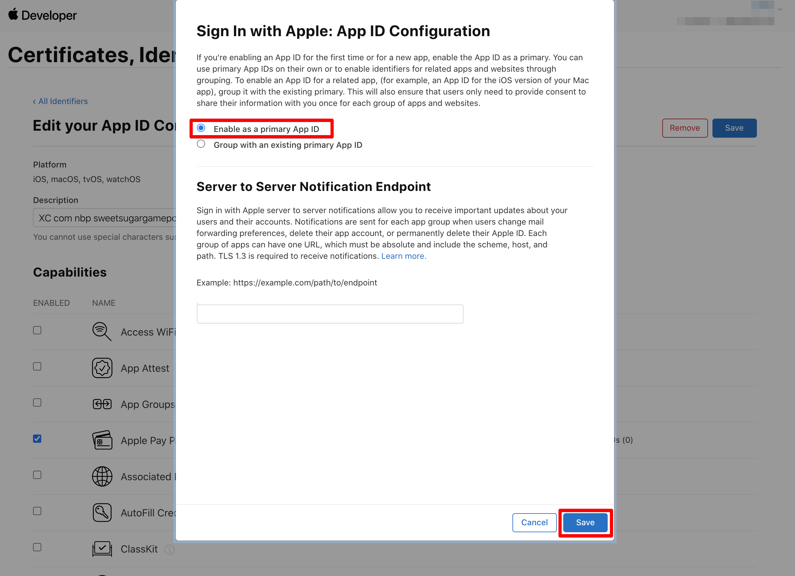

# Javascript SDK 로그인 방식 가이드 

구글 / 페이스북 / 애플 로그인 지원
로그인시 사용되는 도메인은 게임팟 담당자에서 전달 필요 ( 프로젝트 아이디 / 로그인이 호출되는 도메인 주소)

## 1. 구글 콘솔에서 설정 

   1. https://console.cloud.google.com 콘솔 진입

   2. 프로젝트 선택 > 사용자 인증 정보 > OAuth 2.0 클라이언트 ID 내 웹 애플리케이션 항목이 있는지 확인 ( 없으면 상단의 사용자 인증 벙보 만들기 메뉴를 통해 생성)

   3. 웹 애플리케이션 상세 항목을 진입하여 승인된 자바스크립트 원본 항목 + URL 추가 버튼을 클릭하여 호출하는 도메인 정보를 입력 후 저장

## 2. 페이스북 콘솔에서 설정 

   1. https://developers.facebook.com 콘솔 진입
   2. 앱 선택 및 설정 > 기본 설정 > + 플랫폼 추가 버튼 클릭 
   3. 웹사이트 항목 선택 > 호출하는 도메인 정보를 입력 후 저장 

## 3. 애플 콘솔에서 설정 

   1. https://developer.apple.com 콘솔 진입

   2. 'Apple developer console' > 'Certificates, Identifiers & Profiles' > 'Identifiers' 메뉴에서 적용하려는 앱의 'IDENTIFIER' 항목을 클릭합니다.

         

   3. 'Capabilities'의 'Sign In with Apple'을 체크합니다.

         

   4. 'Edit' 버튼을 눌러 'Enable as a primary App ID' 항목을 체크합니다.

         

   5. 설정을 저장하고 'Apple developer console' > 'Certificates, Identifiers & Profiles' > 'Identifiers' 메뉴로 돌아갑니다.

         

   6. '+'버튼을 클릭하여 'Services ID'를 생성합니다.

         

   7. 생성된 Services ID를 클릭하여 'Sign In with Apple' 항목을 수정합니다.

         

   8. 'Primary App ID' 항목에 사용할 앱을 선택하고 'Register Website URLs' 항목에 Domains and Subdomains : https:// 또는 http:// 를 제외한 도메인 정보 ( 로그인 API를 호출하는 화면의 도메인 주소)   
         Return URLs : https:// 또는 http:// 를 포함한 주소

