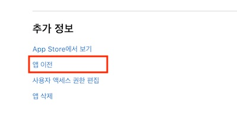

# Android, iOS 앱을 다른 계정으로 이전하는 방법

## Android

`Android`에서 앱 이전을 빠르게 신청하기 위해서는 이전 과정에서 계정 전환이 쉽지 않으므로 이전 받을 계정의 정보와 `트랜젝션 ID`를 미리 확인이 필요합니다.
업무일 기준2일 정도 소요된다고 되어 있지만 몇시간 이내에 작업이 완료되었습니다. 
(이전 신청 후 구글 측으로부터 메일이 발송이 되는데 취소 또는 빠르게 처리가 필요시 회신 메일을 보내시면 되실 것 같습니다.)

1. `Google Play Console`에서 `앱 이전` 메뉴 선택

   

2.앱을 다른 계정으로 이전 “앱 이전하기” 메뉴 선택

   

3.앱 이전하기 신청 폼에서 현재 소유자 이름(현재 게시자 이름)과 새 소유자 이메일 및 `트랜젝션 ID` 입력,

전송할 앱 : [앱 추가] 버튼을 눌러서 이전하고자 하는 앱을 선택한 뒤 적용 버튼을 탭합니다. 

*한 계정에 여러 앱이 있을 경우 여러 개의 앱을 동시에 이전할 수 있구요. 원하는 앱만 하나 선택해서 이전할 수 있습니다.

   

- 트랜젝션 ID는 안드로이드 개발자 계정 신청하고 결제 후 수신한 이메일에서 확인할 수 있다고 합니다.

  만일 수신한 이메일을 찾을 수 없다면 하기 내용처럼 진행을 하시면 됩니다.

  **구글 결제센터: https://pay.google.com/payments/home** 사이트 접속 및 로그인

  1). 거래내역 선택

  2).거래내역에서 ‘Google Play 개발자 토큰’ 선택

  3).오른쪽 거래 세부정보에서 **거래 ID**를 확인할 수 있습니다.

  거래아이디 형태는 아래와 같은 형식을 복사해서 사용하면 됩니다. 
  ex) 123123123148976978.registration-fsdf45435-9765-48b4-b73e-da43534554f30 라면
  거래 ID 는 registration-fsdf45435-9765-48b4-b73e-da43534554f30 입니다.

  

  

## iOS

이전 과정에서 테스트 플라이트에 등록된 테스터와 가능한 빌드가 있다면 모두 제거하고 신청해야 합니다.

1. 소유자 계정으로 https://appstoreconnect.apple.com 사이트에 로그인합니다.
2. 목록에서 이전할 앱 선택한다.
3. `일반 정보` 메뉴 하위 `앱 정보` 선택한다.
4. 하단 추가정보 `앱 이전`을 선택한다.

   

5. 기준 충족하도록 미달인 항목이 있다면 해결하고 다시 신청하시면 됩니다. (모든 항목이 충족되어야 이관절차가 가능합니다.)

   

6. 이전 받을 계정의 `Apple ID`와 `팀 ID`를 입력하고 계속를 클릭합니다.

   

7. 약관을 확인하고 `이전 요청`을 클릭합니다.

   

8. 앱 이전 받는 측에서 수락하면 이관이 완료 것으로 알고 있습니다.
