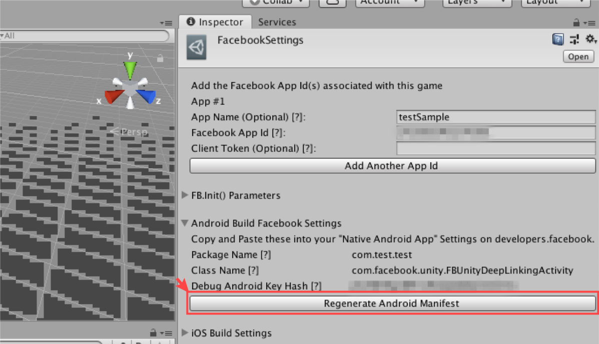

# 3rd-party SDK

GAMEPOT SDK 以外に適用する 3rd-party SDK をビルドエラーなしでゲームのプロジェクトに適用するためのガイドです。

> 各 SDK のガイドを基準に技術であり、API を適用する方法は、各 SDK のガイドを参照してください。

## Naver cafe SDK

### Android

> 準備中です。

### iOS

> 準備中です。

### Unity \([Link](https://github.com/naver/cafe-sdk-unity)\)

⒈ Unity Package を import するとき、次のような複数のファイルを除くください。


## Adjust

### Android \([Link](https://github.com/adjust/android_sdk/blob/master/doc/korean/README.md#qs-getting-started)\)

⒈ `build.gradle`にパッケージを追加で以下の二つのパッケージは、すでに含まれていますので、無視して下さい。

```java
implementation 'com.android.installreferrer:installreferrer:1.0'
implementation 'com.google.android.gms:play-services-analytics:16.0.4'
```

⒉ `AndroidManifest.xml`に既に権限が追加されますので、無視して下さい。

```java
<uses-permission android:name="android.permission.INTERNET" />
<uses-permission android:name="android.permission.ACCESS_NETWORK_STATE" />
```

### iOS\([Link](https://github.com/adjust/ios_sdk/blob/master/README.md)\)

- Gamepot と衝突がありません。

### Unity\([Link](https://github.com/adjust/unity_sdk#qs-get-sdk)\)

- Gamepot と衝突がありません。

## Adbrix

### Android

> 準備中です。

### iOS

> 準備中です。

### Unity \([Link](https://help.adbrix.io/hc/ko/articles/360007861793-%EC%95%A0%EB%93%9C%EB%B8%8C%EB%A6%AD%EC%8A%A4-Android-%EC%97%B0%EB%8F%99%ED%95%98%EA%B8%B0-Unity-#toc2)\)

⒈ Unity Package を import するとき、次のような複数のファイルを除くください。


⒉ 次のパッチをダウンロードしてください。 \([Download](https://kr.object.ncloudstorage.com/itsb/gamepot-bridge.aar.zip)\)

⒊ ダウンロードした「gamepot-bridge.aar」ファイルを次のパスのファイルと置き換えてください。

> /Assets/Android/libs/gamepot-bridge.aar

⒋ /Assets/Plugins/Android/AndroidManifest.xml に Adbrix で必要な設定を持ってきて挿入する必要があります。
詳細は Adbrix SDK ガイドを参照してください。 \([Guide](https://help.adbrix.io/hc/ko/articles/360007861793-%EC%95%A0%EB%93%9C%EB%B8%8C%EB%A6%AD%EC%8A%A4-Android-%EC%97%B0%EB%8F%99%ED%95%98%EA%B8%B0-Unity-#toc6)\)

## Singular

### Android \([Link](https://developers.singular.net/docs/android-sdk)\)

_`[sdk v9.2.0]`_

⒈ アプリレベルの`build.gradle`にパッケージを追加時の下のパッケージは、すでに含まれていますので、無視して下さい。

```java
compile 'com.android.installreferrer:installreferrer:1.0'
```

⒉ `AndroidManifest.xml`に既に権限が追加されますので、無視して下さい。

```java
<uses-permission android:name="android.permission.INTERNET" />
<uses-permission android:name="android.permission.ACCESS_NETWORK_STATE" />
```

### iOS \([Link](https://developers.singular.net/docs/ios-sdk)\)

_`[sdk v9.2.0]`_

- Gamepot と衝突がありません。

### Unity \([Link](https://developers.singular.net/docs/unity-sdk)\)

_`[sdk v9.2.0]`_

- 次のパスのライブラリファイルを削除してください。

> `Assets/Plugins/Android/libs/installreferrer-1.0.aar`

## Appsflyer

### Android

> 準備中です。

### iOS

> 準備中です。

### Unity

> 準備中です。

## AdMob

**_`androidxパッケージのmigration問題のために、Google Play Service18.0.0以上のバージョンが含まれているsdkは使用できません。`_**

### Android \([Link](https://firebase.google.com/docs/admob/android/quick-start?hl=ko)\)

- Gamepot サービスは Firebase Messaging サービスを利用します。Admob with Firebase を介して設定してください。

### iOS \([Link](https://developers.google.com/admob/ios/quick-start?hl=ko)\)

- Gamepot と衝突がありません。

### Unity \([Link](https://github.com/googleads/googleads-mobile-unity/releases/tag/3.17.0)\)

_`[Google Mobile Ads v3.17.0]`_

⒈ 上記 Link を介してプラグイン（v3.17.0）をゲームプロジェクトに import します。

⒉`mainTemplate.gradle`で以下のように AdMob、Android プロジェクトを追加します。


⒊AdMob SDK（Unity）の場合には、ユニティパッケージを import した後 Unity Play Services Resolver 機能を使用します。（AdMob ガイドを参照）

- Resolve 機能適用時、既存のゲームポット SDK で使用されているライブラリと重複するライブラリも一緒にコピーされます。

- AdMob SDK と重複するライブラリのリストを/ Assets/ Plugins/ Android/ libs/削除してください。

- 削除する必要がライブラリのリストは以下の通りです。

|                                       |                                               |
| :------------------------------------ | :-------------------------------------------- |
| 1. core-common-1.1.0.jar              | 2. lifecycle-common-1.1.0.jar                 |
| 3. lifecycle-runtime-1.1.0.aar        | 4. customtabs-27.1.1.aar                      |
| 5. support-annotations-27.1.1.jar     | 6. support-compat-27.1.1.aar                  |
| 7. support-core-ui-27.1.1.aar         | 8. support-core-utils-27.1.1.aar              |
| 9. support-fragment-27.1.1.aar        | 10. support-media-compat-27.1.1.aar           |
| 11. support-v4-27.1.1.aar             | 12. play-services-ads-identifier-16.0.0.aar   |
| 13. play-services-basement-16.2.0.aar | 14. play-services-measurement-base-16.0.5.aar |
|                                       |                                               |

## Admob Mediation

**_`androidxパッケージのmigration問題のために、Google Play Service18.0.0以上のバージョンが含まれているsdkは使用できません。`_**

### Android\([Link](https://developers.google.com/admob/android/mediate)\)

_`[Google Play service Ads SDK 17.2.0]`_

#### - Vungle\([Link](https://developers.google.com/admob/android/mediation/vungle)\)

- Gamepot と衝突がありません。 \(Vungle sdk 6.3.24\)

#### - Unity Ads\([Link](https://developers.google.com/admob/android/mediation/unity)\)

- アプリレベルの`build.gradle`にパッケージを追加する場合は、そのパッケージに追加してください。

```java
compile 'com.google.ads.mediation:unity:3.1.0.0'
```

#### - Facebook\([Link](https://developers.google.com/admob/android/mediation/facebook)\)

- アプリレベルの`build.gradle`にパッケージを追加する場合は、そのパッケージに追加してください。

```java
compile 'com.google.ads.mediation:facebook:5.4.0.0'
```

### iOS \([Link](https://developers.google.com/admob/ios/mediate)\)

_`[Google Mobile Ads SDK 7.49.0]`_

#### - Vungle\([Link](https://developers.google.com/admob/ios/mediation/vungle)\)

- Gamepot と衝突がありません。 \(Vungle sdk 6.3.2\)

#### - Unity Ads\([Link](https://developers.google.com/admob/ios/mediation/unity)\)

- Gamepot と衝突がありません。 \(UnityAds sdk 3.2.0\)

#### - Facebook\([Link](https://developers.google.com/admob/ios/mediation/facebook)\)

- Gamepot と衝突がありません。 \(iOS Audience Network sdk 5.5.0\)

### Unity \([Link](https://github.com/googleads/googleads-mobile-unity/releases/tag/3.17.0)\)

_`[Google Mobile Ads Unity Plugin v3.17.0]`_

#### - Vungle\([Link](https://developers.google.com/admob/unity/mediation/vungle)\)

- Gamepot と衝突がありません。

#### - Unity Ads\([Link](https://developers.google.com/admob/unity/mediation/unity)\)

- Gamepot と衝突がありません。

#### - Facebook\([Link](https://developers.google.com/admob/unity/mediation/facebook)\)

- Gamepot と衝突がありません。

## Facebook SDK (Unity Plugin)

### Unity \([Link](https://developers.facebook.com/docs/unity/downloads)\)

_`[FB UnityPackage ver 7.18.0]`_

⒈ Unity Package を import し、Unity Play Services Resolver を適用してください。


- Resolve 機能適用時、既存のゲームポット SDK で使用されているライブラリと重複するライブラリも一緒にコピーされます。

- Facebook SDK と重複するライブラリのリストを/ Assets/ Plugins/ Android/ libs/削除してください。

- 削除する必要がライブラリのリストは以下の通りです。

|                                        |                                        |
| :------------------------------------- | :------------------------------------- |
| 1. animated-vector-drawable-27.1.1.aar | 2. appcompat-v7-27.1.1.aar             |
| 3. bolts-android-1.4.0.jar             | 4. bolts-applinks-1.4.0.jar            |
| 5. bolts-tasks-1.4.0.jar               | 6. cardview-v7-27.0.2.aar              |
| 7. core-3.3.0.jar                      | 8. core-common-1.1.0.jar               |
| 9. customtabs-27.1.1.aar               | 10. facebook-android-sdk-5.2.0.aar     |
| 11. facebook-applinks-5.2.0.aar        | 12. facebook-common-5.2.0.aar          |
| 13. facebook-core-5.2.0.aar            | 14. facebook-login-5.2.0.aar           |
| 15. facebook-messenger-5.2.0.aar       | 16.facebook-places-5.2.0.aar           |
| 17. facebook-share-5.2.0.aar           | 18. lifecycle-runtime-1.1.0.aar        |
| 19. lifecycle-common-1.1.0.jar         | 20. support-compat-27.1.1.aar          |
| 21. support-core-ui-27.1.1.aar         | 22. support-core-utils-27.1.1.aar      |
| 23. support-fragment-27.1.1.aar        | 24. support-media-compat-27.1.1.aar    |
| 25. support-v4-27.1.1.aar              | 26. support-vector-drawable-27.1.1.aar |
| 27. support-annotations-27.1.1.jar     |
|                                        |                                        |

- （iOS の場合）重複しているフレームワークのリストを/ Assets/ Plugins/ IOS/ Frameworks/削除してください。

  |                            |     |
  | :------------------------- | :-- |
  | 1. FBSDKCoreKit.framework  |
  | 2. FBSDKLoginKit.framework |
  |                            |     |

⒉ UnityEditer 上 FacebookSettings に Facebook App Id を入力して、赤表示されたボタンを押して AndroidManifest を Regenerate ください。



⒊ /Assets/Plugins/Android/AndroidManifest.xml をエディタで開いて、赤表示されたライン（Facebook App ID）を削除してください。


