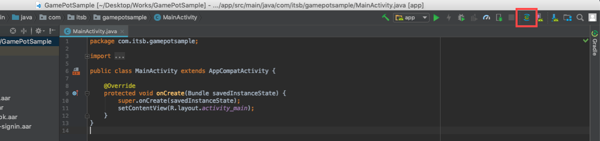
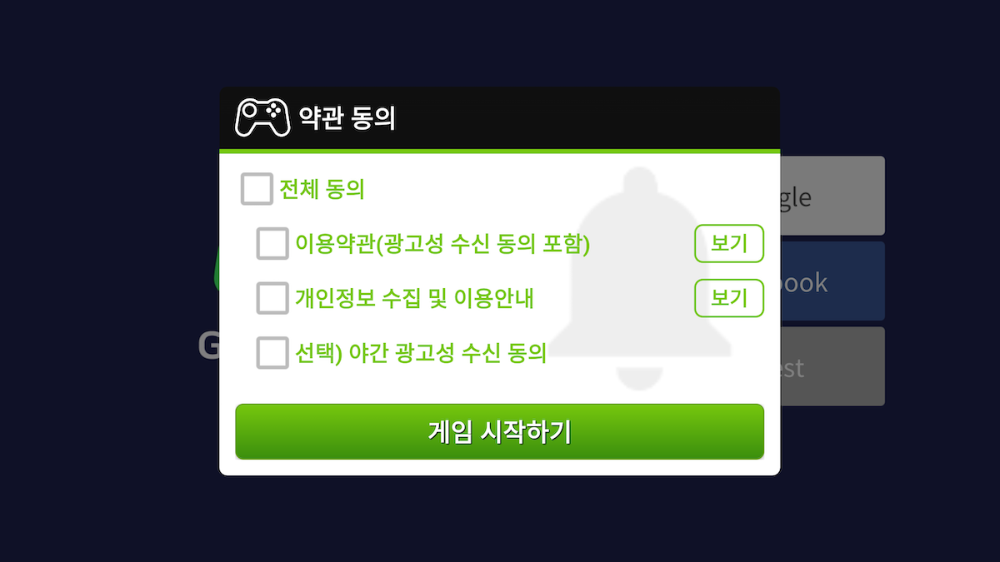
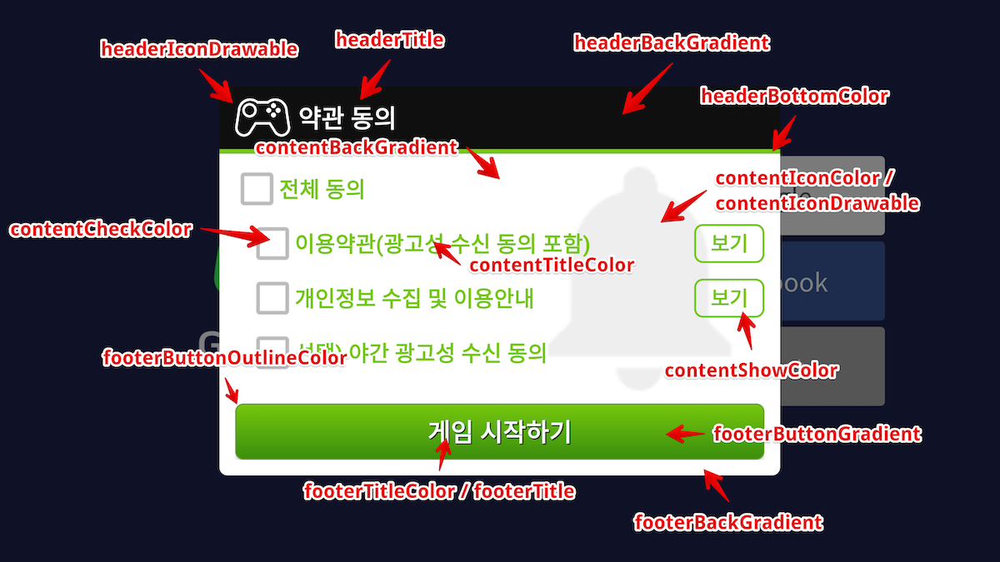

---
search:
  keyword: ['gamepot']
---

# 1. スタートする

## 開発環境の構成

アンドロイド(Android)用アプリケーションの開発のためにはデベロッパーツール(Android Studioなど)を設置する必要があります。使用するデベロッパーツールによっては追加でJava SDKとAndroid SDK などを設置する必要があることもあります。

AndroidでGAMEPOTを使用するためのシステム環境は以下の通りです。

**[システム環境]**

- 最小事項: API 17 (Jelly Bean, 4.2) 以上, gradle 2.3.0以上
- 開発環境: Android Studio

### プロジェクトの生成


### ライブラリーの追加

ダウンロードしたAOS SDKファイルを`app/libs` フォルダに追加します。


### build.gradleの設定

`build.gradle` ファイルはプロジェクト`root` フォルダと`app` フォルダにそれぞれ存在します。

1. プロジェクト `root` フォルダの `build.gradle` ファイルを修正

   ```java
   buildscript {

       repositories {
           ...
           google()
           jcenter()
           maven { url "https://jitpack.io" }
           maven { url "https://jcenter.bintray.com" }
       }
       dependencies {
          ...
           classpath 'com.google.gms:google-services:4.2.0'
       }
   }

   allprojects {
       repositories {
           ...
           google()
           jcenter()
           maven { url "https://jitpack.io" }
           maven { url "https://jcenter.bintray.com" }
       }
   }

   ```

2. `app` フォルダの `build.gradle` を修正

   > [xxxxx]には実際適用される値を入れます。

   ```java
   android {
       defaultConfig {
           ...
           // GamePot [START]
           resValue "string", "gamepot_project_id", "[projectId]" // required
           resValue "string", "gamepot_api_url", "[apiUrl]" // required
           resValue "string", "gamepot_store", "[storeId]" // required
           resValue "string", "gamepot_app_title","@string/app_name" // required (fcm)
           resValue "string", "gamepot_push_default_channel","Default" // required (fcm)
           resValue "string", "facebook_app_id", "[Facebook ID]" // facebook
           resValue "string", "fb_login_protocol_scheme", "fb[Facebook ID]" // (facebook)
           // GamePot [END]
       }
   }

   repositories {
       flatDir {
           dirs 'libs'
       }
   }

   dependencies {
       compile 'com.android.support:multidex:1.0.1'

       // GamePot common [START]
       compile(name: 'gamepot-common', ext: 'aar')
       compile('io.socket:socket.io-client:1.0.0') {
           exclude group: 'org.json', module: 'json'
       }
       compile('com.github.ihsanbal:LoggingInterceptor:3.0.0') {
           exclude group: 'org.json', module: 'json'
       }
       compile "com.github.nisrulz:easydeviceinfo:2.4.1"
       compile 'com.android.installreferrer:installreferrer:1.0'
       compile 'com.google.code.gson:gson:2.8.2'
       compile 'com.jakewharton.timber:timber:4.7.0'
       compile 'com.squareup.okhttp3:okhttp:3.10.0'
       compile 'com.apollographql.apollo:apollo-runtime:1.0.0-alpha2'
       compile 'com.apollographql.apollo:apollo-android-support:1.0.0-alpha2'
       compile 'com.android.billingclient:billing:1.1'
       compile 'com.google.firebase:firebase-core:16.0.6'
       compile 'com.google.firebase:firebase-messaging:17.3.4'
       // GamePot common [END]

       compile(name: 'gamepot-channel-base', ext: 'aar')
       // GamePot facebook [START]
       compile(name: 'gamepot-channel-facebook', ext: 'aar')
       compile 'com.facebook.android:facebook-android-sdk:4.39.0'
       // GamePot facebook [END]

       // GamePot google sigin [START]
       compile(name: 'gamepot-channel-google-signin', ext: 'aar')
       compile "com.google.android.gms:play-services-base:16.0.1"
       compile "com.google.android.gms:play-services-auth:16.0.1"
       // GamePot google sigin [END]
   }

   // ADD THIS AT THE BOTTOM
   apply plugin: 'com.google.gms.google-services'
   ```

3. グーグル(Google)から発行された `google-service.json` ファイルを `/app/` フォルダ下位にコピーします。

4. Gradle Sync Now

   Android Studioで下のボタンをクリックしてリロードします。



* リロードをクリックしてから発生し得る失敗

  * Configuration 'compile' is obsolete and has been replaced with 'implementation' and 'api'.
    It will be removed at the end of 2018. For more information see: <http://d.android.com/r/tools/update-dependency-configurations.html>

    > Gradleのバージョン3以上をご利用の場合 compileをimplementation

  * No matching client found for package name 'packagename'

    > appのパッケージ名とgoogle-service.jsonに宣言されたパッケージ名が一致するように変更してください。

### AndroidManifest.xmlの設定

一般的にはゲームに使われる設定値を追加します。各設定別の詳しい説明はコードをご参照ください。

> お勧め事項であり、デベロッパー側の判断の下で適用可否をご検討ください。

```xml
<?xml version="1.0" encoding="utf-8"?>
<manifest xmlns:android="http://schemas.android.com/apk/res/android"
    xmlns:tools="http://schemas.android.com/tools">

    <!--電話機能がない機器(タブレット)でもストアでダウンロードできるように設定-->
    <uses-feature android:name="android.hardware.telephony" android:required="false" />
    <!--音声チャットがサポートされるゲームをマイクのない機器でもストアでダウンロードできるように設定-->
    <uses-feature android:name="android.hardware.microphone" android:required="false" />

    <!--allowBackupを必ずfalseにしてください。(ゲームが再設置されたら自動でshared preference値をリカバリーするのを防ぐ用途です。)-->
    <application
        android:name="android.support.multidex.MultiDexApplication"
        android:allowBackup="false"
        tools:replace="android:allowBackup">

        <!--resizeableActivity : アプリ分割画面をみる機能を無効化-->
        <activity
            android:resizeableActivity="false">
            <intent-filter>
                <action android:name="android.intent.action.MAIN" />
                <category android:name="android.intent.category.LAUNCHER" />
            </intent-filter>
        </activity>

        <!--ギャラクシーS8と同じスクリーン対応-->
        <meta-data android:name="android.max_aspect" android:value="2.1" />

    </application>
</manifest>
```

### Push Notificationアイコンの設定


プッシュ受信の際にNotification barに表示するアイコン(Icon)は基本的にSDK内部の基本イメージで処理され、ゲームに適した形で直接入れることもできます。

#### アイコンを直接入れる

> [Android Asset Studio](http://romannurik.github.io/AndroidAssetStudio/icons-notification.html#source.type=clipart&source.clipart=ac_unit&source.space.trim=1&source.space.pad=0&name=ic_stat_gamepot_small)を使用してアイコンを作成すると、自動でフォルダ別に作成されるので、各フォルダに入れるだけで済みます。

1. `res/drawable` 関連フォルダを以下のように生成
   - res/drawable-mdpi/
   - res/drawable-hdpi/
   - res/drawable-xhdpi/
   - res/drawable-xxhdpi/
   - res/drawable-xxxhdpi/

2. 以下のサイズ別にイメージを作成
    - 24x24
    - 36x36
    - 48x48
    - 72x72
    - 96x96

3. 以下のようにフォルダ別にサイズに適したイメージを追加

|  フォルダ名            |  サイズ  |
|  --------------------  |  -----  |
|  res/drawable-mdpi/     |  24x24  |
|  res/drawable-hdpi/     |  36x36  |
|  res/drawable-xhdpi/    |  48x48  |
|  res/drawable-xxhdpi/   |  72x72  |
|  res/drawable-xxxhdpi/  |  96x96  |

4. イメージファイル名を `ic_stat_gamepot_small`に変更

# 2. 初期化

`MainActivity.java` ファイルに以下の部分を追加します。

```java
import io.gamepot.common.GamePot;
import io.gamepot.common.GamePotLocale;

@Override
protected void onCreate(Bundle savedInstanceState) {
    super.onCreate(savedInstanceState);
    // GAMEPOT初期化。 contextは必ずapplication contextを入れてください。
    // setup APIは他のAPIより最も最初に呼び出さなければなりません。
    GamePot.getInstance().setup(getApplicationContext());
}

@Override
protected void attachBaseContext(Context newBase) {
    super.attachBaseContext(GamePotLocale.onAttach(newBase));
}

@Override
protected void onActivityResult(int requestCode, int resultCode, Intent data) {
    super.onActivityResult(requestCode, resultCode, data);
    GamePot.getInstance().onActivityResult(requestCode, resultCode, data);
}

@Override
protected void onStart() {
    super.onStart();
    GamePotChat.getInstance().start();
}

@Override
protected void onStop() {
    super.onStop();
    GamePotChat.getInstance().stop();
}

@Override
protected void onDestroy() {
    super.onDestroy();
    GamePot.getInstance().onDestroy();
}
```

# 3. ログイン、ログアウト、会員退会

グーグル、フェイスブック、NAVERなど多様なSDKを統合して使用できます。

## グーグル(Firebase) コンソールの設定

APKビルドの際に使用したKeystoreのSHA-1値をFirebaseコンソールConsole)に追加します。

> SHA-1 の値はデベロッパー社にリクエストします。


## フェイスブックコンソールの設定

APKビルドの際に使用したKeystoreのキーハッシュ値をフェイスブックコンソールに追加します。

> キーハッシュ値はデベロッパー社にリクエストします。


## 設定

### MainActivity.javaファイルの修正

ログイン関連コードを以下のように宣言します。

```java
import io.gamepot.channel.GamePotChannel;
import io.gamepot.channel.GamePotChannelType;
import io.gamepot.channel.facebook.GamePotFacebook;
import io.gamepot.channel.google.signin.GamePotGoogleSignin;

public class MainActivity extends AppCompatActivity {
    @Override
    protected void onCreate(Bundle savedInstanceState) {
        // setup APIは一番最初に呼び出さなければなりません。
        GamePot.getInstance().setup(getApplicationContext());

        ...
        // ログインを使用しようとするチャンネル別にaddChannelを呼び出してください。(Guest方式は基本で含まれる)
        // Google Loginの初期化
        GamePotChannel.getInstance().addChannel(this, GamePotChannelType.GOOGLE, new GamePotGoogleSignin());
        // Facebook Loginの初期化
        GamePotChannel.getInstance().addChannel(this, GamePotChannelType.FACEBOOK, new GamePotFacebook());
        ...
    }

    @Override
    protected void onActivityResult(int requestCode, int resultCode, Intent data) {
        super.onActivityResult(requestCode, resultCode, data);
        GamePotChannel.getInstance().onActivityResult(this, requestCode, resultCode, data);
    }

    @Override
    protected void onDestroy() {
        super.onDestroy();
        GamePotChannel.getInstance().onDestroy();
    }
}
```

## ログイン

ログインUIはデベロッパー社で実装し、ログインボタンをクリックすると連動します。

```java
import io.gamepot.channel.GamePotChannel;
import io.gamepot.channel.GamePotChannelListener;
import io.gamepot.channel.GamePotChannelType;
import io.gamepot.channel.GamePotUserInfo;
import io.gamepot.common.GamePotError;

// ログインタイプの定義
// GamePotChannelType.GOOGLE: グーグル
// GamePotChannelType.FACEBOOK: フェイスブック
// GamePotChannelType.GUEST: ゲスト

// グーグルログインボタンを押した際に呼び出し
GamePotChannel.getInstance().login(this, GamePotChannelType.GOOGLE, new GamePotChannelListener<GamePotUserInfo>() {
    @Override
    public void onCancel() {
        // ユーザーがログインを取り消した状況。
    }

    @Override
    public void onSuccess(GamePotUserInfo userinfo) {
        // ログイン完了、ゲームロジックに合わせて処理してください。
    }

    @Override
    public void onFailure(GamePotError error) {
        // ログイン失敗。error.getMessage()を利用してエラーメッセージを表示してください。
    }
});
```

## 自動ログイン

ユーザーが最後にログインした情報を転送するAPIを利用して自動ログインを実装できます。

```java
import io.gamepot.channel.GamePotChannel;
import io.gamepot.channel.GamePotChannelListener;
import io.gamepot.channel.GamePotChannelType;
import io.gamepot.channel.GamePotUserInfo;
import io.gamepot.common.GamePotError;

// ユーザーが最後にログインした情報を転送するAPI
final GamePotChannelType lastLoginType = GamePotChannel.getInstance().getLastLoginType();

if(lastLoginType != GamePotChannelType.NONE) {
    // 最後にログインしたログインタイプでログインする方式です。
    GamePotChannel.getInstance().login(this, lastLoginType, new GamePotChannelListener<GamePotUserInfo>() {
        @Override
        public void onCancel() {
            // ユーザーがログインを取り消した状況
        }

        @Override
        public void onSuccess(GamePotUserInfo info) {
            // 自動ログイン完了。ゲームロジックに合わせて処理してください。
        }

        @Override
        public void onFailure(GamePotError error) {
            // 自動ログインの失敗。 error.getMessage()を利用してエラーメッセージを表示してください。
        }
    });
}
else
{
    // 初めてゲームを実行したりログアウトした状態。ログインできるログイン画面に移動してください。
}
```

## ログアウト

現在の会員アカウントをログアウトします。

```java
import io.gamepot.channel.GamePotChannel;
import io.gamepot.common.GamePotCommonListener;
import io.gamepot.common.GamePotError;

GamePotChannel.getInstance().logout(this, new GamePotCommonListener() {
    @Override
    public void onSuccess() {
        // ログアウト完了。初期画面に移動してください。
    }

    @Override
    public void onFailure(GamePotError error) {
        // ログアウト失敗。error.getMessage()を利用してエラーメッセージを表示してください。
    }
});
```

## 会員脱会

現在の会員アカウントを脱会させます。

```java
import io.gamepot.channel.GamePotChannel;
import io.gamepot.common.GamePotCommonListener;
import io.gamepot.common.GamePotError;

GamePotChannel.getInstance().deleteMember(this, new GamePotCommonListener() {
    @Override
    public void onSuccess() {
        // 会員脱会の成功。初期画面に移動してください。
    }

    @Override
    public void onFailure(GamePotError error) {
        // 会員脱会の失敗。error.getMessage()を利用してエラーメッセージを表示してください。
    }
});
```

##検証

ログイン完了後、ログイン情報をデベロッパー社サーバからGAMEPOTサーバに転送するとログイン検証が進みます。

詳しい説明は `Server to server api` メニューの `Authentication check` 項目をご参照ください。

# 4. アカウントの連動

一つのゲームアカウントに複数のソーシャルアカウント(グーグル、フェイスブックなど)を接続/解除できる機能です。(最小連動ソーシャルアカウントは1つです。)

> 連動画面のUIはデベロッパー社で実装してください。

## アカウントの連動

グーグル、フェイスブックなどのIDにアカウントを連動できます。

```java
import io.gamepot.channel.GamePotChannel;
import io.gamepot.channel.GamePotChannelListener;
import io.gamepot.channel.GamePotChannelType;
import io.gamepot.channel.GamePotUserInfo;
import io.gamepot.common.GamePotError;

// グーグルアカウントの連動
// GamePotChannelType.GOOGLE
// フェイスブックアカウントの連動
// GamePotChannelType.FACEBOOK

GamePotChannel.getInstance().createLinking(this, GamePotChannelType.GOOGLE, new GamePotChannelListener<GamePotUserInfo>() {
    @Override
    public void onSuccess(GamePotUserInfo userInfo) {
        // 連動完了。連動結果に対する文を表示してください。(例：アカウント連動に成功しました。)
        
    }

    @Override
    public void onCancel() {
        // ユーザーが取り消した場合
    }

    @Override
    public void onFailure(GamePotError error) {
        // 連動失敗。error.getMessage()を利用してエラーメッセージを表示してください。
    }
});
```

## 連動されたリスト

当該APIを通じてアカウントに対する連動可否を確認できます。

```java
import io.gamepot.channel.GamePotChannel;
import java.util.ArrayList;

// タイプの定義
// GamePotChannelType.GOOGLE
// GamePotChannelType.FACEBOOK
// タイプによる連動結果を出します。
boolean isLinked = GamePotChannel.getInstance().isLinked(GamePotChannelType.GOOGLE);

// 連動されている全てのタイプについてJSON形式で表示します。
// もしGOOGLEとFACEBOOKに連動された場合は以下のように表示されます。
// [{“provider”:”google”},{“provider”:”facebook”}]
JSONArray linking = GamePotChannel.getInstance().getLinkedList();
```

## 連動の解除

以前連動されているアカウントを解除します。

```java
import io.gamepot.channel.GamePotChannel;
import io.gamepot.channel.GamePotChannelType;
import io.gamepot.common.GamePotCommonListener;
import io.gamepot.common.GamePotError;

GamePotChannel.getInstance().deleteLinking(this, GamePotChannelType.GOOGLE, new GamePotCommonListener() {
    @Override
    public void onSuccess() {
        // 連動解除の完了。連動結果に対する文を表示してください。(例：アカウント連動を解除しました。)
    }

    @Override
    public void onFailure(GamePotError error) {
        // 連動解除の失敗。error.getMessage()を利用してエラーメッセージを表示してください。
    }
});
```

# 5. 広告プラットフォーム

Facebook, Adjust, Adbrix など多様な広告プラットフォームSDKを統合して使用できます。

## 設定

### MainActivity.java ファイルの修正

広告プラットフォームの関連コードを以下のように宣言します。

```java
import io.gamepot.ad.GamePotAd;
import io.gamepot.ad.GamePotAdActions;
import io.gamepot.ad.facebook.GamePotAdFacebook;
import io.gamepot.ad.igaworks.GamePotAdIgaworks;
import io.gamepot.ad.adjust.GamePotAdAdjust;

public class MainActivity extends AppCompatActivity {
    @Override
    protected void onCreate(Bundle savedInstanceState) {
        // setup APIは一番最初に呼び出さなければなりません。
        GamePot.getInstance().setup(getApplicationContext());

        ...
		// GamePot広告の初期化。使用しようとする広告モジュール別にaddAdしてください。
        GamePotAd.getInstance().setSandbox(false); // 開発バージョンはtrue. 配布バージョンはfalse
        GamePotAd.getInstance().setActivity(this);
        // Facebook初期化(使用の際に追加)
		GamePotAd.getInstance().addAd(new GamePotAdFacebook());
        // IGAWorks初期化(使用の際に追加)
		GamePotAd.getInstance().addAd(new GamePotAdIgaworks());
        // Adjust初期化(使用の際に追加)
        GamePotAd.getInstance().addAd(new GamePotAdAdjust());
        ...
    }

    @Override
    protected void onResume() {
        super.onResume();
        GamePotAd.getInstance().tracking(GamePotAdActions.RESUME);
    }

    @Override
    protected void onPause() {
        super.onPause();
        GamePotAd.getInstance().tracking(GamePotAdActions.PAUSE);
    }

    @Override
    protected void onDestroy() {
        super.onDestroy();
        GamePotAd.getInstance().onDestroy();
    }
}
```

### InstallReferrerの設定

#### ReferrerCatcher.javaファイルの追加

プロジェクトに`ReferrerCatcher.java` ファイルを生成してコードを追加してください。

```java
import android.content.BroadcastReceiver;
import android.content.Context;
import android.content.Intent;
import android.os.Bundle;
import android.util.Log;

import com.adjust.sdk.AdjustReferrerReceiver;
import com.google.android.gms.analytics.CampaignTrackingReceiver;
import com.igaworks.IgawReceiver;

public class ReferrerCatcher extends BroadcastReceiver {
    @Override
    public void onReceive(Context context, Intent intent) {
        if(intent != null) {
            Bundle extras = intent.getExtras();
            if (extras != null) {
                Log.i("ReferrerCatcher", extras.getString("referrer"));
            }
        }

        // TODO: Adjustを使用する場合のみ以下のコードを追加
        try {
            Class.forName("com.adjust.sdk.AdjustReferrerReceiver");
            Class.forName("com.google.android.gms.analytics.CampaignTrackingReceiver");

            // Adjust [START]
            new AdjustReferrerReceiver().onReceive(context, intent);
            new CampaignTrackingReceiver().onReceive(context, intent);
            // Adjust [END]

            Log.i("ReferrerCatcher", "Adjust");
        } catch (Exception e) {
            e.printStackTrace();
        }

        // TODO: Igaworksを使用する場合のみ以下のコードを追加
        try {
            Class.forName("com.igaworks.IgawReceiver");

            // IGAW [START]
            IgawReceiver igawReceiver = new IgawReceiver();
            igawReceiver.onReceive(context, intent);
            // IGAW [END]

            Log.i("ReferrerCatcher", "IGAW");
        }
        catch(Exception e) {
            e.printStackTrace();
        }
    }
}
```

#### AndroidManifest.xmlファイルの修正

AndoridManifest.xmlに以下のコードを追加して`android:name`には上で生成したReferrerCatcher クラスのルートを入れてください。

```xml
<manifest>
	...
	<application>
		...
		<!--IGAW / Facebook / Adjustモジュールを使用すると必須-->
        <receiver android:name="{ReferrerCatcherのルート}" android:exported="true">
            <intent-filter>
                <action android:name="com.android.vending.INSTALL_REFERRER" />
            </intent-filter>
        </receiver>
        <!--[END]-->
		...
	</application>
	...
</manifest>
```

### build.gradle ファイルの修正

使用しようとするプラットフォームに合わせて関連設定の値を追加します。

```java

android {
	...
    defaultConfig {
    	...
    	// FACEBOOK利用の際に追加[START]
    	resValue "string", "facebook_app_id", "xxxxxxxxxxxxxxxx"
        resValue "string", "fb_login_protocol_scheme", "fbxxxxxxxxxxxxxxxx"
    	// FACEBOOK利用の際に追加[END]

        // Adjust利用の際に追加[START]
        resValue "string", "gamepot_adjust_apptoken","xxxxxxxxxxxx"
        resValue "string", "gamepot_adjust_signature","(1, xxxxxxxxxx, xxxxxxxxxx, xxxxxxxxxx, xxxxxxxxxx)" // adjust sdk signature利用の際に追加
        // Adjust利用の際に追加[END]

        // IGAWorks利用の際に追加[START]
        resValue "string", "gamepot_igaworks_app_key", "xxxxxxxxxx"
        resValue "string", "gamepot_igaworks_hash_key", "xxxxxxxxxx"
        // IGAWorks利用の際に追加[END]
    }
}

dependencies {
    compile(name: 'gamepot-ad-base', ext: 'aar')

    // Adjust利用の際に追加[START]
    compile(name: 'gamepot-ad-adjust', ext: 'aar')
    compile 'com.adjust.sdk:adjust-android:4.14.0'
    compile 'com.android.installreferrer:installreferrer:1.0'
    compile 'com.google.android.gms:play-services-analytics:16.0.1'
    // Adjust利用の際に追加[END]

    // FACEBOOK利用の際に追加[START]
    compile(name: 'gamepot-ad-facebook', ext: 'aar')
    compile 'com.facebook.android:facebook-android-sdk:4.39.0'
    // FACEBOOK利用の際に追加[END]

    // IGAWorks利用の際に追加[START]
    compile(name: 'gamepot-ad-igaworks', ext: 'aar')
    compile 'com.android.installreferrer:installreferrer:1.0'
    // IGAWorks利用の際に追加[END]
}
```

## EventTrackingの転送

Event Trackingは以下のように場合によって呼び出すコードが異なります。次のコードを参考にして呼び出してください。

```java
import io.gamepot.ad.GamePotAd;
import io.gamepot.ad.GamePotAdActions;
import io.gamepot.ad.builders.GamePotAdEventBuilder;
import io.gamepot.ad.builders.GamePotAdLevelBuilder;
import io.gamepot.ad.builders.GamePotAdTutorialBuilder;

//アプリの実行
GamePotAd.getInstance().tracking(GamePotAdActions.APPLICATION_START);

//一般
GamePotAd.getInstance().tracking(GamePotAdActions.EVENT, new GamePotAdEventBuilder().setEvent("test").build());

// レベルアップの際
GamePotAd.getInstance().tracking(GamePotAdActions.LEVEL, new GamePotAdLevelBuilder().setLevel(4).build());

// チュートリアル完了の際
GamePotAd.getInstance().tracking(GamePotAdActions.TUTORIAL_COMPLETE, new GamePotAdTutorialBuilder().setContentData("チュートリアル完了").setContentId("1").setSuccess(true).build());

// 決済完了の際
// '6. 決済 > 設定' 項目をご参照ください。

// Adjust利用の際
// 各builderに存在するsetAdjustKey apiを通じてadjust event keyを入れてください。
```

# 6. 決済

## フェイスブックコンソールの設定

以下の’アプリ内購入イベントを自動でロギング’項目をOFFにします。


## 設定

決済の結果値はListenerの形に実装されています。

MainActivity.javaでアプリ実行の際に一度呼び出すように宣言します。

```java
import io.gamepot.common.GamePot;
import io.gamepot.common.GamePotPurchaseInfo;
import io.gamepot.common.GamePotPurchaseListener;
import io.gamepot.common.GamePotError;

public class MainActivity extends AppCompatActivity {
    @Override
    protected void onCreate(Bundle savedInstanceState) {
        // setup APIは一番最初に呼び出さなければなりません。
        GamePot.getInstance().setup(getApplicationContext());

        ...
		GamePot.getInstance().setPurchaseListener(new GamePotPurchaseListener<GamePotPurchaseInfo>() {
            @Override
            public void onSuccess(GamePotPurchaseInfo info) {
         		// 広告プラットフォームに決済イベントを入れるためのコードですので必ず！挿入してください。
                GamePotAd.getInstance().tracking(GamePotAdActions.BILLING, info);

                // 決済成功。アイテム支給リクエストは webhookに設定されたアドレスでserver to serverにリクエストします。
                // ここでは結果に対する処理のみ入れ、実際のアイテムの支給はしないでください。
            }

            @Override
            public void onFailure(GamePotError error) {
                // 決済失敗。error.getMessage()を利用してエラーメッセージを表示してください。
            }

            @Override
            public void onCancel() {
                // 決済進行中にユーザーが取り消した場合
            }
        });
        ...
    }
}
```

## 決済の試み

一つの決済APIでGooglePlay, OneStore 全て結成できます。

```java
import io.gamepot.common.GamePot;

// productIdはストアに登録された商品IDを入力してください。
GamePot.getInstance().purchase("product id");
```

## 決済アイテムリストの獲得

ストアに転送するIn-Appアイテムリストを獲得できます。

```java
import io.gamepot.common.GamePot;

GamePotPurchaseDetailList details = GamePot.getInstance().getPurchaseDetailList();
```

##決済アイテムの支給

GAMEPOTはServer to server APIを通じて決済ストアに領収書の検証まで全て終わらせてからデベロッパー社のサーバに支給リクエストをするため、違法決済は不可能です。

そのためには `Server to server api`メニューで `Purchase` 項目を参考にして処理する必要があります。

# 7. 外部決済

ワンストアの場合は基本ストア決済モジュールではなく、第3の決済モジュールを許可しています。

## 設定

ダッシュボードの外部決済項目を参考にしてダッシュボード設定をまず進めます。

`7. 決済` 項目をまず実装したら追加で設定する部分はありません。

## 決済の試み

```java
import io.gamepot.common.GamePot;

// activity : 現在のアクティビティ
// product id : ダッシュボードに登録した決済ID
GamePot.getInstance().purchaseThirdPayments(activity, product id);
```

## 決済アイテムリストの獲得

```java
import io.gamepot.common.GamePot;

GamePotPurchaseDetailList thirdPaymentsDetailList = GamePot.getInstance().getPurchaseThirdPaymentsDetailList();
```

# 8.その他API

## NAVERカフェのSDK

当該機能を使用するためにはNAVERカフェのSDKと先行して連動に必要な値を獲得する必要があります。

### 設定

#### build.gradleファイルの修正

```java
android {
    ...
    defaultConfig {
        ...
        resValue "string", "gamepot_naver_clientid", "{NAVERで使用するclient ID}"
        resValue "string", "gamepot_naver_secretid", "{ネアロで使用するsecret ID}"
        resValue "integer", "gamepot_naver_cafeid", "{NAVERカフェのID}"
        // 以下はグローバル使用の際に追加
        resValue "string", "gamepot_naver_global_consumerkey", "{consumerKey}"
        resValue "string", "gamepot_naver_global_consumersecretkey", "{consumerSecretKey}"
        resValue "integer", "gamepot_naver_global_communityno", "{communityNo}"
        resValue "integer", "gamepot_naver_global_loungeno", "{loungeNo}"
        ...
    }
}
...
dependencies {
    ...
    // naver cafe [START]
    compile(name: 'gamepot-navercafe', ext: 'aar')
    compile(name: 'cafeSdk-4.2.1', ext: 'aar')
    compile(name: 'sos_library-1.1.3.4', ext: 'aar')
    compile 'com.navercorp.volleyextensions:volleyer:2.0.1', {
        exclude group: 'com.mcxiaoke.volley', module: 'library'
    }
    compile 'com.github.bumptech.glide:glide:3.7.0'
    compile 'com.squareup:otto:1.3.8'
    // naver cafe [END]
    ...
}
```

#### MainActivity.java の修正

```java
import io.gamepot.navercafe.GamePotNaverCafe;

public class MainActivity extends Activity {
    @Override
    protected void onCreate(final Bundle savedInstanceState) {
        // setup APIは一番最初に呼び出さなければなりません。
        GamePot.getInstance().setup(getApplicationContext());

        ...
        // GamePot setup APIの呼び出し以降に呼び出してください。
        GamePotNaverCafe.getInstance().init(this);
        ...
    }
}
```

### カフェの呼び出し

NAVERカフェのSDKは次のように呼び出します。

```java
GamePotNaverCafe.getInstance().startHome(this);
```

ログインに成功してから以下のコードを追加するとNAVERカフェの管理者メニューから会員を識別できます。

```java
GamePotNaverCafe.getInstance().setUserId(this, GamePot.getInstance().getMemberId());
```

## クーポン

ユーザーから入力されたクーポンを使用する際は以下のコードを呼び出してください。

> クーポン入力画面のUIはデベロッパー社で実装してください。

```java
import io.gamepot.common.GamePot;
import io.gamepot.common.GamePotError;
import io.gamepot.common.GamePotListener;

GamePot.getInstance().coupon(/*ユーザーから入力されたクーポン*/, new GamePotListener<String>() {
    @Override
    public void onSuccess(String message) {
        // クーポン使用成功。message값値をポップアップで表示してください。
    }

    @Override
    public void onFailure(GamePotError error) {
        // クーポン使用失敗。error.getMessage()を利用してエラーメッセージを表示してください。
    }
});
```

###アイテムの支給

クーポンの使用が成功したらデベロッパー社のサーバに`Server to server api`を通じてアイテム支給をリクエストします。

そのためには `Server to server api`メニューの `Item` 項目を参考にして処理してください。

## Push On/Off

全体プッシュ、夜間プッシュ、広告性プッシュの3種のプッシュをそれぞれ On/Offに処理することができます。

> On/Offを設定するUIはデベロッパー社で実装してください。

```java
import io.gamepot.common.GamePot;
import io.gamepot.common.GamePotError;
import io.gamepot.common.GamePotCommonListener;

// プッシュ受信のOn/Off
GamePot.getInstance().setPushEnable(/*true or false*/, new GamePotCommonListener() {
    @Override
    public void onSuccess() {
    }

    @Override
    public void onFailure(GamePotError error) {
    }
});

// 夜間プッシュ受信のOn/Off
GamePot.getInstance().setNightPushEnable(/*true or false*/, new GamePotCommonListener() {
    @Override
    public void onSuccess() {
    }

    @Override
    public void onFailure(GamePotError error) {
    }
});

// プッシュ、夜間プッシュを一度に設定
// ログイン前にプッシュ、夜間プッシュの許可の可否を受け取るゲームである場合は、ログイン後に以下のコードで必ず呼び出します。
GamePot.getInstance().setPushEnable(/*true or false*/, /*true or false*/, true, new GamePotCommonListener() {
    @Override
    public void onSuccess() {
    }

    @Override
    public void onFailure(GamePotError error) {
    }
});
```

現在のプッシュ状態を持ち込む際は以下のコードを参考にしてください。

```java
import io.gamepot.common.GamePot;
import org.json.JSONObject;

// enable:全体プッシュ
// night: 夜間プッシュ
// {"enable":true, "night":true}
JSONObject status = GamePot.getInstance().getPushStatus();
```

## 案内事項

ダッシュボード-案内事項でアップロードしたイメージが表示される機能です。

### 呼び出し

```java
GamePot.getInstance().showNotice(/*現在のアクティビティ*/, new GamePotNoticeDialog.onSchemeListener() {
    @Override
    public void onReceive(String scheme) {
        // TODO : scheme処理
    }
});
```

## お客様センター

ダッシュボード-お客様センターと連動されるユーザーと運営者間のコミュニケーションチャンネルです。

### 呼び出し

```java
GamePot.getInstance().showCSWebView(/*現在のアクティビティ*/);
```

## ローカルプッシュ(Local Push notification)

プッシュサーバを通じずに端末機から独自でプッシュを表示する機能です。

### 呼び出し

#### プッシュ登録

決まった時間にローカルプッシュを表示する方法は以下の通りです。

> リターン値で転送されるpushidはデベロッパー社で管理します。

```java
String date = "2018-09-27 20:00:00";
GamePotLocalPushBuilder builder = new GamePotLocalPushBuilder(getActivity())
                        .setTitle("ローカルプッシュのテスト")
                        .setMessage("ローカルプッシュのメッセージです。" + date)
                        .setDateString(date).build();
int pushid = GamePot.getInstance().sendLocalPush(builder);
```

#### 登録したプッシュの取り消し

プッシュ登録の際に得たpushidに基づいて以前登録したプッシュを取り消すことができます。

```java
GamePot.getInstance().cancelLocalPush(/*現在のアクティビティ*/, /*プッシュ登録の際に得た pushid*/);
```

## メンテナンス、強制アップデート

メンテナンスや強制アップデート機能が必要な場合、ダッシュボード-運営から機能を有効化すると作動します。

### 呼び出し

以前適用された以下のAPIで使用できます。

#### 1. login API

以前のlogin APIでlistenerを`GamePotAppStatusChannelListener`に変更します。

```java
GamePotChannel.getInstance().login(this, GamePotChannelType.GOOGLE, new GamePotAppStatusChannelListener<GamePotUserInfo>() {
    @Override
    public void onNeedUpdate(GamePotAppStatus status) {
        // TODO: 強制アップデートが必要な場合、以下のAPIを呼び出すとSDK独自でポップアップ表示できます。
        // TODO: Customizingをしょうとする場合、以下のAPIを呼び出さずにCustomizingをします。
        GamePot.getInstance().showAppStatusPopup(MainActivity.this, status, new GamePotAppCloseListener() {
            @Override
            public void onClose() {
                // TODO: showAppStatusPopup APIを呼び出した場合、アプリを終了しなければならない場合に呼び出されます。
                // TODO:終了プロセスを処理してください。
                MainActivity.this.finish();
            }
        });
    }

    @Override
    public void onMainternance(GamePotAppStatus status) {
        // TODO:メンテナンス中の場合、以下のAPIを呼び出すとSDK独自でポップアップ表示できます。 
        // TODO: Customizingをしょうとする場合、以下のAPIを呼び出さずにCustomizingをしてください。
        GamePot.getInstance().showAppStatusPopup(MainActivity.this, status, new GamePotAppCloseListener() {
            @Override
            public void onClose() {
                // TODO: showAppStatusPopup APIを呼び出した場合、アプリを終了しなければならない場合に呼び出されます。
                // TODO: 終了プロセスを処理してください。
                MainActivity.this.finish();
            }
        });
    }

    @Override
    public void onCancel() {
        // ユーザーがログインを取り消した状況
    }

    @Override
    public void onSuccess(GamePotUserInfo userinfo) {
        // ログインの完了。ゲームロジックに合わせて処理してください。
    }

    @Override
    public void onFailure(GamePotError error) {
        // ログイン失敗。 error.getMessage()を利用してエラーメッセージを表示してください。
    }
});
```

## 約款の同意

’利用約款’及び’個人情報の収集及び利用案内’の同意を簡単に受け取れるようにUIを提供します。

`BLUE` テーマと `GREEN` テーマの二つを提供し、各領域別にCustomizingもできます。

- `BLUE` テーマの例

  

- `GREEN` テーマの例

  

### 約款同意の呼び出し

> 約款同意のポップアップの表示可否はデベロッパー社でゲームに合わせて処理してください。
>
> **みる** ボタンをクリックの際に表示される内容はダッシュボードで適用及び修正できます。

Request:

```csharp
// 基本呼び出し(BLUEテーマで適用)
GamePot.getInstance().showAgreeDialog(/*activity*/, new GamePotAgreeBuilder(), new GamePotListener<GamePotAgreeInfo>() {
    @Override
    public void onSuccess(GamePotAgreeInfo data) {
        // data.agree : 必須約款を全て同意した場合true
        // data.agreeNight :夜間の広告性受信同意をチェックした場合true, そうでない場合false
        // agreeNight値はログイン完了後setPushNightStatus apiを通じて転送してください。
    }

    @Override
    public void onFailure(GamePotError error) {
	    // error.messageをポップアップなどでユーザーに知らせてください。
    }
});

// GREENテーマに適用の際
GamePotAgreeBuilder bulider = new GamePotAgreeBuilder(GamePotAgreeBuilder.THEME.GREEN);
GamePot.getInstance().showAgreeDialog(/*activity*/, bulider, new GamePotListener<GamePotAgreeInfo>() {
  ....
}
```

### Customizing

テーマを使用せずにゲームに合わせてカラーを変更します。

約款の同意を呼び出す前に `GamePotAgreeBuilder`で各領域別にカラーを指定できます。

```c#
GamePotAgreeBuilder agreeBuilder= new GamePotAgreeBuilder();
agreeBuilder.setHeaderBackGradient(new int[] {0xFF00050B,0xFF0F1B21});
agreeBuilder.setHeaderTitleColor(0xFFFF0000);
agreeBuilder.setHeaderBottomColor(0xFF00FF00);
// 未使用の際は ""に設定
agreeBuilder.setHeaderTitle("約款の同意");
// res/drawable 客体ID
agreeBuilder.setHeaderIconDrawable(R.drawable.ic_stat_gamepot_agree);

agreeBuilder.setContentBackGradient(new int[] { 0xFFFF2432, 0xFF11FF32 });
agreeBuilder.setContentIconColor(0xFF0429FF);
agreeBuilder.setContentCheckColor(0xFFFFADB5);
agreeBuilder.setContentIconColor(0xFF98FFC6);
agreeBuilder.setContentShowColor(0xFF98B3FF);
// res/drawable 客体ID
agreeBuilder.setContentIconDrawable(R.drawable.ic_stat_gamepot_small);

agreeBuilder.setFooterBackGradient(new int[] { 0xFFFFFFFF, 0xFF112432 });
agreeBuilder.setFooterButtonGradient(new int[] { 0xFF1E3A57, 0xFFFFFFFF });
agreeBuilder.setFooterButtonOutlineColor(0xFFFF171A);
agreeBuilder.setFooterTitleColor(0xFFFF00D5);
agreeBuilder.setFooterTitle("ゲームをスタートする");
// 夜間広告性受信同意ボタンの表示可否
agreeBuilder.setShowNightPush(true);

// 分の変更
agreeBuilder.setAllMessage("全て同意");
agreeBuilder.setTermMessage("必須) 利用約款");
agreeBuilder.setPrivacyMessage("必須) 個人情報の取り扱いに関する方針");
agreeBuilder.setNightPushMessage("選択) 夜間プッシュの受信同意");

GamePot.getInstance().showAgreeDialog(/*activity*/, agreeBuilder, new GamePotListener<GamePotAgreeInfo>() {
  ....
}
```

それぞれの変数は以下の領域で適用されます。

> contentIconDrawableの基本イメージはプッシュアイコンで設定されます。



## 利用約款

利用約款のUIを呼び出します。

> ダッシュボード-お客様サポート－利用約款の設定項目に内容をまず入力してください。

```java
import io.gamepot.common.GamePot;

// activity : 現在のアクティビティ
GamePot.getInstance().showTerms(activity);
```

## 個人情報の取り扱いに関する方針

個人情報の取り扱いに関する方針UIを呼び出します。

> ダッシュボード-お客様サポート－個人情報の取り扱いに関する方針の設定項目に内容をまず入力してください。

```java
import io.gamepot.common.GamePot;

// activity : 現在のアクティビティ
GamePot.getInstance().showPrivacy(activity);
```

