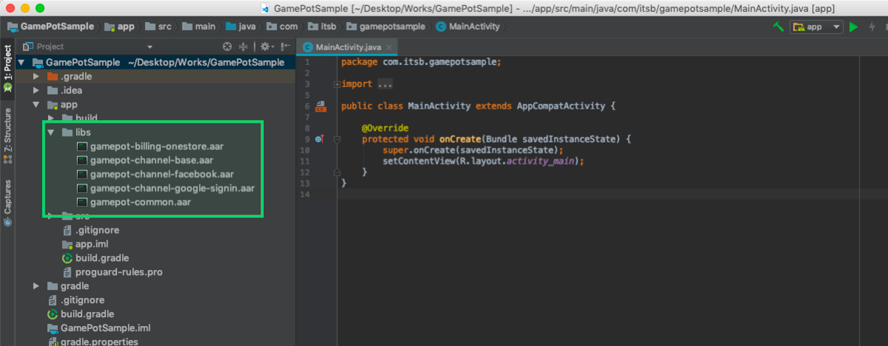
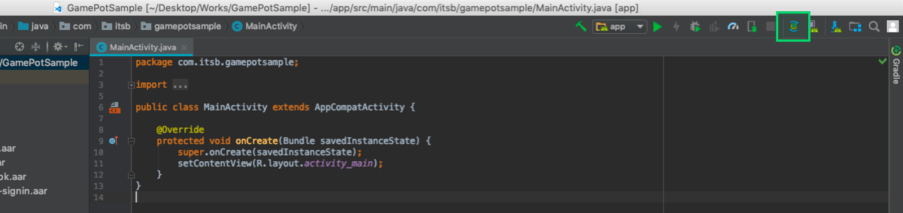
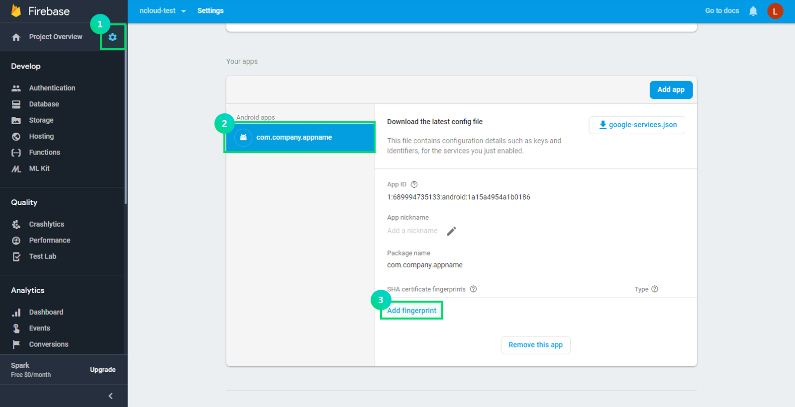
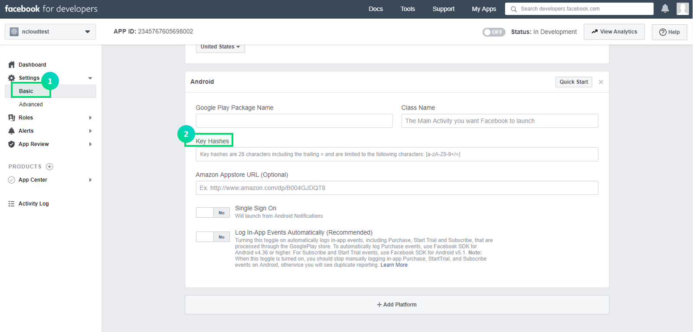
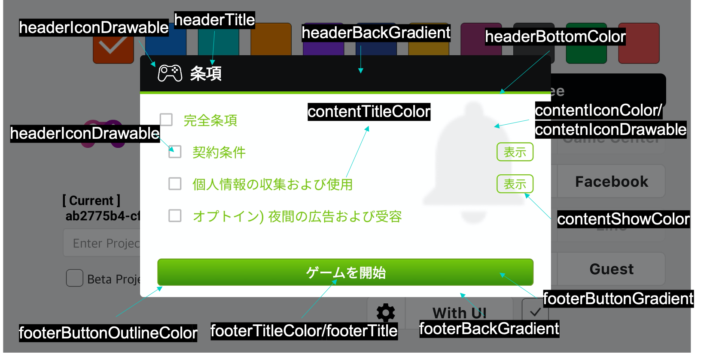

---
search:
  keyword: ['gamepot']
---

#### **NAVER クラウドプラットフォーム商品の使用方法をより詳細に提供し、様々な API の活用をサポートするために<a href="https://guide.ncloud-docs.com/docs/ja/home" target="_blank">[説明書]</a>と<a href="https://api.ncloud-docs.com/docs/ja/home" target="_blank">[API リファレンス]</a>を分けて提供しています。**

<a href="https://api.ncloud-docs.com/docs/ja/game-gamepot" target="_blank">GAMEPOT API リファレンスへ >></a><br />
<a href="https://guide.ncloud-docs.com/docs/ja/game-gamepotconsole" target="_blank">GAMEPOT 説明書へ >></a>

# Android SDK

## 1. 始める

### 開発環境の構成

Android 用アプリを開発するには、開発ツール\(Android Studio など\)をインストールする必要があります。使用する開発ツールによっては、追加で Java SDK と Android SDK などのインストールが必要な場合もあります。

Android で GAMEPOT を利用するために必要なシステム環境は以下のとおりです。

\[システム環境\]

- 最低限のスペック：API 17 \(Jelly Bean、4.2\)以上、gradle 3.3.3 以上
- 開発環境：Android Studio

#### プロジェクト作成


#### ライブラリ追加

ダウンロードした AOS SDK ファイルを app/libs フォルダに追加します。



#### build.gradle 設定

build.gradle ファイルはプロジェクトの root フォルダと app フォルダにそれぞれ存在しています。

1. プロジェクトの root フォルダの build.gradle ファイル修正

   ```java
   buildscript {

       repositories {
           ...
           google()
           jcenter()
           maven { url "https://jitpack.io" }
           maven { url "https://jcenter.bintray.com" }
       }
       dependencies {
          ...
           classpath 'com.google.gms:google-services:4.2.0'
       }
   }

   allprojects {
       repositories {
           ...
           google()
           jcenter()
           maven { url "https://jitpack.io" }
           maven { url "https://jcenter.bintray.com" }
       }
   }
   ```

2. app フォルダの build.gradle ファイル修正

   > \[xxxxx\]には実際に適用する値を入力します。

| 値                           | 説明                                                                                                |
| :--------------------------- | :-------------------------------------------------------------------------------------------------- |
| gamepot_project_id           | GAMEPOT から発行されたプロジェクト ID を入力してください。                                          |
| gamepot_store                | ストア値 \(`google`または`one`または`galaxy`\)                                                      |
| gamepot_payment              | 決済方法値 \(ストアが google である場合のみ該当し、現在は `mycard`に対応\)                          |
| gamepot_app_title            | アプリのタイトル \(FCM\)                                                                            |
| gamepot_push_default_channel | 登録された基本チャンネル名 \(Default\) - 変更しないでください。                                     |
| facebook_app_id              | Facebook で発行されたアプリ ID                                                                      |
| fb_login_protocol_scheme     | Facebook で発行された protocol scheme fb\[app_id\]                                                  |
| gamepot_elsa_projectid       | NCLOUD ELSA 使用時のプロジェクト ID \([詳しく見る](https://www.ncloud.com/product/analytics/elsa)\) |

```java
android {
    defaultConfig {
        ...
        // GamePot [START]
        resValue "string", "gamepot_project_id", "[projectId]" // required
        resValue "string", "gamepot_store", "[storeId]" // required
        resValue "string", "gamepot_payment", "[storeId]" // optional
        resValue "string", "gamepot_app_title","@string/app_name" // required (fcm)
        resValue "string", "gamepot_push_default_channel","Default" // required (fcm)
        resValue "string", "facebook_app_id", "[Facebook ID]" // facebook
        resValue "string", "fb_login_protocol_scheme", "fb[Facebook ID]" // (facebook)
        // resValue "string", "gamepot_elsa_projectid", "" // (ncp elsa)
        // GamePot [END]
    }

    packagingOptions {
        exclude 'META-INF/proguard/androidx-annotations.pro'
    }
}

repositories {
    flatDir {
        dirs 'libs'
    }
}

dependencies {
    compile 'com.android.support:multidex:1.0.1'

    // GamePot common [START]
    compile(name: 'gamepot-common', ext: 'aar')
    compile('io.socket:socket.io-client:1.0.0') {
        exclude group: 'org.json', module: 'json'
    }
    compile('com.github.ihsanbal:LoggingInterceptor:3.0.0') {
        exclude group: 'org.json', module: 'json'
    }
    compile "com.github.nisrulz:easydeviceinfo:2.4.1"
    compile 'com.android.installreferrer:installreferrer:1.0'
    compile 'com.google.code.gson:gson:2.8.2'
    compile 'com.jakewharton.timber:timber:4.7.0'
    compile 'com.squareup.okhttp3:okhttp:3.10.0'
    compile 'com.apollographql.apollo:apollo-runtime:1.0.0-alpha2'
    compile 'com.apollographql.apollo:apollo-android-support:1.0.0-alpha2'
    compile 'com.android.billingclient:billing:1.1'
    compile 'com.github.bumptech.glide:glide:3.7.0'
    compile 'com.romandanylyk:pageindicatorview:1.0.3'
    compile 'com.google.firebase:firebase-core:16.0.6'
    compile 'com.google.firebase:firebase-messaging:17.3.4'
    compile 'androidx.sqlite:sqlite-framework:2.0.1'
    compile 'com.cookpad.puree:puree:4.1.6'
    // GamePot common [END]

    compile(name: 'gamepot-channel-base', ext: 'aar')
    // GamePot facebook [START]
    compile(name: 'gamepot-channel-facebook', ext: 'aar')
    compile 'com.facebook.android:facebook-android-sdk:5.2.0'
    // GamePot facebook [END]

    // GamePot google sigin [START]
    compile(name: 'gamepot-channel-google-signin', ext: 'aar')
    compile "com.google.android.gms:play-services-base:16.0.1"
    compile "com.google.android.gms:play-services-auth:16.0.1"
    // GamePot google sigin [END]
}

// ADD THIS AT THE BOTTOM
apply plugin: 'com.google.gms.google-services'
```

3. Google で発行された google-service.json ファイルを/app/フォルダの下位にコピーします。
4. Gradle Sync Now

   Android Studio で以下のボタンをクリックして更新します。



- 更新を押すと発生する可能性のある失敗

  - Configuration 'compile' is obsolete and has been replaced with 'implementation' and 'api'.It will be removed at the end of 2018. For more information see: [http://d.android.com/r/tools/update-dependency-configurations.html](http://d.android.com/r/tools/update-dependency-configurations.html)

    > Gradle バージョン 3 以上をご使用の場合、compile を implementation

  - No matching client found for package name 'packagename'

    > app のパッケージ名と google-service.json で宣言されたパッケージ名が一致するように変更してください。

#### AndroidManifest.xml の設定

一般的にゲームに用いられる設定値を追加します。各設定別の詳しい説明はコードを参考にしてください。

> 推奨事項であり、開発会社の判断で適用するかどうか検討してください。

```xml
<?xml version="1.0" encoding="utf-8"?>
<manifest xmlns:android="http://schemas.android.com/apk/res/android"
    xmlns:tools="http://schemas.android.com/tools">

    <!--通話機能のないデバイス(タブレット)でもストアからダウンロードできるように設定-->
    <uses-feature android:name="android.hardware.telephony" android:required="false" />
    <!--マイクが付いてないデバイスでも、ボイスチャットに対応するゲームをストアからダウンロードできるように設定-->
    <uses-feature android:name="android.hardware.microphone" android:required="false" />

    <!--allowBackupを必ずfalseにしてください。(ゲームが再インストールされると自動的にshared preference値が復元されるのを防ぐためです。)-->
    <application
        android:name="android.support.multidex.MultiDexApplication"
        android:allowBackup="false"
        tools:replace="android:allowBackup">

        <!--resizeableActivity：アプリを画面分割で見る機能を無効化-->
        <activity
            android:resizeableActivity="false">
            <intent-filter>
                <action android:name="android.intent.action.MAIN" />
                <category android:name="android.intent.category.LAUNCHER" />
            </intent-filter>
        </activity>

        <!--Galaxy S8のようなスクリーンに対応-->
        <meta-data android:name="android.max_aspect" android:value="2.1" />

    </application>
</manifest>
```

#### Push Notification アイコンの設定


プッシュ通知を受け取る際に Notification bar に表示する icon は基本的に SDK 内部の基本画像で処理され、ゲームに合わせて直接追加することもできます。

**icon を直接追加**

> [Android Asset Studio](http://romannurik.github.io/AndroidAssetStudio/icons-notification.html#source.type=clipart&source.clipart=ac_unit&source.space.trim=1&source.space.pad=0&name=ic_stat_gamepot_small)を用いてアイコンを作成すると自動的にフォルダ別に作成されるため、各フォルダに追加するだけで済みます。

1. res/drawable 関連フォルダを以下のように作成
   - res/drawable-mdpi/
   - res/drawable-hdpi/
   - res/drawable-xhdpi/
   - res/drawable-xxhdpi/
   - res/drawable-xxxhdpi/
2. 以下のサイズ別に画像を作成
   - 24x24
   - 36x36
   - 48x48
   - 72x72
   - 96x96
3. 以下のように各フォルダ別にサイズに合った画像を追加

| フォルダ名            | サイズ |
| :-------------------- | :----- |
| res/drawable-mdpi/    | 24x24  |
| res/drawable-hdpi/    | 36x36  |
| res/drawable-xhdpi/   | 48x48  |
| res/drawable-xxhdpi/  | 72x72  |
| res/drawable-xxxhdpi/ | 96x96  |

1. 画像ファイル名を`ic_stat_gamepot_small`に変更

## 2. 初期化

MainActivity.java ファイルに以下のコードを追加します。

```java
import io.gamepot.common.GamePot;
import io.gamepot.common.GamePotLocale;

@Override
protected void onCreate(Bundle savedInstanceState) {
    super.onCreate(savedInstanceState);
    // GAMEPOTの初期化。contextは必ずapplication contextを入れてください。
    // setup APIは他のAPIよりも最初に呼び出してください。
    GamePot.getInstance().setup(getApplicationContext());
}

@Override
protected void onActivityResult(int requestCode, int resultCode, Intent data) {
    super.onActivityResult(requestCode, resultCode, data);
    GamePot.getInstance().onActivityResult(requestCode, resultCode, data);
}

@Override
protected void onStart() {
    super.onStart();
    GamePotChat.getInstance().start();
    GamePot.getInstance().onStart(this);
}

@Override
protected void onStop() {
    super.onStop();
    GamePotChat.getInstance().stop();
}

@Override
protected void onDestroy() {
    super.onDestroy();
    GamePot.getInstance().onDestroy();
}
```

## 3. ログイン、ログアウト、会員退会

Google、Facebook、NAVER など様々なログイン SDK を統合して使用できます。

### Google\(Firebase\)コンソールの設定

APK をビルドする際に使用した Keystore の SHA-1 値を Firebase console に追加します。

> SHA-1 値は開発会社にリクエストします。



### Facebook コンソールの設定

APK をビルドする際に使用した Keystore のキーハッシュ値を Facebook コンソールに追加します。

> キーハッシュ値は開発会社にリクエストします。



### 設定

#### MainActivity.java ファイルの修正

ログイン関連コードを以下のように宣言します。

```java
import io.gamepot.channel.GamePotChannel;
import io.gamepot.channel.GamePotChannelType;
import io.gamepot.channel.facebook.GamePotFacebook;
import io.gamepot.channel.google.signin.GamePotGoogleSignin;

public class MainActivity extends AppCompatActivity {
    @Override
    protected void onCreate(Bundle savedInstanceState) {
        // setup APIは一番最初に呼び出してください。
        GamePot.getInstance().setup(getApplicationContext());

        ...
        // ログインを使用するチャンネル別にaddChannelを呼び出してください。(Guest方式は基本として含まれる)
        // Google Loginの初期化
        GamePotChannel.getInstance().addChannel(this, GamePotChannelType.GOOGLE, new GamePotGoogleSignin());
        // Facebook Loginの初期化
        GamePotChannel.getInstance().addChannel(this, GamePotChannelType.FACEBOOK, new GamePotFacebook());
        ...
    }

    @Override
    protected void onActivityResult(int requestCode, int resultCode, Intent data) {
        super.onActivityResult(requestCode, resultCode, data);
        GamePotChannel.getInstance().onActivityResult(this, requestCode, resultCode, data);
    }

    @Override
    protected void onDestroy() {
        super.onDestroy();
        GamePotChannel.getInstance().onDestroy();
    }
}
```

### ログイン

ログイン UI は開発会社で実装し、ログインボタンをクリックする際に連携されます。

```java
import io.gamepot.channel.GamePotChannel;
import io.gamepot.channel.GamePotChannelListener;
import io.gamepot.channel.GamePotChannelType;
import io.gamepot.channel.GamePotUserInfo;
import io.gamepot.common.GamePotError;

// ログインタイプの定義
// GamePotChannelType.GOOGLE:Google
// GamePotChannelType.FACEBOOK:Facebook
// GamePotChannelType.NAVER:NAVER
// GamePotChannelType.LINE:LINE
// GamePotChannelType.TWITTER:Twitter
// GamePotChannelType.APPLE: Apple
// GamePotChannelType.GUEST:ゲスト

// Googleのログインボタンを押した時の呼び出し
GamePotChannel.getInstance().login(this, GamePotChannelType.GOOGLE, new GamePotChannelListener<GamePotUserInfo>() {
    @Override
    public void onCancel() {
        // ユーザーがログインをキャンセルした状態。
    }

    @Override
    public void onSuccess(GamePotUserInfo userinfo) {
        // ログイン完了。ゲームのロジックに合わせて処理してください。
        // userinfo.getMemberid() : 会員の固有ID
    }

    @Override
    public void onFailure(GamePotError error) {
        // ログイン失敗。error.getMessage()を用いてエラーメッセージを表示してください。
    }
});
```

#### 会員の固有 ID

```java
GamePot.getInstance().getMemberId();
```

### 自動ログイン

ゲームユーザーが最後にログインした情報を伝達する API を利用して自動ログインを実装できます。

```java
import io.gamepot.channel.GamePotChannel;
import io.gamepot.channel.GamePotChannelListener;
import io.gamepot.channel.GamePotChannelType;
import io.gamepot.channel.GamePotUserInfo;
import io.gamepot.common.GamePotError;

// ゲームユーザーが最後にログインした情報を伝達するAPI
final GamePotChannelType lastLoginType = GamePotChannel.getInstance().getLastLoginType();

if(lastLoginType != GamePotChannelType.NONE) {
    // 最後にログインしたログインタイプでログインする方式です。
    GamePotChannel.getInstance().login(this, lastLoginType, new GamePotChannelListener<GamePotUserInfo>() {
        @Override
        public void onCancel() {
            // ユーザーがログインをキャンセルした状態。
        }

        @Override
        public void onSuccess(GamePotUserInfo info) {
            // 自動ログイン完了。ゲームのロジックに合わせて処理してください。
        }

        @Override
        public void onFailure(GamePotError error) {
            // 自動ログイン失敗。error.getMessage()を用いてエラーメッセージを表示してください。
        }
    });
}
else
{
    // 初めてゲームを実行したか、ログアウトした状態。ログインできるログイン画面に移動してください。
}
```

### ログアウト

現在の会員アカウントをログアウトします。

```java
import io.gamepot.channel.GamePotChannel;
import io.gamepot.common.GamePotCommonListener;
import io.gamepot.common.GamePotError;

GamePotChannel.getInstance().logout(this, new GamePotCommonListener() {
    @Override
    public void onSuccess() {
        // ログアウト完了。初期画面に移動してください。
    }

    @Override
    public void onFailure(GamePotError error) {
        // ログアウト失敗。error.getMessage()を用いてエラーメッセージを表示してください。
    }
});
```

### 会員退会

現在の会員アカウントを退会させます。

```java
import io.gamepot.channel.GamePotChannel;
import io.gamepot.common.GamePotCommonListener;
import io.gamepot.common.GamePotError;

GamePotChannel.getInstance().deleteMember(this, new GamePotCommonListener() {
    @Override
    public void onSuccess() {
        // 会員退会成功。初期画面に移動してください。
    }

    @Override
    public void onFailure(GamePotError error) {
        // 会員退会失敗。error.getMessage()を用いてエラーメッセージを表示してください。
    }
});
```

### 検証

ログイン完了後、ログイン情報を開発会社のサーバから GAMEPOT サーバに伝達するとログイン検証が行われます。

詳しい説明は`Server to server api`メニューの`Authentication check`項目を参考にしてください。

## 4. アカウント連携

一つのゲームアカウントに複数のソーシャルアカウント\(Google、Facebook など\)を連携/解除できる機能です。\(最小連携ソーシャルアカウント数は一つです。\)

> 連携画面の UI は開発会社で実装してください。

### アカウント連携

Google、Facebook などの ID でアカウントを連携できます。

```java
import io.gamepot.channel.GamePotChannel;
import io.gamepot.channel.GamePotChannelListener;
import io.gamepot.channel.GamePotChannelType;
import io.gamepot.channel.GamePotUserInfo;
import io.gamepot.common.GamePotError;

// Googleアカウントと連携
// GamePotChannelType.GOOGLE
// Facebookアカウントと連携
// GamePotChannelType.FACEBOOK
// NAVERアカウントと連携
// GamePotChannelType.NAVER
// LINEアカウントと連携
// GamePotChannelType.LINE
// Twitterアカウントと連携
// GamePotChannelType.TWITTER
// Appleアカウントと連携
// GamePotChannelType.APPLE

GamePotChannel.getInstance().createLinking(this, GamePotChannelType.GOOGLE, new GamePotChannelListener<GamePotUserInfo>() {
    @Override
    public void onSuccess(GamePotUserInfo userInfo) {
        // 連携完了。連携結果に関するメッセージを表示してください。(例：アカウントの連携に成功しました。)
    }

    @Override
    public void onCancel() {
        // ユーザーがキャンセルした場合
    }

    @Override
    public void onFailure(GamePotError error) {
        // 連携失敗。error.getMessage()を用いてエラーメッセージを表示してください。
    }
});
```

### 連携されたリスト

当該 API を通じてアカウント連携の有無を確認できます。

```java
import io.gamepot.channel.GamePotChannel;
import java.util.ArrayList;

// タイプの定義
// GamePotChannelType.GOOGLE
// GamePotChannelType.FACEBOOK
// GamePotChannelType.NAVER
// GamePotChannelType.LINE
// GamePotChannelType.TWITTER
// GamePotChannelType.APPLE
// 各タイプの連携状況を返却します。
boolean isLinked = GamePotChannel.getInstance().isLinked(GamePotChannelType.GOOGLE);

// 連携されているすべてのタイプに対してJSON形式で返却します。
// GOOGLEやFACEBOOKと連携されている場合、以下のように返却されます。
// [{“provider”:”google”},{“provider”:”facebook”}]
JSONArray linking = GamePotChannel.getInstance().getLinkedList();
```

### 連携解除

現在連携されているアカウントを解除します。

```java
import io.gamepot.channel.GamePotChannel;
import io.gamepot.channel.GamePotChannelType;
import io.gamepot.common.GamePotCommonListener;
import io.gamepot.common.GamePotError;

GamePotChannel.getInstance().deleteLinking(this, GamePotChannelType.GOOGLE, new GamePotCommonListener() {
    @Override
    public void onSuccess() {
        // 連携解除完了。連携解除の結果に関するメッセージを表示してください。(例：アカウントの連携を解除しました。)
    }

    @Override
    public void onFailure(GamePotError error) {
        // 連携解除失敗。error.getMessage()を用いてエラーメッセージを表示してください。
    }
});
```

## 5. 決済

決済の結果値は Listener 形式で実装されています。

MainActivity.java でアプリを実行する際、一度呼び出すように宣言します。

```java
import io.gamepot.common.GamePot;
import io.gamepot.common.GamePotPurchaseInfo;
import io.gamepot.common.GamePotPurchaseListener;
import io.gamepot.common.GamePotError;

public class MainActivity extends AppCompatActivity {
    @Override
    protected void onCreate(Bundle savedInstanceState) {
        // setup APIは一番最初に呼び出してください。
        GamePot.getInstance().setup(getApplicationContext());

        ...
        GamePot.getInstance().setPurchaseListener(new GamePotPurchaseListener<GamePotPurchaseInfo>() {
            @Override
            public void onSuccess(GamePotPurchaseInfo info) {
                // 決済成功。アイテム支給リクエストは、webhookに設定されたアドレスでserver to serverにリクエストします。
                // ここでは結果に対しての処理だけを行い、実際のアイテム支給はしないでください。
            }

            @Override
            public void onFailure(GamePotError error) {
                // 決済失敗。error.getMessage()を用いてエラーメッセージを表示してください。
            }

            @Override
            public void onCancel() {
                // 決済処理中にユーザーがキャンセルした場合
            }
        });
        ...
    }
}
```

### 決済する

一つの決済 API で GooglePlay と OneStore のどちらでも決済できます。

> 決済する ~ 決済完了/失敗までの間ゲーム内で使用するロード画面を表示し、呼び出しが重複しないようにしてください。

```java
CASE 1：一般的な決済の場合

import io.gamepot.common.GamePot;

// productId：ストアに登録されている商品IDを入力してください。
GamePot.getInstance().purchase("product id");
```

```java
CASE 2：決済の際に作成される領収証番号を別途管理したい場合：

import io.gamepot.common.GamePot;

// productId：ストアに登録されている商品IDを入力してください。
// uniqueId：別途管理する領収証番号を入力します。
GamePot.getInstance().purchase("product id", "uniqueId");
```

```java
CASE 3：決済時に作成される領収証番号、サーバID、キャラクターID、その他の情報をwebhookに伝達したい時：

import io.gamepot.common.GamePot;

// productId：ストアに登録されている商品IDを入力してください。
// uniqueId：別途管理する領収証番号を入力します。
// serverId：決済を行ったキャラクターのサーバIDを入力します。
// playerId ：決済を行ったキャラクターのキャラクターIDを入力します。
// etc      ：決済を行ったキャラクターのその他の情報を入力します。
GamePot.getInstance().purchase("product id","uniqueId","serverId","playerId","etc");
```

### 決済アイテムリスト取得

ストアから伝達される In-App アイテムリストを取得できます。

```java
import io.gamepot.common.GamePot;

GamePotPurchaseDetailList details = GamePot.getInstance().getPurchaseDetailList();
```

### 決済アイテム支給

GAMEPOT は、Server to server api を通じて決済ストアの領収証検証まですべて完了してから開発会社のサーバに支給リクエストをするため、不正決済はできません。

そのためには`Server to server api`メニューの`Purchase`項目を参考にして処理してください。

## 6. 外部決済

ONE store の場合、基本ストアの決済モジュールではない第 3 の決済モジュールを許可しています。

### 設定

ダッシュボードの｢外部決済｣項目を参考にして、まずダッシュボードの設定を行ってください。

`5.決済`項目を先に実装した場合、追加で設定する部分はありません。

### 決済する

```java
import io.gamepot.common.GamePot;

// activity：現在のアクティビティ
// product id：ダッシュボードに登録した決済ID
GamePot.getInstance().purchaseThirdPayments(activity, product id);
```

### 決済アイテムリスト取得

```java
import io.gamepot.common.GamePot;

GamePotPurchaseDetailList thirdPaymentsDetailList = GamePot.getInstance().getPurchaseThirdPaymentsDetailList();
```

## 7. その他の API

### SDK サポートログイン UI

SDK 内で、独自に(完成した形の) Login UI を提供します。

```java
import io.gamepot.channel.GamePotChannel;
import io.gamepot.channel.GamePotChannelListener;
import io.gamepot.channel.GamePotAppStatusChannelListener;
import io.gamepot.channel.GamePotChannelType;
import io.gamepot.channel.GamePotChannelLoginBuilder;
import io.gamepot.channel.GamePotUserInfo;
import io.gamepot.common.GamePotError;

String[] channelList = {"google", "facebook", "naver", "line", "twitter", "apple", "guest"};
GamePotChannelLoginBuilder builder = new GamePotChannelLoginBuilder(channelList);

// Googleのログインボタンを押した時の呼び出し
GamePotChannel.getInstance().showLoginWithUI(this, builder, new GamePotAppStatusChannelListener<GamePotUserInfo>() {
    @Override
    public void onCancel() {
        // ユーザーがログインをキャンセルした状態。
    }

    @Override
    public void onSuccess(GamePotUserInfo userinfo) {
        // ログイン完了。 ゲームのロジックに合わせて処理してください。
        // userinfo.getMemberid()：会員の固有ID
    }

    @Override
    public void onFailure(GamePotError error) {
        // ログイン失敗。error.getMessage()を利用してエラーメッセージを表示してください。
    }
});
```

#### ログイン UI の画像ロゴの設定

ログイン UI 上段に表示される画像ロゴは、SDK の内部で基本画像が表示され、直接追加することもできます。

**画像ロゴを直接入れる**

> [Android Asset Studio](http://romannurik.github.io/AndroidAssetStudio/icons-notification.html#source.type=clipart&source.clipart=ac_unit&source.space.trim=1&source.space.pad=0&name=ic_stat_gamepot_login_logo)を使用してアイコンを作成すると自動的にフォルダ別に作成されるため、各フォルダに追加するだけで済みます。

1. res/drawable 関連フォルダを以下のように作成

   - res/drawable-mdpi/
   - res/drawable-hdpi/
   - res/drawable-xhdpi/
   - res/drawable-xxhdpi/
   - res/drawable-xxxhdpi/

2. 以下のサイズ別に画像を作成

   - 78x55
   - 116x82
   - 155x110
   - 232x165
   - 310x220

3. 以下のように各フォルダ別にサイズに合った画像を追加

| フォルダ名            | サイズ  |
| :-------------------- | :------ |
| res/drawable-mdpi/    | 78x55   |
| res/drawable-hdpi/    | 116x82  |
| res/drawable-xhdpi/   | 155x110 |
| res/drawable-xxhdpi/  | 232x165 |
| res/drawable-xxxhdpi/ | 310x220 |

- 画像ファイル名を`ic_stat_gamepot_login_logo.png`に変更

### NAVER ログイン

#### build.gradle 設定

```java
android {
    defaultConfig {
        ...
        resValue "string", "gamepot_naver_clientid", "xxxxxxxx" // NAVER開発者コンソールで取得
        resValue "string", "gamepot_naver_secretid", "xxx" // NAVER開発者コンソールで取得
    }
}

dependencies {
  ...
  compile(name: 'gamepot-channel-naver', ext: 'aar')
  ...
}
```

#### MainActivity.java の設定

```java
import io.gamepot.channel.GamePotChannel;
import io.gamepot.channel.GamePotChannelType;
import io.gamepot.channel.naver.GamePotNaver;

@Override
protected void onCreate(Bundle savedInstanceState) {
    super.onCreate(savedInstanceState);
        ...
        GamePotChannel.getInstance().addChannel(this, GamePotChannelType.NAVER, new GamePotNaver());
}
```

#### ログイン

```java
GamePotChannel.getInstance().login(this, GamePotChannelType.NAVER, new GamePotAppStatusChannelListener<GamePotUserInfo>() {
  ...
});
```

### LINE ログイン

#### build.gradle 設定

```java
android {
    defaultConfig {
        ...
        resValue "string", "gamepot_line_channelid","00000000" // LINE開発者コンソールで取得
    }
}

dependencies {
  ...
  compile(name: 'gamepot-channel-line', ext: 'aar')
  compile(name: 'line-sdk-4.0.10', ext: 'aar')
  ...
}
```

#### MainActivity.java の設定

```java
import io.gamepot.channel.GamePotChannel;
import io.gamepot.channel.GamePotChannelType;
import io.gamepot.channel.line.GamePotLine;

@Override
protected void onCreate(Bundle savedInstanceState) {
    super.onCreate(savedInstanceState);
        ...
        GamePotChannel.getInstance().addChannel(this, GamePotChannelType.LINE, new GamePotLine());
}
```

#### ログイン

```java
GamePotChannel.getInstance().login(this, GamePotChannelType.LINE, new GamePotAppStatusChannelListener<GamePotUserInfo>() {
  ...
});
```

### Twitter ログイン

#### build.gradle 設定

```java
android {
    compileOptions {
        sourceCompatibility JavaVersion.VERSION_1_8
        targetCompatibility JavaVersion.VERSION_1_8
    }

    defaultConfig {
        ...
        resValue "string", "gamepot_twitter_consumerkey","xxxxx" // Twitter開発者コンソールで取得
        resValue "string", "gamepot_twitter_consumersecret","xxx" // Twitter開発者コンソールで取得
    }
}

dependencies {
  ...
  compile(name: 'gamepot-channel-twitter', ext: 'aar')
  compile('com.twitter.sdk.android:twitter-core:3.3.0@aar') {
      transitive = true
  }
  ...
}
```

#### MainActivity.java の設定

```java
import io.gamepot.channel.GamePotChannel;
import io.gamepot.channel.GamePotChannelType;
import io.gamepot.channel.twitter.GamePotTwitter;

@Override
protected void onCreate(Bundle savedInstanceState) {
    super.onCreate(savedInstanceState);
        ...
        GamePotChannel.getInstance().addChannel(this, GamePotChannelType.TWITTER, new GamePotTwitter());
}
```

#### ログイン

```java
GamePotChannel.getInstance().login(this, GamePotChannelType.TWITTER, new GamePotAppStatusChannelListener<GamePotUserInfo>() {
  ...
});
```

### Apple ログイン(Web Login)

#### build.gradle 設定

```java
dependencies {
  ...
  compile(name: 'gamepot-channel-apple-signin', ext: 'aar')
  ...
}
```

#### MainActivity.java 設定

```java
import io.gamepot.channel.GamePotChannel;
import io.gamepot.channel.GamePotChannelType;
import io.gamepot.channel.apple.signin.GamePotAppleSignin;

@Override
protected void onCreate(Bundle savedInstanceState) {
    super.onCreate(savedInstanceState);
        ...
        GamePotChannel.getInstance().addChannel(this, GamePotChannelType.APPLE, new GamePotAppleSignin());
}
```

#### ログイン

```java
GamePotChannel.getInstance().login(this, GamePotChannelType.APPLE, new GamePotAppStatusChannelListener<GamePotUserInfo>() {
  ...
});
```

### クーポン

ユーザーが入力したクーポンを使用する際は、以下のコードを呼び出してください。

> クーポンの入力画面の UI は開発会社で実装してください。

```java
import io.gamepot.common.GamePot;
import io.gamepot.common.GamePotError;
import io.gamepot.common.GamePotListener;

GamePot.getInstance().coupon(/*ユーザーが入力したクーポン*/, new GamePotListener<String>() {
    @Override
    public void onSuccess(String message) {
        // クーポン使用成功。message値をポップアップで表示してください。
    }

    @Override
    public void onFailure(GamePotError error) {
        // クーポン使用失敗。error.getMessage()を用いてエラーメッセージを表示してください。
    }
});
```

#### アイテム支給

クーポンの使用に成功すると、開発会社のサーバに Server to server api を通じてアイテム支給をリクエストします。

そのためには`Server to server api`メニューの`Item`項目を参考にして処理してください。

### Push on/off

全体プッシュ、夜間プッシュ、プッシュ型広告の 3 種類のプッシュ通知をそれぞれ on/off に設定できます。

> on/off を設定する UI は開発会社で実装してください。

```java
import io.gamepot.common.GamePot;
import io.gamepot.common.GamePotError;
import io.gamepot.common.GamePotCommonListener;

// プッシュ通知On/Off
GamePot.getInstance().setPushEnable(/*true or false*/, new GamePotCommonListener() {
    @Override
    public void onSuccess() {
    }

    @Override
    public void onFailure(GamePotError error) {
    }
});

// 夜間プッシュ通知On/Off
GamePot.getInstance().setNightPushEnable(/*true or false*/, new GamePotCommonListener() {
    @Override
    public void onSuccess() {
    }

    @Override
    public void onFailure(GamePotError error) {
    }
});

// プッシュ、夜間プッシュ通知を一度に設定
// ログイン前にプッシュ、夜間プッシュ通知のOn/Offを設定するゲームの場合、ログイン後に以下のコードを必ず呼び出します。
GamePot.getInstance().setPushEnable(/*true or false*/, /*true or false*/, true, new GamePotCommonListener() {
    @Override
    public void onSuccess() {
    }

    @Override
    public void onFailure(GamePotError error) {
    }
});
```

現在のプッシュ通知の状態をインポートするには、以下のコードを参考にしてください。

```java
import io.gamepot.common.GamePot;
import org.json.JSONObject;

// enable：全体プッシュ通知
// night：夜間プッシュ通知
// {"enable":true, "night":true}
JSONObject status = GamePot.getInstance().getPushStatus();
```

### 案内事項

ダッシュボード - 案内事項でアップロードした画像が表示される機能です。

#### 呼び出し

```java
/* showTodayButton： ｢今日は表示しない｣ボタンの表示有無。falseの場合、必ず表示*/
boolean showTodayButton = true;

GamePot.getInstance().showNotice(/*現在のアクティビティ*/, showTodayButton, new GamePotNoticeDialog.onSchemeListener() {
    @Override
    public void onReceive(String scheme) {
        // TODO : scheme処理
    }
});
```

### 案内事項(分類別呼び出し)

ダッシュボード - 案内事項でアップロードした画像のうち、分類で設定した画像のみ表示する機能です。

#### 呼び出し

```java
/* ダッシュボードの案内事項 >> 分類で設定した分類名 */
string type = "";

GamePot.getInstance().showEvent(/*現在のアクティビティ*/, type, new GamePotNoticeDialog.onSchemeListener() {
    @Override
    public void onReceive(String scheme) {
        // TODO：scheme処理
    }
});
```

### サポートセンター

ダッシュボード - サポートセンター - 問い合わせに連携されるユーザーと運営者間のコミュニケーションチャンネルです。

問い合わせの UI はデバイスの言語に応じて変更されます。韓国語、英語、日本語、中国語(簡体字、繁体字)に対応し、その他の言語は英語で表示されます。

#### 呼び出し

```java
GamePot.getInstance().showCSWebView(/*現在のアクティビティ*/);
```

外部リンクをサポートし、ログインしていない顧客も問い合わせを登録できます。

#### 呼び出し

```java
String url = "GAMEPOTから発行された外部サポートセンターURL";

GamePot.getInstance().showWebView(/*現在のアクティビティ*/, url, true);
```

### FAQ

ダッシュボード - サポートセンター - FAQ に連携される FAQ リストです。

#### 呼び出し

```java
GamePot.getInstance().showFaq(/*現在のアクティビティ*/);
```

### ローカルプッシュ\(Local Push notification\)

プッシュサーバを介さずに端末の内部で行われるプッシュ表示機能です。

#### 呼び出し

**プッシュ登録**

決められた時間にローカルプッシュを表示する方法は以下のとおりです。

> 戻り値として返ってくる pushid は開発会社で管理します。

```java
String date = "2018-09-27 20:00:00";
GamePotLocalPushBuilder builder = new GamePotLocalPushBuilder(getActivity())
                        .setTitle("ローカルプッシュテスト")
                        .setMessage("ローカルプッシュメッセージです。" + date)
                        .setDateString(date).build();
int pushid = GamePot.getInstance().sendLocalPush(builder);
```

**登録したプッシュのキャンセル**

プッシュ登録の際に取得した pushid をもとに、これまでに登録したプッシュをキャンセルできます。

```java
GamePot.getInstance().cancelLocalPush(/*現在のアクティビティ*/, /*プッシュ登録の際に取得したpushid*/);
```

### メンテナンス、強制アップデート

メンテナンスや強制アップデート機能が必要な場合、ダッシュボード - 運営で機能を有効にすると動作します。

#### 呼び出し

これまでに適用された以下の API で使用できます。

**1. login API**

既存の login API で listener を`GamePotAppStatusChannelListener`に変更します。

```java
GamePotChannel.getInstance().login(this, GamePotChannelType.GOOGLE, new GamePotAppStatusChannelListener<GamePotUserInfo>() {
    @Override
    public void onNeedUpdate(GamePotAppStatus status) {
        // TODO: 強制アップデートが必要な場合。以下のAPIを呼び出すと、SDK自体でポップアップを表示できます。
        // TODO: カスタマイズしたい場合は、以下のAPIを呼び出さずにカスタマイズしてください。
        GamePot.getInstance().showAppStatusPopup(MainActivity.this, status, new GamePotAppCloseListener() {
            @Override
            public void onClose() {
                // TODO: showAppStatusPopup APIを呼び出した場合、アプリを終了しなければならない状況で呼び出されます。
                // TODO: 終了プロセスを処理してください。
                MainActivity.this.finish();
            }

            @Override
            public void onNext(Object obj) {
                // TODO : Dashboardアップデートの設定で推奨を選択すると、｢後でする｣ボタンが表示されます。
                // このボタンをユーザーが選択すると呼び出されます。
                // TODO : obj情報を用いてログイン完了時と同様に処理してください。
                // GamePotUserInfo userInfo = (GamePotUserInfo)obj;
            }
        });
    }

    @Override
    public void onMainternance(GamePotAppStatus status) {
        // TODO: メンテナンス中の場合。以下のAPIを呼び出すと、SDK自体でポップアップを表示できます。
        // TODO: カスタマイズしたい場合は、以下のAPIを呼び出さずにカスタマイズしてください。
        GamePot.getInstance().showAppStatusPopup(MainActivity.this, status, new GamePotAppCloseListener() {
            @Override
            public void onClose() {
                // TODO: showAppStatusPopup APIを呼び出した場合、アプリを終了しなければならない状況で呼び出されます。
                // TODO: 終了プロセスを処理してください。
                MainActivity.this.finish();
            }
        });
    }

    @Override
    public void onCancel() {
        // ユーザーがログインをキャンセルした状態。
    }

    @Override
    public void onSuccess(GamePotUserInfo userinfo) {
        // ログイン完了。ゲームのロジックに合わせて処理してください。
    }

    @Override
    public void onFailure(GamePotError error) {
        // ログイン失敗。error.getMessage()を用いてエラーメッセージを表示してください。
    }
});
```

### 規約同意

｢利用規約｣と｢個人情報の取扱方針｣の同意をスムーズに行えるように UI を提供します。

`BLUE`テーマと`GREEN`テーマの 2 種類の`基本テーマ`の他にも、新たに追加された 11 種類の`改善テーマ`を提供します。

#### 規約同意を呼び出す

```java
// 基本テーマ
GamePotAgreeBuilder.THEME.BLUE
GamePotAgreeBuilder.THEME.GREEN

//改善テーマ
GamePotAgreeBuilder.THEME.MATERIAL_RED,
GamePotAgreeBuilder.THEME.MATERIAL_BLUE,
GamePotAgreeBuilder.THEME.MATERIAL_CYAN,
GamePotAgreeBuilder.THEME.MATERIAL_ORANGE,
GamePotAgreeBuilder.THEME.MATERIAL_PURPLE,
GamePotAgreeBuilder.THEME.MATERIAL_DARKBLUE,
GamePotAgreeBuilder.THEME.MATERIAL_YELLOW,
GamePotAgreeBuilder.THEME.MATERIAL_GRAPE,
GamePotAgreeBuilder.THEME.MATERIAL_GRAY,
GamePotAgreeBuilder.THEME.MATERIAL_GREEN,
GamePotAgreeBuilder.THEME.MATERIAL_PEACH,
```

> 規約同意のポップアップ表示の有無は、開発会社でゲームに合わせて処理してください。
>
> ｢見る｣ボタンをクリックすると表示される内容は、ダッシュボードで適用及び修正できます。

Request:

```java
// 基本呼び出し(BLUEテーマを適用)
GamePot.getInstance().showAgreeDialog(/*activity*/, new GamePotAgreeBuilder(), new GamePotListener<GamePotAgreeInfo>() {
    @Override
    public void onSuccess(GamePotAgreeInfo data) {
        // data.agree：規約の必須事項にすべて同意した場合、true
        // data.agreeNight：夜間プッシュ型広告の通知を許可した場合はtrue、そうでない場合はfalse
        // agreeNight値はログイン完了後、setPushNightStatus apiを通じて伝達してください。
    }

    @Override
    public void onFailure(GamePotError error) {
        // error.messageをポップアップなどでユーザーに知らせてください。
    }
});

// MATERIAL_ORANGE テーマ適用時
GamePotAgreeBuilder bulider = new GamePotAgreeBuilder(GamePotAgreeBuilder.THEME.MATERIAL_ORANGE);
GamePot.getInstance().showAgreeDialog(/*activity*/, bulider, new GamePotListener<GamePotAgreeInfo>() {
  ....
}
```

#### Customizing

テーマを使わずにゲームに合わせてカラーを変更します。

規約同意を呼び出す前に、`GamePotAgreeBuilder`で各領域別にカラーを指定できます。

```java
GamePotAgreeBuilder agreeBuilder= new GamePotAgreeBuilder();
agreeBuilder.setHeaderBackGradient(new int[] {0xFF00050B,0xFF0F1B21});
agreeBuilder.setHeaderTitleColor(0xFFFF0000);
agreeBuilder.setHeaderBottomColor(0xFF00FF00);
// 未使用時は""に設定
agreeBuilder.setHeaderTitle("規約同意");
// res/drawableオブジェクトID
agreeBuilder.setHeaderIconDrawable(R.drawable.ic_stat_gamepot_agree);

agreeBuilder.setContentBackGradient(new int[] { 0xFFFF2432, 0xFF11FF32 });
agreeBuilder.setContentTitleColor(0xFF0429FF);
agreeBuilder.setContentCheckColor(0xFFFFADB5);
agreeBuilder.setContentIconColor(0xFF98FFC6);
agreeBuilder.setContentShowColor(0xFF98B3FF);
// res/drawableオブジェクトID
agreeBuilder.setContentIconDrawable(R.drawable.ic_stat_gamepot_small);

agreeBuilder.setFooterBackGradient(new int[] { 0xFFFFFFFF, 0xFF112432 });
agreeBuilder.setFooterButtonGradient(new int[] { 0xFF1E3A57, 0xFFFFFFFF });
agreeBuilder.setFooterButtonOutlineColor(0xFFFF171A);
agreeBuilder.setFooterTitleColor(0xFFFF00D5);
agreeBuilder.setFooterTitle("ゲームを始める");

//일반 광고성 수신동의 버튼 노출 여부
agreeBuilder.setShowPush(true);

// 夜間プッシュ型広告通知許可ボタンの表示の有無
agreeBuilder.setShowNightPush(true);

// 일반 광고성 수신동의 링크 버튼 설정(미사용 시, 입력 안함)
agreeBuilder.setPushDetailURL("https://...");

// 야간 광고성 수신동의 링크 버튼 설정 (미사용 시, 입력 안함)
agreeBuilder.setNightPushDetailURL("https://...");

// メッセージ変更
agreeBuilder.setAllMessage("すべて同意");
agreeBuilder.setTermMessage("必須) 利用規約");
agreeBuilder.setPrivacyMessage("必須) 個人情報の取扱方針");
agreeBuilder.setPushMessage("선택) 일반 푸시 수신 동의");
agreeBuilder.setNightPushMessage("任意) 夜間プッシュ通知を許可");

GamePot.getInstance().showAgreeDialog(/*activity*/, agreeBuilder, new GamePotListener<GamePotAgreeInfo>() {
  ....
}
```

それぞれの変数は以下の領域に適用されます。

> contentIconDrawable の基本画像はプッシュアイコンとして設定されます。



### 利用規約

利用規約 UI を呼び出します。

> ダッシュボード - サポートセンター - 利用規約の設定項目にまず内容を入力してください。

```java
import io.gamepot.common.GamePot;

// activity：現在のアクティビティ
GamePot.getInstance().showTerms(activity);
```

### 個人情報の取扱方針

個人情報の取扱方針 UI を呼び出します。

> ダッシュボード - サポートセンター - 個人情報の取扱方針の設定項目にまず内容を入力してください。

```java
import io.gamepot.common.GamePot;

// activity：現在のアクティビティ
GamePot.getInstance().showPrivacy(activity);
```

### 払い戻し規約

払い戻し規約 UI を呼び出します。

> ダッシュボード - サポートセンター - 払い戻し規約の設定項目にまず内容を入力してください。

```java
import io.gamepot.common.GamePot;

// activity：現在のアクティビティ
GamePot.getInstance().showRefund(activity);
```

### Remote Config

ダッシュボードで登録したパラメータ値をゲームクライアントから取得します。

> ダッシュボード - 設定 - Remote Config 画面でまずパラメータを追加してください。

追加したパラメータはログイン時にロードされ、その後から呼び出すことができます。

```java
import io.gamepot.common.GamePot;

//key：パラメータstring
String str_value = GamePot.getInstance().getConfig(key);

//ダッシュボードに追加したすべてのパラメータをjson string形式で取得します。
String json_value = GamePot.getInstance().getConfigs();
```

### ゲームログ伝送

ゲームで使用される情報を入れて呼び出すと、`ダッシュボード` - `ゲーム`で照会できます。

以下は使用できる予約語の定義表です。

| 予約語                            | 必須 | タイプ | 説明            | 最大長 |
| :-------------------------------- | :--- | :----- | :-------------- | ------ |
| GamePotSendLogCharacter.NAME      | 必須 | String | キャラクター名  | 128    |
| GamePotSendLogCharacter.LEVEL     | 任意 | String | レベル          | 128    |
| GamePotSendLogCharacter.SERVER_ID | 任意 | String | サーバ ID       | 128    |
| GamePotSendLogCharacter.PLAYER_ID | 任意 | String | キャラクター ID | 128    |
| GamePotSendLogCharacter.USERDATA  | 任意 | String | ETC             | 128    |

```java
import android.text.TextUtils;

import io.gamepot.common.GamePotSendLogCharacter;
import io.gamepot.common.GamePotSendLog;

String name = "キャラクター名";
String level = "10";
String serverid = "svn_001";
String playerid = "283282191001";
String userdata = "";

GamePotSendLogCharacter obj = new GamePotSendLogCharacter();
if(!TextUtils.isEmpty(name))
    obj.put(GamePotSendLogCharacter.NAME, name);
if(!TextUtils.isEmpty(level))
    obj.put(GamePotSendLogCharacter.LEVEL, level);
if(!TextUtils.isEmpty(serverid))
    obj.put(GamePotSendLogCharacter.SERVER_ID, serverid);
if(!TextUtils.isEmpty(playerid))
    obj.put(GamePotSendLogCharacter.PLAYER_ID, playerid);
if(!TextUtils.isEmpty(playerid))
    obj.put(GamePotSendLogCharacter.USERDATA, userdata);

// result：ログ伝送に成功するとtrue、そうでないとfalse
boolean result = GamePotSendLog.characterInfo(obj);
```

### GDPR 規約チェックリスト

ダッシュボードで有効化した、GDPR 規約項目をリストの形で取得します。

```java
import io.gamepot.common.GamePot;

(List<String>) GamePot.getInstance().getGDPRCheckedList();

//リターンされるパラメータは、それぞれダッシュボードの次の設定に該当します。
gdpr_privacy：個人情報の取扱方針
gdpr_term：利用規約
gdpr_gdpr：GDPRの利用規約
gdpr_push_normal：イベントPush受信に同意
gdpr_push_night：夜間イベントPush受信に同意(韓国のみ対象)
gdpr_adapp_custom：パーソナライズド広告を見るに同意 (GDPR適用国)
gdpr_adapp_nocustom：非パーソナライズド広告を見るに同意 (GDPR適用国)
```

# 付録

### 3rd party SDK 連携サポート

TODO : 説明

## ログイン

TODO : 説明

> 自動ログインに対応しない。毎回呼び出しが必要。

| パラメータ名 | 必須 | タイプ                                                   | 説明                 |
| :----------- | :--- | :------------------------------------------------------- | :------------------- |
| activity     | 必須 | String                                                   | 現在のアクティビティ |
| userid       | 必須 | String                                                   | ユーザーの固有 ID    |
| listener     | 必須 | GamePotChannelListener / GamePotAppStatusChannelListener | リクエストの結果     |

```java
String memberId = "memberid of 3rd party sdk";

GamePotChannel.getInstance().loginByThirdPartySDK(getActivity(), memberId, new GamePotAppStatusChannelListener<GamePotUserInfo>() {
    @Override
    public void onNeedUpdate(GamePotAppStatus status) {
        // TODO: 強制アップデートが必要な場合。以下のAPIを呼び出すと、SDK自体でポップアップを表示できます。
        // TODO: カスタマイズしたい場合は、以下のAPIを呼び出さずにカスタマイズしてください。
        GamePot.getInstance().showAppStatusPopup(MainActivity.this, status, new GamePotAppCloseListener() {
            @Override
            public void onClose() {
                // TODO: showAppStatusPopup APIを呼び出した場合、アプリを終了しなければならない状況で呼び出されます。
                // TODO: 終了プロセスを処理してください。
                MainActivity.this.finish();
            }

            @Override
            public void onNext(Object obj) {
                // TODO : Dashboardアップデートの設定で推奨を選択すると、｢後でする｣ボタンが表示されます。
                // このボタンをユーザーが選択すると呼び出されます。
                // TODO : obj情報を用いてログイン完了時と同様に処理してください。
                // GamePotUserInfo userInfo = (GamePotUserInfo)obj;
            }
        });
    }

    @Override
    public void onMainternance(GamePotAppStatus status) {
        // TODO: メンテナンス中の場合。以下のAPIを呼び出すと、SDK自体でポップアップを表示できます。
        // TODO: カスタマイズしたい場合は、以下のAPIを呼び出さずにカスタマイズしてください。
        GamePot.getInstance().showAppStatusPopup(MainActivity.this, status, new GamePotAppCloseListener() {
            @Override
            public void onClose() {
                // TODO: showAppStatusPopup APIを呼び出した場合、アプリを終了しなければならない状況で呼び出されます。
                // TODO: 終了プロセスを処理してください。
                MainActivity.this.finish();
            }
        });
    }

    @Override
    public void onCancel() {
        // ユーザーがログインをキャンセルした状態。
    }

    @Override
    public void onSuccess(GamePotUserInfo userinfo) {
        // ログイン完了。ゲームのロジックに合わせて処理してください。
    }

    @Override
    public void onFailure(GamePotError error) {
        // ログイン失敗。error.getMessage()を用いてエラーメッセージを表示してください。
    }
});
```

## 決済

TODO : 説明

> 決済アイテムが GAMEPOT のダッシュボードに登録されている必要があります。

| パラメータ名  | 必須 | タイプ          | 説明                                            |
| :------------ | :--- | :-------------- | :---------------------------------------------- |
| productid     | 必須 | String          | GAMEPOT のダッシュボードに登録されたアイテム ID |
| transactionid | 必須 | String          | 決済領収証番号(GPA-xxx-xxxx-xxxx)               |
| currency      | 任意 | String          | 通貨(KRW、USD)                                  |
| price         | 任意 | double          | 決済アイテム金額                                |
| paymentid     | 任意 | String          | 決済ストア(google、apple、one、galaxy)          |
| uniqueid      | 任意 | String          | 開発会社で使用する固有 ID                       |
| listener      | 任意 | GamePotListener | リクエストの結果                                |

```java
String productId = "purchase_001";
String transactionId = "GPA-xxx-xxxx-xxxx";
String currency = "KRW";
double price = 1200;
String paymentId = "google";
String uniqueId = "developer unique id";

GamePot.getInstance().sendPurchaseByThirdPartySDK(productId, transactionId, currency, price, paymentId, uniqueId, null);
```