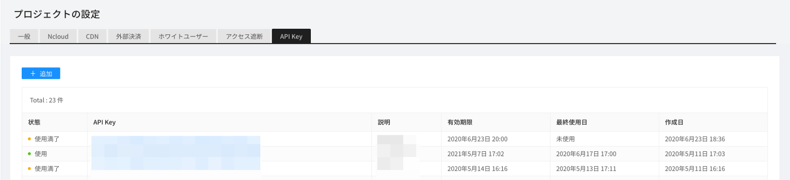
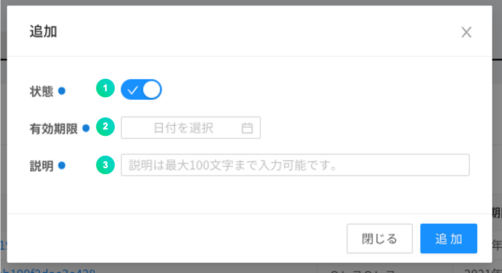
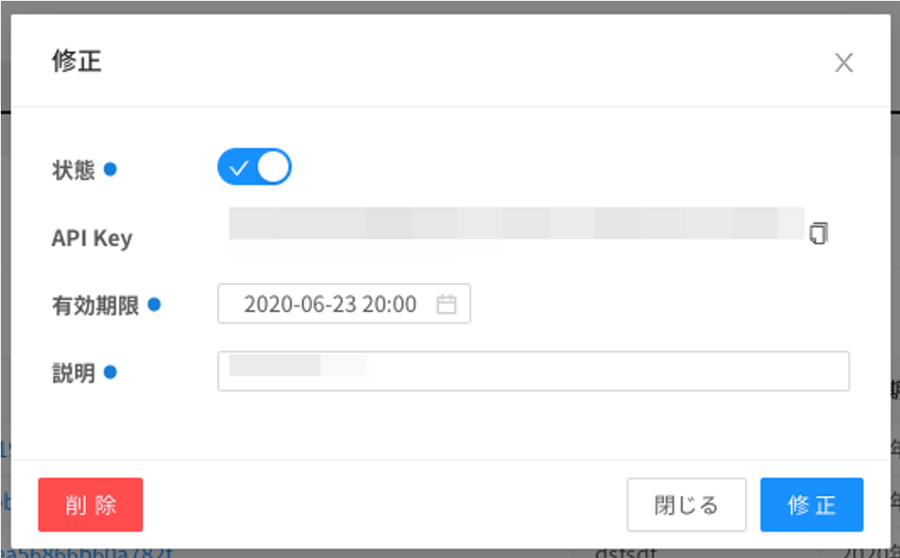

---
search:
  keyword:
    - gamepot
---

#### **NAVER クラウドプラットフォーム商品の使用方法をより詳細に提供し、様々な API の活用をサポートするために<a href="https://guide.ncloud-docs.com/docs/ja/home" target="_blank">[説明書]</a>と<a href="https://api.ncloud-docs.com/docs/ja/home" target="_blank">[API リファレンス]</a>を分けて提供しています。**

<a href="https://api.ncloud-docs.com/docs/ja/game-gamepot" target="_blank">GAMEPOT API リファレンスへ >></a><br />
<a href="https://guide.ncloud-docs.com/docs/ja/game-gamepot-overview" target="_blank">GAMEPOT 説明書へ >></a>

# Open API

> ###これは機械翻訳されたドキュメントで、語彙、構文、または文法に誤りがある可能性があります。 プロの翻訳者が翻訳したドキュメントをすぐに提供します。
>
> ####ご不明な点がございましたら、[お問い合わせ](https://www.ncloud.com/support/question)でお問い合わせください。
>
> 私たちは、サービスのさらなる向上に全力を尽くします。

ゲームポットで提供されるいくつかの機能を規定された API で呼び出すことができる機能です。

> ダッシュボードから発行された許可された API Key を使用する必要が呼び出しが可能であり、使用するかどうか、および有効期限を指定することができます。

## API Key を発行

Open API を呼び出すためには、まず、ダッシュボードから API Key を作成する必要があります。

API Key は<b>ダッシュボード>プロジェクト設定> API Key</ b>で作成することができます。



① API キーを生成するために、追加ボタンをクリックします。



① 当該 API Key の活性化するかどうかを選択します。

② API Key の有効期限を設定します。

③ ユーザーが認識可能な説明を入力します。

④ 追加ボタンで API Key を登録します。



生成された API KEY をクリックしてステータスを変更したり削除したりすることができます。

> 生成された Key の値は Open API の使用時に、header の x-api-key の値に入ります。

## Open API を使用する

### Error code

Open API リクエスト時に発生する共通のエラーコードです。

| Code | Description                                          |
| :--- | :--------------------------------------------------- |
| -1   | ダッシュボードにないキーを使用した場合               |
| -2   | ダッシュボードのキーとヘッダのキーが異なる場合       |
| -3   | ダッシュボードから削除されたキーを使用した場合       |
| -4   | ダッシュボードで未使用で処理されたキーを使用した場合 |
| -5   | キーの期限が切れた場合                               |
| -6   | プロジェクト名がない場合は                           |

### ユーザー検索 API

ユーザー UID でユーザーを照会します。

#### Request

- Method : GET
- URI : /user/{userID}

```text
GET
url : https://dashboard-api.gamepot.ntruss.com/v1/api/project/{projectId}/user/{userId}
Header : 'accept-language: ko'
Header : 'x-api-key: {GamePotダッシュボードから発行されたAPI Key}'
```

| Header    | Type   | Required | Description                  |
| :-------- | :----- | :------- | :--------------------------- |
| x-api-key | String | O        | GamePot で発行される認証キー |

| Attribute | Type   | Description              |
| :-------- | :----- | :----------------------- |
| projectId | String | GamePot SDK の projectId |
| userId    | String | GamePot SDK の userId    |

#### Response

成功

```javascript
{
  "status": 1,
  "result": {
    "id": "xxxxxxxxxxxxxx",
    "deleted": false,
    "store_id": "google",
    "country": "KR",
    "remoteip": "xxx.xxx.xxx.xxx",
    "adid": "test_s6SksBK",
    "device": "android",
    "network": "WI-FI",
    "version": "testVersion",
    "model": "test-111",
    "token": "test:Qz9Fd81H6O",
    "push": true,
    "night": true,
    "ad": true,
    "memo": null,
    "device_id": null,
    "createdAt": "Tue Apr 07 2020 16:32:17 GMT+0900 (GMT+09:00)",
    "updatedAt": "Tue Apr 07 2020 16:32:19 GMT+0900 (GMT+09:00)",
    "loginedAt": "Tue Apr 07 2020 16:32:19 GMT+0900 (GMT+09:00)",
    "deletedAt": null
  }
}
```

| Attribute | Type    | Description                                                       |
| :-------- | :------ | :---------------------------------------------------------------- |
| status    | Int     | 結果\(1：成功、失敗は Error code 参考\)                           |
| id        | String  | ユーザー名                                                        |
| deleted   | Boolean | 会員削除するかどうか\(true：削除、false、：正常\)                 |
| store_id  | String  | アカウントの作成時に接続したストア (google...)                    |
| country   | String  | ユーザの国コード (ISO 3166-1 基準)                                |
| remoteip  | String  | ユーザアイピー                                                    |
| adid      | String  | 広告 id                                                           |
| device    | String  | 機器の種類 (android,ios)                                          |
| network   | String  | ユーザ接続ネットワーク (WI-FI...)                                 |
| version   | String  | Client のバージョン情報                                           |
| model     | String  | ユーザ機器モデル                                                  |
| token     | String  | プッシュトークン                                                  |
| push      | Boolean | プッシュ同意するかどうか\（true：同意、false、：非同期の\）       |
| night     | Boolean | 夜間プッシュ同意するかどうか\（true：同意、false、：非同期の\）   |
| ad        | Boolean | 広告性プッシュ同意するかどうか\（true：同意、false、：非同期の\） |
| memo      | String  | 会員メモ                                                          |
| device_id | String  | 会員デバイス ID                                                   |
| createdAt | String  | 会員が作成された日付                                              |
| updatedAt | String  | 会員情報を変更した日付                                            |
| loginedAt | String  | 最後せる方法は？                                                  |
| deletedAt | String  | 会員削除された日付                                                |

失敗

```javascript
{
  "status": -6,
  "message": "projectId was wrong."
}
```

| Attribute | Type   | Description                             |
| :-------- | :----- | :-------------------------------------- |
| status    | Int    | 結果\(1：成功、失敗は Error code 参考\) |
| message   | String | エラーの内容                            |

### ユーザー停止照会 API

ユーザー UID でユーザーが停止している照会します。

#### Request

- Method : GET
- URI : /user/{userID}/block

```text
GET
url : https://dashboard-api.gamepot.ntruss.com/v1/api/project/{projectId}/user/{userId}/block
Header : 'accept-language: ko'
Header : 'x-api-key: {GamePotダッシュボードから発行されたAPI Key}'
```

| Header    | Type   | Required | Description                  |
| :-------- | :----- | :------- | :--------------------------- |
| x-api-key | String | O        | GamePot で発行される認証キー |

| Attribute | Type   | Description              |
| :-------- | :----- | :----------------------- |
| projectId | String | GamePot SDK の projectId |
| userId    | String | GamePot SDK の userId    |

#### Response

成功

```javascript
{
  "status": 1,
  "result": {
    "id": "xxxxxxxxxxxxxx",
    "member_id": "xxxxxxxxxxxxxx",
    "deleted": false,
    "type": "manual",
    "status": 1,
    "message": null,
    "messageMulti": [
      {
        "lang": "ko",
        "value": "테스트-ko",
        "default": true
      }
    ],
    "startedAt": "Mon May 11 2020 12:02:00 GMT+0900 (GMT+09:00)",
    "endedAt": "Mon May 25 2020 22:00:00 GMT+0900 (GMT+09:00)",
    "createdAt": "Tue May 12 2020 14:06:40 GMT+0900 (GMT+09:00)",
    "updatedAt": "Tue May 12 2020 14:06:40 GMT+0900 (GMT+09:00)",
    "deletedAt": null,
    "category_id": ""
  }
}
```

| Attribute   | Type    | Description                                                                                                                |
| :---------- | :------ | :------------------------------------------------------------------------------------------------------------------------- |
| status      | Int     | 結果\(1：成功、失敗は Error code 参考\)                                                                                    |
| id          | String  | ユーザーの停止情報のユーザ名                                                                                               |
| member_id   | String  | ユーザー名                                                                                                                 |
| deleted     | Boolean | ユーザーの停止情報の削除の有無\（true：削除、false、：通常\）                                                              |
| type        | String  | 利用停止分類\（manual：手動、autopurchase：自動\）                                                                         |
| status      | Int     | 状態\（1：アクティブ、2：非アクティブ\）                                                                                   |
| message     | String  | 利用停止事由（現在使用されていません。）                                                                                   |
| lang        | String  | 利用停止メッセージの言語                                                                                                   |
| value       | String  | 利用停止の理由メッセージ                                                                                                   |
| default     | Boolean | 既定の言語設定<br>デバイスの言語の値が messageMulti にない場合に true に設定されたメッセージは、デフォルトで公開されます。 |
| startedAt   | String  | 利用停止開始日                                                                                                             |
| endedAt     | String  | 利用停止の終了日                                                                                                           |
| createdAt   | Boolean | 利用停止登録日                                                                                                             |
| updatedAt   | Boolean | 利用停止更新日                                                                                                             |
| deletedAt   | Boolean | 利用停止、削除日                                                                                                           |
| category_id | String  | 利用停止分類名                                                                                                             |

失敗

```javascript
{
  "status": -6,
  "message": "projectId was wrong."
}
```

| Attribute | Type   | Description                             |
| :-------- | :----- | :-------------------------------------- |
| status    | Int    | 結果\(1：成功、失敗時 Error code 参考\) |
| message   | String | エラーの内容                            |

### ユーザーの停止設定 API

ユーザー UID でユーザーを利用停止処理します。

#### Request

- Method : POST
- URI : /user/{userID}/block

```text
POST
url : https://dashboard-api.gamepot.ntruss.com/v1/api/project/{projectId}/user/{userId}/block
Header : 'accept-language: ko'
Header : 'content-type: application/json'
Header : 'x-api-key: {GamePotダッシュボードから発行されたAPI Key}'
data: '{
        "messageMulti": [
                {
                    "lang": "ko",
                    "value": "test",
                    "default": true
                }
            ],
            "startedAt": "2020-05-11 12:02",
            "endedAt": "2020-05-25 22:00"
       }'
```

| Header    | Type   | Required | Description                  |
| :-------- | :----- | :------- | :--------------------------- |
| x-api-key | String | O        | GamePot で発行される認証キー |

| Attribute | Type    | Description                                                                                                                |
| :-------- | :------ | :------------------------------------------------------------------------------------------------------------------------- |
| projectId | String  | GamePot SDK の projectId                                                                                                   |
| userId    | String  | GamePot SDK の userId                                                                                                      |
| lang      | String  | 利用停止メッセージの言語                                                                                                   |
| value     | String  | 利用停止の理由メッセージ                                                                                                   |
| default   | Boolean | 既定の言語設定<br>デバイスの言語の値が messageMulti にない場合に true に設定されたメッセージは、デフォルトで公開されます。 |
| startedAt | String  | 利用停止開始 `YYYY-MM-DD HH：mm`                                                                                           |
| endedAt   | String  | 利用停止の終了日 `YYYY-MM-DD HH：mm`                                                                                       |

#### Response

成功

```javascript
{
  "status": 1,
  "result": {
    "memberBlock": {
      "id": "xxxxxxxxxxxxx"
    }
  }
}
```

| Attribute | Type   | Description                             |
| :-------- | :----- | :-------------------------------------- |
| status    | Int    | 結果\(1：成功、失敗は Error code 参考\) |
| id        | String | 利用停止されたユーザ名                  |

失敗

```javascript
{
  "status": -5,
  "message": "ApiKey was expired."
}
```

| Attribute | Type   | Description                             |
| :-------- | :----- | :-------------------------------------- |
| status    | Int    | 結果\(1：成功、失敗は Error code 参考\) |
| message   | String | エラーの内容                            |

#### Error code

| Code | Description                                                               |
| :--- | :------------------------------------------------------------------------ |
| -11  | body にデータ不足                                                         |
| -12  | messageMulti 値が JSON Array ではない場合                                 |
| -13  | startedAt 値のフォーマットが正しくない場合は、`YYYY-MM-DD HH：mm`形態のみ |
| -14  | endedAt 値のフォーマットが正しくない場合は、`YYYY-MM-DD HH：mm`形態のみ   |
| -15  | messageMulti 値の data フォーマットが正しくない場合                       |
| -16  | messageMulti 値の data 中 default true がないか、複数ある場合は、         |

### 毎日の接続者（DAU）照会 API

毎日の接続者を照会することができます。

#### Request

- Method : GET
- URI : /user/statistics/dau

```text
GET
url : https://dashboard-api.gamepot.ntruss.com/v1/api/project/{projectId}/user/statistics/dau
Header : 'accept-language: ko'
Header : 'x-api-key: {GamePotダッシュボードから発行されたAPI Key}'
```

| Header    | Type   | Required | Description                  |
| :-------- | :----- | :------- | :--------------------------- |
| x-api-key | String | O        | GamePot で発行される認証キー |

| Attribute | Type   | Description                    |
| :-------- | :----- | :----------------------------- |
| projectId | String | GamePot SDK の projectId       |
| startDate | String | 照会する開始日`YYYY-MM-DD`     |
| endDate   | String | 照会する最後の日付`YYYY-MM-DD` |

> クエリで startDate、endDate を入れないと、最近 30 日間のデータを照会します。

#### Response

成功

```javascript
{
  "status": 1,
  "result": {
    "totalCount": 3,
    "edges": [
      {
        "node": {
          "date": "Fri Apr 10 2020 09:00:00 GMT+0900 (Korean Standard Time)",
          "count": 2
        }
      },

      ...

      {
        "node": {
          "date": "Tue Apr 14 2020 09:00:00 GMT+0900 (Korean Standard Time)",
          "count": 4
        }
      }
    ]
  }
}
```

| Attribute  | Type   | Description                             |
| :--------- | :----- | :-------------------------------------- |
| status     | Int    | 結果\(1：成功、失敗は Error code 参考\) |
| totalCount | Int    | dau 照会結果（件）数                    |
| date       | String | 集計日時                                |
| count      | Int    | （該当日）DAU                           |

失敗

```javascript
{
  "status": -11,
  "message": "startDate format was wrong. (YYYY-MM-DD)"
}
```

| Attribute | Type   | Description                             |
| :-------- | :----- | :-------------------------------------- |
| status    | Int    | 結果\(1：成功、失敗は Error code 参考\) |
| message   | String | エラーの内容                            |

#### Error code

| Code | Description                                                      |
| :--- | :--------------------------------------------------------------- |
| -11  | startDate 値のフォーマットが正しくない場合。`YYYY-MM-DD`形態のみ |
| -12  | endDate 値のフォーマットが正しくない場合。`YYYY-MM-DD`形態のみ   |

### 新規ユーザー（NRU）照会 API

新規ユーザーを照会することができます。

#### Request

- Method : GET
- URI : /user/statistics/nru

```text
GET
url : https://dashboard-api.gamepot.ntruss.com/v1/api/project/{projectId}/user/statistics/nru
Header : 'accept-language: ko'
Header : 'x-api-key: {GamePotダッシュボードから発行されたAPI Key}'
```

| Header    | Type   | Required | Description                  |
| :-------- | :----- | :------- | :--------------------------- |
| x-api-key | String | O        | GamePot で発行される認証キー |

| Attribute | Type   | Description                    |
| :-------- | :----- | :----------------------------- |
| projectId | String | GamePot SDK の projectId       |
| startDate | String | 照会する開始日`YYYY-MM-DD`     |
| endDate   | String | 照会する最後の日付`YYYY-MM-DD` |

> クエリで startDate、endDate を入れないと、最近 30 日間のデータを照会します。

#### Response

成功

```javascript
{
  "status": 1,
  "result": {
    "totalCount": 3,
    "edges": [
      {
        "node": {
          "date": "2020-04-10",
          "count": 2
        }
      },

    ...

      {
        "node": {
          "date": "2020-04-14",
          "count": 1
        }
      }
    ]
  }
}
```

| Attribute  | Type   | Description                             |
| :--------- | :----- | :-------------------------------------- |
| status     | Int    | 結果\(1：成功、失敗は Error code 参考\) |
| totalCount | int    | 照会（件）数                            |
| date       | String | 集計日                                  |
| count      | int    | （該当日）NRU                           |

失敗

```javascript
{
  "status": -11,
  "message": "startDate format was wrong. (YYYY-MM-DD)"
}
```

| Attribute | Type   | Description                             |
| :-------- | :----- | :-------------------------------------- |
| status    | Int    | 結果\(1：成功、失敗は Error code 参考\) |
| message   | String | エラーの内容                            |

#### Error code

| Code | Description                                                        |
| :--- | :----------------------------------------------------------------- |
| -11  | startDate 値のフォーマットが正しくない場合は、`YYYY-MM-DD`形態のみ |
| -12  | endDate 値のフォーマットが正しくない場合は、`YYYY-MM-DD`形態のみ   |

### 同時接続者（CCU）照会 API

選択された 3 つの日付については、同時接続者を時間別照会することができます。

#### Request

- Method : GET
- URI : /user/statistics/ccu

```text
GET
url : https://dashboard-api.gamepot.ntruss.com/v1/api/project/{projectId}/user/statistics/ccu
Header : 'accept-language: ko'
Header : 'x-api-key: {GamePotダッシュボードから発行されたAPI Key}'
```

| Header    | Type   | Required | Description                  |
| :-------- | :----- | :------- | :--------------------------- |
| x-api-key | String | O        | GamePot で発行される認証キー |

| Attribute | Type   | Description                          |
| :-------- | :----- | :----------------------------------- |
| projectId | String | GamePot SDK の projectId             |
| oneDate   | String | 最初の照会しようとする日`YYYY-MM-DD` |
| twoDate   | String | 2 つめの検索したい日付`YYYY-MM-DD`   |
| threeDate | String | 第三再生したい日付`YYYY-MM-DD`       |

> クエリで oneDate、twoDate、threeDate があり、存在しない時に当日を含む前 2 日まで照会します。

#### Response

成功

```javascript
{
  "status": 1,
  "result": {
    "totalCount": 1440,
    "edges": [
      {
        "node": {
          "createdAt": "00:00",
          "one": 0,
          "two": 0,
          "three": 0
        }
      },

        ...

      {
        "node": {
          "createdAt": "23:59",
          "one": 0,
          "two": 0,
          "three": null
        }
      }
    ]
  }
}

```

| Attribute  | Type   | Description                             |
| :--------- | :----- | :-------------------------------------- |
| status     | Int    | 結果\(1：成功、失敗は Error code 参考\) |
| totalCount | Int    | ccu 照会結果（件）数                    |
| createdAt  | String | 集計日時                                |
| one        | Int    | （最初の日付の）対応時間同時接続者数    |
| two        | Int    | （第二日の）対応時間同時接続者数        |
| three      | Int    | （第三日の）対応時間同時接続者数        |

失敗

```javascript
{
  "status": -11,
  "message": "threeDate format was wrong. (YYYY-MM-DD)"
}
```

| Attribute | Type   | Description                             |
| :-------- | :----- | :-------------------------------------- |
| status    | Int    | 結果\(1：成功、失敗は Error code 参考\) |
| message   | String | エラーの内容                            |

#### Error code

| Code | Description                                                        |
| :--- | :----------------------------------------------------------------- |
| -11  | threeDate 値のフォーマットが正しくない場合は、`YYYY-MM-DD`形態のみ |
| -12  | twoDate 値のフォーマットが正しくない場合は、`YYYY-MM-DD`形態のみ   |
| -13  | oneDate 値のフォーマットが正しくない場合は、`YYYY-MM-DD`形態のみ   |

### 支払い照会 API

決済 ID で支払い履歴を照会します。

#### Request

- Method : GET
- URI : /purchase/{transactionID}

```text
GET
url : https://dashboard-api.gamepot.ntruss.com/v1/api/project/{projectId}/purchase/{transactionID}
Header : 'accept-language: ko'
Header : 'x-api-key: {GamePotダッシュボードから発行されたAPI Key}'
```

| Header    | Type   | Required | Description                  |
| :-------- | :----- | :------- | :--------------------------- |
| x-api-key | String | O        | GamePot で発行される認証キー |

| Attribute     | Type   | Description              |
| :------------ | :----- | :----------------------- |
| projectId     | String | GamePot SDK の projectId |
| transactionID | String | GamePot SDK の決済 ID を |

#### Response

成功

```javascript
{
  "status": 1,
  "result": {
    "status": 1,
    "exchange_price": 5000,
    "project_id": "xxxxxxxxxxxxxx",
    "store_id": "google",
    "payment_id": "google",
    "signature": "xxxxxxxxxxxxxxxxxxxxxxxxxxxx",
    "order_id": "u8934",
    "currency": "KRW",
    "userdata": "{\"unique_id\":\"u8934\",\"server_id\":\"\",\"player_id\":\"\",\"etc\":\"\"}",
    "price": 5000,
    "id": "xxxxxxxxxxxxxx",
    "unique_id": "u8934",
    "transaction_id": "xxxxxxxxxxxxxx",
    "createdAt": "Wed Mar 18 2020 17:55:29 GMT+0900 (GMT+09:00)",
    "updatedAt": "Wed Mar 18 2020 17:55:29 GMT+0900 (GMT+09:00)",
    "request": "https://xxxxxxxxxxxxxx",
    "response": "{\"status\":1}",
    "item_id": {
      "status": null,
      "type": "inapp",
      "name": "name_001",
      "prices": []
    },
    "user_id": {
      "id": "xxxxxxxxxxxxxx",
      "deleted": false,
      "store_id": "google",
      "country": "KR",
      "remoteip": "xxx.xxx.xxx.xxx",
      "adid": "xxxxxxxxxxxxxx",
      "device": "android",
      "network": "WIFI",
      "version": "10",
      "model": "Pixel_3",
      "token": "xxxxxxxxxxxxxx",
      "push": true,
      "night": false,
      "ad": true,
      "memo": null,
      "device_id": "xxxxxxxxxxxxxx",
      "createdAt": "Wed Mar 18 2020 17:54:41 GMT+0900 (GMT+09:00)",
      "updatedAt": "Wed Mar 18 2020 17:54:42 GMT+0900 (GMT+09:00)",
      "loginedAt": "Wed Mar 18 2020 17:54:41 GMT+0900 (GMT+09:00)",
      "deletedAt": null
    }
  }
}
```

| Attribute            | Type   | Description                                                                        |
| :------------------- | :----- | :--------------------------------------------------------------------------------- |
| status               | Int    | 結果\(1：成功、失敗は Error code 参考\)                                            |
| （result）の status  | Int    | 決済結果\（1：成功）                                                               |
| exchange_price       | Int    | 決済金額（為替レートを適用）                                                       |
| project_id           | String | GamePot SDK の projectId                                                           |
| store_id             | String | ストア名（google、one、apple、galaxy）                                             |
| payment_id           | String | 決済ストア名（google、tpay ...）ㅣ一般的に store_id と同じ                         |
| signature            | String | 署名                                                                               |
| order_id             | String | Order ID                                                                           |
| currency             | String | 通貨                                                                               |
| userdata             | String | ユーザ情報                                                                         |
| price                | Int    | 決済金額                                                                           |
| id                   | String | 決済データの Unique ID                                                             |
| unique_id            | String | Unique ID                                                                          |
| transaction_id       | String | ストア決済 ID                                                                      |
| createdAt            | String | 生成日                                                                             |
| updatedAt            | String | 更新日                                                                             |
| request              | String | 支払い要求値                                                                       |
| response             | String | 決済応答値                                                                         |
| （item_id の）status | String | （item_id の）結果値                                                               |
| type                 | String | アイテムタイプ（inapp）                                                            |
| name                 | String | アイテム名                                                                         |
| prices               | String | アイテムの価格                                                                     |
| user_id              |        | 応答成功値の user_id 部分は<b> <I>ユーザー検索 API </ I> </ b>を参照してください。 |

失敗

```javascript
{
  "status": -6,
  "message": "projectId was wrong."
}
```

| Attribute | Type   | Description                             |
| :-------- | :----- | :-------------------------------------- |
| status    | Int    | 結果\(1：成功、失敗時 Error code 参考\) |
| message   | String | エラーの内容                            |

### 決済取り消し照会 API

決済 ID で決済取り消し履歴を照会します。

> Google の決済のみ再生されます。

#### Request

- Method : GET
- URI : /purchase/voided/{transactionID}

```text
GET
url : https://dashboard-api.gamepot.ntruss.com/v1/api/project/{projectId}/purchase/voided/{transactionID}
Header : 'accept-language: ko'
Header : 'x-api-key: {GamePotダッシュボードから発行されたAPI Key}'
```

| Header    | Type   | Required | Description                  |
| :-------- | :----- | :------- | :--------------------------- |
| x-api-key | String | O        | GamePot で発行される認証キー |

| Attribute     | Type   | Description              |
| :------------ | :----- | :----------------------- |
| projectId     | String | GamePot SDK の projectId |
| transactionID | String | GamePot SDK の決済 ID を |

#### Response

成功

```javascript
{
  "status": 1,
  "result": {
    "id": "xxxxxxxxxxxxxx",
    "member_id": "xxxxxxxxxxxxxx",
    "package_id": "xxx.xxx.xxxxxxx",
    "price": 3000,
    "deleted": false,
    "purchasedAt": "Fri Feb 21 2020 16:32:35 GMT+0900 (GMT+09:00)",
    "voidedAt": "Fri Feb 21 2020 16:33:58 GMT+0900 (GMT+09:00)",
    "createdAt": "Fri Feb 21 2020 17:25:10 GMT+0900 (GMT+09:00)",
    "updatedAt": "Fri Feb 21 2020 17:25:10 GMT+0900 (GMT+09:00)",
    "deletedAt": null,
    "currency": "KRW",
    "status": 0,
    "purchase_id": {
      "status": 1,
      "exchange_price": 3000,
      "project_id": "xxxxxxxxxxxxxxxxxx",
      "store_id": "google",
      "payment_id": "google",
      "signature": "xxxxxxxxxxxxxxxxxxxxxxxxxxxxxxxxxxxxxxxxxx",
      "order_id": "xxxxxxxxxxxxxx",
      "currency": "KRW",
      "userdata": "{\"unique_id\":\"\",\"server_id\":\"\",\"player_id\":\"\",\"etc\":\"\"}",
      "price": 3000,
      "id": "xxxxxxxxxxxxxx",
      "unique_id": "",
      "transaction_id": "GPA.3307-2597-6064-86473",
      "createdAt": "Fri Feb 21 2020 16:32:39 GMT+0900 (GMT+09:00)",
      "updatedAt": "Fri Feb 21 2020 17:25:10 GMT+0900 (GMT+09:00)",
      "request": "https://xxxxxxxxxxxxxxxxxxxxxxxxxxxx",
      "response": "{\"status\":1}"
    }
  }
}
```

| Attribute   | Type    | Description                                                                        |
| :---------- | :------ | :--------------------------------------------------------------------------------- |
| status      | Int     | 結果\(1：成功、失敗は Error code 参考\)                                            |
| id          | String  | 決済キャンセル名                                                                   |
| member_id   | String  | ユーザ UID                                                                         |
| package_id  | String  | パッケージ名                                                                       |
| price       | int     | 決済金額                                                                           |
| deleted     | Boolean | 削除するかどうか\（true：削除、false、：通常\）                                    |
| purchasedAt | String  | 決済                                                                               |
| voidedAt    | String  | 決済キャンセル日                                                                   |
| createdAt   | String  | 生成日                                                                             |
| updatedAt   | String  | 更新日                                                                             |
| deletedAt   | String  | 削除日                                                                             |
| currency    | String  | 通貨                                                                               |
| status      | Int     | 状態                                                                               |
| purchase_id |         | 応答成功値の purchase_id 部分は<b> <I>決済照会 API </ I> </ b>を参照してください。 |

失敗

```javascript
{
  "status": -6,
  "message": "projectId was wrong."
}
```

| Attribute | Type   | Description                             |
| :-------- | :----- | :-------------------------------------- |
| status    | Int    | 結果\(1：成功、失敗時 Error code 参考\) |
| message   | String | エラーの内容                            |

### 決済売上統計照会 API

決済売上統計を照会します。

#### Request

- Method : GET
- URI : /purchase/statistics

```text
GET
url : https://dashboard-api.gamepot.ntruss.com/v1/api/project/{projectId}/purchase/statistics?startDate={startDate}&endDate={endDate}&currency={currency}
Header : 'accept-language: ko'
Header : 'x-api-key: {GamePotダッシュボードから発行されたAPI Key}'
```

| Header    | Type   | Required | Description                  |
| :-------- | :----- | :------- | :--------------------------- |
| x-api-key | String | O        | GamePot で発行される認証キー |

| Attribute | Type   | Description                                                         |
| :-------- | :----- | :------------------------------------------------------------------ |
| projectId | String | GamePot SDK の projectId                                            |
| startDate | String | 決済売上統計検索開始`YYYY-MM-DD`                                    |
| endDate   | String | 決済売上統計検索終了日`YYYY-MM-DD`                                  |
| currency  | String | 決済売上統計通貨検索（all...）<br> ISO4217 の規定に準拠しています。 |

> クエリで startDate、endDate を入れないと、最近 30 日間のデータを照会します。

#### Response

成功

```javascript
"status": 1,
  "result": {
    "totalCount": 13,
    "currencyList": [
      "KRW",
      "USD"
    ],
    "edges": [
      {
        "node": {
          "date": "2020-05-01",
          "count": 0
        }
      },
      {
        "node": {
          "date": "2020-05-02",
          "count": 0
        }
      },

...

      {
        "node": {
          "date": "2020-05-13",
          "count": 4008857.31
        }
      }
    ]
  }
}
```

| Attribute    | Type   | Description                                     |
| :----------- | :----- | :---------------------------------------------- |
| status       | Int    | 結果\(1：成功、失敗は Error code 参考\)         |
| totalCount   | Int    | 検索結果の値ができ                              |
| currencyList | String | 通貨リスト<br> ISO4217 の規定に準拠しています。 |
| date         | String | 統計日                                          |
| count        | String | 売上統計量                                      |

失敗

```javascript
{
  "status": -6,
  "message": "projectId was wrong."
}
```

| Attribute | Type   | Description                             |
| :-------- | :----- | :-------------------------------------- |
| status    | Int    | 結果\(1：成功、失敗は Error code 参考\) |
| message   | String | エラーの内容                            |

#### Error code

| Code | Description                                                        |
| :--- | :----------------------------------------------------------------- |
| -11  | startDate 値のフォーマットが正しくない場合は、`YYYY-MM-DD`形態のみ |
| -12  | endDate 値のフォーマットが正しくない場合は、`YYYY-MM-DD`形態のみ   |

### キャラクター照会 API

ゲーム内のプレイヤー ID を照会します。

#### Request

- Method : GET
- URI : /player/{playerID}

```text
GET
url : https://dashboard-api.gamepot.ntruss.com/v1/api/project/{projectId}/player/{playerID}
Header : 'accept-language: ko'
Header : 'x-api-key: {GamePotダッシュボードから発行されたAPI Key}'
```

| Header    | Type   | Required | Description                  |
| :-------- | :----- | :------- | :--------------------------- |
| x-api-key | String | O        | GamePot で発行される認証キー |

| Attribute | Type   | Description                |
| :-------- | :----- | :------------------------- |
| projectId | String | GamePot SDK の projectId   |
| playerID  | String | GamePot SDK のプレーヤー名 |

#### Response

成功

```javascript
{
  "status": 1,
  "result": {
    "id": "xxxxxxxxxxxxxxx",
    "player_id": "testID",
    "server_id": "test Server",
    "name": "test name",
    "level": "12",
    "userdata": "dododo",
    "ip": "xxx.xxx.xxx.xxx",
    "createdAt": "Fri Feb 21 2020 14:15:33 GMT+0900 (GMT+09:00)",
    "updatedAt": "Fri Feb 21 2020 14:15:33 GMT+0900 (GMT+09:00)",
    "user_id": "xxxxxxxxxxxxxxx"
  }
}
```

| Attribute | Type   | Description                             |
| :-------- | :----- | :-------------------------------------- |
| status    | Int    | 結果\(1：成功、失敗は Error code 参考\) |
| id        | String | ユーザー ID / 無視してください。                           |
| player_id | String | プレイヤー名                            |
| server_id | String | サーバー名                              |
| name      | String | プレイヤー名                            |
| level     | String | プレイヤーのレベル                      |
| userdata  | String | 登録した Userdata                       |
| ip        | String | プレイヤーアイピー                      |
| createdAt | String | プレイヤーの作成日                      |
| updatedAt | String | プレーヤー更新日                        |
| user_id   | String | ゲームポット UID                        |

失敗

```javascript
{
  "status": -1,
  "message": "ApiKey was wrong."
}
```

| Attribute | Type   | Description                             |
| :-------- | :----- | :-------------------------------------- |
| status    | Int    | 結果\(1：成功、失敗時 Error code 参考\) |
| message   | String | エラーの内容                            |

### クーポンの使用照会 API

クーポンの使用履歴を照会します。

> キーワードクーポンの場合は、使用されたクーポンのみ照会されます。

#### Request

- Method : GET
- URI : /coupon/{couponNumber}

```text
GET
url : https://dashboard-api.gamepot.ntruss.com/v1/api/project/{projectId}/coupon/{couponNumber}?userData={userData}
Header : 'accept-language: ko'
Header : 'x-api-key: {GamePotダッシュボードから発行されたAPI Key}'
```

| Header    | Type   | Required | Description                  |
| :-------- | :----- | :------- | :--------------------------- |
| x-api-key | String | O        | GamePot で発行される認証キー |

| Attribute    | Type   | Description                              |
| :----------- | :----- | :--------------------------------------- |
| projectId    | String | GamePot SDK の projectId                 |
| couponNumber | String | ダッシュボードから発行されたクーポン番号 |
| userData     | String | ユーザデータ                             |

#### Response

成功

```javascript
{
  "status": 1,
  "result": {
    "id": "xxxxxxxxxxxxxxxx",
    "status": false,
    "enable": 1,
    "number": "xxxxxxxxxxxxxxxx",
    "userdata": "",
    "usedAt": null,
    "createdAt": "Wed May 13 2020 12:12:04 GMT+0900 (Korean Standard Time)",
    "request": null,
    "response": null,
    "coupon_id": {
      "id": "xxxxxxxxxxxxxxxx",
      "enable": 1,
      "type": "normal",
      "keyword": null,
      "desc": "testtest",
      "used": 1,
      "count": 2010,
      "length": 7,
      "limit": null,
      "prefix": "",
      "suffix": "",
      "store_id": "",
      "startedAt": "Sun May 10 2020 16:35:00 GMT+0900 (Korean Standard Time)",
      "endedAt": "Sat May 23 2020 16:35:00 GMT+0900 (Korean Standard Time)",
      "items": [
        {
          "item_id": "xxxxxxxxxxxxxxxx",
          "store_item_id": "xxxxxxxxxxxxxxxx",
          "count": 10
        },
        {
          "item_id": "xxxxxxxxxxxxxxxx",
          "store_item_id": "xxxxxxxxxxxxxxxx",
          "count": 1
        }
      ]
    }
  }
}
```

| Attribute              | Type    | Description                                               |
| :--------------------- | :------ | :-------------------------------------------------------- |
| status                 | Int     | 結果\(1：成功、失敗は Error code 参考\)                   |
| id                     | String  | クーポンの使用履歴のユーザ名                              |
| status                 | Boolean | クーポンを使用するか\（true：使用すると、false：未使用\） |
| enable                 | Int     | 使用可能かどうか                                          |
| number                 | String  | クーポン番号                                              |
| userdata               | String  | クーポンの使用ユーザ情報                                  |
| usedAt                 | String  | クーポンの使用日                                          |
| request                | String  | クーポンの使用済み                                        |
| response               | String  | クーポンの使用応答                                        |
| （coupon_id の）id     | String  | クーポン ID を                                            |
| （coupon_id の）enable | int     | 使用可能かどうか                                          |
| type                   | String  | クーポンタイプ                                            |
| keyword                | String  | キーワードクーポンキーワード                              |
| desc                   | String  | クーポン人                                                |
| used                   | int     | クーポンの状態                                            |
| count                  | int     | クーポン数量                                              |
| length                 | int     | クーポンの長さ                                            |
| limit                  | String  | アイテム数量                                              |
| prefix                 | String  | クーポンサフィックス                                      |
| suffix                 | String  | クーポンプレフィックス                                    |
| store_id               | String  | ストア名（google、one、apple、galaxy）                    |
| startedAt              | String  | クーポンの使用開始日                                      |
| endedAt                | String  | クーポンの使用終了日                                      |
| item_id                | String  | アイテム名                                                |
| store_item_id          | String  | アイテムストア名                                          |
| count                  | int     | アイテム数量                                              |

失敗

```javascript
{
  "status": -1,
  "message": "ApiKey was wrong."
}
```

| Attribute | Type   | Description                             |
| :-------- | :----- | :-------------------------------------- |
| status    | Int    | 結果\(1：成功、失敗時 Error code 参考\) |
| message   | String | エラーの内容                            |

### クーポンの使用 API

クーポンを使用することができます。

#### Request

- Method : PUT
- URI : /store/{storeID}/user/{userID}/coupon/{couponNumber}

```text
PUT
url : https://dashboard-api.gamepot.ntruss.com/v1/api/project/{projectId}/store/{storeID}/user/{userID}/coupon/{couponNumber}
Header : 'accept-language: ko'
Header : 'x-api-key: {GamePotダッシュボードから発行されたAPI Key}'
```

| Header    | Type   | Required | Description                  |
| :-------- | :----- | :------- | :--------------------------- |
| x-api-key | String | O        | GamePot で発行される認証キー |

| Attribute    | Type   | Description                            |
| :----------- | :----- | :------------------------------------- |
| projectId    | String | GamePot SDK の projectId               |
| storeID      | String | ストア名（google、one、apple、galaxy） |
| userID       | String | GamePot SDK のユーザー UID             |
| couponNumber | String | クーポン番号                           |

#### Response

成功

```javascript
{
  "status": 1,
  "message": "success"
}
```

| Attribute | Type   | Description                             |
| :-------- | :----- | :-------------------------------------- |
| status    | Int    | 結果\(1：成功、失敗は Error code 参考\) |
| message   | String | 結果の内容                              |

失敗

```javascript
{
  "status": -5,
  "message": "ApiKey was expired."
}
```

| Attribute | Type   | Description                             |
| :-------- | :----- | :-------------------------------------- |
| status    | Int    | 結果\(1：成功、失敗時 Error code 参考\) |
| message   | String | エラーの内容                            |
| errorcode | String | エラーコード                            |

### 投稿中のお知らせ API

投稿中のお知らせを確認することができます。

#### Request

- Method : GET
- URI : /store/{storeID}/notice/posting

```text
GET
url : https://dashboard-api.gamepot.ntruss.com/v1/api/project/{projectId}/store/{storeID}/notice/posting
Header : 'accept-language: ko'
Header : 'x-api-key: {GamePotダッシュボードから発行されたAPI Key}'
```

| Header    | Type   | Required | Description                  |
| :-------- | :----- | :------- | :--------------------------- |
| x-api-key | String | O        | GamePot で発行される認証キー |

| Attribute | Type   | Description                            |
| :-------- | :----- | :------------------------------------- |
| projectId | String | GamePot SDK の projectId               |
| storeID   | String | ストア名（google、one、apple、galaxy） |

#### Response

成功

```javascript
{
  "status": 1,
  "result": {
    "totalCount": 1,
    "baseUrl": "https://kr.object.ncloudstorage.com/gamepot-rms76mi9",
    "edges": [
      {
        "node": {
          "id": "Tm90aWNlOjU5ZDY3MTE3LTYyZWUtNGY0ZC04YTc0LTIyZmIzZWNjYmJiMQ==",
          "store_id": "",
          "enable": true,
          "url": null,
          "scheme": null,
          "startDate": "Fri May 01 2020 15:21:00 GMT+0900 (Korean Standard Time)",
          "endDate": "Sun May 31 2020 18:24:00 GMT+0900 (Korean Standard Time)",
          "image": [
            {
              "lang": "ko",
              "value": "/notices/06cd531c-ff20-4139-bfa3-317def49dcc8.png",
              "default": true
            }
          ]
        }
      }
    ]
  }
}
```

| Attribute  | Type    | Description                              |
| :--------- | :------ | :--------------------------------------- |
| status     | Int     | 結果\(1：成功、失敗は Error code 参考\)  |
| totalCount | String  | お知らせ（画像）再生（件）数             |
| baseUrl    | String  | オブジェクト・ストレージ・Bucket URL     |
| id         | String  | （イメージの）一意の ID                  |
| store_id   | String  | 決済ストア（google、one、apple、galaxy） |
| enable     | Boolean | お知らせを有効にするかどうか             |
| url        | String  | （クリックアクション）url                |
| scheme     | String  | （クリックアクション）scheme             |
| startDate  | String  | お知らせ開始日                           |
| endDate    | String  | お知らせ終了日                           |
| lang       | String  | 言語                                     |
| value      | String  | （baseUrl 以下）リソースアドレス         |
| default    | Boolean | デフォルトの言語かどうか                 |

失敗

```javascript
{
  "status": -1,
  "message": "ApiKey was wrong."
}
```

| Attribute | Type   | Description                             |
| :-------- | :----- | :-------------------------------------- |
| status    | Int    | 結果\(1：成功、失敗時 Error code 参考\) |
| message   | String | エラーの内容                            |
