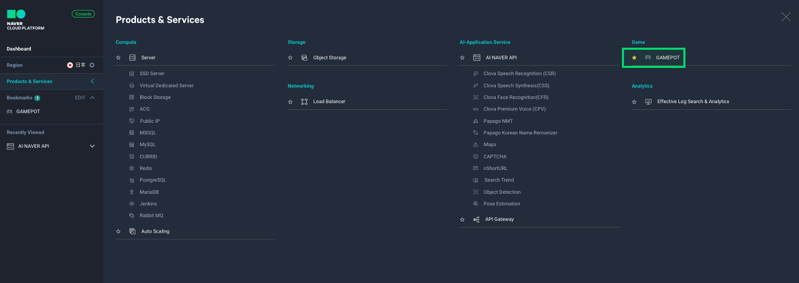
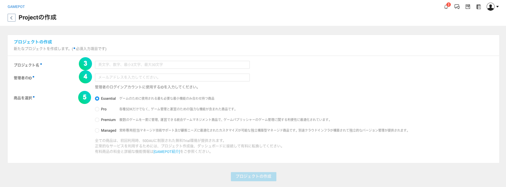
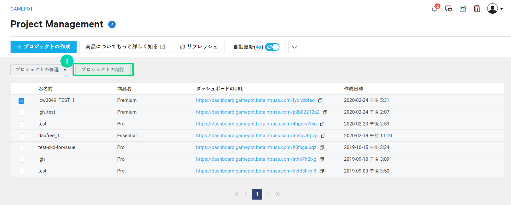
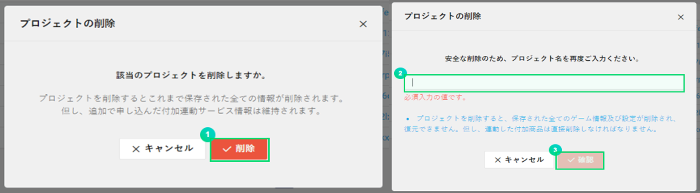

---
search:
  keyword: ['gamepot']
---

#### **NAVER クラウドプラットフォーム商品の使用方法をより詳細に提供し、様々な API の活用をサポートするために<a href="https://guide.ncloud-docs.com/docs/ja/home" target="_blank">[説明書]</a>と<a href="https://api.ncloud-docs.com/docs/ja/home" target="_blank">[API リファレンス]</a>を分けて提供しています。**

<a href="https://api.ncloud-docs.com/docs/ja/game-gamepot" target="_blank">GAMEPOT API リファレンスへ >></a> 
<a href="https://guide.ncloud-docs.com/docs/ja/game-gamepotconsole" target="_blank">GAMEPOT 説明書へ >></a>

# ご使用の前に

GAME Platform On the real Time(以下 GAMEPOT)商品は、ゲームを開発してサービスする上で必要な機能を、別途の開発費をかけないで簡単に実装できるクラウドサービスです。特に、共通 SDK はもちろん、ゲーム運用に必要な必須機能と様々な付加機能を提供し、ゲームクライアントがゲームの開発に集中できるようにする完全管理型サービスです。運用ツールや SDK サーバを開発したりインフラを運用する必要がないため、リソースの効率化を効果的に行えます。

**NAVER クラウドプラットフォーム GAMEPOT のユニークな特徴**

- ゲーム運用に必要な様々な機能を提供します。
- 管理と統計機能を便利に利用できる別途の｢ダッシュボード｣が提供されます。ダッシュボードは、すべての顧客を単純にアカウントだけで区分するわけではないため、データセキュリティが強化されています。
- ゲーム運用のためのダッシュボードへのアクセスアカウントを顧客が直接管理できるため、さらに安全です。
- 様々な NAVER クラウドプラットフォームの商品と簡単に連携できます。その上、連携商品の料金もリーズナブルです。

**Q.他社のサービスはゲームの規模が大きくなるに伴いコストも増加します。GAMEPOT はどうですか？**

GAMEPOT は、ゲームの成長に比例してコストが増加する仕組みではありません。既存の国内・海外の類似サービスは、ゲームがヒットするほどコストが増加する非効率的な仕組みになっていて、これにより予期せぬ追加コストが発生していました。しかし、GAMEPOT は基本 DAU を含む定額制料金プランと、基本 DAU を超えた場合に超えた分のコストのみを追加で支払う従量制をミックスしたハイブリッド型の料金プランを提供しています。基本 DAU は 50,000 DAU/日で、これは決して小さな数ではありません。

**Q.ダッシュボードのセキュリティについて説明してください。**

顧客のアカウントで共通のダッシュボードにアクセスする場合、顧客のアカウント情報が流出すると保存されているすべてのデータも流出する恐れがあります。NAVER クラウドプラットフォームのセキュリティは外部への情報流出を根本的に遮断していますが、より強固なセキュリティのために GAMEPOT のすべての顧客にそれぞれ異なるアクセスドメインとダッシュボードシステムを提供しているため、データをさらに安全に守ることができます。

# GAMEPOT を利用する

## Step 1. プロジェクトを作成する

サービスを利用するには、まずプロジェクトを作成する必要があります。

① コンソールで**Game &gt; GAMEPOT**を選択します。

② **+プロジェクト作成**ボタンをクリックします。

③ ゲームプロジェクト名を入力します。

- 名前は最小 3 文字から最大 30 文字まで入力できます。
- アルファベット、数字、ハイフン(-)のみ入力できます。

④ ダッシュボードで使用する管理者 ID を入力します。

- 管理者 ID はメール形式で入力します。
- ID 認証に必要なメールが、入力したメールアドレスに送信されます。

⑤ 商品を選択します。

- Managed 商品を選択すると、別途のサービス申請用の案内ポップアップが表示されます。

⑥ **プロジェクト作成**ボタンをクリックして、プロジェクトの作成を完了してください。

- プロジェクトを作成すると、基本 DAU が含まれた時間単位の料金が課金されます。プロジェクトを作成すると、使用しなくても料金が発生するので慎重に選択してください。

プロジェクトが作成されると、ダッシュボードにアクセスできる URL が表示されます。管理者 ID として入力したメールを確認し、管理者認証を完了します。

メールの認証が完了すると、初期パスワードを入力できるダッシュボード画面に移動します。初期パスワードを設定し、ログインします。

## Step 2. プロジェクトを管理する

プロジェクトが作成されると、ゲームのプロジェクト名と商品名が明記されたリスト画面が表示されます。

① ダッシュボード URL からゲーム機能を管理できるダッシュボードに移動できます。

② プロジェクトにチェックを入れ、**プロジェクト管理**ボタンをクリックすると簡単な管理メニューが表示されます。

- 商品変更：利用中のサービス商品を変更します。一時的にダッシュボードにアクセスできない場合があります。**商品変更**ボタンをクリックすると、以下のようなポップアップが表示されます。変更する商品を選択し、**修正**ボタンをクリックします。

- アカウント変更：プロジェクトを作成する際に入力した管理者 ID を変更できます。変更申請を完了すると、変更したアカウントのメールアドレスに認証メールが送信されます。

- パスワード初期化：ダッシュボードのアクセスパスワードを紛失したか、初期化が必要な場合に使用します。パスワードを初期化してからダッシュボードにアクセスすると、パスワードを再設定できます。

## Step 3. プロジェクト削除

GAMEPOT は、プロジェクトの作成が完了した時点から時間単位で料金が発生します。したがって、必要でない場合はプロジェクトを削除し、無駄な料金の発生を防いでください。

① プロジェクトを削除するには**プロジェクト削除**ボタンをクリックします。**プロジェクト削除**ボタンをクリックすると、以下のようなポップアップが表示されます。

② 削除するプロジェクト名を入力します。

③ 上記のようなポップアップが表示され、**確認**ボタンをクリックすると最終的に削除が行われます。
