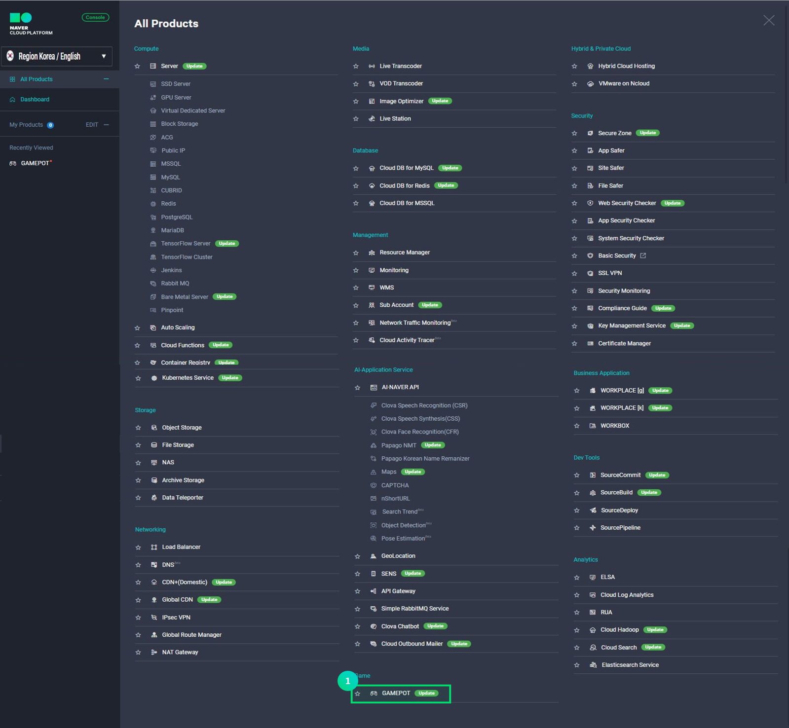

---
search:
  keyword: ["gamepot"]
---

# 使用前に

GAME Platform On the real Time(以下 GAMEPOT) 商品はゲームを開発してサービスするのに必要な機能を別の開発コストをかけずに簡単に実装できるクラウドサービスです。特に、共通 SDK はもちろん、ゲーム運営に必要な必須機能と多様な付加機能を提供してユーザーがゲーム開発にのみ集中できるようにする完全管理型サービスです。運営ツールや SDK サーバを開発してインフラを運営する必要がないため、リソースの効率化の効果を得ることができます。

**NAVER クラウドプラットフォーム GAMEPOT ならではの特徴**

- ゲームの運営に必要な多様な機能を提供します。
- 管理と統計を便利に利用できる別途の”ダッシュボード”が提供されます。ダッシュボードは全ての顧客社を単純にアカウントで区別するのではないため、セキュリティが強化されています。
- ゲームの運営に関するダッシュボードアクセスアカウントを顧客が直接管理できるため、より安全です。
- 多様な NAVER クラウドプラットフォームの商品と簡単に連動できます。また、連動商品のコストもリーズナブルです。

**Q. 他社のサービスはゲームの規模が大きくなるにつれてコストが増大します。 GAMEPOT はどうですか？**

GAMEPOT はゲームの成長と比例してコストが増加するシステムではありません。既存の韓国国内外の似通ったサービスはゲームがヒットするにつれてコストが増加する非効率的な構造であり、これによって予期せぬ追加コストが生じました。しかし、GAMEPOT は基本 DAU を含む定額制料金制と基本 DAU を超えた場合に当該超過したコストのみを追加で支払う従量制が混合したハイブリッド型の料金制です。基本 DAU は 50,000 DAU/日であり、これは決して少ない量ではありません。

**Q. ダッシュボードのセキュリティについて説明してください。**

顧客アカウントを通じて共通したダッシュボードにアクセスする場合、顧客社のアカウント情報が流出されたら保存された全てのデータが流出されます。NAVER クラウドプラットフォームのセキュリティは外部情報流出を原則的に遮断していますが、より強固なセキュリティのため、GAMEPOT の全ての顧客には全て異なるアクセスドメインとダッシュボードシステムが提供されているので、データをより安全に守れます。

# GAMEPOT を利用する

## Step 1. プロジェクトを生成する

サービスを使用するためにはまずプロジェクトを生成する必要があります。

① コンソールから **Game > GAMEPOT**を選択します。

② **+プロジェクトを生成** ボタンをクリックします。

③ ゲームプロジェクト名を入力します。

- 名前は最小 3 字から最大 30 字まで入力できます。
- 英文字、数字及び'-' 記号のみ可能です。

④ ダッシュボードに使われる管理者 ID を入力します。

- 管理者 ID はメール形式で入力します。
- ID の認証に必要なメールが入力したメールアドレスに送信されます。

⑤ 商品を選択します。

- Managed 商品を選択すると別途のサービス申込みのためのポップアップが表示されます。

⑥ **プロジェクトを生成** ボタンをクリックしてプロジェクトの生成を完了してください。

- プロジェクトを生成すると基本 DAU が含まれた時間当たりの料金が付加されます。プロジェクトを生成後は使わなくても料金が発生するので慎重に選択する必要があります。

⑦ プロジェクトが生成されたらダッシュボードにアクセスできる URL が表示されます。管理者 ID で入力したメールを確認して管理者認証を完了させます。

⑧ メール認証が完了したら初期パスワードを入力できるダッシュボードウィンドウに接続します。初期パスワードを設定してからログインします。

## Step 2. プロジェクトを管理する

プロジェクトが生成されたらゲームプロジェクト名と商品名が表示されたリストを画面で確認できます。

① ダッシュボード URL を通じてゲーム機能を管理できるダッシュボードに入ることができます。

② プロジェクトにチェックして **プロジェクト管理** ボタンをクリックすると簡単な管理メニューが表示されます。

- 商品の変更：使用しているサービス商品を変更します。一時的にダッシュボードアクセスができないことがあります。**商品を変更** ボタンをクリックすると以下のようなポップアップが表示されます。変更しようとする商品を選択して **修正** ボタンをクリックします。

- アカウントの変更：プロジェクトの生成の際に入力した管理者 ID を変更できます。変更の申込みが完了したら変更されたアカウントのメールアドレスに認証メールが送信されます。

- パスワードの初期化：ダッシュボードのアクセスパスワードを失くしたり初期化が必要な場合に使います。パスワードを初期化した後にダッシュボードにアクセスするとパスワードを再度設定できます。

## Step 3. プロジェクトの削除

GAMEPOT はプロジェクト生成が完了した時点から時間当たりの料金が発生します。従って、不要な場合はプロジェクトを削除して余計な料金が発生するのを防ぐ必要があります。

① プロジェクト削除のためには **プロジェクトを削除** ボタンをクリックします。 **プロジェクトを削除** ボタンをクリックすると以下のようなポップアップが表示されます。

② 削除するためにはプロジェクト名を入力してください。

③ 上のようなポップアップが表示されて **確認** ボタンをクリックすると最終的に削除が進みます。
