---
search:
  keyword: ["gamepot"]
---

#### **NAVERクラウドプラットフォーム商品の使用方法をより詳細に提供し、様々なAPIの活用をサポートするために<a href="http://docs.ncloud.com/ko/" target="_blank">[説明書]</a>と<a href="https://apidocs.ncloud.com/ko/" target="_blank">[APIリファレンス]</a>を分けて提供しています。**

<a href="https://apidocs.ncloud.com/ko/game/gamepot/" target="_blank">GAMEPOT APIリファレンスへ >></a> 
<a href="https://docs.ncloud.com/ko/game/gamepot_console.html" target="_blank">GAMEPOT説明書へ >></a>

# Dashboard

NAVER CLOUD PLATFORMのGAMEPOTで提供するダッシュボードに関するガイドです。

## GAMEPOTダッシュボードの紹介

**Q. ダッシュボードとは？**

ダッシュボードを通じてゲームを運用、管理できます。

**Q. ダッシュボードにはどのような運用機能が含まれていますか？**

ダッシュボードでは会員のアクセス統計と決済に関する統計の確認ができ、NAVER CLOUD PLATFORMのサービスと連携してPUSH、SMS、ログ分析など様々な機能を制御できます。また、クーポンやアップデートなどゲーム運用に必要な機能がサービス内に備わっているため、より効率的にゲーム管理ができます。

## GAMEPOTダッシュボードを始める

### ログイン

#### Step 1. ダッシュボードにアクセス

NAVER CLOUD PLATFORMのコンソールでダッシュボードURLをクリックし、ダッシュボードにアクセスします。

#### STEP 2. 会員登録

プロジェクト作成時に登録した管理者アカウントにパスワード初期化メールが送信されます。

#### STEP 3. ログイン

管理者アカウントがダッシュボード管理のすべての権限を持つマスターアカウントになります。

① 管理者アカウントで使用するパスワードを設定します。

② ダッシュボードで使用する基準通貨を選択します。選択した通貨は売上指標、決済統計などに用いられます。<i>運用中に基準通貨を変更しても過去のデータは変更されないため、慎重に選択してください。</i>

③ ダッシュボードに表示される時間帯を選択します。

## ダッシュボードのメニューを活用する

### ダッシュボード

ダッシュボードでは、会員登録現況、売上、アクセス、統計などのゲーム全般の運用状況を一目で把握できます。

① 日付を選択してグラフを確認できます。

## 統計

### ユーザー指標

指定した期間の各種ユーザー指標をグラフで表示します。

① 基本的に直近30日間のユーザー指標が表示され、期間を指定すると指定した期間のユーザー指標を照会できます。

② 各グラフを拡大して詳細情報を確認できます。

③ 最後のアップデート時間を確認できます。

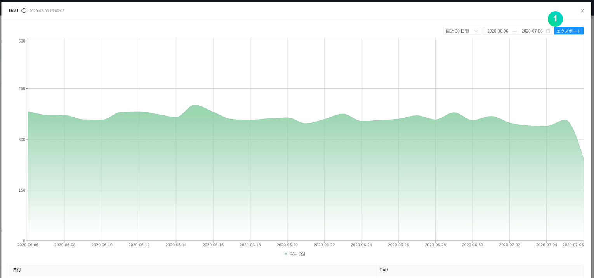

① 現在表示されているグラフのRAWデータをCSVファイルの形式でダウンロードできます。

#### Retention

Retentionデータを確認できます。[Retention D+0]は登録日から指標に表示され、[Retention D+1]は登録日の翌日もアクセスした会員から表示されます。

### 売上指標

指定した期間の各種売上指標をグラフで表示します。

① 基本的に直近30日間の売上指標が表示され、期間を指定すると指定した期間の売上指標を照会できます。

② 各グラフを拡大して詳細情報を確認できます。

③ 最後のアップデート時間を確認できます。

① 現在表示されているグラフのRAWデータをCSVファイルの形式でダウンロードできます。

## 運用

### 会員

#### - リスト

会員登録した会員リストが表示されます。

① 会員登録日の範囲を指定して、特定期間の間に登録した会員を照会できます。

② ユーザーIDまたはIPを指定して、特定会員を照会できます。

③ 会員リストをCSVファイルの形式でダウンロードできます。

④ ユーザーIDをクリックすると以下のような詳細ページが表示されます。

① 会員に対する基本情報を表示します。

② ゲームにアクセスした\(ログイン\)履歴を表示します。

③ プレイヤーID、レベルなどゲーム内の情報を表示します。

④ 会員がゲーム内で決済した履歴を表示します。

⑤ 会員が登録した問い合わせと、それに対する返答履歴を表示します。

⑥ 会員が連携したソーシャルアカウントをすべて表示します。

- ソーシャルアカウントを追加したり、連携キャンセルできます。

⑦ 会員の利用停止履歴を表示します。

⑧ 支給されたアイテム明細を表示します。

**個別プッシュ送信**ボタンをクリックして特定会員にプッシュメッセージを送信できます。

① 送信するプッシュメッセージの基本言語を指定します。

② 送信するメッセージを入力します。

③ 送信する言語を選択します。

**利用停止**ボタンをクリックして特定会員の利用停止ができます。

① 利用停止状態を選択します。

② 登録した利用停止の分類を選択します。

③ 指定したユーザーIDが入力されています。

④ 表示される利用停止理由の基本言語を選択します。

⑤ 利用停止理由を入力して言語を指定します。

⑥ 利用停止期間を指定します。

**会員退会**ボタンをクリックして特定会員を退会させることができます。

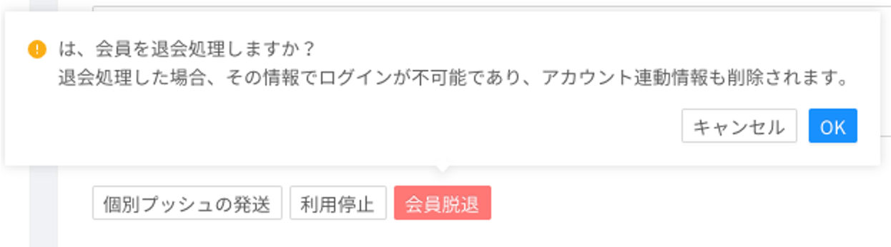

#### - 日別のアクセス者

指定した期間の日別のアクセス者数をグラフで表示します。

基本的に直近30日間の日別のアクセス者数が表示され、期間を指定すると指定した期間の日別のアクセス者数を照会できます。

① 現在表示されているグラフのRAWデータをCSVファイルの形式でダウンロードできます。

② 最後のアップデート時間を確認できます。

#### - 新規ユーザー

指定した期間にゲームに会員登録した日別の新規登録者数をグラフで表示します。

基本的に直近30日間の日別の新規会員登録者数が表示され、期間を指定すると指定した期間の日別の新規登録者数を照会できます。

① 現在表示されているグラフのRAWデータをCSVファイルの形式でダウンロードできます。

② 最後のアップデート時間を確認できます。

#### - 同時アクセス者

ゲームにアクセスした会員数を1分単位で最大3日分、同時に照会できます。

① 当日と前日、前々日が基本として指定されていて、最大照会可能日数の3日分を選択\(変更\)できます。初期化ボタンを押すと、基本指定日に戻ることができます。

② 現在表示されているグラフのRAWデータをCSVファイルの形式でダウンロードできます。

③ 最後のアップデート時間を確認できます。

#### - 利用停止

特定会員に対して、指定した期間ゲームにアクセスできないようにします。

利用停止は会員のユーザーIDを基準に適用されます。

① 利用停止を適用するには、追加ボタンをクリックします。

② 利用停止分類を設定し、レスポンスメッセージのテンプレートを登録できます。

③ 特定期間に関する利用停止記録を照会できます。

④ 特定ユーザーIDに関する利用停止履歴を照会できます。

⑤ 利用停止会員の履歴が表示されます。

- 有効 ：現在、利用停止状態が適用されている場合
- 無効 ：現在、利用停止状態が解除されている場合

### 決済

#### - 決済リスト

会員がGoogle Play Store、APPSTORE、ONE Store、Galaxy Storeで決済を行った履歴を確認できます。

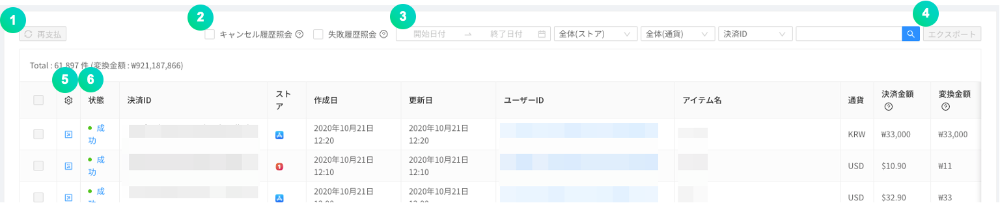

① 失敗した履歴のみ照会できます。

② 通貨を選択して、各通貨ごとの決済リストを確認できます。
③ 실패한 결제에 대해서 체크박스로 다중선택 한 다음, 재지급 버튼을 눌러 재지급 할 수 있습니다.
④ 成功した決済について決済キャンセル処理ができます。決済をキャンセルする場合、売上統計から除外されます。

⑤ 会員が行った決済の成否を照会できます。失敗した決済についてはアイテムを再支給できます。

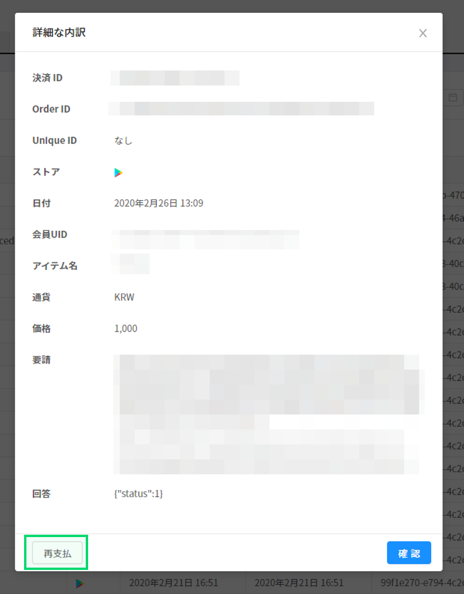

決済状態をクリックすると行った決済の詳細履歴を確認でき、失敗した決済については再支給ボタンをクリックしてアイテムを再支給できます。

#### - IAP

In-App購入時に商品情報を管理する機能です。Google Play Store、APPSTORE、ONE Store、Galaxy Storeなどの商品をすべて登録してください。

① **In-Appアイテム追加**ボタンをクリックしてストア、商品名、商品IDを入力し、有料アイテムを作成できます。

② **大量入力**ボタンをクリックすると、In-App商品をCSVファイルで一度に登録できます。

③ 각 상품 항목의 체크박스를 다중선택 한 다음, **삭제**버튼을 클릭해 삭제할 수 있습니다. 

#### - 統計

一日単位で決済金額データをグラフで表示する機能です。

① ストアを指定してグラフを見ることができます。

② 現在表示されているグラフのRAWデータをCSVファイルの形式でダウンロードできます。

③ 最後のアップデート時間を確認できます。

#### - 決済キャンセル

ストアの決済領収証の状態と比較して、任意に決済をキャンセルする会員のゲームアクセスに対して利用停止措置を行うことができます。利用停止になった会員が当該アイテムを再決済すると、利用停止が無効化します。Google Play StoreとAPPSTOREの領収証検証に対応しています。

① 決済をキャンセルした会員の利用停止処理条件を設定します。

② 現在表示されているグラフのRAWデータをCSVファイルの形式でダウンロードできます。

③ 最後のアップデート時間を確認できます。

① 会員が任意に決済キャンセルを悪用したと認められると、利用停止を決定できます。有効にすると、設定したオプションに応じて自動的に1時間間隔で決済キャンセルを悪用した会員の利用を停止します。

② 会員が任意に決済キャンセルした総回数が設定した回数以上である場合、ゲームの利用が停止されます。

③ 会員が任意に決済キャンセルした商品の合計が設定した金額以上である場合、ゲームの利用が停止されます。

④ ゲームの利用が停止された会員がゲームにアクセスしようとする場合に表示される案内メッセージの基本言語を選択します。

⑤ ゲームの利用が停止された会員がゲームにアクセスしようとする場合に表示される案内メッセージです。

⑥ Googleの決済キャンセルリストを取得するには、Google API keyを入力してください。テストボタンをクリックすると、機能が正常に動作しているか確認できます。

⑦ App Storeの決済キャンセルリストを取得するには、アドレスコピーボタンをクリックしてURLをコピーし、App Storeに入力してください。

### 案内事項

ダッシュボードに登録した案内事項の画像は、ゲームにアクセスした会員に表示されます。表示するスケジュールとストアを指定するとその条件に合わせて案内事項が表示され、スケジュールが終了すると表示されません。

案内事項機能を使用するには、まずNAVER CLOUD PLATFORMのAPI認証キーとObject Storageサービスが必要になります。案内事項機能を使用すると、Object Storage費用は別途で発生します。

#### Step 0. サブアカウントを作成してObject Storageサービスの利用権限を付与

① API認証キーが発行される前にサブアカウントを作成してObject Storageの利用権限を付与してから、当該アカウントを通じてAPI認証キーを発行してもらうことをお勧めします。

② [Sub Account使用ガイド](https://docs.ncloud.com/ko/management/management-4-1.html)を参考にしてサブアカウントを作成します。(サブアカウントを作成する際に**API Gateway Access**をチェックしてください。)

③ 作成したサブアカウントにObject Storageサービス権限を付与してください。[System Managedポリシー説明書](https://docs.ncloud.com/ko/management/management-4-2.html)を参考にして当該サブアカウントに**NCP_OBJECT_STORAGE_MANAGER**権限を付与します。(もしくはオブジェクトストレージ権限が含まれた権限)

③ 作成したサブアカウントでアクセスし、API認証キーを発行してもらいます。

#### Step 1. API認証キー用意

案内事項メニューはAPIを通じてObject Storageと連携して使用します。したがって、NAVER CLOUD PLATFORMのAPI認証キーを予め用意する必要があります。

API認証キーは**ポータル &gt; マイページ &gt; アカウント管理 &gt; 認証キー管理**メニューで作成できます。

① API認証キーを作成するには**新規API認証キー作成**をクリックしてください。

- API認証キーはアカウントごとに2個まで作成できます。

#### Step 2. ダッシュボードとAPI認証キーを連携する

Object Storageのバケットを作成して案内事項機能を使用するには、発行された認証キーとダッシュボードを連携させる必要があります。ダッシュボードの**プロジェクトの設定 &gt; Ncloud**メニューに移動し、API認証キーを連携させます。

API認証キーが連携されるとObject Storageのバケットが自動的に作成されます。案内事項で使われたすべての画像はそのバケットに保存されます。

#### Step 3. 案内事項の追加

案内事項を追加するには、**案内事項**メニューに移動します。

① **案内事項の追加**ボタンをクリックして画像を追加できます。

② ユーザーに表示する画像の順序を指定できます。

次に、以下のようなポップアップメニューが表示されたら希望の値を入力して、**保存**ボタンをクリックすると案内が追加されます。

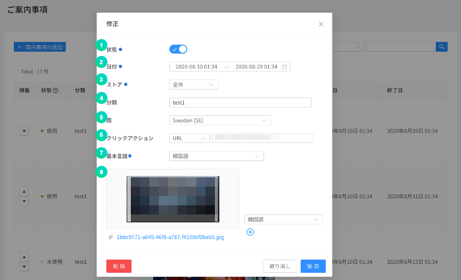

① 当該案内事項を有効化するか選択します。

② 表示する案内事項の開始日時と終了日時を指定します。

③ 選択したストアの分類に応じてすべてのストアの当該アプリに案内事項を表示するか、特定ストアを通じてゲームにアクセスしたユーザーにのみ案内事項を表示するかを指定できます。

④ 노출할 공지사항의 분류를 지정합니다. 분류가 지정된 이미지는, 해당 분류 값으로 호출할 때에만 이미지가 노출됩니다.

⑤ 노출할 공지사항의 국가를 지정합니다. 해당 국가에 해당하는 디바이스에 대해서만 이미지가 노출됩니다.

⑥ 表示された案内事項の画像をユーザーがタップすると、URLは外部ブラウザに移動し、SCHEMEはcallback関数で値を返します。

⑦ 各言語設定に応じて表示される案内事項の画像の中から基本言語を指定します。

⑧ 表示する案内事項の画像をマウスドラッグするか、直接ファイルを選択できます。

各言語別に異なる画像が表示されるように、画像を追加登録できます。

### メンテナンス&アップデート

メンテナンスとアップデート機能を用いて、より簡単かつ手軽にゲームを管理できます。

#### - メンテナンス

ゲームメンテナンス時間に自動的にメンテナンスメッセージを表示して、ゲームアクセスを遮断します。

メンテナンス時間とメッセージを入力して保存すると、ゲーム内でメンテナンス案内が表示されます。

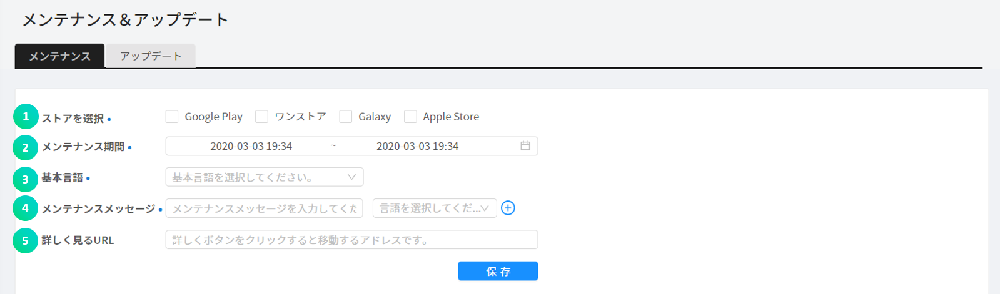

① ストアを指定できます。全体メンテナンスの場合、全体ストアに指定してください。

② メンテナンス開始時間と終了時間を指定してください。

③ デバイスの言語設定に応じて異なる言語で表示されるメンテナンスメッセージの中から基本言語を指定します。

④ 言語設定に応じて異なる言語で表示されるメッセージを追加登録できます。

⑤ URLは、メンテナンスの際に「詳しく見る」をクリックすると移動するアドレスを入力してください。

**例：コミュニティのお知らせや直接作成したメンテナンス案内ページ**

#### - アップデート

最新バージョンでない場合はアップデート案内を表示し、Google Play StoreやAPPSTOREのようなストアのアップデート画面に移動します。

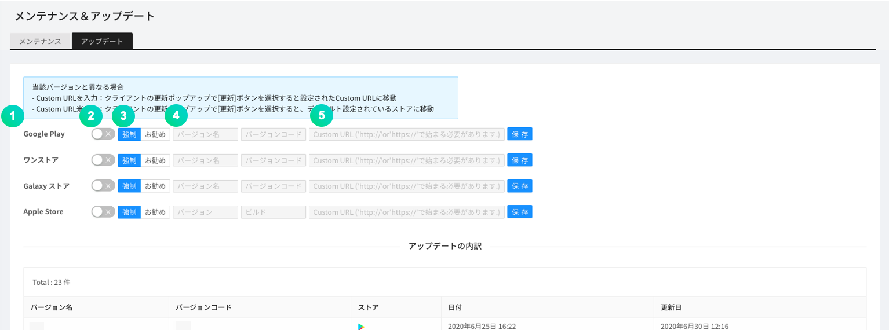

① ストア別に設定します。

② 機能を有効化するか選択します。

③ **強制**を選択した場合はストアでアップデートするまでゲームを利用できず、**推奨**を選択した場合はストアでアップデートしなくてもゲームを利用できます。

④ バージョン情報を入力します。入力したバージョンと異なるか、それより低い場合、機能が動作します。

⑤ アップデートボタンを選択すると移動するURLを入力します。

- Custom URL入力：ゲームクライアントのアップデートポップアップでアップデートボタンを選択すると、設定したCustom URLに移動
- Custom URL未入力：ゲームクライアントのアップデートポップアップでアップデートボタンを選択すると、基本設定されているストアに移動

### メッセージ

別途のメッセージサーバを構築せずに、SMSやPUSHなどを通じてメッセージ通知機能を実装できるサービスです。この機能を使用するには、NAVER Cloud PlaformのSimple & Easy Notification Service\(SENS\)を申請する必要があります。

① サブアカウントを作成してSENSサービスを申請することをお勧めします。本文の**案内事項 -&gt; Step 0**を参考にしてサブアカウントを作成します。(**Step 0** と同様に、API認証キーもまたサブアカウントで発行してもらってください。)

② 作成したサブアカウントにSENSサービス権限を付与してください。[System Managedポリシー説明書](https://docs.ncloud.com/ko/management/management-4-2.html)を参考にして当該サブアカウントに**NCP_SENS_MANAGER**(が含まれた)権限を付与します。

① SENSと連携するにはサービスキーを発行する必要があります。**サービスキー発行**ボタンをクリックし、作成したサブアカウントでアクセスした後、[SENS共通ガイド](https://docs.ncloud.com/ko/sens/sens-1-2.html)を参考にしてサービスキーを発行してもらいます。

② **証明書登録ガイド**ボタンをクリックし、**SENSウェブコンソール使用ガイド**に従って証明書を登録します。

③ **設定**ボタンをクリックし、以下の画面に移動してPUSHサービスIDの値を入力します。

#### - プッシュメッセージ

**メッセージ &gt; プッシュメッセージ**メニューをクリックすると、送信状態、予約時間、送信時間などを確認できるリスト画面が表示されます。

**プッシュメッセージ**メニューで **+メッセージ追加**ボタンをクリックすると、以下のようなポップアップが表示されます。このポップアップメニューからメッセージを送信できます。

① プッシュメッセージの伝送スケジュールを指定できます。\(即送信 / 予約送信 / 予約送信\(グローバル現地時間\)\)

② プラットフォームを指定し、指定したプラットフォームのユーザーのみプッシュ通知を受け取れます。

③ デバイスの言語設定に応じて異なる言語で伝送されるプッシュメッセージの中から基本言語を指定します。

④ 件名は必要に応じて入力できます。未入力の場合、アプリ名が件名として表示されます。

⑤ デバイスの言語設定に応じて異なるプッシュメッセージを登録できます。

CSVファイルのアップロードを通じて、プッシュメッセージを大量に送信できます。

- 大量入力を通じて最大100件のプッシュを登録できます。(CSVファイルの最大容量は20MB)
- CSVサンプルをダウンロードして設定した後、CSVファイルを登録するをクリックして登録してください。
- CSVファイルはUTF-8形式で保存してから登録してください。
- 大量入力の場合、プッシュの即送信には対応していません。

#### - テキストメッセージ

SMS/LMSの送信や履歴、結果照会などの機能を使用できます。SMS/LMSを送信するには、まずNAVER CLOUD PLATFORMのSENSでサービスキーの発行と発信番号の登録を行う必要があります。

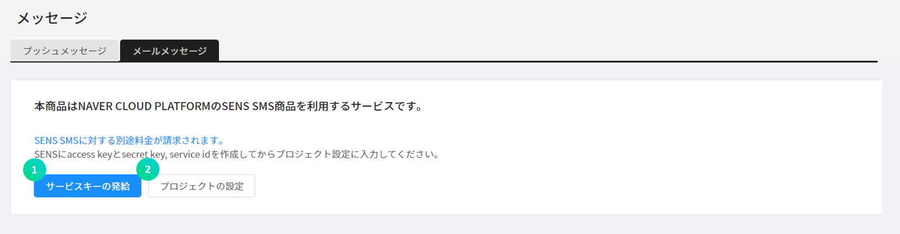

① SENSと連携するには、まずサービスキーの発行と発信番号の登録を行う必要があります。**サービスキーの発行**ボタンをクリックして、[SENS共通ガイド](https://docs.ncloud.com/ko/sens/sens-1-1.html)と[SENS SMS使用ガイド](https://docs.ncloud.com/ko/sens/sens-1-3.html)を参考にしてサービスキーの発行と発信番号の登録を行います。

② **設定**ボタンをクリックして、サービスIDとSecret Keyを入力してください。

**メッセージ追加**ボタンをクリックします。以下のようなポップアップが表示されます。

① SMSは短文メッセージ、LMSは長文メッセージです。メッセージに応じて料金が異なります。

② NAVERクラウドコンソールに登録した発信番号を入力してください。\(登録していない番号は送信されません。\)

③ SMS、LMSで送信する受信番号を入力できます。

④ SMS、LMSの受信番号/クーポンの乱数番号などが大量にある場合、CSV形式のファイルで構成でき、これに対するサンプルファイルをダウンロードできます。

⑤ SMS、LMSの受信番号/クーポンの乱数番号などが大量にある場合、CSV形式のファイルで構成してアップロードできます。アップロードしたSMS、LMSの受信番号とクーポンの乱数番号は、⑥のメッセージの中で指定した項目にマッチングされ、自動的に入力されてSMS、LMSで送信されます。

⑥ SMS、LMSで送信するメッセージの内容を入力してください。

⑦ 予約時間を指定すると、指定した時間にメッセージが送信されます。

### クーポン

ゲーム内で欠かせないクーポン機能は、一般クーポン、キーワードクーポンに対応しています。

#### - 一般クーポン

一般クーポンは、一般的にコード形式になっているクーポンです。ゲーム内で使用されるクーポンを簡単に作成、管理できる機能です。**+クーポン作成**をクリックすると、以下のようなポップアップが表示され、これを通じてクーポンを作成できます。

① 使用期間を指定して、その期間以外にはクーポンが使用できないようにします。

② クーポンの長さによって作成できるクーポンには制限があります。8~10の間で作成してください。

③ Prefix\(接頭辞\)、Suffix\(接尾辞\)を指定した場合、クーポン番号を作成する際に指定した文句が付きます。

④ クーポンは最大10万枚作成でき、作成した後に増やすこともできます。\(最大クーポン数は50万枚です。\)

⑤ クーポンを使用する際に支給されるアイテムと、アイテムの数を指定できます。+ ボタンを用いて複数のアイテムを支給できます。

クーポンの作成が完了すると、作成されたクーポンリストが以下のように表示されます。

クーポンの現在の状態と使用枚数、制限枚数などが確認できます。

リストでこれまでに作成したクーポンの枚数を変更でき、クーポンの枚数を簡単に増やせます。

① リストの一番前の青いアイコンをクリックすると、クーポン追加ポップアップが表示されます。

② クーポンの使用統計を確認できます。

#### - キーワードクーポン

｢クリスマス｣、｢オープンイベント｣、｢新年｣のような指定のキーワードを作成し、そのキーワードをクーポン画面に入力するとアイテムを支給する機能です。最近はクーポンコードの入力が複雑なため、ゲームユーザーの利便を図るためにキーワードクーポンがよく使用されます。

**+クーポン作成**をクリックします。

① クーポンが使用できる期間を指定します。

② クーポンを支給するキーワードを入力します。

③ 制限枚数を超えない範囲で支給できます。

④ クーポンを使用する際に提供されるアイテムと、アイテムの数を指定できます。+ ボタンを用いて複数のアイテムを支給できます。

#### - 使用履歴

発行されたすべてのクーポン番号を照会できます。

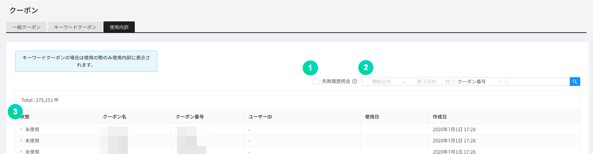

① 失敗した履歴のみ照会できます。

② 期間、クーポン番号、ユーザーIDなどを指定して、クーポンの使用有無を検索できます。

③ 発行されたクーポンに対する使用の有無を確認できます。

- 成功：クーポン使用が完了した状態
- 未使用：クーポンが未使用状態

### サポートセンター

顧客がゲーム内で問い合わせを登録した場合、照会して返答できる機能です。ゲーム内のサポートセンター画面で基本情報を入力できるようになっている場合、GAMEPOTでもその情報を確認できます。

#### - お問い合わせ

顧客が問い合わせた内容を確認できます。
返答に対する満足度は、問い合わせ終了後に顧客が満足度を選択すると表示されます。

**会員ID**をクリックします。

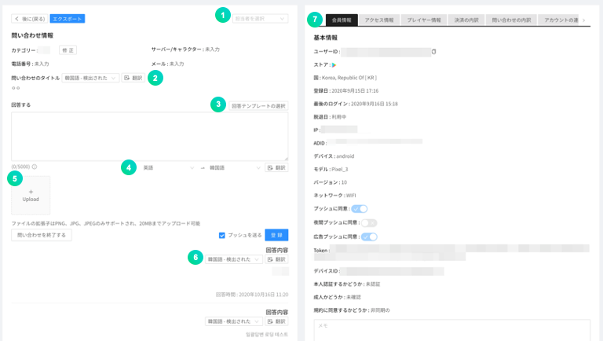

&gt; 問い合わせの翻訳機能は、プロジェクトの設定>NCloud>Papago値を設定しないと表示されません。基本翻訳言語、自動言語検出、自動翻訳機能は会員情報の修正で設定できます。

① 担当者を指定できます。担当者を指定すると、その担当者以外の人は問い合わせに返答できません。

② 問い合わせの件名を翻訳できます。検出された言語から基本翻訳言語に翻訳されます。

③ 作成した返答の内容を翻訳できます。Papagoでサポートしている言語のみリストに表示されます。

④ 返答に必要な画像ファイルをアップロードできます。

⑤ 問い合わせの内容を翻訳できます。検出された言語から基本翻訳言語に翻訳されます。

⑥ 当該会員に対するすべての情報を基本的に表示します。

**\[通知設定\]**

返答する際に顧客にプッシュ、メールを送信する機能です。

① 使用の有無にチェックを入れると、プッシュ通知機能が動作します。

② デバイスの言語設定に応じて異なる言語で表示されるプッシュメッセージの中でから基本言語を指定します。

③ デバイスの言語設定に応じて異なる言語で表示されるプッシュメッセージです。

④ 使用の有無にチェックを入れると、メール通知機能が動作します。

⑤ 送信メールアドレスを入力します。

⑥ 送信メール名を入力します。

⑦ メールのヘッダーを入力します。入力しない場合、基本フレーズで送信されます。

⑧ メールのフッターを入力します。入力しない場合、基本フレーズで送信されます。

⑨ 送信するメールのテンプレートをプレビューできます。

**\[分類設定\]**

問い合わせに対するテンプレートを予め設定する機能です。

**分類設定**をクリックします。

**分類追加**を通じて、問い合わせに対する分類名を追加して管理できます。

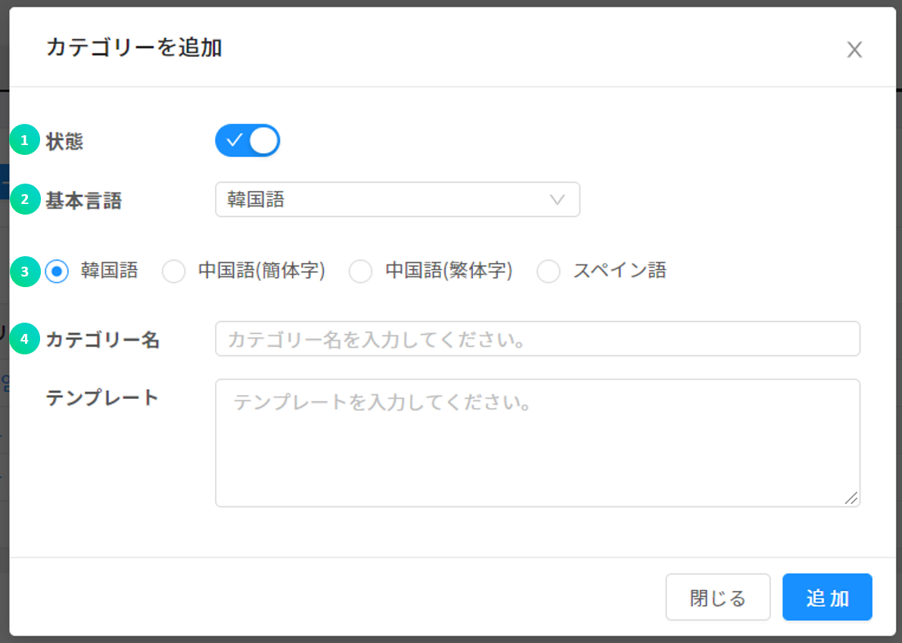

① 状態にチェックを入れると、その分類名が有効化します。

② デバイスの言語設定に応じて異なる言語で表示される問い合わせの分類名の中から基本言語を指定します。

③ デバイスの言語設定に応じて異なる分類名とテンプレートを予め指定できます。

④ 指定した言語の分類名とその分類の問い合わせに対するテンプレートを入力します。

**\[外部アクセス設定\]**

外部アクセスによりログインしていないユーザーも問い合わせを登録できます。返答はメールで行われます。

**外部アクセス設定**をクリックすると、外部の問い合わせURLがクリップボードに保存されます。

#### - FAQ

よくある質問の内容を登録し、確認できます。

**追加**をクリックします。

① 状態にチェックを入れると、その質問が有効化して確認できるようになります。

② FAQの分類名を選択できます。

③ デバイスの言語設定に応じて異なる言語で表示されるFAQ項目の中から基本言語を指定します。

④ デバイスの言語設定に応じて異なる質問と返答を登録しておくことができます。

⑤ 質問とそれに対する返答を入力します。

**\[分類設定\]**

FAQに対する分類を設定しておく機能です。

**分類設定**をクリックします。

**分類追加**を通じて、問い合わせに対する分類名を追加して管理できます。

① 状態にチェックを入れると、その分類名が有効化します。

② デバイスの言語設定に応じて異なる言語で表示されるFAQ分類名の中から基本言語を指定します。

③ デバイスの言語設定に応じて異なるFAQ分類名を指定しておくことができます。

④ 指定した言語の分類名を入力します。

#### - 利用規約の設定

利用規約の内容を入力できます。この内容はSDKを通じてユーザーに表示できます。

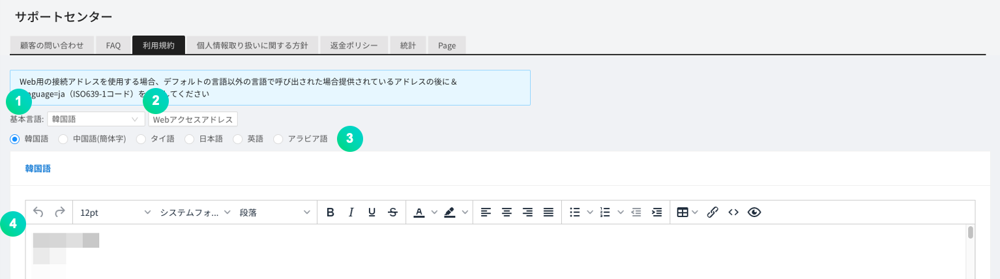

① デバイスの言語設定に応じて異なる言語で表示される利用規約の内容の中から基本言語を指定します。

② 利用規約をウェブページで確認できます。クリックするとURLがコピーされます。異なる言語でアクセスしたい場合、URLの後ろに<b><i>&language=ko</i> (ISO 639-1コード参照)</b>を追加します。

③ デバイスの言語設定ごとに異なる利用規約の内容を入力できます。

④ 指定した言語に対する利用規約の内容を入力します。

#### - 個人情報の取扱方針の設定

‭個人情報の取扱方針の内容を入力できます。この内容はSDKを通じてユーザーに表示できます。

① デバイスの言語設定に応じて異なる言語で表示される個人情報の取扱方針の内容の中から基本言語を指定します。

② 個人情報の取扱方針をウェブページで確認できます。クリックするとURLがコピーされます。異なる言語でアクセスしたい場合、URLの後ろに<b><i>&language=ko</i> (ISO 639-1コード参照)</b>を追加します。

③ デバイスの言語設定ごとに異なる個人情報の取扱方針の内容を入力できます。

④ 指定した言語に対する個人情報の取扱方針の内容を入力します。

#### - 払い戻しポリシーの設定

払い戻しポリシーの内容を入力できます。この内容はSDKを通じてユーザーに表示できます。

① デバイスの言語設定に応じて異なる言語で表示される払い戻しポリシーの内容の中から基本言語を指定します。

② 払い戻しポリシーをウェブページで確認できます。クリックするとURLがコピーされます。異なる言語でアクセスしたい場合、URLの後ろに<b><i>&language=ko</i> (ISO 639-1コード参照)</b>を追加します。

③ デバイスの言語設定ごとに異なる払い戻しポリシーの内容を入力できます。

④ 指定した言語に対する払い戻しポリシーの内容を入力します。

#### - 統計

一定期間の問い合わせ統計を確認できます。

#### -ページ

ウェブページを作成してアクセスアドレスを提供する機能です。

① ウェブページを作成、修正できます。

② 指定したページに対するページ内容を入力します。

### 광고

(주)나스미디어와 제휴하여, 대시보드 광고를 신청하고 관리할 수 있습니다.

사전예약, 리워드, 논리워드 메뉴를 통해 광고를 신청할 수 있고 NBP 담당자와의 커뮤니케이션을 통해 광고를 진행할 수 있습니다.

## ゲーム

### プレイヤー

SDKを通じてゲーム内のキャラクター情報を伝送し、ダッシュボードで確認できます。

### プレゼントする

Webhookを通じてアイテムをゲームサーバに送信できます。

**プレゼント送信**ボタンをクリックします。

① チェックを入れると、実際にゲームサーバに送信せずにテストを行います。

② 対象を選択します。

③ 対象IDを入力できます。

④ アイテムを送信する際に、UserData値として伝達されるデータを入力します。

⑤ 表示される件名を入力できます。

⑥ 表示される説明を入力できます。

⑦ 送信されるアイテムと個数を指定します。

#### - アイテム

アイテムメニューを通じて、クーポンで取得できるクーポンアイテムを作成できます。**アイテム追加**ボタンをクリックしてアイテムを追加できます。
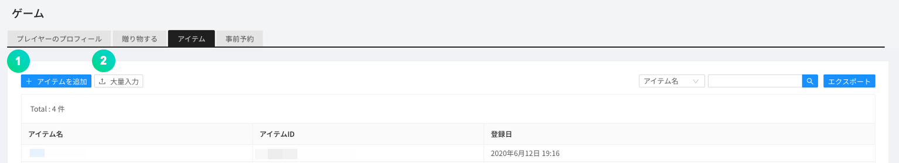

① アイテムを追加できます。

② **大量入力**ボタンをクリックすると、アイテムをCSVファイルで一度に登録できます。

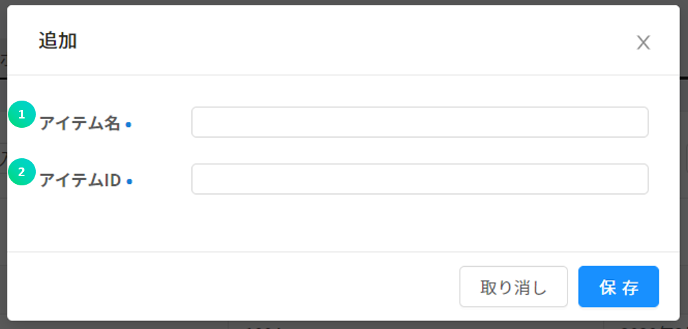

① アイテム名を入力します。

② アイテムIDを入力します。アイテムIDはアイテムごとに識別可能でなければなりません。

### 事前予約

事前予約機能は、事前予約ウェブページを通じて登録したユーザーの統計を表示する機能です。

① 事前予約を追加できます。事前予約名は統計算出のためのIDとして用いられます。

② 事前予約名を修正できます。

③ 事前予約申請者をダウンロードできます。

今後、事前予約者を対象に大量SMS送信ができる機能を追加する予定です。

## 設定

### Remote Config

Remote Config機能は、アプリをアップデートせずにアプリの動作と形を変更できる機能です。サーバにパラメータを追加して、その値をGAMEPOT SDKから取り込んで使用できます。したがって、ゲーム内の機能をサーバで制御したい場合、この機能を用いると簡単に適用、制御できます。

**追加**ボタンをクリックします。以下のようなポップアップ画面が表示されたらパラメータと値を入力します。

このパラメータと値は、ユーザーが新しくアプリを実行する時点から反映されます。

### プロジェクトの設定

#### - 一般

アプリ全般の環境を設定したり、アプリを運用するために必要な様々な鍵値を入力できます。

##### 基本情報

① ゲーム名を入力してください。

② アプリケーションタイプを選択できます。

③ カテゴリを選択できます。

④ プロジェクトの説明を入力できます。

⑤ ハッシュキーを入力できます。

⑥ 使用言語を選択できます。

⑦ 基準通貨を変更できます。

- 運用中に基準通貨を変更しても、過去の決済金額は変更されません。慎重に選択してください。

##### 公開鍵

Google Play StoreとONE Storeに連携するために設定する項目です。

① Google Play Storeの公開鍵値を入力します。

② Google Play Storeで同じゲームを二つのバージョンでリリースする場合\(例えば、12才と18才バージョン\)、パッケージ名を前に入れて後ろに公開鍵値を入れます。

③ ONE Storeの公開鍵値を入力します。

④ ONE Storeで同じゲームを二つのバージョンでリリースする場合\(例えば、12才と18才バージョン\)、パッケージ名を前に入れて後ろに公開鍵値を入れます。

##### Google API Key

Google API連携\(Google Play Storeで決済をキャンセルした会員リストの確認と最新バージョンの決済領収証検証\)に必要な設定項目です。

① Googleが提供するJSONデータを入力します。｢ヘルプを見る｣を参考にしてください。

② 決済領収証検証バージョンです。1番項目にデータを入力した場合は｢Version 3｣を選択してください。

③ Google領収証検証テストとして入力したGoogle JSON値が正しいか確認できます。

① Google領収証のパッケージ名を入力します。

② Google領収証の商品名を入力します。

③ Google領収証の購入トークンを入力します。

④ Google領収証の照会結果を確認できます。

##### App ID

強制アップデートによりストアに移動する際に必要な設定項目です。IDの取得方法は「ヘルプを見る」をクリックして確認できます。最初の入力フィールドにはバージョンを区分するための値を入力し、二番目の入力フィールドにはストアに送る値を入力します。

① Google Play Storeのパッケージ名を入力します。

② 同じゲームを二つのバージョンでリリースする場合\(例えば、12才と18才バージョン\)、Google Play Storeのパッケージ名を追加で入力します。

③ ONE Storeのパッケージ名とPIDを入力します。

④ 同じゲームを二つのバージョンでリリースする場合、ONE Storeのパッケージ名とPIDを追加で入力します。

⑤ Galaxy Storeのパッケージ名を入力します。

⑥ 同じゲームを二つのバージョンでリリースする場合、Galaxy Storeのパッケージ名を追加で入力します。

⑦ APPSTOREのバンドルIDとApple IDを入力します。

⑧ 同じゲームを二つのバージョンでリリースする場合、APPSTOREのバンドルIDとApple IDを追加で入力します。

##### Server Key

ONE StoreでIn-App決済してアイテム支給をリクエストするために、事前に設定する情報です。

① ONE Storeのライセンスキーを入力します。

② 二つのバージョンでリリースする場合、他のバージョンのライセンスキーを入力します。\(バージョンが二つではない場合、入力の必要はありません。\)

##### Auth Key

Auth Key項目はGoogle、Facebookログインの際にトークン検証に用いられ、トークン検証に失敗した場合はゲームユーザーのログインを制限します。ログインが制限されたゲームユーザーは、自動的に利用停止メニューに登録されます。

① GoogleのClient ID値を入力します。

② FacebookのApp ID値を入力します。

③ FacebookのApp Secret Key値を入力します。

④ Apple PRIVATE KEYを入力します。

⑤ Apple KEY IDを入力します。

⑥ Apple TEAM IDを入力します。

##### WebHook

WebHook項目の決済アイテムには、決済成功時にアイテム支給をリクエストするアドレスを入力します。

クーポンアイテムは、SDKを用いたクーポン使用に成功した際、SDKサーバから開発会社のサーバに成功処理\(アイテム支給\)をリクエストするアドレスであり、実際のサービスに用いられるアドレス\(サービス\)とサービス中にテスト環境が必要な場合のアドレス\(テストユーザー\)が提供されます。テストユーザーのアドレスで動作するようにしたい場合は、｢プロジェクトの設定 &gt; テストユーザー｣に追加してください。

① ヘルプを確認できます。

② WebHookの適用を簡単にテストできます。

③ Webhookを通じてゲームサーバを呼び出す際に許可すべきIPリストを表示します。

④ 決済アイテムのサービス用URLを入力します。

⑤ 決済アイテムのテストユーザー用URLを入力します。

⑥ クーポンアイテムのサービス用URLを入力します。

⑦ クーポンアイテムのテストユーザー用URLを入力します。

#### - Ncloud

NAVERクラウドプラットフォームと連携するための鍵値を追加で変更できます。詳しい利用方法は各項目のユーザーガイドを参考にしてください。

#### - CDN

CDNを利用するには、以下のCDNアドレスを入力してください。

**CDNアドレス入力時の注意事項**

- CDNのソースは、必ず\[案内事項\]機能に用いられるObject Storageを設定してください。
- 入力したCDNがない、URLエラー、またはソース設定が正しくない場合、アップロードした画像がゲーム上で正常に表示されません。

#### - 外部決済

ONE storeの場合、基本ストアの決済モジュールではない第3の決済モジュールを許可しています。

サポート中のPG社はダナルであり、継続して追加していく予定です。

**\[設定\]**

決済方法別に必要な値はダナルを通じて入手し、**Store Secret key**はONE Storeのコンソールに**Client secret**値を入力してください。

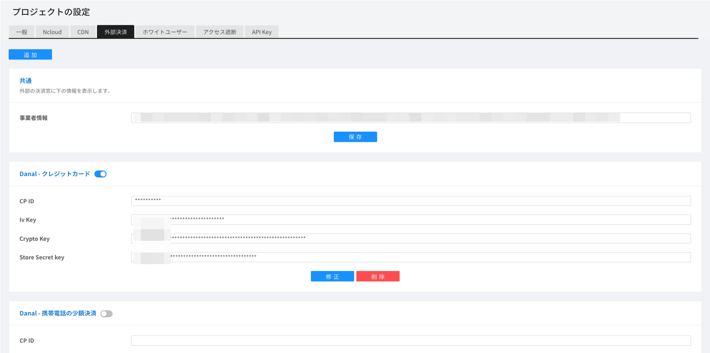

**\[料金入力\]**

決済 - IAPメニューでIn-Appアイテム別にユーザーが支払う料金を入力してください。

#### - ホワイトユーザー

登録したIPでアクセスする場合、指定された種類に応じて以下の機能が有効化します。

- 開発：SDKログが有効化し、ログが表示されます。
- 決済/クーポン：決済とクーポン使用の際には、Webhookテストで設定されたアドレスが呼び出されます。
- メンテナンス：メンテナンス機能が有効化していても無視して行われます。
- アップデート：アップデート機能が有効化していても無視して行われます。
- 会員：アクセス遮断対象に含まれている国またはIPを無視して行われます。

**追加**ボタンをクリックします。以下のようなポップアップ画面が表示されたらパラメータと値を入力します。

#### - アクセス遮断

Device ID、登録されたIP、国コードでアクセスするユーザーを遮断します。

**追加**ボタンをクリックします。以下のようなポップアップ画面が表示されたら該当値を入力します。

① 状態にチェックを入れると、アクセス遮断が有効化します。

② アクセス遮断対象の入力値の種類を指定します。

③ アクセス遮断対象を入力します。

④ 遮断対象のデバイス言語設定に応じて異なる言語で表示されるメッセージについて、基本言語を指定します。

⑤ デバイスの言語設定に応じて異なるメッセージを登録しておくことができます。

#### - API Key

Open APIを使用するための認証に用いられるキーを管理するメニューです。
[+追加]ボタンをクリックしてキーを作成し、Open APIを呼び出す際に作成したKey値をheaderにx-api-key値として入力します。
作成したKeyをクリックすると修正メニューが表示されます。Keyの状態、Keyの満了日、説明などを修正でき、Keyを削除することもできます。

## その他

### タスク管理

各メニューからcsvにエクスポートした結果を一ヶ月間ダウンロードできます。

### ログ

ログは、NAVER CLOUD PLATFORMのELSAと連携してゲーム内のログやクラッシュログなどを収集できる機能です。ELSAを利用するには、[ELSA利用ガイド](https://docs.ncloud.com/ko/elsa/elsa-1-1.html)を参考にしてください。

### ユーザーガイド

GAMEPOTダッシュボードの利用ガイドページに移動します。

### 言語変更

ダッシュボードの各メニューなどが選択した言語に変更されます。

### 会員情報修正

ダッシュボード利用アカウント名、パスワードを変更できます。

ダッシュボードの右上のアイコンをクリックすると表示されるドロップダウンメニューの中から、会員情報の変更を選択できます。

① ユーザー名を変更できます。

② ダッシュボードの基準時間帯を設定します。

③ 問い合わせの翻訳機能を使用する際に、結果として表示されるターゲット言語を選択します。

④ 問い合わせの翻訳機能を使用する際に、問い合わせ内容の言語を自動検出するかどうかを設定します。

⑤ 問い合わせの翻訳機能を使用する際に、問い合わせ内容を自動翻訳するかどうかを設定します。

⑥ パスワードを変更できます。

### 環境設定

GAMEPOTのダッシュボードを管理するためのユーザー管理、ロール管理、アップデート機能などがあります。

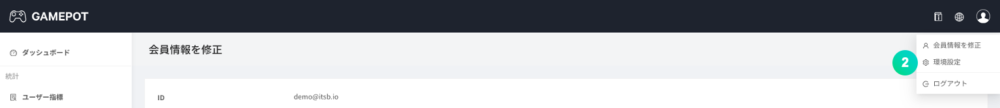

#### - ユーザー

ダッシュボードを利用できるユーザーを管理するメニューであり、ユーザーを追加/削除できます。

① 状態にチェックを入れると、そのユーザーが有効化します。

**登録**ボタンをクリックします。以下のようなポップアップ画面が表示されたら該当値を入力します。

① 登録するユーザーIDです。メール形式のみ使用できます。

② 登録するユーザー名です。

③ 登録するユーザーパスワードです。

④ ユーザーダッシュボードの基準時間帯を設定します。

⑤ サポートセンターの翻訳機能を使用する場合のターゲット言語を選択します。

⑥ サポートセンターの翻訳機能を使用する場合、問い合わせ内容の言語を自動検出するかどうかを選択します。

⑦ サポートセンターの翻訳機能を使用する場合、問い合わせ内容を自動翻訳するかどうかを選択します。

#### - ロール

ダッシュボードを利用できるユーザーをグループ単位で管理する機能であり、各ロールごとに異なる権限を付与できます。

**歯車**ボタンをクリックします。以下のような画面で当該ロールの設定ができます。

① 当該ロールに加えるユーザーを位置させます。

② 基本ロールに加えるユーザーを位置させます。基本ロールの場合、すべての権限を持っています。

③ 当該ロールに許可する機能を選択します。

#### - アップデート

GAMEPOTシステムのアップデート履歴を確認できます。

