---
search:
  keyword: ["gamepot"]
---

NAVER CLOUD PLATFORM の GAMEPOT から提供するダッシュボードに関するガイドです。

## GAMEPOT ダッシュボードのご紹介

**Q. ダッシュボードとは？**

ダッシュボードはゲームの運営、管理に必要な機能を提供します。

ダッシュボードでは会員アクセスの統計及び決済に関する統計を確認でき、NAVER CLOUD PLATFORM のサービスと連動して PUSH, SMS,ログ分析など多様な機能を制御できます。また、クーポンやアップデートなどゲーム運営に必要な機能を提供してより効率的なゲーム管理ができます。

## GAMEPOT ダッシュボードをスタートする

### ログイン

#### Step 1. ダッシュボードにアクセス

NAVER CLOUD PLATFORM のコンソールでダッシュボード URL をクリックしてダッシュボードにアクセスします。

#### STEP 2. 会員登録

プロジェクト生成の際に登録した管理者アカウントにパスワード初期化のメールが送信されます。

#### STEP 3. ログイン

管理者アカウントがダッシュボード管理の全ての権限を有するマスターアカウントになります。

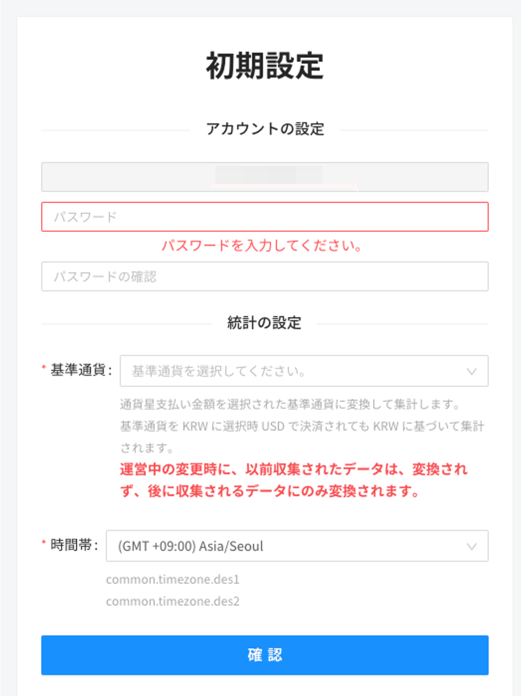

## ダッシュボードメニューを活用する

### ダッシュボード

ダッシュボードでは登録の現況、売り上げ、アクセス、統計などのゲームの全般的な運営状況を一目に把握できます。

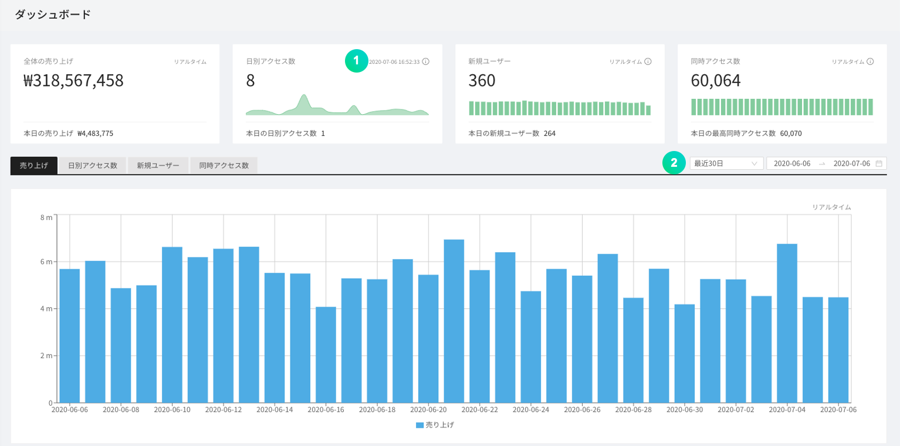

① 通貨を選択して各通貨に対する全体の売り上げを確認できます。

② 通貨を選択して各通貨に対する売り上げグラフを確認できます。

## 統計

### ユーザー指標

指定された期間の間の各種ユーザー指標をグラフで表示します。

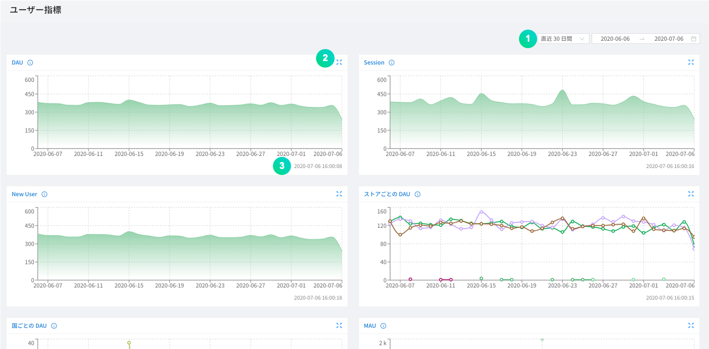

① 基本的には当日基準で 30 日間のユーザー指標を出力し、期間を指定して自由に選択した期間の間のユーザー指標を照会できます。

② 各グラフを拡大して詳細な情報を確認できます。

① 現在表示されるグラフの RAW データを CSV ファイルの形態にダウンロードできます。

### 売り上げ指標

指定された期間の間の各種売り上げ指標をグラフで表示します。

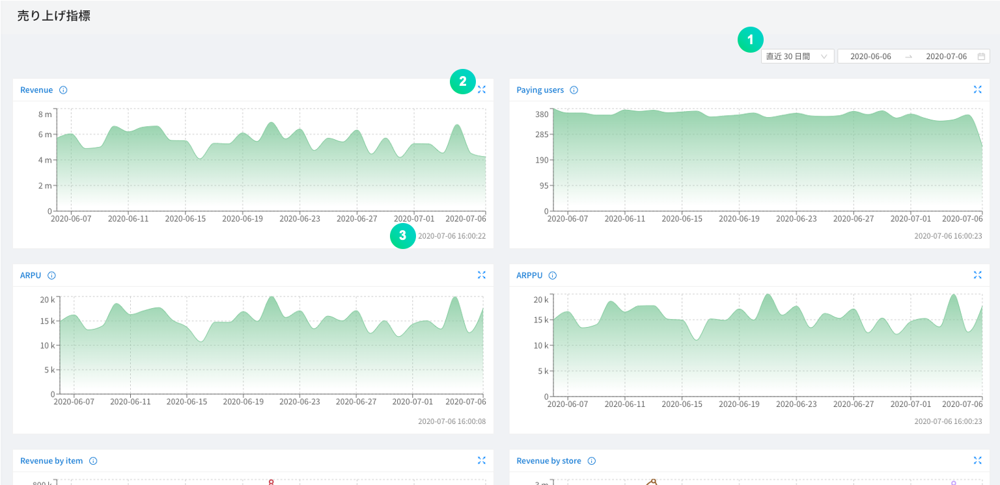

① 基本的には当日基準で 30 日間の売り上げ指標を出力し、期間を指定して自由に選択した期間の間の売り上げ指標を照会できます。

② 各グラフを拡大して詳細情報を確認できます。

① 現在表示されるグラフの RAW データを CSV ファイルの形態にダウンロードできます。

## 運営

### 会員

#### リスト

登録した会員リストが表示されます。

① 登録日の範囲を指定して、特定期間の間に登録した会員を照会できます。

② ユーザー ID または IP を指定して、特定会員を照会できます。

③ 会員リストを CSV ファイル形式にダウンロードできます。

④ ユーザー ID をクリックすると以下のような詳細ページが表示されます。

① 会員に関する基本情報を表示します。

② ゲームにアクセスした(ログイン)内訳を表示します。

③ 会員がゲームで決済した内訳を表示します。

④ 会員が登録したお問い合わせとそれに対する回答の内訳が表示されます。

⑤ 会員が連動したソーシャルアカウントを全て表示します。

- ソーシャルアカウントを追加したり接続を取り消しできます。

#### 日別アクセス者

指定した期間の間の日別アクセス者数をグラフで表示します。

基本的には当日基準で 30 日間の日別アクセス者数を出力し、期間指定を通じて自由に選択した期間の間の日別アクセス者数を照会できます。

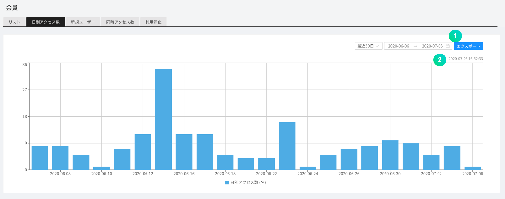

① 現在表示されるグラフの RAW データを CSV ファイルの形態にダウンロードできます。

#### 新規ユーザー

指定された期間の間にゲームに登録した日別新規登録者数をグラフで表示します。

基本的には当日基準で 30 日間の日別新規登録者数を出力し、期間を指定して自由に選択した期間の間の日別新規登録者数を照会できます。

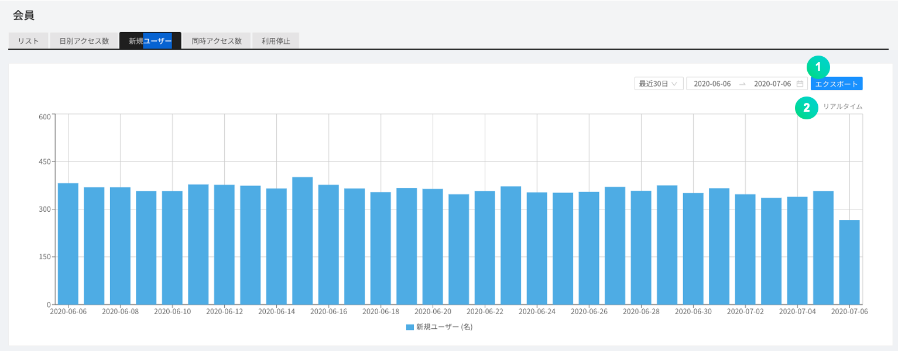

① 現在表示されるグラフの RAW データを CSV ファイルの形態にダウンロードできます。

#### 同時アクセス者

ゲームにアクセスした会員数を 1 分単位で、最大 3 日間について同時に照会できます。

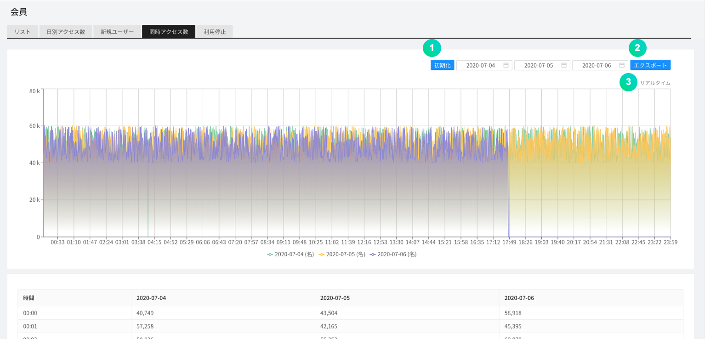

① 選択した(3 つの)日別同時アクセス者数を 1 分単位のグラフで表示します。

② 当日と前日、前々日が基本的に指定されており、照会しようとする最大 3 つの日付を選択(変更)できます。初期化ボタンを利用して基本指定日に戻ることができます。

③ 指定した 1 日について、1 分単位の同時アクセス者数を表で表します。

#### 利用停止

特定会員について、指定された期間の間にゲームにアクセスできないようにします。

利用停止は会員のユーザー ID を基準に適用されます。

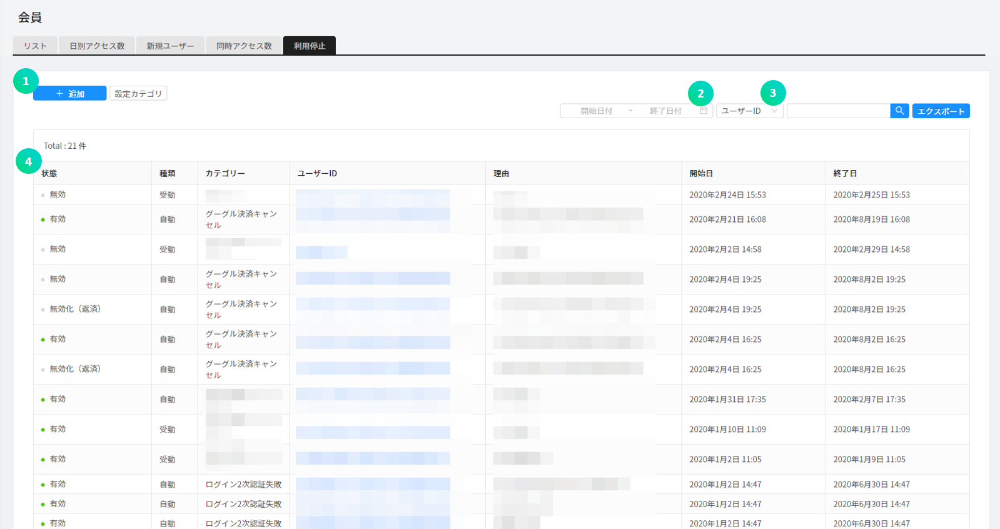

① 利用停止を適用するため、追加ボタンを利用します。

② 特定の期間について、利用停止記録を照会できます。

③ 特定ユーザー ID について、利用停止内訳を照会できます。

④ 利用停止会員の内訳が出力されます。

- 有効：現在利用停止状態が適用された場合
- 無効：現在利用停止状態が解除された場合

### 決済

#### 決済リスト

会員が Google Play store, APPSTORE, ONE Store で決済を試みた内訳を確認できます。

① 通貨を選択して各通貨ごとに決済リストを確認できます。

② 成功した決済について決済取り消しをすることができます。決済を取り消す場合は売り上げ統計から除外されます。

③ 会員が試みた決済の成功可否を照会できます。失敗した決済の試みについてはアイテムを再支給できます。

④ それぞれの決済内訳の中、決済取り消しの内訳を確認できます。

- Y: 決済の取り消し状態
- N: 決済の未取り消し状態

決済状態をクリックして試みた決済に関する詳細な内訳を確認でき、失敗した決済については再支給ボタンを利用してアイテムを再支給できます。

#### IAP

In-App 購入の際に商品情報を管理する機能です。グーグルプレイ、アップストア、ワンストアなどの商品を全て登録する必要があります。

① **In-App アイテムを追加** 버ボタンをクリックするとストア、商品名、商品 ID を入力して有料アイテムを生成できます。

② **大量入力** ボタンをクリックすると In-App 商品を CSV ファイルに一度に登録できます。

#### 統計

日別単位で決済金額データをグラフで表示する機能です。

① ストアを指定してグラフを確認できます。

② 通貨を指定してグラフを確認できます。

③ 期間を指定してグラフを確認できます。

#### グーグル決済の取り消し

一定時間ごとに Google console の決済領収書の状態と比較して

正常決済の件について会員が任意で決済を取り消した場合を知らせてくれます。

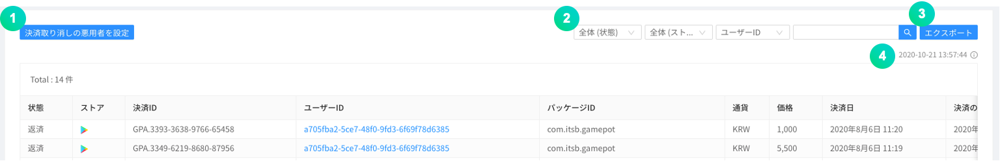

① 任意でグーグル決済を取り消す会員のゲームアクセスについて、一定の条件を設定して利用停止措置をすることができます。

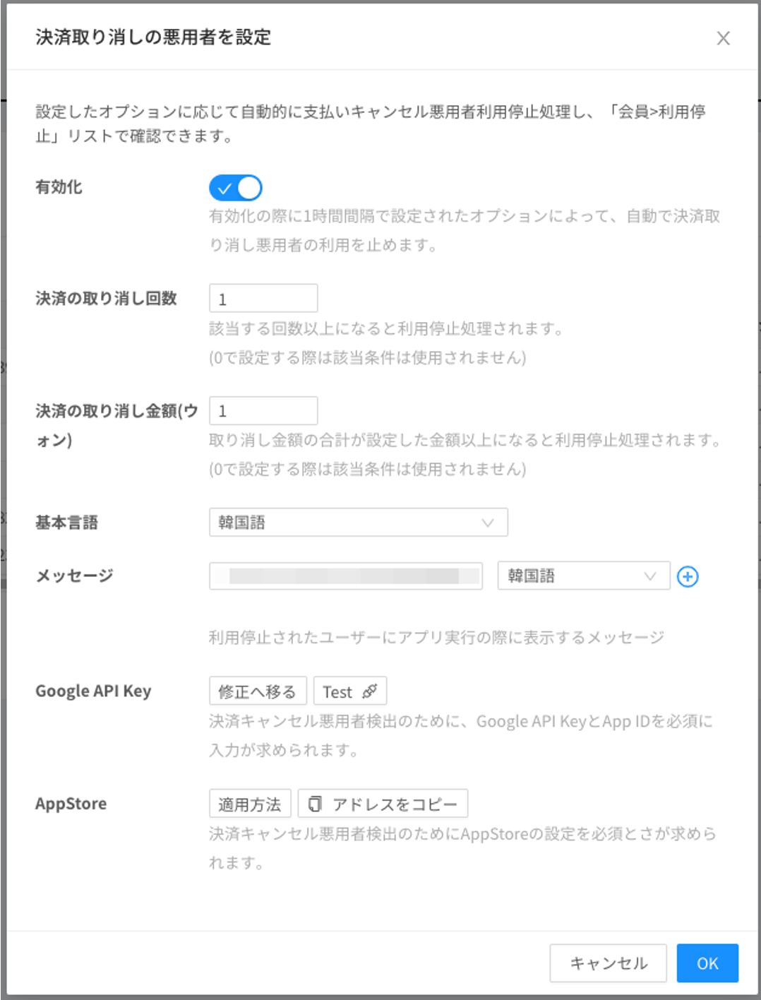

① 会員が任意で決済取り消しを悪用した部分について停止可否を決められます。有効化の際は 1 時間間隔で設定したオプションによって自動で決済取り消し悪用者を利用停止させます。

② 会員が任意で決済の取り消しをした合計回数が設定した回数以上になった場合、ゲームの利用が停止されます。

③ 会員が任意で決済を取り消した商品の合計が設定された価格以上の場合はゲームの利用が停止されます。

④ ゲーム利用が停止された会員がゲームへのアクセスを試みた場合に表示される案内メッセージです。

⑤ グーグルの決済取り消しリストを受け取るためにグーグル API key を入力します。

### 案内事項

ダッシュボードに登録された案内事項のイメージはゲームにアクセスした会員に表示されます。表示される日程及びストアを指定すると当該条件に合わせて案内事項が表示され、日程終了後は表示されません。

案内事項機能を使用するためには、まず NAVER CLOUD PLATFORM の API 認証キーと Object Storage サービスが必要です。案内事項機能を利用の際は Object Storage のコストが別途生じます。

#### Step 1. API 認証キーの準備

案内事項メニューは API を通じて Object Storage を連動して使用します。従って NAVER CLOUD PLATFORM の API 認証キーを事前に準備してください。

API 認証キーは**ポータル > マイページ > アカウント管理 > 認証キー管理** メニューから生成できます。

① API 認証キーを生成するために**新規 API 認証キーを生成**をクリックしてください。

- API 認証キーはアカウント当たり 2 個まで生成できます。

#### Step 2.ダッシュボードと API 認証キーを連動する

発行された認証キーをダッシュボードと連動すると Object Storage のバケットが生成されて案内事項機能を使えるようになります。ダッシュボードの**プロジェクトを設定 > Ncloud** メニューへ移動して API 認証キーに接続します。

API 認証キーが接続されたら Object Storage のバケットが自動で生成されます。案内事項に使われた全てのイメージは当該バケットに保存されます。

#### Step 3. 案内事項の追加

案内事項を追加する際は **案内事項**メニューへ移動します。

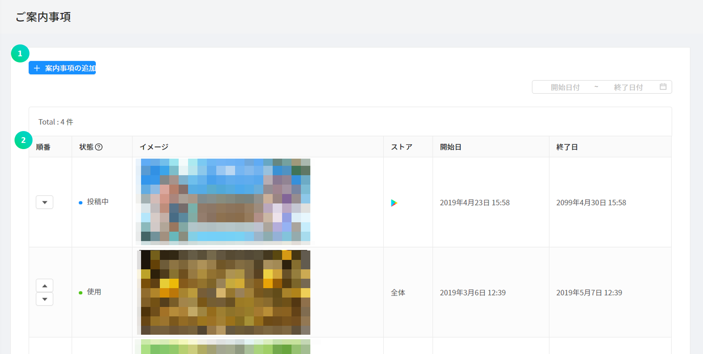

① **案内事項を追加**ボタンを通じてイメージを追加できます。

② ユーザーに表示するイメージの順番を指定できます。

次に以下のようなポップアップメニューが表示されたら必要な値を入力して **保存** ボタンをクリックすると案内事項が追加されます。

① 当該案内事項の有効化可否を選択します。

② 表示する案内事項の開始日と終了日を指定します。

③ 選択したストアの分類に沿って全てのストアの当該アプリに案内事項が表示されたり、特定のストアを通じてゲームにアクセスしたユーザーにのみ案内事項が表示されるように指定できます。

④ 表示された案内事項のイメージをユーザーがタッチすると URL は外部ブラウザに移動し、SCHEME は callback 関数で値をリターンします。

⑤ 各言語設定によって表示される案内事項のイメージの中から基本言語を指定します。

⑥ 表示される案内事項のイメージをマウスで引っ張てくるか、直接ファイルを選択できます。

言語の設定別に表示するそれぞれ異なるイメージを追加登録できます。

### メンテナンス及びアップデート

メンテナンス及びアップデート機能を利用してより簡単で便利にゲームを管理できます。

#### メンテナンス

ゲームのメンテナンス時間に自動でメンテナンスメッセージと共にゲームへのアクセスを遮断します。

メンテナンス時間とメッセージを入力した後に保存するとゲーム内のメンテナンスに関する案内が表示されます。

① ストアを指定できます。全体メンテナンスの場合は全体のストアを指定してください。

② メンテナンス開始時間と終了時間を指定してください。

③ デバイス言語の設定によって異なる形で表示されるメンテナンスメッセージの中、基本言語を指定します。

④ 言語の設定別に異なる形で表示されるメッセージを追加で登録できます。

⑤ URL はメンテナンスの際に詳しくみるをクリックすると移動するアドレスを入力してください。

**例: カフェのご案内事項や独自に作成したメンテナンス案内ページ**

#### アップデート

最新バージョンではない場合はアップデートのご案内を表示してグーグルプレイやアップストアのようなストアのアップデート画面へ移動します。

① ストア別に設定します。

② 機能の有効化可否を選択します。

③ **強制**を選択した場合ストアでアップデートする前までゲームを利用できず、 **お勧め**を選択した場合ストアでアップデートをしなくてもゲームを利用できます。

④ バージョン情報を入力します。入力されたバージョンと異なったり低い場合は機能が作動します。

### メッセージ

別のメッセージサーバの構築なしに SMS, PUSH などを通じてメッセージ通知機能を実装できるサービスです。当該機能を使うためには NAVER Cloud Plaform の Simple & Easy Notification Service(SENS)を申込む必要があります。

① SENS と連動するためにはまずサービスキーを発行します。 **サービスキーの発行** ボタンをクリックして [SENS 共通ガイド](../sens/sens-1-2.md)を参考にしてサービスキーを発行します。

② **証明書登録ガイド** ボタンをクリックして **SENS ウェブコンソール使用ガイド**に沿って証明書を登録します。

③ **設定** ボタンをクリックして以下の画面に移動して PUSH サービス ID の値を入力します。

#### プッシュメッセージ

**メッセージ> プッシュメッセージ** メニューをクリックすると送信状態、予約時間、送信時間などを確認できるリスト画面が表示されます。

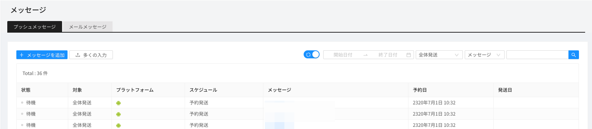

**プッシュメッセージ** メニューから **+メッセージを追加** ボタンをクリックすると以下のようなポップアップが表示されます。当該ポップアップメニューからメッセージを送信できます。

① プッシュメッセージの送信スケジュールを指定できます。(今すぐ送信/予約送信/予約送信(グローバル現地時間))

② プラットフォームを指定して、指定されたプラットフォームユーザーのみプッシュを受けられます。

③ デバイスの言語設定によって異なる形で送信されるプッシュメッセージの中、基本言語を指定します。

④ タイトルを必要に応じて入力できます。未入力の際はアプリ名でタイトルが表示されます。

⑤ デバイスの言語設定によって異なるプッシュメッセージを登録できます。

#### SMS/LMS メッセージ

SMS/LMS の発送、履歴及び結果の照会などの機能を使用できます。SMS/LMS を発送するためにはまず NAVER CLOUD PLATFORM の SENS でサービスキーの発行と発信番号を登録する必要があります。

① SENS と連動するためにはまずサービスキーの発行と発信番号の登録が必要です。**サービスキーの発行**ボタンをクリックして [SENS 共通ガイド](../sens/sens-1-2.md)と [SENS SMS 使用ガイド](../sens/sens-1-3.md)を参考にしてサービスキーの発行と発信番号を登録します。

② **設定** ボタンをクリックしてサービス ID と Secret Key を入力してください。

**メッセージを追加**ボタンをクリックします。以下のようなポップアップが表示されます。

① SMS は短文メッセージ、LMS は長文メッセージです。メッセージの種類によって価格が異なります。

② NAVER クラウドコンソールに登録された発信番号を入力してください。(登録されていない番号は送信されません。)

③ SMS, LMS で送信される受信番号を入力できます。

④ SMS, LMS の受信番号/クーポン乱数番号などが多量の場合は、CSV 形式のファイルで構成でき、これに対するサンプルファイルをダウンロードできます。

⑤ SMS, LMS の受信番号/クーポン乱数番号などが多量の場合は、 CSV 形式のファイルに構成してアプロードできます。アップロードされた SMS,LMS の受信番号及びクーポン乱数番号は ⑥ のメッセージ内容の中、指定された項目にマッチングされて自動で入力されて SMS, LMS で発送されます。

⑥ SMS, LMSSMS, LMS で発送されるメッセージ内容を入力してください。

⑦ 予約時間を指定すると指定された時間にメッセージが送信されます。

### クーポン

ゲーム内に必須で使われるクーポン機能は一般クーポン、キーワードクーポンをサポートします。

#### 一般クーポン

一般クーポンは一般的にコード形式になっているクーポンです。ゲーム内で使われるクーポンを簡単に生成及び管理できます。. **+クーポンを生成**をクリックすると以下のようなポップアップが表示され、これを通じてクーポンを生成できます。

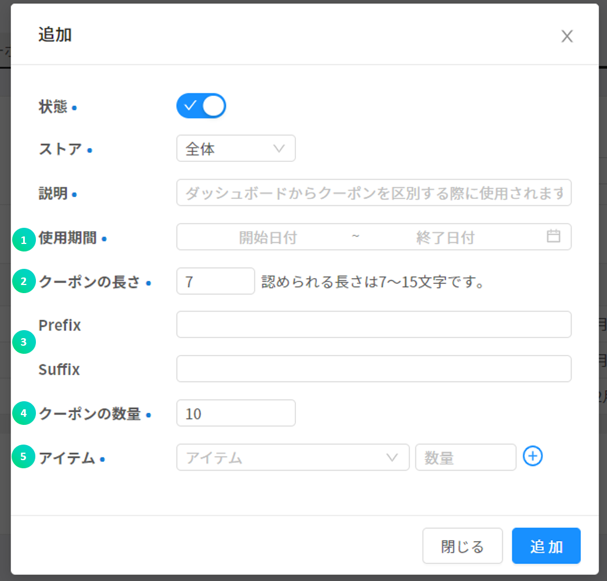

① 使用期間を指定して当該期間以外にはクーポンが使えないようにします。

② クーポンの長さによって作成できるクーポンに制限があります。8~10 桁の間で生成します。

③ Prefix(接頭辞), Suffix(接尾辞)を指定した場合はクーポン生成の際に指定された文が付きます。

④ クーポンの数量は最大 10 万個生成でき、生成後に増やすことができます。(最大クーポン数は 50 万個です。)

⑤ クーポン使用の際に支給されるアイテムとアイテムの数量を指定できます。**+** ボタンをクリックして複数のアイテムを支給できます。

クーポン生成が完了したら生成されたクーポンリストが以下のように表示されます。

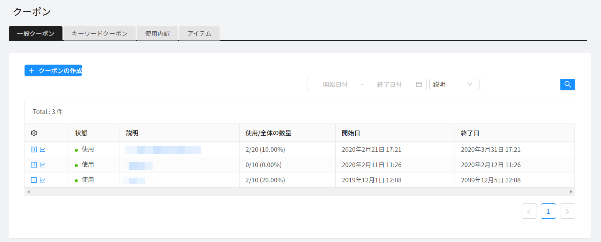

クーポンの現在の状態と使用量の制限数量などを確認できます。

リストで以前生成されたクーポン数量を変更できるので簡単にクーポンの数量を増やせます。

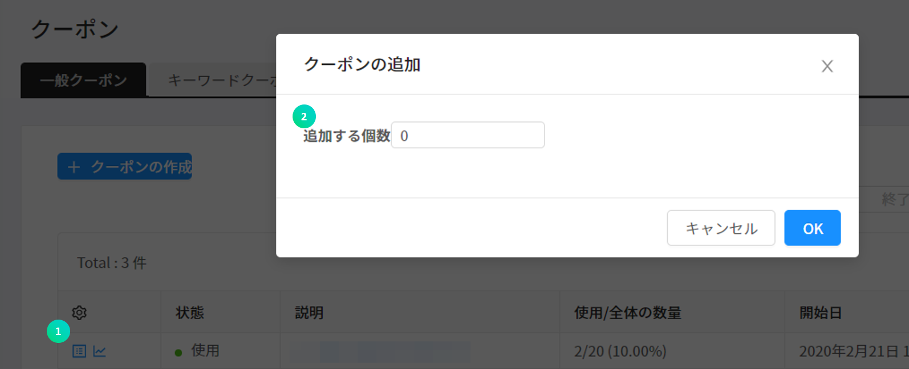

① リストで一番前の青色のアイコンをクリックするとクーポンの追加ポップアップが表示されます。

② ポップアップされた設定ウィンドウから追加個数を入力してクーポンを追加します。

#### キーワードクーポン

’クリスマス’、’オープンイベント’、’新年’のように指定されたキーワードを生成して当該キーワードをクーポンウィンドウに入力する際にアイテムを支給する機能です。最近はクーポンコードの入力が複雑であるため、ゲームユーザーの便宜のためキーワードクーポンが多く活用されています。

**+クーポンを生成**をクリックします。

① クーポンの使用可能な期間を指定します。

② クーポンを支給するキーワードを入力します。

③ 制限数量を超過せずに支給できます。

④ クーポン使用の際に支給されるアイテムとアイテムの数量を指定できます。**+** ボタンをクリックして複数のアイテムを支給できます。

#### 使用内訳

発行されたクーポン番号の全体を照会できます。

① 期間、クーポン番号、ユーザー ID などで指定してクーポンの使用可否を検索できます。

② 発行されたクーポンについて使用可否を確認できます。

- 成功：クーポン使用の完了状態
- 失敗：クーポン使用の失敗状態
- 未使用：クーポン未使用状態

#### アイテム

アイテムメニューではクーポンを通じて獲得できるクーポンアイテムを生成できるメニューです。 **アイテムを追加**ボタンをクリックしてアイテムを追加できます。

① アイテムを追加できます。

② **大量入力**ボタンをクリックするとアイテムを CSV ファイルに一度に登録できます。

① アイテム名を入力します。

② アイテム ID を入力します。アイテム ID はアイテムごとに固有でなければなりません。

### お客様サポート

顧客がゲーム内でお問い合わせを残した場合、照会して回答できる機能です。ゲーム内のお客様サポートウィンドウから基本情報を入力できるようになっている場合、GAMEPOT でも当該情報を確認できます。

#### お客様問い合わせ

顧客が問い合わせた内訳を確認できます。

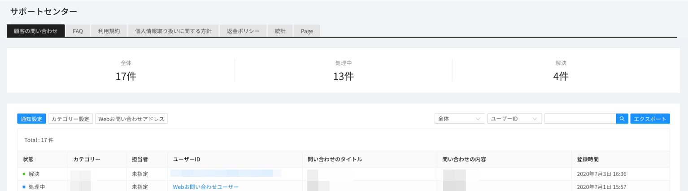

**会員 ID**をクリックします。

① 問い合わせた顧客の情報を確認できます。(回答満足度は問い合せ終了後に顧客が満足度を選択すると表示されます。)

② 問い合わせについて回答できます。

③ 回答に必要なイメージ及びテキストファイルをアップロードできます。

④ 顧客と問い合わせ/回答した内訳です。チャット形式でそれまでの全ての内容を確認できます。

⑤ 当該会員に関する全ての情報を基本として表示します。

##### [分類の設定]

お客様の問い合わせに関するテンプレートを予め設定しておく機能です。

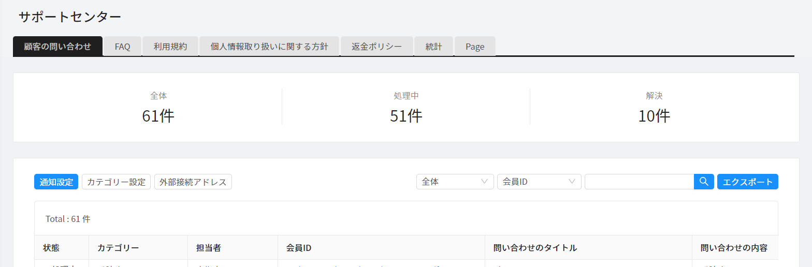

**分類の設定**をクリックします。

**分類を追加**からお客様問い合わせに関する分類名を追加して管理できます。

① 状態をチェックすると当該分類名が有効化されます。

② デバイスの言語設定によって異なる形で表示されるお客様問い合わせの分類名で基本言語を指定します。

③ デバイスの言語設定によって異なる分類名とテンプレートを指定しておくことができます。

④ 指定した言語の分類名と当該分類のお客様問い合わせに関するテンプレートを入力します。

##### [プッシュ設定]

顧客に回答する場合、顧客にプッシュを送信する機能です。

**プッシュ設定**をクリックします。

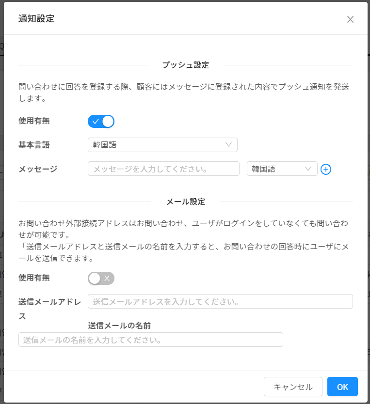

① 使用可否をチェックすると機能が作動します。

② 顧客に送信するプッシュメッセージです。

#### FAQ

FAQ の内訳を登録して確認できます。

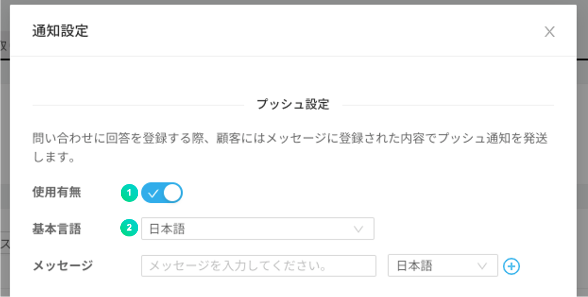

**追加**をクリックします。

① 状態をチェックすると当該質問が有効化されて確認できます。

② FAQ の分類名を選択できます。

③ デバイスの言語設定によって異なる形で表示される FAQ 項目から基本言語を指定します。

④ デバイスの言語設定によって異なる質問と回答を登録しておくことができます。

⑤ 質問とこれに対する回答を入力します。

##### [分類設定]

FAQ の分類を設定しておく機能です。

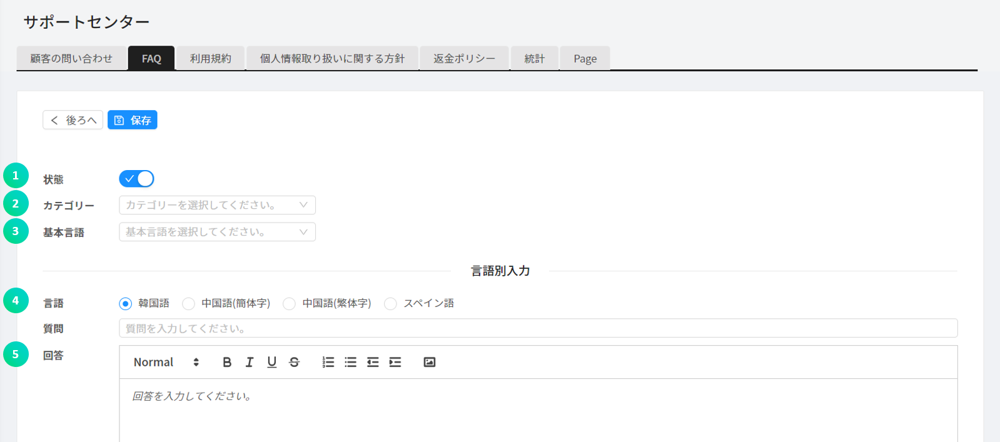

**分類設定**をクリックします。

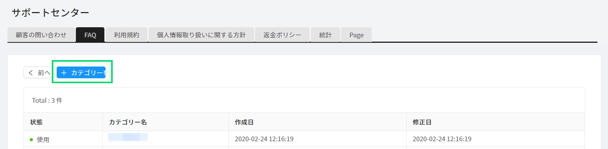

**分類を追加**でお客様問い合わせに関する分類名を追加して管理できます。

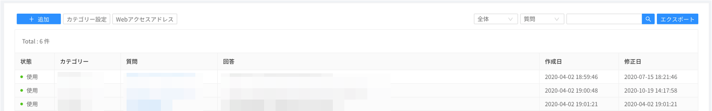

① 状態をチェックすると当該分類名が有効化されます。

② デバイスの言語設定によって異なる形で表示される FAQ 分類名から基本言語を指定します。

③ デバイスの言語設定によって異なる FAQ 分類名を指定しておくことができます。

④ 指定した言語の分類名を入力します。

#### 利用約款の設定

社内の利用約款を入力できます。この内容は SDK を通じてユーザーに表示することができます。

① デバイスの言語設定によって異なる形で表示される利用約款の内容で基本言語を指定します。

② デバイスの言語設定ごとに異なる利用約款の内容を入力できます。

③ 指定した言語に対する利用約款の内容を入力します。

#### 個人情報の取り扱いに関する方針の設定

社内の個人情報の取り扱いに関する方針内容を入力できます。この内容は SDK を通じてユーザーに表示できます。

① デバイスの言語設定によって異なる形で表示される個人情報の取り扱いに関する方針内容で基本言語を指定します。

② デバイスの言語設定ごとに異なる個人情報取り扱いに関する方針内容を入力できます。

③ 指定した言語に関する個人情報と取り扱いに関する方針の内容を入力します。

#### 統計

一定期間に対するお客様問い合わせの統計を確認できます。

### 事前予約

事前予約機能は事前予約のウェブページを通じて登録したユーザーの統計を表示してくれる機能です。

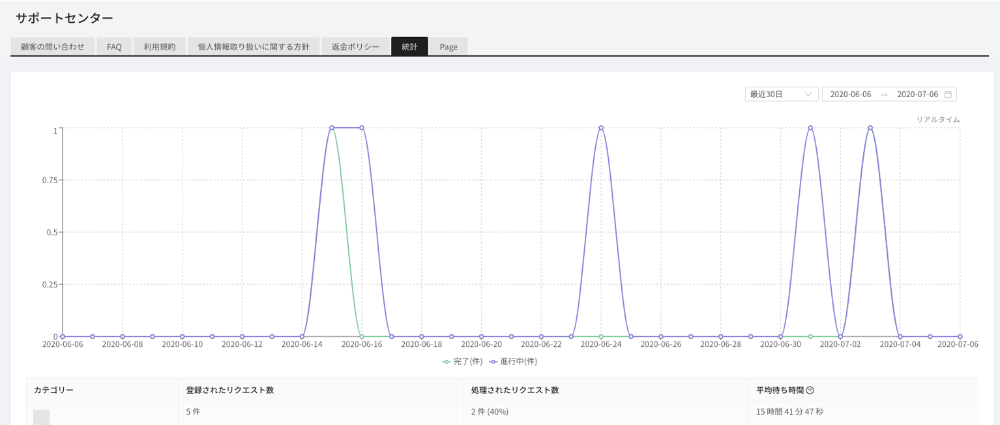

① 事前予約を追加できます。事前予約名は統計算出のための ID として活用されます。

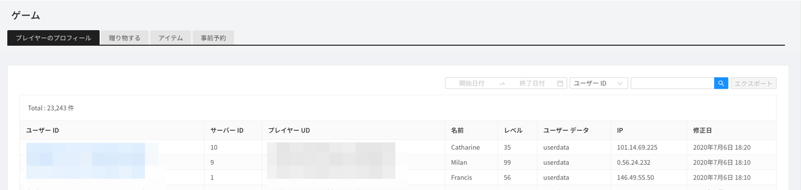

② 事前予約名を修正できます。

③ 事前予約の申込み者をダウンロードできます。

今後事前予約者に大量の SMS 送信ができるように機能を追加する予定です。

## 設定

### 遠隔構成

遠隔構成機能はアプリをアップデートせずにアプリの動作と形を変更できるようにする機能です。サーバに媒介変数を追加して当該値を GAMEPOT SDK で呼び出して使用できます。従って、ゲーム内の機能をサーバで制御しようとする場合はこの機能を利用すると簡単に適用及び制御できます。

**追加** ボタンをクリックします。以下のようなポップアップウィンドウが表示されたら、媒介変数と値を入力します。

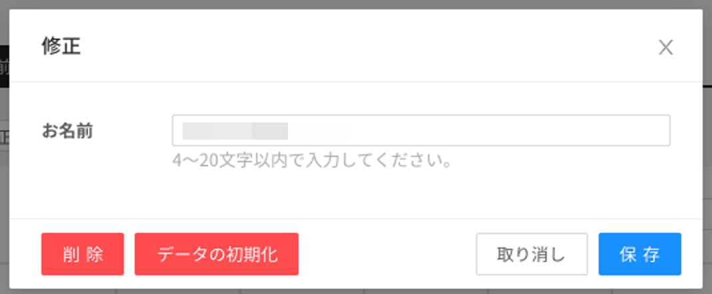

当該媒介変数と値が反映される時点は新たにアプリを実行するユーザーから反映されます。

### プロジェクトの設定

#### 一般

アプリの全般的な環境を設定してアプリを運営するための多様なキー値を入力できます。

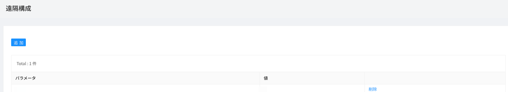

① ゲーム名を記入します。

② アプリケーションタイプを選択できます。

③ カテゴリーを選択できます。

④ ハッシュキーを入力できます。

⑤ 使用言語を選択できます。

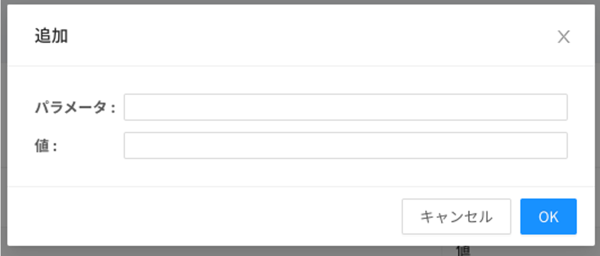

グーグルストアとワンストアと連動するため設定する項目です。

① グーグルストアの Public key 値を入力します。

② グーグルストアで同じゲームを 2 つのバージョンでリリースする場合(例えば、12 歳、18 歳)、パッケージ名を前に入れて後ろに Public key 値を入れます。

③ ワンストアの Public key 値を入力します。

④ ワンストアで同じゲームを 2 つのバージョンでリリースする場合(例えば、12 歳、18 歳)、パッケージ名を前に入れて後ろに Public key 値を入れます。

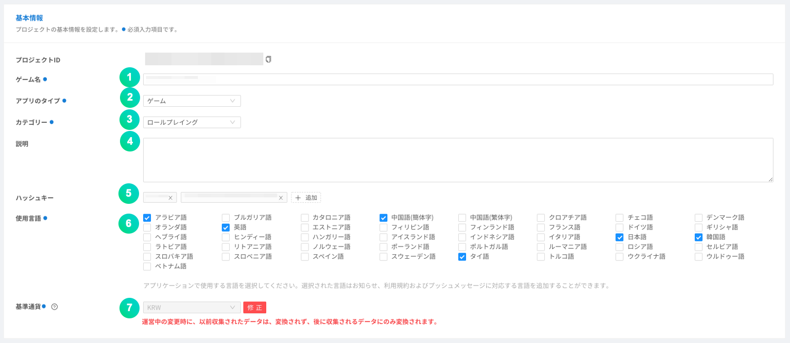

グーグル API 連動(グーグルストア決済取り消し者リストの確認及び最新バージョンの決済領収証の検証)に必要な設定項目です。

1. グーグルから提供する JSON データを入力します。’ヘルプをみる’をご参照ください。
2. 決済の領収証の検証バージョンです。1 番項目にデータを入力したら 'Version 3'を選択してください。

① グーグルストア ID を入力します。

② ワンストア ID を入力します。

③ アップストア ID を入力します。

ワンストアで In-App 決済をしてアイテムの支給をリクエストするために事前に設定すべき情報です。

① ワンストアのライセンスキーを入力します。

② 2 つのバージョンでリリースする場合、異なるバージョンのライセンスキーを入力します。(2 つのバージョンではない場合は入力しなくて結構です。)

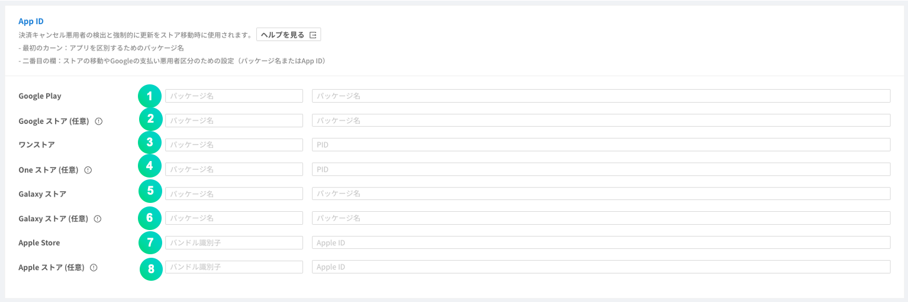

Auth Key 項目はグーグル、フェイスブックログインの際にトックンの検証に使われ、トックン検証に失敗した際はゲームユーザーのログインを制限します。ログインが制限されたゲームユーザーは利用停止メニューに自動で登録されます。

① グーグルの Client ID 値を入力します。

② フェイスブックの App ID を入力します。

③ フェイスブックの App Secret Key 値を入力します。

WebHook 項目の決済アイテムは決済成功の際にアイテム支給をリクエストするアドレスを入力します。

クーポンアイテムは SDK を利用してクーポン使用成功の際に SDK サーバでデベロッパー社のサーバに成功に対する処理(アイテムの支給)をリクエストするアドレスであり
実際のサービスに利用されるアドレス(サービス)とサービス中にテスト環境が必要な場合のアドレス(テストユーザー)が提供されます。
テストユーザーアドレスで作動するようにするためには’プロジェクト設定＞テストユーザー’に追加する必要があります。

① 決済アイテムのサービス用 URL を入力します。

② 決済アイテムのテストユーザー用 URL を入力します。

③ クーポンアイテムのサービス用 URL を入力します。

④ クーポンアイテムのテストユーザー用 URL を入力します。

#### Ncloud

NAVER クラウドプラットフォームと連動させるためのキー値を追加変更できます。
詳しい使用法は緑色のボックス部分をクリックしてユーザーガイドを参照。

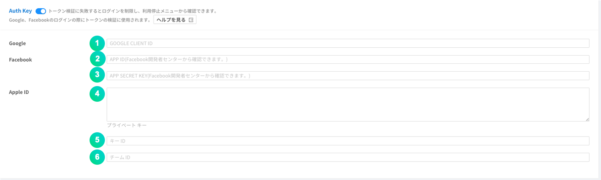

#### CDN

CDN を利用しようとする場合は以下の CDN アドレスを入力してください。

**CDN アドレス入力の際の注意事項**

- CDN の原本は必ず[案内事項]機能に使われる Object Storage が設定されていなければなりません。
- 入力した CDN がなかったり URL の誤字、または原本設定が誤った場合、アップロードされたイメージがゲーム上で正常に表示されなくなります。

#### 外部決済

ワンストアの場合、基本ストア決済モジュールではない第 3 の決済モジュールを許可しています。

サポートしている PG 社はダナルであり、継続的に追加される見込みです。

##### [設定]

決済手段別に必要な値はダナルを通じて取得し、**Store Secret key**ではワンストはコンソールの **Client secret**値を入力します。

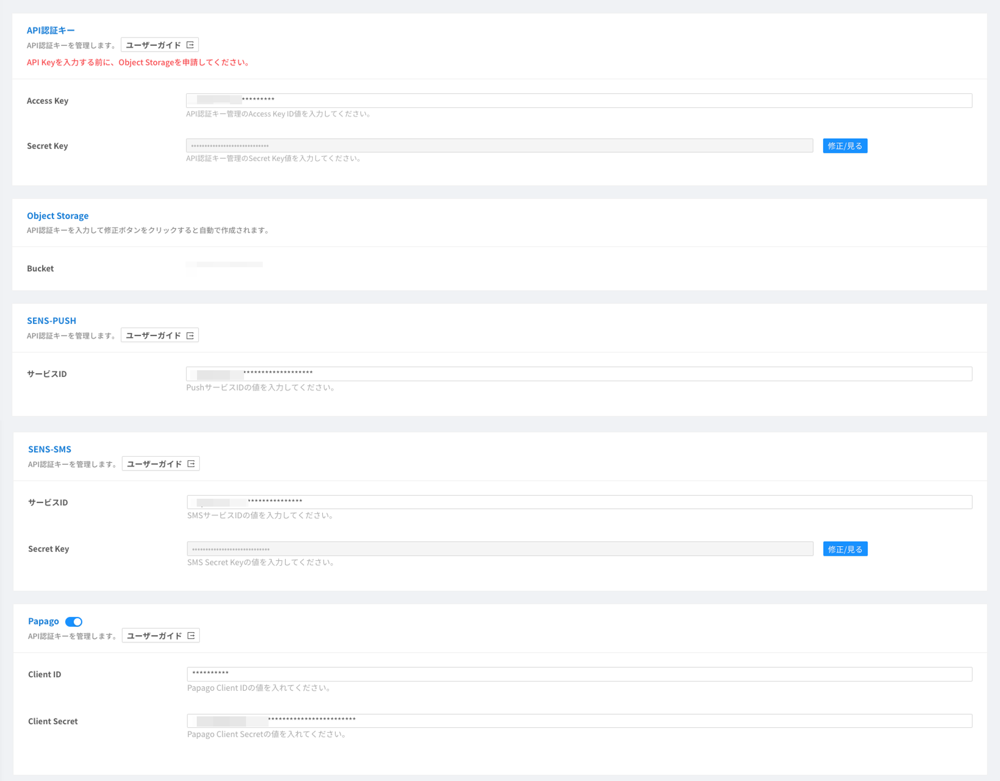

##### [価格入力]

決済 - IAP メニューで In-App アイテム別にユーザーが支払う価格を入力します。

#### ホワイトユーザー

登録された IP でアクセスする場合、指定された種類によって以下の機能が有効化されます。

- 開発：SDK ログが有効化されてログが表示されます。
- メンテナンス：メンテナンス機能が有効化されているとしても無視して進みます。
- アップデート：アップデート機能が有効化されているとしても無視して進みます。

**追加** ボタンをクリックします。以下のようなポップアップウィンドウが表示されたら、媒介変数と値を入力します。

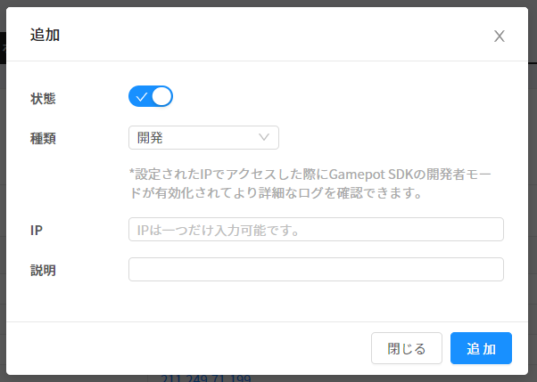

#### アクセス遮断

登録された IP、国コードでアクセスするユーザーを遮断します。

**追加** ボタンをクリックします。以下のようなポップアップウィンドウが表示されたら、該当する値を入力します。

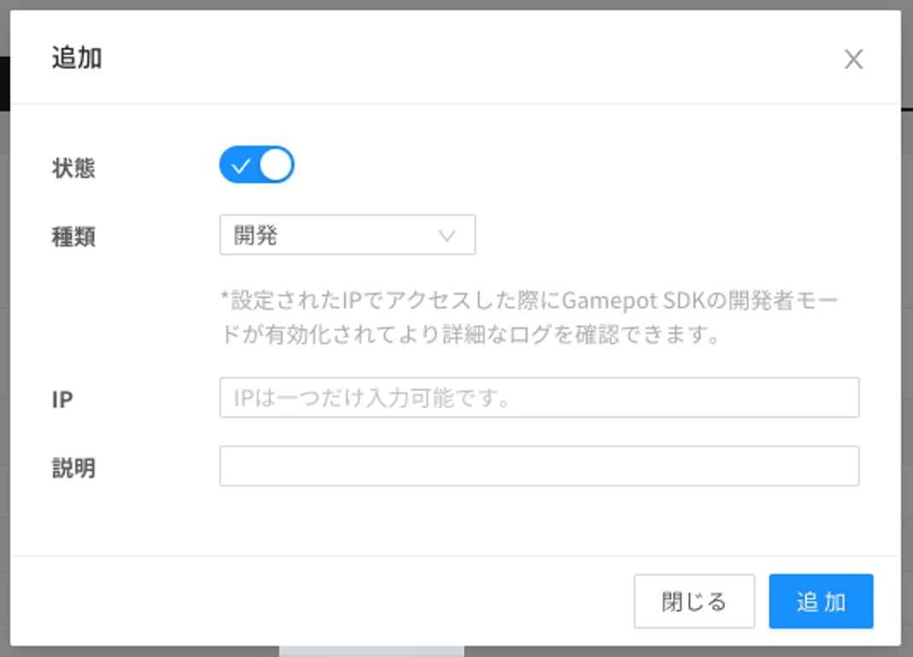

① 状態をチェックするとアクセス遮断が有効化されます。

② アクセスを遮断する対象の入力値の種類を指定します。

③ アクセスを遮断する対象を入力します。

④ 遮断対象のデバイス言語設定によって異なる形で表示されるメッセージについて基本言語を指定します。

⑤ デバイスの言語設定によって異なるメッセージを登録しておくことができます。

## その他

### ログ

ログは NAVER CLOUD PLATFORM의 ELSA を連動してゲーム内のログやクラッシュログなどを収集できる機能です。ELSA の使用法は [ELSA 利用ガイド](../elsa/elsa-1-1.md)をご参照ください。

### ユーザーガイド

GAMEPOT ダッシュボードの使用ガイドページへ移動します。

### 言語の変更

ダッシュボードの各メニューなどが選択した言語に変更されます。

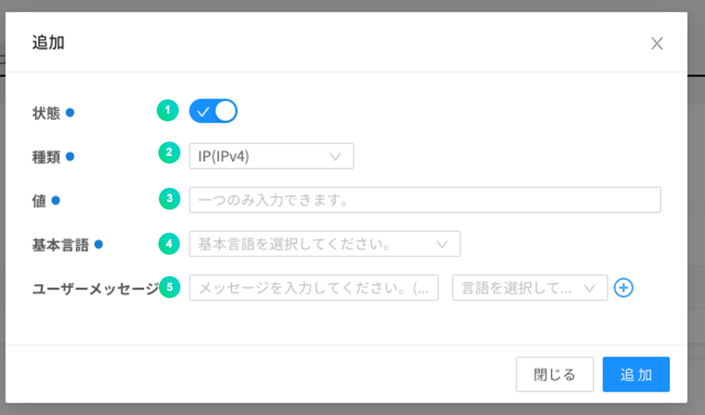

### 会員情報の修正

ダッシュボード利用のアカウント名、パスワードを変更できます。

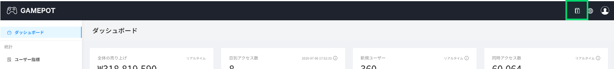

① ダッシュボード右上のアイコンをクリックすると表示されるドロップダウンメニューの中から会員情報の修正を選択できます。

② ユーザー名を変更できます。

③ パスワードを変更できます。

### 環境設定

GAMEPOT ダッシュボード管理のためのユーザー管理、アップデート、システム機能などがあります。

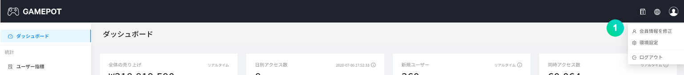

#### ユーザー

ダッシュボードを利用できるユーザーを管理するメニューで、ユーザーを追加/削除できます。

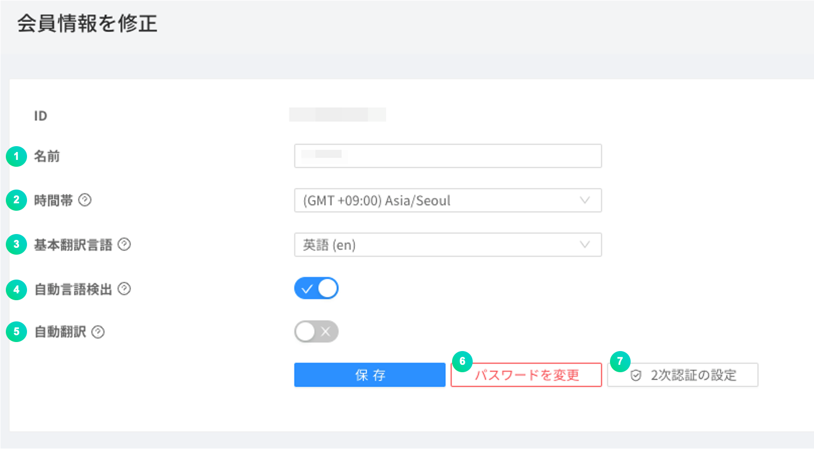

① 状態をチェックすると当該ユーザーが有効化されます。

**登録** ボタンをクリックします。以下のようなポップアップウィンドウが表示されたら、該当する値を入力します。

① 登録するユーザー ID です。メール形式のみ使用できます。

② 登録するユーザー名です。

#### 役割

ダッシュボードを利用できるユーザーをグループ単位で管理する機能で、各役割ごとに異なる権限を与えることができます。

**歯車** ボタンをクリックします。以下のような画面から、当該役割に関する設定をすることができます。

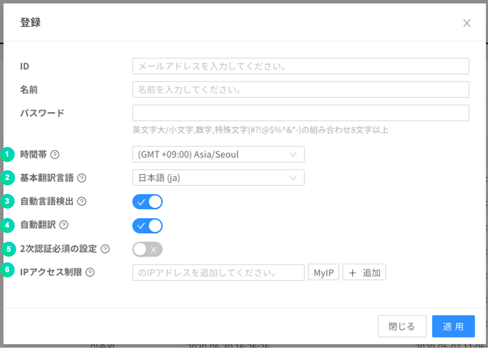

① 当該役割に含めるユーザーを位置させます。

② 基本役割に含めるユーザーを位置させます。基本役割の場合、全ての権限を有しています。

③ 当該役割に許可する機能を選択します。

#### アップデート

GAMEPOT システムのアップデート内訳を確認できます。

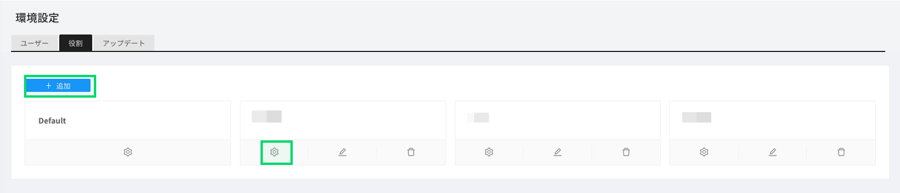
