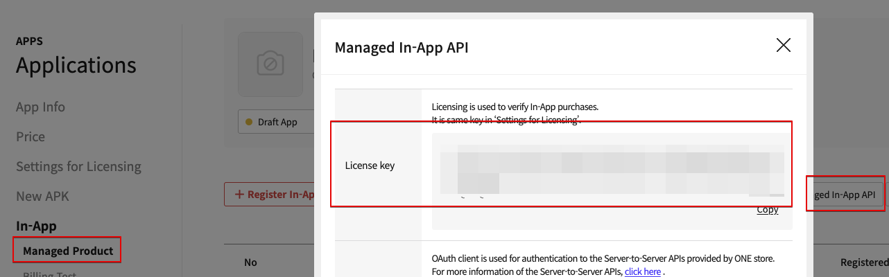
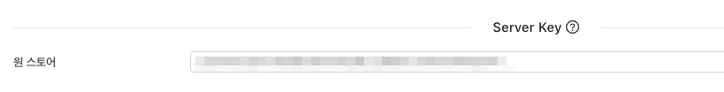
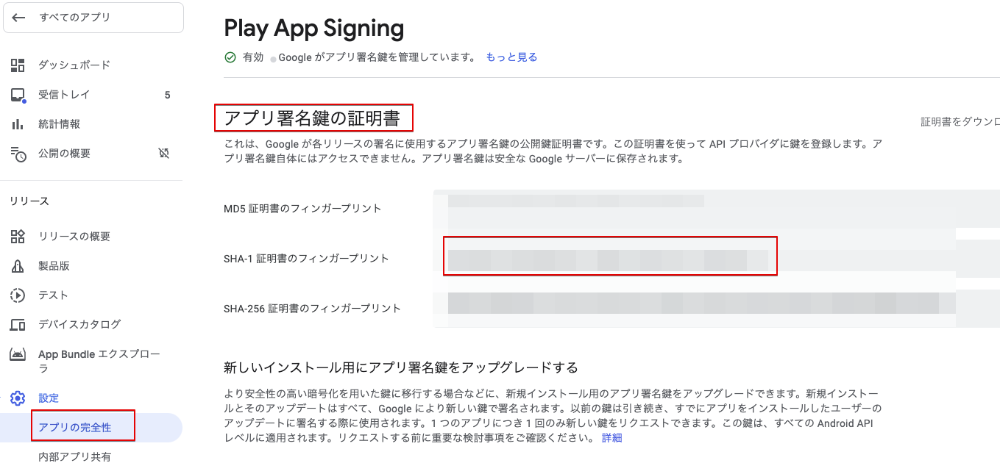
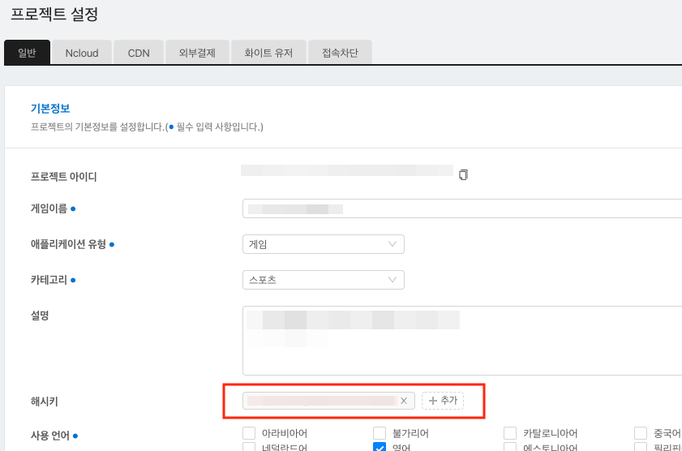
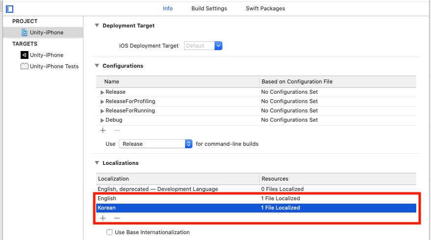
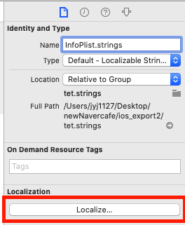

# FAQ

> ###これは機械翻訳されたドキュメントで、語彙、構文、または文法に誤りがある可能性があります。 プロの翻訳者が翻訳したドキュメントをすぐに提供します。
>
> ####ご不明な点がございましたら、[お問い合わせ](https://www.ncloud.com/support/question)でお問い合わせください。
>
> 私たちは、サービスのさらなる向上に全力を尽くします。

## ログインがいない！

> ソーシャルログイン機能の場合、基本的には、プラットフォームの開発ガイドを基準にします。問題発生時には、そのプラットフォームのログイン開発ガイドを先に確認してください。

### 1. Google ログイン

#### 1-1）

    ＃Q.ログイン試行時にすぐにログインキャンセルが返されます。（AOS、iOS）
    ＃A.必要な環境が正しく設定されてないために発生する現象です。

1. Firebase 設定ファイルである`google-service.json`ファイルがプロジェクトに正常に含まれていたのかを確認し

2. （AOS）APK ビルド時に使用 Keystore の SHA-1 値を Firebase Console に追加して

   > SHA-1 値は、開発会社に依頼します。
   > 

3. Firebase Console でプロジェクトの設定が正常にされていることを確認

   - その内容が適用されたビルドが正しいことを確認

     1. Console 上に設定した Package Name（AOS）/ Bundle ID（iOS）で構築したかどうか

     2. （AOS）SHA-1 を抽出した Keystore に構築したかどうか

   - Firbase Conosole にサポートメールを設定して

    * (AOS）Google Consoleで`アプリ署名`を使用している場合は、Consoleで作られたSHA-1値も追加で入れていただく必要があります。

4. 上記のチェック項目をすべて確認したにもかかわらず相変わらず場合は、サポートメールを別のメールに変更しましょう。

   > 断続的に最初のサポートメール設定時正常に動作している場合が発生しています。この場合、別のメールに変更すると、上記の問題がすべて解決されました。

#### 1-2)

    ＃ Q. APKを直接インストールする時はログインがされるが、ストアに上げアプリをダウンロードしてログインする時はログインされていません。（AOS）
    ＃ A. Google Developer Consoleで「アプリ署名」機能を使用してそうです。

コンソールから APK をアップロードする際に「アプリ署名」を有効にすると、keystore がコンソールで管理することに交換され、発生する問題で、コンソールで管理する keystore の sha-1 値を Firebase console に追加が求められます。

> このとき、Facebook のログインを使用している場合は、Facebook developer console もまた、新しい keystore の keyhash 値を追加求められます。

#### 1-3)

    ＃Q. IOSでのGoogleログイン時にエラー\（401エラー：disabled\_client\）が発生します。（iOS）
    ＃A. Firebaseコンソールの設定にサポートメールが設定されていない問題が発生する場合があります。

サポートメールを設定した後、ご確認ください。

#### 1-4)

    ＃Q. iOSでのGoogleのログイン時にポップアップが発生されるが、ゲームの名前ではなく、他の値にさらされます。（iOS）
    ＃A. Xcode>> Targets>> build Settings>> Product Name項目の値を変更していただければされます。

### 2. Facebook ログイン

    ＃Q. Facebookアプリがスマートフォンにインストールされているときに、正常にログインすることはできません。（AOS、iOS）
    ＃A. Facebook Developer Consoleの環境設定が正しくない問題が発生する可能性があります。

APK ビルド時に使用 Keystore のキーハッシュ値をフェイスブックコンソールに追加します。

- Google Console で「アプリ署名」機能を使用する場合は、Google Console で管理している keystore の keyhash 値も追加が求められます。
  

### 3. APPLE ログイン

    ＃Q. APPLEログインの試行時、エラーが発生します。（iOS）
    ＃A. 必要な環境が正しく設定されてないために発生する現象です。

1.  Xcode >> TARGETS >> Signing & Capabilities >> + Capability >> Sign In with Apple を追加したことを確認し

2.  Xcode >> TARGETS >> Build phases >> Link Binary With Libraries에 LocalAuthentication.framework, AuthenticationService.framework が追加することを確認
    （Target バージョンが iOS13 以下であれば、AuthenticationService.framework は optional に設定）

### 4. Naver ログイン

#### 4-1)

    ＃Q. ネイバーログイン時にエラーが発生します。（AOS、iOS）
    ＃A. NAVER Developers Consoleの環境設定がビルド設定と異なり、問題が発生する可能性があります。

NAVER Developers Application の設定とビルド設定が一致していることを確認してください。

#### 4-2)

**_`該当事項はネイバーカフェSDKを一緒に連動する場合にのみ適用されます。`_**

    ＃Q.ネイバーカフェSDK連動時、ウェプビュを通じた四散りばめ（ネイバーIDでログイン）をすることができません。（iOS）
    ＃A.はいアロSDKとカフェSDKのログインモジュールが共存して発生する問題です。

1. そのリンクのパッチをダウンロードしてください。 \([Download](https://kr.object.ncloudstorage.com/itsb/patch/Patch_GamePotNaverLogin_20200508.zip)\)

2. 既存のプロジェクト内に存在する 2 つの framework を削除してください。

   - GamePotNaver.framework
   - NaverThirdPartyLogin.framework (存在する場合)

3. ダウンロードしたパッチ（GamePotNaver.framework）を既存の同じパスに入れてください。

   IOS UIWebview 問題チェムンにネイバーカフェ SDK は 4.4.7 以降のバージョンを使用しお願いします。

4. （UNITY ONLY）ネイバーカフェの初期化段階では、url scheme 明示的に挿入

   ../Assets/NCSDK/Plugins/iOS/NCSDKUnityManager.mm

5. info.plist の URL Scheme 値の優先順位を最初に修正してください。\([Link](https://docs.gamepot.io/undefined/gamepot_troubleshooting#unity-sdk-ios)\)

### 5. Line ログイン

    ＃Q.ラインログイン時にエラー\（400エラー：Bad\_Request\）が発生します。（AOS、iOS）
    ＃A. LINE Developers Consoleの環境設定が正しくない問題が発生する可能性があります。

Line Developer Console の設定が正しいことを確認してください。

### 6. Twitter ログイン

    ＃Q. おログイン時にエラー\（Error Code - 1011\）が発生します。（AOS、iOS）
    ＃A. Twitter Developers Consoleの環境設定が正しくない問題が発生する可能性があります。

Twitter Developer Console の設定が正しいことを確認してください。

1. Sign in with Twitter が Enabled であることを確認してください。

2. Callback URL の設定が正しいことを確認してください。
   - 最初の行（AOS 使用）：twittersdk：//
   - 第二行（iOS を使用）：twitterkit-{twitter_consumerkey}：//

## 支払いしていない！

### 1.共通

#### 1-1）

    ＃Q.支払いしようと市」productid was wrong！」フレーズが公開されます。
    ＃A. GAMEPOTダッシュボード - >決済 - > IAPのストアの商品IDを追加してください。

#### 1-2)

    ＃Q.最初決済しようと円の応答がなく、第二決済の試行時にお支払いが成功したと応答します。（Play Store、ONEStore）
    ＃A.ダッシュボード - プロジェクトの設定 - 一般 -  Public Keyのキーが正しくない場合です。

`ヘルプを表示`の内容を参考にして、キーを入れてください。

### 2. Google Play Store

#### 2-1)

    ＃Q.グーグル支払いポップアップは露出されるが支払いが行われていない。
    ＃A.グーグル支払いをすることができる環境が正しく設定されず、発生した場合です。以下の項目を一つずつチェックしてください。

1.コンソール>アプリ情報>アプリ内商品にアプリ内の`アクティブAPK`になっていることを確認

2. コンソールにアプリが`チュルシドゥェム`状態であることを確認

   > `プロダクション`トラックではなく、`プライベート`/`内部テスト`トラックに置いたします。

3. コンソール - >テスト - >クローズド テスト - >トラック - >トラックを管理 - >テスター数 -> テスト参加先の管理にテストアカウントを登録したことを確認し

4. テスト参加の URL にアクセスして、テストの参加を申請したことを確認し

5. コンソール - >設定で`ライセンステスト`のテストアカウントを追加したことを確認し

6. 端末 - >設定 - >アカウントメニューにテスト参加したアカウントのみ残してすべて削除することを確認

### 3. ONEStore

#### 3-1)

    ＃Q.「異常アプリで支払いが要求されて「フレーズ公開されます。
    ＃A.オープン前にアプリは、テストアカウントのみアクセスが可能です。以下の点を確認してください。

1. テストアカウントが登録されていることを確認してください。

2. 端末にインストールされてワンストアアプリが 1 番で登録されたテスト用のアカウントにログインしていることを確認してください。

#### 3-2)

    ＃Q.チェックアウト時に、\[package\] does not exist or wrong secret。フレーズ公開されます。
    ＃A. GAMEPOTダッシュボードにワンストア関連キー値が正常に適用したのかを再確認してください。

1. APK の Package name が円形ストアに登録されたパッケージ名と同じかどうか

2. ワンストアコンソールの`ライセンスキー`適用するかどうか

> その値が GAMEPOT ダッシュボードの下の項目に適用されているかどうか

3. ワンストアコンソールの`Client secret`適用するかどうか

> その値が GAMEPOT ダッシュボードの下の項目に適用されているかどうか

#### 3-3)

    # Q. 決済完了後、「照会された結果の値が存在しません。\（9001\）"フレーズでお支払いが失敗します。
    ＃ A. ワンストアに領収書の検証要請シリアル/テスト環境の違いで問題が発生した場合です。

**A-1。ワンストア決済画面が Sandbox 環境の場合**

- ゲームポットダッシュボード - プロジェクトの設定 - テストユーザーメニューに`決済/クーポン`にアイピーが`登録`されていることを確認してください。

- ゲームポットダッシュボード - プロジェクトの設定 - Webhook 項目に`決済アイテム（テストユーザー）`アドレスが`登録`されていることを確認してください。

**A-2. ワンストア決済画面が Production 環境の場合**

- ゲームポットダッシュボード - プロジェクトの設定 - テストユーザーメニューから`決済/クーポン`にアイピーが`未使用'の状態であるか、`未登録`であることを確認してください。

- ゲームポットダッシュボード - プロジェクトの設定 - Webhook 項目に`決済アイテム（サービス）`にアドレスが`登録`されていることを確認してください。

#### 3-4)
- OneStore SDKアプリ内のバージョンSDK v17、API v5のみをサポートします。

- Androidビルド時targetSdkVersion30（Android11）にビルドした場合Android11 OS機器にOneStore APKを認知できない。

    [AndroidManifest.xml ファイル内にフレーズを追加する必要]

        <!-- targetSdkVersion30でビルドする場合のOneStoreバージョンの追加コード [Start] -->
        <queries>
            <intent>
                <action android:name="com.onestore.ipc.iap.IapService.ACTION" />
            </intent>
            <intent>
                <action android:name="android.intent.action.VIEW" />
                <data android:scheme="onestore" />
            </intent>
        </queries>
        <!-- targetSdkVersion30でビルドする場合のOneStoreバージョンの追加コード [End] -->

        <application

## Adbrix Remaster

    ＃Q. Adbrix Remaster適用後IOSビルド時Crashが発生ハングします。
    ＃A. Adbrix RemasterはSwiftで実装されているライブラリにSwiftライブラリ適用時に追加の設定が必要です。

XCode で以下のように設定した後、ビルドしてください。

もしビルドしても同じであればクリーンビルドした後、ご確認ください。

#### Q. Adbrix Remaster 適用後 AppStore アップロード時 Error が発生します。

#### A. Adbrix Remaster ライブラリが x86_64、i386 アーキテクチャを含む発生する問題です。下記のように措置した後、再構築した後確認してください。

コンソール\（ターミナル\）で AdBrixRM.framework ファイルの場所に移動した後、以下二つのコマンドを入力し

lipo -remove x86_64 ./AdBrixRM.framework/AdBrixRM -o ./AdBrixRM.framework/AdBrixRM lipo -remove i386 ./AdBrixRM.framework/AdBrixRM -o ./AdBrixRM.framework/AdBrixRM

## Naver Cafe

    ＃Q. iOS Naver Cafe暴露英語で公開されます。
    ＃A. XCode>> Targets>> Info>> Localization native development regionをkoreaに変更し、[OKお願いいたします。

## サービス発表

    ＃Q. iOSプラットフォームを対象にサービスをローンチする予定です。
    ＃A. iOS App Storeの場合は、アプリレジ期間が1〜2週間ほどかかるので、2週間ほど余裕期間を置いリアルジョンダッシュボードに移転を申請する必要がありスムーズな進行が可能です。

## プッシュ

    ＃Q. iOSでプッシュ受信が行われない。
    ＃A.以下の説明にある部分を一つずつ確認してください。

**1。 NCloud SENS 設定 Certification に iOS 証明書が登録されていることを確認お願いいたします。**

iOS は、ビルド時に使用されたプロビジョニングプロファイルのタイプに応じて、登録しなければなら証明書が異なります。

- Developement Provisioning >> Push Development 証明書の登録 Type は Sandbox に設定
- Adhoc / Distribution Provisioning >> Push Distribution 証明書の登録 Type は Production に設定

**2。証明書の登録後、クライアントからログインまでに完了することを確認お願いいたします。**

Gamepot はプッシュトークンをログイン完了時にサーバーに転送します。

したがって、証明書を登録したらと Client でログインまで進行した後確認お願いいたします。

**3。アプリ Forground 状態であることを確認してください。**

iOS の場合、アプリが Forground な状態では、プッシュ受信ができません。

home ボタンを押して、メイン画面でプッシュが受信されることを確認お願いします。

**4。 Xcode で build 時 Capability に Push Notification が含まれていることを確認してください。**

Xcode で build 時 Capability に Push Notification を含める必要があります。受信が行われない場合、ビルド時にこの部分が含まれていないことを確認お願いします。

## アプリ署名

    ＃Q.直接インストールしたAPKは、ソーシャルログインが正常にされるが、ストアからダウンロードした後、ソーシャルログインすると、ログインされていません。
    ＃A.グーグル開発コンソールでアプリの署名が有効になってキーストアが変更された場合です。

グーグルの開発者コンソールに`設定` - >`アプリの完全性`メニューに以下のような画面が表示されます。

グーグルログインをご利用中であれば、`SHA-1`値を firebase console に追加し、

フェイスブックのログインをご利用中であれば、上記の`SHA-1`値の`keyhash`をフェイスブックコンソールに追加します。

## Casebook

### - Dashboard

#### 1. Push メッセージが受信されない場合

    1.ダッシュボード>>プロジェクト設定>> ncloud API認証キーのAccessKey、Secret Key、SENS-PUSH、SENS-SMS値を確認してください。
    2.認証キーに対してSENSプロジェクトのCertificateの設定をしていることを確認してください。

#### 2. ユーザー指標 Retention の計算方法について

初日アカウントを作成した後、その次の日にアクセスしたユーザを New User とみなして Counting ます。（広告などの経路を介して流入された虚を第ためです。）

    example）
     下の画像帳票から2020-01-07基準に見て見たとき、
     2020-01-07に新規ユーザの2020-01-08日に接続した人員が5人で
     その日（2020-01-07）にNew Userを5人で判断します。（Day1値と同じです。）
     その人数の目安としてDay2（次の日2020-01-09）に1人の接続/ Day3に0人の接続/ Day4に1人の接続をした状態を示しています。
     5人のユーザーのうち、n Dayにカウントされている方式であるため、中間に0％に抜ける区間が生じます。

#### 3. 会員の利用停止を無効にしたとき

    利用停止リストにユーザー名が追加されており、状態が無効状態のときには、Googleの払い戻しを行うとしても、自動的にそのリストが再活性化されません。
    また、無効なユーザーIDには、アカウントのアクセスを妨げずにいます。

### - ETC.

#### 1. Firebase Console で google-service.json 抽出時

    Firebase Console上で、SHA指紋が登録されている状態で、google-service.jsonを抽出してください。
    そうでない場合は、jsonファイルの一部の値が欠落している抽出される可能性があり、通常のログインが出来ない場合もあります。

#### 2. ゲームポットログイン検証時、Token authentication failed エラーが発生し

    ベータゾーンを使用しているメーカーで発生する可能性のある問題です。
    ログイン検証Request URLが「https://gamepot.apigw.ntruss.com/gpapps/v1/loginauth」に設定されていれば、https://cloud-api.gamepot.io/loginauthに変更してご確認お願いいたします。

    リアルジョン : https://gamepot.apigw.ntruss.com/gpapps/v1/loginauth
    ベータジョン : https://cloud-api.gamepot.io/loginauth ( サービス終了予定 )

#### 3. ビルドの実行時に、「異常にアプリが実行されました。ストアからダウンロード」メッセージのポップアップが発生

    ダッシュボード>>プロジェクトの設定>>[全般]タブでは、ハッシュキーが正しく設定されて発生することがあります。
    このハッシュキーを削除または正確なハッシュキー入力後確認してください。

#### 4. Gamepot SDK で決済しようと市、Gamepot SDK は成功応答を受けたが、ダッシュボードの決済>>決済リストに決済した履歴の登録ず、ゲームサーバーに req 伝達しない

    ダッシュボード>>プロジェクトの設定>>[全般]タブでは、Google API KeyのJson値が登録されていることを確認ヘください。
    グーグルAPI Keyの設定がversion2になっているときは、そのkeyの値がなくても決済が可能だったがversion3からkeyの値を入力する必要があります。
    もし入力がされている状態であれば、ヘルプの表示をクリックして、JSONの値を再生成して登録お願いいたします。
    ref。）新たにアカウントを発行されてkeyの値を抽出し入れたときに、新しいキーが更新されるまでは約一日ほど時間がかかります。

#### 5. 決済完了後、Google Play Developer API not linked エラーが発生し

    グーグルAPI Keyの設定が正しくない場合に発生することがある問題です。
    ヘルプの表示をクリックして、JSONの値を再生成して登録お願いいたします。
    ref。）新たにアカウントを発行されてkeyの値を抽出し入れたときに、新しいキーが更新されるまでは約一日ほど時間がかかります。

#### 6. 新規サービスアカウント発行後 Key 値を適用したにもかかわらず、、請求 API が失敗した場合

    （グーグルのサービスアカウント移管時）新規Keyの発給を受け適用したにもかかわらず、、請求APIが失敗する、Googleコンソール側のバグレポートが流入しました。（2020.02.13）
    この場合、Googleコンソールで任意にアプリ内の商品を一つ作成し、問題が解決するか確認してください。

#### 7. IOS Push メッセージの受信の問題\[[IOS APNS 証明書の登録ガイド](https://kr.object.ncloudstorage.com/itsb/patch/IOS%20APNS%20%E1%84%8B%E1%85%B5%E1%86%AB%E1%84%8C%E1%85%B3%E1%86%BC%E1%84%89%E1%85%A5%20%E1%84%80%E1%85%A1%E1%84%8B%E1%85%B5%E1%84%83%E1%85%B3%20%E1%84%86%E1%85%AE%E1%86%AB%E1%84%89%E1%85%A5.docx)\]

    1. SENS設定Certificationに認証キーと証明書が登録されていることを確認お願いします。

    2. IOSは、ビルド時に使用されたプロビジョニングプロファイルのタイプに応じて、登録しなければなら証明書が異なります。

    [Development]
    Provisioning >> Push Development証明書をアップロードしてくださってTypeはSandboxに設定してください。

    [Adhoc / Distribution]
    Provisioning >> Push Distribution証明書をアップロードしてくださってTypeはProductionに設定してください。

    3. GamepotはPush Tokenイン完了時にサーバーに転送します。したがって、証明書を登録した後、クライアントからログインまで進行ご確認ください。

    4. IOSの場合、アプリがForground状態では、プッシュ受信ができません。 homeボタンを押して、メイン画面でプッシュが受信されることを確認してください。

    5. IOSの場合は、Xcodeでbuild時CapabilityにPush Notificationを含める必要があります。受信が行われない場合には、ビルド時にその部分が追加されていないことを確認してください。

#### 8. IOS 決済テスト方法

    1.テストする機器の設定>> iTunseとStore>> Apple ID：XXXXをタッチ>>ログアウト

    2.アプリを起動する

    3.アプリの有料課金アイテムの選択

    4.ポップアップの発生時に既存のappleID使用に選択

    5.テストアカウントID/ PW入れログイン（時々の状態に応じて、ポップアップが何度も浮かぶ場合が、特に気にしなくなります。）

    6.有料決済項目の価格と名前がポップアップ形式で公開され、[Environment：Sandbox]フレーズ露出

    7.購入選択

    *お支払いポップアップの[Environment：Sandbox]フレーズが露出されると、実際の料金はかかりません。

#### 9. Push メッセージのアプリ名は、クライアントビルド時の決定がされます。

言語に合わせてアプリの名前を変更したい場合、以下のような方法で行わください。

    [アンドロイド]

    app/ src/ main/ res/ values-国コード/strings.xml

    ex）デバイスの言語が英語のときにアプリの名前を変更しようとするとき
    app/ src/ main/ res/ values-en/ strings.xml

    [ユニティアンドロイド]

    Assets/ Plugins/ Android/ GamePotResources/ res/ values-国コード/strings.xml

    ex）デバイスの言語が韓国語であるときアプリ名を変更しようとするとき
    Assets/ Plugins/ Android/ GamePotResources/ res/ values-ko/ strings.xml

    [strings.xml]
    <？xml version="1.0" encoding="utf-8"？>
        <resources>
            <string name="app_name">言語に合わせてアプリの名前を設定</ string>
        </ resources>

IOS の設定は、以下のように進行します。

1. XCode>> Targets>> Info>> Localization>>追加しようとする言語を追加
   

2. Xcode>> File>> file>> Strings File アイコンをクリックし>> next>ファイル名 InfoPlist に定義した後、ファイルの作成
3. 生成されたファイルのファイルを選択した後、Localization 設定付与

4. オンオウル選択すると、関連ファイルが生成がされ、そのファイルにそれぞれの言語に合わせてアプリ名を付与するされます。

   [InfoPlist.string]
   CFBundleDisplayName="言語に合わせてアプリの名前を設定する";

#### 10. アプリ内のリスト情報を取得するストアに GamePot.getPurchaseItems（）API の Price 値が異なります。

    アプリ内のリスト情報を取得する際、各ストアアプリ内SDKの伝達を与える値を共有します。

    グーグルストア：priceの値は、通貨+アプリ内の価格
    ex）₩1,000

    アップルストア：priceの値はアプリ内価格
    ex）1000

    IOSで通貨を表記するためにはprice_currency_code値を参照してください。
    ex）price_currency_code：KRW

#### 11.ダッシュボードの管理者アカウントがパスワード 5 回失敗にログインができない。（V2 ダッシュボードユーザー対象）

1. https://console.ncloud.com/gamepot サイトに admin アカウントで接続をします。

2. パスワードを初期化しようとするダッシュボードを選択した後、プロジェクト管理項目をクリックするパスワードの初期化メニューが見られるようになります。

3. パスワードの初期化メニューを選択する際、管理者アカウントを入力するポップアップが発生し内容を入力時に関連メールで初期化することができるメールが配信されます。

