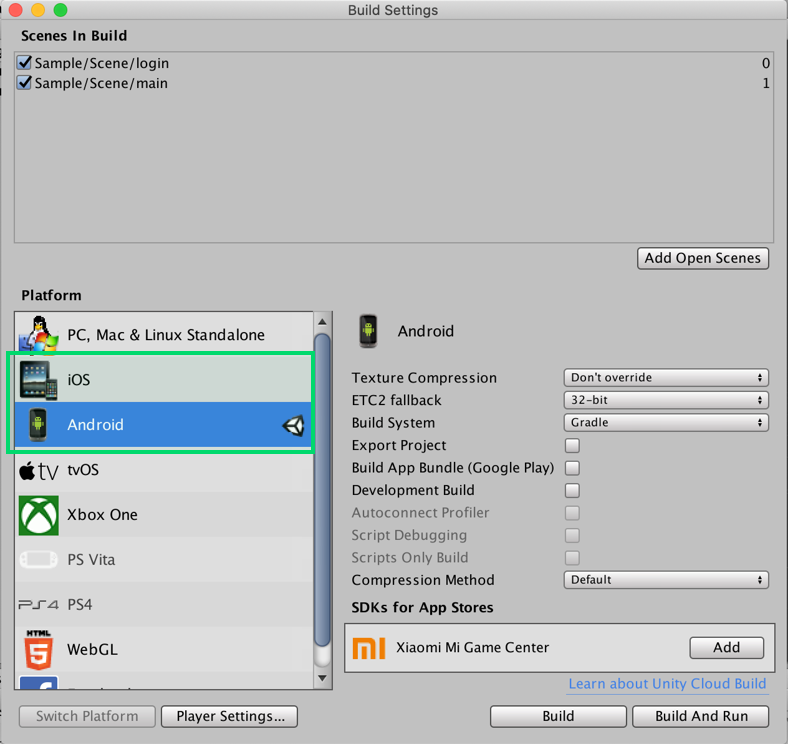

---
search:
  keyword:
    - gamepot
---

# GamePot Tools - Beta

> ###これは機械翻訳されたドキュメントで、語彙、構文、または文法に誤りがある可能性があります。 プロの翻訳者が翻訳したドキュメントをすぐに提供します。
>
> ####ご不明な点がございましたら、[お問い合わせ](https://www.ncloud.com/support/question)でお問い合わせください。
>
> 私たちは、サービスのさらなる向上に全力を尽くします。

NAVER CLOUD PLATFORM の GAMEPOT で提供される GamePot Tools のガイドです。

## GAMEPOT Tools の紹介

**Q。ゲームポットツールズとは？**

ユニティエンジンを介してゲームを開発する過程で発生する可能性のある、パッケージの依存関係の問題を一目で確認し、管理することができるように
ゲームポット SDK で提供される管理ツールです。

ゲームポット SDK で提供している既存のライブラリモジュールだけでなく、さまざまなサードパーティのライブラリをワンクリックで管理することができます。

プラットフォーム、モジュールごとにパッケージの依存関係の現状を診断し、解決することができます。

## 1. はじめ

### Step1. GamePot Tools プラグインをインポートする

生成された GAMEPOT ダッシュボードに接続した後、最新のプラグインをダウンロードします。
 **その他> SDK のダウンロード> Unity> GamePot Tools ダウンロード**

### Step 2. プラグインの読み込み

> Unity バージョン 2017.4.x 以上が必要です。

**Assets > Import Package > Custom Package** メニューからダウンロードした`GamePotTools_xxxx.unitypackage`ファイルを選択します。

プラグインを確認して import すると、そのプロジェクトに追加されます。

### Step 3. Android/iOS

GamePot Tools の場合は、各プラットフォームの namespace を要求するので Android/ iOS ビルド環境が設定された状態から通常の動作です。ユニティエディタ上で**File> Build Settings> Android/ iOS**モジュールがすべて download された状態であることを確認してください。

## 2. 使用する

**Window> GamePot Tools**タブをクリックして、GamePot Tools を実行することができます。

① GamePot Tools のバージョンを確認し、最新バージョンの更新がある時に更新を実行します。

② ゲームポットガイドを Web ページで確認することができます。

③ ネイバークラウドプラットフォームガイドを Web ページで確認することができます。

④ 最小モジュールが構成された状態の GamePot Sdk をダウンロードします。

### アンドロイド指紋ツール

現在のプロジェクト内に設定された KetStore から各種 Fingerprint を獲得します。

**キーツール**ボタンをクリックします。

> ユニティプラットフォーム設定が Android に変更されている。

① 現在のプロジェクトの PlayerSetting に設定された KeyStore 情報を確認します。

②Sha1 指紋を獲得します。

③Base64 ハッシュを取得します。

④APK ファイルのパスを入力して、ハッシュを取得します。

⑤ アンドロイドスタジオセットアップページに移動します。

⑥JDK のダウンロードページに移動します。

⑦Install 機能を使用して削除したパッケージが保存されているローカルストレージに移動します。

⑧ キャッシュデータが保存されているローカルストレージに移動します。

### ゲームポット設定ツール

GamePot の各種設定値を管理します。

#### Android

Android Bulid に関する Gamepot プロジェクトの環境を設定します。
`Android> mainTemplate.gradle`に反映されます。

#### IOS

IOS Bulid に関する Gamepot プロジェクトの環境を設定します。
`IOS> GamePotConfig-info.plist`に反映されます。

### モジュールのインストール

プラットフォーム固有のモジュールおよびライブラリを管理します。

① プラットフォームを選択することができます。（Android/ iOS）

② プロジェクト内の構成しようとするモジュールを選択することができます。すでに設定されているモジュールの場合には、活性化状態が維持されます。

③ そのモジュールの依存パッケージのリストを確認し、プロジェクト内の状況を確認することができます。

④ 選択したモジュールのリストについては、必要な依存性パッケージを構成します。

#### パッケージのインストール

- プロジェクト内に、対応するパッケージがないので、CDN サーバーからダウンロードします。

- 重複したパッケージが存在します。推奨バージョンのパッケージだけを残し、残りは削除されます。

- 最新バージョンのパッケージがインストールされています。現在の状態を維持します。
   すべて「選択」ボタンを再クリックして選択を解除すると、既存のパッケージを削除して、CDN サーバーからダウンロードすることができます。

インストールボタンをクリックすると、パッケージ Resolving が開始されます。

### 言語を変更する

GamePot Tools の言語が選択した言語に変更されます。英語、韓国語、日本語、中国語をサポートします。

