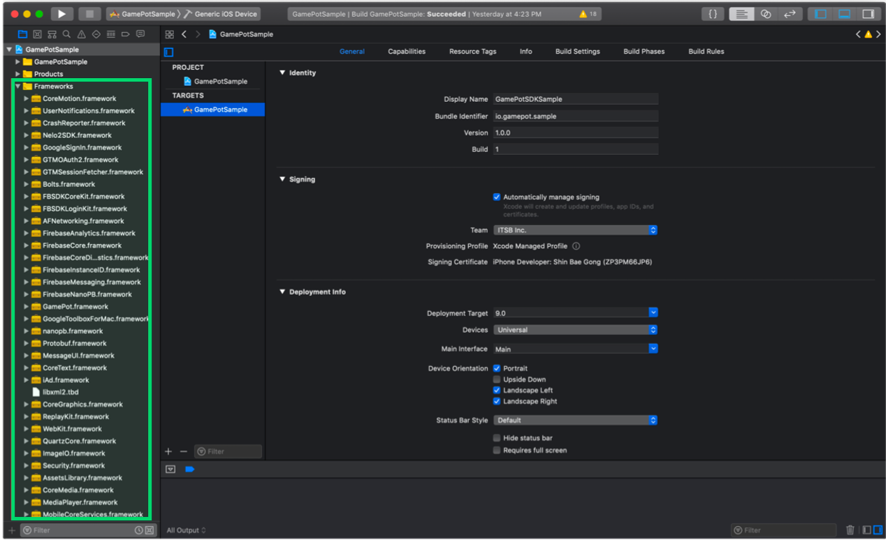
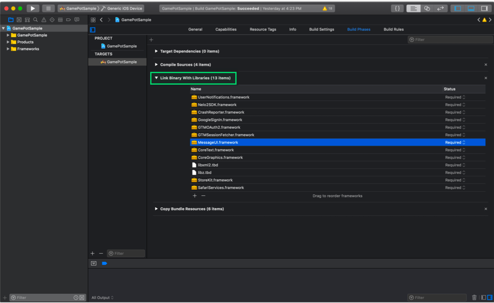
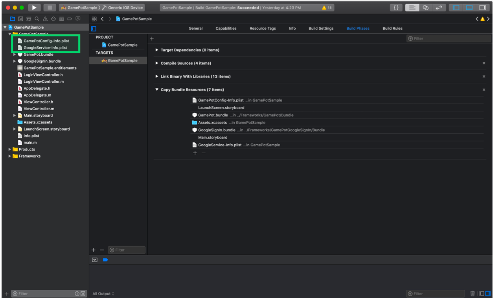
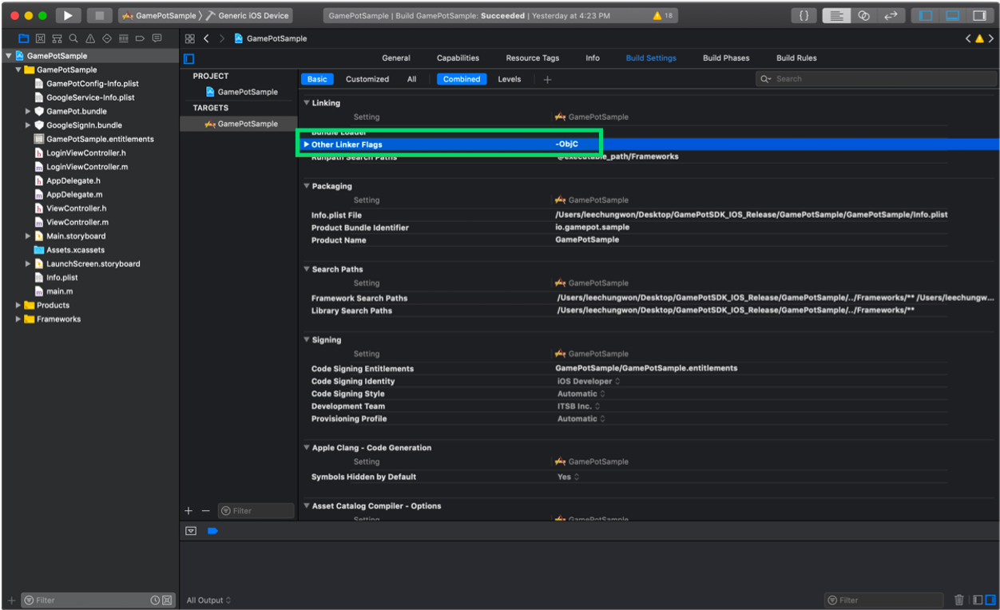
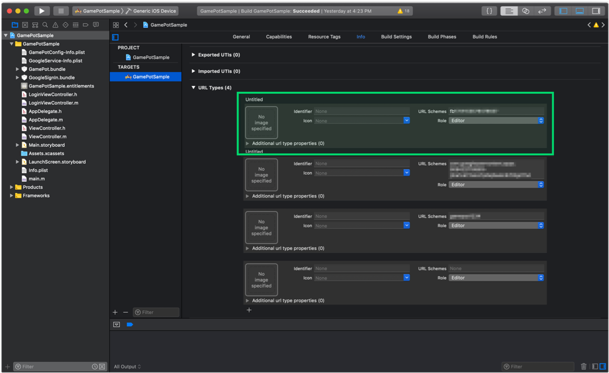
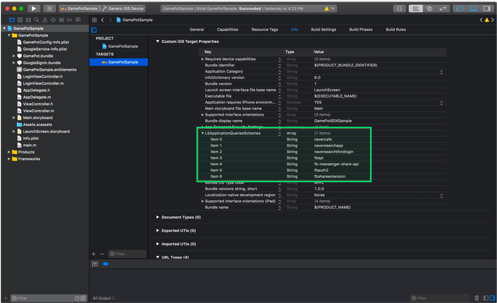
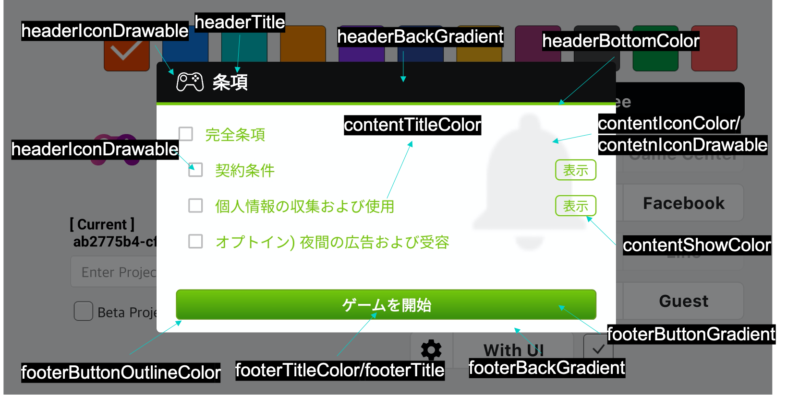

---
search:
  keyword:
    - gamepot
---

#### **NAVER クラウドプラットフォーム商品の使用方法をより詳細に提供し、様々な API の活用をサポートするために<a href="https://guide.ncloud-docs.com/docs/ja/home" target="_blank">[説明書]</a>と<a href="https://api.ncloud-docs.com/docs/ja/home" target="_blank">[API リファレンス]</a>を分けて提供しています。**

<a href="https://api.ncloud-docs.com/docs/ja/game-gamepot-index" target="_blank">GAMEPOT API リファレンスへ >></a><br />
<a href="https://guide.ncloud-docs.com/docs/ja/game-gamepotconsole" target="_blank">GAMEPOT 説明書へ >></a>

# iOS SDK

## 1. 始める

#### Step 1. 開発環境の構成

iOS 用アプリケーションを開発するには、開発ツール\(Xcode\)をインストールする必要があります。iOS で GAMEPOT を利用するために必要なシステム環境は以下のとおりです。

- OS：iOS 10.0 以上
- 開発環境：Xcode

#### Step 2. Framework 追加



ダウンロードした iOS SDK ファイルを Xcode プロジェクトフォルダターゲットにマウスドラッグして追加します。

#### Step 3. Dependencies 追加

利用するサービスによって必須 Dependencies リストが異なります。

サービスに応じて以下の表を参考にして Dependencies を追加します。

サービス別 Dependencies

| Service           | Framework                                                                                                                                                                                                                                                                                                                                                                                                                                                                                                                                                                                            | Dependencies                                                                                                                                                                                                                      | bundle                                   |
| :---------------- | :--------------------------------------------------------------------------------------------------------------------------------------------------------------------------------------------------------------------------------------------------------------------------------------------------------------------------------------------------------------------------------------------------------------------------------------------------------------------------------------------------------------------------------------------------------------------------------------------------- | :-------------------------------------------------------------------------------------------------------------------------------------------------------------------------------------------------------------------------------- | :--------------------------------------- |
| 基本\(Base\)      | AFNetworking.framework FirebaseAnalytics.framework FirebaseCore.framework FirebaseCoreDiagnostics.framework FirebaseInstanceID.framework FirebaseMessaging.framework FirebaseNanoPB.framework GamePot.framework GoogleToolboxForMac.framework nanopb.framework Protobuf.framework                                                                                                                                                                                                                                                                                                                    | libz.tbd WebKit.framework UserNotifications.framework                                                                                                                                                                             | GamePot.bundle                           |
| ログイン\(Login\) | \[ Base \]<br> GamePotChannel.framework <br><br> \[ Google Sign In \]<br> GamePotGoogleSignIn.framework GoogleSignIn.framework GoogleSignInDependencies.framework <br><br>\[ Facebook \] <br>FBSDKCoreKit.framework FBSDKLoginKit.framework GamePotFacebook.framework<br><br> \[ LINE \]<br> GamePotLine.framework LineSDK.framework LineSDKObjC.framework<br><br> \[ NAVER \]<br> GamePotNaver.framework NaverThirdPartyLogin.framework<br><br> \[ Twitter \]<br> GamePotTwitter.framework<br> TwitterKit.framework \(Dynamic Library に追加\)<br> TwitterCore.framework \(Dynamic Library に追加\) | \[ Google Sign In \] AuthenticationServices.framework LocalAuthentication.framework<br><br> \[ Facebook \] SafariServices.framework<br><br> \[ LINE \]<br>SafariServices.framework<br><br> \[ Twitter \] SafariServices.framework | \[ Google Sign In \] GoogleSignIn.bundle |
| GameCenter        | GamePotGameCenter.framework                                                                                                                                                                                                                                                                                                                                                                                                                                                                                                                                                                          |                                                                                                                                                                                                                                   |                                          |
| AppleID           | GamePotApple.framework                                                                                                                                                                                                                                                                                                                                                                                                                                                                                                                                                                               |                                                                                                                                                                                                                                   |                                          |



#### Step 4. Bundle Resource 追加

利用するサービスに応じて Bundle Resource ファイルを追加します。

サービス別 Dependencies 表を参考にして Bundle Resource ファイルを追加します。


#### Step 5. InfoPlist 追加



GAMEPOT SDK は Google Firebase を使用します。したがって、Google Firebase を設定して作成した GoogleService-Info.plist をプロジェクトに追加します。

GAMEPOT SDK の基本設定値が含まれている GamePotConfig-Info.plist ファイルも追加します。GamePotConfig-Info.plist ファイルがない場合、同じファイル名で作成してキーに該当する値を入力します。

**GamePotConfig-Info.plist 設定**


```markup
gamepot_project_id：GAMEPOTプロジェクトID
gamepot_elsa_projectid：GAMEPOTログプロジェクトID(optional)
```

#### Step 6. ビルドオプション追加

**Build Settings &gt; Linking &gt; Other Linker Flags**セクションに-ObjC オプションを追加します。



#### Step 7. Info.plist 修正

Targets &gt;&gt; Info &gt;&gt; Custom iOS Target Properties に以下のユーザー権限取得オプションを追加してください。

このユーザー権限は GAMEPOT サポートセンター内のファイルアップロード機能で使用されます。

```text
NSCameraUsageDescription
NSPhotoLibraryUsageDescription
```

iOS14 以降

iOS14 バージョンから IDFA 値獲得時にユーザーに権限を獲得しなければなら

IDFA 値獲得が可能なように変更されました。

したがって IDFA 値獲得時にユーザーに権限獲得するポップアップを使用している場合
Targets>> Info>> Custom iOS Target Properties 内の下のユーザーの権限獲得オプションを追加お願いします。

> 2020.09.11<br/>
> Apple の IDFA 値獲得時にユーザーに権限獲得するポップアップ必須適用は 2021 年初めまで延期された。<br/>
> 下のリンク参照してお願いします。<br/> > https://developer.apple.com/news/?id=hx9s63c5

```text
NSUserTrackingUsageDescription
```

#### Step 8. Google Sign In ログイン環境設定

サービス別 Dependencies 表の**Login &gt; Google Sign In**を参考にして Framework と Dependencies を追加します。

GoogleService-Info.plist ファイルの`REVERSED_CLIENT_ID`値をコピーし、**Info &gt; URL Types**に項目を追加して URL Schemes に値を入力します。


**GamePotConfig-Info.plist 設定**


```markup
gamepot_google_app_id：GoogleService-Info.plistファイルのCLIENT_ID値
gamepot_google_url_schemes：GoogleService-Info.plistファイルのREVERSED_CLIENT_ID値
```

#### Step 9. Facebook ログイン環境設定

サービス別 Dependencies 表の**Login &gt; Facebook**を参考にして Framework と Dependencies を追加します。

Facebook App ID を**Info &gt; URL Types**に fb+Facebook App ID 形式で追加します。



**Info &gt; iOS Target Property**の**LSApplicationQueriesSchemes**に以下の項目を追加します。

- fbapi
- fb-messenger-share-api
- fbauth2
- fbshareextension



**GamePotConfig-Info.plist 設定**


```markup
gamepot_facebook_app_id : Facebook App ID
gamepot_facebook_display_name : Facebook display name
```

#### Step 10. LINE ログイン環境設定

**GamePotConfig-Info.plist 設定**

```markup
gamepot_line_channelid : Line Channel ID
gamepot_line_url_schemes : Line URL Scheme (line3rdp.{プロジェクトバンドルID})
```

#### Step 11. Twitter ログイン環境設定

**GamePotConfig-Info.plist 設定**

```markup
gamepot_twitter_consumerkey : Twitter Consumer Key
gamepot_twitter_consumersecret :  Twitter Consumer Secret
```

#### Step12. NAVER ログイン環境設定

**GamePotConfig-Info.plist 設定**

```text
gamepot_naver_clientid : Naver Client Id
gamepot_naver_secretid : Naver Secret Id
gamepot_naver_urlscheme : Naver Url Scheme
```

**Info &gt; iOS Target Property**の**LSApplicationQueriesSchemes**に以下の項目を追加します。

- naversearchapp
- naversearchthirdlogin
- navercafe

**Info &gt; URL Types**に gamepot_naver_urlscheme に入力した値を追加します。

#### Step13. AppleID ログイン環境設定

**Xcode &gt; TARGETS &gt; Signing & Capabilities &gt; + Capability &gt; Sign In with Apple を追加します。**

## 2. 初期化

AppDelegate ファイルに以下のコードを追加します。

```text
#import <GamePot/GamePot.h>

#if __has_include(<AppTrackingTransparency/AppTrackingTransparency.h>)
#import <AppTrackingTransparency/AppTrackingTransparency.h>
#endif

- (BOOL)application:(UIApplication *)application didFinishLaunchingWithOptions:(NSDictionary *)launchOptions {
    ...
    // GamePot SDK Initialize
    [[GamePot getInstance] setup];

    // Push Permission
    if(SYSTEM_VERSION_GRATERTHAN_OR_EQUALTO(@"10.0"))
    {
        UNUserNotificationCenter *center = [UNUserNotificationCenter currentNotificationCenter];
        center.delegate = self;
        [center requestAuthorizationWithOptions:(UNAuthorizationOptionSound | UNAuthorizationOptionAlert | UNAuthorizationOptionBadge) completionHandler:^(BOOL granted, NSError * _Nullable error){
            if(!error){
                dispatch_async(dispatch_get_main_queue(), ^{
                    [[UIApplication sharedApplication] registerForRemoteNotifications];
                });
            }
        }];
    }
    else
    {
        // Code for old versions
        UIUserNotificationType allNotificationTypes = (UIUserNotificationTypeSound | UIUserNotificationTypeAlert | UIUserNotificationTypeBadge);
        UIUserNotificationSettings *settings = [UIUserNotificationSettings settingsForTypes:allNotificationTypes categories:nil];
        [application registerUserNotificationSettings:settings];
        [application registerForRemoteNotifications];
    }

    // iOS14バージョンでIDFA値を取得するためのアクセス許可を要求ポップアップ呼び出し
    // プロジェクトにAppTrackingTransparency.framework追加されていなければ、呼び出されない。
#if __has_include(<AppTrackingTransparency/AppTrackingTransparency.h>)
   if (@available(iOS 14, *)) {
       if(NSClassFromString(@"ATTrackingManager"))
       {
           // リスナー登録されていない場合、リクエストポップアップは発生しない。
           [ATTrackingManager requestTrackingAuthorizationWithCompletionHandler:^(ATTrackingManagerAuthorizationStatus status) {

               switch (status)
               {
                   case ATTrackingManagerAuthorizationStatusNotDetermined:
                       break;
                   case ATTrackingManagerAuthorizationStatusRestricted:
                       break;
                   case ATTrackingManagerAuthorizationStatusDenied:
                       break;
                   case ATTrackingManagerAuthorizationStatusAuthorized:
                       break;
                   default:
                       break;
               }
           }];
       }
   }
#endif
    ...
}

 // Push
- (void)application:(UIApplication *)application didRegisterForRemoteNotificationsWithDeviceToken:(NSData *)deviceToken
{
    ...
    [[GamePot getInstance] handleRemoteNotificationsWithDeviceToken:deviceToken];
    ...
}

- (void)applicationWillEnterForeground:(UIApplication *)application {
    [[GamePotChat getInstance] start];
}

- (void)applicationDidEnterBackground:(UIApplication *)application {
    [[GamePotChat getInstance] stop];
}
```

## 3. ログイン、ログアウト、会員退会

Google、Facebook、NAVER など様々なログイン SDK を統合して使用できます。

#### Step 1. 設定

```text
// AppDelegate.m
#import <GamePotChannel/GamePotChannel.h>

// Google Loginを使用する場合
#import <GamePotGoogleSignIn/GamePotGoogleSignIn.h>

// Facebook Loginを使用する場合
#import <GamePotFacebook/GamePotFacebook.h>

// AppleID Loginを使用する場合
#import <GamePotApple/GamePotApple.h>

// LINE Loginを使用する場合
#import <GamePotLine/GamePotLine.h>

// Twitter Loginを使用する場合
#import <GamePotTwitter/GamePotTwitter.h>

// NAVER Loginを使用する場合
#import <GamePotNaver/GamePotNaver.h>

- (BOOL)application:(UIApplication *)application didFinishLaunchingWithOptions:(NSDictionary *)launchOptions {
    ...
    // GamePotSDKチャンネルの初期化。使用するチャンネル別にaddChannelを使用する必要があり、
    // Guest方式は基本として含まれます。
    // Google Loginの初期化
    GamePotChannelInterface* google     = [[GamePotGoogleSignIn alloc] init];
    [[GamePotChannelManager getInstance] addChannelWithType:GOOGLE interface:google];

    // Facebookログインの初期化
    GamePotChannelInterface* facebook   = [[GamePotFacebook alloc] init];
    [[GamePotChannelManager getInstance] addChannelWithType:FACEBOOK interface:facebook];

    // AppleIDログインの初期化
    GamePotChannelInterface* apple      = [[GamePotApple alloc] init];
    [[GamePotChannel getInstance] addChannelWithType:APPLE interface:apple];

    // LINEログインの初期化
    GamePotChannelInterface* line = [[GamePotLine alloc] init];
    [[GamePotChannel getInstance] addChannelWithType:LINE interface:line];

    // Twitterログインの初期化
    GamePotChannelInterface* twitter = [[GamePotTwitter alloc] init];
    [[GamePotChannel getInstance] addChannelWithType:TWITTER interface:twitter];

      // NAVERログインの初期化
      GamePotChannelInterface* naver = [[GamePotNaver alloc] init];
      [[GamePotChannel getInstance] addChannelWithType:NAVER interface:naver];

    // ログイン処理のために必要です。
    [[GamePotChannel getInstance] application:application didFinishLaunchingWithOptions:launchOptions];

    ...
}

- (BOOL)application:(UIApplication *)app openURL:(NSURL *)url options:(NSDictionary<UIApplicationOpenURLOptionsKey,id> *)options
{
    // ログイン処理のために必要です。
    BOOL nChannelResult = [[GamePotChannel getInstance] application:app openURL:url options:options];
    return nChannelResult;
}
```

#### Step 2. ログイン

ログインボタンをクリックすると連携します。

```text
#import <GamePotChannel/GamePotChannel.h>
// ログインタイプの定義
// GamePotChannelType.GOOGLE
// GamePotChannelType.FACEBOOK
// GamePotChannelType.GUEST
// GamePotChannelType.LINE
// GamePotChannelType.TWITTER
// GamePotChannelType.NAVER
// GamePotChannelType.APPLE

// Googleログインボタンをクリックすると呼び出し
[[GamePotChannel getInstance] Login:GOOGLE viewController:self success:^(GamePotUserInfo* userInfo) {
    // ログイン完了
} cancel:^{
    // ログイン中にユーザーがキャンセルした時
} fail:^(NSError *error) {
    // ログイン中にエラー発生
    // TODO: ゲームポップアップで失敗原因に関するメッセージを表示してください。
    // TODO: メッセージは[error localizedDescription]を使用してください。
}];
```

#### Step 3. 自動ログイン

GAMEPOT は自動ログインに対応しています。

```text
#import <GamePotChannel/GamePotChannel.h>

// 最後にログインした情報を取得して、その情報で自動ログインできるように呼び出します。
// lastLoginType：最後のログイン値を取得できます。
GamePotChannelType type = [[GamePotChannel getInstance] lastLoginType];

if(type != NONE)
{
    // 最後にログインしたログインタイプでログインする方式です。
    // 自動ログイン処理を行う際は、以下のように呼び出します。
    [[GamePotChannel getInstance] Login:type viewController:self success:^(GamePotUserInfo* userInfo) {

    } cancel:^{

    } fail:^(NSError *error) {
        // TODO: ゲームポップアップで失敗原因に関するメッセージを表示してください。
        // TODO: メッセージは[error localizedDescription]を使用してください。
    }];
}
else
{
    // 最後にログインした情報がない。ログインボタンがあるログイン画面に移動
}
```

#### Step 4. ログアウト

現在の会員アカウントをログアウトさせます。

```text
#import <GamePotChannel/GamePotChannel.h>

[[GamePotChannel getInstance] LogoutWithSuccess:^{
    // ログアウトが完了すると初期画面に移動します。
} fail:^(NSError *error) {
    // ログアウト失敗のエラーメッセージを表示します。
    // TODO: ゲームポップアップで失敗原因に関するメッセージを表示してください。
    // TODO: メッセージは[error localizedDescription]を使用してください。
}];
```

#### Step 5. 会員退会

現在の会員アカウントを退会させます。

```text
#import <GamePotChannel/GamePotChannel.h>

[[GamePotChannel getInstance] DeleteMemberWithSuccess:^{
    // 会員退会成功。ログイン画面に移動
} fail:^(NSError *error) {
    // 会員退会失敗
    // TODO: ゲームポップアップで失敗原因に関するメッセージを表示してください。
    // TODO: メッセージは[error localizedDescription]を使用してください。
}];
```

#### Step 6. 検証

ログイン完了後、ログイン情報を開発会社のサーバから GAMEPOT サーバに伝達するとログイン検証が行われます。

詳しい説明は`Server to server api`メニューの`Authentication check`項目を参考にしてください。

## 4. アカウント連携

一つのゲームアカウントに複数のソーシャルアカウント\(Google/Facebook など\)を連携/解除できる機能です。\(最小連携ソーシャルアカウント数は一つです。\)

ゲーム内で連携画面 UI を実装し、連携ボタンを押すと以下のコードを呼び出します。

#### Step 1. アカウント連携

Google、Facebook などの ID でアカウントを連携できます。

```text
#import <GamePotChannel/GamePotChannel.h>

// タイプの定義
// GamePotChannelType.GOOGLE
// GamePotChannelType.FACEBOOK
// GamePotChannelType.LINE
// GamePotChannelType.TWITTER
// GamePotChannelType.NAVER
// GamePotChannelType.APPLE

[[GamePotChannel getInstance] CreateLinking:GOOGLE viewController:self success:^(GamePotUserInfo *userInfo) {
    // TODO: 連携完了。ゲームポップアップで連携結果に関するメッセージを表示してください。(例：アカウントの連携に成功しました。)
} cancel:^{
    // TODO: ユーザーがキャンセルした場合
} fail:^(NSError *error) {
    // TODO: 連携失敗。ゲームポップアップで連携失敗の原因に関するメッセージを表示してください。
    // TODO: メッセージは[error localizedDescription]を使用してください。
}];
```

#### Step 2. 連携されたリスト

当該 API を通じてアカウント連携の有無を確認できます。

```text
#import <GamePotChannel/GamePotChannel.h>

// タイプの定義
// GamePotChannelType.GOOGLE
// GamePotChannelType.FACEBOOK
// GamePotChannelType.LINE
// GamePotChannelType.TWITTER
// GamePotChannelType.NAVER
// GamePotChannelType.APPLE

// タイプによる連携結果を返却します。
BOOL isGoogleLinked = [[GamePotChannel getInstance] isLinked:GOOGLE];

// 連携されているタイプに対してJsonString形式で返却します。
NSString* linkedList = [[GamePotChannel getInstance] getLinkedListJsonString];
```

#### Step 3. 連携解除

現在連携されているアカウントを解除します。

```text
#import <GamePotChannel/GamePotChannel.h>

[[GamePotChannel getInstance] DeleteLinking:GOOGLE success:^{
     // TODO: 解除完了。ゲームポップアップで連携解除の結果に関するメッセージを表示してください。(例：アカウント連携を解除しました。)
} fail:^(NSError *error) {
     // TODO: 解除失敗。ゲームポップアップで解除失敗の原因に関するメッセージを表示してください。
     // TODO: メッセージは[error localizedDescription]を使用してください。
}];
```

## 5. 決済

#### Step 1. 設定

決済の結果値は Delegate 形式で実装されています。したがって、以下のように Delegate を追加してください。

```text
#import <GamePot/GamePot.h>

@interface ViewController () <GamePotPurchaseDelegate>
@end
@implementation ViewController

- (void)viewDidLoad
{
    ...
    [[GamePot getInstance] setPurchaseDelegate:self];
    ...
}

- (void)GamePotPurchaseSuccess:(GamePotPurchaseInfo *)_info
{
    // 決済成功

    // 広告プラットフォームに決済イベントを載せるためのコードで、広告を使用する場合は必ず!挿入してください。
    [[GamePotAd getInstance] tracking:BILLING obj:_info];
}

- (void)GamePotPurchaseFail:(NSError *)_error
{
    // 決済エラー
    // TODO: ゲームポップアップで失敗原因に関するメッセージを表示してください。
    // TODO: メッセージは[error localizedDescription]を使用してください。
}

- (void)GamePotPurchaseCancel
{
    // 決済実行中にキャンセル
    // ｢決済がキャンセルされました。｣というメッセージをゲームポップアップで表示します。
}
@end
```

#### Step 2. 決済する

```text
CASE 1：一般的な決済の場合

#import <GamePot/GamePot.h>

// productid：ストアに登録されている商品IDを入力します。
[[GamePot getInstance] purchase:productid];
```

```text
CASE 2：決済の際に作成される領収証番号を別途管理したい場合：

#import <GamePot/GamePot.h>

// productId：ストアに登録されている商品IDを入力してください。
// uniqueId：別途管理する領収証番号を入力します。
[[GamePot getInstance] purchase:productid uniqueId:uniqueid];
```

```text
CASE 3：決済時に作成される領収証番号、サーバID、キャラクターID、その他の情報をwebhookに伝達したい時：

#import <GamePot/GamePot.h>

// productId：ストアに登録されている商品IDを入力してください。
// uniqueId：別途管理する領収証番号を入力します。
// serverId：決済を行ったキャラクターのサーバIDを入力します。
// playerId ：決済を行ったキャラクターのキャラクターIDを入力します。
// etc      ：決済を行ったキャラクターのその他の情報を入力します。
[[GamePot getInstance] purchase:productid uniqueId:uniqueid serverId:serverid playerId:playerid etc:etc]];
```

#### Step 3. **決済アイテムリスト取得**

ストアから伝達される In-App アイテムリストを取得できます。

```text
NSArray<SKProduct*>* itemList = [[GamePot getInstance] getDetails];

// Device設定に応じた通貨料金を取得する時
[[GamePot getInstance] getLocalizePrice:[product productIdentifier]];
```

#### Step 4. 決済アイテム支給

GAMEPOT は、Server to server api を通じて決済ストアの領収証検証まですべて完了してから開発会社のサーバに支給リクエストをするため、不正決済はできません。

そのためには`Server to server api`メニューの`Purchase`項目を参考にして処理してください。

## 6. その他の API

### SDK サポートログイン UI

SDK 内で、独自に(完成した形の) Login UI を提供します。

```c++
#import <GamePot/GamePot.h>
#import <GamePotChannel/GamePotChannel.h>

NSArray* order = @[@(GOOGLE), @(FACEBOOK), @(APPLE),@(NAVER), @(LINE), @(TWITTER), @(GUEST)];
GamePotChannelLoginOption* option = [[GamePotChannelLoginOption alloc] init:order];
[option setShowLogo:YES];

 [[GamePotChannel getInstance] showLoginWithUI:self option:option success:^(GamePotUserInfo *userInfo) {
    // ログイン成功
    } cancel:^{
    // ログインキャンセル
    } fail:^(NSError *error) {
    // ログイン失敗
    } update:^(GamePotAppStatus *appStatus) {
    // アップデート
    } maintenance:^(GamePotAppStatus *appStatus) {
    // メンテナンス
    } exit:^{
    // showLoginWithUI終了
    }
];
```

#### ログイン UI の画像ロゴの設定

ログイン UI 上段に表示される画像ロゴは、SDK の内部で基本画像が表示され、直接追加することもできます。

**画像ロゴを直接入れる**

> 画像ロゴは GamePot.bundle 内に、ic_stat_gamepot_logo.png ファイルとして存在します。

画像ファイル名を`ic_stat_gamepot_login_logo.png`に変更した後、交換します。

(推奨サイズ：310x220)

### クーポン

ユーザーが入力したクーポンを使用する際は、以下のコードを呼び出してください。

> クーポンの入力画面の UI は開発会社で実装してください。

```text
#import <GamePot/GamePot.h>

[[GamePot getInstance] coupon:/*ユーザーが入力したクーポン*/ handler:^(BOOL _success, NSError *_error) {
    if(_success)
    {
        // TODO: messageにクーポン使用に関する結果が返却されます。ゲームポップアップにこのメッセージを表示してください。
    }
    else
    {
        // TODO: _errorにクーポン使用の失敗原因に関する情報が返却されます。
        // [_error localizedDescription]の内容をゲームポップアップで表示してください。
    }
}];
```

#### アイテム支給

クーポンの使用に成功すると、開発会社のサーバに Server to server api を通じてアイテム支給をリクエストします。

そのためには`Server to server api`メニューの`Item`項目を参考にして処理してください。

### Push

```text
#import <GamePot/GamePot.h>

// プッシュ通知On/Off
[[GamePot getInstance] setPushEnable:YES success:^{

} fail:^(NSError *error) {

}];

// 夜間プッシュ通知On/Off
[[GamePot getInstance] setNightPushEnable:YES success:^{

} fail:^(NSError *error) {

}];

// プッシュ/夜間プッシュ通知を一度に設定
// ログイン前にプッシュ/夜間プッシュ通知のOn/Offを設定するゲームの場合、ログインの後に以下のコードを必ず呼び出します。
[[GamePot getInstance] setPushStatus:YES night:YES ad:YES success:^{
    <#code#>
} fail:^(NSError *error) {
    <#code#>
}];
```

### 案内事項

ダッシュボード - 案内事項でアップロードした画像が表示される機能です。

#### 呼び出し

```text
[[GamePot getInstance] showNotice:/*viewController*/ setSchemeHandler:^(NSString *scheme) {
    NSLog(@"scheme = %@", scheme);
}];
```

### 案内事項(分類別呼び出し)

ダッシュボード - 案内事項でアップロードした画像のうち、分類で設定した画像のみ表示する機能です。

#### 呼び出し

```text
[[GamePot getInstance] showEvent:/*viewController*/ setType:/*Type*/ setSchemeHandler:^(NSString *scheme) {
    NSLog(@"scheme = %@", scheme);
}];
```

### サポートセンター

ダッシュボード - サポートセンターに連携されるゲームユーザーと運営者間のコミュニケーションチャンネルです。

問い合わせの UI はデバイスの言語に応じて変更されます。韓国語、英語、日本語、中国語(簡体字、繁体字)に対応し、その他の言語は英語で表示されます。

#### 呼び出し

```text
[[GamePot getInstance] showHelpWebView:(UIViewController *)];
```

外部リンクをサポートし、ログインしていない顧客も問い合わせを登録できます。

#### 呼び出し

```text
// showWebView Type
    // WEBVIEW_NORMAL // 「戻る」ボタンなし。
    // WEBVIEW_NORMALWITHBACK // 「戻る」ボタンあり

    [[GamePot getInstance] showWebView:/*現在のViewController*/ setType:/*Type*/ setURL:/*外部問い合わせアクセスURL*/];
```

### ローカルプッシュ\(Local Push notification\)

プッシュサーバを介さずに端末の内部で行われるプッシュ表示機能です。

#### 呼び出し

#### プッシュ登録

決められた時間にローカルプッシュを表示する方法は以下のとおりです。

> 戻り値として返ってくる pushid は開発会社で管理します。

```text
 NSDateFormatter* formatter = [[NSDateFormatter alloc] init];
 [formatter setDateFormat:@"yyyy-MM-dd HH:mm:ss"];

 NSString* strDate = [formatter stringFromDate:[[NSDate date] dateByAddingTimeInterval:30]];

 int pushId  = [[GamePot getInstance] sendLocalPush:@"Title" setMessage:@"Message" setDateString:strDate];
```

#### 登録プッシュキャンセル

プッシュ登録の際に取得した pushid をもとに、これまでに登録したプッシュをキャンセルできます。

```text
[[GamePot getInstance] cancelLocalPush:(int)pushId];
```

### メンテナンス、強制アップデート

メンテナンスや強制アップデート機能が必要な場合、ダッシュボード - 運営で機能を有効にすると動作します。

#### 呼び出し

これまでに適用された以下の API で使用できます。

#### 1. Login API

```text
[[GamePotChannel getInstance] Login:GAMECENTER viewController:self
    success:^(GamePotUserInfo* userInfo) {
            // ログイン完了。ゲームのロジックに合わせて処理してください。
    } cancel:^{
            // ユーザーがログインをキャンセルした状態。
    } fail:^(NSError *error) {
            // ログイン失敗。[error localizedDescription]を用いてエラーメッセージを表示してください。
    } update:^(GamePotAppStatus *appStatus) {
        // TODO: 強制アップデートが必要な場合。以下のAPIを呼び出すと、SDK自体でポップアップを表示できます。
        // TODO: カスタマイズしたい場合は、以下のAPIを呼び出さずにカスタマイズしてください。
        [[GamePot getInstance] showAppStatusPopup:self setAppStatus:appStatus
         setCloseHandler:^{
            // TODO: showAppStatusPopup APIを呼び出した場合、アプリを終了しなければならない状況で呼び出されます。
            // TODO: 終了プロセスを処理してください。
        } setNextHandler:^(NSObject* resultPayload) {
            // TODO : Dashboardアップデートの設定で推奨を選択すると、｢後でする｣ボタンが表示されます。
            // このボタンをユーザーが選択すると呼び出されます。
            // TODO : resultPayload情報を用いてログイン完了時と同様に処理してください。
            // GamePotUserInfo* userInfo = (GamePotUserInfo*)resultPayload;

        }];
    } maintenance:^(GamePotAppStatus *appStatus) {
          // TODO: メンテナンス中の場合。以下のAPIを呼び出すと、SDK自体でポップアップを表示できます。
        // TODO: カスタマイズしたい場合は、以下のAPIを呼び出さずにカスタマイズしてください。
        [[GamePot getInstance] showAppStatusPopup:self setAppStatus:appStatus
         setCloseHandler:^{
            // TODO: showAppStatusPopup APIを呼び出した場合、アプリを終了しなければならない状況で呼び出されます。
            // TODO: 終了プロセスを処理してください。
        }];
    }];
```

### 規約同意

｢利用規約｣と｢個人情報の取扱方針｣の同意をスムーズに行えるように UI を提供します。

`BLUE`テーマと`GREEN`テーマの 2 種類の`基本テーマ`の他にも、新たに追加された 11 種類の`改善テーマ`を提供します。

#### 規約同意を呼び出す

> 規約同意のポップアップ表示の有無は、開発会社でゲームに合わせて処理してください。
>
> ｢見る｣ボタンをクリックすると表示される内容は、ダッシュボードで適用及び修正できます。

```text
// ブルーテーマ [[GamePotAgreeOption alloc] init:BLUE];
// グリーンテーマ [[GamePotAgreeOption alloc] init:GREEN];

// 改善テーマ
//  [[GamePotAgreeOption alloc] init:MATERIAL_RED];
//  [[GamePotAgreeOption alloc] init:MATERIAL_BLUE];
//  [[GamePotAgreeOption alloc] init:MATERIAL_CYAN];
//  [[GamePotAgreeOption alloc] init:MATERIAL_ORANGE];
//  [[GamePotAgreeOption alloc] init:MATERIAL_PURPLE];
//  [[GamePotAgreeOption alloc] init:MATERIAL_DARKBLUE];
//  [[GamePotAgreeOption alloc] init:MATERIAL_YELLOW];
//  [[GamePotAgreeOption alloc] init:MATERIAL_GRAPE];
//  [[GamePotAgreeOption alloc] init:MATERIAL_GRAY];
//  [[GamePotAgreeOption alloc] init:MATERIAL_GREEN];
//  [[GamePotAgreeOption alloc] init:MATERIAL_PEACH];
GamePotAgreeOption* option = [[GamePotAgreeOption alloc] init:BLUE];
[[GamePot getInstance] showAgreeView:self option:option handler:^(GamePotAgreeInfo *result) {
   // [result agree]：規約の必須事項にすべて同意した場合、true
   // [result agreeNight]：夜間プッシュ型広告の通知を許可した場合はtrue、そうでない場合はfalse
   // agreeNight値はログインが完了後、[[GamePot getInstance] setNightPushEnable]; apiを
   // 通じて伝達してください。
}];
```

#### Customizing

テーマを使わずにゲームに合わせてカラーを変更します。

規約同意を呼び出す前に、`GamePotAgreeOption`で各領域別にカラーを指定できます。

```text
 GamePotAgreeOption* option = [[GamePotAgreeOption alloc] init:GREEN];

[option setHeaderBackGradient:@[@0xFF00050B,@0xFF0F1B21]];
[option setHeaderTitleColor:0xFF042941];
[option setContentBackGradient:@[@0xFF112432,@0xFF112432]];
[option setContentIconColor:0xFF042941];
[option setContentCheckColor:0xFF91adb5];
[option setContentTitleColor:0xFF98b3c6];
[option setContentShowColor:0xFF98b3c6];
[option setFooterBackGradient:@[@0xFF112432,@0xFF112432]];
[option setFooterButtonGradient:@[@0xFF1E3A57,@0xFF57B2E2]];
[option setFooterButtonOutlineColor:0xFF0b171a];
[option setFooterTitleColor:0xFFFFFFD5];

// メッセージ変更
[option setAllMessage:@"すべて同意"];
[option setTermMessage:@"必須) 利用規約"];
[option setPrivacyMessage:@"必須) 個人情報の取扱方針"];
[option setPushMessage:@"선택) 일반 푸쉬 수신 동의"];
[option setNightPushMessage:@"任意) 夜間プッシュ通知を許可"];
[option setFooterTitle:@"ゲームを始める"];

// 未使用時は@""に設定
[option setHeaderTitle:@"規約同意"];

// 일반 광고성 수신동의 버튼 노출 여부
[option setShowPush:YES];

// 夜間プッシュ型広告通知許可ボタンの表示の有無
[option setShowNightPush:YES];

// 일반 광고성 수신동의 링크 설정 (미사용 시, 설정 안함)
[option setPushDetailURL:@"https://..."];

// 야간 광고성 수신동의 링크 설정 (미사용 시, 설정 안함)
[option setNightPushDetailURL:@"https://..."];
```

それぞれの変数は以下の領域に適用されます。

> contentIconDrawable の画像は IOS では表示されません。



### 利用規約

利用規約 UI を呼び出します。

> ダッシュボード - サポートセンター - 利用規約の設定項目にまず内容を入力してください。

```java
#import <GamePot/GamePot.h>

[[GamePot getInstance] showTerms:/*ViewController*/];
```

### 個人情報の取扱方針

個人情報の取扱方針 UI を呼び出します。

> ダッシュボード - サポートセンター - 個人情報の取扱方針の設定項目にまず内容を入力してください。

```java
#import <GamePot/GamePot.h>

[[GamePot getInstance] showPrivacy:/*ViewController*/];
```

### 払い戻し規約

払い戻し規約 UI を呼び出します。

> ダッシュボード - サポートセンター - 払い戻し規約の設定項目にまず内容を入力してください。

```java
#import <GamePot/GamePot.h>

[[GamePot getInstance] showRefund:/*ViewController*/];
```

### Remote Config

ダッシュボードで登録したパラメータ値をゲームクライアントから取得します。

> ダッシュボード - 設定 - Remote Config 画面でまずパラメータを追加してください。

追加したパラメータはログイン時にロードされ、その後から呼び出すことができます。

```java
#import <GamePot/GamePot.h>

//key：パラメータstring
NSString *str_value = [[GamePot getInstance] getConfig:(NSString*)key];

//ダッシュボードに追加したすべてのパラメータをjson形式で取得します。
NSArray *json_value = [[GamePot getInstance] getConfigs];
```

### ゲームログ伝送

ゲームで使用される情報を入れて呼び出すと、`ダッシュボード` - `ゲーム`で照会できます。

以下は使用できる予約語の定義表です。

| 予約語                            | 必須 | タイプ | 説明            |
| :-------------------------------- | :--- | :----- | :-------------- |
| GamePotSendLogCharacter.NAME      | 必須 | String | キャラクター名  |
| GamePotSendLogCharacter.LEVEL     | 任意 | String | レベル          |
| GamePotSendLogCharacter.SERVER_ID | 任意 | String | サーバ ID       |
| GamePotSendLogCharacter.PLAYER_ID | 任意 | String | キャラクター ID |
| GamePotSendLogCharacter.USERDATA  | 任意 | String | ETC             |

```java
#import <GamePot/GamePotSendLog.h>
#import <GamePot/GamePotSendLogCharacter.h>

GamePotSendLogCharacter* info = [[GamePotSendLogCharacter alloc] init];

[info put:@"name" forKey:GAMEPOT_NAME];
[info put:@"playerid" forKey:GAMEPOT_PLAYER_ID];
[info put:@"serverid" forKey:GAMEPOT_SERVER_ID];
[info put:@"level" forKey:GAMEPOT_LEVEL];
[info put:@"userdata" forKey:GAMEPOT_USERDATA];

BOOL result = [GamePotSendLog characterInfo:info];

// Result is TRUE : validation success.Logs will send to GamePot Server
// Result is FALSE : validation was failed.Please check logcat

```

### GDPR 規約チェックリスト

ダッシュボードで有効化した、GDPR 規約項目をリストの形で取得します。

```c++
(NSArray*) [[GamePot getInstance] getGDPRCheckedList];

//リターンされるパラメータは、それぞれダッシュボードの次の設定に該当します。
gdpr_privacy：個人情報の取扱方針
gdpr_term：利用規約
gdpr_gdpr：GDPRの利用規約
gdpr_push_normal：イベントPush受信に同意
gdpr_push_night：夜間イベントPush受信に同意(韓国のみ対象)
gdpr_adapp_custom：パーソナライズド広告を見るに同意 (GDPR適用国)
gdpr_adapp_nocustom：非パーソナライズド広告を見るに同意 (GDPR適用国)
```

## 7. ダウンロード

GAMEPOT ダッシュボードの**SDK ダウンロード**メニューで SDK をダウンロードできます。

# 付録

### 3rd party SDK 連携サポート

TODO : 説明

## ログイン

TODO : 説明

> 自動ログインに対応しない。毎回呼び出しが必要。

| パラメータ名   | 必須 | タイプ           | 説明                                         |
| :------------- | :--- | :--------------- | :------------------------------------------- |
| viewController | 必須 | UIViewController | 現在の ViewContoller                         |
| userid         | 必須 | NSString         | ユーザーの固有 ID                            |
| success        | 必須 | String           | 成功した場合のコールバック                   |
| fail           | 必須 | String           | 失敗した場合のコールバック                   |
| update         | 任意 | String           | アップデート機能が動作した場合のコールバック |
| maintenance    | 任意 | String           | メンテナンス機能が動作した場合のコールバック |

```text
NSString userid = @"memberid of 3rd party sdk";

[[GamePotChannel getInstance] loginByThirdPartySDK:self uId:userid success:^(GamePotUserInfo* userInfo) {
    // ログイン完了。ゲームのロジックに合わせて処理してください。
} cancel:^{
    // ユーザーがログインをキャンセルした状態。
} fail:^(NSError *error) {
    // ログイン失敗。[error localizedDescription]を用いてエラーメッセージを表示してください。
} update:^(GamePotAppStatus *appStatus) {
    // TODO: 強制アップデートが必要な場合。以下のAPIを呼び出すと、SDK自体でポップアップを表示できます。
    // TODO: カスタマイズしたい場合は、以下のAPIを呼び出さずにカスタマイズしてください。
    [[GamePot getInstance] showAppStatusPopup:self setAppStatus:appStatus
        setCloseHandler:^{
        // TODO: showAppStatusPopup APIを呼び出した場合、アプリを終了しなければならない状況で呼び出されます。
        // TODO: 終了プロセスを処理してください。
    } setNextHandler:^(NSObject* resultPayload) {
        // TODO : Dashboardアップデートの設定で推奨を選択すると、｢後でする｣ボタンが表示されます。
        // このボタンをユーザーが選択すると呼び出されます。
        // TODO : resultPayload情報を用いてログイン完了時と同様に処理してください。
        // GamePotUserInfo* userInfo = (GamePotUserInfo*)resultPayload;

    }];
} maintenance:^(GamePotAppStatus *appStatus) {
    // TODO: メンテナンス中の場合。以下のAPIを呼び出すと、SDK自体でポップアップを表示できます。
    // TODO: カスタマイズしたい場合は、以下のAPIを呼び出さずにカスタマイズしてください。
    [[GamePot getInstance] showAppStatusPopup:self setAppStatus:appStatus
        setCloseHandler:^{
        // TODO: showAppStatusPopup APIを呼び出した場合、アプリを終了しなければならない状況で呼び出されます。
        // TODO: 終了プロセスを処理してください。
    }];
}];
```

## 決済

TODO : 説明

> 決済アイテムが GAMEPOT のダッシュボードに登録されている必要があります。

| パラメータ名  | 必須 | タイプ               | 説明                                            |
| :------------ | :--- | :------------------- | :---------------------------------------------- |
| productid     | 必須 | NSString             | GAMEPOT のダッシュボードに登録されたアイテム ID |
| transactionid | 必須 | NSString             | 決済領収証番号(xxxxxxxxxxx)                     |
| currency      | 任意 | NSString             | 通貨(KRW、USD)                                  |
| price         | 任意 | NSDecimalNumber      | 決済アイテム金額                                |
| paymentid     | 任意 | NSString             | 決済ストア(apple)                               |
| success       | 任意 | GamePotCommonSuccess | 成功した場合のコールバック                      |
| fail          | 任意 | GamePotCommonFail    | 失敗した場合のコールバック                      |

```text
NSString* productId = @"purchase_001";
NSString* transactionId = @"xxxxxxxxxxx";
NSString* currency = @"USD";
NSDecimalNumber* price = [[NSDecimalNumber alloc] initWithString:@"1.09"];
NSString* paymentId = "apple";
NSString* uniqueId = "developer unique id";

[[GamePot getInstance] sendPurchaseByThirdPartySDK:productId transactionId:transactionId currency:currency price:price paymentId:paymentId uniqueId:uniqueId success:^{
    // success
} fail:^(NSError *error) {
    // fail
}];
```
